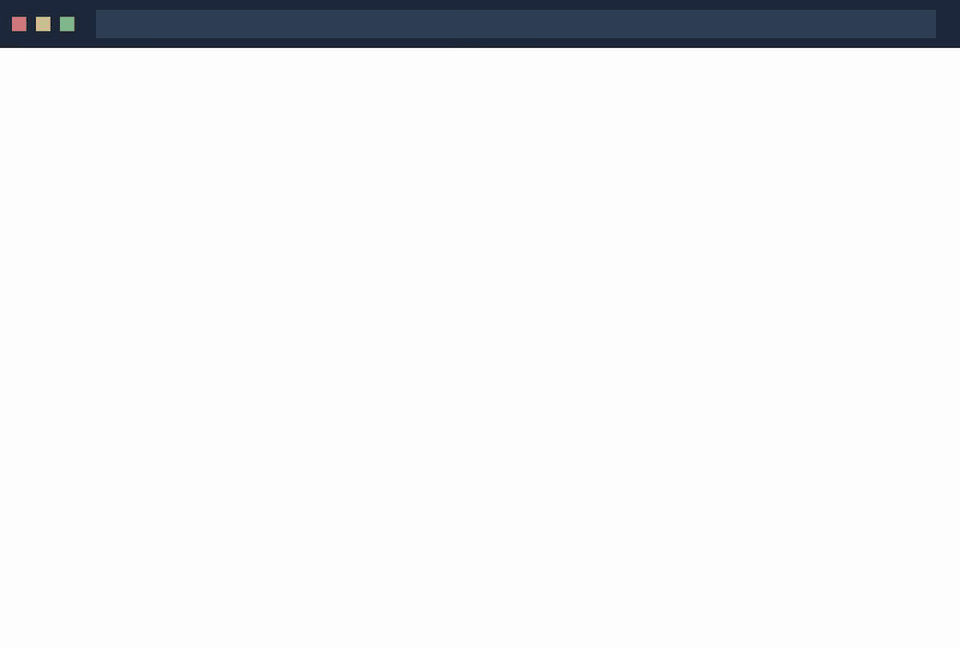

# Stapler Squad [](https://github.com/TylerStaplerAtFanatics/stapler-squad/actions/workflows/build.yml) [](https://github.com/TylerStaplerAtFanatics/stapler-squad/releases/latest)

[Stapler Squad](https://TylerStaplerAtFanatics.github.io/stapler-squad/) is a web-based mission control for running multiple AI coding agents ([Claude Code](https://github.com/anthropics/claude-code), [Codex](https://github.com/openai/codex), [Gemini](https://github.com/google-gemini/gemini-cli), [Aider](https://github.com/Aider-AI/aider)) simultaneously — with a real-time dashboard, automatic approval rules, and a structured review queue. Run it with `ssq`, then open `http://localhost:8543`.



<details>
<summary>Full video</summary>
<video src="assets/demo.webm" width="100%" autoplay loop muted controls></video>
</details>

→ [Feature screenshots](docs/features.md)

### Highlights

**Visibility**
- **Real-time dashboard** — status badges, diff stats, tags, and approvals for all agents in one view
- **Live terminal streaming** — full xterm.js terminal per session, no SSH required
- **Diff viewer** — per-session git diff with VCS context at a glance
- **Notifications** — real-time alerts when agents need attention

**Organisation**
- **Instant search** — filter across titles, paths, branches, and tags as you type
- **Tag-based grouping** — view sessions across 8 grouping strategies (tag, category, status, branch, and more)
- **Workspace switcher** — manage multiple project contexts from one UI
- **Bulk actions** — select and act on multiple sessions simultaneously

**Review & Approval**
- **Auto-approval rules engine** — 42 built-in rules block dangerous operations automatically; add custom rules to approve safe, repetitive actions without manual review
- **Review Queue** — structured triage before any agent change reaches your codebase
- **Approval analytics** — visualise decision trends and classifier performance over time

**History & Debugging**
- **History search** — searchable, filterable record of every agent action across all sessions
- **Logs viewer** — live-tail application logs with time range, export, and density controls
- **Config viewer** — inspect and understand your current configuration from the UI

**Infrastructure**
- Each agent gets its own **isolated git workspace** — no branch conflicts

<br />

### Installation

Both Homebrew and manual installation will install Stapler Squad as `ssq` on your system.

#### Homebrew

```bash
brew tap TylerStaplerAtFanatics/stapler-squad https://github.com/TylerStaplerAtFanatics/stapler-squad && brew install TylerStaplerAtFanatics/stapler-squad/stapler-squad
```

This installs both `stapler-squad` and the `ssq` alias.

#### Manual (pre-built binary)

Download and install the latest pre-built binary:

```bash
curl -fsSL https://raw.githubusercontent.com/TylerStaplerAtFanatics/stapler-squad/main/install.sh | bash
```

This puts the `ssq` binary in `~/.local/bin`.

To use a custom name for the binary:

```bash
curl -fsSL https://raw.githubusercontent.com/TylerStaplerAtFanatics/stapler-squad/main/install.sh | bash -s -- --name <your-binary-name>
```

#### Build from Source

Build and install directly from source. The script installs Go via Homebrew if it isn't already present, then compiles the full application (web UI + server) and puts `ssq` in `~/.local/bin`:

```bash
curl -fsSL https://raw.githubusercontent.com/TylerStaplerAtFanatics/stapler-squad/main/install.sh | bash -s -- --from-source
```

Or step by step:

```bash
# 1. Install build dependencies (Go, Node.js, buf)
brew install go node buf

# 2. Clone the repository
git clone https://github.com/TylerStaplerAtFanatics/stapler-squad.git
cd stapler-squad

# 3. Build (compiles proto code, Next.js web UI, and Go binary)
make build

# 4. Install to ~/.local/bin
cp stapler-squad ~/.local/bin/ssq
```

> `node` and `buf` are required to compile the web UI and protobuf definitions. `make build` will install them automatically via Homebrew if they are missing.

### Prerequisites

- [tmux](https://github.com/tmux/tmux/wiki/Installing)
- [gh](https://cli.github.com/)

### Browser Passthrough

Browser passthrough lets agents (or you) open a real browser inside a session. The stapler-squad UI shows a live, interactive view of that browser in a **Browser** tab — mouse clicks, scrolls, drags, and keyboard input all work from the UI.

Each session with browser passthrough enabled gets its own isolated virtual display (Xvfb). The `DISPLAY` environment variable is injected automatically into the tmux session so any GUI application the agent launches appears on that display. When a Chrome or Chromium window is detected, the Browser tab becomes active and streams the live view via noVNC.

#### Required packages

| Package | Arch | Debian / Ubuntu |
|---|---|---|
| Xvfb (virtual framebuffer) | `xorg-server-xvfb` | `xvfb` |
| x11vnc (VNC server) | `x11vnc` | `x11vnc` |
| xdotool (window detection) | `xdotool` | `xdotool` |
| Chrome (recommended) | `google-chrome` (AUR) | via [Google's apt repo](https://www.google.com/chrome/) |
| Chromium (alternative) | `chromium` | `chromium-browser` |

**Arch:**
```bash
sudo pacman -S xorg-server-xvfb x11vnc xdotool chromium
# or install google-chrome from AUR: yay -S google-chrome
```

**Debian / Ubuntu:**
```bash
sudo apt install xvfb x11vnc xdotool chromium-browser
# or install Google Chrome from https://www.google.com/chrome/
```

#### Graceful degradation

Stapler Squad detects missing dependencies at startup and degrades gracefully — the Browser tab is hidden entirely on hosts where the required packages are absent. All other features continue to work normally. A warning is logged listing the missing binaries.

#### Opening a browser

Agents can launch Chrome or Chromium directly — any command that starts the browser will be detected automatically within ~500 ms. The `$DISPLAY` variable is already set in the session environment.

For convenience, the `scripts/launch-browser.sh` helper selects the available browser and applies the correct flags:

```bash
# Open the default blank page
scripts/launch-browser.sh

# Open a specific URL
scripts/launch-browser.sh https://example.com
```

Agents can also call the browser directly:

```bash
google-chrome --no-sandbox --disable-dev-shm-usage --disable-gpu "$URL"
chromium --no-sandbox --disable-dev-shm-usage --disable-gpu "$URL"
```

#### macOS

Browser passthrough is Linux-only in v1 (requires Xvfb). macOS support via Apple Remote Desktop / Screen Sharing is planned for a future release.

### Configuration

Configuration is stored in `~/.stapler-squad/config.json`. You can view the location with `ssq debug`.

#### Application Data Directory

Stapler Squad stores all application data in `~/.stapler-squad/`:

```
~/.stapler-squad/
├── logs/                    # Application logs (rotated automatically)
│   ├── stapler-squad.log     # Main application log
│   └── debug.log           # Detailed debug information
├── worktrees/              # Git worktrees for isolated sessions
│   ├── session-name_hash/  # Individual worktree directories
│   └── ...
├── config.json            # Application configuration
└── sessions.db            # Session state (SQLite)
```

#### Logging Configuration

Logs are stored in `~/.stapler-squad/logs/` by default and include log rotation features. Configure logging with these options:

```json
{
  "logs_enabled": true,
  "logs_dir": "",  // Empty for default location (~/.stapler-squad/logs/)
  "log_max_size": 10,  // Max log file size in MB before rotation
  "log_max_files": 5,  // Max number of rotated files to keep
  "log_max_age": 30,  // Max age in days for rotated files
  "log_compress": true,  // Whether to compress rotated files
  "use_session_logs": true,  // Whether to create separate log files for each session
  "tmux_session_prefix": "staplerssq_"  // Custom prefix for tmux session isolation
}
```

#### Performance Configuration

For process isolation when running multiple stapler-squad instances, configure a unique tmux session prefix:

```json
{
  "tmux_session_prefix": "myproject_"
}
```

### Usage

```
Usage:
  ssq [flags]
  ssq [command]

Available Commands:
  completion  Generate the autocompletion script for the specified shell
  debug       Print debug information like config paths
  help        Help about any command
  reset       Reset all stored instances
  version     Print the version number of stapler-squad

Flags:
  -y, --autoyes          [experimental] If enabled, all instances will automatically accept prompts for claude code & aider
  -h, --help             help for stapler-squad
  -p, --program string   Program to run in new instances (e.g. 'aider --model ollama_chat/gemma3:1b')
```

Run the application with:

```bash
ssq
```
NOTE: The default program is `claude` and we recommend using the latest version.

<br />

<b>Using Stapler Squad with other AI assistants:</b>
- For [Codex](https://github.com/openai/codex): Set your API key with `export OPENAI_API_KEY=<your_key>`
- Launch with specific assistants:
   - Codex: `ssq -p "codex"`
   - Aider: `ssq -p "aider ..."`
   - Gemini: `ssq -p "gemini"`
- Make this the default, by modifying the config file (locate with `ssq debug`)

### Development

#### Building from Source

**Prerequisites** — install [Homebrew](https://brew.sh), then:

```bash
brew install tmux gh
```

> `go`, `buf`, and `node` are installed automatically by the Makefile via Homebrew (or [asdf](https://asdf-vm.com) if you have it).

```bash
# Clone the repository
git clone https://github.com/TylerStaplerAtFanatics/stapler-squad.git
cd stapler-squad

# Build (auto-installs go, buf, and node via Homebrew if missing)
make build

# Install analysis and dev tools
make dev-setup

# Quick validation (build + test + lint)
make quick-check

# Run the server
./stapler-squad
```

#### Using the Makefile

The project includes a comprehensive Makefile for streamlined development:

```bash
# Show all available commands
make help

# Development workflows
make build         # Build the application
make test          # Run tests
make test-coverage # Generate HTML coverage report
make pre-commit    # Full pre-commit validation
make all           # Complete workflow: clean + build + test + analyze

# Code quality and analysis
make analyze       # Run all static analysis tools
make nil-safety    # Comprehensive nil safety analysis
make security      # Security vulnerability scanning
make lint          # Code style and quality checks
make format        # Format code with gofmt

# Performance testing
make benchmark         # Full benchmarks (runs in background)
make profile-cpu       # CPU profiling analysis

# Demo recording
make demo-video        # Record demo, add browser chrome, export GIF (assets/demo.webm + assets/demo.gif)
make demo-post-process # Re-run post-processing only (add chrome frame + regenerate GIF)

# Tool management
make install-tools # Install all development tools
make validate-env  # Check tool installation status
make clean         # Clean build artifacts
```

#### Manual Testing Commands

```bash
# Run all tests
go test ./...

# Run tests with coverage
go test -cover ./...

# Run specific package tests
go test ./ui
go test ./app
go test ./session

# Run core integration tests
go test ./session -run "TestComprehensiveSessionCreation|TestSessionRecoveryScenarios" -v

# Run performance benchmarks (WARNING: Long running - use make benchmark instead)
go test -bench=BenchmarkNavigation -benchmem ./app -timeout=10m &
go test -bench=BenchmarkInstanceChangedComponents -benchmem ./app -timeout=10m &
go test -bench=BenchmarkListRendering -benchmem ./app -timeout=10m &
```

**Test Infrastructure:**
- Tests use isolated tmux sockets to prevent conflicts with production sessions
- Mock executors for fast, reliable testing without external dependencies
- Comprehensive session lifecycle testing including git worktree integration
- All tests complete in <30s (core session tests) with proper isolation

#### Code Quality Tools

Stapler Squad uses comprehensive static analysis for code quality:

```bash
# Install analysis tools
make install-tools

# Nil safety analysis (prevents panics)
make nil-safety         # All nil safety tools
make nilaway           # Advanced nil flow analysis
go vet -nilness ./...  # Built-in Go nil analyzer

# Comprehensive static analysis
make staticcheck       # Production-grade analyzer
make security          # Security vulnerability scan
make lint             # Multi-tool linting suite
```

**Required Development Tools:**
- [NilAway](https://github.com/uber-go/nilaway) - Advanced nil pointer safety
- [Staticcheck](https://staticcheck.dev/) - Go static analyzer
- [golangci-lint](https://golangci-lint.run/) - Meta-linter suite
- [gosec](https://github.com/securego/gosec) - Security analyzer

Install all tools with: `make install-tools`

#### claude-mux (External Terminal Multiplexer)

`claude-mux` wraps AI assistant commands with a PTY multiplexer so Stapler Squad can stream terminal output from any external terminal (IntelliJ, VS Code, etc.) into the web UI in real time.

**Build and install:**

```bash
# Build the binary locally
make build-mux

# Build and install to ~/.local/bin
make install-mux
```

Or run the install script directly from the project root:

```bash
./scripts/install-mux.sh
```

Ensure `~/.local/bin` is in your `PATH`:

```bash
export PATH="$HOME/.local/bin:$PATH"
```

**Shell alias (recommended):**

```bash
alias claude='claude-mux claude'
```

Add this to `~/.zshrc`, `~/.bashrc`, or equivalent, then reload: `source ~/.zshrc`.

**Basic usage:**

```bash
# Start a Claude session — automatically discovered by Stapler Squad
claude-mux claude

# Custom session name
claude-mux -n "api-refactor" claude

# List active sessions
claude-mux --list

# Reattach to an existing session after restart
claude-mux --attach <session-name>
```

**IDE configuration — IntelliJ IDEA / PyCharm / WebStorm:**

1. Settings → Tools → Terminal
2. Set **Shell path** to: `~/.local/bin/claude-mux`
3. Set **Shell arguments** to: `claude`
4. Restart the IDE terminal

**IDE configuration — VS Code:**

Add to `settings.json`:

```json
"terminal.integrated.profiles.osx": {
  "claude-mux": {
    "path": "~/.local/bin/claude-mux",
    "args": ["claude"]
  }
}
```

Set `terminal.integrated.defaultProfile.osx` to `"claude-mux"`.

<br />

### FAQs

#### Failed to start new session

If you get an error like `failed to start new session: timed out waiting for tmux session`:

1. **Update the underlying program**: Ensure you're using the latest version of `claude` or your chosen AI assistant
2. **Check logs**: Review `~/.stapler-squad/logs/stapler-squad.log` for detailed error information
3. **Verify tmux**: Make sure tmux is installed and working (`tmux -V`)
4. **Check for conflicts**: If running multiple stapler-squad instances, configure unique `tmux_session_prefix` values in config.json

**Debugging Session Creation:**
- Logs show detailed information about tmux commands, git operations, and timing
- Look for patterns like "timed out waiting for tmux session" or external command hangs
- Check if `which claude` or other external commands are blocking

### Web UI

Stapler Squad's web UI is accessible at `http://localhost:8543` when running. It provides:

- Real-time terminal streaming for all sessions
- Session organization with tags, filtering, and search
- **Auto-approval rules engine** — built-in and custom rules with risk-level classification
- **Approval analytics dashboard** — visualise decision trends and classifier performance
- **Review Queue** — triage pending agent actions before they're applied
- **Workspace switcher** — manage multiple project contexts from one UI
- Session logs and diff preview

The web UI launches automatically when you run `ssq`.

### How It Works

1. **tmux** to create isolated terminal sessions for each agent
2. **git worktrees** to isolate codebases so each session works on its own branch
3. A web UI for real-time session management, approvals, and review

### Background

Stapler Squad started as a fork of [claude-squad](https://github.com/smtg-ai/claude-squad), a TUI for managing multiple Claude Code sessions. Two things pushed me toward a full rewrite:

**A browser is a better interface for this job.** A web UI opens instantly in multiple windows, works over SSH without port-forwarding a terminal, and lets you monitor agents from any device. A Charm TUI is great for a single focused session — less so when you have six agents running across different services and you want to glance at all of them while doing something else.

**Claude is better at building web UIs than TUIs.** The Charm/Bubble Tea ecosystem is relatively niche, which means less training data, less reliable code generation, and slower iteration. React and Next.js are Claude's home turf — features that would take days to wrangle in a TUI come together in hours.

The result is opinionated toward my own workflow: approval gates before agent changes land, a rules engine to automate the repetitive stuff, and a review queue so nothing slips through unnoticed. If that matches how you think about running AI agents, you'll feel at home. If not, the original claude-squad may be a better fit.

### License

[AGPL-3.0](LICENSE.md)

### Star History

[](https://www.star-history.com/#TylerStaplerAtFanatics/stapler-squad&Date)
