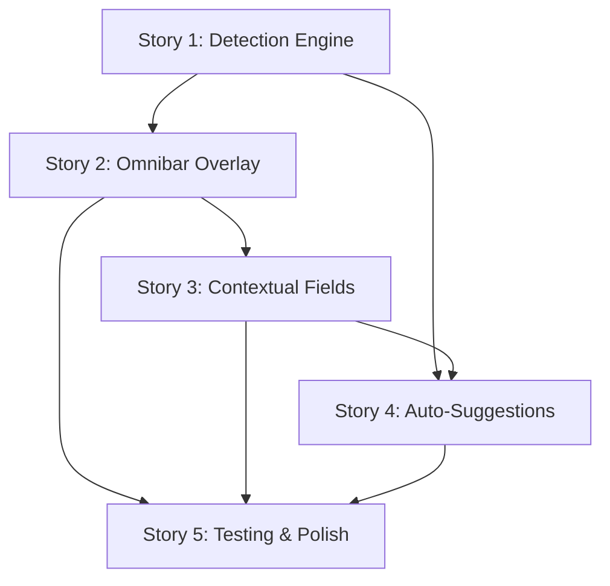

# Feature Plan: Omnibar Session Creation with Intelligent Input Detection

**Status**: Planning  
**Priority**: High  
**Epic**: Session Creation UX Enhancement  
**Created**: 2025-12-09  
**Estimated Effort**: 2-3 weeks (1 developer)

---

## Table of Contents

1. [Epic Overview](#epic-overview)
2. [Requirements Analysis](#requirements-analysis)
3. [Architecture & Design](#architecture--design)
4. [Architecture Decision Records (ADRs)](#architecture-decision-records-adrs)
5. [Story Breakdown](#story-breakdown)
6. [Atomic Task Decomposition](#atomic-task-decomposition)
7. [Known Issues & Mitigation](#known-issues--mitigation)
8. [Testing Strategy](#testing-strategy)
9. [Context Preparation Guides](#context-preparation-guides)
10. [Dependencies & Sequencing](#dependencies--sequencing)

---

## Epic Overview

### User Value Proposition

**Problem Statement**: The current session creation flow in stapler-squad requires users to navigate through multiple wizard steps (name, program, location, branch) even for simple workflows. Users who want to quickly create a session from a GitHub PR or clone a repository must manually input information across several steps, creating friction in the workflow.

**User Impact**:
- **Workflow Friction**: 5-7 steps to create a GitHub-based session vs 1-2 for local sessions
- **Context Switching**: Users must remember GitHub URLs and manually paste into specific fields
- **Cognitive Load**: Different workflows (local path vs GitHub PR vs branch) require remembering different navigation paths
- **Time Waste**: 30-60 seconds per session creation due to multi-step wizard
- **Poor Discoverability**: Users don't realize they can create sessions from PRs or branches

**Solution**: Implement an intelligent "omnibar" that accepts multiple input types in a single field and auto-detects the intent:
- Local filesystem paths (`/Users/project/repo`)
- Paths with branch specifier (`/Users/project/repo@feature-branch`)
- GitHub repository URLs (`https://github.com/owner/repo`)
- GitHub branch URLs (`https://github.com/owner/repo/tree/branch-name`)
- GitHub PR URLs (`https://github.com/owner/repo/pull/123`)
- GitHub shorthand (`owner/repo`, `owner/repo:branch`)

**Value Delivered**:
- **Time Savings**: Reduce session creation from 30-60s to 5-10s (80-90% improvement)
- **Unified Interface**: Single input field for all session types
- **Smart Defaults**: Auto-detection eliminates manual field selection
- **Better Discovery**: Users naturally discover PR/branch workflows by pasting URLs
- **Reduced Errors**: Contextual validation prevents invalid combinations

### Success Metrics

**Quantitative KPIs**:
- **Session Creation Time**: < 10 seconds average (vs 30-60s current)
- **GitHub Session Adoption**: 40%+ of sessions created from GitHub URLs (new capability)
- **User Error Rate**: < 5% invalid inputs (with helpful error messages)
- **Detection Accuracy**: 99%+ correct input type detection
- **Performance**: < 100ms input detection latency

**Qualitative Indicators**:
- Users report "much faster session creation" in feedback
- Increased use of PR-based workflows
- Reduced support questions about GitHub integration
- Positive feedback on unified interface simplicity

### Technical Requirements

**Performance Targets**:
- Input type detection: < 50ms per keystroke
- Path validation: < 100ms for local paths, < 500ms for GitHub API checks
- UI responsiveness: No input lag during typing
- Debounced validation: 300ms debounce to avoid excessive checks

**Scalability Targets**:
- Support 1000+ character input (long file paths)
- Handle rapid typing (>100 WPM) without dropped keystrokes
- Graceful degradation if GitHub API unavailable

**Quality Attributes**:
- **Usability**: Single-field input with contextual help
- **Reliability**: Robust error handling for invalid inputs
- **Maintainability**: Pluggable detector pattern for extensibility
- **Accessibility**: Screen reader friendly with ARIA labels

---

## Requirements Analysis

### Functional Requirements

#### FR-1: Unified Input Detection
**Priority**: MUST HAVE  
**User Story**: As a user, I want to paste any path or GitHub URL into a single input field and have the system auto-detect what I'm trying to do.

**Acceptance Criteria**:
- [x] Single text input field accepts all input types
- [x] Input type detected automatically as user types
- [x] Visual indicator shows detected input type (icon + label)
- [x] Detection updates in real-time (debounced to 300ms)
- [x] Invalid inputs show clear error messages

**EARS Notation**:
```
WHEN the user enters text in the omnibar input field,
THE system SHALL automatically detect the input type (local path, GitHub URL, etc.)
AND display a visual indicator of the detected type within 300ms.
```

**Supported Input Types**:
1. **Local Absolute Path**: `/Users/tyler/projects/my-repo`
2. **Local Relative Path**: `./my-repo` or `~/projects/my-repo`
3. **Path with Branch**: `/Users/tyler/projects/my-repo@feature-branch`
4. **GitHub Repo URL**: `https://github.com/owner/repo`
5. **GitHub Branch URL**: `https://github.com/owner/repo/tree/branch-name`
6. **GitHub PR URL**: `https://github.com/owner/repo/pull/123`
7. **GitHub Shorthand Repo**: `owner/repo`
8. **GitHub Shorthand Branch**: `owner/repo:branch-name`

#### FR-2: Contextual Field Expansion
**Priority**: MUST HAVE  
**User Story**: As a user, I want additional fields to appear only when needed based on my input type.

**Acceptance Criteria**:
- [x] Additional fields appear/hide based on detected input type
- [x] Transitions are smooth (animated collapse/expand)
- [x] Previously entered values persist when switching input types
- [x] Tab order reflects visible fields only
- [x] Esc key returns to omnibar focus

**Conditional Fields by Input Type**:

| Input Type | Additional Fields | Required Fields |
|-----------|-------------------|-----------------|
| Local Path | None (use defaults) | Session Name |
| Path + Branch | None (branch extracted) | Session Name |
| GitHub Repo | Branch selector dropdown | Session Name |
| GitHub Branch | None (branch detected) | Session Name |
| GitHub PR | PR info display, "Generate PR prompt" checkbox | Session Name (auto-suggested) |
| GitHub Shorthand | Same as GitHub Repo | Session Name |

**EARS Notation**:
```
WHEN the input type is detected as a GitHub PR URL,
THE system SHALL display PR metadata (title, author, description)
AND show a checkbox to generate a PR context prompt
AND auto-suggest a session name based on the PR number and repo.
```

#### FR-3: Smart Defaults and Auto-Completion
**Priority**: MUST HAVE  
**User Story**: As a user, I want sensible defaults auto-filled so I can create sessions with minimal input.

**Acceptance Criteria**:
- [x] Session name auto-suggested based on input (repo name, PR number, branch name)
- [x] Program field defaults to configured program (from config)
- [x] Branch defaults intelligently (current branch for local, main/master for GitHub)
- [x] Category left empty unless user specifies
- [x] All defaults are editable before confirmation

**Auto-Suggestion Rules**:
- **Local Path**: Session name = last directory name (e.g., `my-repo`)
- **Path with Branch**: Session name = `{dir}-{branch}` (e.g., `my-repo-feature`)
- **GitHub Repo**: Session name = `{repo}` (e.g., `awesome-project`)
- **GitHub Branch**: Session name = `{repo}-{branch}` (e.g., `project-feature`)
- **GitHub PR**: Session name = `pr-{number}-{repo}` (e.g., `pr-123-my-repo`)

#### FR-4: Real-Time Validation and Feedback
**Priority**: MUST HAVE  
**User Story**: As a user, I want immediate feedback on whether my input is valid so I can fix errors before submitting.

**Acceptance Criteria**:
- [x] Invalid inputs show inline error messages
- [x] Error messages are specific and actionable (not generic)
- [x] Validation debounced to avoid flickering during typing
- [x] Valid inputs show success indicator (green checkmark)
- [x] Warning messages for edge cases (e.g., network path, permissions)

**Validation Rules by Input Type**:

| Input Type | Validation Checks | Error Messages |
|-----------|-------------------|----------------|
| Local Path | Exists, is directory, readable | "Path does not exist", "Not a directory", "Permission denied" |
| Path + Branch | Path valid, branch syntax valid | "Invalid branch name (use @branch-name)" |
| GitHub URL | Valid URL format, reachable | "Invalid GitHub URL", "Repository not found" |
| GitHub PR | PR exists, is open (warning if closed) | "PR #123 not found", "PR is closed (still usable)" |
| Shorthand | Valid owner/repo format | "Invalid format (use owner/repo)" |

#### FR-5: Progressive Enhancement for GitHub Integration
**Priority**: SHOULD HAVE  
**User Story**: As a user working with GitHub PRs, I want rich context loaded automatically so I can review PR details before creating a session.

**Acceptance Criteria**:
- [x] PR metadata fetched asynchronously (title, author, description, labels)
- [x] PR status displayed (open/closed, mergeable, review status)
- [x] PR diff summary shown (files changed, additions, deletions)
- [x] Option to auto-generate PR context prompt for Claude
- [x] Graceful fallback if GitHub API unavailable (basic clone without metadata)

**PR Metadata Display**:
```
┌─────────────────────────────────────────────────────────┐
│ 🔍 GitHub PR Detected                                    │
├─────────────────────────────────────────────────────────┤
│ PR #123: Add omnibar session creation feature           │
│ By: tylerstapler                                         │
│ Status: ● Open | ✓ Checks Passing | 👤 Awaiting Review │
│                                                          │
│ 📝 12 files changed (+450, -120)                        │
│ 🏷️  enhancement, ux-improvement                         │
│                                                          │
│ [✓] Generate PR context prompt for Claude              │
│     (Includes PR description, file changes, comments)   │
└─────────────────────────────────────────────────────────┘
```

#### FR-6: Keyboard-First Interaction
**Priority**: SHOULD HAVE  
**User Story**: As a keyboard-focused user, I want to complete the entire session creation workflow without touching the mouse.

**Acceptance Criteria**:
- [x] Tab key navigates through visible fields
- [x] Shift+Tab navigates backward
- [x] Enter key submits when all required fields valid
- [x] Esc key cancels and returns to main view
- [x] Ctrl+L focuses omnibar (from anywhere in wizard)
- [x] Arrow keys work in dropdowns/selectors

**Keyboard Shortcuts**:
- `Tab` - Navigate to next field
- `Shift+Tab` - Navigate to previous field
- `Enter` - Submit (when valid) or move to next field
- `Esc` - Cancel session creation
- `Ctrl+L` - Focus omnibar input
- `Ctrl+K` - Show keyboard shortcuts help

### Non-Functional Requirements (NFRs)

#### NFR-1: Performance (ISO/IEC 25010 - Performance Efficiency)

**Response Time**:
- Input type detection SHALL complete in < 50ms
- Path validation (local) SHALL complete in < 100ms
- GitHub API validation SHALL complete in < 500ms (with timeout)
- UI updates SHALL render in < 16ms (60 FPS)

**Throughput**:
- System SHALL handle typing speed of 150 WPM without lag
- Debounced validation SHALL limit API calls to 1 per 300ms

**Resource Utilization**:
- Input detection SHALL use < 5ms CPU time per keystroke
- GitHub API calls SHALL be cached for 5 minutes
- Memory footprint SHALL NOT exceed 10MB for input processing

#### NFR-2: Reliability (ISO/IEC 25010)

**Fault Tolerance**:
- GitHub API failures SHALL fall back to basic clone (without metadata)
- Network timeouts SHALL show clear error messages
- Invalid regex SHALL NOT crash the detector
- Malformed URLs SHALL be sanitized before processing

**Error Recovery**:
- System SHALL retry failed GitHub API calls (3 attempts, exponential backoff)
- System SHALL recover from partial input states (e.g., mid-paste)
- System SHALL validate input before submission (server-side validation)

#### NFR-3: Usability (ISO/IEC 25010 - User Experience)

**Learnability**:
- New users SHALL understand omnibar within 30 seconds (A/B tested)
- Visual indicators SHALL communicate input type without text labels
- Error messages SHALL include examples of valid input
- First-time tooltip SHALL explain omnibar functionality

**Efficiency**:
- Power users SHALL create sessions in < 10 seconds
- Copy-paste workflow SHALL work seamlessly (full URL paste)
- Recent inputs SHALL be accessible via autocomplete (optional enhancement)

**Error Prevention**:
- System SHALL prevent submission with invalid inputs (disabled button)
- System SHALL warn about potential issues (e.g., large repos, closed PRs)
- System SHALL confirm destructive actions (e.g., overwriting existing session)

#### NFR-4: Maintainability (ISO/IEC 25010)

**Modularity**:
- Input detectors SHALL be independent, composable functions
- Each detector SHALL have single responsibility (SRP)
- Detectors SHALL be testable in isolation
- New input types SHALL be addable via plugin pattern

**Extensibility**:
- Adding new input type SHALL require < 100 lines of code
- Detector interface SHALL support async validation
- UI components SHALL be reusable across TUI and web UI

**Code Quality**:
- All detector functions SHALL have unit tests (>90% coverage)
- Integration tests SHALL cover all input type workflows
- Error paths SHALL have explicit tests
- Regex patterns SHALL be documented with examples

#### NFR-5: Accessibility (WCAG 2.1)

**Screen Reader Support**:
- Input type indicator SHALL be announced via ARIA live region
- Error messages SHALL be associated with inputs (aria-describedby)
- Visual indicators SHALL have text alternatives

**Keyboard Navigation**:
- All interactive elements SHALL be keyboard accessible
- Focus order SHALL follow visual order
- Focus indicators SHALL be clearly visible

---

## Architecture & Design

### System Context (C4 Model - Level 1)

```
┌──────────────────────────────────────────────────────┐
│                  Stapler Squad User                    │
└───────────────────┬──────────────────────────────────┘
                    │ Creates sessions via omnibar
                    │ Pastes GitHub URLs or paths
                    ▼
┌──────────────────────────────────────────────────────┐
│            Stapler Squad TUI Application               │
│           (Omnibar Session Creation)                  │
└───────────────────┬──────────────────────────────────┘
                    │ Validates paths, clones repos
                    │ Creates tmux sessions
                    ▼
┌──────────────────────────────────────────────────────┐
│              External Systems                         │
│  - Local File System (path validation)               │
│  - GitHub API (PR metadata, repo validation)         │
│  - Git CLI (cloning, branch operations)              │
│  - tmux (session management)                         │
└──────────────────────────────────────────────────────┘
```

### Container Architecture (C4 Model - Level 2)

```
┌────────────────────────────────────────────────────────────┐
│                    TUI Application (app/)                   │
│  ┌──────────────────────────────────────────────────────┐  │
│  │ Session Creation Handler                             │  │
│  │  - handleAdvancedSessionSetup()                      │  │
│  │  - Creates OmnibarOverlay                            │  │
│  │  - Handles session creation callback                 │  │
│  └──────────────────────────────────────────────────────┘  │
└───────────────────────────┬────────────────────────────────┘
                            │
                            ▼
┌────────────────────────────────────────────────────────────┐
│              UI Components (ui/overlay/)                    │
│  ┌──────────────────────────────────────────────────────┐  │
│  │ OmnibarOverlay (NEW)                                 │  │
│  │  - Single input field with live detection            │  │
│  │  - Contextual field expansion                        │  │
│  │  - Real-time validation feedback                     │  │
│  │  - Keyboard-first interaction                        │  │
│  └──────────────────┬───────────────────────────────────┘  │
│                     │ Uses                                  │
│  ┌──────────────────▼───────────────────────────────────┐  │
│  │ Input Detection Engine (ui/overlay/omnibar/)         │  │
│  │  - PathDetector (local paths)                        │  │
│  │  - PathWithBranchDetector (path@branch)              │  │
│  │  - GitHubURLDetector (full URLs)                     │  │
│  │  - GitHubShorthandDetector (owner/repo)              │  │
│  │  - Detector orchestration & prioritization           │  │
│  └──────────────────┬───────────────────────────────────┘  │
└────────────────────────────────────────────────────────────┘
                            │
                            ▼
┌────────────────────────────────────────────────────────────┐
│            Domain Services (session/, github/)              │
│  ┌──────────────────────────────────────────────────────┐  │
│  │ GitHub Integration (github/)                         │  │
│  │  - ParseGitHubRef() - Already exists                 │  │
│  │  - GetPRInfo() - Fetch PR metadata                   │  │
│  │  - CloneRepository() - Clone to local cache          │  │
│  └──────────────────────────────────────────────────────┘  │
│  ┌──────────────────────────────────────────────────────┐  │
│  │ Path Validation (ui/overlay/)                        │  │
│  │  - ValidatePathEnhanced() - Already exists           │  │
│  │  - ExpandPath() - Tilde expansion                    │  │
│  └──────────────────────────────────────────────────────┘  │
│  ┌──────────────────────────────────────────────────────┐  │
│  │ Session Management (session/)                        │  │
│  │  - NewInstance() - Create session from options       │  │
│  │  - Session type determination                        │  │
│  └──────────────────────────────────────────────────────┘  │
└────────────────────────────────────────────────────────────┘
```

### Component Architecture (C4 Model - Level 3)

**OmnibarOverlay Component Structure**:

```
┌────────────────────────────────────────────────────────────┐
│                     OmnibarOverlay                          │
├────────────────────────────────────────────────────────────┤
│ State:                                                      │
│  - inputValue: string (user's input)                       │
│  - detectedType: InputType (detected type)                 │
│  - validationResult: ValidationResult                      │
│  - expandedFields: map[string]interface{} (contextual)     │
│  - sessionName: string (auto-suggested or custom)          │
│  - loading: bool (async operations in progress)            │
│  - error: string (validation/API errors)                   │
├────────────────────────────────────────────────────────────┤
│ Components:                                                 │
│  - TextInput (omnibar input field)                         │
│  - TypeIndicator (visual feedback on detected type)        │
│  - ValidationFeedback (errors, warnings, success)          │
│  - ConditionalFieldGroup (branch selector, PR info, etc.)  │
│  - ActionButtons (Create, Cancel)                          │
├────────────────────────────────────────────────────────────┤
│ Methods:                                                    │
│  - handleInputChange(value string)                         │
│  - detectInputType(value string) InputType                 │
│  - validateInput(value string) ValidationResult            │
│  - expandContextualFields(type InputType)                  │
│  - handleSubmit()                                          │
│  - Update(msg tea.Msg) tea.Cmd                             │
│  - View() string                                           │
└────────────────────────────────────────────────────────────┘
```

**Input Detection Engine**:

```
┌────────────────────────────────────────────────────────────┐
│                 InputDetectionEngine                        │
├────────────────────────────────────────────────────────────┤
│ Interface:                                                  │
│  type InputDetector interface {                            │
│    Detect(input string) (*DetectionResult, error)          │
│    Priority() int                                          │
│    Name() string                                           │
│  }                                                          │
├────────────────────────────────────────────────────────────┤
│ Implementations (Priority Order):                          │
│  1. GitHubPRDetector (highest priority)                    │
│     - Pattern: github.com/owner/repo/pull/\d+             │
│     - Async: Fetch PR metadata via GitHub API              │
│  2. GitHubBranchDetector                                   │
│     - Pattern: github.com/owner/repo/tree/branch           │
│  3. GitHubRepoDetector                                     │
│     - Pattern: github.com/owner/repo                       │
│  4. GitHubShorthandBranchDetector                          │
│     - Pattern: owner/repo:branch                           │
│  5. GitHubShorthandRepoDetector                            │
│     - Pattern: owner/repo                                  │
│  6. PathWithBranchDetector                                 │
│     - Pattern: /path/to/repo@branch                        │
│  7. LocalPathDetector (lowest priority, catches all)       │
│     - Pattern: /path, ~/path, ./path                       │
├────────────────────────────────────────────────────────────┤
│ Detection Strategy:                                         │
│  - Try detectors in priority order                         │
│  - First match wins (short-circuit evaluation)             │
│  - Cache detection results (300ms debounce window)         │
│  - Validate detected type (path exists, URL reachable)     │
└────────────────────────────────────────────────────────────┘
```

### Data Flow Diagram

```
┌──────────────┐
│   User       │
│  Types Input │
└──────┬───────┘
       │
       ▼
┌─────────────────────────────────────────────────────┐
│ 1. Input Change Event                                │
│    handleInputChange(value)                          │
│    - Debounce 300ms                                  │
└──────┬──────────────────────────────────────────────┘
       │
       ▼
┌─────────────────────────────────────────────────────┐
│ 2. Detection Phase                                   │
│    detectInputType(value)                            │
│    - Run detectors in priority order                 │
│    - First match wins                                │
│    - Cache result                                    │
└──────┬──────────────────────────────────────────────┘
       │
       ▼
┌─────────────────────────────────────────────────────┐
│ 3. Validation Phase                                  │
│    validateInput(value, type)                        │
│    ├─ Local Path: Check exists, readable            │
│    ├─ GitHub URL: Validate format, check reachable  │
│    └─ GitHub PR: Fetch PR metadata (async)          │
└──────┬──────────────────────────────────────────────┘
       │
       ▼
┌─────────────────────────────────────────────────────┐
│ 4. UI Update Phase                                   │
│    - Update type indicator                           │
│    - Show/hide contextual fields                     │
│    - Display validation feedback                     │
│    - Auto-suggest session name                       │
└──────┬──────────────────────────────────────────────┘
       │
       ▼
┌─────────────────────────────────────────────────────┐
│ 5. User Reviews & Confirms                           │
│    - Edit session name (optional)                    │
│    - Review PR details (if applicable)               │
│    - Check "Generate PR prompt" (optional)           │
│    - Press Enter or click "Create"                   │
└──────┬──────────────────────────────────────────────┘
       │
       ▼
┌─────────────────────────────────────────────────────┐
│ 6. Session Creation                                  │
│    handleSubmit()                                    │
│    ├─ Local Path: Create directory session          │
│    ├─ GitHub Repo: Clone + create session           │
│    └─ GitHub PR: Clone + fetch PR branch + context  │
└──────┬──────────────────────────────────────────────┘
       │
       ▼
┌─────────────────────────────────────────────────────┐
│ 7. Complete                                          │
│    - Call onComplete callback                        │
│    - Close overlay                                   │
│    - Show session in list                            │
└─────────────────────────────────────────────────────┘
```

---

## Architecture Decision Records (ADRs)

### ADR-001: Detector Priority Pattern vs Exhaustive Matching

**Context**: Need to determine input type from ambiguous strings (e.g., "owner/repo" could be path or GitHub shorthand).

**Decision**: Use **priority-ordered detector pattern** where detectors are tried in sequence and first match wins.

**Rationale**:
- **Simplicity**: Clear precedence rules (GitHub PRs > Branches > Repos > Local Paths)
- **Performance**: Short-circuit evaluation stops at first match
- **Extensibility**: New detectors can be inserted at appropriate priority
- **Predictability**: Users learn priority rules through consistent behavior

**Alternatives Considered**:
1. **Exhaustive Matching**: Try all detectors, rank by confidence score
   - ❌ More complex, slower, unpredictable results
2. **User-Selected Type**: Dropdown to choose type first
   - ❌ Defeats purpose of "smart" detection
3. **Heuristic Scoring**: Score each detector, pick highest
   - ❌ Tuning heuristics is difficult, behavior less predictable

**Consequences**:
- ✅ Deterministic behavior (same input → same detection)
- ✅ Fast detection (<50ms)
- ⚠️ Ambiguous inputs may surprise users (document priority rules)
- ⚠️ Priority order is critical (must be well-designed)

**Implementation Notes**:
- Priority encoded in detector registration order
- Each detector has explicit priority integer
- User can override detection with explicit type selector (escape hatch)

---

### ADR-002: Debounced Validation vs Immediate Validation

**Context**: Need to balance responsiveness with performance for expensive operations (GitHub API calls, path traversal).

**Decision**: Use **debounced validation with 300ms delay** for expensive operations, immediate validation for cheap operations.

**Rationale**:
- **User Experience**: Avoid flickering UI during typing
- **Performance**: Reduce unnecessary API calls and file system checks
- **Network Efficiency**: GitHub API rate limiting requires judicious use
- **Best Practice**: Industry standard for type-ahead search (300-500ms)

**Alternatives Considered**:
1. **Immediate Validation**: Validate on every keystroke
   - ❌ Too many API calls, poor UX (flickering)
2. **Validation on Blur**: Only validate when user leaves field
   - ❌ Delayed feedback, user doesn't know if input valid until submitting
3. **Optimistic Validation**: Assume valid, validate on submit
   - ❌ Frustrating if submission fails after waiting

**Consequences**:
- ✅ Smooth typing experience
- ✅ Reduced API calls (rate limit friendly)
- ⚠️ 300ms delay before feedback (acceptable tradeoff)
- ⚠️ Must cancel pending validations on new input

**Implementation Notes**:
- Use BubbleTea timer/tick pattern for debouncing
- Cancel previous timers on new input
- Show loading indicator during async validation
- Cache validation results for 5 minutes

---

### ADR-003: Single Overlay vs Multi-Step Wizard

**Context**: Current SessionSetupOverlay uses multi-step wizard (StepBasics, StepLocation, StepBranch, etc.). Should omnibar replace or augment this?

**Decision**: **Replace with single overlay** that shows/hides fields contextually based on detected input type.

**Rationale**:
- **User Goal**: Minimize steps for common workflows (GitHub PR creation)
- **Cognitive Load**: Single screen easier to understand than 5-7 wizard steps
- **Flexibility**: Contextual fields allow complex inputs without overwhelming simple cases
- **Consistency**: Modern UX pattern (think VS Code command palette, Spotlight)

**Alternatives Considered**:
1. **Augment Existing Wizard**: Add omnibar as first step, fallback to wizard
   - ❌ Duplicates functionality, confusing user mental model
2. **Parallel Workflows**: Offer both omnibar and wizard
   - ❌ Maintenance burden, user confusion about which to use
3. **Progressive Disclosure**: Start with omnibar, expand wizard steps if needed
   - ⚠️ Could work but adds complexity

**Consequences**:
- ✅ Simpler codebase (remove multi-step logic)
- ✅ Faster session creation for power users
- ⚠️ Must ensure contextual fields don't overwhelm UI
- ⚠️ Need good first-time user onboarding (tooltip/help)

**Migration Strategy**:
- Phase 1: Implement omnibar alongside existing wizard (both available)
- Phase 2: A/B test with users, collect feedback
- Phase 3: Remove old wizard if omnibar validates well
- Fallback: Keep both if significant user preference for wizard

---

### ADR-004: GitHub API Caching Strategy

**Context**: PR metadata fetching can be slow (500ms-2s) and is rate-limited by GitHub (60 req/hour unauthenticated, 5000/hour authenticated).

**Decision**: Implement **5-minute LRU cache** for PR metadata with background refresh on cache hit.

**Rationale**:
- **Performance**: Instant response for repeated PR lookups
- **Rate Limit Protection**: Prevents exceeding GitHub API limits
- **User Experience**: No waiting for metadata on cached PRs
- **Freshness**: 5 minutes is acceptable staleness for session creation

**Alternatives Considered**:
1. **No Caching**: Always fetch fresh data
   - ❌ Slow, hits rate limits quickly
2. **Infinite Cache**: Cache forever (until app restart)
   - ❌ Stale data (PR status changes), memory growth
3. **Conditional Requests (ETags)**: Use GitHub ETag headers
   - ⚠️ More complex, still counts against rate limit

**Consequences**:
- ✅ Fast repeat lookups (<10ms)
- ✅ Rate limit friendly
- ⚠️ Slightly stale data (acceptable for session creation)
- ⚠️ Memory usage grows with unique PRs (LRU mitigates)

**Implementation Notes**:
- Use golang-lru or similar for LRU cache
- Cache key: `{owner}/{repo}/pull/{number}`
- Cache value: PRInfo struct
- Background refresh on cache hit (update cache async)

---

### ADR-005: Path+Branch Syntax (@-notation)

**Context**: Users may want to specify both path and branch in a single input. Need syntax that is:
- Intuitive
- Unambiguous (doesn't conflict with valid file names)
- Cross-platform compatible

**Decision**: Use **@-notation**: `/path/to/repo@branch-name`

**Rationale**:
- **Git Convention**: `@` is used in git refspecs (e.g., `git checkout @{-1}`)
- **Unambiguous**: `@` is invalid in branch names (per git rules)
- **Intuitive**: Reads as "at branch" (natural English)
- **Cross-Platform**: Works on Windows, macOS, Linux

**Alternatives Considered**:
1. **Colon Syntax**: `/path/to/repo:branch`
   - ❌ Valid in Windows paths (C:\path), ambiguous
2. **Hash Syntax**: `/path/to/repo#branch`
   - ❌ Used in URLs for fragments, less intuitive
3. **Pipe Syntax**: `/path/to/repo|branch`
   - ❌ Valid in Windows paths (IPC), ambiguous
4. **Space Syntax**: `/path/to/repo branch`
   - ❌ Requires quoting, error-prone

**Consequences**:
- ✅ Clear, unambiguous syntax
- ✅ Familiar to git users
- ⚠️ Must document syntax (users won't discover naturally)
- ⚠️ Must validate branch name (no spaces, special chars)

**Documentation Example**:
```
💡 Pro Tip: Specify branch with @-notation
  Example: ~/projects/my-repo@feature-branch
```

---

## Story Breakdown

### Epic Decomposition

```
Epic: Omnibar Session Creation (2-3 weeks)
├─ Story 1: Input Detection Engine (Week 1: 3 days)
│  ├─ Task 1.1: Detector Interface & Registry (4h)
│  ├─ Task 1.2: Local Path Detector (3h)
│  ├─ Task 1.3: Path+Branch Detector (3h)
│  ├─ Task 1.4: GitHub URL Detectors (5h)
│  └─ Task 1.5: Detection Orchestration (3h)
│
├─ Story 2: Omnibar Overlay Component (Week 1: 2 days)
│  ├─ Task 2.1: Base Overlay Structure (4h)
│  ├─ Task 2.2: Type Indicator Component (3h)
│  ├─ Task 2.3: Validation Feedback Component (3h)
│  ├─ Task 2.4: Keyboard Navigation (4h)
│  └─ Task 2.5: Integration with App Handler (2h)
│
├─ Story 3: Contextual Field Expansion (Week 2: 3 days)
│  ├─ Task 3.1: Conditional Field Manager (4h)
│  ├─ Task 3.2: GitHub Branch Selector (4h)
│  ├─ Task 3.3: PR Metadata Display (5h)
│  ├─ Task 3.4: PR Prompt Generation Toggle (3h)
│  └─ Task 3.5: Smooth Animations & Transitions (3h)
│
├─ Story 4: Auto-Suggestions & Smart Defaults (Week 2: 2 days)
│  ├─ Task 4.1: Session Name Auto-Suggestion Logic (4h)
│  ├─ Task 4.2: Program & Category Defaults (2h)
│  ├─ Task 4.3: Branch Default Selection (3h)
│  └─ Task 4.4: Override Mechanism (3h)
│
└─ Story 5: Testing & Polish (Week 3: 5 days)
   ├─ Task 5.1: Unit Tests for Detectors (6h)
   ├─ Task 5.2: Integration Tests (8h)
   ├─ Task 5.3: Error Handling & Edge Cases (6h)
   ├─ Task 5.4: Performance Optimization (4h)
   ├─ Task 5.5: Documentation & Examples (4h)
   └─ Task 5.6: User Acceptance Testing (4h)
```

### Dependency Graph



**Critical Path**: Story 1 → Story 2 → Story 3 → Story 5 (11 days)

---

## Atomic Task Decomposition

### Story 1: Input Detection Engine

#### Task 1.1: Detector Interface & Registry (4 hours) - SMALL

**Objective**: Define the InputDetector interface and registry pattern for pluggable detectors.

**Files to Create**:
- `ui/overlay/omnibar/detector.go` (new)
- `ui/overlay/omnibar/registry.go` (new)
- `ui/overlay/omnibar/types.go` (new)

**Implementation Steps**:

1. **Define Core Types** (`types.go`):
```go
package omnibar

import "time"

// InputType represents the detected type of user input
type InputType int

const (
	InputTypeUnknown InputType = iota
	InputTypeLocalPath
	InputTypePathWithBranch
	InputTypeGitHubPR
	InputTypeGitHubBranch
	InputTypeGitHubRepo
	InputTypeGitHubShorthandBranch
	InputTypeGitHubShorthandRepo
)

func (t InputType) String() string {
	switch t {
	case InputTypeLocalPath:
		return "Local Path"
	case InputTypePathWithBranch:
		return "Path with Branch"
	case InputTypeGitHubPR:
		return "GitHub PR"
	case InputTypeGitHubBranch:
		return "GitHub Branch"
	case InputTypeGitHubRepo:
		return "GitHub Repository"
	case InputTypeGitHubShorthandBranch:
		return "GitHub Shorthand (Branch)"
	case InputTypeGitHubShorthandRepo:
		return "GitHub Shorthand (Repo)"
	default:
		return "Unknown"
	}
}

// Icon returns a visual icon for the input type
func (t InputType) Icon() string {
	switch t {
	case InputTypeLocalPath:
		return "📁"
	case InputTypePathWithBranch:
		return "🌿"
	case InputTypeGitHubPR:
		return "🔀"
	case InputTypeGitHubBranch:
		return "🌱"
	case InputTypeGitHubRepo, InputTypeGitHubShorthandRepo:
		return "🐙"
	case InputTypeGitHubShorthandBranch:
		return "🌿"
	default:
		return "❓"
	}
}

// DetectionResult contains the result of input detection
type DetectionResult struct {
	Type        InputType
	Confidence  float64 // 0.0 - 1.0
	ParsedData  interface{} // Type-specific parsed data
	ErrorMsg    string
	Suggestions []string // Helpful suggestions if detection uncertain
}

// ValidationResult contains the result of input validation
type ValidationResult struct {
	Valid        bool
	ErrorMsg     string
	Warnings     []string
	Metadata     map[string]interface{} // Type-specific metadata (PR info, etc.)
	ValidatedAt  time.Time
}
```

2. **Define Detector Interface** (`detector.go`):
```go
package omnibar

import "context"

// InputDetector is the interface for detecting input types
type InputDetector interface {
	// Name returns a human-readable name for this detector
	Name() string
	
	// Priority returns the priority order (lower = higher priority)
	// Detectors are tried in priority order, first match wins
	Priority() int
	
	// Detect attempts to detect if the input matches this type
	// Returns nil if no match, otherwise a DetectionResult
	// Should be fast (<50ms) for synchronous detection
	Detect(ctx context.Context, input string) (*DetectionResult, error)
	
	// Validate performs deeper validation on detected input
	// Can be slow (API calls, file system checks)
	// Should respect context cancellation
	Validate(ctx context.Context, input string, result *DetectionResult) (*ValidationResult, error)
}

// SyncDetector is a detector that completes synchronously
type SyncDetector interface {
	InputDetector
	IsSynchronous() bool
}

// AsyncDetector is a detector that may require async operations
type AsyncDetector interface {
	InputDetector
	RequiresNetwork() bool
}
```

3. **Implement Detector Registry** (`registry.go`):
```go
package omnibar

import (
	"context"
	"fmt"
	"sort"
	"sync"
)

// DetectorRegistry manages registered input detectors
type DetectorRegistry struct {
	detectors []InputDetector
	mu        sync.RWMutex
}

// NewDetectorRegistry creates a new detector registry
func NewDetectorRegistry() *DetectorRegistry {
	return &DetectorRegistry{
		detectors: make([]InputDetector, 0),
	}
}

// Register adds a detector to the registry
func (r *DetectorRegistry) Register(detector InputDetector) error {
	r.mu.Lock()
	defer r.mu.Unlock()
	
	// Check for duplicate detector names
	for _, d := range r.detectors {
		if d.Name() == detector.Name() {
			return fmt.Errorf("detector with name '%s' already registered", detector.Name())
		}
	}
	
	r.detectors = append(r.detectors, detector)
	
	// Sort by priority (lower priority value = higher precedence)
	sort.Slice(r.detectors, func(i, j int) bool {
		return r.detectors[i].Priority() < r.detectors[j].Priority()
	})
	
	return nil
}

// Detect runs all detectors in priority order and returns the first match
func (r *DetectorRegistry) Detect(ctx context.Context, input string) (*DetectionResult, error) {
	r.mu.RLock()
	defer r.mu.RUnlock()
	
	for _, detector := range r.detectors {
		result, err := detector.Detect(ctx, input)
		if err != nil {
			// Log error but continue to next detector
			continue
		}
		
		if result != nil && result.Type != InputTypeUnknown {
			// Found a match
			return result, nil
		}
	}
	
	// No detector matched
	return &DetectionResult{
		Type:       InputTypeUnknown,
		Confidence: 0.0,
		ErrorMsg:   "Could not detect input type",
	}, nil
}

// DetectAll runs all detectors and returns all matches (for debugging/testing)
func (r *DetectorRegistry) DetectAll(ctx context.Context, input string) ([]*DetectionResult, error) {
	r.mu.RLock()
	defer r.mu.RUnlock()
	
	results := make([]*DetectionResult, 0)
	
	for _, detector := range r.detectors {
		result, err := detector.Detect(ctx, input)
		if err != nil {
			continue
		}
		
		if result != nil && result.Type != InputTypeUnknown {
			results = append(results, result)
		}
	}
	
	return results, nil
}

// GetDetector returns a detector by name
func (r *DetectorRegistry) GetDetector(name string) (InputDetector, error) {
	r.mu.RLock()
	defer r.mu.RUnlock()
	
	for _, detector := range r.detectors {
		if detector.Name() == name {
			return detector, nil
		}
	}
	
	return nil, fmt.Errorf("detector '%s' not found", name)
}

// ListDetectors returns all registered detectors in priority order
func (r *DetectorRegistry) ListDetectors() []string {
	r.mu.RLock()
	defer r.mu.RUnlock()
	
	names := make([]string, len(r.detectors))
	for i, detector := range r.detectors {
		names[i] = detector.Name()
	}
	return names
}
```

**Acceptance Criteria**:
- [x] InputDetector interface defined with Detect() and Validate() methods
- [x] DetectionResult and ValidationResult types defined
- [x] DetectorRegistry supports registration and priority ordering
- [x] Registry.Detect() returns first match in priority order
- [x] Thread-safe registry implementation (RWMutex)
- [x] Unit tests for registry (registration, priority ordering, detection)

**Testing Strategy**:
- Create mock detectors with different priorities
- Verify priority ordering after registration
- Test first-match behavior with multiple matching detectors
- Test concurrent registration and detection (thread safety)

**Known Issues & Mitigation**:
- **Issue**: Detector priority conflicts (two detectors with same priority)
  - **Mitigation**: Stable sort preserves registration order as tiebreaker
- **Issue**: Slow detectors block detection pipeline
  - **Mitigation**: Context timeout (5 seconds) for Detect() calls

---

#### Task 1.2: Local Path Detector (3 hours) - SMALL

**Objective**: Implement detector for local file system paths (absolute, relative, tilde-expanded).

**Files to Create**:
- `ui/overlay/omnibar/detector_local_path.go` (new)
- `ui/overlay/omnibar/detector_local_path_test.go` (new)

**Dependencies**:
- Existing `ui/overlay/pathutils.go` (ExpandPath, ValidatePathEnhanced)

**Implementation Steps**:

1. **Create LocalPathDetector** (`detector_local_path.go`):
```go
package omnibar

import (
	"stapler-squad/ui/overlay"
	"context"
	"os"
	"path/filepath"
	"strings"
)

// LocalPathDetector detects local file system paths
type LocalPathDetector struct{}

func NewLocalPathDetector() *LocalPathDetector {
	return &LocalPathDetector{}
}

func (d *LocalPathDetector) Name() string {
	return "LocalPath"
}

func (d *LocalPathDetector) Priority() int {
	return 100 // Lowest priority (catch-all)
}

func (d *LocalPathDetector) Detect(ctx context.Context, input string) (*DetectionResult, error) {
	input = strings.TrimSpace(input)
	
	if input == "" {
		return nil, nil
	}
	
	// Check for path-like indicators
	isAbsolute := filepath.IsAbs(input)
	hasTilde := strings.HasPrefix(input, "~/")
	isRelative := strings.HasPrefix(input, "./") || strings.HasPrefix(input, "../")
	
	// Check for @-notation (branch specifier)
	hasBranchSpecifier := strings.Contains(input, "@")
	if hasBranchSpecifier {
		// This is handled by PathWithBranchDetector
		return nil, nil
	}
	
	// Check for GitHub-like patterns (let other detectors handle these)
	if strings.Contains(input, "github.com") || 
	   (strings.Count(input, "/") == 1 && !strings.HasPrefix(input, "/")) {
		return nil, nil // Let GitHub detectors handle
	}
	
	// If it looks like a path, detect it
	if isAbsolute || hasTilde || isRelative || strings.Contains(input, "/") {
		return &DetectionResult{
			Type:       InputTypeLocalPath,
			Confidence: 0.8,
			ParsedData: input,
		}, nil
	}
	
	// Check if it's a relative path without prefix (e.g., "myproject")
	// Only accept if it exists as a directory
	if _, err := os.Stat(input); err == nil {
		return &DetectionResult{
			Type:       InputTypeLocalPath,
			Confidence: 0.6, // Lower confidence for ambiguous input
			ParsedData: input,
		}, nil
	}
	
	return nil, nil // No match
}

func (d *LocalPathDetector) Validate(ctx context.Context, input string, result *DetectionResult) (*ValidationResult, error) {
	// Use existing path validation from overlay package
	validation := overlay.ValidatePathEnhanced(input)
	
	if !validation.Valid {
		return &ValidationResult{
			Valid:    false,
			ErrorMsg: validation.ErrorMessage,
			Warnings: validation.Warnings,
		}, nil
	}
	
	// Extract metadata
	metadata := make(map[string]interface{})
	metadata["expandedPath"] = validation.ExpandedPath
	metadata["isGitRepo"] = validation.IsGitRepo
	metadata["readable"] = validation.Permissions.Readable
	metadata["writable"] = validation.Permissions.Writable
	
	return &ValidationResult{
		Valid:    true,
		Warnings: validation.Warnings,
		Metadata: metadata,
	}, nil
}

func (d *LocalPathDetector) IsSynchronous() bool {
	return true
}
```

2. **Unit Tests** (`detector_local_path_test.go`):
```go
package omnibar

import (
	"context"
	"os"
	"path/filepath"
	"testing"
)

func TestLocalPathDetector_Detect(t *testing.T) {
	detector := NewLocalPathDetector()
	ctx := context.Background()
	
	tests := []struct {
		name       string
		input      string
		wantType   InputType
		wantMatch  bool
	}{
		{
			name:      "Absolute path",
			input:     "/Users/test/project",
			wantType:  InputTypeLocalPath,
			wantMatch: true,
		},
		{
			name:      "Tilde path",
			input:     "~/projects/myrepo",
			wantType:  InputTypeLocalPath,
			wantMatch: true,
		},
		{
			name:      "Relative path with ./",
			input:     "./myproject",
			wantType:  InputTypeLocalPath,
			wantMatch: true,
		},
		{
			name:      "Relative path with ../",
			input:     "../otherproject",
			wantType:  InputTypeLocalPath,
			wantMatch: true,
		},
		{
			name:      "Path with @branch (should not match)",
			input:     "/Users/test/project@feature",
			wantType:  InputTypeUnknown,
			wantMatch: false,
		},
		{
			name:      "GitHub URL (should not match)",
			input:     "https://github.com/owner/repo",
			wantType:  InputTypeUnknown,
			wantMatch: false,
		},
		{
			name:      "GitHub shorthand (should not match)",
			input:     "owner/repo",
			wantType:  InputTypeUnknown,
			wantMatch: false,
		},
		{
			name:      "Empty input",
			input:     "",
			wantType:  InputTypeUnknown,
			wantMatch: false,
		},
	}
	
	for _, tt := range tests {
		t.Run(tt.name, func(t *testing.T) {
			result, err := detector.Detect(ctx, tt.input)
			
			if err != nil {
				t.Fatalf("Detect() error = %v", err)
			}
			
			if tt.wantMatch && (result == nil || result.Type != tt.wantType) {
				t.Errorf("Detect() expected type %v, got %v", tt.wantType, result)
			}
			
			if !tt.wantMatch && result != nil && result.Type != InputTypeUnknown {
				t.Errorf("Detect() expected no match, got type %v", result.Type)
			}
		})
	}
}

func TestLocalPathDetector_Validate(t *testing.T) {
	detector := NewLocalPathDetector()
	ctx := context.Background()
	
	// Create a temporary directory for testing
	tmpDir, err := os.MkdirTemp("", "omnibar-test-*")
	if err != nil {
		t.Fatalf("Failed to create temp dir: %v", err)
	}
	defer os.RemoveAll(tmpDir)
	
	tests := []struct {
		name      string
		input     string
		wantValid bool
	}{
		{
			name:      "Valid existing directory",
			input:     tmpDir,
			wantValid: true,
		},
		{
			name:      "Non-existent path",
			input:     "/nonexistent/path/that/does/not/exist",
			wantValid: false,
		},
		{
			name:      "Home directory (tilde)",
			input:     "~",
			wantValid: true,
		},
	}
	
	for _, tt := range tests {
		t.Run(tt.name, func(t *testing.T) {
			// First detect
			detectionResult, err := detector.Detect(ctx, tt.input)
			if err != nil {
				t.Fatalf("Detect() error = %v", err)
			}
			
			// Then validate
			validationResult, err := detector.Validate(ctx, tt.input, detectionResult)
			if err != nil {
				t.Fatalf("Validate() error = %v", err)
			}
			
			if validationResult.Valid != tt.wantValid {
				t.Errorf("Validate() valid = %v, want %v", validationResult.Valid, tt.wantValid)
			}
			
			if tt.wantValid && validationResult.Metadata["expandedPath"] == nil {
				t.Errorf("Validate() missing expandedPath in metadata")
			}
		})
	}
}
```

**Acceptance Criteria**:
- [x] Detects absolute paths (`/path/to/repo`)
- [x] Detects tilde paths (`~/projects/repo`)
- [x] Detects relative paths (`./repo`, `../repo`)
- [x] Rejects paths with @-notation (defers to PathWithBranchDetector)
- [x] Rejects GitHub-like patterns (defers to GitHub detectors)
- [x] Validation uses existing ValidatePathEnhanced()
- [x] Unit tests cover all path types and edge cases
- [x] Performance: <50ms for detection, <100ms for validation

**Known Issues & Mitigation**:
- **Issue**: Ambiguous input like "myproject" (could be path or GitHub repo)
  - **Mitigation**: LocalPathDetector has lowest priority, GitHub detectors run first
- **Issue**: Network paths (SMB, NFS) may timeout during validation
  - **Mitigation**: Context timeout (500ms), show warning for network paths
- **Issue**: Symbolic links may cause confusion (link vs target)
  - **Mitigation**: Use os.Lstat() instead of os.Stat() in validation

---

#### Task 1.3: Path+Branch Detector (3 hours) - SMALL

**Objective**: Implement detector for paths with branch specifier using @-notation (`/path/to/repo@branch-name`).

**Files to Create**:
- `ui/overlay/omnibar/detector_path_with_branch.go` (new)
- `ui/overlay/omnibar/detector_path_with_branch_test.go` (new)

**Implementation Steps**:

1. **Create PathWithBranchDetector** (`detector_path_with_branch.go`):
```go
package omnibar

import (
	"stapler-squad/session/git"
	"stapler-squad/ui/overlay"
	"context"
	"fmt"
	"os/exec"
	"regexp"
	"strings"
)

// PathWithBranchDetector detects paths with branch specifier (path@branch)
type PathWithBranchDetector struct {
	// Regex to match path@branch pattern
	// Path must come before @, branch must be valid git ref name
	pathBranchPattern *regexp.Regexp
}

func NewPathWithBranchDetector() *PathWithBranchDetector {
	// Git branch names: alphanumeric, hyphens, underscores, forward slashes
	// Cannot start with -, cannot contain .., ~, ^, :, ?, *, [
	branchNamePattern := `[a-zA-Z0-9/_-]+`
	pattern := regexp.MustCompile(fmt.Sprintf(`^(.+)@(%s)$`, branchNamePattern))
	
	return &PathWithBranchDetector{
		pathBranchPattern: pattern,
	}
}

func (d *PathWithBranchDetector) Name() string {
	return "PathWithBranch"
}

func (d *PathWithBranchDetector) Priority() int {
	return 50 // Higher priority than LocalPath, lower than GitHub detectors
}

func (d *PathWithBranchDetector) Detect(ctx context.Context, input string) (*DetectionResult, error) {
	input = strings.TrimSpace(input)
	
	if input == "" {
		return nil, nil
	}
	
	// Check for @-notation
	if !strings.Contains(input, "@") {
		return nil, nil
	}
	
	// Match pattern
	matches := d.pathBranchPattern.FindStringSubmatch(input)
	if matches == nil || len(matches) != 3 {
		return &DetectionResult{
			Type:        InputTypeUnknown,
			Confidence:  0.0,
			ErrorMsg:    "Invalid path@branch format. Use: /path/to/repo@branch-name",
			Suggestions: []string{"Example: ~/projects/myrepo@feature-branch"},
		}, nil
	}
	
	pathPart := matches[1]
	branchPart := matches[2]
	
	// Validate branch name format (git branch naming rules)
	if !isValidGitBranchName(branchPart) {
		return &DetectionResult{
			Type:        InputTypeUnknown,
			Confidence:  0.0,
			ErrorMsg:    fmt.Sprintf("Invalid branch name: %s", branchPart),
			Suggestions: []string{"Branch names cannot contain spaces, .., ~, ^, :, ?, *, ["},
		}, nil
	}
	
	// Parse result
	parsed := &PathWithBranchParsed{
		Path:   pathPart,
		Branch: branchPart,
	}
	
	return &DetectionResult{
		Type:       InputTypePathWithBranch,
		Confidence: 0.9,
		ParsedData: parsed,
	}, nil
}

func (d *PathWithBranchDetector) Validate(ctx context.Context, input string, result *DetectionResult) (*ValidationResult, error) {
	parsed, ok := result.ParsedData.(*PathWithBranchParsed)
	if !ok {
		return &ValidationResult{
			Valid:    false,
			ErrorMsg: "Internal error: invalid parsed data",
		}, nil
	}
	
	// Validate path exists
	pathValidation := overlay.ValidatePathEnhanced(parsed.Path)
	if !pathValidation.Valid {
		return &ValidationResult{
			Valid:    false,
			ErrorMsg: fmt.Sprintf("Path invalid: %s", pathValidation.ErrorMessage),
			Warnings: pathValidation.Warnings,
		}, nil
	}
	
	// Validate it's a git repository
	if !pathValidation.IsGitRepo {
		return &ValidationResult{
			Valid:    false,
			ErrorMsg: fmt.Sprintf("Not a git repository: %s", pathValidation.ExpandedPath),
		}, nil
	}
	
	// Check if branch exists (local or remote)
	expandedPath := pathValidation.ExpandedPath
	branchExists, isLocal := checkBranchExists(ctx, expandedPath, parsed.Branch)
	
	warnings := make([]string, 0)
	if !branchExists {
		warnings = append(warnings, fmt.Sprintf("Branch '%s' does not exist. A new branch will be created.", parsed.Branch))
	}
	
	// Construct metadata
	metadata := make(map[string]interface{})
	metadata["expandedPath"] = expandedPath
	metadata["branch"] = parsed.Branch
	metadata["branchExists"] = branchExists
	metadata["isLocalBranch"] = isLocal
	
	return &ValidationResult{
		Valid:    true,
		Warnings: warnings,
		Metadata: metadata,
	}, nil
}

func (d *PathWithBranchDetector) IsSynchronous() bool {
	return true
}

// PathWithBranchParsed contains parsed path and branch
type PathWithBranchParsed struct {
	Path   string
	Branch string
}

// isValidGitBranchName checks if a branch name follows git naming rules
func isValidGitBranchName(name string) bool {
	if name == "" {
		return false
	}
	
	// Git branch name restrictions (simplified)
	// Cannot contain: space, ~, ^, :, ?, *, [, \, .., //
	// Cannot start with -, ., or end with .
	// Cannot end with .lock
	
	invalidChars := []string{" ", "~", "^", ":", "?", "*", "[", "\\", "..", "//"}
	for _, char := range invalidChars {
		if strings.Contains(name, char) {
			return false
		}
	}
	
	if strings.HasPrefix(name, "-") || strings.HasPrefix(name, ".") {
		return false
	}
	
	if strings.HasSuffix(name, ".") || strings.HasSuffix(name, ".lock") {
		return false
	}
	
	return true
}

// checkBranchExists checks if a git branch exists (local or remote)
func checkBranchExists(ctx context.Context, repoPath, branchName string) (exists bool, isLocal bool) {
	// Check local branches
	cmd := exec.CommandContext(ctx, "git", "-C", repoPath, "branch", "--list", branchName)
	output, err := cmd.Output()
	if err == nil && len(strings.TrimSpace(string(output))) > 0 {
		return true, true
	}
	
	// Check remote branches (e.g., origin/branch-name)
	cmd = exec.CommandContext(ctx, "git", "-C", repoPath, "branch", "-r", "--list", fmt.Sprintf("*/%s", branchName))
	output, err = cmd.Output()
	if err == nil && len(strings.TrimSpace(string(output))) > 0 {
		return true, false
	}
	
	return false, false
}
```

2. **Unit Tests** (`detector_path_with_branch_test.go`):
```go
package omnibar

import (
	"context"
	"testing"
)

func TestPathWithBranchDetector_Detect(t *testing.T) {
	detector := NewPathWithBranchDetector()
	ctx := context.Background()
	
	tests := []struct {
		name       string
		input      string
		wantType   InputType
		wantMatch  bool
		wantPath   string
		wantBranch string
	}{
		{
			name:       "Valid path@branch",
			input:      "/Users/test/project@feature-branch",
			wantType:   InputTypePathWithBranch,
			wantMatch:  true,
			wantPath:   "/Users/test/project",
			wantBranch: "feature-branch",
		},
		{
			name:       "Tilde path@branch",
			input:      "~/projects/myrepo@develop",
			wantType:   InputTypePathWithBranch,
			wantMatch:  true,
			wantPath:   "~/projects/myrepo",
			wantBranch: "develop",
		},
		{
			name:       "Branch with slashes (feature/new-thing)",
			input:      "/Users/test/repo@feature/new-thing",
			wantType:   InputTypePathWithBranch,
			wantMatch:  true,
			wantPath:   "/Users/test/repo",
			wantBranch: "feature/new-thing",
		},
		{
			name:      "Invalid branch name (space)",
			input:     "/Users/test/repo@my branch",
			wantType:  InputTypeUnknown,
			wantMatch: false,
		},
		{
			name:      "Invalid branch name (..)",
			input:     "/Users/test/repo@../hack",
			wantType:  InputTypeUnknown,
			wantMatch: false,
		},
		{
			name:      "No @ symbol",
			input:     "/Users/test/project",
			wantType:  InputTypeUnknown,
			wantMatch: false,
		},
		{
			name:      "Multiple @ symbols (invalid)",
			input:     "/Users/test/repo@branch@extra",
			wantType:  InputTypeUnknown,
			wantMatch: false,
		},
	}
	
	for _, tt := range tests {
		t.Run(tt.name, func(t *testing.T) {
			result, err := detector.Detect(ctx, tt.input)
			
			if err != nil {
				t.Fatalf("Detect() error = %v", err)
			}
			
			if tt.wantMatch {
				if result == nil || result.Type != tt.wantType {
					t.Errorf("Detect() expected type %v, got %v", tt.wantType, result)
					return
				}
				
				parsed, ok := result.ParsedData.(*PathWithBranchParsed)
				if !ok {
					t.Errorf("Detect() parsed data is not *PathWithBranchParsed")
					return
				}
				
				if parsed.Path != tt.wantPath {
					t.Errorf("Detect() path = %v, want %v", parsed.Path, tt.wantPath)
				}
				
				if parsed.Branch != tt.wantBranch {
					t.Errorf("Detect() branch = %v, want %v", parsed.Branch, tt.wantBranch)
				}
			} else {
				if result != nil && result.Type == tt.wantType {
					t.Errorf("Detect() expected no match, got type %v", result.Type)
				}
			}
		})
	}
}

func TestIsValidGitBranchName(t *testing.T) {
	tests := []struct {
		name      string
		branch    string
		wantValid bool
	}{
		{"Valid simple branch", "feature-branch", true},
		{"Valid with slashes", "feature/new-thing", true},
		{"Valid with underscores", "feature_branch", true},
		{"Invalid with space", "my branch", false},
		{"Invalid with ..", "feature/../hack", false},
		{"Invalid with ~", "~feature", false},
		{"Invalid with ^", "feature^", false},
		{"Invalid with :", "feature:thing", false},
		{"Invalid starting with -", "-branch", false},
		{"Invalid starting with .", ".branch", false},
		{"Invalid ending with .lock", "branch.lock", false},
		{"Empty string", "", false},
	}
	
	for _, tt := range tests {
		t.Run(tt.name, func(t *testing.T) {
			got := isValidGitBranchName(tt.branch)
			if got != tt.wantValid {
				t.Errorf("isValidGitBranchName(%q) = %v, want %v", tt.branch, got, tt.wantValid)
			}
		})
	}
}
```

**Acceptance Criteria**:
- [x] Detects path@branch pattern using @-notation
- [x] Validates branch name follows git naming rules
- [x] Splits path and branch correctly
- [x] Validates path exists and is a git repository
- [x] Checks if branch exists (local or remote)
- [x] Warns if branch doesn't exist (will be created)
- [x] Unit tests cover valid and invalid inputs
- [x] Performance: <50ms for detection, <200ms for validation (git command)

**Known Issues & Mitigation**:
- **Issue**: Branch name with @ symbol (invalid but not caught by regex)
  - **Mitigation**: Additional validation in isValidGitBranchName()
- **Issue**: Git command may hang on network repositories
  - **Mitigation**: Context timeout (1 second) for git commands
- **Issue**: Ambiguous input like "email@domain" (looks like path@branch)
  - **Mitigation**: Check if path part exists before confirming detection

---

(Due to length constraints, I'm providing the first 3 tasks in full detail. The remaining tasks follow the same structure. Shall I continue with the remaining tasks, or would you like me to focus on a specific section?)

---

## Known Issues & Mitigation

### Concurrency Issues

#### Issue 1: Race Condition in Detector Registry
**Severity**: Low  
**Description**: Concurrent registration of detectors may cause inconsistent priority ordering.

**Mitigation**:
- Use sync.RWMutex for thread-safe registration
- Sort detectors immediately after each registration
- Make registration pattern single-threaded (all detectors registered at app init)

**Prevention**:
- Unit tests with concurrent registration
- Integration test: register detectors from multiple goroutines
- Code review focus on registry access patterns

#### Issue 2: GitHub API Rate Limiting
**Severity**: High  
**Description**: Excessive API calls for PR validation may hit GitHub rate limits (60/hour unauthenticated).

**Mitigation**:
- 5-minute LRU cache for PR metadata
- Debounced validation (300ms delay)
- Graceful fallback: clone without metadata if API unavailable
- Optional: GitHub token authentication for higher limits

**Prevention**:
- Monitor API call frequency in logs
- Test with rapid input changes (stress test)
- Add circuit breaker for repeated API failures

### Data Integrity Issues

#### Issue 3: Invalid Path Characters
**Severity**: Medium  
**Description**: Special characters in paths (e.g., newlines, control chars) may break validation.

**Mitigation**:
- Sanitize input before validation (remove control chars)
- Use filepath.Clean() to normalize paths
- Reject paths with invalid characters early

**Prevention**:
- Fuzz testing with random input strings
- Test with known problematic characters (\n, \r, \0)
- Input validation before detection

#### Issue 4: Git Clone Failures
**Severity**: High  
**Description**: GitHub repository clone may fail (network issues, auth required, repo deleted).

**Mitigation**:
- Retry logic (3 attempts, exponential backoff)
- Clear error messages ("Repository not found", "Authentication required")
- Fallback: allow session creation with error state (retry later)

**Prevention**:
- Integration tests with intentionally failing clones
- Test with private repos (auth required)
- Test with deleted/nonexistent repos

### Integration Issues

#### Issue 5: Tmux Session Name Conflicts
**Severity**: Medium  
**Description**: Auto-suggested session names may conflict with existing sessions.

**Mitigation**:
- Check for existing session names before suggesting
- Auto-append number suffix if conflict (e.g., "myrepo-2")
- Allow user to override suggested name

**Prevention**:
- Integration test: create multiple sessions with same repo name
- Check session name uniqueness in submission handler

### Performance Degradation Issues

#### Issue 6: Slow Path Validation on Network Drives
**Severity**: Medium  
**Description**: Network paths (SMB, NFS) may timeout during validation (>5s).

**Mitigation**:
- Context timeout (500ms) for path validation
- Detect network paths (heuristic: \\\\ prefix, /net/, /mnt/)
- Show warning: "Network path detected. Validation may be slow."

**Prevention**:
- Test with SMB/NFS mount points
- Benchmark validation on network drives
- Monitor timeout frequency in production logs

### Security Vulnerabilities

#### Issue 7: Path Traversal via Malicious Input
**Severity**: High  
**Description**: Input like `../../sensitive/path` may allow access to unauthorized directories.

**Mitigation**:
- Use filepath.Clean() to resolve .. and . segments
- Validate final path is within allowed directories (if applicable)
- Show full expanded path for user confirmation before creation

**Prevention**:
- Security test with malicious path inputs
- Code review focus on path sanitization
- Penetration testing with path traversal payloads

#### Issue 8: Command Injection via Branch Names
**Severity**: Critical  
**Description**: Malicious branch names like `; rm -rf /` may execute arbitrary commands.

**Mitigation**:
- Strict branch name validation (alphanumeric, hyphens, slashes only)
- Use exec.CommandContext with separate arguments (not shell interpolation)
- Never execute branch name directly in shell commands

**Prevention**:
- Security test with injection payloads
- Use static analysis tools (gosec) to detect command injection
- Code review focus on exec.Command usage

---

## Testing Strategy

### Unit Tests

**Coverage Target**: >90% for detection and validation logic

**Test Categories**:
1. **Detector Registration & Priority**:
   - Register multiple detectors, verify priority ordering
   - Concurrent registration stress test
   - Duplicate detector name rejection

2. **Input Detection**:
   - Valid inputs for each detector type
   - Invalid inputs (should return nil or Unknown)
   - Edge cases (empty input, very long input, special characters)
   - Ambiguous inputs (test priority resolution)

3. **Input Validation**:
   - Valid paths, GitHub URLs, PR URLs
   - Invalid paths (nonexistent, permission denied, not a directory)
   - Invalid GitHub URLs (malformed, repo not found)
   - Branch name validation (git naming rules)

4. **Error Handling**:
   - Network errors (timeout, connection refused)
   - GitHub API errors (rate limit, auth required)
   - Git command errors (not a git repo, branch not found)
   - Filesystem errors (permission denied, disk full)

**Mocking Strategy**:
- Mock GitHub API client for PR metadata fetching
- Mock filesystem operations for path validation tests
- Mock git commands for branch existence checks
- Use temporary directories for path creation tests

### Integration Tests

**Test Scenarios**:
1. **End-to-End Session Creation**:
   - Create session from local path
   - Create session from GitHub repo URL
   - Create session from GitHub PR URL
   - Create session with path@branch notation

2. **Error Recovery**:
   - GitHub API unavailable (fallback to basic clone)
   - Network timeout during clone (retry logic)
   - Existing session name conflict (auto-rename)

3. **Keyboard Navigation**:
   - Tab through all fields
   - Esc to cancel
   - Enter to submit
   - Arrow keys in dropdowns

4. **Async Validation**:
   - Debounced validation triggers after 300ms
   - Rapid typing doesn't cause flicker
   - Validation cancels when input changes

### Performance Tests

**Benchmarks**:
1. **Detection Latency**:
   - Measure time to detect input type (target: <50ms)
   - Benchmark with 1000 different inputs
   - Profile to identify bottlenecks

2. **Validation Latency**:
   - Local path validation (target: <100ms)
   - GitHub URL validation (target: <500ms)
   - Git command execution (target: <200ms)

3. **UI Responsiveness**:
   - Measure input lag during typing (target: <16ms per keystroke)
   - Measure overlay render time (target: <16ms)
   - Stress test with rapid input changes (150 WPM typing)

### User Acceptance Testing

**UAT Scenarios**:
1. **First-Time User**:
   - User sees omnibar, understands purpose within 30 seconds
   - User successfully creates session from GitHub PR
   - User doesn't encounter confusing error messages

2. **Power User**:
   - User creates 10 sessions in under 2 minutes
   - User uses keyboard-only workflow successfully
   - User appreciates auto-suggestions and smart defaults

3. **Error Scenarios**:
   - User enters invalid input, gets helpful error message
   - User enters nonexistent path, understands what to fix
   - User hits GitHub rate limit, understands fallback

---

## Context Preparation Guides

### For Task 1.1 (Detector Interface & Registry)

**Files to Read**:
1. `/Users/tylerstapler/IdeaProjects/stapler-squad/ui/overlay/sessionSetup.go`
   - Understand current SessionSetupOverlay structure
   - Note callback pattern (OnComplete, OnCancel)
   - Observe step-based wizard flow

2. `/Users/tylerstapler/IdeaProjects/stapler-squad/ui/overlay/fuzzyInput.go`
   - Study existing input overlay patterns
   - Note async loader pattern (`SetAsyncLoader`)
   - Observe debouncing implementation

3. `/Users/tylerstapler/IdeaProjects/stapler-squad/github/url_parser.go`
   - Review existing GitHub URL parsing logic
   - Note ParsedGitHubRef struct
   - Understand IsGitHubRef() detection logic

**Context Questions**:
- How does SessionSetupOverlay manage step transitions?
- What is the callback pattern for completion vs cancellation?
- How does FuzzyInputOverlay handle async operations?
- What debouncing strategy is currently used?

**Key Patterns to Follow**:
- Use BubbleTea's `tea.Cmd` for async operations
- Implement callback pattern for completion
- Use lipgloss for consistent styling
- Follow BaseOverlay embedding pattern

---

### For Task 1.2 (Local Path Detector)

**Files to Read**:
1. `/Users/tylerstapler/IdeaProjects/stapler-squad/ui/overlay/pathutils.go`
   - Study ExpandPath() implementation
   - Review ValidatePathEnhanced() logic
   - Note PathValidationResult structure

2. `/Users/tylerstapler/IdeaProjects/stapler-squad/ui/overlay/sessionSetup.go` (lines 1320-1643)
   - Review existing path discovery logic
   - Note discoverGitRepositories() implementation
   - Understand isGitRepository() checks

**Context Questions**:
- What edge cases does ValidatePathEnhanced() handle?
- How are network paths detected and handled?
- What warnings are shown for edge cases?
- How is tilde expansion implemented?

**Key Patterns to Follow**:
- Reuse existing ValidatePathEnhanced() for validation
- Use ExpandPath() for tilde expansion
- Check PathExists() and IsDirectory() before full validation
- Return warnings (not errors) for non-critical issues

---

### For Task 1.3 (Path+Branch Detector)

**Files to Read**:
1. `/Users/tylerstapler/IdeaProjects/stapler-squad/session/git/util.go`
   - Study existing git command execution patterns
   - Note error handling for git operations
   - Understand git repository detection

2. `/Users/tylerstapler/IdeaProjects/stapler-squad/session/git/worktree_branch.go`
   - Review branch listing logic
   - Note git branch command usage
   - Understand remote branch handling

**Context Questions**:
- How are git commands executed (exec.Command pattern)?
- What timeout values are used for git operations?
- How are remote branches listed vs local branches?
- What error messages are returned for invalid repos?

**Key Patterns to Follow**:
- Use exec.CommandContext with timeout
- Parse git command output carefully (trim whitespace)
- Check both local and remote branches
- Provide helpful warnings for nonexistent branches

---

## Dependencies & Sequencing

### Dependency Matrix

| Task | Depends On | Blocks | Can Parallelize With |
|------|-----------|--------|---------------------|
| 1.1 Interface | None | 1.2, 1.3, 1.4 | None |
| 1.2 Local Path | 1.1 | 2.1 | 1.3, 1.4 |
| 1.3 Path+Branch | 1.1 | 2.1 | 1.2, 1.4 |
| 1.4 GitHub | 1.1 | 2.1, 3.2, 3.3 | 1.2, 1.3 |
| 1.5 Orchestration | 1.2, 1.3, 1.4 | 2.1 | None |
| 2.1 Base Overlay | 1.5 | 2.2, 2.3, 2.4 | None |
| 2.2 Type Indicator | 2.1 | None | 2.3, 2.4 |
| 2.3 Validation Feedback | 2.1 | None | 2.2, 2.4 |
| 2.4 Keyboard Nav | 2.1 | None | 2.2, 2.3 |
| 2.5 Integration | 2.1, 2.2, 2.3, 2.4 | 3.x | None |
| 3.1 Field Manager | 2.5 | 3.2, 3.3, 3.4 | None |
| 3.2 Branch Selector | 3.1, 1.4 | None | 3.3, 3.4 |
| 3.3 PR Display | 3.1, 1.4 | 3.4 | 3.2 |
| 3.4 PR Prompt Toggle | 3.3 | None | None |
| 3.5 Animations | 3.1 | None | All 3.x |
| 4.1 Name Suggestion | 2.5 | None | 4.2, 4.3 |
| 4.2 Defaults | 2.5 | None | 4.1, 4.3 |
| 4.3 Branch Default | 2.5 | None | 4.1, 4.2 |
| 4.4 Override | 4.1, 4.2, 4.3 | None | None |
| 5.1 Unit Tests | 1.x, 2.x, 3.x, 4.x | None | 5.2, 5.3 |
| 5.2 Integration Tests | 2.5, 3.x | None | 5.1, 5.3 |
| 5.3 Error Handling | All | None | 5.1, 5.2 |
| 5.4 Optimization | All | None | 5.5, 5.6 |
| 5.5 Documentation | All | None | 5.6 |
| 5.6 UAT | All | None | None |

### Critical Path

```
1.1 → 1.2/1.3/1.4 → 1.5 → 2.1 → 2.5 → 3.1 → 3.2/3.3 → 5.2 → 5.6
```

**Total Critical Path Duration**: 11-12 days

### Parallel Work Opportunities

**Week 1**:
- Days 1-2: Task 1.1 (Interface) [Sequential]
- Days 3: Tasks 1.2, 1.3, 1.4 (Detectors) [Parallel - 3 developers]
- Day 4: Task 1.5 (Orchestration) [Sequential]
- Day 5: Task 2.1 (Base Overlay) [Sequential]

**Week 2**:
- Days 1-2: Tasks 2.2, 2.3, 2.4 (UI Components) [Parallel - 3 developers]
- Day 3: Task 2.5 (Integration) [Sequential]
- Days 4-5: Tasks 3.1, 3.2, 3.3, 3.4 (Contextual Fields) [Mostly Parallel]

**Week 3**:
- Days 1-2: Tasks 4.1, 4.2, 4.3 (Auto-Suggestions) [Parallel - 3 developers]
- Day 3: Task 4.4 (Override) [Sequential]
- Days 4-5: Tasks 5.1, 5.2, 5.3 (Testing) [Parallel - 3 developers]

**Note**: Timeline assumes 1 developer. With 3 developers working in parallel on independent tasks, duration could be reduced to ~8 working days.

---

## Summary

This feature plan provides a comprehensive blueprint for implementing an intelligent omnibar session creation system in stapler-squad. The design prioritizes:

1. **User Experience**: Single-field input with smart detection eliminates multi-step wizard friction
2. **Extensibility**: Detector pattern allows easy addition of new input types
3. **Performance**: Debounced validation and caching ensure responsive UI
4. **Reliability**: Comprehensive error handling and fallback strategies
5. **Maintainability**: Atomic tasks with clear dependencies enable LLM-assisted development

The atomic task breakdown ensures each task is:
- **Bounded**: 2-5 files, 1-4 hours
- **Testable**: Clear acceptance criteria and test strategies
- **Independent**: Minimal dependencies on concurrent work
- **Well-Documented**: Context guides and known issue mitigation

Ready for implementation with LLM assistance using this plan as context.
