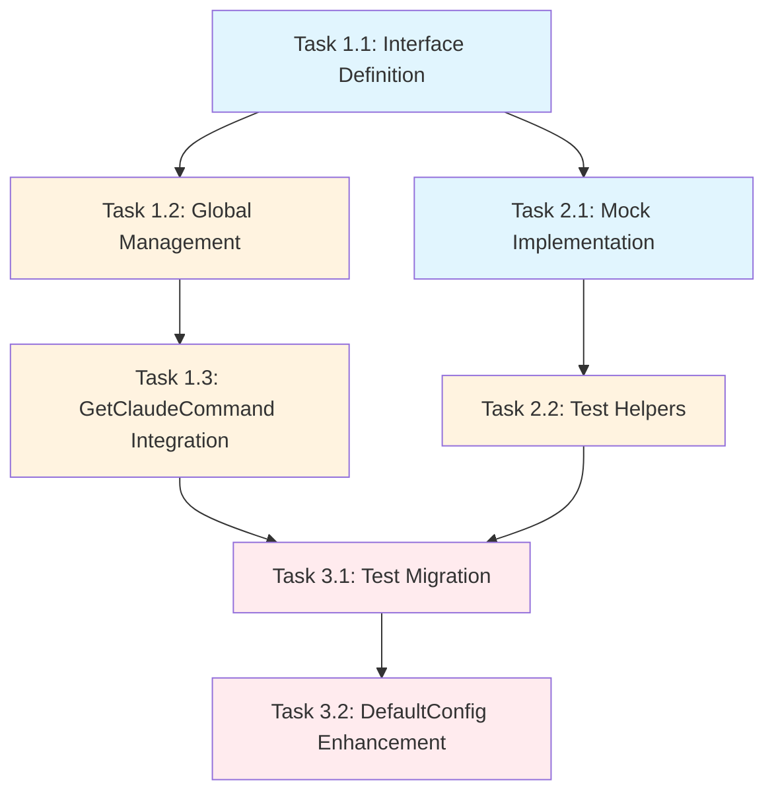

# Test Infrastructure Mocking: External Dependencies

## Epic Overview

**Goal**: Eliminate test infrastructure failures by implementing comprehensive dependency injection and mocking for external command execution in the stapler-squad codebase.

**Value Proposition**:
- Resolve critical blocking issues where tests timeout due to real external command execution
- Improve developer productivity with sub-second test execution
- Enable reliable CI/CD pipelines without external dependencies
- Maintain comprehensive test coverage while eliminating flakiness

**Success Metrics**:
- Config tests complete in <1s (previously timing out at 10s+)
- Zero real external commands executed during test runs
- 100% backward compatibility maintained
- Test coverage equivalent or improved

**Technical Scope**: Implement dependency injection pattern for external command execution with comprehensive mock infrastructure for testing.

---

## Story Breakdown

### Story 1: Core Command Execution Interface (4-6 hours)
**Objective**: Create dependency injection foundation for external command execution
**Value**: Enables controlled testing of command-dependent functionality
**Dependencies**: None

### Story 2: Mock Infrastructure Implementation (2-3 hours)
**Objective**: Build comprehensive mock utilities for command execution testing
**Value**: Provides reusable testing infrastructure across the codebase
**Dependencies**: Story 1

### Story 3: Configuration System Integration (3-4 hours)
**Objective**: Integrate dependency injection into config package with full test coverage
**Value**: Resolves immediate blocking test failures in configuration system
**Dependencies**: Story 1, Story 2

---

## Atomic Task Breakdown

### Task 1.1: CommandExecutor Interface Definition (1h)
**Scope**: Define core interface for external command execution with dependency injection support

**Files** (2):
- `config/config.go` - Interface definition and default implementation
- `config/interfaces.go` (new) - Interface documentation if needed

**Context**:
- Understand current `exec.Command()` usage patterns
- Design interface matching existing command execution needs
- Ensure production backward compatibility

**Success Criteria**:
- `CommandExecutor` interface defined with `Command()`, `Output()`, `LookPath()` methods
- `realCommandExecutor` implementation maintains existing behavior
- Interface supports dependency injection for testing

**Testing**: Interface compliance verification, production behavior unchanged

**Dependencies**: None

### Task 1.2: Global Executor Management (1h)
**Scope**: Implement global executor instance with setter/getter functions for testing

**Files** (1):
- `config/config.go` - Global variable and management functions

**Context**:
- Understand testing requirements for executor injection
- Design thread-safe global state management
- Plan test isolation strategies

**Success Criteria**:
- Global `globalCommandExecutor` variable with default production implementation
- `SetCommandExecutor()` and `ResetCommandExecutor()` functions for testing
- Thread-safe design (if required)

**Testing**: State management verification, test isolation validation

**Dependencies**: Task 1.1

### Task 1.3: GetClaudeCommand Integration (2h)
**Scope**: Update GetClaudeCommand function to use dependency-injected executor

**Files** (2):
- `config/config.go` - Function modification
- `config/config_test.go` - Updated tests

**Context**:
- Understand current GetClaudeCommand implementation
- Identify all external command usage points
- Maintain shell-specific behavior (bash/zsh differences)

**Success Criteria**:
- All `exec.Command()` calls replaced with `globalCommandExecutor.Command()`
- All `exec.LookPath()` calls replaced with `globalCommandExecutor.LookPath()`
- Identical production behavior maintained
- Shell command construction logic unchanged

**Testing**: Production behavior verification, all existing test scenarios pass

**Dependencies**: Task 1.1, Task 1.2

### Task 2.1: Mock Command Executor Implementation (2h)
**Scope**: Create comprehensive mock implementation of CommandExecutor interface

**Files** (2):
- `config/config_test.go` - Mock implementation and helper functions
- `testutil/mocks.go` (optional) - Reusable mock utilities

**Context**:
- Understand test scenarios requiring mocking
- Design flexible mock behavior configuration
- Plan for common test patterns (command found/not found, errors)

**Success Criteria**:
- `mockCommandExecutor` struct with configurable function fields
- Helper functions for common scenarios (claude found/not found)
- Support for error simulation and custom responses
- Clean, readable test code

**Testing**: Mock behavior verification, edge case simulation

**Dependencies**: Task 1.1

### Task 2.2: Test Helper Functions (1h)
**Scope**: Create convenience functions for common test setup/teardown patterns

**Files** (1):
- `config/config_test.go` - Setup/teardown helpers

**Context**:
- Understand test isolation requirements
- Design convenient test setup patterns
- Plan cleanup and state restoration

**Success Criteria**:
- `setupTest()` function for mock injection and cleanup
- Automatic state restoration on test completion
- Convenient mock configuration helpers

**Testing**: Test isolation verification, state restoration validation

**Dependencies**: Task 2.1

### Task 3.1: Configuration Test Migration (3h)
**Scope**: Replace all real external command execution with mock-based tests

**Files** (1):
- `config/config_test.go` - Complete test rewrite

**Context**:
- Understand existing test scenarios and coverage
- Preserve all edge cases and error conditions
- Enhance test coverage where possible

**Success Criteria**:
- Zero real external command execution during tests
- All previous test scenarios maintained or improved
- New test scenarios added (fallback logic, direct paths)
- Test execution time <1s

**Testing**: Coverage verification, scenario completeness validation

**Dependencies**: Task 1.3, Task 2.2

### Task 3.2: DefaultConfig Test Enhancement (1h)
**Scope**: Update DefaultConfig tests to use mocked command execution

**Files** (1):
- `config/config_test.go` - DefaultConfig test methods

**Context**:
- Understand DefaultConfig dependency on GetClaudeCommand
- Design tests for both success and failure scenarios
- Ensure config fallback behavior verification

**Success Criteria**:
- Separate test scenarios for claude found/not found
- Fallback behavior to default program verified
- Configuration object creation tested independently

**Testing**: Config creation scenarios, fallback logic verification

**Dependencies**: Task 3.1

---

## Dependency Visualization

**Parallel Opportunities**:
- Task 1.1 and Task 2.1 can be developed simultaneously
- Interface design and mock implementation are independent

**Critical Path**:
- Task 1.3 → Task 3.1 → Task 3.2 (core integration and testing)

---

## Context Preparation Guide

### For Interface Tasks (1.1, 1.2):
**Required Understanding**:
- Current `exec.Command()` usage patterns in codebase
- Go interface design principles
- Dependency injection patterns in Go

**Files to Review**:
- `config/config.go` (current GetClaudeCommand implementation)
- External command usage across codebase

### For Mock Tasks (2.1, 2.2):
**Required Understanding**:
- Go testing patterns and mock design
- Test isolation requirements
- Common command execution scenarios

**Files to Review**:
- Existing test infrastructure patterns
- `testutil/` package structure

### For Integration Tasks (1.3, 3.1, 3.2):
**Required Understanding**:
- Complete GetClaudeCommand logic flow
- All test scenarios and edge cases
- Shell-specific behavior requirements

**Files to Review**:
- Current test failures and timeout issues
- Shell command construction logic
- Error handling patterns

---

## Integration Checkpoints

### Checkpoint 1: Interface Foundation Complete
**After**: Task 1.2
**Validation**: Interface defined, global management working, production behavior unchanged

### Checkpoint 2: Mock Infrastructure Ready
**After**: Task 2.2
**Validation**: Comprehensive mock implementation, test helpers functional

### Checkpoint 3: Core Integration Complete
**After**: Task 1.3
**Validation**: GetClaudeCommand uses dependency injection, production behavior verified

### Checkpoint 4: Testing Complete
**After**: Task 3.2
**Validation**: All tests pass with <1s execution, zero external dependencies

---

## Testing Strategy

### Unit Testing:
- Interface compliance testing
- Mock behavior verification
- Production logic validation
- Error scenario coverage

### Integration Testing:
- End-to-end config loading with mocked commands
- Shell-specific behavior validation
- Error propagation verification

### Performance Testing:
- Test execution time measurement
- Memory usage validation
- CI/CD pipeline performance

### Coverage Goals:
- Maintain or improve statement coverage
- 100% coverage of new interface code
- Comprehensive error scenario testing

---

## Risk Mitigation

### High Risk: Breaking Production Behavior
**Mitigation**: Comprehensive behavior verification tests, gradual rollout

### Medium Risk: Test Scenario Gaps
**Mitigation**: Detailed comparison of old vs new test coverage, scenario documentation

### Low Risk: Performance Regression
**Mitigation**: Benchmark tests, production monitoring

---

## Implementation Notes

### Code Quality Standards:
- Follow existing Go conventions and patterns
- Maintain clean separation between production and test code
- Use descriptive names and comprehensive documentation

### Backward Compatibility:
- Zero changes to public API surface
- Identical production behavior guaranteed
- Graceful fallback for edge cases

### Future Extensibility:
- Interface design supports additional command types
- Mock infrastructure reusable across packages
- Pattern applicable to other external dependencies