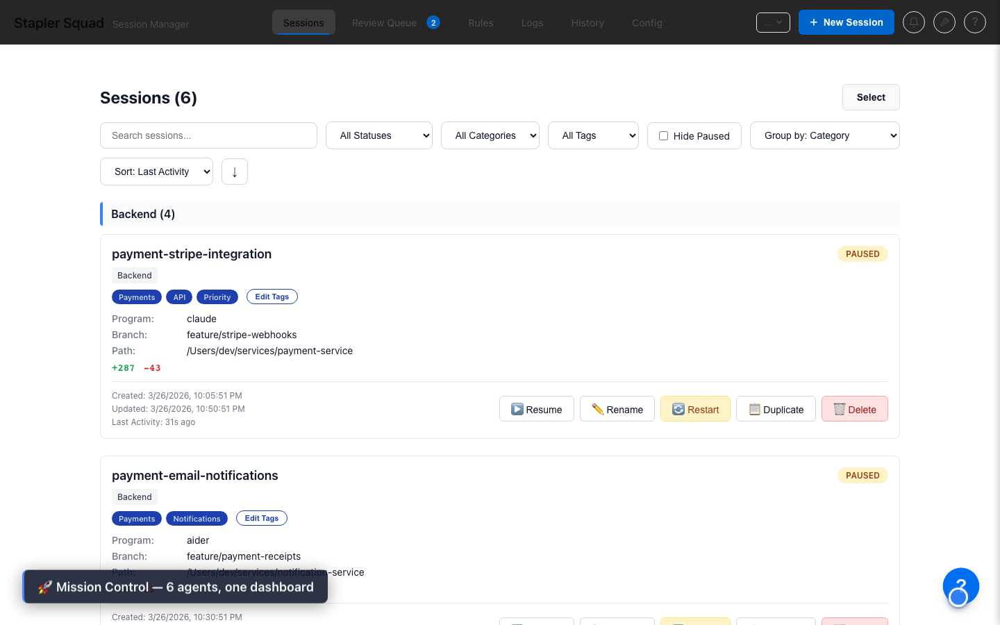
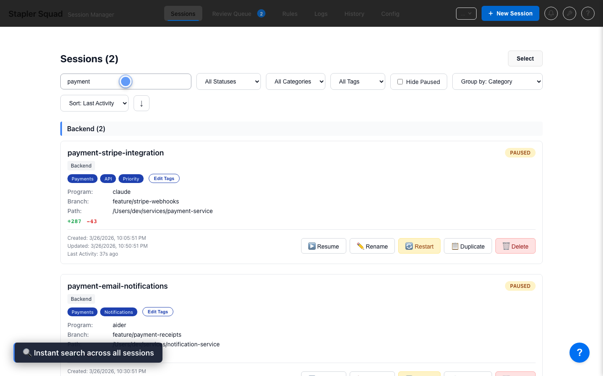
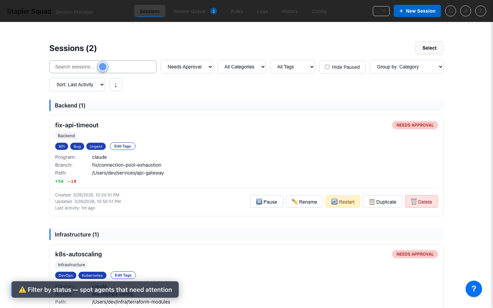
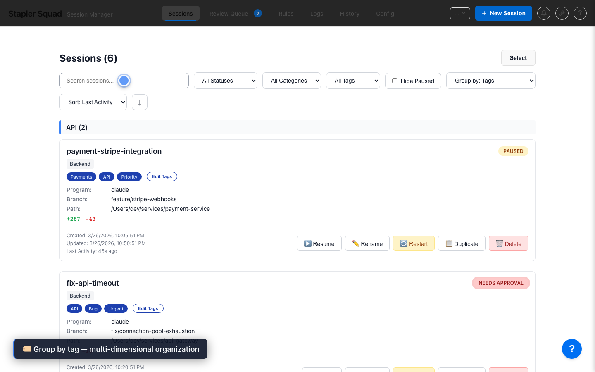
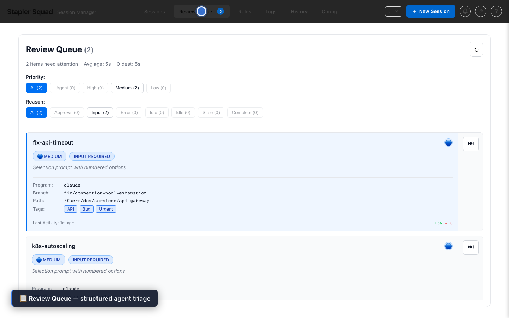
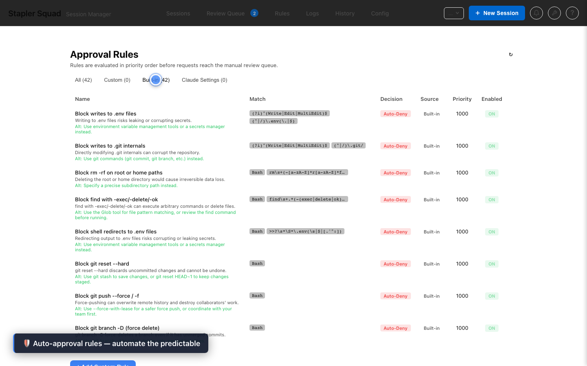
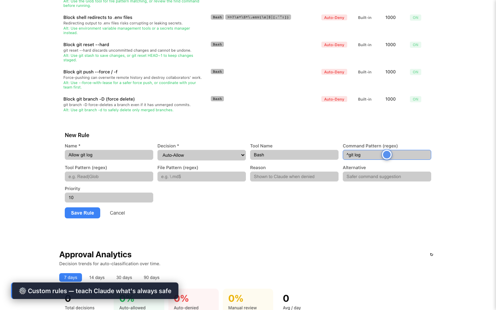
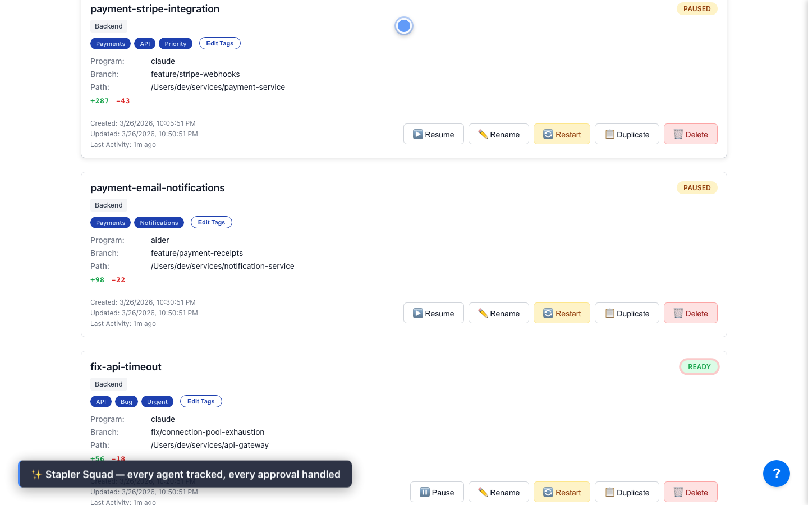

# Stapler Squad — Feature Overview

## Dashboard

See all your AI agents at a glance. Status badges, diff stats, tags, and categories give you a complete picture without opening a single terminal.

---

## Live Terminal Streaming

Full xterm.js terminal per session with real-time output streaming. Attach and reprompt any agent without leaving the browser.

---

## Diff Viewer

Per-session git diff with VCS context. See exactly what each agent has changed before you approve or merge.

---

## Notifications

Real-time alerts when agents need attention — approvals pending, sessions paused, or errors detected — without polling.

---

## Instant Search

Type to filter sessions in real time across titles, paths, branches, and tags. "payment" narrows 6 agents down to 2 immediately.

---

## Status Filtering

Filter by status to surface agents that need your attention — spot every `Needs Approval` gate without scrolling through the full list.

---

## Tag-Based Grouping

Switch between 8 grouping strategies — tag, category, status, branch, path, program, session type, or flat list. A single session can appear under multiple tags simultaneously.

---

## Workspace Switcher

Manage multiple project contexts from one UI. Each workspace gets its own isolated session state, configuration, and approval history.

---

## Bulk Actions

Select multiple sessions and act on them together — pause, resume, delete, or tag in one operation.

---

## Review Queue

Structured triage for every pending agent action. Review diffs and approve or reject before anything reaches your codebase.

---

## Auto-Approval Rules

42 built-in rules block dangerous operations automatically. Read-only commands, safe git operations, and common dev tasks are pre-approved out of the box.

---

## Custom Rules

Teach Stapler Squad what's always safe for your project. Add a pattern like `^git log` once and never review it again.

---

## Approval Analytics

Visualise decision trends and classifier performance over time. See which rules fire most, how often agents are approved vs. blocked, and where your review time is going.

---

## History Search

Searchable, filterable record of every agent action across all sessions. Filter by session, time range, action type, or free-text search to find exactly what happened and when.

---

## Logs Viewer

Live-tail application logs with time range picker, multi-select filters, export, and density controls. No need to SSH in to debug an agent.

---

## Config Viewer

Inspect your current Stapler Squad configuration directly from the UI — no hunting for JSON files.

---

## Isolated Git Workspaces

Every agent gets its own git worktree. No branch conflicts, no dirty state bleed between sessions. Merge when you're ready.

