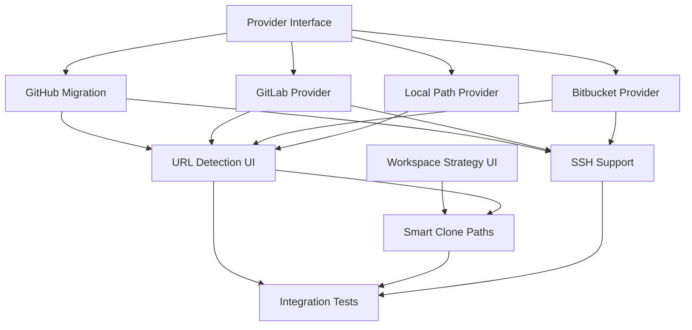

# Feature Plan: Enhanced Magic Bar URL Format Support

## Epic: Multi-Format URL Support with Workspace Selection

### User Value Proposition
Enable developers to quickly create Claude sessions from diverse URL formats (GitLab, Bitbucket, SSH URLs, local file paths) while maintaining full control over workspace strategy (reuse existing, create new worktree, or use directory). This enhancement reduces friction in session creation and supports a wider range of development workflows.

### Success Metrics
- **URL Format Coverage**: Support 15+ additional URL formats (GitLab, Bitbucket, SSH, file://, local paths)
- **User Choice Preservation**: 100% of sessions allow workspace strategy selection
- **Parse Success Rate**: >95% success rate for valid repository URLs
- **Creation Time**: <3 seconds from URL paste to session start
- **Error Recovery**: Clear error messages for unsupported formats with suggested alternatives

---

## Architecture Decisions (ADRs)

### ADR-001: Multi-Provider URL Parser Architecture

**Status**: Proposed

**Context**: Currently limited to GitHub URLs. Need extensible system for multiple providers.

**Decision**: Implement provider-based parser registry pattern with pluggable parsers.

**Consequences**:
- **Positive**: Easy to add new providers, clean separation of concerns
- **Negative**: Slightly more complex than single parser, requires registry management
- **Mitigations**: Use interface-based design with clear contracts

### ADR-002: Workspace Strategy Selection UI

**Status**: Proposed

**Context**: Users need choice between reusing workspace, creating worktree, or using directory even for URL-based sessions.

**Decision**: Add explicit workspace strategy step after URL detection, before location selection.

**Consequences**:
- **Positive**: Full user control, consistent with manual flow
- **Negative**: Extra step in wizard for URL-based sessions
- **Mitigations**: Smart defaults based on URL type, single-key shortcuts

### ADR-003: Local Path Detection and Validation

**Status**: Proposed

**Context**: Need to distinguish between URLs and local file paths in magic bar.

**Decision**: Implement path detection heuristics with filesystem validation.

**Consequences**:
- **Positive**: Seamless local repository support, better UX for local development
- **Negative**: Potential ambiguity with shorthand formats
- **Mitigations**: Clear precedence rules, validation feedback

---

## Story Breakdown

### Story 1: Multi-Provider URL Parser Infrastructure
**As a** developer  
**I want** the magic bar to recognize URLs from various Git providers  
**So that** I can create sessions from any repository source

**Acceptance Criteria**:
- ✅ Parser registry supports multiple providers
- ✅ GitHub parser migrated to new architecture
- ✅ GitLab parser implemented with full URL support
- ✅ Bitbucket parser implemented
- ✅ Generic Git URL parser for self-hosted instances
- ✅ SSH URL conversion to HTTPS for cloning

### Story 2: Local Path and File URL Support
**As a** developer  
**I want** to paste local paths or file:// URLs  
**So that** I can quickly create sessions from local repositories

**Acceptance Criteria**:
- ✅ Detect absolute paths (/path/to/repo, C:\path\to\repo)
- ✅ Detect relative paths with validation
- ✅ Support file:// URL scheme
- ✅ Validate path exists and contains Git repository
- ✅ Handle ~ expansion for home directory
- ✅ Windows path support with proper normalization

### Story 3: Workspace Strategy Selection
**As a** developer  
**I want** to choose workspace strategy after entering any URL  
**So that** I maintain control over my development environment

**Acceptance Criteria**:
- ✅ Strategy selection step appears for all URL-based sessions
- ✅ Options: "Reuse Existing", "New Worktree", "Use Directory"
- ✅ Smart defaults based on URL type and existing workspaces
- ✅ Keyboard shortcuts for quick selection (r/n/d)
- ✅ Visual indicators showing implications of each choice

### Story 4: Enhanced URL Detection and Validation
**As a** developer  
**I want** immediate feedback on URL validity  
**So that** I know if my input is recognized and supported

**Acceptance Criteria**:
- ✅ Real-time URL validation as user types
- ✅ Visual indicators for recognized formats
- ✅ Suggested corrections for common mistakes
- ✅ Support for partial URLs with smart completion
- ✅ Copy-paste normalization (trim whitespace, remove angle brackets)

### Story 5: Clone Path Intelligence
**As a** developer  
**I want** smart clone path suggestions  
**So that** my repositories are organized consistently

**Acceptance Criteria**:
- ✅ Default paths based on provider (~/github/*, ~/gitlab/*, etc.)
- ✅ Detect existing clones and suggest alternatives
- ✅ Remember user's path preferences
- ✅ Allow inline path editing before clone
- ✅ Create parent directories as needed

---

## Implementation Tasks

### Task 1: Create Provider Parser Interface
**Files**: `github/provider.go`, `github/registry.go`
**Effort**: 2 hours
**Dependencies**: None

**Implementation**:
```go
type RepositoryProvider interface {
    Name() string
    CanParse(input string) bool
    Parse(input string) (*ParsedRef, error)
    CloneURL(ref *ParsedRef) string
}

type ProviderRegistry struct {
    providers []RepositoryProvider
}
```

### Task 2: Migrate GitHub Parser to Provider Model
**Files**: `github/github_provider.go`, `github/url_parser.go`
**Effort**: 2 hours
**Dependencies**: Task 1

**Changes**:
- Implement RepositoryProvider interface for GitHub
- Move existing parser logic to provider
- Update ParsedGitHubRef to generic ParsedRef

### Task 3: Implement GitLab Provider
**Files**: `github/gitlab_provider.go`, `github/gitlab_provider_test.go`
**Effort**: 3 hours
**Dependencies**: Task 1

**URL Formats**:
- https://gitlab.com/owner/repo
- gitlab.com/owner/repo/-/merge_requests/123
- https://gitlab.com/owner/repo/-/tree/branch-name
- owner/repo@gitlab (shorthand)

### Task 4: Implement Bitbucket Provider
**Files**: `github/bitbucket_provider.go`, `github/bitbucket_provider_test.go`
**Effort**: 3 hours
**Dependencies**: Task 1

**URL Formats**:
- https://bitbucket.org/owner/repo
- bitbucket.org/owner/repo/pull-requests/123
- ssh://git@bitbucket.org/owner/repo.git

### Task 5: Implement Local Path Provider
**Files**: `github/local_provider.go`, `github/path_utils.go`
**Effort**: 4 hours
**Dependencies**: Task 1

**Path Formats**:
- /absolute/path/to/repo
- ./relative/path
- ~/home/path
- file:///path/to/repo
- C:\Windows\Path (Windows)

### Task 6: Add Workspace Strategy UI Step
**Files**: `ui/overlay/sessionSetup.go`, `ui/overlay/workspaceStrategy.go`
**Effort**: 3 hours
**Dependencies**: None

**UI Flow**:
1. Detect URL/path in magic bar
2. Show workspace strategy selection
3. Continue with existing flow based on selection

### Task 7: Enhance URL Detection Feedback
**Files**: `ui/overlay/sessionSetup.go`, `ui/overlay/urlIndicator.go`
**Effort**: 2 hours
**Dependencies**: Tasks 2-5

**Features**:
- Provider badge display
- Validation status indicator
- Suggested corrections
- Format help tooltip

### Task 8: Implement Smart Clone Paths
**Files**: `session/clone_path.go`, `config/paths.go`
**Effort**: 3 hours
**Dependencies**: Task 6

**Logic**:
- Provider-based default paths
- Existing clone detection
- Path preference persistence
- Directory creation

### Task 9: Add SSH URL Support
**Files**: `github/ssh_parser.go`, `github/ssh_converter.go`
**Effort**: 2 hours
**Dependencies**: Tasks 2-5

**Conversions**:
- git@github.com:owner/repo.git → https://github.com/owner/repo
- ssh://git@gitlab.com/owner/repo → https://gitlab.com/owner/repo

### Task 10: Integration Testing
**Files**: `ui/overlay/sessionSetup_test.go`, `test/integration/url_formats_test.go`
**Effort**: 4 hours
**Dependencies**: All tasks

**Test Cases**:
- All URL formats
- Workspace strategy flows
- Error scenarios
- Path validation
- Clone operations

---

## Known Issues & Bug Prevention

### 🐛 URL Ambiguity with Shorthand Formats [SEVERITY: Medium]
**Description**: Input like "user/repo" could be GitHub shorthand or local path.

**Mitigation**:
- Check filesystem first for local paths
- Provider precedence: GitHub > GitLab > Bitbucket > Local
- Explicit provider prefix support (gh:user/repo, gl:user/repo)
- User preference for default provider

**Prevention**:
- Clear visual feedback showing interpretation
- Easy override mechanism
- Comprehensive test coverage for edge cases

### 🐛 Clone Collision with Existing Repositories [SEVERITY: High]
**Description**: Attempting to clone to directory with existing repository.

**Mitigation**:
- Pre-clone directory existence check
- Offer alternatives: reuse, different path, or cancel
- Show existing repository status
- Never overwrite without explicit confirmation

**Prevention**:
- Implement robust path checking before clone
- Use unique session directories
- Maintain clone registry

### 🐛 Network Timeout During Clone Operations [SEVERITY: High]
**Description**: Large repositories or slow networks cause UI freeze.

**Mitigation**:
- Async clone with progress indicator
- Configurable timeout (default 5 minutes)
- Cancel operation support
- Retry with exponential backoff

**Prevention**:
- Background clone process
- Non-blocking UI updates
- Clear timeout messaging

### 🐛 Invalid Workspace Strategy for Repository Type [SEVERITY: Medium]
**Description**: User selects worktree for non-Git directory.

**Mitigation**:
- Validate repository type before strategy selection
- Disable invalid options dynamically
- Clear explanatory messages
- Fallback to directory mode

**Prevention**:
- Repository detection before strategy step
- Smart option filtering
- Comprehensive validation

### 🐛 Windows Path Parsing Issues [SEVERITY: Low]
**Description**: Windows paths with backslashes, drive letters, UNC paths.

**Mitigation**:
- Normalize all paths to forward slashes internally
- Handle drive letters explicitly
- UNC path support
- Cross-platform path validation

**Prevention**:
- Use filepath package consistently
- Platform-specific path handlers
- Extensive Windows testing

---

## Dependency Visualization



---

## Integration Checkpoints

### Checkpoint 1: Provider Framework (Tasks 1-2)
- ✅ Provider interface defined and tested
- ✅ GitHub parser successfully migrated
- ✅ Existing functionality preserved
- ✅ Registry pattern working

### Checkpoint 2: Multi-Provider Support (Tasks 3-5)
- ✅ All providers parsing correctly
- ✅ URL format test suite passing
- ✅ Local path detection working
- ✅ Provider selection logic correct

### Checkpoint 3: UI Enhancement (Tasks 6-8)
- ✅ Workspace strategy selection integrated
- ✅ URL feedback displaying correctly
- ✅ Clone path intelligence working
- ✅ User flow smooth and intuitive

### Checkpoint 4: Full Integration (Tasks 9-10)
- ✅ SSH URLs converting properly
- ✅ All test scenarios passing
- ✅ Error handling comprehensive
- ✅ Performance acceptable (<3s session creation)

---

## Configuration & Settings

### New Configuration Options
```json
{
  "url_parsing": {
    "default_provider": "github",
    "provider_shortcuts": {
      "gh": "github",
      "gl": "gitlab",
      "bb": "bitbucket"
    },
    "clone_paths": {
      "github": "~/github",
      "gitlab": "~/gitlab",
      "bitbucket": "~/bitbucket",
      "default": "~/repos"
    },
    "timeout_seconds": 300,
    "auto_detect_local": true
  },
  "workspace_defaults": {
    "prefer_worktree": true,
    "reuse_existing": true,
    "auto_create_parents": true
  }
}
```

---

## Rollout Strategy

### Phase 1: Foundation (Week 1)
- Deploy provider framework
- Migrate GitHub to new model
- Ensure zero regression

### Phase 2: Providers (Week 2)
- Add GitLab support
- Add Bitbucket support
- Add local path support
- Beta test with power users

### Phase 3: UI Enhancement (Week 3)
- Workspace strategy selection
- URL detection feedback
- Smart clone paths
- User acceptance testing

### Phase 4: Polish (Week 4)
- SSH URL support
- Error handling refinement
- Performance optimization
- Documentation and training

---

## Documentation Requirements

### User Documentation
- Magic bar usage guide with examples
- Supported URL formats reference
- Workspace strategy explanation
- Troubleshooting guide

### Developer Documentation
- Provider implementation guide
- URL parser extension tutorial
- Testing guidelines
- Configuration reference

---

## Risk Analysis

### High Risks
1. **Breaking existing GitHub functionality** - Mitigate with comprehensive tests
2. **Clone operation failures** - Implement robust retry and error handling
3. **UI complexity increase** - Use progressive disclosure, smart defaults

### Medium Risks
1. **Provider API changes** - Abstract provider-specific logic
2. **Path parsing ambiguity** - Clear precedence rules and feedback
3. **Performance degradation** - Async operations, caching

### Low Risks
1. **Unsupported URL formats** - Clear error messages, documentation
2. **Configuration complexity** - Sensible defaults, migration tools
