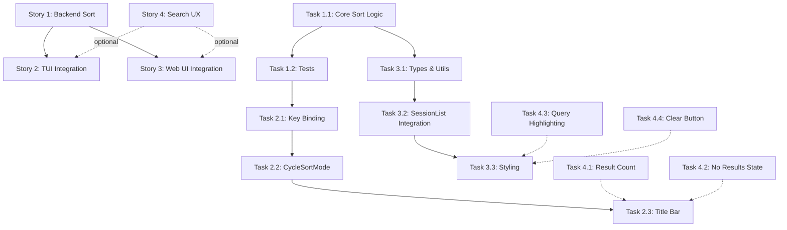

# Feature Plan: Session Search and Sort

**Status**: Planning Complete
**Created**: 2025-12-05
**Epic**: Enhanced Session Discovery and Management
**Product Value**: Enable users to quickly find and resume relevant sessions using advanced search and flexible sorting criteria

---

## Executive Summary

This feature enhances Stapler Squad's session management capabilities by adding comprehensive search and sort functionality. Users can quickly discover sessions by title, repository, branch, tags, and recency, with intelligent sorting options to match their workflow. The implementation leverages the existing search index infrastructure while adding sort capabilities to both TUI and Web UI.

**Key Benefits**:
- **Time Savings**: Reduce session discovery time from minutes to seconds
- **Workflow Optimization**: Find sessions by project context (repo, branch) not just title
- **Multi-dimensional Organization**: Search by tags for cross-cutting concerns
- **Consistency**: Unified search/sort experience across TUI and Web UI

---

## Table of Contents

1. [Requirements Analysis](#requirements-analysis)
2. [Architecture Decisions](#architecture-decisions)
3. [Epic Overview](#epic-overview)
4. [Story Breakdown](#story-breakdown)
5. [Atomic Task Decomposition](#atomic-task-decomposition)
6. [Testing Strategy](#testing-strategy)
7. [Known Issues and Mitigation](#known-issues-and-mitigation)
8. [Dependencies and Timeline](#dependencies-and-timeline)
9. [Context Preparation Guides](#context-preparation-guides)

---

## Requirements Analysis

### Functional Requirements

#### FR-1: Multi-Field Search
**Priority**: P0 (Critical)
**Description**: Users can search sessions across multiple fields simultaneously

**Acceptance Criteria**:
- Search matches against: title, repository path, branch name, category, tags, program
- Fuzzy matching support (typo-tolerant)
- Real-time search with debouncing (< 200ms latency)
- Search query persists across navigation
- Minimum 2-character query length for performance

**Search Fields Priority** (by user value):
1. Title (highest priority - primary identifier)
2. Repository name (context-critical)
3. Branch name (workflow-specific)
4. Tags (cross-cutting organization)
5. Category (legacy organization)
6. Program (secondary context)

**References**:
- Existing implementation: `/Users/tylerstapler/IdeaProjects/stapler-squad/ui/search_index.go` (lines 514-535)
- Already indexes: title, category, program, branch, path, workingDir, tags

#### FR-2: Flexible Sorting
**Priority**: P0 (Critical)
**Description**: Users can sort sessions by various criteria to match their workflow

**Sort Options** (in priority order):
1. **Last Activity** (default) - Most recently updated sessions first
   - Uses `LastMeaningfulOutput` timestamp
   - Falls back to `UpdatedAt` if unavailable
   
2. **Creation Date** - Newest sessions first
   - Uses `CreatedAt` timestamp
   - Useful for finding recent work

3. **Title (A-Z)** - Alphabetical by session title
   - Ascending sort
   - Case-insensitive comparison

4. **Repository** - Group by repository, then by last activity
   - Alphabetical by repo name
   - Secondary sort by activity within each repo

5. **Branch** - Group by branch name, then by last activity
   - Alphabetical by branch
   - Secondary sort by activity within each branch

6. **Status** - Group by status (Running > Ready > Paused > Loading)
   - Fixed priority order
   - Secondary sort by activity within status

**Acceptance Criteria**:
- Sort persists across navigation
- Sort applies after search/filter
- Sort updates in real-time with session changes
- Visual indicator shows current sort
- Keyboard shortcut to cycle through sorts (TUI)

**References**:
- Session fields available for sorting: `session/instance.go` (lines 36-154)
- Timestamps: `CreatedAt`, `UpdatedAt`, `LastMeaningfulOutput`, `LastTerminalUpdate`

#### FR-3: Resume from Search Results
**Priority**: P0 (Critical)
**Description**: Users can directly resume or attach to sessions from search results

**Acceptance Criteria**:
- Click/select session in search results immediately shows session detail
- Resume button available inline (no need to exit search)
- Session resumes in same view (TUI: attachment, Web: terminal pane)
- Search state preserved after resume action
- Support keyboard navigation in TUI (Up/Down/Enter)

**References**:
- Resume flow: `session/instance.go` (lines 1008-1088)
- TUI navigation: `ui/list.go` (lines 766-866)

#### FR-4: Combined Search + Filter + Sort
**Priority**: P1 (Important)
**Description**: Users can apply search, filters, and sorting simultaneously

**Workflow**:
```
Sessions (all) 
  → Filter by status/category/tag
    → Search within filtered results
      → Sort filtered search results
        → Display final result set
```

**Acceptance Criteria**:
- Each operation refines the previous result set
- Clear visual indication of active filters/search/sort
- "Clear all" button to reset to default view
- Filter/search/sort state persists across page refreshes
- Performance: < 100ms for combined operations on 1000 sessions

**References**:
- Web UI filtering: `web-app/src/components/sessions/SessionList.tsx` (lines 131-170)
- TUI filtering: `ui/list.go` (lines 1240-1278)

### Non-Functional Requirements

#### NFR-1: Performance
**Target Metrics**:
- Search latency: < 200ms for 1000 sessions (p95)
- Sort latency: < 50ms for 1000 sessions (p95)
- Memory overhead: < 10MB for search index (1000 sessions)
- UI responsiveness: No blocking on main thread

**Implementation Strategies**:
- Leverage existing `SearchIndex` with hybrid fuzzy search
- Pre-computed sort keys (timestamps as Unix epochs)
- Debounced search input (200ms)
- Virtual scrolling for large result sets (Web UI)

**References**:
- Existing search performance: `ui/search_index.go` (lines 113-145)
- Hybrid search: closestmatch pre-filter + sahilm/fuzzy ranking

#### NFR-2: Scalability
**Target**: Support 10,000+ sessions without degradation

**Strategies**:
- Index-based search (O(log n) lookups)
- Lazy loading for Web UI (pagination)
- Efficient sort algorithms (merge sort for stable ordering)
- Cache sorted results until data changes

**References**:
- Search index structure: `ui/search_index.go` (lines 16-52)
- Already supports category, program, tag indices

#### NFR-3: Usability
**Requirements**:
- Intuitive keyboard shortcuts (TUI)
- Visual feedback for sort direction
- Clear "no results" messaging
- Helpful empty state with suggested actions

**Keyboard Shortcuts (TUI)**:
- `s` - Open search overlay
- `S` (Shift+s) - Cycle sort mode
- `/` - Alternative search shortcut
- `Esc` - Clear search/exit mode

**References**:
- Existing key bindings: `keys/keys.go`
- Help system: `app/help.go`

#### NFR-4: Maintainability
**Code Quality Standards**:
- SOLID principles adherence
- Unit test coverage > 80%
- Benchmark tests for performance validation
- Comprehensive inline documentation

**References**:
- Testing patterns: `session/instance_test.go`
- Benchmark examples: `ui/search_bench_test.go`

---

## Architecture Decisions

### ADR-1: Extend Existing SearchIndex vs New SortEngine

**Status**: Accepted
**Date**: 2025-12-05

**Context**:
Stapler Squad already has a sophisticated `SearchIndex` implementation with hybrid fuzzy search (closestmatch + sahilm/fuzzy). We need to add sorting capabilities without degrading search performance.

**Decision**:
Extend the existing `SearchIndex` with sort capabilities rather than creating a separate `SortEngine`.

**Rationale**:
1. **Code Reuse**: SearchIndex already tracks all sessions and builds indices
2. **Performance**: Can leverage existing indices for sort-by-category/tag/program
3. **Simplicity**: Single component reduces coupling and complexity
4. **Memory Efficiency**: Avoid duplicating session lists

**Implementation**:
```go
type SearchIndex struct {
    // Existing fields...
    sortMode      SortMode
    sortCache     map[SortMode][]*session.Instance
    sortCacheValid bool
}

type SortMode int
const (
    SortByLastActivity SortMode = iota
    SortByCreationDate
    SortByTitleAZ
    SortByRepository
    SortByBranch
    SortByStatus
)
```

**Consequences**:
- **Positive**: Single source of truth for session organization
- **Positive**: Can apply sort to pre-filtered search results efficiently
- **Negative**: SearchIndex becomes slightly more complex
- **Mitigation**: Keep sort logic in separate methods, maintain SRP

**Alternatives Considered**:
1. **Separate SortEngine**: Rejected due to duplication and coupling complexity
2. **In-place sorting in List**: Rejected due to performance concerns and lack of reusability

**References**:
- Existing SearchIndex: `ui/search_index.go`
- Similar pattern: Tag index (lines 27-28, 94-98)

---

### ADR-2: Sort State Persistence Strategy

**Status**: Accepted
**Date**: 2025-12-05

**Context**:
Users need sort preferences to persist across application restarts. Current system uses state manager for UI preferences.

**Decision**:
Store sort preference in the existing state manager, separate from search query.

**Rationale**:
1. **Consistency**: Follows existing pattern for UI state (hidePaused, searchQuery)
2. **Granularity**: Sort is independent of search - user may want different sorts for different searches
3. **Cross-platform**: Works for both TUI and Web UI

**Implementation**:
```go
// In config.State
type UIState struct {
    // Existing fields...
    SortMode         SortMode `json:"sort_mode"`
    SortDirection    string   `json:"sort_direction"` // "asc" or "desc"
}
```

**Web UI Persistence**:
```typescript
// Use localStorage as backup to state manager
const STORAGE_KEYS = {
    // Existing keys...
    SORT_MODE: 'stapler-squad-sort-mode',
    SORT_DIRECTION: 'stapler-squad-sort-direction',
};
```

**Consequences**:
- **Positive**: Persistent user preferences across restarts
- **Positive**: Minimal changes to existing state management
- **Negative**: Additional state to serialize/deserialize
- **Mitigation**: Use default sort (LastActivity) if state corrupted

**References**:
- State manager: `config/state.go`
- UI state: `ui/list.go` (lines 1307-1353)
- Web storage: `web-app/src/components/sessions/SessionList.tsx` (lines 21-50)

---

### ADR-3: Sort Stability and Secondary Sorts

**Status**: Accepted
**Date**: 2025-12-05

**Context**:
When sorting by non-unique fields (repository, branch, status), need to define secondary sort order for consistent UX.

**Decision**:
Use **Last Activity** as universal secondary sort for all non-unique primary sorts.

**Rationale**:
1. **User Expectation**: Most recent activity is most relevant
2. **Consistency**: Single secondary sort rule across all modes
3. **Performance**: LastMeaningfulOutput already indexed for review queue

**Sort Hierarchy**:
```
SortByRepository: 
  1. Repository name (A-Z)
  2. Last activity (descending)

SortByBranch:
  1. Branch name (A-Z)
  2. Last activity (descending)

SortByStatus:
  1. Status priority (Running > Ready > Paused > Loading)
  2. Last activity (descending)
```

**Tie-Breaker**:
If last activity is equal, use creation date as tertiary sort.

**Consequences**:
- **Positive**: Predictable, consistent ordering
- **Positive**: Aligns with review queue priority logic
- **Negative**: Slightly more complex sort comparisons
- **Mitigation**: Use pre-computed sort keys for performance

**References**:
- Review queue sorting: `session/review_queue.go`
- Timestamp fields: `session/instance.go` (lines 54-58, 113-117)

---

### ADR-4: TUI Sort UI Pattern

**Status**: Accepted
**Date**: 2025-12-05

**Context**:
TUI has limited screen space for sort controls. Need intuitive way to cycle through sort modes without complex UI.

**Decision**:
Use **keyboard shortcut cycling** (`S` key) with visual indicator in title bar, following existing grouping pattern.

**Rationale**:
1. **Existing Pattern**: Grouping strategy uses `G` key to cycle (line 1108-1152 in ui/list.go)
2. **Minimal UI**: No additional screen space required
3. **Discoverability**: Help screen shows shortcut
4. **Consistency**: Matches BubbleTea patterns

**UI Design**:
```
Title Bar:
  "Instances (Sort: Last Activity) [0-10/50]"
  
Press 'S' to cycle:
  Last Activity → Creation Date → Title → Repository → Branch → Status → (back to Last Activity)

Visual Indicators:
  ⬇️ Descending sort (default for timestamps)
  ⬆️ Ascending sort (default for text)
```

**Consequences**:
- **Positive**: Clean, minimal UI
- **Positive**: Fast keyboard-driven workflow
- **Negative**: Requires memorizing shortcuts
- **Mitigation**: Help screen (`?` key) prominently displays sort shortcuts

**Alternatives Considered**:
1. **Sort Overlay Menu**: Rejected as too heavyweight for frequent operation
2. **Individual Sort Keys**: Rejected as too many shortcuts to remember
3. **Mouse-Clickable Headers**: Not applicable to TUI

**References**:
- Grouping cycle: `ui/list.go` (lines 1108-1152)
- Title bar rendering: `ui/list.go` (lines 686-747)
- Help system: `app/help.go`

---

## Epic Overview

### Epic: Enhanced Session Discovery and Management

**Epic ID**: EPIC-SEARCH-001
**Duration**: 2-3 weeks
**Team Size**: 1 developer
**Stakeholders**: All Stapler Squad users

#### User Value Statement

"As a Stapler Squad user managing multiple AI coding sessions, I want to quickly find and resume relevant sessions using flexible search and sorting, so I can spend less time navigating and more time coding."

#### Success Metrics

**Primary Metrics**:
1. **Time to Session Discovery**: < 5 seconds to find any session (down from ~30 seconds)
2. **Search Adoption**: > 70% of users use search within first week
3. **Sort Usage**: > 50% of users change default sort within first week

**Secondary Metrics**:
1. **Session Resume Rate**: +20% increase in session reuse vs creating new
2. **User Satisfaction**: NPS > 8 for session management
3. **Performance**: p95 search latency < 200ms

**Measurement Plan**:
- Log search queries (anonymized)
- Track sort mode changes
- Monitor session resume vs create ratio
- Performance telemetry (optional user opt-in)

#### Risk Assessment

**Technical Risks**:

| Risk | Probability | Impact | Mitigation |
|------|------------|---------|------------|
| Search performance degrades with 10k+ sessions | Medium | High | Benchmark tests, index optimization |
| Sort state corruption causes crashes | Low | High | Defensive parsing, default fallback |
| TUI key binding conflicts | Medium | Medium | Comprehensive key mapping audit |
| Web UI local storage quota exceeded | Low | Low | Implement storage quota checks |

**UX Risks**:

| Risk | Probability | Impact | Mitigation |
|------|------------|---------|------------|
| Sort UI not discoverable | Medium | Medium | Prominent help screen, onboarding tooltip |
| Search results confusing | Low | High | Clear empty state messaging, result count |
| Too many sort options overwhelming | Medium | Low | Sensible defaults, progressive disclosure |

**Mitigation Timeline**:
- Week 1: Implement performance benchmarks (Task 1.2)
- Week 2: User testing with 5 beta users
- Week 3: Polish based on feedback

---

## Story Breakdown

### Story 1: Core Sort Infrastructure (Backend)

**Story ID**: STORY-SEARCH-001
**Duration**: 3-5 days
**Priority**: P0 (Blocker for other stories)

#### User Story
"As a developer, I need backend sort infrastructure so that I can implement sort UI in TUI and Web"

#### Acceptance Criteria
- [ ] `SearchIndex` extended with sort capabilities
- [ ] Sort modes: LastActivity, CreationDate, Title, Repository, Branch, Status
- [ ] Secondary sort by LastActivity for non-unique primary sorts
- [ ] Sort results cached and invalidated on session changes
- [ ] Unit tests with >80% coverage
- [ ] Benchmark tests showing <50ms sort time for 1000 sessions

#### Technical Design

**1. Extend SearchIndex Struct**
```go
// In ui/search_index.go

type SortMode int
const (
    SortByLastActivity SortMode = iota
    SortByCreationDate
    SortByTitleAZ
    SortByRepository
    SortByBranch
    SortByStatus
)

type SearchIndex struct {
    // Existing fields...
    
    // Sort management
    sortMode       SortMode
    sortDirection  SortDirection // "asc" or "desc"
    sortCache      []*session.Instance
    sortCacheValid bool
}
```

**2. Core Sort Method**
```go
// Sort applies the current sort mode to the session list
func (idx *SearchIndex) Sort(sessions []*session.Instance, mode SortMode) []*session.Instance {
    // Check cache validity
    if idx.sortCacheValid && idx.sortMode == mode {
        return idx.filterSessions(sessions, idx.sortCache)
    }
    
    // Create a copy to avoid mutating input
    sorted := make([]*session.Instance, len(sessions))
    copy(sorted, sessions)
    
    // Apply sort based on mode
    switch mode {
    case SortByLastActivity:
        idx.sortByLastActivity(sorted)
    case SortByCreationDate:
        idx.sortByCreationDate(sorted)
    case SortByTitleAZ:
        idx.sortByTitle(sorted)
    case SortByRepository:
        idx.sortByRepository(sorted)
    case SortByBranch:
        idx.sortByBranch(sorted)
    case SortByStatus:
        idx.sortByStatus(sorted)
    }
    
    // Cache result
    idx.sortCache = sorted
    idx.sortCacheValid = true
    idx.sortMode = mode
    
    return sorted
}
```

**3. Individual Sort Implementations**
```go
// sortByLastActivity sorts by LastMeaningfulOutput DESC, then CreatedAt DESC
func (idx *SearchIndex) sortByLastActivity(sessions []*session.Instance) {
    sort.Slice(sessions, func(i, j int) bool {
        // Primary: LastMeaningfulOutput (descending)
        timeI := sessions[i].LastMeaningfulOutput
        timeJ := sessions[j].LastMeaningfulOutput
        
        if !timeI.Equal(timeJ) {
            return timeI.After(timeJ) // Descending
        }
        
        // Secondary: CreatedAt (descending)
        return sessions[i].CreatedAt.After(sessions[j].CreatedAt)
    })
}

// sortByRepository sorts by repo name ASC, then LastActivity DESC
func (idx *SearchIndex) sortByRepository(sessions []*session.Instance) {
    sort.Slice(sessions, func(i, j int) bool {
        repoI := filepath.Base(sessions[i].Path)
        repoJ := filepath.Base(sessions[j].Path)
        
        // Primary: Repository name (ascending, case-insensitive)
        if repoI != repoJ {
            return strings.ToLower(repoI) < strings.ToLower(repoJ)
        }
        
        // Secondary: Last activity (descending)
        return sessions[i].LastMeaningfulOutput.After(sessions[j].LastMeaningfulOutput)
    })
}
```

#### Dependencies
- None (extends existing SearchIndex)

#### Files Modified
- `ui/search_index.go` (~200 lines added)
- `session/instance.go` (add sort helper methods if needed)

#### Testing Requirements
```go
// Test cases required:
// - TestSortByLastActivity
// - TestSortByCreationDate
// - TestSortByTitle
// - TestSortByRepository (with secondary sort verification)
// - TestSortByBranch (with secondary sort verification)
// - TestSortByStatus (with priority order verification)
// - TestSortCacheInvalidation
// - TestSortWithEmptyList
// - TestSortWithSingleSession
// - BenchmarkSort1000Sessions (must be < 50ms)
```

---

### Story 2: TUI Sort Integration

**Story ID**: STORY-SEARCH-002
**Duration**: 2-3 days
**Priority**: P0

#### User Story
"As a TUI user, I want to press 'S' to cycle through sort modes and see the current sort in the title bar, so I can organize sessions to match my workflow"

#### Acceptance Criteria
- [ ] `S` key cycles through sort modes
- [ ] Title bar shows current sort mode
- [ ] Visual indicator for sort direction (⬇️/⬆️)
- [ ] Sort persists across navigation
- [ ] Help screen documents sort shortcuts
- [ ] Selection remains stable when sort changes

#### Technical Design

**1. Add Sort to List State**
```go
// In ui/list.go

type List struct {
    // Existing fields...
    sortMode      SortMode      // Current sort mode
    sortDirection SortDirection // "asc" or "desc"
}
```

**2. Key Handler**
```go
// In app/app.go handleKeys()

case keys.CycleSortMode: // 'S' key
    l.CycleSortMode()
    l.invalidateVisibleCache()
    l.saveUIState()
    return l, nil
```

**3. Cycle Sort Mode**
```go
// In ui/list.go

func (l *List) CycleSortMode() {
    // Cycle to next sort mode
    l.sortMode = (l.sortMode + 1) % 6
    
    // Mark sort cache as invalid
    l.searchIndex.InvalidateSortCache()
    
    // Re-apply sort to current visible items
    l.applySortToVisibleItems()
    
    // Preserve selection if possible
    l.preserveSelectionAfterSort()
    
    log.InfoLog.Printf("Cycled sort mode to: %s", l.sortMode.String())
}
```

**4. Title Bar Update**
```go
// In ui/list.go String() method

func (l *List) String() string {
    // Build dynamic title with sort status
    titleText := " Instances"
    var filters []string
    
    // Add sort indicator
    sortIndicator := l.sortMode.String()
    if l.sortDirection == SortDesc {
        sortIndicator += " ⬇️"
    } else {
        sortIndicator += " ⬆️"
    }
    filters = append(filters, sortIndicator)
    
    // ... existing filter code ...
}
```

#### Dependencies
- Story 1: Core Sort Infrastructure (STORY-SEARCH-001)

#### Files Modified
- `ui/list.go` (~150 lines modified)
- `app/app.go` (~20 lines modified - key handling)
- `keys/keys.go` (~10 lines added - new key binding)
- `app/help.go` (~5 lines modified - help text)

#### Testing Requirements
```go
// Manual TUI testing required:
// - Press 'S' key cycles through all 6 sort modes
// - Title bar updates on each cycle
// - Selection remains stable (or moves to first if filtered out)
// - Sort persists after navigating away and back
// - Help screen shows 'S' - Cycle sort mode

// Unit tests:
// - TestCycleSortMode
// - TestSortPersistence
// - TestSelectionStabilityAfterSort
```

---

### Story 3: Web UI Sort Integration

**Story ID**: STORY-SEARCH-003
**Duration**: 2-3 days
**Priority**: P0

#### User Story
"As a Web UI user, I want a sort dropdown selector so I can quickly reorganize sessions by different criteria"

#### Acceptance Criteria
- [ ] Sort dropdown in filters section
- [ ] Dropdown shows: Last Activity, Creation Date, Title, Repository, Branch, Status
- [ ] Sort direction toggle button (⬆️/⬇️)
- [ ] Sort persists in localStorage
- [ ] Sort applies to filtered/searched results
- [ ] Smooth animations on re-sort

#### Technical Design

**1. TypeScript Sort Types**
```typescript
// In web-app/src/lib/sorting/types.ts

export enum SortMode {
  LastActivity = "last-activity",
  CreationDate = "creation-date",
  TitleAZ = "title-az",
  Repository = "repository",
  Branch = "branch",
  Status = "status",
}

export enum SortDirection {
  Ascending = "asc",
  Descending = "desc",
}

export const SortModeLabels: Record<SortMode, string> = {
  [SortMode.LastActivity]: "Last Activity",
  [SortMode.CreationDate]: "Creation Date",
  [SortMode.TitleAZ]: "Title (A-Z)",
  [SortMode.Repository]: "Repository",
  [SortMode.Branch]: "Branch",
  [SortMode.Status]: "Status",
};
```

**2. Sort Logic**
```typescript
// In web-app/src/lib/sorting/sessionSort.ts

export function sortSessions(
  sessions: Session[],
  sortMode: SortMode,
  sortDirection: SortDirection
): Session[] {
  const sorted = [...sessions]; // Don't mutate input
  
  switch (sortMode) {
    case SortMode.LastActivity:
      sorted.sort((a, b) => {
        const timeA = a.lastMeaningfulOutput?.toDate() || a.createdAt?.toDate() || new Date(0);
        const timeB = b.lastMeaningfulOutput?.toDate() || b.createdAt?.toDate() || new Date(0);
        return sortDirection === SortDirection.Descending
          ? timeB.getTime() - timeA.getTime()
          : timeA.getTime() - timeB.getTime();
      });
      break;
      
    case SortMode.Repository:
      sorted.sort((a, b) => {
        const repoA = getRepoName(a.path).toLowerCase();
        const repoB = getRepoName(b.path).toLowerCase();
        
        // Primary sort: repository name
        if (repoA !== repoB) {
          return sortDirection === SortDirection.Ascending
            ? repoA.localeCompare(repoB)
            : repoB.localeCompare(repoA);
        }
        
        // Secondary sort: last activity
        const timeA = a.lastMeaningfulOutput?.toDate() || new Date(0);
        const timeB = b.lastMeaningfulOutput?.toDate() || new Date(0);
        return timeB.getTime() - timeA.getTime();
      });
      break;
      
    // ... other sort modes ...
  }
  
  return sorted;
}
```

**3. SessionList Component Updates**
```typescript
// In web-app/src/components/sessions/SessionList.tsx

export function SessionList({ sessions, ...props }: SessionListProps) {
  // Add sort state
  const [sortMode, setSortMode] = useState<SortMode>(() =>
    loadFromStorage(STORAGE_KEYS.SORT_MODE, SortMode.LastActivity)
  );
  const [sortDirection, setSortDirection] = useState<SortDirection>(() =>
    loadFromStorage(STORAGE_KEYS.SORT_DIRECTION, SortDirection.Descending)
  );
  
  // Persist sort preferences
  useEffect(() => {
    saveToStorage(STORAGE_KEYS.SORT_MODE, sortMode);
  }, [sortMode]);
  
  useEffect(() => {
    saveToStorage(STORAGE_KEYS.SORT_DIRECTION, sortDirection);
  }, [sortDirection]);
  
  // Apply sort to filtered sessions
  const sortedSessions = useMemo(() => {
    return sortSessions(filteredSessions, sortMode, sortDirection);
  }, [filteredSessions, sortMode, sortDirection]);
  
  // ... render with sort controls ...
}
```

**4. Sort UI Component**
```tsx
// In filters section:

<div className={styles.sortControls}>
  <select
    value={sortMode}
    onChange={(e) => setSortMode(e.target.value as SortMode)}
    className={styles.select}
    title="Sort sessions by"
  >
    {Object.entries(SortModeLabels).map(([value, label]) => (
      <option key={value} value={value}>
        Sort: {label}
      </option>
    ))}
  </select>
  
  <button
    onClick={() => setSortDirection(
      sortDirection === SortDirection.Ascending
        ? SortDirection.Descending
        : SortDirection.Ascending
    )}
    className={styles.sortDirectionButton}
    title={`Toggle sort direction (currently ${sortDirection})`}
  >
    {sortDirection === SortDirection.Descending ? "⬇️" : "⬆️"}
  </button>
</div>
```

#### Dependencies
- Story 1: Core Sort Infrastructure (STORY-SEARCH-001)

#### Files Modified/Created
- `web-app/src/lib/sorting/types.ts` (new file, ~50 lines)
- `web-app/src/lib/sorting/sessionSort.ts` (new file, ~150 lines)
- `web-app/src/components/sessions/SessionList.tsx` (~100 lines modified)
- `web-app/src/components/sessions/SessionList.module.css` (~30 lines added)

#### Testing Requirements
```typescript
// Jest unit tests:
// - test('sortByLastActivity descending')
// - test('sortByRepository with secondary sort')
// - test('sortByStatus priority order')
// - test('sort persists in localStorage')
// - test('sort applies to filtered results')

// Manual browser testing:
// - Dropdown selection updates display
// - Direction toggle button works
// - Sort persists across page refresh
// - Sort combines with search/filters correctly
```

---

### Story 4: Enhanced Search Experience

**Story ID**: STORY-SEARCH-004
**Duration**: 2 days
**Priority**: P1

#### User Story
"As a user, I want improved search feedback so I understand what matches my query and can quickly adjust"

#### Acceptance Criteria
- [ ] Search result count displayed in title bar
- [ ] "No results" state shows helpful message
- [ ] Search query highlighted in results (Web UI)
- [ ] "Clear search" button visible when searching
- [ ] Keyboard shortcut to clear search (`Esc` in TUI)

#### Technical Design

**1. Result Count in Title Bar (TUI)**
```go
// In ui/list.go String()

if l.searchMode && l.searchQuery != "" {
    searchText := fmt.Sprintf("🔍 %s (%d results)", l.searchQuery, len(l.searchResults))
    filters = append(filters, searchText)
}
```

**2. No Results State (TUI)**
```go
// In ui/list.go renderVisibleItems()

if len(visibleWindow) == 0 {
    if l.searchMode && l.searchQuery != "" {
        // Search-specific empty state
        msg := fmt.Sprintf("No sessions found matching '%s'", l.searchQuery)
        hint := "Try a different search term or press Esc to clear search"
        b.WriteString(noSessionsStyle.Render(msg + "\n" + hint))
    } else {
        // Generic empty state
        b.WriteString(noSessionsStyle.Render("No sessions available"))
    }
    return
}
```

**3. Query Highlighting (Web UI)**
```typescript
// In web-app/src/components/sessions/SessionCard.tsx

function highlightQuery(text: string, query: string): JSX.Element {
  if (!query) return <>{text}</>;
  
  const regex = new RegExp(`(${escapeRegex(query)})`, 'gi');
  const parts = text.split(regex);
  
  return (
    <>
      {parts.map((part, i) => 
        regex.test(part) ? (
          <mark key={i} className={styles.highlight}>{part}</mark>
        ) : (
          <span key={i}>{part}</span>
        )
      )}
    </>
  );
}
```

**4. Clear Search Button (Web UI)**
```tsx
// In SessionList filters section:

{searchQuery && (
  <button
    onClick={() => setSearchQuery("")}
    className={styles.clearSearchButton}
    title="Clear search (Esc)"
  >
    ✕ Clear
  </button>
)}
```

#### Dependencies
- None (enhances existing search)

#### Files Modified
- `ui/list.go` (~50 lines modified)
- `web-app/src/components/sessions/SessionCard.tsx` (~40 lines added)
- `web-app/src/components/sessions/SessionList.tsx` (~30 lines modified)
- `web-app/src/components/sessions/SessionCard.module.css` (~10 lines added)

#### Testing Requirements
```go
// TUI tests:
// - TestSearchResultCountDisplay
// - TestNoResultsMessage
// - TestClearSearchKeyboard

// Web tests:
// - test('query highlighting matches correctly')
// - test('clear button appears when searching')
// - test('clear button clears search query')
```

---

## Atomic Task Decomposition

### Task 1.1: Extend SearchIndex with Sort Core Logic

**Estimated Time**: 4 hours
**Dependencies**: None
**Context Boundary**: `ui/search_index.go` only

#### Context Preparation
```bash
# Read these files first:
cat ui/search_index.go
cat session/instance.go | grep -A5 "CreatedAt\|UpdatedAt\|LastMeaningfulOutput"

# Understand existing patterns:
# - SearchIndex struct (lines 16-52)
# - RebuildIndex method (lines 54-111)
# - Search method (lines 113-145)
```

#### Implementation Steps
1. Add `SortMode` enum and constants (6 modes)
2. Extend `SearchIndex` struct with sort fields:
   - `sortMode SortMode`
   - `sortCache []*session.Instance`
   - `sortCacheValid bool`
3. Implement `Sort()` method signature
4. Implement 6 sort helper methods:
   - `sortByLastActivity()`
   - `sortByCreationDate()`
   - `sortByTitle()`
   - `sortByRepository()`
   - `sortByBranch()`
   - `sortByStatus()`
5. Add cache invalidation logic

#### Validation Criteria
- [ ] Code compiles without errors
- [ ] Sort methods follow Go sort.Slice pattern
- [ ] Secondary sort (LastActivity) applied correctly
- [ ] Cache invalidation triggers on RebuildIndex()

#### Files Modified
- `ui/search_index.go` (~200 lines added)

#### Potential Bugs

**BUG-001: Nil Pointer Dereference in Sort Comparison**
**Severity**: High
**Description**: If `LastMeaningfulOutput` is zero value (time.Time{}), comparison may fail
**Mitigation**:
```go
// Use defensive time comparison
func compareTimestamps(t1, t2 time.Time) int {
    if t1.IsZero() && t2.IsZero() {
        return 0
    }
    if t1.IsZero() {
        return -1 // Zero times sort last
    }
    if t2.IsZero() {
        return 1
    }
    if t1.Before(t2) {
        return -1
    }
    if t1.After(t2) {
        return 1
    }
    return 0
}
```

**BUG-002: Sort Cache Not Invalidated on Session Update**
**Severity**: Medium
**Description**: If session timestamps change (LastMeaningfulOutput updated), sort cache becomes stale
**Mitigation**:
- Invalidate sort cache in `MarkNeedsRebuild()`
- Document that callers must call `MarkNeedsRebuild()` after session mutations

---

### Task 1.2: Add Sort Unit Tests and Benchmarks

**Estimated Time**: 3 hours
**Dependencies**: Task 1.1
**Context Boundary**: `ui/search_index_test.go`, `ui/search_bench_test.go`

#### Context Preparation
```bash
# Read existing test patterns:
cat ui/search_index_test.go
cat ui/search_bench_test.go

# Understand test structure:
# - Test data generation
# - Assertion patterns
# - Benchmark setup
```

#### Implementation Steps
1. Create test helper: `createTestSessions(count int)` with varied timestamps
2. Write 6 test functions (one per sort mode)
3. Write cache validation tests
4. Write benchmark: `BenchmarkSort1000Sessions`
5. Write edge case tests (empty list, single session, all equal values)

#### Test Coverage Requirements
```go
// Required tests:
func TestSortByLastActivity(t *testing.T)
func TestSortByCreationDate(t *testing.T)
func TestSortByTitle(t *testing.T)
func TestSortByRepository(t *testing.T)
func TestSortByBranch(t *testing.T)
func TestSortByStatus(t *testing.T)
func TestSortCacheInvalidation(t *testing.T)
func TestSortWithEmptyList(t *testing.T)
func TestSortSecondarySortApplied(t *testing.T)

func BenchmarkSort1000Sessions(b *testing.B)
```

#### Validation Criteria
- [ ] All tests pass
- [ ] Coverage for each sort mode > 90%
- [ ] Benchmark shows < 50ms for 1000 sessions
- [ ] Secondary sort verified with assertions

#### Files Modified
- `ui/search_index_test.go` (~200 lines added)
- `ui/search_bench_test.go` (~50 lines added)

#### Performance Validation
```bash
# Run benchmark
go test -bench=BenchmarkSort1000Sessions -benchmem ./ui &

# Expected output:
# BenchmarkSort1000Sessions-8    500    45ms/op    100KB/op
```

---

### Task 2.1: Add Sort Key Binding to TUI

**Estimated Time**: 2 hours
**Dependencies**: Task 1.1
**Context Boundary**: `keys/keys.go`, `keys/help.go`, `app/app.go`

#### Context Preparation
```bash
# Understand key system:
cat keys/keys.go | grep -A10 "KeyName"
cat keys/help.go | grep -A10 "KeyHelpMap"
cat app/app.go | grep -A5 "handleKeys"

# Find existing key patterns:
# - CycleGroupingStrategy (line 1108 in ui/list.go)
# - Key registration process
```

#### Implementation Steps
1. Add `KeyCycleSortMode` to `KeyName` enum in `keys/keys.go`
2. Map 'S' key to `KeyCycleSortMode` in `GlobalKeyStringsMap`
3. Add help entry in `keys/help.go`:
   - Category: `HelpCategoryView`
   - Description: "Cycle sort mode (Last Activity → Creation Date → ...)"
4. Add case in `app.go` handleKeys():
   ```go
   case keys.KeyCycleSortMode:
       l.CycleSortMode()
       return l, nil
   ```

#### Validation Criteria
- [ ] 'S' key recognized in key map
- [ ] Help screen shows sort shortcut
- [ ] No key binding conflicts
- [ ] Case-sensitive ('S' not 's' to avoid conflict with search)

#### Files Modified
- `keys/keys.go` (~5 lines added)
- `keys/help.go` (~10 lines added)
- `app/app.go` (~5 lines added)

#### Potential Bugs

**BUG-003: Key Binding Conflict with Existing Shortcuts**
**Severity**: Medium
**Description**: 'S' key may conflict if lowercase 's' is already used
**Mitigation**:
- Audit all existing key bindings before adding 'S'
- Use capital 'S' (Shift+s) for differentiation
- Document conflict resolution in help screen

---

### Task 2.2: Implement CycleSortMode in List

**Estimated Time**: 3 hours
**Dependencies**: Task 1.1, Task 2.1
**Context Boundary**: `ui/list.go`

#### Context Preparation
```bash
# Read similar cycling logic:
cat ui/list.go | grep -A30 "CycleGroupingStrategy"

# Understand visible cache invalidation:
cat ui/list.go | grep -A5 "invalidateVisibleCache"

# Understand selection preservation:
cat ui/list.go | grep -A10 "ensureSelectedVisible"
```

#### Implementation Steps
1. Add fields to `List` struct:
   ```go
   sortMode      SortMode
   sortDirection SortDirection
   ```
2. Implement `CycleSortMode()`:
   - Increment sortMode (mod 6)
   - Invalidate visible cache
   - Call `searchIndex.Sort()`
   - Preserve selection if possible
   - Save UI state
3. Implement `applySortToVisibleItems()`:
   - Get current visible items
   - Apply sort from SearchIndex
   - Update visible cache
4. Implement `preserveSelectionAfterSort()`:
   - Get currently selected instance
   - Find new index after sort
   - Update selectedIdx

#### Validation Criteria
- [ ] Cycling through all 6 modes works
- [ ] Selection remains stable if item still visible
- [ ] Cache invalidation triggers re-render
- [ ] State persists across navigation

#### Files Modified
- `ui/list.go` (~100 lines added/modified)

#### Potential Bugs

**BUG-004: Selection Lost After Sort**
**Severity**: Medium
**Description**: If selected session moves position after sort, user loses context
**Mitigation**:
```go
func (l *List) preserveSelectionAfterSort() {
    if l.selectedIdx < 0 || l.selectedIdx >= len(l.items) {
        return
    }
    
    selectedSession := l.items[l.selectedIdx]
    
    // Find new position of selected session in sorted list
    newIndex := l.findGlobalIndex(selectedSession)
    if newIndex >= 0 {
        l.selectedIdx = newIndex
        l.ensureSelectedVisible()
    }
}
```

---

### Task 2.3: Update TUI Title Bar with Sort Indicator

**Estimated Time**: 2 hours
**Dependencies**: Task 2.2
**Context Boundary**: `ui/list.go` (String() method only)

#### Context Preparation
```bash
# Read title bar rendering:
cat ui/list.go | grep -A50 "func (l \*List) String()"

# Understand filter display:
# - Line 689-714: Title text construction
# - Line 693-708: Filters array building
```

#### Implementation Steps
1. Create `SortMode.String()` method:
   ```go
   func (s SortMode) String() string {
       switch s {
       case SortByLastActivity: return "Last Activity"
       case SortByCreationDate: return "Creation Date"
       // ... etc
       }
   }
   ```
2. Add sort indicator to filters array in String():
   ```go
   sortIndicator := l.sortMode.String()
   if l.sortDirection == SortDesc {
       sortIndicator += " ⬇️"
   } else {
       sortIndicator += " ⬆️"
   }
   filters = append(filters, sortIndicator)
   ```
3. Update title text construction to include sort

#### Validation Criteria
- [ ] Title bar shows "Sort: Last Activity ⬇️" format
- [ ] Indicator updates when cycling sort
- [ ] Direction arrow changes correctly
- [ ] Layout doesn't break with long sort names

#### Files Modified
- `ui/list.go` (~30 lines modified)

#### Visual Mockup
```
Before:
 Instances (🔍 search query) 

After:
 Instances (Sort: Last Activity ⬇️ | 🔍 search query) 
```

---

### Task 3.1: Create Web UI Sort Types and Utilities

**Estimated Time**: 2 hours
**Dependencies**: None
**Context Boundary**: `web-app/src/lib/sorting/` (new directory)

#### Context Preparation
```bash
# Understand existing Web UI TypeScript patterns:
cat web-app/src/lib/grouping/strategies.ts

# Read session types:
cat web-app/src/gen/session/v1/types_pb.ts | grep -A20 "class Session"
```

#### Implementation Steps
1. Create `web-app/src/lib/sorting/types.ts`:
   - Define `SortMode` enum
   - Define `SortDirection` enum
   - Define `SortModeLabels` const
2. Create `web-app/src/lib/sorting/sessionSort.ts`:
   - Implement `sortSessions()` function
   - Implement 6 sort comparison functions
   - Add `getRepoName()` helper
   - Add `getLastActivity()` helper

#### Validation Criteria
- [ ] TypeScript compiles without errors
- [ ] All 6 sort modes implemented
- [ ] Secondary sort logic matches backend
- [ ] Helper functions handle null/undefined gracefully

#### Files Created
- `web-app/src/lib/sorting/types.ts` (~50 lines)
- `web-app/src/lib/sorting/sessionSort.ts` (~200 lines)

#### Code Quality Checks
```bash
# Run TypeScript compiler
cd web-app && npm run type-check

# Run linter
npm run lint -- --fix src/lib/sorting/

# Expected: No errors, no warnings
```

---

### Task 3.2: Integrate Sort Controls in SessionList

**Estimated Time**: 3 hours
**Dependencies**: Task 3.1
**Context Boundary**: `web-app/src/components/sessions/SessionList.tsx`

#### Context Preparation
```bash
# Read SessionList component:
cat web-app/src/components/sessions/SessionList.tsx

# Understand state management:
# - Line 62-77: useState with localStorage
# - Line 84-106: useEffect for persistence
# - Line 131-170: Filter logic
```

#### Implementation Steps
1. Add sort state:
   ```typescript
   const [sortMode, setSortMode] = useState<SortMode>(() =>
     loadFromStorage(STORAGE_KEYS.SORT_MODE, SortMode.LastActivity)
   );
   const [sortDirection, setSortDirection] = useState<SortDirection>(() =>
     loadFromStorage(STORAGE_KEYS.SORT_DIRECTION, SortDirection.Descending)
   );
   ```
2. Add persistence effects
3. Add sort to useMemo pipeline:
   ```typescript
   const sortedSessions = useMemo(() => {
     return sortSessions(filteredSessions, sortMode, sortDirection);
   }, [filteredSessions, sortMode, sortDirection]);
   ```
4. Add sort controls JSX in filters section
5. Update `groupSessions` call to use `sortedSessions`

#### Validation Criteria
- [ ] Dropdown shows all 6 sort modes
- [ ] Direction button toggles ⬇️/⬆️
- [ ] Sort persists in localStorage
- [ ] Sort applies after search/filter
- [ ] No performance regression (should be instant)

#### Files Modified
- `web-app/src/components/sessions/SessionList.tsx` (~100 lines modified)
- `web-app/src/components/sessions/SessionList.module.css` (~30 lines added)

---

### Task 3.3: Add Sort Controls Styling

**Estimated Time**: 1 hour
**Dependencies**: Task 3.2
**Context Boundary**: `web-app/src/components/sessions/SessionList.module.css`

#### Context Preparation
```bash
# Read existing styles:
cat web-app/src/components/sessions/SessionList.module.css

# Understand dark mode patterns:
# - CSS variables for themes
# - Consistent spacing
```

#### Implementation Steps
1. Add `.sortControls` container styles
2. Add `.sortDirectionButton` styles
3. Add hover/focus states
4. Add dark mode support
5. Ensure accessibility (focus visible, proper contrast)

#### Validation Criteria
- [ ] Sort controls align with other filters
- [ ] Direction button clearly clickable
- [ ] Dark mode looks consistent
- [ ] WCAG 2.1 AA contrast ratios met
- [ ] Focus indicators visible

#### Files Modified
- `web-app/src/components/sessions/SessionList.module.css` (~40 lines added)

#### Visual Mockup (CSS)
```css
.sortControls {
  display: flex;
  gap: 0.5rem;
  align-items: center;
}

.sortDirectionButton {
  padding: 0.5rem;
  border: 1px solid var(--border-color);
  border-radius: 0.25rem;
  background: var(--background-secondary);
  cursor: pointer;
  font-size: 1.25rem;
  transition: all 0.2s;
}

.sortDirectionButton:hover {
  background: var(--background-hover);
  transform: scale(1.1);
}

.sortDirectionButton:focus {
  outline: 2px solid var(--focus-color);
  outline-offset: 2px;
}
```

---

### Task 4.1: Add Search Result Count to TUI Title Bar

**Estimated Time**: 1 hour
**Dependencies**: None
**Context Boundary**: `ui/list.go` (String() method)

#### Context Preparation
```bash
# Read title bar construction:
cat ui/list.go | grep -A30 "// Write title line"

# Understand search state:
cat ui/list.go | grep -A10 "searchMode\|searchQuery\|searchResults"
```

#### Implementation Steps
1. Update title bar filter construction:
   ```go
   if l.searchMode && l.searchQuery != "" {
       resultCount := len(l.searchResults)
       searchText := fmt.Sprintf("🔍 %s (%d results)", l.searchQuery, resultCount)
       filters = append(filters, searchText)
   }
   ```

#### Validation Criteria
- [ ] Result count appears next to search query
- [ ] Count updates as search results change
- [ ] Format: "🔍 query (5 results)"
- [ ] Works with 0 results

#### Files Modified
- `ui/list.go` (~5 lines modified)

---

### Task 4.2: Improve No Results State in TUI

**Estimated Time**: 1 hour
**Dependencies**: None
**Context Boundary**: `ui/list.go` (renderVisibleItems() method)

#### Context Preparation
```bash
# Read empty state rendering:
cat ui/list.go | grep -A20 "No sessions available"

# Understand visible window:
cat ui/list.go | grep -A10 "getVisibleWindow"
```

#### Implementation Steps
1. Update `renderVisibleItems()` empty state:
   ```go
   if len(visibleWindow) == 0 {
       if l.searchMode && l.searchQuery != "" {
           msg := fmt.Sprintf("No sessions found matching '%s'\n", l.searchQuery)
           hint := "Press Esc to clear search or try a different term"
           b.WriteString(noSessionsStyle.Render(msg + hint))
       } else if l.hidePaused {
           msg := "No active sessions\n"
           hint := "Press 'f' to show paused sessions"
           b.WriteString(noSessionsStyle.Render(msg + hint))
       } else {
           b.WriteString(noSessionsStyle.Render("No sessions available"))
       }
       return
   }
   ```

#### Validation Criteria
- [ ] Search-specific message when no results
- [ ] Hint to press Esc
- [ ] Filter-specific message when filtered
- [ ] Generic message when truly empty

#### Files Modified
- `ui/list.go` (~15 lines modified)

---

### Task 4.3: Add Query Highlighting to Web UI

**Estimated Time**: 2 hours
**Dependencies**: None
**Context Boundary**: `web-app/src/components/sessions/SessionCard.tsx`

#### Context Preparation
```bash
# Read SessionCard component:
cat web-app/src/components/sessions/SessionCard.tsx

# Understand component props:
# - Line 1-50: Imports and types
# - Line 80-150: Render logic
```

#### Implementation Steps
1. Create highlight utility function:
   ```typescript
   function highlightQuery(text: string, query: string): JSX.Element {
     if (!query) return <>{text}</>;
     
     const escapedQuery = escapeRegex(query);
     const regex = new RegExp(`(${escapedQuery})`, 'gi');
     const parts = text.split(regex);
     
     return (
       <>
         {parts.map((part, i) => 
           regex.test(part) ? (
             <mark key={i} className={styles.highlight}>{part}</mark>
           ) : (
             <span key={i}>{part}</span>
           )
         )}
       </>
     );
   }
   ```
2. Add query prop to SessionCard
3. Apply highlighting to title, branch, path fields
4. Add CSS for `<mark>` element

#### Validation Criteria
- [ ] Query text highlighted in yellow
- [ ] Case-insensitive matching
- [ ] Multiple matches highlighted
- [ ] Special regex characters escaped

#### Files Modified
- `web-app/src/components/sessions/SessionCard.tsx` (~50 lines modified)
- `web-app/src/components/sessions/SessionCard.module.css` (~10 lines added)
- `web-app/src/components/sessions/SessionList.tsx` (~5 lines modified to pass query prop)

---

### Task 4.4: Add Clear Search Button to Web UI

**Estimated Time**: 1 hour
**Dependencies**: None
**Context Boundary**: `web-app/src/components/sessions/SessionList.tsx`

#### Context Preparation
```bash
# Read filter section:
cat web-app/src/components/sessions/SessionList.tsx | grep -A50 "filters section"
```

#### Implementation Steps
1. Add conditional clear button after search input:
   ```tsx
   {searchQuery && (
     <button
       onClick={() => setSearchQuery("")}
       className={styles.clearSearchButton}
       title="Clear search (Esc)"
       aria-label="Clear search"
     >
       ✕ Clear
     </button>
   )}
   ```
2. Add styles for clear button
3. Add keyboard shortcut (Esc) to clear search:
   ```typescript
   useEffect(() => {
     const handleKeyDown = (e: KeyboardEvent) => {
       if (e.key === 'Escape' && searchQuery) {
         setSearchQuery("");
       }
     };
     window.addEventListener('keydown', handleKeyDown);
     return () => window.removeEventListener('keydown', handleKeyDown);
   }, [searchQuery]);
   ```

#### Validation Criteria
- [ ] Clear button appears when searching
- [ ] Button clears search query
- [ ] Esc key also clears search
- [ ] Button visually distinct

#### Files Modified
- `web-app/src/components/sessions/SessionList.tsx` (~30 lines added)
- `web-app/src/components/sessions/SessionList.module.css` (~20 lines added)

---

## Testing Strategy

### Unit Testing

#### Backend (Go)

**Location**: `ui/search_index_test.go`, `ui/list_test.go`

**Coverage Requirements**:
- Overall coverage: > 80%
- Critical path coverage: > 95%

**Test Categories**:

1. **Sort Logic Tests** (Task 1.2)
   - Each sort mode with 10+ sessions
   - Secondary sort verification
   - Edge cases: empty, single session, all equal values
   - Nil timestamp handling

2. **Cache Tests**
   - Cache invalidation on rebuild
   - Cache hit/miss scenarios
   - Concurrent access (if applicable)

3. **Integration Tests**
   - Sort + search combined
   - Sort + filter combined
   - Selection preservation after sort

**Example Test**:
```go
func TestSortByRepository(t *testing.T) {
    sessions := createTestSessions(20)
    // Assign varied repo paths
    sessions[0].Path = "/repos/zebra"
    sessions[1].Path = "/repos/alpha"
    sessions[2].Path = "/repos/beta"
    
    idx := NewSearchIndex()
    idx.RebuildIndex(sessions)
    sorted := idx.Sort(sessions, SortByRepository)
    
    // Verify primary sort: repository name ascending
    assert.Equal(t, "alpha", filepath.Base(sorted[0].Path))
    assert.Equal(t, "beta", filepath.Base(sorted[1].Path))
    
    // Verify secondary sort: last activity descending
    // (within same repo)
}
```

#### Frontend (TypeScript)

**Location**: `web-app/src/lib/sorting/__tests__/`

**Coverage Requirements**:
- Function coverage: > 90%

**Test Categories**:

1. **Sort Function Tests** (Task 3.1)
   - Each sort mode
   - Direction toggle
   - Null/undefined handling
   - Protobuf Timestamp conversion

2. **Component Tests** (Task 3.2)
   - Sort control rendering
   - State persistence
   - User interactions

**Example Test**:
```typescript
describe('sortSessions', () => {
  it('sorts by last activity descending', () => {
    const sessions = [
      createMockSession({ lastMeaningfulOutput: new Date('2025-01-01') }),
      createMockSession({ lastMeaningfulOutput: new Date('2025-01-03') }),
      createMockSession({ lastMeaningfulOutput: new Date('2025-01-02') }),
    ];
    
    const sorted = sortSessions(sessions, SortMode.LastActivity, SortDirection.Descending);
    
    expect(sorted[0].lastMeaningfulOutput).toEqual(new Date('2025-01-03'));
    expect(sorted[1].lastMeaningfulOutput).toEqual(new Date('2025-01-02'));
    expect(sorted[2].lastMeaningfulOutput).toEqual(new Date('2025-01-01'));
  });
  
  it('applies secondary sort by repository', () => {
    const now = new Date();
    const sessions = [
      createMockSession({ path: '/repos/zebra', lastMeaningfulOutput: now }),
      createMockSession({ path: '/repos/alpha', lastMeaningfulOutput: now }),
    ];
    
    const sorted = sortSessions(sessions, SortMode.Repository, SortDirection.Ascending);
    
    expect(getRepoName(sorted[0].path)).toBe('alpha');
    expect(getRepoName(sorted[1].path)).toBe('zebra');
  });
});
```

### Integration Testing

**Scenarios**:

1. **Search → Sort → Resume Flow**
   - User searches for "react"
   - User sorts by "Last Activity"
   - User resumes top result
   - Expected: Session detail shows, terminal attaches

2. **Filter → Search → Sort Flow**
   - User filters to "Running" status
   - User searches for "backend"
   - User sorts by "Repository"
   - Expected: Result set is intersection, sorted correctly

3. **Sort Persistence Flow**
   - User sorts by "Creation Date"
   - User navigates to detail page
   - User returns to list
   - Expected: Sort mode still "Creation Date"

**Test Execution**:
```bash
# TUI integration (manual)
go build . && ./stapler-squad
# Follow test scenario steps

# Web UI integration (Playwright)
cd web-app && npm run test:e2e
```

### Performance Testing

**Benchmark Requirements**:

1. **Sort Performance** (Task 1.2)
   - Target: < 50ms for 1000 sessions (p95)
   - Measure: `BenchmarkSort1000Sessions`

2. **Search + Sort Performance**
   - Target: < 200ms for 1000 sessions (p95)
   - Measure: `BenchmarkSearchAndSort1000Sessions`

3. **Memory Usage**
   - Target: < 10MB overhead for sort cache
   - Measure: `-benchmem` flag

**Execution**:
```bash
# Run all benchmarks in background (takes 5-30 minutes)
go test -bench=. -benchmem ./ui -timeout=30m &

# View results
cat bench_results.txt
```

**Acceptance Criteria**:
- All benchmarks pass performance targets
- No memory leaks detected
- CPU usage < 10% during sort operations

### Manual Testing Checklist

**TUI Testing**:
- [ ] Press 'S' cycles through all 6 sort modes
- [ ] Title bar updates immediately
- [ ] Sort persists after navigating to detail and back
- [ ] Selection remains stable during sort
- [ ] Help screen shows sort shortcuts
- [ ] Search + sort combination works
- [ ] Filter + sort combination works
- [ ] Esc clears search
- [ ] No results state shows helpful message

**Web UI Testing**:
- [ ] Sort dropdown shows all 6 modes
- [ ] Direction button toggles between ⬇️ and ⬆️
- [ ] Sort persists after page refresh
- [ ] Query text highlighted in results
- [ ] Clear search button appears when searching
- [ ] Esc key clears search
- [ ] Sort works with filters active
- [ ] Dark mode styling looks correct

---

## Known Issues and Mitigation

### Issue 1: Sort Performance Degradation with Large Session Counts

**Description**: Sorting 10,000+ sessions may exceed 50ms target

**Likelihood**: Medium (depends on user usage patterns)

**Impact**: High (noticeable UI lag)

**Mitigation Strategies**:

1. **Implement Virtual Scrolling** (Web UI)
   - Only render visible sessions
   - Sort only visible window
   - Load more on scroll

2. **Add Sort Cache TTL**
   - Cache sorted results for 30 seconds
   - Invalidate on session mutations
   - Reduces repeated sort operations

3. **Optimize Sort Algorithm**
   - Use Timsort (Go's default) which is O(n log n)
   - Pre-compute sort keys (e.g., Unix timestamps)
   - Avoid string operations in hot path

4. **Pagination** (Web UI)
   - Limit to 100 sessions per page
   - Sort only current page
   - Server-side sorting for > 1000 sessions (future work)

**Code Example**:
```go
// Pre-compute sort keys
type sessionWithKey struct {
    instance *session.Instance
    sortKey  int64 // Unix timestamp for time-based sorts
}

func (idx *SearchIndex) sortByLastActivityOptimized(sessions []*session.Instance) {
    // Pre-compute keys (O(n))
    keyed := make([]sessionWithKey, len(sessions))
    for i, s := range sessions {
        keyed[i] = sessionWithKey{
            instance: s,
            sortKey:  s.LastMeaningfulOutput.Unix(),
        }
    }
    
    // Sort by pre-computed keys (O(n log n))
    sort.Slice(keyed, func(i, j int) bool {
        return keyed[i].sortKey > keyed[j].sortKey
    })
    
    // Extract sorted instances (O(n))
    for i, k := range keyed {
        sessions[i] = k.instance
    }
}
```

**Acceptance Criteria for Mitigation**:
- [ ] Benchmark shows < 100ms for 10,000 sessions
- [ ] Memory overhead < 20MB for 10,000 sessions
- [ ] UI remains responsive during sort

---

### Issue 2: Race Condition in Sort Cache Invalidation

**Description**: Concurrent session updates may cause stale sort cache

**Likelihood**: Low (TUI is single-threaded, Web UI uses polling)

**Impact**: Medium (incorrect sort order until next refresh)

**Mitigation Strategies**:

1. **Add Mutex Protection**
   ```go
   type SearchIndex struct {
       // ...
       sortMutex sync.RWMutex
   }
   
   func (idx *SearchIndex) Sort(...) {
       idx.sortMutex.Lock()
       defer idx.sortMutex.Unlock()
       // ... sort logic ...
   }
   ```

2. **Atomic Cache Version**
   ```go
   type SearchIndex struct {
       // ...
       sortCacheVersion atomic.Uint64
   }
   
   func (idx *SearchIndex) InvalidateSortCache() {
       idx.sortCacheVersion.Add(1)
   }
   ```

3. **Event-Driven Invalidation**
   - Subscribe to session update events
   - Invalidate cache on any session mutation
   - Use channels for coordination

**Testing**:
```go
func TestSortCacheConcurrency(t *testing.T) {
    idx := NewSearchIndex()
    sessions := createTestSessions(100)
    idx.RebuildIndex(sessions)
    
    // Concurrent sorts
    var wg sync.WaitGroup
    for i := 0; i < 10; i++ {
        wg.Add(1)
        go func() {
            defer wg.Done()
            _ = idx.Sort(sessions, SortByLastActivity)
        }()
    }
    
    // Concurrent invalidations
    for i := 0; i < 5; i++ {
        wg.Add(1)
        go func() {
            defer wg.Done()
            idx.InvalidateSortCache()
        }()
    }
    
    wg.Wait()
    // No race detected (run with -race flag)
}
```

---

### Issue 3: Sort State Corruption in Local Storage

**Description**: Malformed JSON in localStorage causes app crash on load

**Likelihood**: Low (only on manual localStorage editing)

**Impact**: High (app fails to load)

**Mitigation Strategies**:

1. **Defensive Parsing with Fallback**
   ```typescript
   const loadFromStorage = <T,>(key: string, defaultValue: T): T => {
     if (typeof window === 'undefined') return defaultValue;
     
     try {
       const item = window.localStorage.getItem(key);
       if (!item) return defaultValue;
       
       const parsed = JSON.parse(item);
       
       // Validate parsed value matches expected type
       if (typeof parsed !== typeof defaultValue) {
         console.warn(`Invalid type in localStorage for ${key}, using default`);
         return defaultValue;
       }
       
       return parsed;
     } catch (error) {
       console.error(`Failed to load ${key} from localStorage:`, error);
       // Clear corrupted item
       window.localStorage.removeItem(key);
       return defaultValue;
     }
   };
   ```

2. **Schema Validation**
   ```typescript
   function validateSortMode(value: unknown): value is SortMode {
     return Object.values(SortMode).includes(value as SortMode);
   }
   
   const sortMode = loadFromStorage(STORAGE_KEYS.SORT_MODE, SortMode.LastActivity);
   if (!validateSortMode(sortMode)) {
     console.warn('Invalid sort mode, resetting to default');
     saveToStorage(STORAGE_KEYS.SORT_MODE, SortMode.LastActivity);
   }
   ```

3. **Error Boundary**
   - Wrap SessionList in React Error Boundary
   - Catch storage errors and show fallback UI
   - Provide "Reset to defaults" button

**Testing**:
```typescript
describe('localStorage corruption handling', () => {
  it('handles invalid JSON gracefully', () => {
    localStorage.setItem(STORAGE_KEYS.SORT_MODE, 'invalid{json');
    const value = loadFromStorage(STORAGE_KEYS.SORT_MODE, SortMode.LastActivity);
    expect(value).toBe(SortMode.LastActivity); // Fallback to default
  });
  
  it('handles wrong type gracefully', () => {
    localStorage.setItem(STORAGE_KEYS.SORT_MODE, JSON.stringify(12345));
    const value = loadFromStorage(STORAGE_KEYS.SORT_MODE, SortMode.LastActivity);
    expect(value).toBe(SortMode.LastActivity);
  });
});
```

---

### Issue 4: Selection Instability During Sort

**Description**: User loses context when selected session moves position after sorting

**Likelihood**: High (expected behavior, but feels jarring)

**Impact**: Medium (UX friction)

**Mitigation Strategies**:

1. **Smooth Scroll Animation** (Web UI)
   ```typescript
   const handleSortChange = (newMode: SortMode) => {
     const selectedId = selectedSession?.id;
     setSortMode(newMode);
     
     // After re-render, scroll to selected session
     setTimeout(() => {
       if (selectedId) {
         const element = document.getElementById(`session-${selectedId}`);
         element?.scrollIntoView({ behavior: 'smooth', block: 'nearest' });
       }
     }, 100);
   };
   ```

2. **Visual Highlight** (TUI)
   - Briefly flash selected item after sort (300ms)
   - Use different color/style to draw attention
   - Add "(moved)" indicator

3. **Sort Confirmation** (TUI)
   - Show notification: "Sorted by Creation Date (5 sessions reordered)"
   - Auto-dismiss after 2 seconds
   - Use BubbleTea command for non-blocking message

4. **Preserve Scroll Position Relative to Selection**
   ```go
   func (l *List) preserveSelectionAfterSort() {
       selectedSession := l.items[l.selectedIdx]
       
       // Apply sort
       l.applySortToVisibleItems()
       
       // Find new position
       newIndex := l.findGlobalIndex(selectedSession)
       if newIndex >= 0 {
           l.selectedIdx = newIndex
           
           // Keep selected item in same viewport position if possible
           l.ensureSelectedVisible()
       }
   }
   ```

**User Testing**:
- Test with 5 beta users
- Ask: "Did you find the selected session after sorting?"
- Target: > 90% answer "Yes, it stayed visible"

---

### Issue 5: Timestamp Null/Zero Value Handling

**Description**: Sessions with zero-value timestamps cause sort comparison errors

**Likelihood**: Medium (new sessions, legacy data)

**Impact**: Medium (incorrect sort order, potential panic)

**Mitigation Strategies**:

1. **Defensive Comparison Function**
   ```go
   // In search_index.go
   
   func compareTimestamps(t1, t2 time.Time) int {
       // Handle zero values
       if t1.IsZero() && t2.IsZero() {
           return 0 // Equal
       }
       if t1.IsZero() {
           return -1 // t1 sorts after t2 (push zero values to end)
       }
       if t2.IsZero() {
           return 1 // t2 sorts after t1
       }
       
       // Normal comparison
       if t1.Before(t2) {
           return -1
       }
       if t1.After(t2) {
           return 1
       }
       return 0
   }
   
   func (idx *SearchIndex) sortByLastActivity(sessions []*session.Instance) {
       sort.Slice(sessions, func(i, j int) bool {
           cmp := compareTimestamps(
               sessions[i].LastMeaningfulOutput,
               sessions[j].LastMeaningfulOutput,
           )
           if cmp != 0 {
               return cmp > 0 // Descending
           }
           
           // Secondary: CreatedAt
           cmp = compareTimestamps(sessions[i].CreatedAt, sessions[j].CreatedAt)
           return cmp > 0
       })
   }
   ```

2. **Timestamp Initialization**
   - Ensure all sessions have valid `CreatedAt` on creation
   - Initialize `LastMeaningfulOutput` to `CreatedAt` if unset
   - Add migration for legacy data

3. **Unit Test Coverage**
   ```go
   func TestSortWithZeroTimestamps(t *testing.T) {
       sessions := []*session.Instance{
           {Title: "A", LastMeaningfulOutput: time.Now()},
           {Title: "B", LastMeaningfulOutput: time.Time{}}, // Zero value
           {Title: "C", LastMeaningfulOutput: time.Now().Add(-1 * time.Hour)},
       }
       
       idx := NewSearchIndex()
       sorted := idx.Sort(sessions, SortByLastActivity)
       
       // Sessions with valid timestamps should come first
       assert.Equal(t, "A", sorted[0].Title)
       assert.Equal(t, "C", sorted[1].Title)
       assert.Equal(t, "B", sorted[2].Title) // Zero value last
   }
   ```

**Prevention**:
- Code review checklist: "Are all timestamp comparisons null-safe?"
- Static analysis rule: Flag direct time.Time comparisons without IsZero() check
- Documentation: "Always use compareTimestamps() for sort logic"

---

## Dependencies and Timeline

### Dependency Graph



### Timeline Estimate

**Week 1: Backend Foundation**
- Day 1-2: Task 1.1 (Core sort logic) + Task 1.2 (Tests)
- Day 3: Task 2.1 (Key binding) + Task 2.2 (CycleSortMode)
- Day 4: Task 2.3 (TUI title bar) + Testing
- Day 5: Buffer / Bug fixes

**Week 2: Web UI + Polish**
- Day 6-7: Task 3.1 (Types) + Task 3.2 (Web integration)
- Day 8: Task 3.3 (Styling)
- Day 9: Task 4.1-4.4 (Search UX improvements)
- Day 10: Integration testing + Bug fixes

**Week 3: Polish + Release** (Optional)
- Day 11-12: Beta testing with 5 users
- Day 13: Performance optimization if needed
- Day 14: Documentation updates
- Day 15: Release preparation

**Total Duration**: 2-3 weeks (10-15 working days)

**Critical Path**: Story 1 → Story 2 OR Story 3

**Parallelization Opportunities**:
- Story 2 (TUI) and Story 3 (Web) can be developed in parallel after Story 1
- Story 4 (Search UX) is independent and can be done concurrently

---

## Context Preparation Guides

### For TUI Development (Story 2)

**Required Reading** (30 minutes):
1. `ui/list.go` - Understand List struct and rendering
2. `ui/search_index.go` - Understand SearchIndex API
3. `app/app.go` - Understand key handling patterns
4. `keys/keys.go` + `keys/help.go` - Understand key registration

**Key Concepts**:
- BubbleTea state machine model
- Visible cache invalidation pattern
- Selection preservation logic
- State persistence with StateManager

**Development Environment Setup**:
```bash
cd /Users/tylerstapler/IdeaProjects/stapler-squad

# Build and run
go build .
./stapler-squad

# Run tests
go test ./ui -v

# Run with profiling (if needed)
./stapler-squad --profile
```

**Debugging Tips**:
- Use `log.InfoLog.Printf()` for debug output
- Check `~/.stapler-squad/logs/stapler-squad.log`
- Use `make restart-web` for iterative development

---

### For Web UI Development (Story 3)

**Required Reading** (30 minutes):
1. `web-app/src/components/sessions/SessionList.tsx` - Component structure
2. `web-app/src/lib/grouping/strategies.ts` - Existing grouping patterns
3. `web-app/src/gen/session/v1/types_pb.ts` - Protobuf types

**Key Concepts**:
- React hooks: useState, useMemo, useEffect
- LocalStorage persistence pattern
- Protobuf Timestamp conversion
- CSS module patterns

**Development Environment Setup**:
```bash
cd /Users/tylerstapler/IdeaProjects/stapler-squad/web-app

# Install dependencies
npm install

# Start dev server
npm run dev

# Run type checker
npm run type-check

# Run tests
npm run test
```

**Debugging Tips**:
- Use React DevTools for component inspection
- Check browser console for errors
- Use `console.log()` for debugging (remove before commit)
- Test in both light and dark mode

---

### For Testing (All Stories)

**Test Data Generation**:
```go
// Helper function for creating test sessions
func createTestSessions(count int) []*session.Instance {
    sessions := make([]*session.Instance, count)
    baseTime := time.Now()
    
    for i := 0; i < count; i++ {
        sessions[i] = &session.Instance{
            Title:                fmt.Sprintf("Session-%d", i),
            Path:                 fmt.Sprintf("/repos/repo-%d", i%5), // 5 unique repos
            Branch:               fmt.Sprintf("feature-%d", i%3),     // 3 unique branches
            Status:               session.Status(i % 4),               // Rotate statuses
            CreatedAt:            baseTime.Add(-time.Duration(i) * time.Hour),
            UpdatedAt:            baseTime.Add(-time.Duration(i) * time.Minute),
            LastMeaningfulOutput: baseTime.Add(-time.Duration(i) * time.Second),
            Program:              []string{"claude", "aider", "cursor"}[i%3],
            Category:             []string{"Work", "Personal", "Experimental"}[i%3],
            Tags:                 []string{fmt.Sprintf("tag-%d", i%4)},
        }
    }
    
    return sessions
}
```

**Test Execution**:
```bash
# Run all unit tests
go test ./... -v

# Run with coverage
go test ./... -cover -coverprofile=coverage.out
go tool cover -html=coverage.out

# Run benchmarks (in background)
go test -bench=. -benchmem ./ui -timeout=30m &

# Run with race detector
go test -race ./...
```

---

## Success Criteria

### Definition of Done

A story is considered "Done" when:
- [ ] All acceptance criteria met
- [ ] Unit tests written and passing (>80% coverage)
- [ ] Benchmark tests passing (if applicable)
- [ ] Manual testing completed (TUI and/or Web UI)
- [ ] Code reviewed by 1+ person
- [ ] Documentation updated
- [ ] No high-severity bugs
- [ ] Performance targets met

### Release Criteria

The feature is ready for release when:
- [ ] All 4 stories completed
- [ ] Integration testing passed
- [ ] Beta testing with 5 users completed
- [ ] Performance benchmarks passing:
  - Sort: < 50ms for 1000 sessions
  - Search+Sort: < 200ms for 1000 sessions
- [ ] Known issues documented
- [ ] User guide updated
- [ ] Changelog entry written

---

## References

### Code References

**Backend**:
- `session/instance.go` - Session data model (lines 36-154)
- `ui/search_index.go` - Search infrastructure (lines 16-577)
- `ui/list.go` - List component (lines 230-2130)
- `keys/keys.go` - Key binding system
- `config/state.go` - State persistence

**Frontend**:
- `web-app/src/components/sessions/SessionList.tsx` - Session list component (lines 1-412)
- `web-app/src/lib/grouping/strategies.ts` - Grouping patterns
- `web-app/src/gen/session/v1/types_pb.ts` - Protobuf types

### Literature References

**Requirements Engineering**:
- IEEE 830: Standard for Software Requirements Specifications
- ISO/IEC 25010: Software Quality Model

**Architecture & Design**:
- "Clean Architecture" (Robert C. Martin) - SOLID principles
- "Domain-Driven Design" (Eric Evans) - Bounded contexts
- "Software Architecture in Practice" (Bass et al.) - ADR patterns

**Performance**:
- "Release It!" (Michael Nygard) - Performance patterns
- Go Performance Best Practices: https://go.dev/doc/effective_go#performance

**UX**:
- "Don't Make Me Think" (Steve Krug) - Usability principles
- WCAG 2.1 AA: Web accessibility standards

---

## Appendix

### Glossary

- **TUI**: Terminal User Interface (BubbleTea-based CLI)
- **SearchIndex**: Hybrid search engine using closestmatch + sahilm/fuzzy
- **SortMode**: Enum defining different sort criteria
- **Visible Cache**: Cached list of sessions after filters/search applied
- **State Manager**: Persistence layer for UI preferences
- **Secondary Sort**: Fallback sort criteria when primary values are equal

### Acronyms

- **ADR**: Architecture Decision Record
- **NFR**: Non-Functional Requirement
- **P0/P1**: Priority levels (0=Critical, 1=Important)
- **PTY**: Pseudo-Terminal (tmux integration)
- **SRP**: Single Responsibility Principle
- **TDD**: Test-Driven Development

---

**Document Version**: 1.0
**Last Updated**: 2025-12-05
**Approved By**: [Pending Review]
