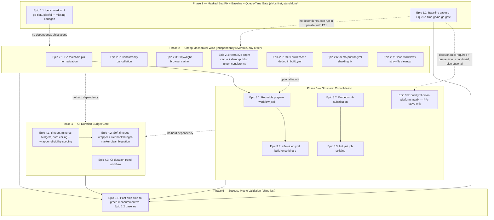

# Implementation Plan: ci-speed

**Feature**: Systematically reduce `tstapler/stapler-squad`'s GitHub Actions wall-clock time-to-green — fix a masked correctness bug, eliminate redundant per-workflow work, and add a durable CI-duration budget/gate — without adopting Bazel or reducing test coverage.
**Date**: 2026-08-27
**Status**: Ready for implementation
**ADRs**: [ADR-001: Reject Full Bazel/bzlmod Adoption](../decisions/ADR-001-reject-bazel-bzlmod-adoption.md), [ADR-002: CI-Duration Budget Mechanism](../decisions/ADR-002-ci-duration-budget-mechanism.md)

---

## Planning Approach (Step 0.5 — sequencing options considered)

Three high-level sequencing approaches were weighed against `requirements.md`'s Risk Control section ("land incrementally... behind normal PR review rather than one big-bang rewrite... each change should be independently revertible"):

1. **Quick-wins-first, concern-by-concern** (chosen) — fix the one masked correctness bug first (standalone, zero risk to speed goals), then land cheap/mechanical/independently-revertible fixes (toolchain pins, concurrency groups, caching gaps), then structural consolidation (shared prepare, job splitting), then the long-term CI-duration budget/gate. Each phase is ordered by risk × payoff, and every story within a phase touches one workflow file (or a tightly-scoped pair) so a single PR's blast radius stays small.
2. **Workflow-by-workflow** (rejected) — do all fixes for `build.yml`, ship, then all fixes for `lint.yml`, ship, etc. Rejected because most of the concrete findings (toolchain pins, missing `timeout-minutes:`, Playwright caching) are the *same* fix repeated across many files — bundling by workflow would mean re-deriving and re-reviewing the same mechanical pattern 10+ times instead of once per concern, and it would interleave trivial fixes with the highest-risk structural change (shared `prepare`) inside the same workflow's PR sequence.
3. **One big-bang restructuring PR** (rejected) — directly contradicts requirements.md's explicit Risk Control constraint; also the highest-blast-radius option for a repo with zero branch protection today (a bad interaction would be silently invisible until someone actually reads a broken run, per `research/architecture.md` §3).

Approach 1 is used below. Phases are sequenced by risk (correctness bug → mechanical → structural → budget/gate) but individual epics/stories within a phase have no hard ordering dependency on each other and can ship as separate small PRs in any order once their phase's prerequisites (if any) are met — see the Dependency Visualization.

---

## Domain Glossary

CI/build-infrastructure vocabulary used throughout this plan (not a business domain — EventStorming/Event-Command-Policy modeling is not applicable and is omitted per the task brief).

| Term | Definition | Notes |
|------|-----------|-------|
| Prepare Job / Prepare Artifact | The job (`build.yml`'s `prepare`, `.github/actions/prepare/action.yml`) that runs `buf generate` + `ent generate` + `next build` once and uploads the result (`gen/`, `session/ent/`, `server/web/dist/`) as the `generated-files` artifact | Gitignored outputs — nothing can rely on a checked-in copy (`research/architecture.md` §1) |
| Build-Once/Fan-Out | The pattern of running an expensive generation/compile step exactly once per workflow *run* and having every downstream job consume its artifact instead of re-running it | Already proven inside `build.yml`; this plan generalizes it across workflow *files* via a reusable workflow (Phase 3) |
| Reusable Workflow (`workflow_call`) | A GitHub Actions workflow file invoked by another workflow file via `uses: ./.github/workflows/<file>.yml` with `on: workflow_call`, whose jobs execute within the *calling* workflow's run — meaning artifacts it uploads are downloadable by sibling jobs in the same run | The mechanism this plan uses to share `prepare`'s output across `build.yml`, `mcp-integration.yml`, `e2e-video.yml`, etc., sidestepping GHA's lack of cross-*run* artifact sharing |
| Composite Action | A reusable sequence of steps (`.github/actions/<name>/action.yml`, `using: composite`) invoked with `uses:` inside a job | Distinct from a reusable workflow: runs as steps *within* the calling job, not as its own job |
| Detect-Changes Gate | A job (e.g. `build.yml`'s `detect-changes`) that always runs and computes an `if:`-consumed output, used instead of a trigger-level `paths:` filter on `pull_request`, specifically so a "not relevant" PR still posts a passing status | Exists because a `paths:`-filtered `pull_request` trigger never posts *any* status for a required check, which blocks merge forever if that check is later made required (`research/pitfalls.md` §2) |
| Skip-as-Pass | The documented GitHub Actions behavior where a job skipped via `if:` counts as a passing status for a required check (as opposed to "never triggered," which counts as permanently pending) | The property the Detect-Changes Gate pattern depends on |
| Cache Key Scope | The set of jobs/runs that share a single `actions/cache`/`setup-go cache:true`/`setup-node cache:'pnpm'` cache entry, determined by the key expression | This repo has 9+ independent Go cache scopes today because 9+ `setup-go` calls each compute their own scope rather than sharing one |
| Toolchain Pin Mismatch | `go.mod`'s `go 1.26.4` directive vs. `actions/setup-go`'s `go-version: '1.25.0'`/`'1.23'` inputs, which forces a toolchain re-download under `GOTOOLCHAIN=auto` on every job using the older pin | Fixed by `go-version-file: go.mod` (already correct in `benchmark.yml`'s 3 jobs) |
| Concurrency Group / Cancel-in-Progress | GitHub Actions' native mechanism for cancelling a superseded in-flight run of the same workflow+ref | Must exclude any job that persists shared state mid-run (e.g. `actions/cache/save`) — see `build.yml`'s `benchmark-gate` job for the correct exception pattern |
| Tail Latency | The gap between a workflow's average and maximum observed wall-clock duration (e.g. `build.yml`'s 18m avg / 81.5m max) | Distinct problem from median duration; caused by cache misses, contention, or flaky retries, not by the job's "normal" work |
| Wall-Clock Time-to-Green | The end-to-end elapsed time from a PR push to all checks that run on it reaching a terminal (non-pending) state | The requirements.md success metric's actual unit — not billed minutes (this is a public repo; Actions minutes on hosted runners are free) |
| Required Check | A GitHub branch-protection status check that must pass before a PR can merge | **Verified: none exist on `main` today** (`research/architecture.md` §3) — this plan designs job/check names as if protection will be (re-)added afterward, without actually turning it on as part of this initiative (see Unresolved Questions) |
| Aggregate Check | A single required-check job (e.g. `ci-passed`) with `needs: [...]` and `if: always()` that fans out to the real jobs internally, so future job renames never require a branch-protection settings edit | Recommended pattern for whenever required checks are (re-)added (`research/pitfalls.md` §4) — not implemented in this plan's phases, since no required checks exist to protect yet; captured as an Unresolved Question |
| CI-Duration Budget | The combination of (a) a native `timeout-minutes:` hard ceiling per job and (b) an advisory trend-detection script — see ADR-002 | Deliberately does *not* mean a custom blocking duration-check script (rejected per ADR-002) |
| Soft-Timeout Wrapper | A shell-level `timeout <N>m <command> \|\| { echo "::error::CI-BUDGET-EXCEEDED: ..."; exit 1; }` wrapped around a job's longest-running step, budgeted a few minutes *below* that job's `timeout-minutes:` hard ceiling, so the step fails (and emits the marker annotation) before GHA's own `timeout-minutes:` can kill the job outright and skip every remaining step | Phase 4, Epic 4.2 — applied only to the wrapper-eligible jobs Epic 4.1 names (genuinely slow/variable under normal conditions), not every job with a new `timeout-minutes:` |
| Budget-Exceeded Marker | The `CI-BUDGET-EXCEEDED:`-prefixed `::error::` annotation a Soft-Timeout Wrapper emits, scanned for by `server/services/github_webhook_pr_fix.go` (via the check run's annotations, fetched by `check_run.id` from the webhook payload — not by matching `context.job` against a check run's display name, which doesn't reliably work for jobs with a custom `name:` override) so the auto-fix webhook can distinguish a budget failure from a code failure | Phase 4, Epic 4.2 |
| Baseline Cache (immutable-key workaround) | The `key: bench-<name>-${{ github.run_id }}` / `restore-keys: bench-<name>-` pattern used by `benchmark.yml`'s and `build.yml`'s benchmark-gate jobs to work around `actions/cache`'s write-once key semantics | Already correct in this repo; not modified by this plan except where noted |
| Shard | One parallel slice of a Playwright test run, split via `--shard=N/M` | `e2e-video.yml` already shards 2-way over a curated 5-spec subset; `demo-publish.yml` does not shard at all (Phase 2, Epic 2.6) |
| Embed-Stub Substitution | Replacing a real `next build` with a one-line `server/web/dist/index.html` stub (`lint.yml:109-112`) for jobs that only need `go build`/`go test` to compile against `server/web/embed.go:8`'s `//go:embed all:dist`, not a functioning UI | Phase 3, Epic 3.2 — extracted into the `.github/actions/prepare-stub` composite action (Story 3.2.0) so `mcp-integration.yml`, `goreleaser-check.yml`, and `lint.yml`'s own `lint-prepare` job (Epic 3.3) share one definition instead of 3 copy-pasted sequences |
| `generated-files` vs. `lint-generated-files` | Two differently-named artifacts serving the same "codegen output other jobs can download instead of regenerating" role: `generated-files` (Epic 3.1's `_prepare.yml`) includes a full `next build`; `lint-generated-files` (Epic 3.3's `lint-prepare` job) includes the Embed-Stub Substitution instead. Not interchangeable — a job needing a real UI must use `generated-files` | Distinct on purpose (real build vs. stub build), not a naming drift bug; `generated-files`'s name itself is a `workflow_call` output on `_prepare.yml` (`${{ needs.prepare.outputs.artifact-name }}`), not a literal restated at each of its 7+ consumers |

---

## Pattern Decisions

| Component | Pattern Chosen | Source | Alternative Rejected | Reason |
|-----------|---------------|--------|---------------------|--------|
| Shared codegen across workflow files | Reusable workflow (`workflow_call`) — a Template-Method-shaped single canonical `prepare` sequence, callers supply only their own trigger/job graph | `research/architecture.md` §2 Pattern A; `research/features.md` §2 | Cross-run `actions/download-artifact` via `run-id` + `actions:read` token, correlating commit SHAs across separate workflow runs | Adds a hard coupling between workflow files (one must discover the other's matching run-id) and a new failure mode (no matching run found) for a smaller win than keeping both jobs inside one run via `workflow_call` |
| Naming the `generated-files` artifact so 7+ consumer jobs stay in sync | A `workflow_call.outputs.artifact-name` value on `_prepare.yml`, consumers reference `${{ needs.prepare.outputs.artifact-name }}` | Architecture review Concern #1 | A literal `generated-files` string retyped in every consumer's `actions/download-artifact@v4` step | A retyped literal has no compiler/lint signal on drift — a future rename requires a coordinated edit across every consumer with only a runtime "artifact not found" failure catching a missed one; an output makes the name a one-file edit |
| Jobs needing only `go build`/`go test` to compile, not a real UI (`mcp-integration.yml`, `goreleaser-check.yml`'s `build-smoke-test`) | Embed-Stub Substitution (Null-Object-shaped stand-in for the Next.js build), reusing `lint.yml`'s existing stub | `research/architecture.md` §2; `research/features.md` §2 | Route these jobs through the shared reusable `prepare` (full `next build`) like everything else | The full build is the single most expensive step in `prepare`; these jobs assert nothing about the UI, so paying for it buys zero additional test coverage |
| Repeated per-job tmux build+cache boilerplate (4x in `build.yml`) | New composite action (Facade over the copy-pasted steps) | `research/build-vs-buy.md` Option C/D; `research/stack.md` §6 | Continue copy-pasting the block | This repo already establishes composite actions as the idiom (`.github/actions/prepare`); a second one collapses 4 near-identical blocks to one definition, and (combined with folding the binary into the `generated-files` artifact) turns 4 parallel cache-miss builds into 1 |
| Repeated per-job buf+ent+stub boilerplate (3x across `mcp-integration.yml`, `goreleaser-check.yml`, `lint.yml`'s `lint-prepare`) | New composite action `.github/actions/prepare-stub` (same Facade pattern as `build-tmux`) | Architecture review Concern #5; Epic 2.5 precedent | Continue copy-pasting the buf-install/`buf generate proto`/`ent generate`/stub sequence into each of the 3 jobs | Identical duplication shape to the tmux block Epic 2.5 already fixes; leaving this one copy-pasted while fixing tmux is an inconsistent application of the plan's own stated idiom |
| CI-duration hard ceiling | Native `timeout-minutes:` per job | `research/build-vs-buy.md` Decision 2 Option C; ADR-002 | Custom bash/Go duration-checking script (Option A); single-maintainer marketplace lint action (Option B) | Native GHA feature, zero new maintenance surface, already partially adopted (`benchmark.yml`, `ux-analysis.yml`, `build.yml`'s `benchmark-gate`); custom code duplicates it with strictly worse failure modes (can silently fail to gate, or falsely block an unrelated PR) |
| CI-duration trend/regression detection | Small, repo-owned, advisory-only scheduled script using `gh api` | `research/build-vs-buy.md` Decision 2 Option D; ADR-002 | No trend detection at all; a marketplace historical-trend action (none found fitting this repo's own run-history shape) | No existing tool does "regression-detect this specific repo's own run-duration history"; the script is justified custom code per `research/build-vs-buy.md` §3 and is kept advisory (never fails a check) so a bug in it can't block a merge |
| Distinguishing a budget failure from a code failure for the auto-fix webhook | A `CI-BUDGET-EXCEEDED:` marker emitted as a normal `::error::` step annotation by a Soft-Timeout Wrapper (not GHA's native `timeout-minutes:`, which kills the job before any later step — including a `github-script` step — can run), scanned for by `server/services/github_webhook_pr_fix.go` via the check run's annotations (`GET /repos/{owner}/{repo}/check-runs/{id}/annotations`, keyed by `check_run.id` already in the webhook payload) | `research/ux.md` §3; adversarial review Blocker 1; architecture review Concern #3 | (a) A new/custom check-run conclusion value; (b) `actions/github-script` + `checks: write` setting `output.title` on the job's own check run, looked up by matching `context.job` against the check run's display `name:` | (a) GitHub's check-run `conclusion` enum is fixed (cannot add `budget_exceeded`). (b) `context.job` is the job's YAML id (e.g. `test`), not its display name (e.g. `Test` — `build.yml`'s `test` job overrides `name:`), so the lookup silently matches nothing; annotations are keyed by `check_run.id`, which the webhook payload already carries, so no job-name lookup is needed on either side, and the annotation is written synchronously by the failing step itself (never dependent on a later step running) |
| Job/check-identity stability ahead of (re-)adding branch protection | Recorded as an Unresolved Question / future Aggregate Check, not implemented now | `research/pitfalls.md` §4; `research/architecture.md` §3 | Pointing a newly-added branch-protection rule directly at individual job names as part of this plan | No branch protection exists today (verified via `gh api repos/tstapler/stapler-squad/branches/main/protection` → 404) — turning it on is a repo-owner decision outside this plan's scope (requirements.md doesn't ask this plan to add it), so designing the Aggregate Check now would be speculative; job/step renames in this plan are still done defensively (see per-epic notes) so adding protection later is a settings change, not a re-plan |
| Whole build-graph incrementality (Go+web-app+ent+proto+tmux) | Not adopted — see ADR-001 | `research/build-vs-buy.md` Option A; requirements.md Rabbit Holes | Full Bazel + bzlmod adoption | Migration cost (Gazelle + ent + buf + `aspect_rules_js`/Next.js wiring) doesn't fit this initiative's 3–6 week appetite relative to the lower-risk fixes in Phases 2–3 that capture most of the measured redundancy; free-runner constraint removes Bazel's biggest lever (remote execution); this repo has direct scar tissue from a narrower Bazel adoption already breaking under a version migration (`b51b60eb1`) |
| `web-app/`-scoped task caching (Turborepo/Nx) | Not adopted this phase | `research/build-vs-buy.md` Option B | Turborepo or Nx adoption for `web-app/` | `web-app/` is a single-package pnpm project, not a multi-package workspace — these tools' core value (cross-package affected-graph analysis) has nothing to bite on until/unless it becomes one; Phase 2's pnpm/Playwright caching fixes and Phase 3's shared-prepare consolidation capture the available win for a single-package frontend at zero new-dependency cost |
| Detect-Changes Gate / three hand-maintained path-relevance regex lists (`build.yml`, `mcp-integration.yml`, `tools/ci/detect-feature-changes.sh`) | Retained as-is | `research/architecture.md` §2 Pattern B, §4c; `research/pitfalls.md` §2 | Replacing all three with one Bazel-style affected-target dependency graph | Consolidating the three regex lists into one shared source of truth is a real correctness improvement (`research/architecture.md` §4c flags drift risk), but it is not itself a speed lever and is out of scope for this plan's phases — recorded as an Unresolved Question / future follow-up, not solved here |
| `build.yml`'s redundant per-PR job count | Restrict the `build` job's 5-way `GOOS`/`GOARCH` matrix to `linux/amd64` only on `pull_request` events, full width on `push`-to-`main`/`workflow_dispatch` (Epic 3.5) | `research/pitfalls.md` §4; cross-artifact consistency review Blocker 1 | (a) Merging `test`/`pty-race-regression`/`integration-coverage` into one job; (b) leaving the 5-way matrix unchanged on every event | (a) rejected — these three jobs run in parallel today, so merging them would serialize currently-concurrent work and lengthen wall-clock, working against this plan's own primary success metric even though it would reduce total compute; requirements.md doesn't ask for total-compute reduction at wall-clock's expense. (b) rejected — nothing on a PR run actually exercises the 4 non-`linux/amd64` binaries (only `goreleaser-check.yml`'s single-target smoke test and `release.yml`'s tag-triggered release build do), so those 4 extra concurrent job slots buy no additional per-PR confidence; a genuine cross-compile break is still caught on the next push to `main`, before any release tag |

---

## Migration Plan

N/A — this project changes GitHub Actions workflow YAML, one composite action, one new reusable workflow file, and a small Go change to `server/services/github_webhook_pr_fix.go` (webhook-payload field read, no schema change). No database schema, data migration, or persisted-state format changes are involved.

## Observability Plan

- **Logs**: unchanged (workflow run logs). Every job touched by Phase 4's budget work additionally writes a `$GITHUB_STEP_SUMMARY` line reporting its own elapsed time vs. its declared budget (`research/ux.md` §1) — visible on the run's "Summary" tab without opening raw logs.
- **Metrics**: a new scheduled workflow (`.github/workflows/ci-duration-trend.yml`, Phase 4 Epic 4.3) runs weekly, calls `GET /repos/tstapler/stapler-squad/actions/runs` (list-level, not per-job, per `research/pitfalls.md` §6's rate-limit guidance) for each of the 14 workflow files, computes a rolling 15-run average duration, and writes the result to `docs/ci/duration-history.jsonl` (committed, so history survives independent of any single run's artifact retention) plus a `$GITHUB_STEP_SUMMARY` trend table.
- **Alerts**: `::error::CI-BUDGET-EXCEEDED: ...` annotations (human-visible, PR-checks-tab-visible) for hard-ceiling breaches (Phase 4 Epic 4.1/4.2); a `::warning::` annotation (never a failing check) from the trend script when a workflow's rolling average grows >25% over its prior 15-run baseline. No external alerting channel (Slack/email/PagerDuty) is introduced — this is a public, unbilled repo with no on-call pressure (`research/pitfalls.md` §6), so a PR-visible annotation plus the committed trend history is sufficient.

## Risk Control

- **Feature flag**: not applicable to CI workflow configuration itself (matches requirements.md's own framing — "No feature-flag equivalent applies to CI config itself").
- **Rollback procedure**: every story below is scoped to one workflow file (or one workflow file + the one composite/reusable-workflow file it depends on); `git revert` of that story's commit/PR fully undoes it without touching any other workflow's behavior. Phase 3's reusable-workflow migration is the one exception with a wider blast radius per-story (each consuming workflow's migration touches two files: the consumer and, only on the first such story, the new `_prepare.yml`) — see Epic 3.1's task notes for the mitigation (land the reusable workflow itself, unused by anyone, in its own zero-risk PR first).
- **Staged rollout**: Phase 1 (bug fix) ships first and alone. Phases 2–4 have no hard merge-order dependency *between* phases — Phase 4's `timeout-minutes:` additions, for example, don't need Phase 3's job splitting to land first — but within Phase 3, Epic 3.1 (reusable `prepare` workflow) must merge before Epic 3.2/3.4's stories that build on it (see Dependency Visualization). Every story is independently mergeable and independently revertible, matching requirements.md's Risk Control section verbatim.

## Unresolved Questions

- [ ] Is GitHub's per-repo Actions cache rate limit (200 uploads/min, 1500 downloads/min) actually being hit today, causing tail latency, or is `build.yml`'s 81.5m max vs 18m avg explained by something else (queueing, a specific flaky retry)? — blocks how aggressively Epic 2.5/Epic 3.1 should collapse the 9+ independent Go cache scopes vs. leaving them as-is once the toolchain-pin fix (Epic 2.1) and build-once consolidation (Epic 3.1) land — owner: whoever implements Phase 2/3, pull `gh api repos/tstapler/stapler-squad/actions/runs/<id>/jobs` timing for a sample of recent `build.yml` runs before deciding scope.
- [x] ~~What is the actual `created_at` → `run_started_at` queue-time delta on `build.yml` and `mcp-integration.yml`'s worst runs (queueing vs. compute)?~~ — **Resolved into a scheduled gate, not left open**: Story 1.2.2 (Epic 1.2) now measures this directly and applies a stated decision rule (>15% median queue-time share, or same-PR run overlaps in >1-in-5 samples ⇒ Epic 3.5 becomes required scope) before Phase 2 sign-off, per pre-mortem.md Failure #1's prevention.
- [ ] Should branch protection / required checks actually be (re-)added to `main` as part of this initiative, or left for the repo owner to decide separately? — blocks whether the Aggregate Check pattern (Pattern Decisions table) should be implemented now or deferred — owner: Tyler (repo owner decision; requirements.md does not explicitly ask this plan to turn protection on, so this plan defers it).
- [ ] Is `go.mod`'s direct dependency on `github.com/bufbuild/buf` (as a library, not just the standalone CLI every workflow downloads separately) load-bearing, or leftover? — blocks a possible follow-up story to shrink `go.sum`/module-cache-restore payload across all `setup-go` call sites — owner: implementer, `grep -rn '"github.com/bufbuild/buf' --include='*.go'` before proposing removal (`research/stack.md` §6).
- [ ] Should the three hand-maintained path-relevance regex lists (`build.yml:65`, `mcp-integration.yml:49`, `tools/ci/detect-feature-changes.sh`) be consolidated into one shared source of truth? — blocks a correctness (not speed) follow-up flagged by `research/architecture.md` §4c — owner: future story, out of this plan's phases; noted so it isn't lost.

## Dependency Visualization



---

## Phase 1: Fix the Masked Benchmark Correctness Bug

### Epic 1.1: `benchmark.yml`'s `go-tier1` job silently reports success while 4 of 9 target packages fail to compile

**Goal**: Make the job fail loudly when its target packages don't compile, and give it the generated code it's missing — a standalone, low-risk fix that ships before any speed-focused restructuring, per `.claude/rules/fix-flaky-tests-dont-defer.md`'s "fix it now, don't re-excuse" philosophy and `research/architecture.md` §4(a)'s root-cause writeup.

#### Story 1.1.1: `go-tier1` fails loudly instead of silently swallowing `go test`'s exit code
**As a** contributor relying on `benchmark.yml`'s Tier 1 gate, **I want** the job to actually fail when its benchmarked packages don't compile, **so that** `BenchmarkEventBus`, `BenchmarkReviewQueue`, `BenchmarkDetectCommandsInText`, and everything else under `./session`, `./server/events`, `./session/unfinished`, `./session/queue` is actually exercised instead of silently skipped.
**Acceptance Criteria**:
- The "Run Tier 1 benchmarks" step in `.github/workflows/benchmark.yml` (currently `go test ... | tee tier1-bench.txt` at line 84, no `set -o pipefail`) fails the job when `go test` exits non-zero.
  - *Given* a PR that breaks a package under `./session` (e.g. a `session/ent` import that no longer resolves because ent-gen wasn't run), *When* `go-tier1`'s benchmark step runs, *Then* the step's shell exits non-zero (via `set -o pipefail`) and the job conclusion is `failure`, not `success`.
- `go-tier1` generates the code its target packages need before running benchmarks.
  - *Given* a clean checkout with no `gen/proto/go/session/v1` or `session/ent/*.go` present, *When* the `go-tier1` job runs, *Then* a `buf generate proto` step and a `go run -mod=mod entgo.io/ent/cmd/ent generate --feature sql/upsert ./session/ent/schema` step both run before the "Run Tier 1 benchmarks" step, and all 9 target packages (`./server/events ./server/terminal ./session/scrollback ./session ./session/detection/ratelimit ./session/tmux ./session/unfinished ./session/queue ./session/tokens`) compile.
**Files**: `.github/workflows/benchmark.yml`

##### Task 1.1.1a: Add `set -o pipefail` to the go-tier1 benchmark step (~2 min)
- In `.github/workflows/benchmark.yml`'s "Run Tier 1 benchmarks" step (line ~76-84), change the `run: |` block's first line to `set -o pipefail` before the `go test ... | tee tier1-bench.txt` command.
- Files: `.github/workflows/benchmark.yml`

##### Task 1.1.1b: Add a buf-install step to go-tier1 (~3 min)
- Add a step before "Run Tier 1 benchmarks" that installs the `buf` CLI (mirror `lint.yml:84-86`'s `curl -sSL .../buf-Linux-x86_64 -o /usr/local/bin/buf && chmod +x /usr/local/bin/buf` pattern, since this job doesn't already set up pnpm/Node and doesn't need the full `.github/actions/prepare` composite — it only needs Go-side generated code, not a web UI build).
- Files: `.github/workflows/benchmark.yml`

##### Task 1.1.1c: Add `buf generate proto` + `ent generate` steps to go-tier1 (~3 min)
- Add two steps before "Run Tier 1 benchmarks": `run: buf generate proto` and `run: go run -mod=mod entgo.io/ent/cmd/ent generate --feature sql/upsert ./session/ent/schema` (mirror `benchmark.yml`'s own `e2e-latency` job, lines 580-584, which already does both in this exact order).
- Files: `.github/workflows/benchmark.yml`

##### Task 1.1.1d: Verify all 9 target packages now compile and run (~5 min)
- After the edits above, run locally (or via `workflow_dispatch` on this branch): `buf generate proto && go run -mod=mod entgo.io/ent/cmd/ent generate --feature sql/upsert ./session/ent/schema && go test -bench='BenchmarkEventBus|BenchmarkDeltaGenerat|BenchmarkCircularBuffer|BenchmarkGetTimeSinceLastMeaningfulOutput|BenchmarkStripANSI|BenchmarkStripANSICodes|BenchmarkIsBanner|BenchmarkProcessOutput|BenchmarkDiffShortstat|BenchmarkReviewQueue|BenchmarkDetectCommandsInText|BenchmarkTokenParser' -run='^$' -benchmem -count=1 -timeout=10m ./server/events ./server/terminal ./session/scrollback ./session ./session/detection/ratelimit ./session/tmux ./session/unfinished ./session/queue ./session/tokens` and confirm zero `[setup failed]` lines in the output (previously 4 of 9 packages failed this way per `research/architecture.md` §4(a)'s verified run-log citation).
- Files: none (verification only)

---

### Epic 1.2: Baseline capture for the plan's primary success metric, and a queue-time go/no-go gate

**Goal**: requirements.md's Success Metric is "cut typical per-PR wall-clock **time-to-green** by ~50%" — the end-to-end elapsed time from a PR push to *every* required check on that PR reaching a terminal state, aggregated across all workflows a PR triggers, not any single workflow's own duration (Domain Glossary's "Wall-Clock Time-to-Green"). Nothing else in this plan measures that aggregate quantity — Epic 4.3's trend workflow tracks a rolling *per-workflow* average, a different quantity. Record the pre-fix baseline now, before any Phase 2–4 change ships, using the same methodology `requirements.md`'s own per-workflow baseline table used (`gh run list`/`gh run view` against recent runs), so Epic 5.1 has something concrete to diff against. Low-cost, no code dependencies — can run in parallel with Epic 1.1, does not block or get blocked by any other epic.

This epic also closes **pre-mortem.md's P1 finding**: per-PR time-to-green could be dominated by GitHub-side queue time (multiple workflows/PRs contending for the free-tier 20-concurrent-job ceiling) rather than by any single workflow's compute time — in which case Phase 2/3/4's per-job/per-workflow compute speedups would not move the aggregate metric at all. Story 1.2.2 promotes this from an unowned Unresolved Question to a concrete, scheduled measurement with a stated decision rule, run before Phase 2 sign-off.

#### Story 1.2.1: Aggregate per-PR time-to-green is measured and recorded for a sample of recent merged PRs
**As a** future reader of this project's outcome, **I want** a recorded "before" number for the actual success metric, **so that** Epic 5.1's "after" number can be compared against something real instead of only the per-workflow baseline table.
**Acceptance Criteria**:
- A methodology note plus a data table recording, for a sample of the last ~15–20 merged PRs (as of 2026-08-27, before Phase 2 lands): each PR's aggregate time-to-green, computed as (last `updated_at` among that PR's required-check-shaped workflow runs) minus (earliest `created_at`/`run_started_at` among the workflow runs triggered by that PR's head commit push) — using `gh pr list --state merged --limit 20 --json number,mergedAt,headRefOid` to enumerate PRs, then `gh run list --json ...` filtered to each PR's `headRefOid` to gather each PR's triggered runs, matching the approach already used to build requirements.md's own per-workflow table.
  - *Given* the last 15–20 merged PRs before this plan's Phase 2 lands, *When* this story's data-gathering script/commands run, *Then* a median and p90 aggregate time-to-green is recorded (e.g. in `docs/ci/baseline-time-to-green.md` or inline in this plan's Unresolved Questions/Observability Plan section), alongside the exact `gh` invocations used, so Epic 5.1 can reproduce the same methodology later without re-deriving it.
  - *Given* `research/pitfalls.md` §0's stale-trigger-config pitfall (a workflow's `on:` block changing mid-sample, e.g. `demo-publish.yml`'s `workflow_dispatch`-only cutover), *When* selecting the PR sample, *Then* PRs are drawn from a window where every triggered workflow's current `on:` config was already in effect, to avoid mixing pre-/post-cutover runs into one average.
**Files**: `docs/ci/baseline-time-to-green.md` (new)

##### Task 1.2.1a: Enumerate the PR sample and gather each PR's triggered workflow runs (~10 min)
- `gh pr list --repo tstapler/stapler-squad --state merged --limit 20 --json number,mergedAt,headRefOid,createdAt`, then for each PR, `gh run list --repo tstapler/stapler-squad --json databaseId,name,event,createdAt,updatedAt,headSha --limit 50 | jq '[.[] | select(.headSha == "<headRefOid>")]'` to find every workflow run that PR's head commit triggered.
- Files: none (data-gathering only)

##### Task 1.2.1b: Compute per-PR aggregate time-to-green and summarize (~10 min)
- Per PR: time-to-green = max(`updatedAt` across that PR's runs) − min(`createdAt` across that PR's runs). Compute median and p90 across the sample.
- Files: `docs/ci/baseline-time-to-green.md` (new)

##### Task 1.2.1c: Record the methodology and results (~5 min)
- Write `docs/ci/baseline-time-to-green.md`: the exact commands from Task 1.2.1a/b, the PR sample (numbers + dates), the computed median/p90, and an explicit note that this is the number Epic 5.1's post-ship measurement (Phase 5) must reproduce and diff against.
- Files: `docs/ci/baseline-time-to-green.md` (new)

#### Story 1.2.2: Queue-time share of wall-clock is measured as a go/no-go gate before Phase 2 begins
**As a** plan implementer, **I want** to know whether GitHub-side queueing (not compute) dominates this repo's CI wall-clock, **so that** Phase 2/3's compute-focused fixes aren't shipped on the false assumption that they alone will move the aggregate time-to-green metric.
**Acceptance Criteria**:
- Using the same run data gathered in Task 1.2.1a (no new API calls needed), compute `run_started_at − created_at` (queue-time) and `updated_at − run_started_at` (compute-time) for every run in the PR sample, and report queue-time as a percentage of each run's total wall-clock, plus the count of runs where more than one workflow from the same PR was queued concurrently (a same-PR overlap in `[created_at, run_started_at]` windows across ≥2 of that PR's triggered runs).
  - *Given* the Task 1.2.1a run sample, *When* this story's analysis runs, *Then* `docs/ci/baseline-time-to-green.md` gains a "Queue-Time Share" section reporting the median/p90 queue-time percentage and the concurrent-overlap count.
- **Decision rule** (closes pre-mortem.md Failure #1): *if* the median queue-time share exceeds 15% of total wall-clock, or concurrent same-PR overlaps appear in more than 1 in 5 sampled runs, *then* Epic 3.5 (added below, "Per-PR job-fan-out reduction") is promoted from optional to required scope before Phase 3 is considered complete; *otherwise* Epic 3.5 remains optional/lower-priority, and this story's findings are recorded as the reason.
  - *Given* the computed queue-time percentages, *When* the decision rule is evaluated, *Then* `docs/ci/baseline-time-to-green.md` states explicitly which branch was taken ("required" or "optional") and why, so a later reader doesn't have to re-derive the decision.
**Files**: `docs/ci/baseline-time-to-green.md`

##### Task 1.2.2a: Compute queue-time and concurrent-overlap metrics from the existing sample (~8 min)
- Reuse Task 1.2.1a's already-gathered `createdAt`/`run_started_at`/`updatedAt` per run (re-fetch per-run detail via `gh run view <id> --json createdAt,startedAt,updatedAt` if `run_started_at` wasn't captured at list-granularity); compute per-run queue-time share and flag same-PR overlaps.
- Files: none (analysis only)

##### Task 1.2.2b: Apply the decision rule and record it (~3 min)
- Append the "Queue-Time Share" section and the explicit required/optional decision to `docs/ci/baseline-time-to-green.md`.
- Files: `docs/ci/baseline-time-to-green.md`

---

## Phase 2: Cheap, Mechanical, Low-Risk Wins

Each epic below is independently revertible and touches only the workflow file(s) named. No epic in this phase depends on another.

### Epic 2.1: Go toolchain pin normalization

**Goal**: Stop paying a repeated `golang.org/toolchain@go1.26.4` network download across every job whose pinned `go-version:` is older than `go.mod`'s `go 1.26.4` directive, by switching every `actions/setup-go` call to `go-version-file: go.mod` (already the correct pattern in `benchmark.yml`'s 3 jobs).

#### Story 2.1.1: Every `actions/setup-go` call site uses `go-version-file: go.mod`
**As a** contributor waiting on CI, **I want** every job's Go setup to resolve the toolchain from `go.mod` directly, **so that** no job pays a toolchain download that a differently-pinned sibling job's cache doesn't share.
**Acceptance Criteria**:
- Every `actions/setup-go` step outside `benchmark.yml` (which is already correct) uses `go-version-file: go.mod` instead of a literal `go-version:` string.
  - *Given* `.github/workflows/mcp-integration.yml:70-72` currently reading `uses: actions/setup-go@v5` / `with: go-version: '1.25.0'`, *When* this story lands, *Then* it reads `with: go-version-file: 'go.mod'` and the job's Go setup step log shows Go 1.26.4 being resolved directly, with no `GOTOOLCHAIN` re-exec warning in the subsequent `go test`/`go build` step's output.
**Files**: `.github/actions/prepare/action.yml`, `.github/workflows/build.yml`, `.github/workflows/lint.yml`, `.github/workflows/mcp-integration.yml`, `.github/workflows/registry-validation.yml`, `.github/workflows/e2e-video.yml`, `.github/workflows/demo-publish.yml`, `.github/workflows/ux-analysis.yml`, `.github/workflows/release.yml`, `.github/workflows/release-please.yml`

##### Task 2.1.1a: Fix `.github/actions/prepare/action.yml` (~2 min)
- Line 10: change `go-version: '1.25.0'` to `go-version-file: '../../../go.mod'` — **note**: composite actions resolve relative paths from the *calling* workflow's checkout root, not the action's own directory, so verify the correct relative path resolves to the repo-root `go.mod` (test via a `workflow_dispatch` run) rather than assuming a literal `'go.mod'` string works identically to a workflow-level step; if the composite-action context requires an absolute-from-root path, use `go-version-file: 'go.mod'` (GitHub Actions composite actions execute with the calling job's working directory, which is the repo root by default, so `'go.mod'` is expected to resolve correctly — confirm in the same PR's CI run before merging).
- Files: `.github/actions/prepare/action.yml`

##### Task 2.1.1b: Fix all 7 `setup-go` sites in `build.yml` (~5 min)
- Lines 141, 218, 450, 541, 607, 652, 703: change each `go-version: '1.25.0'` to `go-version-file: 'go.mod'`.
- Files: `.github/workflows/build.yml`

##### Task 2.1.1c: Fix `lint.yml` (~2 min)
- Line 68: change `go-version: '1.25.0'` to `go-version-file: 'go.mod'`.
- Files: `.github/workflows/lint.yml`

##### Task 2.1.1d: Fix `mcp-integration.yml` (~2 min)
- Line 72: change `go-version: '1.25.0'` to `go-version-file: 'go.mod'`.
- Files: `.github/workflows/mcp-integration.yml`

##### Task 2.1.1e: Fix `registry-validation.yml` (~2 min)
- Line 26: change `go-version: '1.25.0'` to `go-version-file: 'go.mod'`.
- Files: `.github/workflows/registry-validation.yml`

##### Task 2.1.1f: Fix `e2e-video.yml` (~2 min)
- Line 78: change `go-version: '1.25.0'` to `go-version-file: 'go.mod'`. (This job also uses the outdated `actions/setup-go@v4` — bump to `@v5` in the same edit, matching every other workflow's pin.)
- Files: `.github/workflows/e2e-video.yml`

##### Task 2.1.1g: Fix `demo-publish.yml` (~2 min)
- Line 26: change `go-version: '1.23'` to `go-version-file: 'go.mod'`; bump `actions/setup-go@v4` to `@v5`.
- Files: `.github/workflows/demo-publish.yml`

##### Task 2.1.1h: Fix `ux-analysis.yml` (~2 min)
- Line 43: change `go-version: '1.23'` to `go-version-file: 'go.mod'`; bump `actions/setup-go@v4` to `@v5`.
- Files: `.github/workflows/ux-analysis.yml`

##### Task 2.1.1i: Fix `release.yml` and `release-please.yml` (~3 min)
- `release.yml` line 99, `release-please.yml` line 100: change `go-version: '1.25.0'` to `go-version-file: 'go.mod'`.
- Files: `.github/workflows/release.yml`, `.github/workflows/release-please.yml`

---

### Epic 2.2: Concurrency cancellation for workflows that currently have none

**Goal**: Cancel a superseded run's in-flight jobs on `lint.yml`, `mcp-integration.yml`, and `build.yml` (the three highest-average-duration workflows with no `concurrency:` block today), mirroring the already-correct pattern in `e2e-video.yml`/`ux-analysis.yml`.

#### Story 2.2.1: `lint.yml` and `mcp-integration.yml` cancel superseded runs
**As a** contributor pushing a quick follow-up fix to an open PR, **I want** the previous CI run for my old commit to stop consuming runner time, **so that** I'm not waiting behind (or contending with) a run I already know is stale.
**Acceptance Criteria**:
- `lint.yml` gains a workflow-level `concurrency:` block scoped per-PR with `cancel-in-progress: true`.
  - *Given* PR #999 has an in-flight `lint.yml` run for commit A, *When* commit B is pushed to the same PR, *Then* the run for commit A is cancelled (conclusion `cancelled`) rather than running to completion.
- `mcp-integration.yml` gains the same, applied only when the workflow is running for a `pull_request` event (this workflow also runs on `push` to `main`, where a superseded run should not exist in the same way a PR's does, but cancelling a main push is harmless here since `mcp-integration` writes no shared state).
  - *Given* the same scenario on `mcp-integration.yml`, *Then* the same cancellation behavior applies.
**Files**: `.github/workflows/lint.yml`, `.github/workflows/mcp-integration.yml`

##### Task 2.2.1a: Add concurrency block to lint.yml (~2 min)
- After the `on:` block (before `jobs:`), add:
  ```yaml
  concurrency:
    group: lint-${{ github.event.pull_request.number || github.ref }}
    cancel-in-progress: true
  ```
- Files: `.github/workflows/lint.yml`

##### Task 2.2.1b: Add concurrency block to mcp-integration.yml (~2 min)
- Same block, `group: mcp-integration-${{ github.event.pull_request.number || github.ref }}`.
- Files: `.github/workflows/mcp-integration.yml`

#### Story 2.2.2: `build.yml` cancels superseded PR runs without disturbing its main-push `benchmark-gate` baseline-save
**As a** contributor, **I want** `build.yml`'s expensive job graph to cancel on a superseded PR push, **without** risking a cancelled-mid-write benchmark baseline on `main`.
**Acceptance Criteria**:
- `build.yml` gains a workflow-level `concurrency:` block whose `cancel-in-progress` mirrors `benchmark.yml`'s own already-correct conditional (`${{ github.ref != 'refs/heads/main' }}`), so PR runs cancel but main-branch runs never do.
  - *Given* PR #999 has an in-flight `build.yml` run for commit A, *When* commit B is pushed, *Then* commit A's run is cancelled.
  - *Given* a push to `main` triggers `build.yml` while a previous push to `main` is still running, *When* the new push's run starts, *Then* the previous run is **not** cancelled (its `benchmark-gate` job's `actions/cache/save` step, if in flight, completes normally) — this is enforced by `cancel-in-progress: ${{ github.ref != 'refs/heads/main' }}` at the workflow level, consistent with `benchmark-gate`'s existing job-level `cancel-in-progress: false` override (which remains unchanged and continues to apply within its own narrower `baseline-push-main` group).
**Files**: `.github/workflows/build.yml`

##### Task 2.2.2a: Add workflow-level concurrency block to build.yml (~3 min)
- After the `permissions:` block (before `jobs:`), add:
  ```yaml
  concurrency:
    group: build-${{ github.event.pull_request.number || github.ref }}
    cancel-in-progress: ${{ github.ref != 'refs/heads/main' }}
  ```
- Files: `.github/workflows/build.yml`

##### Task 2.2.2b: Confirm no interaction with benchmark-gate's job-level concurrency (~2 min)
- Verify (by reading GitHub's concurrency docs' documented job-vs-workflow-level precedence, and/or by triggering a `workflow_dispatch` test run) that `benchmark-gate`'s own `concurrency: {group: baseline-push-main, cancel-in-progress: false}` (line 691-693) continues to take precedence for that specific job over the new workflow-level group — a job's own `concurrency:` block defines a separate group for that job, distinct from the workflow-level group, per GitHub's documented behavior.
- Files: none (verification only)

---

### Epic 2.3: Playwright browser binary caching

**Goal**: Cache `~/.cache/ms-playwright` across the 4 workflows that each cold-install Chromium today, keeping `playwright install-deps` (system libs) running unconditionally since it's decoupled from the browser-binary cache.

#### Story 2.3.1: Playwright Chromium binary is cached, keyed on lockfile + pinned version
**As a** contributor, **I want** Playwright's browser binary to be restored from cache instead of downloaded fresh, **so that** each of the 4 workflows that install it saves the ~40s+ download on a cache hit.
**Acceptance Criteria**:
- `e2e-video.yml`, `ux-analysis.yml`, and `benchmark.yml`'s `frontend-throughput`/`e2e-latency` jobs each gain an `actions/cache` step for `~/.cache/ms-playwright` before their `playwright install`/`npx playwright install --with-deps chromium` step, keyed on `hashFiles('tests/e2e/pnpm-lock.yaml')` (or `web-app/pnpm-lock.yaml` where that's the relevant lockfile) plus the runner OS.
  - *Given* a warm cache from a prior run with the same lockfile hash, *When* `e2e-video.yml`'s "Install Playwright dependencies" step runs, *Then* the cache-restore step reports a hit and the subsequent `npx playwright install chromium --with-deps` step's browser-download phase is skipped (system-lib install via `--with-deps` still runs unconditionally, per the documented binary-vs-system-libs decoupling).
**Files**: `.github/workflows/e2e-video.yml`, `.github/workflows/ux-analysis.yml`, `.github/workflows/benchmark.yml`

##### Task 2.3.1a: Add Playwright cache to e2e-video.yml (~3 min)
- Before the "Install Playwright dependencies" step (line ~99-103), add:
  ```yaml
  - name: Cache Playwright browsers
    uses: actions/cache@v4
    with:
      path: ~/.cache/ms-playwright
      key: playwright-${{ runner.os }}-${{ hashFiles('tests/e2e/pnpm-lock.yaml') }}
  ```
- Files: `.github/workflows/e2e-video.yml`

##### Task 2.3.1b: Add Playwright cache to ux-analysis.yml (~3 min)
- Same pattern, before line ~70-74's "Install Playwright + test dependencies" step.
- Files: `.github/workflows/ux-analysis.yml`

##### Task 2.3.1c: Add Playwright cache to benchmark.yml's frontend-throughput job (~3 min)
- Before the "Install Playwright browsers" retry-loop step (line ~334-350), keyed on `web-app/pnpm-lock.yaml` (this job's browsers are installed from `web-app/`, not `tests/e2e/`).
- Files: `.github/workflows/benchmark.yml`

##### Task 2.3.1d: Add Playwright cache to benchmark.yml's e2e-latency job (~3 min)
- Same pattern, before the "Install Playwright browsers" step (line ~605-621).
- Files: `.github/workflows/benchmark.yml`

##### Task 2.3.1e: Add Playwright cache to demo-publish.yml (~3 min)
- Before the "Install Playwright dependencies" step (line ~42-46) — this is folded into Epic 2.6's broader sharding fix for this file, but the cache step itself is a separable, independently-revertible edit; add it here so it's not lost if Epic 2.6 is deferred.
- Files: `.github/workflows/demo-publish.yml`

---

### Epic 2.4: `tests/e2e` pnpm cache wiring + `demo-publish.yml` package-manager consistency

**Goal**: Close the caching gap for the second, separately-versioned `tests/e2e/pnpm-lock.yaml` project, and stop `demo-publish.yml` from using plain `npm install` (uncached, inconsistent with the rest of the repo).

#### Story 2.4.1: Every job installing `tests/e2e/` dependencies caches on its lockfile
**As a** contributor, **I want** `tests/e2e/`'s pnpm install to be cached the same way `web-app/`'s already is, **so that** every workflow running Playwright specs doesn't cold-install `tests/e2e/node_modules` on every run.
**Acceptance Criteria**:
- Every `actions/setup-node` call in a job that later runs `pnpm install --frozen-lockfile` inside `tests/e2e/` includes `tests/e2e/pnpm-lock.yaml` in its `cache-dependency-path` (as a list alongside `web-app/pnpm-lock.yaml` where both are installed in the same job).
  - *Given* `e2e-video.yml`'s `e2e-video` job, which calls `actions/setup-node` (line 86-89, currently no `cache:`/`cache-dependency-path` at all) and later runs `cd tests/e2e && pnpm install --frozen-lockfile` (line 101-102), *When* this story lands, *Then* the `actions/setup-node` step includes `cache: 'pnpm'` and `cache-dependency-path: tests/e2e/pnpm-lock.yaml`, and a subsequent run with an unchanged lockfile shows a cache hit in that step's log.
**Files**: `.github/workflows/e2e-video.yml`, `.github/workflows/ux-analysis.yml`, `.github/workflows/benchmark.yml`

##### Task 2.4.1a: Wire cache-dependency-path in e2e-video.yml (~3 min)
- Line 86-89's `actions/setup-node` step: add `cache: 'pnpm'` and `cache-dependency-path: tests/e2e/pnpm-lock.yaml`.
- Files: `.github/workflows/e2e-video.yml`

##### Task 2.4.1b: Wire cache-dependency-path in ux-analysis.yml (~3 min)
- Line 51-54's `actions/setup-node` step: add `cache: 'pnpm'` and `cache-dependency-path: tests/e2e/pnpm-lock.yaml`.
- Files: `.github/workflows/ux-analysis.yml`

##### Task 2.4.1c: Wire cache-dependency-path in benchmark.yml's frontend-throughput and e2e-latency jobs (~4 min)
- These jobs install `web-app/` deps via `setup-node` with `cache-dependency-path: web-app/pnpm-lock.yaml` already (lines 249, 309, 566-569) but don't separately install `tests/e2e/` deps in this file — verify whether they actually run Playwright specs from `tests/e2e/` or from `web-app/tests/e2e/benchmarks/` (per the `cd web-app && npx playwright test tests/e2e/benchmarks/...` invocations at lines 358, 635) before adding a second cache path; if the specs run from within `web-app/`, no `tests/e2e/pnpm-lock.yaml` caching is needed for these two jobs — confirm and skip if inapplicable, documenting the finding in the PR description.
- Files: `.github/workflows/benchmark.yml`

#### Story 2.4.2: `demo-publish.yml` uses `pnpm install --frozen-lockfile` instead of `npm install`
**As a** contributor who occasionally dispatches `demo-publish.yml` manually, **I want** it to use the same pinned, cached package manager as every other workflow, **so that** its dependency install is both faster (cacheable) and deterministic (frozen lockfile, not `npm`'s own resolution).
**Acceptance Criteria**:
- `demo-publish.yml`'s "Install Playwright dependencies" step no longer runs `npm install`.
  - *Given* `demo-publish.yml:42-46` currently runs `cd tests/e2e && npm install && npx playwright install chromium --with-deps`, *When* this story lands, *Then* it runs `cd tests/e2e && pnpm install --frozen-lockfile && npx playwright install chromium --with-deps`, and the workflow's `actions/setup-node` step (line 29-32) gains `cache: 'pnpm'` / `cache-dependency-path: tests/e2e/pnpm-lock.yaml` plus a `pnpm/action-setup` step (this workflow currently has no pnpm setup step at all — every other workflow using pnpm has one).
**Files**: `.github/workflows/demo-publish.yml`

##### Task 2.4.2a: Add pnpm/action-setup step to demo-publish.yml (~2 min)
- Before the "Set up Node.js" step (line 29), add a `pnpm/action-setup@f40ffcd9367d9f12939873eb1018b921a783ffaa # v4` step with `version: 10.27.0`, matching every other workflow's pin.
- Files: `.github/workflows/demo-publish.yml`

##### Task 2.4.2b: Wire pnpm caching and switch npm install to pnpm install (~3 min)
- Update "Set up Node.js" (line 29-32) to add `cache: 'pnpm'` / `cache-dependency-path: tests/e2e/pnpm-lock.yaml`; change line 45's `npm install` to `pnpm install --frozen-lockfile`.
- Files: `.github/workflows/demo-publish.yml`

##### Task 2.4.2c: Delete the stray tests/e2e/package-lock.json (~2 min)
- Confirm `tests/e2e/package-lock.json` is unused (no `npm ci`/`npm install` call site remains after Task 2.4.2b) and delete it — it's stale, pre-pnpm-migration leftover per `research/stack.md` §6.
- Files: `tests/e2e/package-lock.json` (deleted)

---

### Epic 2.5: tmux build/cache deduplication within `build.yml`

**Goal**: Collapse `build.yml`'s 4 independent tmux-build+cache blocks (`test`, `pty-race-regression`, `integration-coverage`, `benchmark-gate` — each with an identical `tmux-3.4-${{ runner.os }}-v1` cache key) into one composite action, reducing 4 redundant `apt-get install`+cache-lookup sequences to 4 calls of a shared action (same cache-hit behavior, less copy-pasted YAML) and setting up Epic 3.1's later fold-into-`generated-files` optimization.

#### Story 2.5.1: A new composite action wraps the tmux build+cache sequence
**As a** maintainer of `build.yml`, **I want** the tmux build+cache steps defined once, **so that** the 4 call sites can't silently drift (e.g. one job forgetting `socat`) and a future cache-key bump only needs one edit.
**Acceptance Criteria**:
- A new `.github/actions/build-tmux/action.yml` composite action encapsulates: `apt-get install automake libevent-dev libncurses-dev pkg-config` (+ `socat` as an optional input, since only `test` and `integration-coverage` need it), the `actions/cache@v4` step keyed `tmux-3.4-${{ runner.os }}-v1`, and the conditional `./scripts/build-tmux.sh` step.
  - *Given* `build.yml`'s `test` job currently has 3 separate steps (lines 226-247) for this, *When* this story lands, *Then* it has one step: `uses: ./.github/actions/build-tmux` with `with: { install-socat: 'true' }`, and the resulting `bin/tmux` binary is present and identical to before (verified by `./bin/tmux -V` reporting `tmux 3.4`).
**Files**: `.github/actions/build-tmux/action.yml` (new), `.github/workflows/build.yml`

##### Task 2.5.1a: Create the build-tmux composite action (~5 min)
- New file `.github/actions/build-tmux/action.yml`:
  ```yaml
  name: 'Build pinned tmux 3.4'
  description: 'Installs build deps, restores/builds the pinned tmux 3.4 binary at bin/tmux'
  inputs:
    install-socat:
      description: 'Also install socat (needed by real-shell approval-relay tests)'
      required: false
      default: 'false'
  runs:
    using: composite
    steps:
      - name: Install tmux build dependencies
        shell: bash
        run: |
          if [ "${{ inputs.install-socat }}" = "true" ]; then
            sudo apt-get install -y automake libevent-dev libncurses-dev pkg-config socat
          else
            sudo apt-get install -y automake libevent-dev libncurses-dev pkg-config
          fi
      - name: Cache pinned tmux binary
        uses: actions/cache@v4
        id: tmux-cache
        with:
          path: bin/tmux
          key: tmux-3.4-${{ runner.os }}-v1
      - name: Build pinned tmux 3.4
        if: steps.tmux-cache.outputs.cache-hit != 'true'
        shell: bash
        run: ./scripts/build-tmux.sh
  ```
- Files: `.github/actions/build-tmux/action.yml`

##### Task 2.5.1b: Replace the 3-step block in build.yml's `test` job (~2 min)
- Lines 226-247: replace with `- uses: ./.github/actions/build-tmux` / `with: { install-socat: 'true' }`.
- Files: `.github/workflows/build.yml`

##### Task 2.5.1c: Replace the block in `pty-race-regression` (~2 min)
- Lines 458-470: replace with `- uses: ./.github/actions/build-tmux` (no socat needed).
- Files: `.github/workflows/build.yml`

##### Task 2.5.1d: Replace the block in `integration-coverage` (~2 min)
- Lines 549-561: replace with `- uses: ./.github/actions/build-tmux` / `with: { install-socat: 'true' }`.
- Files: `.github/workflows/build.yml`

##### Task 2.5.1e: Replace the block in `benchmark-gate` (~2 min)
- Lines 711-723: replace with `- uses: ./.github/actions/build-tmux` (no socat needed).
- Files: `.github/workflows/build.yml`

---

### Epic 2.6: `demo-publish.yml` sharding fix

**Goal**: Apply `e2e-video.yml`'s already-proven `FEATURE_SPECS` filter + 2-way shard pattern to `demo-publish.yml`, so that whenever someone next dispatches it manually, it doesn't re-run the full unsharded 92-spec suite at `workers: 1` (root-caused in `research/pitfalls.md` §0 as the actual driver of its historical 136m avg / 202m max, though the baseline itself is stale since this workflow moved to `workflow_dispatch`-only on 2026-07-04 and hasn't run since).

#### Story 2.6.1: `demo-publish.yml` records only the curated feature-demo specs, sharded 2-way
**As a** maintainer manually dispatching `demo-publish.yml`, **I want** it to run the same curated, sharded spec set `e2e-video.yml` already uses, **so that** a manual dispatch takes minutes, not hours.
**Acceptance Criteria**:
- `demo-publish.yml`'s "Record demo flows" step passes the same `FEATURE_SPECS` env var `e2e-video.yml` defines (`demo.spec.ts review-queue.spec.ts session-lifecycle.spec.ts history-search.spec.ts workspace-management.spec.ts`) instead of running `npx playwright test --reporter=list` with no spec argument.
  - *Given* `demo-publish.yml:70` currently runs `npx playwright test --reporter=list || true` (all 92 spec files, `workers: 1`), *When* this story lands, *Then* it runs `npx playwright test ${{ env.FEATURE_SPECS }} --reporter=list || true`, matching `e2e-video.yml:127-129`'s invocation.
- The `publish-demos` job is split into a 2-way shard matrix mirroring `e2e-video.yml`'s `matrix.shard: [1, 2]` / `--shard=${{ matrix.shard }}/2`, with GIF-conversion/commit logic running in a final job that downloads both shards' outputs.
  - *Given* a manual `workflow_dispatch` of `demo-publish.yml`, *When* the run executes, *Then* two `record-demos` jobs run in parallel (shard 1/2 and 2/2) and a final `commit-gifs` job waits on both before committing to `docs/demos/`.
**Files**: `.github/workflows/demo-publish.yml`

##### Task 2.6.1a: Add the FEATURE_SPECS env block to demo-publish.yml (~2 min)
- Copy `e2e-video.yml:29-35`'s `env: FEATURE_SPECS: >- ...` block verbatim into `demo-publish.yml`.
- Files: `.github/workflows/demo-publish.yml`

##### Task 2.6.1b: Split publish-demos into a 2-way shard matrix (~5 min)
- Rename the existing `publish-demos` job to `record-demos`, add `strategy: {fail-fast: false, matrix: {shard: [1, 2]}}`, change the Playwright invocation (line 70) to `npx playwright test ${{ env.FEATURE_SPECS }} --shard=${{ matrix.shard }}/2 --reporter=list || true`, and change the artifact-producing steps (GIF conversion) to upload per-shard artifacts (mirror `e2e-video.yml:228-247`'s naming convention, e.g. `demo-gifs-shard${{ matrix.shard }}`) instead of committing directly.
- Files: `.github/workflows/demo-publish.yml`

##### Task 2.6.1c: Add a commit-gifs job that downloads both shards and commits (~5 min)
- New job `commit-gifs`, `needs: record-demos`, `if: always()`: downloads both shard artifacts via `actions/download-artifact` (with a pattern match on `demo-gifs-shard*`), copies GIFs into `docs/demos/`, and runs the existing git-commit-and-push steps (lines 118-128) unchanged.
- Files: `.github/workflows/demo-publish.yml`

---

### Epic 2.7: Dead-workflow and stray-file cleanup

**Goal**: Remove config that can never run correctly and one leftover file, so future audits of `.github/workflows/` don't mistake dead config for a live check.

#### Story 2.7.1: `deploy-pages.yml` is deleted (targets a nonexistent `web/` directory)
**As a** future auditor of `.github/workflows/`, **I want** no workflow file that references a directory that doesn't exist, **so that** I don't waste time investigating a "check" that structurally can never trigger.
**Acceptance Criteria**:
- `.github/workflows/deploy-pages.yml` is deleted.
  - *Given* `ls -d web` returns nothing (confirmed: only `web-app/` exists), *When* this story lands, *Then* `.github/workflows/deploy-pages.yml` no longer exists in the repo, and `git log` shows the deletion with a commit message noting it targeted a nonexistent `web/` path and never triggered on `push`/`pull_request`.
**Files**: `.github/workflows/deploy-pages.yml` (deleted)

##### Task 2.7.1a: Confirm no other reference to deploy-pages.yml exists (~2 min)
- `grep -rn "deploy-pages" --include='*.md' --include='*.yml' .` to confirm nothing else (docs, other workflows) references this file before deleting.
- Files: none (verification only)

##### Task 2.7.1b: Delete deploy-pages.yml (~1 min)
- Delete `.github/workflows/deploy-pages.yml`.
- Files: `.github/workflows/deploy-pages.yml` (deleted)

---

## Phase 3: Structural Consolidation

### Epic 3.1: Reusable `prepare` workflow shared across workflow files

**Goal**: Generalize `build.yml`'s internal build-once/fan-out pattern to the workflow-file level via a `workflow_call` reusable workflow, so `buf generate` + `ent generate` + `next build` runs once per PR run instead of ~9-12 times across `build.yml`, `mcp-integration.yml`, `e2e-video.yml` (currently 2x per run), `demo-publish.yml`, `registry-validation.yml`, `goreleaser-check.yml`, and `ux-analysis.yml`.

#### Story 3.1.1: A new `_prepare.yml` reusable workflow wraps the existing composite action, uploads the artifact, and exposes its name as an output
**As a** maintainer, **I want** exactly one canonical `prepare` job definition, callable from any workflow file, **so that** every consumer downloads the same generated code instead of regenerating it — and I want the artifact's name to live in exactly one place, so a future rename doesn't require a coordinated edit across 7+ files (architecture review Concern #1).
**Acceptance Criteria**:
- `.github/workflows/_prepare.yml` exists with `on: workflow_call`, one job `prepare` that checks out (with submodules), runs `uses: ./.github/actions/prepare` (reusing the existing composite action unchanged — no duplicated logic), and uploads `generated-files` exactly as `build.yml`'s current `prepare` job does (lines 90-107).
  - *Given* this file is added but nothing calls it yet, *When* a workflow lint check or `actionlint` runs, *Then* the file is syntactically valid and produces no errors, and no existing workflow's behavior changes (this task is a zero-risk, additive-only PR per the Risk Control note above).
- `_prepare.yml` declares `on.workflow_call.outputs.artifact-name`, and every consumer story below (3.1.2, 3.1.4, 3.1.5) references `${{ needs.prepare.outputs.artifact-name }}` in its `download-artifact` step instead of retyping the literal `generated-files`.
  - *Given* a future PR renames the uploaded artifact (e.g. splitting `gen/` and `server/web/dist/` into two artifacts), *When* that rename lands, *Then* it's a one-file edit to `_prepare.yml`'s `upload-artifact` step name and its `outputs.artifact-name.value` — no consumer workflow file needs a matching edit.
**Files**: `.github/workflows/_prepare.yml` (new)

##### Task 3.1.1a: Create `_prepare.yml` with an `artifact-name` output (~6 min)
- New file, `on: {workflow_call: {outputs: {artifact-name: {description: "Name of the uploaded generated-code artifact", value: "generated-files"}}}}`, one job `prepare` copying `build.yml`'s current `prepare` job body (lines 75-107) verbatim, minus the `detect-changes`-gated `if:`/`needs:` (the calling workflow decides relevance before calling this one, not this file). The `upload-artifact` step's `name:` stays the literal `generated-files` in exactly this one place; the `workflow_call.outputs` value is what every consumer references, so this file is the only place the literal itself is typed.
- Files: `.github/workflows/_prepare.yml`

##### Task 3.1.1b: Validate with actionlint / a no-op workflow_dispatch (~3 min)
- Run `actionlint .github/workflows/_prepare.yml` (or equivalent) locally to confirm syntax validity before any consumer references it.
- Files: none (verification only)

##### Task 3.1.1c: Add a grep-based guard against a literal `generated-files` string creeping back into a consumer (~4 min)
- Add a check (a `make lint`-invoked script, or a step in `lint.yml`'s `shell-lint`/equivalent job) that fails if any `.github/workflows/*.yml` file other than `_prepare.yml` contains the literal string `generated-files` outside of a `needs.prepare.outputs.artifact-name` expression — e.g. `grep -rn "generated-files" .github/workflows/ --include='*.yml' | grep -v '_prepare.yml' | grep -v 'outputs.artifact-name'` should return nothing. This is a cheap lint, not a new tool dependency, and it's the concrete guard architecture review Concern #1 asked for ("a lightweight guard ... that would catch a missed rename").
- Files: `tools/ci/detect-feature-changes.sh` or a new small script under `tools/ci/`, referenced from `lint.yml`'s `shell-lint` job

#### Story 3.1.2: `build.yml` calls the shared reusable workflow instead of inlining `prepare`
**As a** maintainer, **I want** `build.yml` itself to be the first consumer of `_prepare.yml`, **so that** there is exactly one definition, not two (the composite-action-calling inline job and the new reusable workflow).
**Acceptance Criteria**:
- `build.yml`'s `prepare` job (lines 75-107) is replaced with a `uses: ./.github/workflows/_prepare.yml` call (`needs: detect-changes`, same `if:` gate as today), and every downstream job's `download-artifact` step (`test`, `pty-race-regression`, `integration-coverage`, `build`, `install-check`, `benchmark-gate`) is updated to reference `${{ needs.prepare.outputs.artifact-name }}` instead of the literal `generated-files` (Story 3.1.1's output).
  - *Given* a PR that touches `web-app/src/**`, *When* `build.yml` runs, *Then* the `prepare` step of the run graph shows as a called reusable workflow (visible in the Actions UI as a nested job group), it uploads `generated-files` exactly once, and `test`/`build`/etc. download it successfully via the output reference, exactly as before this change.
**Files**: `.github/workflows/build.yml`

##### Task 3.1.2a: Replace build.yml's inline prepare job with a workflow_call (~4 min)
- Replace lines 75-107 with:
  ```yaml
  prepare:
    name: Generate & Build Web UI
    needs: detect-changes
    if: always() && (github.event_name != 'pull_request' || needs.detect-changes.outputs.relevant == 'true')
    uses: ./.github/workflows/_prepare.yml
  ```
- Files: `.github/workflows/build.yml`

##### Task 3.1.2b: Point downstream download-artifact steps at the output, not a literal (~3 min)
- In each of `test`, `pty-race-regression`, `integration-coverage`, `build`, `install-check`, `benchmark-gate`'s `actions/download-artifact@v4` step, change `name: generated-files` to `name: ${{ needs.prepare.outputs.artifact-name }}`.
- Files: `.github/workflows/build.yml`

##### Task 3.1.2c: Verify all 6 downstream jobs still download generated-files successfully (~3 min)
- Trigger a test run (PR or `workflow_dispatch`) and confirm `test`, `pty-race-regression`, `integration-coverage`, `build`, `install-check`, `benchmark-gate` all pass their `actions/download-artifact` step.
- Files: none (verification only)

#### Story 3.1.3: SUPERSEDED — do not implement; see Epic 3.2 Story 3.2.1
`mcp-integration.yml` does **not** call the shared reusable workflow. Epic 3.1 and Epic 3.2 originally specified contradictory implementations for this file (adversarial review Concern: "Epic 3.1 and Epic 3.2 specify contradictory implementations for the same two workflows"). Resolved in favor of Epic 3.2's embed-stub approach: `mcp-integration.yml`'s tests don't assert on rendered UI content, so paying for a full `_prepare.yml`/`next build` run buys zero coverage — Epic 3.2 Story 3.2.1 gives it its own inline buf/ent/stub sequence (via the `.github/actions/prepare-stub` composite action, Story 3.2.0) instead. This story ID is kept reserved (not renumbered) so cross-references elsewhere in this plan and in review documents stay valid; it is not implemented.

#### Story 3.1.4: `e2e-video.yml` calls the shared reusable workflow once instead of once-per-shard
**As a** maintainer, **I want** `e2e-video.yml`'s 2-way shard matrix to share one `prepare` run, **so that** the full codegen+build pipeline runs once per PR, not twice.
**Acceptance Criteria**:
- A new `prepare` job (`needs: detect-feature-changes`, `if: needs.detect-feature-changes.outputs.record_features == 'true'`) calls `_prepare.yml`; the `e2e-video` matrix job gains `needs: [detect-feature-changes, prepare]` and downloads `${{ needs.prepare.outputs.artifact-name }}` instead of calling `uses: ./.github/actions/prepare` (line 91-94) per-shard.
  - *Given* a PR with feature-marked changes, *When* `e2e-video.yml` runs, *Then* exactly one `prepare` execution appears in the run graph (not two), and both shard jobs' "Build binary" steps succeed using the downloaded `gen/`/`session/ent/`/`server/web/dist/`.
**Files**: `.github/workflows/e2e-video.yml`

##### Task 3.1.4a: Add prepare job to e2e-video.yml (~3 min)
- Add the `prepare` job calling `_prepare.yml`, gated the same way as `e2e-video`'s existing `if:`.
- Files: `.github/workflows/e2e-video.yml`

##### Task 3.1.4b: Update the e2e-video matrix job to download instead of regenerate (~4 min)
- Remove line 91-94's "Generate protos and build web UI" step; add `needs: [detect-feature-changes, prepare]` and a download-artifact step with `name: ${{ needs.prepare.outputs.artifact-name }}`.
- Files: `.github/workflows/e2e-video.yml`

#### Story 3.1.5: `registry-validation.yml` and `ux-analysis.yml` call the shared reusable workflow
**As a** maintainer, **I want** the remaining full-UI-needing workflows to also stop regenerating from scratch, **so that** the consolidation is complete for every consumer that genuinely needs a real Next.js build. (`goreleaser-check.yml`'s `build-smoke-test` is **not** in this story's scope — see Task 3.1.5c below.)
**Acceptance Criteria**:
- Each of `registry-validation.yml` and `ux-analysis.yml` gains a `prepare` job calling `_prepare.yml` and downloads `${{ needs.prepare.outputs.artifact-name }}` instead of its own `uses: ./.github/actions/prepare` call.
  - *Given* a PR touching `docs/registry/**`, *When* `registry-validation.yml` runs, *Then* it downloads the artifact via the output reference rather than independently running `buf generate`/`ent generate`/`next build`.
**Files**: `.github/workflows/registry-validation.yml`, `.github/workflows/ux-analysis.yml`

##### Task 3.1.5a: Migrate registry-validation.yml (~4 min)
- Add a `prepare` job calling `_prepare.yml`; update `registry-validation` job to `needs: prepare` + download-artifact (`name: ${{ needs.prepare.outputs.artifact-name }}`) instead of its inline `uses: ./.github/actions/prepare` (line 34-37).
- Files: `.github/workflows/registry-validation.yml`

##### Task 3.1.5b: Migrate ux-analysis.yml (~4 min)
- Add a `prepare` job calling `_prepare.yml`; update `ux-analysis` job to `needs: prepare` + download-artifact (`name: ${{ needs.prepare.outputs.artifact-name }}`) instead of its inline call (line 56-59). Note: this job already has a dead `actions/download-artifact` step with `continue-on-error: true` (line 61-65, per `research/architecture.md` §1) — replace that dead step with the real one instead of adding a third step.
- Files: `.github/workflows/ux-analysis.yml`

##### Task 3.1.5c: SUPERSEDED — do not implement; see Epic 3.2 Story 3.2.2
`goreleaser-check.yml`'s `build-smoke-test` job does **not** migrate to `_prepare.yml`. Same resolution as Story 3.1.3: its two smoke tests don't render `server/web/dist`, so Epic 3.2 Story 3.2.2 gives it the buf/ent/stub sequence instead. Kept as a reserved, unimplemented task ID for cross-reference stability.

---

### Epic 3.2: Embed-stub substitution for jobs that don't exercise the UI

**Goal**: For jobs that only need `go build`/`go test` to compile against `server/web/embed.go:8`'s `//go:embed all:dist`, skip the reusable `prepare` workflow entirely and use a shared composite action wrapping `lint.yml`'s proven one-line stub instead — these jobs get zero test value from a real `next build` and it's the single most expensive step in `prepare`.

**Scope note (resolves adversarial review's Epic 3.1/3.2 contradiction)**: `mcp-integration.yml` and `goreleaser-check.yml`'s `build-smoke-test` are excluded from Epic 3.1's `_prepare.yml` migration — Story 3.1.3 and Task 3.1.5c are marked SUPERSEDED above and must not be implemented. This epic is their one and only implementation, not an alternative to be reconciled at merge time.

#### Story 3.2.0: A new composite action wraps the buf+ent+stub sequence
**As a** maintainer, **I want** the buf-install/`buf generate proto`/`ent generate`/stub sequence defined once, **so that** the 3 call sites that need it (this epic's two stories, plus Epic 3.3's `lint-prepare` job) can't silently drift — the same Facade rationale Epic 2.5 already applies to the tmux build+cache block (architecture review Concern #5).
**Acceptance Criteria**:
- A new `.github/actions/prepare-stub/action.yml` composite action encapsulates: installing the `buf` CLI (mirror Task 1.1.1b / `lint.yml:84-86`), `buf generate proto`, `go run -mod=mod entgo.io/ent/cmd/ent generate --feature sql/upsert ./session/ent/schema`, and the `mkdir -p server/web/dist && printf '<!DOCTYPE html>...' > server/web/dist/index.html` stub (`lint.yml:109-112`) — extracted from `lint.yml`'s existing inline steps, not reauthored.
  - *Given* `lint.yml:83-112`'s 4-step sequence today, *When* this story lands, *Then* any job needing generated Go code plus a stub UI runs exactly one step: `uses: ./.github/actions/prepare-stub`, and the resulting `gen/`, `session/ent/*.go`, and `server/web/dist/index.html` are byte-for-byte identical to what the 4 inline steps produced.
**Files**: `.github/actions/prepare-stub/action.yml` (new)

##### Task 3.2.0a: Create the prepare-stub composite action (~5 min)
- New file `.github/actions/prepare-stub/action.yml`, `runs: {using: composite, steps: [...]}` — the same 4 steps `lint.yml:83-112` runs today, extracted verbatim (buf install, `buf generate proto`, ent generate, stub write), following the same structural pattern as `.github/actions/build-tmux/action.yml` (Epic 2.5).
- Files: `.github/actions/prepare-stub/action.yml`

#### Story 3.2.1: `mcp-integration.yml` uses the shared prepare-stub action instead of a real Next.js build
**As a** maintainer, **I want** `mcp-integration.yml` to pay only for the codegen its tests actually need, **so that** it stops spending its most expensive step (`next build`) on a UI it never asserts against.
**Acceptance Criteria**:
- `mcp-integration.yml`'s `mcp-integration` job runs `uses: ./.github/actions/prepare-stub` directly, with no pnpm/Node setup, no `_prepare.yml` call, and no `download-artifact` step (Story 3.1.3 is SUPERSEDED — this story is the sole implementation for this file, not one of two competing ones).
  - *Given* `server/mcp` and `server/services` tests do not assert on rendered UI content (confirmed: neither package imports `server/web/dist`'s contents, only `go:embed`'s existence requirement), *When* this story lands, *Then* the job's total wall-clock drops by roughly the `next build` step's duration (the single most expensive step in `prepare` per `research/architecture.md` §2), and `TestMCPHandshakeSubprocess` (which calls `go build` internally) still passes.
**Files**: `.github/workflows/mcp-integration.yml`

##### Task 3.2.1a: Replace the prepare step with the prepare-stub composite action (~3 min)
- Replace the original `uses: ./.github/actions/prepare` step (line 75-78) with `uses: ./.github/actions/prepare-stub`; remove any `pnpm/action-setup`/`actions/setup-node` steps in this job (no longer needed once the stub replaces the real build).
- Files: `.github/workflows/mcp-integration.yml`

#### Story 3.2.2: `goreleaser-check.yml`'s `build-smoke-test` uses the same shared action
**As a** maintainer, **I want** the CGO/sqlite smoke-test job to pay only for what it tests (the release binary's DB/CLI behavior), **so that** it stops paying for a Next.js build it never renders.
**Acceptance Criteria**:
- `build-smoke-test`'s "Generate protos and build web UI" step (line 90-91) is replaced with `uses: ./.github/actions/prepare-stub` (Task 3.1.5c is SUPERSEDED — this story is the sole implementation for this job).
  - *Given* the job's two smoke tests (`list`, `--mcp`) only exercise the SQLite-backed session store and the MCP JSON-RPC handshake, neither of which renders `server/web/dist`'s HTML, *When* this story lands, *Then* both smoke-test steps still pass identically, with the `next build` step removed from this job's critical path.
**Files**: `.github/workflows/goreleaser-check.yml`

##### Task 3.2.2a: Replace the prepare step with the prepare-stub composite action in goreleaser-check.yml (~3 min)
- Same edit pattern as Task 3.2.1a, applied to `build-smoke-test` (line 90-91).
- Files: `.github/workflows/goreleaser-check.yml`

---

### Epic 3.3: `lint.yml` internal job splitting

**Goal**: Split `lint.yml`'s single sequential job (ShellCheck → Go setup → pnpm/buf/ent gen → Jest → 2x golangci-lint → jscpd → import-cycle → ESLint → CSS lint → gofmt → feature-catalog — all in series today) into parallel jobs sharing one codegen step, so a failure in one concern (e.g. ESLint) doesn't force a full re-run of every other concern, and independent toolchains (Go lint vs. Jest vs. jscpd vs. ESLint) actually run concurrently instead of stacking.

**Dependency note**: Task 3.3.1a uses the `.github/actions/prepare-stub` composite action introduced in Epic 3.2 Story 3.2.0 — Story 3.2.0 must merge before this epic's Story 3.3.1, even though the two epics are otherwise independent (this is the same kind of "shared foundation lands first" ordering as Epic 3.1's Story 3.1.1 relative to its own consumer stories).

#### Story 3.3.1: `lint.yml` gains an internal `lint-prepare` job producing generated code once
**As a** contributor waiting on lint feedback, **I want** `buf generate`/`ent generate` to run once and be shared, **so that** splitting the rest of the job into parallel lanes doesn't triple that codegen cost.
**Acceptance Criteria**:
- A new `lint-prepare` job runs ShellCheck (independent of codegen, can run in parallel with `lint-prepare` itself as a sibling job) is *not* folded in here — only `buf generate proto`, `ent generate`, and the `server/web/dist` stub run in `lint-prepare`, then upload as an artifact `lint-generated-files`.
  - *Given* `lint.yml` currently regenerates proto/ent once per run (already not duplicated internally, but forces everything downstream to wait on the same job), *When* this story lands, *Then* `lint-prepare` produces the artifact and 3 downstream jobs (below) download it in parallel instead of a single job doing all steps serially.
**Files**: `.github/workflows/lint.yml`

##### Task 3.3.1a: Add lint-prepare job using the shared prepare-stub action (~4 min)
- New job `lint-prepare`: checkout, setup-go (`go-version-file: 'go.mod'`), `uses: ./.github/actions/prepare-stub` (Epic 3.2 Story 3.2.0 — same composite action `mcp-integration.yml`/`goreleaser-check.yml` use, so all 3 call sites can't drift), `actions/upload-artifact@v4` as `lint-generated-files` (paths: `gen/`, `session/ent/`, `server/web/dist/`).
- Files: `.github/workflows/lint.yml`

#### Story 3.3.2: `go-lint`, `web-lint`, and `shell-lint` run as parallel jobs downloading the shared artifact
**As a** contributor, **I want** Go linting, web linting, and shell linting to run concurrently, **so that** `lint.yml`'s wall-clock reflects the slowest single lane, not the sum of all of them.
**Acceptance Criteria**:
- `shell-lint` (ShellCheck only, no codegen dependency) runs standalone, unblocked by `lint-prepare`.
- `go-lint` (`needs: lint-prepare`): downloads the artifact, runs both golangci-lint invocations (lines 114-120, 144-150), the import-cycle check (line 166-167), and the gofmt check (line 214-236).
- `web-lint` (`needs: lint-prepare`): downloads the artifact, runs pnpm install, Jest (line 105-107), jscpd (line 162-164), ESLint (line 169-208), CSS lint (line 210-212), and feature-catalog validation (line 238-244).
  - *Given* a PR with only a Go-side change, *When* `lint.yml` runs, *Then* `shell-lint`, `go-lint`, and `web-lint` all start as soon as their `needs:` are satisfied and run concurrently (visible in the Actions UI's timeline view showing overlapping execution windows), and a failure in `web-lint`'s ESLint step does not block `go-lint`'s results from being visible.
**Files**: `.github/workflows/lint.yml`

##### Task 3.3.2a: Extract shell-lint as a standalone job (~2 min)
- New job `shell-lint`: checkout (`fetch-depth: 0` — needed? confirm: ShellCheck via `make lint-shell` doesn't need full history, only the default fetch-depth is needed here), run `make lint-shell`.
- Files: `.github/workflows/lint.yml`

##### Task 3.3.2b: Extract go-lint as a job downloading lint-generated-files (~5 min)
- New job `go-lint`, `needs: lint-prepare`, `fetch-depth: 0` checkout (needed for `--new-from-rev=origin/main`), setup-go, download `lint-generated-files`, both golangci-lint steps, import-cycle check, gofmt check.
- Files: `.github/workflows/lint.yml`

##### Task 3.3.2c: Extract web-lint as a job downloading lint-generated-files (~5 min)
- New job `web-lint`, `needs: lint-prepare`, checkout, setup pnpm/Node, download `lint-generated-files`, pnpm install, Jest, jscpd, ESLint, CSS lint, feature-catalog validation.
- Files: `.github/workflows/lint.yml`

##### Task 3.3.2d: Verify the split preserves make ready parity (~3 min)
- Cross-check that every check `make ready`/`make ci` runs locally still corresponds to exactly one of `shell-lint`/`go-lint`/`web-lint`/`lint-prepare` (per `research/architecture.md` §3's "make ready must stay a faithful approximation" consistency requirement) — no step silently dropped or duplicated across the split.
- Files: none (verification only)

---

### Epic 3.4: `e2e-video.yml` build-once binary for the 2-way shard matrix

**Goal**: After Epic 3.1's Story 3.1.4 makes codegen/UI-build shared, the remaining per-shard duplication is each shard independently running `go build -o stapler-squad .` — build it once and share the binary too.

#### Story 3.4.1: A `build-binary` job compiles once; both shard jobs download it
**As a** maintainer, **I want** the `stapler-squad` binary compiled exactly once per `e2e-video.yml` run, **so that** the 2-way shard matrix doesn't pay for 2 identical compiles.
**Acceptance Criteria**:
- A new `build-binary` job (`needs: prepare`) downloads `${{ needs.prepare.outputs.artifact-name }}`, runs `go build -o stapler-squad .`, and uploads it as an artifact `e2e-video-binary`.
- The `e2e-video` matrix job gains `needs: [detect-feature-changes, prepare, build-binary]`, downloads `e2e-video-binary` instead of running its own "Build binary" step (line 96-97), and `chmod +x stapler-squad` before use.
  - *Given* a PR triggering `e2e-video.yml`, *When* the run executes, *Then* exactly one `go build` of the `stapler-squad` binary appears in the run graph, and both shard jobs' server-startup steps succeed using the downloaded binary.
**Files**: `.github/workflows/e2e-video.yml`

##### Task 3.4.1a: Add build-binary job (~4 min)
- New job, `needs: [detect-feature-changes, prepare]`, same `if:` gate as `e2e-video`, downloads `${{ needs.prepare.outputs.artifact-name }}`, `go build -o stapler-squad .`, uploads as `e2e-video-binary` (this job's own output artifact keeps its distinct name — it's a compiled binary, not generated source, so it isn't part of the `generated-files` single-source-of-truth concern).
- Files: `.github/workflows/e2e-video.yml`

##### Task 3.4.1b: Update e2e-video matrix job to download the binary (~3 min)
- Replace line 96-97's "Build binary" step with `needs: [detect-feature-changes, prepare, build-binary]` + `actions/download-artifact@v4` (name: `e2e-video-binary`) + `chmod +x stapler-squad`.
- Files: `.github/workflows/e2e-video.yml`

---

### Epic 3.5: Per-PR job-fan-out reduction (`build.yml`'s cross-platform matrix)

**Goal**: requirements.md's In-Scope bullet "matrix reduction where jobs are redundant" is addressed here. Required or optional per Story 1.2.2's decision rule (see Epic 1.2) — if Story 1.2.2 found queueing/job-fan-out is a non-trivial share of per-PR wall-clock, this epic is required before Phase 3 is considered complete; otherwise it ships as a lower-priority, still-worthwhile win. Two distinct "redundant job" candidates from research were evaluated and given different verdicts:

- **`build.yml`'s `build` job's 5-way `GOOS`/`GOARCH` cross-compile matrix (`linux/amd64`, `linux/arm64`, `darwin/amd64`, `darwin/arm64`, `windows/amd64`, per `.github/workflows/build.yml:592-597`) — ACT.** Every PR push compiles and uploads 5 release-shaped binaries, but nothing in `build.yml`, `lint.yml`, or any test job actually *runs* the non-`linux/amd64` binaries — they're validated only by `goreleaser-check.yml`'s single-target `build-smoke-test` job (native only, `CGO_ENABLED=0`) and, for real releases, by `release.yml`'s tag-triggered `goreleaser release`. Cross-compiling all 5 platforms on every single PR push doesn't buy additional per-PR confidence over compiling the one platform whose output is actually exercised, and it adds 4 extra concurrent job slots to every PR run (directly relevant to Story 1.2.2's concurrent-job-slot-contention concern).
- **Merging `test`/`pty-race-regression`/`integration-coverage` into one job (raised in `research/pitfalls.md` §4) — REJECTED, explicit reason recorded.** These three jobs run in parallel today; merging them into a single sequential job would reduce per-job setup/checkout overhead (a total-compute win) but would *serialize* their combined runtime, working directly against this plan's primary success metric (per-PR wall-clock time-to-green). Requirements.md's Out of Scope section also doesn't ask for total-compute reduction at the expense of wall-clock — this plan explicitly declines to merge these three jobs, matching the plan's established practice (per ADR-001) of recording a rejected in-scope option with its reason rather than silently ignoring it.

#### Story 3.5.1: `build.yml`'s cross-platform matrix runs full-width only on `main`, native-only on pull requests
**As a** PR author, **I want** my PR's `build` job to compile only the platform whose output is actually exercised by CI, **so that** my PR run claims one job slot instead of five for a cross-compile step nothing downstream validates.
**Acceptance Criteria**:
- On `pull_request` events, the `build` job's matrix is restricted to `{goos: linux, goarch: amd64}` only; on `push` to `main` (and `workflow_dispatch`), the existing full 5-combination matrix (`linux/amd64`, `linux/arm64`, `darwin/amd64`, `darwin/arm64`, `windows/amd64`) still runs, so a genuine cross-compile break is still caught within one push of reaching `main`, before any release tag.
  - *Given* a PR that only touches Go source (no platform-specific code), *When* `build.yml` runs on that PR, *Then* exactly 1 `build` job instance runs (`linux/amd64`) instead of 5, and the run graph shows 4 fewer concurrent job slots claimed by this workflow.
  - *Given* a push to `main` (e.g. a merged PR), *When* `build.yml` runs, *Then* all 5 platform combinations build and upload as before — no reduction in main-branch/pre-release coverage.
**Files**: `.github/workflows/build.yml`

##### Task 3.5.1a: Make the `build` job's matrix event-conditional (~6 min)
- Change `strategy.matrix` at `.github/workflows/build.yml:592-597` to use a job-level `if:`/matrix-from-`fromJSON` pattern: compute the matrix list in a small `id: set-matrix` step in an earlier job (or inline via `${{ github.event_name == 'pull_request' && '[{\"goos\":\"linux\",\"goarch\":\"amd64\"}]' || '[{\"goos\":\"linux\",\"goarch\":\"amd64\"},{\"goos\":\"linux\",\"goarch\":\"arm64\"},{\"goos\":\"darwin\",\"goarch\":\"amd64\"},{\"goos\":\"darwin\",\"goarch\":\"arm64\"},{\"goos\":\"windows\",\"goarch\":\"amd64\"}]' }}`), then `strategy.matrix.include: ${{ fromJSON(...) }}`.
- Files: `.github/workflows/build.yml`

##### Task 3.5.1b: Add a code comment recording the rejected job-merge alternative (~2 min)
- Add a one-line comment above the `test`/`pty-race-regression`/`integration-coverage` job definitions in `.github/workflows/build.yml` (or a note in this plan's Pattern Decisions table) pointing back to this epic's rejection reasoning, so a future reader doesn't re-propose the same merge without seeing why it was declined.
- Files: `.github/workflows/build.yml`

---

## Phase 4: CI-Duration Budget/Gate

### Epic 4.1: `timeout-minutes:` hard ceilings on every job, with explicit soft-timeout-wrapper scoping

**Goal**: Close the gap where 11 of 14 workflow files have no job-level timeout at all (defaulting to GitHub's 6-hour cap). Every job gets a hard `timeout-minutes:` ceiling. A subset of those jobs — the ones genuinely slow/variable enough that hitting the ceiling under *normal* (non-buggy) conditions is plausible — additionally get the Epic 4.2 Soft-Timeout Wrapper, so a budget breach on those jobs produces a diagnosable `CI-BUDGET-EXCEEDED:` marker instead of a bare `timed_out` conclusion that's indistinguishable from a code bug to the auto-fix webhook (adversarial review Blocker 1).

**Wrapper-eligibility scoping (resolves the Epic 4.1/4.2 scope mismatch)**: no per-job timing data exists — `requirements.md`'s baseline table is per-*workflow*, not per-*job* (the same gap flagged in Unresolved Questions for Epic 2.5/3.1's cache-scope decision). Rather than presenting false precision, wrapper-eligibility is decided qualitatively from each candidate job's role within its workflow, and every `timeout-minutes:` value below is an **estimate using a stated safety-margin methodology** (a job's workflow-level baseline avg × its approximate share of that workflow's wall-clock, plus a ~50% buffer, rounded to a clean number) — not a baseline-derived measurement. Tighten these once real per-job timing exists (`gh api repos/tstapler/stapler-squad/actions/runs/<id>/jobs`, already flagged as a prerequisite for a different decision in this plan's Unresolved Questions; reuse that same data pull here).

- **Wrapper-eligible** (build.yml, mcp-integration.yml, e2e-video.yml, lint.yml are the workflows adversarial review names as genuinely slow/variable; within them, only the jobs that actually run the expensive test/build/lint work — not their thin `detect-changes`/`prepare`/matrix-fan-in siblings): `build.yml`'s `test`, `integration-coverage`, `pty-race-regression`; `mcp-integration.yml`'s `mcp-integration`; `e2e-video.yml`'s `e2e-video` (shard matrix); `lint.yml`'s `go-lint`, `web-lint` (post-Epic-3.3 split). These 7 jobs get both a hard `timeout-minutes:` ceiling *and* the Epic 4.2 Soft-Timeout Wrapper around their longest-running step.
- **Backstop-only** (every other job touched by this epic, including every job in `demo-publish.yml`, `registry-validation.yml`, `goreleaser-check.yml`, `generated-proto-guard.yml`, `backlog-scaffolding-guard.yml`): gets a hard `timeout-minutes:` ceiling only, no wrapper. `registry-validation.yml` (~3m avg / 7.4m max, getting a 10m cap) is the clearest example — a native timeout there is very likely a real hang/bug, and should keep triggering the existing auto-fix behavior unchanged, not be treated as a routine budget breach.

#### Story 4.1.1: `build.yml`'s 8 timeout-less jobs each get a budget
**As a** contributor, **I want** a hung `build.yml` job to fail within a bounded time, **so that** a flaky test or a genuine deadlock doesn't silently consume hours of runner time with zero signal.
**Acceptance Criteria**:
- Every job in `build.yml` except `benchmark-gate` (already has `timeout-minutes: 45`) gains an explicit `timeout-minutes:`.
  - *Given* `build.yml`'s `test` job has no `timeout-minutes:` today (defaulting to 360), *When* this story lands, *Then* it has `timeout-minutes: 50` — real headroom above its internal `-timeout=20m` × 2 sequential invocations (40m) *plus* checkout/`setup-go`/tmux-build/artifact-download time, fixing the adversarial review Concern that the original `40` figure had zero headroom over its own cited math — and a job that genuinely hangs past 50 minutes is cancelled with conclusion `cancelled`/`timed_out` instead of running for up to 6 hours.
  - *Given* `test`, `integration-coverage`, and `pty-race-regression` are wrapper-eligible (see Epic 4.1's Goal), *Then* Epic 4.2 Story 4.2.1 adds the Soft-Timeout Wrapper to each of their longest-running steps, budgeted a few minutes below this story's hard ceilings.
**Files**: `.github/workflows/build.yml`

##### Task 4.1.1a: Add timeout-minutes to detect-changes, prepare, web-build-smoke (~3 min)
- `detect-changes: timeout-minutes: 5`, `prepare` job's caller in `build.yml` (the `uses:` job wrapping `_prepare.yml` from Epic 3.1 — note `workflow_call` jobs can carry `timeout-minutes:` at the calling-job level too), `web-build-smoke: timeout-minutes: 15`. None of these are wrapper-eligible (backstop only).
- Files: `.github/workflows/build.yml`

##### Task 4.1.1b: Add timeout-minutes to test, pty-race-regression, integration-coverage (~3 min)
- `test: timeout-minutes: 50` (see Story 4.1.1's headroom fix), `pty-race-regression: timeout-minutes: 18`, `integration-coverage: timeout-minutes: 25`. All three are wrapper-eligible — Epic 4.2 Story 4.2.1 adds their Soft-Timeout Wrapper.
- Files: `.github/workflows/build.yml`

##### Task 4.1.1c: Add timeout-minutes to build (matrix) and install-check (~2 min)
- `build: timeout-minutes: 15` (applies per matrix leg), `install-check: timeout-minutes: 10`. Backstop only.
- Files: `.github/workflows/build.yml`

#### Story 4.1.2: `lint.yml`, `mcp-integration.yml`, `e2e-video.yml` job budgets
**As a** contributor, **I want** these three PR-blocking workflows to also have bounded worst-case durations.
**Acceptance Criteria**:
- Every job in these 3 files (post-Phase-3 split, where applicable) gets a `timeout-minutes:` estimated per Epic 4.1's Goal methodology (workflow baseline avg × job's approximate share of the workflow's wall-clock + ~50% buffer — an estimate, not a per-job measurement).
- `mcp-integration.yml`'s `mcp-integration` job and `e2e-video.yml`'s `e2e-video` (shard matrix) job and `lint.yml`'s `go-lint`/`web-lint` jobs are wrapper-eligible; every other job in these 3 files is backstop only.
**Files**: `.github/workflows/lint.yml`, `.github/workflows/mcp-integration.yml`, `.github/workflows/e2e-video.yml`

##### Task 4.1.2a: Add timeout-minutes to lint.yml's jobs (~3 min)
- `lint-prepare: 10` (backstop only), `shell-lint: 5` (backstop only), `go-lint: 20` (wrapper-eligible), `web-lint: 20` (wrapper-eligible) — per Epic 3.3's split; if Epic 3.3 hasn't landed yet, apply `lint: timeout-minutes: 25` to the single existing job instead, and treat that single job as wrapper-eligible in its place.
- Files: `.github/workflows/lint.yml`

##### Task 4.1.2b: Add timeout-minutes to mcp-integration.yml's jobs (~2 min)
- `detect-changes: 5` (backstop only), `mcp-integration: 30` (wrapper-eligible — headroom above its internal `-timeout=1200s` = 20m). No separate `prepare` job exists in this file — Story 3.1.3 is SUPERSEDED, so `mcp-integration.yml` never calls `_prepare.yml`; its buf/ent/stub codegen (Epic 3.2 Story 3.2.1) runs inline inside the `mcp-integration` job itself, already covered by this job's own `timeout-minutes:`.
- Files: `.github/workflows/mcp-integration.yml`

##### Task 4.1.2c: Add timeout-minutes to e2e-video.yml's jobs (~3 min)
- `detect-feature-changes: 5`, `prepare` (caller job): 15, `build-binary`: 10 — all backstop only. `e2e-video` (shard matrix): 25 — wrapper-eligible. `notify`: 5 — backstop only.
- Files: `.github/workflows/e2e-video.yml`

#### Story 4.1.3: Remaining workflow files' job budgets
**As a** contributor, **I want** every remaining workflow file's jobs to have bounded worst-case durations too, for full coverage.
**Acceptance Criteria**:
- `demo-publish.yml`, `registry-validation.yml`, `goreleaser-check.yml`, `generated-proto-guard.yml`, `backlog-scaffolding-guard.yml` each have `timeout-minutes:` on every job. None of these jobs are wrapper-eligible (see Epic 4.1's Goal) — a native timeout on any of them is treated as a real failure, unchanged from today's auto-fix behavior.
**Files**: `.github/workflows/demo-publish.yml`, `.github/workflows/registry-validation.yml`, `.github/workflows/goreleaser-check.yml`, `.github/workflows/generated-proto-guard.yml`, `.github/workflows/backlog-scaffolding-guard.yml`

##### Task 4.1.3a: Add timeout-minutes to demo-publish.yml (~2 min)
- `record-demos` (post-Epic-2.6 split, per shard): `timeout-minutes: 20`; `commit-gifs`: `timeout-minutes: 10`. Backstop only.
- Files: `.github/workflows/demo-publish.yml`

##### Task 4.1.3b: Add timeout-minutes to registry-validation.yml (~1 min)
- `registry-validation: timeout-minutes: 10` (baseline avg 3m / max 7.4m) — backstop only; the canonical example of a generous safety net, not a budget nobody expects to hit under normal conditions.
- Files: `.github/workflows/registry-validation.yml`

##### Task 4.1.3c: Add timeout-minutes to goreleaser-check.yml (~2 min)
- `check: timeout-minutes: 5`, `build-smoke-test: timeout-minutes: 15`. Backstop only.
- Files: `.github/workflows/goreleaser-check.yml`

##### Task 4.1.3d: Add timeout-minutes to generated-proto-guard.yml (~1 min)
- `guard: timeout-minutes: 10` — set deliberately tight relative to this guard's own 35.6m tail-latency outlier (baseline avg ~5m) so a recurrence of that outlier is caught by this budget instead of silently tolerated; flag the outlier itself as a candidate for separate root-cause investigation (not solved by this plan — see Unresolved Questions pattern). Backstop only — a timeout here is treated as a real failure, not a routine budget breach.
- Files: `.github/workflows/generated-proto-guard.yml`

##### Task 4.1.3e: Add timeout-minutes to backlog-scaffolding-guard.yml (~1 min)
- `guard: timeout-minutes: 8` (baseline avg 4m / max 10.1m). Backstop only.
- Files: `.github/workflows/backlog-scaffolding-guard.yml`

---

### Epic 4.2: Soft-timeout wrapper + webhook budget-marker disambiguation

**Goal**: Make `server/services/github_webhook_pr_fix.go`'s auto-fix webhook skip a CI-duration-budget failure instead of treating it identically to a code bug — per `research/ux.md` §3's finding that `failureShapedConclusions` currently fires on *any* `failure`/`timed_out`/`cancelled`/`action_required` conclusion with no distinction of cause.

**Why not GHA's native `timeout-minutes:` alone (root cause of adversarial review Blocker 1)**: when GitHub itself kills a job for exceeding `timeout-minutes:`, no later step runs — not even a `github-script` step meant to record why. A marker mechanism that depends on a step running *after* the platform-enforced kill cannot ever fire for the exact case (`timed_out`) it exists to disambiguate. The fix is the Soft-Timeout Wrapper pattern: a shell-level `timeout` set a few minutes *below* the job's `timeout-minutes:` hard ceiling, wrapping the job's actual long-running command. When the soft budget is hit, the wrapped step fails on its own (a normal step failure, not a GHA-killed job) and can reliably emit its marker annotation before the job concludes — `timeout-minutes:` becomes a pure backstop for the rare case where even the soft wrapper's own signal handling fails.

**Why check-run annotations, not `output.title` via a job-name lookup (root cause of architecture review Concern #3)**: the original design had a `github-script` step call `checks.listForRef()` and filter by `name: context.job` to find its own check run before calling `checks.update()`. `context.job` is the job's YAML *id* (e.g. `test`), not its display `name:` (`build.yml`'s `test` job overrides `name: Test`) — the two don't match, so the lookup silently finds nothing and the whole mechanism no-ops. The redesign drops this lookup entirely: the wrapped step just emits a normal `::error::CI-BUDGET-EXCEEDED: ...` annotation (GitHub attaches `::error::`/`::warning::` workflow commands to the job's own check run automatically, with no extra API call needed on the YAML side), and the Go-side webhook handler fetches that check run's annotations directly by `check_run.id` — a field the webhook payload already carries, requiring no name-matching on either side.

#### Story 4.2.1: The Soft-Timeout Wrapper is applied to every wrapper-eligible job named in Epic 4.1, and the webhook scans for the marker via check-run annotations

**As** the repo's auto-fix webhook, **I want** to distinguish "this job exceeded its time budget" from "this job's code is broken", **so that** a slow-but-not-broken PR doesn't spuriously trigger a wasted auto-fix session — for every job actually at risk of a routine budget breach, not just one.

**Wrapper budgets** (soft shell-level `timeout`, set a few minutes below each job's Epic 4.1 hard `timeout-minutes:`):

| File | Job | Hard ceiling | Soft wrapper budget |
|---|---|---|---|
| `build.yml` | `test` | 50m | 44m |
| `build.yml` | `integration-coverage` | 25m | 20m |
| `build.yml` | `pty-race-regression` | 18m | 14m |
| `mcp-integration.yml` | `mcp-integration` | 30m | 25m |
| `e2e-video.yml` | `e2e-video` (per shard) | 25m | 20m |
| `lint.yml` | `go-lint` | 20m | 16m |
| `lint.yml` | `web-lint` | 20m | 16m |

**Whole-job budget, not just the wrapped step** (closes pre-mortem.md Failure #5, independently corroborated by triad review's Engineering and UX lenses): a soft wrapper only bounds the step it wraps — if a job's un-wrapped preamble (checkout, `setup-go`, artifact download, tmux build) runs slower than usual, the job can still hit its hard `timeout-minutes:` ceiling before the soft wrapper's own threshold is ever reached, reproducing the exact undiagnosable "`timed_out` with no marker" case this epic exists to eliminate. Each row's soft budget below is therefore not just "a few minutes under the hard ceiling" but is sized so that `(measured typical preamble time) + (soft wrapper budget) ≤ (hard ceiling − 3m safety margin)` — Task 4.2.1b now includes measuring each job's real preamble time from recent run data before finalizing these numbers, not just picking a round number below the hard ceiling.

**Acceptance Criteria**:
- Each of the 7 jobs above wraps its own longest-running step's command with `timeout <soft-budget>m <command> || { echo "::error::CI-BUDGET-EXCEEDED: <job> exceeded its <soft-budget>m soft budget"; echo "..." >> "$GITHUB_STEP_SUMMARY"; exit 1; }` (same exit-124-on-expiry convention `pty-race-regression`'s step already uses today at line 505-509), using the shared marker prefix constant documented below — no `checks: write` permission and no `github-script`/job-name-lookup step is needed anywhere in this story.
  - *Given* `build.yml`'s `test` job's `go test` invocations run past 44 minutes, *When* the soft wrapper fires, *Then* the step fails with an `::error::CI-BUDGET-EXCEEDED: ...` annotation attached to the job's check run, and the job still has real headroom (44m soft vs. 50m hard) before GHA's own `timeout-minutes:` would otherwise kill it mid-step.
  - *Given* `build.yml`'s `test` job's measured typical preamble (checkout + setup-go + artifact download + tmux build via Epic 2.5's composite action) takes, say, 4 minutes, *When* Task 4.2.1b finalizes the soft budget, *Then* 4m (preamble) + 44m (soft wrapper) = 48m stays under the 50m hard ceiling with the required ≥3m safety margin — if a job's real preamble doesn't leave that margin, the hard ceiling (not just the soft budget) is raised accordingly, since a hard ceiling with no headroom over its own preamble reproduces the exact hole this criterion closes.
- `server/services/github_webhook_pr_fix.go` defines `const ciBudgetExceededMarker = "CI-BUDGET-EXCEEDED:"` alongside the existing `ghConclusion*` constants (fixing architecture review Concern #2's stringly-typed literal), and a new function fetches a check run's annotations (`GET /repos/{owner}/{repo}/check-runs/{id}/annotations`) and checks whether any annotation's `message` has `ciBudgetExceededMarker` as a prefix; when it does, the event is treated as non-actionable regardless of `conclusion`. This covers **both** `check_run` events (using `check_run.id` already present in that payload) **and** `workflow_run` events (see Task 4.2.1g — `workflow_run` is a fully live, identically-handled event type in `prFixEventTypes`/`failureShapedConclusions`, so leaving it unguarded would still let a budget-exceeded job's failure spuriously trigger auto-fix via that path; closes triad review UX lens gap). `extractCheckOrWorkflowRunEvent` itself is unchanged and stays a pure, payload-only function, keeping `TestExtractCheckRunEvent_should_HandleAllActionabilityCases` (`server/services/github_webhook_pr_fix_test.go:57`) exactly as it is today.
  - *Given* a `check_run` webhook payload whose check run has an annotation with `message: "CI-BUDGET-EXCEEDED: test exceeded its 44m soft budget"` and `conclusion: "failure"`, *When* `handlePRFixEvent` processes it, *Then* the marker check runs after `extractCheckOrWorkflowRunEvent` returns `actionable = true` (unchanged) and downgrades the delivery to `no_match` before it reaches `TriggerPRFixForEvent` — a new test, styled the same way as `TestExtractCheckRunEvent_should_HandleAllActionabilityCases` (table-driven, one case per marker-present/absent/API-error scenario) but exercising the new function directly with a fake annotations-fetcher, since a real HTTP call can't fit that existing pure-function table.
  - *Given* the same payload with no `CI-BUDGET-EXCEEDED:`-prefixed annotation (a genuine test failure), *When* processed, *Then* the delivery proceeds to `TriggerPRFixForEvent` exactly as today.
  - *Given* a `workflow_run` webhook payload for a run whose only failing job is one of the 7 wrapper-eligible jobs and that job's check run carries the `CI-BUDGET-EXCEEDED:` marker, *When* `handlePRFixEvent` processes the `workflow_run` event, *Then* it is downgraded to `no_match` the same way a `check_run` event would be (closes triad review UX lens gap: `workflow_run` is no longer left unguarded).
  - *Given* a `workflow_run` payload for a run with two failing jobs, only one of which carries the marker, *When* processed, *Then* the event remains actionable (a genuine failure exists among the run's jobs, so auto-fix must still fire) — a partial-budget-failure run is never silently swallowed.
**Files**: `.github/workflows/build.yml`, `.github/workflows/mcp-integration.yml`, `.github/workflows/e2e-video.yml`, `.github/workflows/lint.yml`, `server/services/github_webhook_pr_fix.go`, `server/services/github_webhook_pr_fix_test.go`

##### Task 4.2.1a: Add the shared marker prefix as a Go constant (~2 min)
- In `server/services/github_webhook_pr_fix.go`, next to the existing `ghConclusion*` constants (line 27-39), add `const ciBudgetExceededMarker = "CI-BUDGET-EXCEEDED:"`.
- Files: `server/services/github_webhook_pr_fix.go`

##### Task 4.2.1b: Measure each wrapper-eligible job's real preamble time and finalize soft budgets (~10 min)
- Pull `gh api repos/tstapler/stapler-squad/actions/jobs/<job_id>/... ` (or `gh run view <run-id> --json jobs` filtered to each of the 7 jobs) timing for a handful of recent runs and compute each job's typical time from job-start to its wrapped step's own start (checkout + `setup-go`/`setup-node` + artifact download +, for `build.yml`'s 3 jobs, the tmux composite action from Epic 2.5). Confirm `preamble + soft budget ≤ hard ceiling − 3m` for all 7 rows in Story 4.2.1's table; if any row's real preamble doesn't leave that margin, raise that job's hard `timeout-minutes:` (set in Epic 4.1) accordingly before proceeding — do not shrink the soft budget below what the wrapped step actually needs just to force the math to fit. Update Story 4.2.1's table with the confirmed (or revised) numbers and a one-line note that they're measurement-derived, not picked round numbers.
- Files: none (measurement + table update in plan.md itself)

##### Task 4.2.1b-i: Wrap build.yml's 3 wrapper-eligible jobs with the finalized soft-timeout pattern (~4 min)
- Using Task 4.2.1b's finalized budgets for `test`/`integration-coverage`/`pty-race-regression`: wrap each job's longest-running command with `timeout <soft-budget>m <command> || { echo "::error::CI-BUDGET-EXCEEDED: '<job>' exceeded its <soft-budget>m budget"; echo "CI-BUDGET-EXCEEDED: '<job>' exceeded its <soft-budget>m budget" >> "$GITHUB_STEP_SUMMARY"; exit 1; }`. Add a one-line comment at each site: `# keep this marker prefix in sync with ciBudgetExceededMarker in server/services/github_webhook_pr_fix.go`.
- Files: `.github/workflows/build.yml`

##### Task 4.2.1b-ii: Wrap mcp-integration.yml's mcp-integration job with the finalized soft-timeout pattern (~4 min)
- Same pattern as Task 4.2.1b-i, using Task 4.2.1b's finalized budget for `mcp-integration`.
- Files: `.github/workflows/mcp-integration.yml`

##### Task 4.2.1b-iii: Wrap e2e-video.yml's e2e-video job with the finalized soft-timeout pattern (~4 min)
- Same pattern as Task 4.2.1b-i, using Task 4.2.1b's finalized budget for `e2e-video`.
- Files: `.github/workflows/e2e-video.yml`

##### Task 4.2.1b-iv: Wrap lint.yml's go-lint and web-lint jobs with the finalized soft-timeout pattern (~4 min)
- Same pattern as Task 4.2.1b-i, using Task 4.2.1b's finalized budgets for `go-lint`/`web-lint`.
- Files: `.github/workflows/lint.yml`

##### Task 4.2.1c: Add a function to fetch a check run's annotations and scan for the marker (~6 min)
- New function in `server/services/github_webhook_pr_fix.go` (e.g. `checkRunHasBudgetMarker(ctx, fullName string, checkRunID int64) (bool, error)`) that calls the GitHub Checks API's `GET /repos/{owner}/{repo}/check-runs/{id}/annotations` (via this file's existing `github` package client) and returns true if any annotation's message has `ciBudgetExceededMarker` as a prefix.
- Files: `server/services/github_webhook_pr_fix.go`

##### Task 4.2.1d: Wire the marker check into handlePRFixEvent for check_run events (~5 min)
- In `handlePRFixEvent`, after `extractPRFixEvent` returns `actionable = true` for a `check_run` event, call `checkRunHasBudgetMarker` using the check run's id from the payload; on a `true` result, treat the delivery the same as the existing `!actionable` branch (`persistTriggerFireEvent(... Outcome: "no_match" ...)`, `200 OK`, no `TriggerPRFixForEvent` call). A lookup error fails open (proceeds as if no marker was found) with a `log.Warn`, matching this file's existing fail-open conventions (e.g. `selfLoginCache.Get`'s doc comment).
- **Ordering constraint** (adversarial review iteration 2 concern): this call must be placed *after* `verifySignatureForRepo` succeeds, matching the existing self-actor filter's placement — do not add the `checkRunHasBudgetMarker` call earlier in the handler where an unauthenticated request could trigger it.
- Files: `server/services/github_webhook_pr_fix.go`

##### Task 4.2.1g: Extend marker coverage to workflow_run events (~8 min)
- `workflow_run` is handled by the same `extractCheckOrWorkflowRunEvent` function and the same `failureShapedConclusions` map as `check_run` (`prFixEventTypes` treats both identically), so a budget-exceeded job's failure can still make its parent `workflow_run`'s own `conclusion` `failure`/`timed_out` and reach `TriggerPRFixForEvent` unguarded unless this case is also handled (closes triad review UX lens gap). Add `workflowRunHasOnlyBudgetFailures(ctx, fullName string, workflowRunID int64) (bool, error)`: calls `GET /repos/{owner}/{repo}/actions/runs/{id}/jobs`, filters to jobs whose `conclusion` is in `failureShapedConclusions`, and calls `checkRunHasBudgetMarker` for each such job's id (a GitHub Actions job id and its corresponding check run id are the same numeric id — verify this against a real payload/API response during implementation before relying on it, rather than assuming from documentation alone). Returns `true` only if every failing job in the run carries the marker (a mixed run — some jobs budget-exceeded, others genuinely broken — must remain actionable, per this story's second new acceptance-criteria example). A lookup error fails open (proceeds as actionable), matching Task 4.2.1d's convention.
- **Fallback if the job-id/check-run-id assumption doesn't hold** (triad review iteration 2 engineering gap): if the jobs-list response's job `id` does not resolve directly via the check-runs annotations endpoint, use that same jobs-list response's `check_run_url` field per job instead (GitHub's Jobs API includes it precisely for this correlation) to derive the check run id, rather than assuming the numeric ids are interchangeable. Note this explicitly in the function's doc comment so a future reader isn't left to re-discover it.
- Files: `server/services/github_webhook_pr_fix.go`

##### Task 4.2.1h: Wire the workflow_run check into handlePRFixEvent (~4 min)
- In `handlePRFixEvent`'s `workflow_run` branch, after `actionable = true` and after `verifySignatureForRepo` succeeds (same ordering constraint as Task 4.2.1d), call `workflowRunHasOnlyBudgetFailures` using the workflow run's id from the payload; on `true`, downgrade to `no_match` the same way the `check_run` path does.
- Files: `server/services/github_webhook_pr_fix.go`

##### Task 4.2.1i-a: Build fake test doubles and table-driven tests for `checkRunHasBudgetMarker` (~8 min)
- Define a fake annotations-fetcher (a small interface/func-type substitutable for the real GitHub API call — this file has no existing fake HTTP client to reuse, so this is new scaffolding, not a copy of `TestExtractCheckRunEvent_should_HandleAllActionabilityCases`'s pure-payload table). New test function alongside it (line 57), table-driven, `wantX`-named fields: marker-present → skip, marker-absent → proceed, fetch-error → fail-open.
- Files: `server/services/github_webhook_pr_fix_test.go`

##### Task 4.2.1i-b: Build a fake jobs-lister and table-driven tests for `workflowRunHasOnlyBudgetFailures` (~8 min)
- Define a second fake test double (a jobs-lister, reusing Task 4.2.1i-a's annotations-fetcher fake for the per-job marker check it calls internally). New test function, table-driven: all failing jobs marked → skip, one unmarked among several failing → proceed, jobs-list fetch error → fail-open.
- Files: `server/services/github_webhook_pr_fix_test.go`

##### Task 4.2.1j: Run the new tests and go build (~2 min)
- `go build ./... && go test ./server/services/...` and confirm both pass before considering this story done (per this repo's own "no completion claim without proof" discipline).
- Files: none (verification only)

---

### Epic 4.3: CI-duration trend workflow (soft/regression signal)

**Goal**: Complement Epic 4.1's hard ceiling with a weekly, advisory-only scheduled workflow that detects a workflow's rolling-average duration creeping upward, per ADR-002.

#### Story 4.3.1: A scheduled workflow records and compares per-workflow duration history
**As a** maintainer, **I want** to see when a workflow's typical duration has crept up over the past several weeks, **so that** a slow regression is caught even though it never trips any single job's hard `timeout-minutes:` ceiling.
**Acceptance Criteria**:
- `.github/workflows/ci-duration-trend.yml` runs on a weekly `schedule:` (and `workflow_dispatch` for manual testing), lists the last 15 completed runs of each of the 14 workflow files via `gh api repos/tstapler/stapler-squad/actions/workflows/<file>/runs --jq '...'` (list-level call, not per-job, per `research/pitfalls.md` §6's rate-limit guidance), computes each run's duration as `updated_at - run_started_at`, and appends a rolling-average row to `docs/ci/duration-history.jsonl`.
  - *Given* a week where `build.yml`'s rolling 15-run average duration grows from 18m to 24m (>25% increase), *When* this workflow runs, *Then* it writes a `::warning::` annotation naming the workflow and the percentage increase, and appends the new average to `docs/ci/duration-history.jsonl` — but does **not** fail the run (advisory only, never a required check, per ADR-002).
- The script excludes runs whose triggering event doesn't match the workflow's *current* `on:` block, to avoid the exact stale-baseline mistake `research/pitfalls.md` §0 found in the requirements.md baseline table (e.g. never average in a `demo-publish.yml` run from before its `workflow_dispatch`-only cutover).
  - *Given* `demo-publish.yml`'s last 15 `push`-triggered runs are all from before its 2026-07-04 trigger-config change, *When* the trend script runs, *Then* it reports "insufficient recent same-trigger-config runs" for that workflow rather than silently averaging in stale data.
**Files**: `.github/workflows/ci-duration-trend.yml` (new), `docs/ci/duration-history.jsonl` (new, committed)

##### Task 4.3.1a: Create the ci-duration-trend.yml workflow skeleton (~4 min)
- New file, `on: {schedule: [{cron: '0 6 * * 1'}], workflow_dispatch: {}}`, `permissions: {contents: write}` (to commit the history file), one job `record-trends` on `ubuntu-latest` with `timeout-minutes: 15`.
- Files: `.github/workflows/ci-duration-trend.yml`

##### Task 4.3.1b: Write the duration-fetch + rolling-average script (~5 min)
- A `run:` step (or a small `tools/ci/duration-trend.sh`/`.js` script, following this repo's existing `tools/ci-gates/*.js` convention for CI-adjacent logic) that, for each of the 14 workflow filenames, calls `gh api repos/tstapler/stapler-squad/actions/workflows/<file>/runs --jq '.workflow_runs[:15] | map({id, event, created_at, run_started_at, updated_at, conclusion})'`, filters to runs whose `event` matches a hardcoded expectation per file (`pull_request` for most, `workflow_dispatch` for `demo-publish.yml`), computes `(updated_at - run_started_at)` per run, and prints the rolling average.
- **Distinguish "no data" causes** (pre-mortem.md Failure #5's second half): a workflow reporting zero eligible runs because of the stale-trigger-config filter (Task 4.3.1's own §0 exclusion, expected) must not look the same in the script's output as a workflow reporting zero eligible runs because the `gh api` call itself failed or returned an unexpected shape (a bug — e.g. rate-limited, schema drift). Check `gh api`'s exit code and the `.jq` result shape explicitly; on an actual fetch/parse error, emit a distinct `::error::ci-duration-trend: fetch failed for <file> — <reason>` (not merely skip that workflow silently), so a string of fetch failures is visibly different in the run's own summary from the expected "insufficient recent same-trigger-config runs" case.
- Files: `.github/workflows/ci-duration-trend.yml` (or `tools/ci/duration-trend.js` if extracted)

##### Task 4.3.1c: Add the 25%-regression warning + history append logic (~4 min)
- Compare the new rolling average against the last entry in `docs/ci/duration-history.jsonl` for that workflow; if it grew >25%, emit `::warning::<workflow> rolling avg grew from Xm to Ym (+Z%)`; append the new `{workflow, timestamp, rolling_avg_minutes}` line regardless.
- Files: `.github/workflows/ci-duration-trend.yml`, `docs/ci/duration-history.jsonl`

##### Task 4.3.1d: Commit the updated history file (~3 min)
- Add a final step that commits `docs/ci/duration-history.jsonl` if changed (mirror `demo-publish.yml`'s existing git-commit-and-push pattern, lines 118-128, including the `git diff --cached --quiet && exit 0` no-op guard and `git pull --rebase --autostash && git push` retry loop).
- Files: `.github/workflows/ci-duration-trend.yml`

##### Task 4.3.1e: Seed the history file and validate one manual run (~3 min)
- Create `docs/ci/duration-history.jsonl` as an empty file (or seed it with one entry per workflow from a manual `gh api` query at plan-implementation time), then trigger `workflow_dispatch` once to confirm the script runs end-to-end without errors before relying on the weekly schedule.
- Files: `docs/ci/duration-history.jsonl`

---

## Phase 5: Success Metric Validation

Ships last, once Phase 2–4's structural changes have had time to accumulate a handful of real merged PRs to measure — this is the validation gate for the *whole project*, not tied to any one workflow file. Per this repo's "no completion claim without proof" standard, this plan is not done until this phase's measurement actually runs and reports a number, not merely until Phases 2–4's code merges.

### Epic 5.1: Post-ship time-to-green measurement

**Goal**: Re-run Epic 1.2's exact baseline methodology after Phases 2–4 have shipped and accumulated real traffic, and report the actual before/after delta against requirements.md's ~50% time-to-green reduction target — closing the gap the adversarial review's Blocker 2 identified (Epic 4.3's per-workflow trend tracking is a different quantity from the plan's own aggregate per-PR success metric).

#### Story 5.1.1: Aggregate per-PR time-to-green is re-measured and compared against the Epic 1.2 baseline
**As** the repo owner who commissioned this ~5-week initiative, **I want** a concrete answer to "did this actually cut time-to-green by ~50%", **so that** the project's outcome is verified rather than assumed from the sum of its individual mechanical fixes.
**Acceptance Criteria**:
- Using the exact methodology recorded in `docs/ci/baseline-time-to-green.md` (Epic 1.2), re-run the measurement against a sample of PRs merged *after* Phase 4 has landed (at minimum ~15–20 PRs, drawn only from the window after every relevant workflow's structural changes are live, to avoid mixing pre-/post-fix runs into one average).
  - *Given* the Epic 1.2 baseline recorded a median/p90 aggregate time-to-green, *When* this story's measurement runs, *Then* a new median/p90 is computed with the identical `gh pr list`/`gh run list` methodology, and the percentage change from baseline is reported.
- The result is written up (e.g. appended to `docs/ci/baseline-time-to-green.md` or a new `docs/ci/post-ship-measurement.md`) stating explicitly: the before/after numbers, the percentage delta, whether the ~50% target was met, and — if not met — which phase's expected win didn't materialize (cross-referencing the specific epic) rather than a bare pass/fail.
  - *Given* the delta comes in under the ~50% target, *When* this story's writeup is produced, *Then* it names the shortfall against the specific epics expected to contribute to it (e.g. "Epic 3.1's consolidation shipped but `mcp-integration.yml`'s queueing time, not compute time, dominates its wall-clock — see the requirements.md Unresolved Question on the 20-concurrent-job limit") rather than simply reporting a number with no diagnosis.
- Tail latency (the secondary success signal — `build.yml`'s 81.5m max vs. 18m avg, `mcp-integration.yml`'s 47m max vs. 13m avg) is also re-measured from the same post-ship sample and compared against its pre-fix baseline (requirements.md's own table), per requirements.md's Success Metrics naming this as a signal that "should be visible even if median improves."
**Files**: `docs/ci/baseline-time-to-green.md` or `docs/ci/post-ship-measurement.md` (new)

##### Task 5.1.1a: Re-run the Epic 1.2 data-gathering commands against post-ship PRs (~10 min)
- Same `gh pr list`/`gh run list` commands as Task 1.2.1a, filtered to PRs merged after Phase 4's changes are live.
- Files: none (data-gathering only)

##### Task 5.1.1b: Compute the post-ship median/p90 and the delta against the Epic 1.2 baseline (~10 min)
- Same computation as Task 1.2.1b, plus `(baseline − post-ship) / baseline` as the percentage reduction.
- Files: `docs/ci/baseline-time-to-green.md` or `docs/ci/post-ship-measurement.md` (new)

##### Task 5.1.1c: Write up the before/after result and tail-latency comparison (~10 min)
- Record the full comparison (median, p90, tail-latency max/avg for `build.yml` and `mcp-integration.yml`) and an explicit statement of whether the ~50% target was met.
- Files: `docs/ci/baseline-time-to-green.md` or `docs/ci/post-ship-measurement.md` (new)
