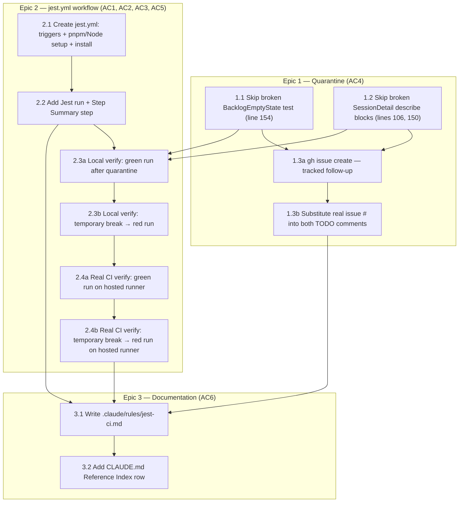

# Implementation Plan: Wire Jest (web-app) into CI

Source: `project_plans/jest-ci/requirements.md`, `research/stack.md`,
`research/pitfalls.md`, `research/build-vs-buy.md`.

**System type**: CI/CD pipeline configuration (a new GitHub Actions workflow file +
two test-file edits + one documentation file). Not an application subsystem — no
runtime code path, no user-facing surface, no persisted state. Complexity 1 per
requirements.md.

**Migration Plan**: N/A — no schema changes. Omitted per template instruction.

**Observability Plan**: N/A beyond the feature itself — the new `jest.yml` CI check
*is* the observability mechanism (AC1/AC2/AC5 together make test regressions visible
as a red check + a Step Summary block, where today there is none).

---

## Domain Glossary

Kept short — this is CI YAML plus two test-file edits, not a new subsystem.

| Term | Meaning |
|---|---|
| Jest **project** | One entry in `web-app/jest.config.js`'s `projects: [...]` array. Four exist (`web-app`, `eslint-plugin-analytics`, `dev-stack`, `e2e-dev-mode`); this task wires up only `web-app` (259 test files) via `--selectProjects web-app`. |
| **Quarantine** | Intentionally disabling a currently-broken test (`it.skip`/`describe.skip`) with a `// TODO(#N)` comment pointing at a tracked GitHub issue, so the test is still visible (counted as "skipped") rather than silently absent. |
| `$GITHUB_STEP_SUMMARY` | A GitHub Actions-provided env var pointing at a per-step Markdown file; anything appended to it renders in the run's "Summary" tab. Precedent in this repo: `.github/workflows/benchmark.yml:100-101`. |
| Path filter | The `on.push.paths` / `on.pull_request.paths` YAML block that determines whether a workflow run is triggered at all for a given diff. |

---

## Pattern Decisions

This task barely touches application-level design (it's ops/CI) — most of the
GoF/PoEAA lens is N/A. Two real build-vs-alternative decisions apply:

| Decision | Chosen | Alternative Rejected | Reason |
|---|---|---|---|
| AC5 — Actions Summary tab content | Bespoke: capture Jest's own stdout+stderr summary block, strip ANSI, append to `$GITHUB_STEP_SUMMARY` in a fenced code block (same step that runs Jest, using `PIPESTATUS`/`tee` to preserve the real exit code) | `dorny/test-reporter`, `mikepenz/action-junit-report`, `ctrf-io/github-test-reporter` (all require a new `jest-junit`/CTRF-JSON devDependency **and** a new marketplace Action) | Jest already prints exactly the `Test Suites/Tests/Time` block AC5 asks for; adding a reporter dependency + third-party Action is new supply-chain surface for a requirement met by "put text Jest already produces into the Summary tab." The `$GITHUB_STEP_SUMMARY`-append mechanic reuses `benchmark.yml:100-101`'s existing precedent; the exit-code-preserving `tee`/`PIPESTATUS` pipe pattern is new to this workflow, since `benchmark.yml`'s step discards its command's exit code (`... || true`) and never needed to preserve it (build-vs-buy.md §4: "build, don't buy"). |
| AC4 — quarantine mechanism | In-file `it.skip(...)` / `describe.skip(...)` + a `// TODO(#N)` comment directly above each | CI-level `--testPathIgnorePatterns` CLI flag (stack.md's original recommendation) | Coordinator verified the two files' exact contents directly (see below) and overrode stack.md's flag-based recommendation: `testPathIgnorePatterns` would hide the quarantined suites from Jest's collection entirely (they vanish from "N total" rather than showing as skipped), which pitfalls.md itself flags as *less* consistent with AC5's intent ("a quarantined suite that still shows up as '1 skipped' is more honest than one that vanishes from the count entirely") and is a stronger form of the exact AC2 zero-suites risk this task is guarding against, since a regex flag can over-match. Zero diff to test files was stack.md's argument for the flag; that's outweighed here because only 1 of `BacklogEmptyState.test.tsx`'s 12 tests is broken — excluding the whole *file* via a path-pattern flag would also silently stop running the other 11 healthy tests in CI, which no `testPathIgnorePatterns` variant can express at sub-file granularity. In-file skip is the only mechanism precise enough to keep those 11 tests running while disabling exactly the one broken test. |

**Other decisions carried from research (sanity-checked, not re-litigated):**

- **Separate `jest.yml`, not extending `lint.yml`** (pitfalls.md §2). Rejected
  alternative: add a Jest step inside `lint.yml`'s single `golangci` job. Reason:
  broadening `lint.yml`'s `paths:` filter to catch `package.json`/lockfile changes
  would also re-trigger the unrelated Go toolchain on web-app-dependency-only PRs
  (shared blast radius), and GitHub's path-filtered-required-check gap
  ([community#26857](https://github.com/orgs/community/discussions/26857)) is safer
  to avoid by keeping Jest's own trigger surface isolated. `ux-analysis.yml` is the
  existing precedent for a frontend-only, independently-triggered workflow.
- **Scope to `--selectProjects web-app` only**, not all 4 Jest projects. Rejected
  alternative: run all 4 (pitfalls.md's own suggestion, to avoid a "silent
  regression" if the other 3 stop being exercised). Reason: requirements.md's
  non-goals explicitly leave `dev-stack`/`e2e-dev-mode` inclusion as an open
  decision "unless they're already green and cheap to include" — this plan defers
  that expansion rather than deciding it implicitly inside a Complexity-1 task; the
  `.claude/rules/jest-ci.md` doc (AC6) makes the exclusion and its rationale
  explicit and revisitable, which directly closes the "silent" part of pitfalls.md's
  concern.
- **`--maxWorkers=2` pinned explicitly** in the CI invocation (pitfalls.md §4),
  rather than relying on the runner's auto-detected core count, so CI's worker
  topology is deterministic and matches what a contributor can reproduce locally
  with the same flag if the quarantine is ever revisited. `2` is a deliberately
  conservative fixed value, not derived from this repo's actual `ubuntu-latest`
  vCPU count (not queried at planning time) — accepted as a reasonable starting
  point for a Complexity-1 task; if CI timing/flakiness data later suggests it's
  too conservative or not conservative enough, retune the flag then rather than
  building a dynamic vCPU-detection mechanism now.

---

## Risk Control

- **Not gated.** This is a new, independently-triggered workflow (`jest.yml`), not
  a change to an existing required check. The rollback mechanism if it misbehaves
  (false red, flaky, wrong path filter) is to revert the workflow file — no feature
  flag or staged rollout applies to a CI config file.
- **Quarantine permanence risk** (pitfalls.md §3): a skip with no forcing function
  tends to become permanent, and `SessionDetail.embedded.test.tsx` is quarantining
  a *real* accessibility regression (missing `tablist`/`tabpanel` roles). Mitigation:
  every skip carries a `// TODO(#N)` referencing a tracked GitHub issue (Story 1.3),
  and `.claude/rules/jest-ci.md` (Story 3.1) names both quarantined suites and the
  issue explicitly so they're not just buried in test-file comments.
- **CI-vs-local worker divergence** (pitfalls.md §4): GitHub-hosted runners have
  fewer cores than a dev machine, which changes Jest's default `--maxWorkers` and
  could make a single worker crash take down the whole run in CI even where it
  didn't locally. Mitigated by pinning `--maxWorkers=2` explicitly (see Pattern
  Decisions) rather than relying on auto-detection — deterministic on both sides.
- **`gh issue create` (Story 1.3) is independent of the CI-facing work and degrades
  gracefully.** Nothing in `jest.yml` itself references the GitHub issue number, so
  a `gh` auth failure or other `gh issue create` failure in whatever environment
  runs Task 1.3.1 does not block or stall Epic 2 (`jest.yml`) or Epic 3 (docs) — see
  Dependency Visualization. On failure, Task 1.3.2 ships `TODO(#TBD)` in both test
  files instead of a real issue number (never the literal `<ISSUE_NUMBER>`
  placeholder), and the PR description / `.claude/rules/jest-ci.md` note that a
  human still needs to file the issue manually. Task 1.3.1 also checks for an
  existing matching issue before creating one, so a retried task doesn't create a
  duplicate (see Unresolved Questions).
- **`TODO(#TBD)` is a visible-in-review checkpoint, not an accepted terminal
  state** (pre-mortem.md P1 #1: a `gh`-auth failure with no forcing function could
  leave the quarantine's real accessibility regression permanently hidden behind a
  placeholder nobody revisits). Mitigation: before this work is handed to review
  (`request_review` / PR open), Task 1.3.1 output is checked one more time — if
  `TODO(#TBD)` is still present anywhere under `web-app/src` (`grep -rn 'TODO(#TBD)'
  web-app/src`), the PR description and review/verification notes MUST explicitly
  call out "quarantine follow-up issue not yet filed — needs manual `gh issue
  create` before or shortly after merge," so a human reviewer sees it as an open
  item rather than the quarantine silently reading as fully tracked. This does not
  block `jest.yml`/Epic 2/Epic 3 from shipping (Story 1.3 stays best-effort/
  non-blocking, per the resolved adversarial-review blocker), but it does block
  *silence* about the gap at review time.

---

## Unresolved Questions

1. **Is any `lint.yml` job currently a required branch-protection status check?**
   Neither this plan nor the research phase queried GitHub branch-protection
   settings directly (would require repo-admin API access). It doesn't block this
   plan (this task adds a *new*, non-required-by-default workflow), but whoever
   later decides to make `jest.yml`'s job a required check should re-check
   pitfalls.md §2's cited GitHub gap (community#26857) before doing so — a required
   check tied to a `paths:`-filtered workflow can leave path-filtered-out PRs stuck
   pending forever.
2. **`gh` auth availability at implementation time** — Story 1.3's `gh issue create`
   step assumes an authenticated `gh` CLI in the implementation environment. This is
   not a hard blocker: if unavailable, Task 1.3.1 fails gracefully (after checking
   for an already-existing matching issue, to stay idempotent across retries) and
   Task 1.3.2 ships `TODO(#TBD)` in place of a real issue number — never the literal
   `<ISSUE_NUMBER>` placeholder — and the PR description / `jest-ci.md` note that a
   human still needs to file the issue manually. Epic 2 (the CI-facing `jest.yml`
   work) and Epic 3 (docs) proceed regardless; only the real issue number is
   deferred.
3. **Exact post-quarantine green count** — **superseded by actual implementation
   results** (this question was written at planning time before Story 2.3's local
   run; see the Post-implementation Actuals note at the end of this item).
   Originally expected 259/259 passing Jest suites once 9 affected tests (1 in
   `BacklogEmptyState.test.tsx` + 8 across `SessionDetail.embedded.test.tsx`'s two
   `describe` blocks) were skipped. That estimate assumed only 1 test in
   `BacklogEmptyState.test.tsx` needed quarantining — Task 2.3.1's actual run
   revealed 6 more pre-existing failures in the same describe block once the
   crashing test was skipped, so the real quarantine scope is 9 tests in that file
   (the whole `describe.skip` block), not 1. See `.claude/rules/jest-ci.md` for the
   authoritative documented scope.

   **Reconciling against requirements.md's baseline** (flagged by the Phase 4
   cross-artifact consistency check, still correct as far as it goes): requirements.md's
   baseline says "3594/3601 tests pass" (7 failing) — that 3601 total was captured
   from the run where `BacklogEmptyState.test.tsx` crashed its whole worker process
   *before reporting any of its 12 tests*, so those 12 tests are entirely absent
   from the 3601 figure, not present-and-failing. Only `SessionDetail.embedded.test.tsx`'s
   7 failures are inside the 3601/3594 numbers.

   **Post-implementation actuals** (Task 2.3.1, run against the real quarantine):
   **3596 passing**, **0 failing**, **17 skipped** (9 in `BacklogEmptyState.test.tsx`'s
   "first-run state" block + 8 across `SessionDetail.embedded.test.tsx`'s two blocks),
   **3613 total**, **258/259 suites passing + 1 suite fully skipped**
   (`SessionDetail.embedded.test.tsx`, since every test in it is now skipped;
   `BacklogEmptyState.test.tsx` counts as "passed" because it still has 3 running,
   passing tests in its other two describe blocks). This supersedes both the
   original planning-time estimate above and the 9-skipped/3604-passing figure this
   section previously stated after the Phase 4 consistency-check reconciliation —
   that reconciliation was arithmetically correct for the *originally scoped*
   9-test quarantine, but the actually-shipped quarantine is 17 tests once the
   additional `BacklogEmptyState` failures were discovered.
4. **AC1 (path-filter triggering) and AC5 (Summary tab rendering) are not fully
   verifiable pre-merge.** Story 2.3's local verification runs bare `npx jest`
   directly in a shell — it can confirm Jest's own exit-code behavior (AC2) but
   cannot exercise GitHub's server-side `paths:` trigger evaluation (AC1) or the
   real Actions "Summary" tab UI rendering `$GITHUB_STEP_SUMMARY` (AC5), since
   neither exists outside a real GitHub Actions run. This plan treats that gap as an
   accepted limitation of a Complexity-1 task rather than adding a throwaway-PR
   verification task: AC1/AC5 get their first real exercise on the actual PR this
   plan ships, and the existing rollback story (revert the workflow file) covers the
   case where either turns out wrong.

---

## Dependency Visualization



Epic 2's workflow-file creation (T2_1/T2_2) has no dependency on Epic 1 at all —
nothing in `jest.yml` itself references the GitHub issue number, so `.github/
workflows/jest.yml` can be created in parallel with, or entirely independent of,
Story 1.3. Only Story 2.3's *local verification* (T2_3a) needs a clean baseline,
which is why it depends directly on T1_1/T1_2 (the `.skip()` edits) rather than on
the whole of Epic 1. T1_3a/T1_3b (`gh issue create` + placeholder substitution) are
a side chain that can complete in parallel with, before, or after Epic 2 — see Risk
Control and Unresolved Questions §2 for what happens if `gh issue create` fails:
Task 1.3.2 ships a `TODO(#TBD)` placeholder rather than stalling anything
downstream. Epic 3 documents the final state of both and references whichever issue
number exists at doc-writing time (real number if 1.3.1 succeeded, `TBD` if not), so
it comes last.

---

## Acceptance Criteria → Given-When-Then

**AC1 — workflow triggers on push/PR with broadened path filter**
> Given a PR that only modifies `web-app/package.json` (no `.ts`/`.tsx`/`.css` files),
> When the PR is opened,
> Then `.github/workflows/jest.yml` triggers (its `paths:` includes `web-app/**` and
> `.github/workflows/jest.yml` itself), even though `lint.yml`'s narrower
> extension-only filter would not have caught this diff.

**AC2 — fails on real test failure or zero suites collected**
> Given the Jest step runs `npx jest --selectProjects web-app --maxWorkers=2 --ci`
> with no `--passWithNoTests` flag anywhere in the invocation or `jest.config.js`,
> When either a test assertion fails or the test-path selection matches zero suites
> (e.g. all test files under `web-app/src` were deleted),
> Then the step's captured exit code is non-zero and `exit "$JEST_EXIT"` at the end
> of the step propagates that non-zero code, so the job — and the check — is red.

**AC3 — runs against a clean install**
> Given the `jest.yml` job starts on a fresh `ubuntu-latest` runner,
> When the "Install web-app dependencies" step runs `pnpm install --frozen-lockfile`
> in `working-directory: web-app` (matching `lint.yml:62-64`),
> Then the Jest run that follows uses only dependencies resolved from
> `web-app/pnpm-lock.yaml` — never a stale locally-cached `node_modules` — and the
> install step itself fails loudly if the lockfile doesn't satisfy `package.json`.

**AC4 — the 2 known-broken suites are quarantined with a tracked follow-up**
> Given `BacklogEmptyState.test.tsx:154`'s `it("component stays rendered when
> onCreateItem rejects", ...)` crashes the Jest worker via an unhandled rejection,
> and `SessionDetail.embedded.test.tsx`'s two `describe` blocks (lines 106, 150)
> fail on a real accessibility regression,
> When Story 1.1/1.2 change these to `it.skip(...)` / `describe.skip(...)` with a
> `// TODO(#<issue-number>): ...` comment each, and Story 1.3 best-effort creates
> and links a real tracked GitHub issue (or, if `gh` is unavailable, ships
> `TODO(#TBD)` and defers the real issue to a manually-filed follow-up — see
> Unresolved Questions §2),
> Then `npx jest --selectProjects web-app --maxWorkers=2` reports these tests as
> **skipped** (not failed, not silently absent), the other 3 tests in
> `BacklogEmptyState.test.tsx` (12 total; 9 quarantined, not 1 — see the
> **Post-implementation update** below) keep running and passing, and the
> workflow no longer goes red because of these two pre-existing, out-of-scope
> bugs.
>
> **Post-implementation update** (this section originally assumed only the 1
> crashing test needed quarantining): local verification (Task 2.3.1) revealed
> 6 more pre-existing failures in `BacklogEmptyState.test.tsx`'s "first-run
> state" describe block once the crashing test was skipped and the rest of the
> file could finally run — the component has no inline-create-form UX at all,
> but 6 of that block's other tests expect one. The entire 9-test
> `describe.skip("BacklogEmptyState — first-run state", ...)` block is
> quarantined, not just the 1 originally-scoped test, tracked in the same
> issue ([#311](https://github.com/tstapler/stapler-squad/issues/311)). See
> `.claude/rules/jest-ci.md` for the authoritative documented outcome.

**AC5 — Step Summary shows Test Suites/Tests/Time on both pass and fail**
> Given the "Run Jest (web-app project)" step captures `npx jest ... 2>&1` via
> `tee jest-output.log`, records `${PIPESTATUS[0]}` as `JEST_EXIT`, and appends an
> ANSI-stripped tail of that log to `$GITHUB_STEP_SUMMARY` inside a fenced code
> block *before* calling `exit "$JEST_EXIT"`,
> When a PR run has all tests passing OR when a PR run has a real Jest failure,
> Then in both cases the Actions "Summary" tab (not just the raw log) shows the
> `Test Suites: X passed, Y total` / `Tests: ...` / `Time: ...` block, and the job's
> pass/fail status still correctly reflects Jest's real exit code (not `tee`'s).

**AC6 — documentation of which projects run in CI and why**
> Given `.claude/rules/jest-ci.md` (Story 3.1) documents: (a) only the `web-app`
> Jest project runs in CI, with `eslint-plugin-analytics`/`dev-stack`/
> `e2e-dev-mode` named and reasoned as excluded per this plan's Pattern Decisions,
> (b) the two quarantined suites, their line numbers, and the tracked issue number
> (or a note that it's still `TBD` and needs manual filing, if Task 1.3.1 couldn't
> create it), and (c) the `$GITHUB_STEP_SUMMARY` capture approach,
> When a future contributor wants to know why `dev-stack`'s tests don't run in CI
> or why `SessionDetail.embedded.test.tsx` has skipped tests,
> Then they find the answer in `.claude/rules/jest-ci.md`, discoverable from
> `CLAUDE.md`'s Reference Documents Index (Story 3.2 adds the row), without having
> to archaeology the git history of the workflow file.

---

## Phase → Epic → Story → Task Breakdown

### Phase 1: Wire Jest into CI (single phase — Complexity 1)

#### Epic 1 — Quarantine the 2 known-broken suites (AC4)

**Story 1.1 — Skip the crashing `BacklogEmptyState` test**

- **Task 1.1.1** (2 min, 1 file: `web-app/src/components/backlog/BacklogEmptyState.test.tsx`):
  At line 154, change `it("component stays rendered when onCreateItem rejects", async () => {`
  to `it.skip("component stays rendered when onCreateItem rejects", async () => {`,
  and add immediately above it:
  ```ts
  // TODO(#<ISSUE_NUMBER>): unhandled-rejection crash in Jest's worker process
  // (jestjs/jest#15887) — this test's .mockRejectedValue() is never caught,
  // which is fatal under Node's default unhandled-rejection behavior and takes
  // down the whole Jest worker rather than just failing this test. Quarantined
  // while wiring Jest into CI; fix tracked in the linked issue.
  ```
  Leave all other 11 tests (12 total in the file) untouched.

  **Actual implementation note**: this task's original scope (skip just this 1
  test) proved insufficient. Task 2.3.1's local run, performed right after this
  edit, revealed 6 more pre-existing failures in the same
  `describe("BacklogEmptyState — first-run state", ...)` block — the component
  has no inline-create-form UX the other tests expect. The whole 9-test block
  was quarantined via `describe.skip(...)` instead (superseding the single
  `it.skip` above), tracked in the same issue (#311). Only the file's other two
  describe blocks (`FilterZeroState`, `FooterNudge`, 3 tests) were left
  untouched, not "11 tests" as originally planned. See `.claude/rules/jest-ci.md`
  and Unresolved Questions §3's Post-implementation Actuals for the true scope.

**Story 1.2 — Skip the two broken `SessionDetail` describe blocks**

- **Task 1.2.1** (3 min, 1 file: `web-app/src/components/sessions/__tests__/SessionDetail.embedded.test.tsx`):
  At line 106, change `describe("SessionDetail — embedded mode (Bug 4)", () => {` to
  `describe.skip("SessionDetail — embedded mode (Bug 4)", () => {`, with:
  ```ts
  // TODO(#<ISSUE_NUMBER>): real a11y regression — missing tablist/tabpanel ARIA
  // roles and aria-hidden wiring on [aria-labelledby="tab-terminal"]. Quarantined
  // while wiring Jest into CI; fix tracked in the linked issue, not fixed here.
  ```
  At line 150, change `describe("SessionDetail — initialTab sync (Bug 3)", () => {`
  to `describe.skip("SessionDetail — initialTab sync (Bug 3)", () => {`, with the
  same TODO comment style (same issue number, reworded for Bug 3's symptom —
  `initialTab` prop changes not re-syncing displayed tab content).

**Story 1.3 — Track the quarantine with a real GitHub issue (best-effort, non-blocking)**

This story is a side chain, not a prerequisite for Epic 2 — nothing in `jest.yml`
itself references the issue number (see Dependency Visualization, Risk Control).
Task 1.3.1's job is to *try* to get a real issue number; if it can't, Task 1.3.2
ships a `TODO(#TBD)` placeholder instead and the gap is called out in the PR
description / `jest-ci.md`, rather than stalling any CI-facing work.

- **Task 1.3.1** (3 min, 0 repo files — external side effect, best-effort): First
  check for an already-created matching issue (e.g. `gh issue list --search
  "in:title Fix 2 Jest suites quarantined"`) so a retried task doesn't create a
  duplicate — this step is not safely re-runnable otherwise. If none exists, run
  `gh issue create --title "Fix 2 Jest suites quarantined when wiring Jest into CI: SessionDetail a11y regression + BacklogEmptyState unhandled rejection" --body "..."`
  (body should link both files/line numbers and both root causes from
  requirements.md's Non-goals section). Capture the returned issue number. If `gh`
  is not authenticated, or `gh issue create` otherwise fails, do **not** stop or
  block downstream work — proceed to Task 1.3.2, which ships the `TODO(#TBD)`
  placeholder, and note in the PR description / `jest-ci.md` (Story 3.1) that the
  follow-up issue still needs to be filed manually (see Unresolved Questions §2).
- **Task 1.3.2** (2 min, 2 files: the same two test files from 1.1.1/1.2.1): If Task
  1.3.1 got a real issue number, replace every `<ISSUE_NUMBER>` placeholder with it
  (3 occurrences total: 1 in `BacklogEmptyState.test.tsx`, 2 in
  `SessionDetail.embedded.test.tsx`). If Task 1.3.1 failed, replace every
  `<ISSUE_NUMBER>` placeholder with the literal `TBD` instead (i.e. `// TODO(#TBD):
  ...`) so no shipped comment retains the bare `<ISSUE_NUMBER>` marker. Verify
  before considering this task done: `grep -rn '<ISSUE_NUMBER>' web-app/src` must
  return zero matches — the only acceptable remaining marker is a literal
  `TODO(#TBD)`.

#### Epic 2 — Create `jest.yml` (AC1, AC2, AC3, AC5)

**Story 2.1 — Workflow skeleton: triggers + environment setup**

- **Task 2.1.1** (4 min, 1 new file: `.github/workflows/jest.yml`): Create the file
  with:
  ```yaml
  name: Jest (web-app)

  on:
    push:
      branches: [ main ]
      paths:
        - 'web-app/**'
        - '.github/workflows/jest.yml'
    pull_request:
      branches: [ main ]
      paths:
        - 'web-app/**'
        - '.github/workflows/jest.yml'

  jobs:
    jest:
      name: jest
      runs-on: ubuntu-latest
      steps:
        - uses: actions/checkout@v4

        - name: Set up pnpm
          uses: pnpm/action-setup@f40ffcd9367d9f12939873eb1018b921a783ffaa # v4
          with:
            version: 10.27.0

        - name: Set up Node.js
          uses: actions/setup-node@v4
          with:
            node-version: '22'
            cache: 'pnpm'
            cache-dependency-path: web-app/pnpm-lock.yaml

        - name: Install web-app dependencies
          working-directory: web-app
          run: pnpm install --frozen-lockfile
  ```
  This block is copied verbatim from `lint.yml:37,45-64` per stack.md §5 — same
  action pins, same order (`pnpm/action-setup` before `actions/setup-node`, per
  pitfalls.md §5's documented ordering gotcha).

**Story 2.2 — Jest run + Step Summary step**

- **Task 2.2.1** (5 min, 1 file: `.github/workflows/jest.yml`, appended step): Add:
  ```yaml
        - name: Run Jest (web-app project)
          working-directory: web-app
          shell: bash
          run: |
            set +e
            set -o pipefail
            npx jest --selectProjects web-app --maxWorkers=2 --ci 2>&1 | tee jest-output.log
            JEST_EXIT=${PIPESTATUS[0]}

            {
              echo "## Jest (web-app project)"
              echo '```text'
              tail -n 40 jest-output.log | sed -E 's/\x1b\[[0-9;?]*[a-zA-Z]//g'
              echo '```'
            } >> "$GITHUB_STEP_SUMMARY"

            exit "$JEST_EXIT"
  ```
  Single step, not split into a separate `if: always()` step — per requirements
  key-decision #7, this avoids a second Jest invocation (which could reintroduce a
  different flaky result) and keeps the step's own exit code tied to Jest's real
  result via the explicit `exit "$JEST_EXIT"` at the end. `set +e` / `set -o
  pipefail` bracket the piped command so the script doesn't abort before
  `JEST_EXIT` is captured (GitHub's default `bash --noprofile --norc -eo pipefail`
  would otherwise abort the whole step on Jest's non-zero exit before `JEST_EXIT`
  is even assigned). `set -e` is deliberately **never** re-enabled for the rest of
  the step: the summary-writing block (`echo`/`tail`/`sed` appended to
  `$GITHUB_STEP_SUMMARY`) stays under `set +e` too, so an unrelated failure there
  (e.g. a transient runner issue writing the summary file, or `sed`/`tail` erroring
  on an unexpected `jest-output.log` state) can't abort the script before `exit
  "$JEST_EXIT"` runs and silently mask Jest's real result — the only thing that
  determines the step's final exit code is the captured `JEST_EXIT` value. The ANSI
  strip uses `sed -E 's/\x1b\[[0-9;?]*[a-zA-Z]//g'` — all CSI escape sequences, not
  just the SGR/color codes ending in `m` — so cursor-visibility (`\x1b[?25l`) and
  erase-line (`\x1b[2K`) escapes some terminal-aware tooling still emits under
  `--ci` don't leak into the Step Summary's fenced code block as raw escape bytes.

**Story 2.3 — Confirm green/red behavior locally before shipping**

Tasks 2.3.1/2.3.2 run bare `npx jest ...` directly, not the full Task 2.2.1 script
(`set +e`/`tee`/`PIPESTATUS`/`$GITHUB_STEP_SUMMARY` append). This is an accepted,
acknowledged gap for a Complexity-1 task, not a new task to add: the real script
gets its first genuine exercise on the first real CI run either way, and
hand-simulating `$GITHUB_STEP_SUMMARY` locally for marginal additional confidence
isn't worth a new task here.

- **Task 2.3.1** (4 min, 0 files — verification only): Run, in `web-app/`:
  ```
  pnpm install --frozen-lockfile
  npx jest --selectProjects web-app --maxWorkers=2 --ci
  ```
  with Epic 1's quarantine already applied. Confirm actual exit code 0 and record
  the real `Test Suites:` / `Tests:` counts — see Unresolved Questions §3's
  Post-implementation Actuals for what this task actually found (**258/259 suites
  passing + 1 fully-skipped suite**, **3596 passing / 0 failing / 17 skipped /
  3613 total**), which superseded the pre-implementation estimate originally
  written here once the real quarantine scope (17 tests, not 9) was known.
- **Task 2.3.2** (3 min, 1 file temporarily): Temporarily break one currently-passing
  test (e.g. flip an `expect(...).toBe(true)` to `false` in any healthy, non-quarantined
  test file), rerun the same command, confirm a non-zero exit code and a `Test
  Suites: 1 failed, ...` line in the output — sanity-checks AC2's "fails on real
  failure" behavior end-to-end before the workflow ever runs in CI. Revert the
  temporary breakage immediately after confirming (this task must never be
  committed).
- **Task 2.3.3** (2 min, 0 files — verification only): Confirm AC2's *other* red-state
  trigger — zero suites collected, the anti-silent-test-deletion guardrail that is
  arguably this feature's core reliability property (a regression test file getting
  silently deleted during a future merge is the exact scenario requirements.md's
  Context section cites as the motivating incident). Run, in `web-app/`:
  ```
  npx jest --selectProjects web-app --testPathPatterns='zzz-nonexistent-pattern-zzz' --ci
  ```
  Confirm this exits non-zero (not 0) and prints `No tests found` / a zero-suites
  message — this proves `--passWithNoTests` really is absent everywhere in the
  invocation and `jest.config.js` (per AC2's Given-When-Then), not just assumed.
  This closes the gap the Phase 4 triad engineering review flagged: unlike AC1/AC5
  (explicitly documented as accepted GHA-only gaps), AC2's zero-suites branch had
  no verification task at all before this addition.

  **Note on coverage scope**: Story 2.3's local verification is necessarily a proxy
  for AC2 only. AC1 (does the `paths:` filter actually trigger on e.g. a
  `package.json`-only diff) and AC5 (does `$GITHUB_STEP_SUMMARY` actually render in
  the real Actions "Summary" tab) cannot be exercised locally — both are GitHub
  Actions server-side behaviors with no local equivalent. This is an accepted,
  documented gap (see Unresolved Questions §4), not an implied "end-to-end" claim
  for those two ACs; they get their first real exercise on the actual PR this plan
  ships.

**Story 2.4 — Confirm the real Task 2.2.1 script on an actual GitHub-hosted runner
before shipping (addresses pre-mortem.md P1 #2)**

Story 2.3 only ever runs bare `npx jest`, never the actual multi-line Task 2.2.1
script (`set +e`/`pipefail`/`tee`/`PIPESTATUS`/ANSI-strip/`$GITHUB_STEP_SUMMARY`
append). That script has only been sanity-checked in this planning/architecture-
review sandbox, never on a real `ubuntu-latest` GitHub Actions runner (different
bash/coreutils/`sed` build) — pre-mortem.md flags this as the plan's biggest
untested assumption. This is not solvable locally; it requires the PR this plan
ships to actually run in GitHub Actions.

- **Task 2.4.1** (~5-15 min, CI-round-trip-bound rather than the ~2-5 min
  editing-task norm elsewhere in this plan — wall-clock is however long the
  `jest` job takes to run on GitHub's runner, not local edit time; 0 new files,
  CI observation, part of shipping this work, not local dev): After the PR
  containing `jest.yml` and the Epic 1 quarantine edits is opened, treat the
  workflow's real first run as required evidence, not optional follow-up: confirm
  via `gh pr checks` (or the Actions UI) that the `jest` job goes green, and open
  its Summary tab to confirm the `Test Suites:`/`Tests:`/`Time:` block actually
  renders as designed (closes the AC5 gap noted in Unresolved Questions §4). Also
  record the runner's actual vCPU count (e.g. from a `nproc` line if the workflow
  prints one, or GitHub's published `ubuntu-latest` spec) next to the pinned
  `--maxWorkers=2` value in `.claude/rules/jest-ci.md` (Story 3.1) — closes the
  triad engineering review's gap that `2` was never checked against the real
  runner's core count; retune the flag if the real vCPU count makes `2` clearly
  wrong (e.g. a 4-vCPU runner sitting mostly idle, or a 2-vCPU runner still
  oversubscribed), otherwise leave it as the deliberately conservative default.
- **Task 2.4.2** (~5-15 min, same CI-round-trip caveat as 2.4.1; 1 file, temporary,
  on the PR branch): Push one throwaway commit to the PR branch that breaks a
  single healthy, non-quarantined test (mirroring Task 2.3.2, but exercised for
  real on the hosted runner this time), confirm the `jest` check goes red and the
  Summary tab still renders Jest's Tests/Time block on the failing run (closes the
  AC1/AC2/AC5 real-runner gap), then revert the commit. This is the first genuine
  test of whether `PIPESTATUS`/`set +e` actually preserves Jest's real exit code
  on GitHub's actual bash build, not just this sandbox's.
- Do not consider this work ready to ship (`request_review` / PR marked ready)
  until both 2.4.1 and 2.4.2 have been observed to behave as designed. If either
  surfaces a real discrepancy (e.g. the runner's `sed` doesn't support `-E`, or
  `PIPESTATUS` behaves differently under GitHub's exact shell invocation), fix
  `jest.yml` and repeat 2.4.1/2.4.2 before shipping — do not ship on faith that the
  local sandbox's bash behavior generalizes.

#### Epic 3 — Documentation (AC6)

**Story 3.1 — Write the CI Jest rules doc**

- **Task 3.1.1** (5 min, 1 new file: `.claude/rules/jest-ci.md`): Write following
  the format/tone of `.claude/rules/e2e-test-conventions.md` and
  `.claude/rules/feature-registry.md`. Required content:
  - Which of the 4 `web-app/jest.config.js` projects run in CI (`web-app` only) and
    why the other 3 (`eslint-plugin-analytics`, `dev-stack`, `e2e-dev-mode`) don't
    — link back to requirements.md's non-goals and this plan's Pattern Decisions.
  - The quarantine mechanism (in-file `.skip()` + `// TODO(#N)`, not a CI-level
    flag) and the 2 quarantined suites with file:line and the issue number from
    Task 1.3.1 — the real number if it succeeded, or an explicit note that it's
    still `TBD` and needs manual filing if it didn't (see Unresolved Questions §2).
  - The `$GITHUB_STEP_SUMMARY` approach: same-step `tee` + `PIPESTATUS` capture +
    ANSI-stripped append. The append mechanic reuses `benchmark.yml:100-101`'s
    existing precedent; the exit-code-preserving `tee`/`PIPESTATUS` pattern is new
    to this workflow (see Pattern Decisions).
  - The `--maxWorkers=2` pinning rationale (pitfalls.md §4 — CI core count
    divergence from local).

**Story 3.2 — Wire the doc into `CLAUDE.md`'s Reference Documents Index**

- **Task 3.2.1** (2 min, 1 file: root `CLAUDE.md`): Add one row to the table at
  `CLAUDE.md:231-254`, following the exact existing format, e.g.:
  ```
  | Jest CI wiring (scope, quarantine, Step Summary) | `.claude/rules/jest-ci.md` |
  ```
  Placed adjacent to the other `.claude/rules/*.md` rows (after
  `e2e-test-conventions.md`'s row, before `sdd-planning-artifacts-commit.md`'s row,
  or any position consistent with the table's existing loose grouping).

---

## ADR

None warranted. A new single-concern CI workflow file plus two test-file
quarantines and a rules doc does not rise to an architecturally significant,
hard-to-reverse decision — the workflow file itself is the record, and it's
revertible in one commit (see Risk Control).

---

## Task Count Summary

- **Epics**: 3
- **Stories**: 9 (1.1, 1.2, 1.3, 2.1, 2.2, 2.3, 2.4, 3.1, 3.2)
- **Tasks**: 13 (1.1.1, 1.2.1, 1.3.1, 1.3.2, 2.1.1, 2.2.1, 2.3.1, 2.3.2, 2.3.3, 2.4.1, 2.4.2, 3.1.1, 3.2.1)

Story 2.4 (Tasks 2.4.1/2.4.2) was added during the Phase 4 validation gate to
address pre-mortem.md P1 #2 — see Story 2.4's own section for why it can't be
folded into Story 2.3. Task 2.3.3 was added during the Phase 4 triad engineering
review to close a gap where AC2's "zero suites collected" red-state trigger had
no verification step (unlike its "real test failure" sibling, Task 2.3.2).
