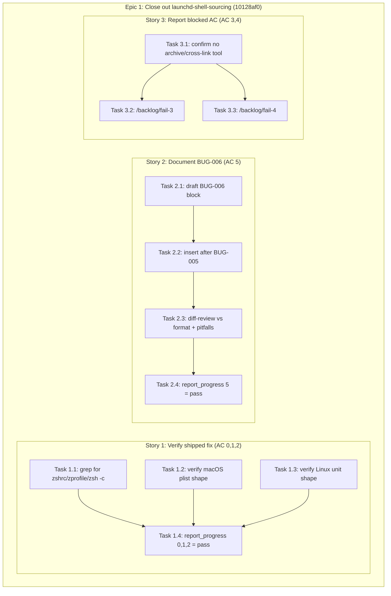

# Implementation Plan: launchd-shell-sourcing

**Backlog item:** `10128af0-e1eb-47bc-9016-3af8fde83b4d` (duplicate of canonical
`1dc7ff10-326c-4276-a70f-eb8869713593`)
**Complexity:** 1 (quick task)
**Plan status:** ready to execute

## Framing

The code fix this backlog item was opened to track already shipped on `main`
in commit `baca1c7c` ("fix: address Copilot review feedback") and this
worktree's branch (`4eca0ed34`) sits at the same commit — confirmed by direct
inspection of `scripts/install-service.sh` during planning (see Verification
Evidence below). There is no new design surface, no library/stack decision,
and no user-facing surface. Six acceptance criteria exist; three are
already-satisfied verification checks, one is a genuine (small) documentation
task, and two are administratively blocked by a missing MCP tool capability.
The plan below is sized to that reality: one epic, three stories, eleven
2-3-minute tasks, no ADR.

### Verification evidence (gathered during planning, re-verified per-task below)

```
$ grep -n "zshrc\|zprofile\|/bin/zsh -c" scripts/install-service.sh
(no output — exit code 1)

$ grep -n "ExecStart\|Environment=\|ProgramArguments\|EnvironmentVariables" scripts/install-service.sh
102:ExecStart=$bin_path --remote-access$extra_flags
109:Environment=HOME=$HOME
110:Environment=PATH=$PATH
179:    <key>ProgramArguments</key>
197:    <key>EnvironmentVariables</key>

$ git log --oneline -1 baca1c7c
baca1c7c2 fix: address Copilot review feedback
```

`install_linux()` (`scripts/install-service.sh:100-114`) invokes
`ExecStart=$bin_path --remote-access$extra_flags` directly with
`Environment=PATH=$PATH`. `install_macos()` (`scripts/install-service.sh:176-203`)
sets `<key>ProgramArguments</key>` to an array whose first element is
`$bin_path` (no `/bin/sh -c` / `/bin/zsh -c` wrapper), with PATH supplied via
the `<key>EnvironmentVariables</key>` dict. Neither function references
`.zshrc`, `.zprofile`, or `/bin/zsh -c`.

## Domain Glossary

N/A for new types/code — this is a documentation-only change plus backlog
administration. Two terms worth pinning for the task breakdown below:

| Term | Meaning |
|---|---|
| `BUG-NNN` entry | The existing convention in `docs/tasks/completed/system-service-autostart.md`'s "Known Issues" section: `### BUG-NNN: <Title> [SEVERITY: <level>]` followed by `**Description:**`, `**Mitigation:**`, `**Files Affected:**`, `**Prevention:**`, separated by `---`. BUG-001 through BUG-005 already exist (lines 568-648). |
| `fail-N` reporting | The `/backlog/fail-N` skill convention for this pipeline: reports a specific acceptance-criteria index as blocked/not-implemented with reasoning, as opposed to `/backlog/done-N` for a passed criterion. |

## Pattern Decisions

One decision, not a new pattern: **reuse the existing BUG-NNN format
verbatim, with one deliberate deviation.** BUG-001..005 all use
`**Mitigation:**` to describe work that is already built (the file lives
under `docs/tasks/completed/`). BUG-006 has no shipped fix, so reusing
`**Mitigation:**` unmodified would misrepresent it as resolved — directly
contradicting acceptance criterion 5's requirement that the gap be
"explicitly documented ... as deferred-pending-maintainer-decision, not
silently declared resolved." The deviation:

- Insert **`**Status:** Deferred — not implemented this session`** immediately
  under `**Description:**`.
- Relabel the bullet list **`**Possible Future Mitigations (not
  implemented):**`** instead of `**Mitigation:**`.

Everything else (heading shape, `**Files Affected:**`, `**Prevention:**`,
trailing `---`) matches BUG-001..005 exactly. No other pattern decision is in
scope — no new Go types, no new React components, no new RPC, no new CSS.

## Migration Plan

N/A — no schema, data, or API migration. Single Markdown-file addition; no
runtime behavior changes.

## Observability Plan

N/A in the runtime-telemetry sense (no code path changes, nothing to
instrument, log, or alert on). The observability for this task *is* the
audit trail it produces:

- The `BUG-006` entry itself is the durable, git-tracked record of the
  env-inheritance gap (supersedes the ephemeral, untracked
  `.backlog-context.md` scratch note that previously only lived in the
  pipeline's working file — see `research/stack.md` §3).
- `report_progress` calls for criteria 0, 1, 2, 5 and `/backlog/fail-3`,
  `/backlog/fail-4` calls for criteria 3, 4 are themselves the completion
  record for this backlog item, queryable later via
  `mcp__stapler-squad__get_backlog_item`.

## Risk Control

| Risk | Mitigation |
|---|---|
| `BUG-006` entry gets misread as "already fixed" (same failure mode BUG-001..005's `**Mitigation:**` heading would invite) | Explicit `**Status:** Deferred — not implemented this session` line + relabeled `**Possible Future Mitigations (not implemented):**` heading (Pattern Decisions, above). Reviewed against `research/pitfalls.md` §5 wording-pitfall checklist before insertion (Task 2.3). |
| Doc entry overstates severity/blast radius (e.g. "the service can't reach these secrets at all") | Draft explicitly states the conditional impact established in `research/pitfalls.md` §2: `GITHUB_TOKEN` has a non-shell-rc fallback (`github/http_client.go:31-58`, `gh auth token`) so it's mostly de-risked; `ANTHROPIC_API_KEY` is genuinely gapped only for the subset of users on raw-API-key auth (not `claude login` OAuth users). |
| Doc entry accidentally recommends re-adding shell-rc sourcing as "the fix" — the exact anti-pattern `baca1c7c` removed | Draft restricted to `EnvironmentFile=` (systemd, no shell semantics) and install-time plist inlining / minimal `. env-file` wrapper under `/bin/sh` (macOS) as the only future directions, per `research/pitfalls.md` §3 and `research/stack.md` §2. No `zsh -c`, `bash -lc`, or `. ~/.profile` suggested. |
| `Edit` on `docs/tasks/completed/system-service-autostart.md` fails or lands in the wrong place because the file was re-read stale | Task 2.2 reads the file's current BUG-005/`---` region immediately before editing (Edit tool requires a prior Read in this session regardless). |
| Criteria 3/4 silently skipped instead of explicitly reported as blocked | Story 3 makes the `/backlog/fail-3` / `/backlog/fail-4` calls themselves the deliverable, each carrying the "no ArchiveBacklogItem-equivalent RPC in this session's MCP toolset" reasoning, so the backlog item's history shows an explicit block, not an omission. |

## Unresolved Questions

- **For a future maintainer, not this session:** should `ArchiveBacklogItem`
  / cross-link-notes tool capability be added to the MCP toolset so criteria
  3 and 4 can eventually be satisfied without human intervention? Out of
  scope to decide or build here (requirements.md explicitly scopes this as a
  tooling gap, not a code task) — flagged for whoever owns the backlog
  pipeline's MCP tool surface.
- **For a future maintainer, not this session:** if/when the `ANTHROPIC_API_KEY`
  gap documented in BUG-006 is actually fixed, which of the two credible
  directions (`EnvironmentFile=`/install-time inlining vs. a 1Password `op`
  integration) is preferred is explicitly left open — `research/build-vs-buy.md`
  recommends the former as lower-risk but defers the actual choice to a
  maintainer decision, per requirements.md's non-goals.

## Dependency Visualization



Story 1, Story 2, and Story 3 have no dependencies on each other and can run
in any order or in parallel; only intra-story task ordering matters (shown
above).

---

## Phase 1 / Epic 1: Close out backlog item 10128af0

### Story 1: Verify the already-shipped shell-sourcing fix (acceptance criteria 0, 1, 2)

No code changes in this story — verification only, re-confirming what
planning already established, so the record is fresh at implementation time
too (in case of intervening changes).

#### Task 1.1 — Confirm no zsh/rc references remain (~2 min)

Run `grep -n "zshrc\|zprofile\|/bin/zsh -c" scripts/install-service.sh` and
confirm no output (exit code 1) across the whole file, and specifically
within `install_macos()`/`install_linux()`.

**Given** `scripts/install-service.sh` as it exists on this branch
**When** grepping the file for `.zshrc`, `.zprofile`, and `/bin/zsh -c`
**Then** no matches are found in `install_macos()` or `install_linux()`
(verified: `grep` exit code 1, no output) — acceptance criterion 0 passes.

#### Task 1.2 — Confirm macOS plist invokes the binary directly (~2 min)

Read `scripts/install-service.sh:167-215` (the `install_macos()` heredoc).
Confirm `<key>ProgramArguments</key>` is an array whose first `<string>` is
`$bin_path` (not a shell interpreter), and `<key>EnvironmentVariables</key>`
is a `<dict>` containing a `PATH` key.

**Given** the generated `com.stapler-squad.plist` heredoc in `install_macos()`
**When** inspecting the `ProgramArguments` and `EnvironmentVariables` keys
**Then** `ProgramArguments` invokes `$bin_path` directly with no
`/bin/sh -c`/`/bin/zsh -c` wrapper, and `PATH` is supplied via the
`EnvironmentVariables` dict (verified: lines 179-183, 197-203) — acceptance
criterion 1 passes.

#### Task 1.3 — Confirm Linux systemd unit invokes the binary directly (~2 min)

Read `scripts/install-service.sh:94-114` (the `install_linux()` heredoc).
Confirm `ExecStart=$bin_path ...` with no shell wrapper, and
`Environment=PATH=$PATH` is present, and no `.zshrc`/`.profile` is sourced
anywhere in the unit body.

**Given** the generated `stapler-squad.service` heredoc in `install_linux()`
**When** inspecting `ExecStart` and `Environment=` lines
**Then** `ExecStart` invokes `$bin_path` directly, `Environment=PATH=$PATH`
is set, and no shell rc file is sourced (verified: lines 102, 109-110) —
acceptance criterion 2 passes.

#### Task 1.4 — Report criteria 0, 1, 2 as passed (~2 min)

Call `report_progress` (via the `backlog:done-0`, `backlog:done-1`,
`backlog:done-2` skills) with `item_id=10128af0-e1eb-47bc-9016-3af8fde83b4d`,
`criteria_index` 0, 1, and 2 respectively, `status=pass`, citing the grep/read
evidence from Tasks 1.1-1.3 and commit `baca1c7c` as the landing commit.

**Given** Tasks 1.1-1.3 have verified all three criteria hold on this branch
**When** `report_progress` is called for `criteria_index` 0, 1, 2
**Then** the backlog item's progress record shows all three criteria as
passed with verification notes and the `baca1c7c` commit reference.

---

### Story 2: Document the deferred `ANTHROPIC_API_KEY`/`GITHUB_TOKEN` env-inheritance gap (acceptance criterion 5)

The only task in this backlog item with actual content to write. Single file,
single section, format-matched to five existing neighbors.

#### Task 2.1 — Draft the BUG-006 entry text (~5 min)

Compose the Markdown block per the Pattern Decisions section above and the
content requirements from `research/stack.md` and `research/pitfalls.md`:

- Title: something that reads as an ongoing gap, not past-tense-fixed —
  e.g. "Service Process No Longer Inherits Shell-RC-Exported Secrets
  (ANTHROPIC_API_KEY, GITHUB_TOKEN)".
- `[SEVERITY: Medium]` (conditional risk, not universal breakage — contrast
  with BUG-001's High).
- `**Description:**` — states plainly that this is a side effect of
  `baca1c7c` removing `.zshrc` sourcing (which was incidentally the only path
  through which shell-rc-exported secrets reached the service process), names
  the mechanism (spawned `claude`/`aider` processes inside the service's tmux
  panes inherit only the minimal `HOME`/`PATH` env baked into the
  plist/unit), and states the conditional impact: `GITHUB_TOKEN` is mostly
  de-risked via `getGHToken`'s `gh auth token` fallback
  (`github/http_client.go:31-58`), `ANTHROPIC_API_KEY` has no equivalent
  fallback for spawned sessions and only affects users authenticating via a
  raw API key exported in shell rc (not `claude login` OAuth users).
- `**Status:** Deferred — not implemented this session`.
- `**Possible Future Mitigations (not implemented):**` bullets —
  `EnvironmentFile=` (systemd, no shell execution) and install-time plist
  inlining into `EnvironmentVariables` (macOS, the same generation-time
  pattern already used for `PATH`/`HOME`), reading from a
  `~/.stapler-squad/env`-style file; note 0600 permissions as a prerequisite
  if secrets are ever baked into a generated unit/plist, and the staleness
  (BUG-002-style) and at-rest-exposure risk of doing so directly. Do not list
  a `/bin/sh` env-file wrapper as an alternative — per
  `research/build-vs-buy.md` §4, a wrapper invoked by `ProgramArguments`/
  `ExecStart` at service-start reintroduces a shell process in the same
  category acceptance criterion 1 was written to rule out, even though POSIX
  `.` of a flat file has none of `.zshrc`'s interactive hazards. Explicitly
  do not suggest re-adding shell-rc sourcing either.
- `**Files Affected:**` — `scripts/install-service.sh`,
  `config/config.go`, `server/services/session_service.go` (as the
  currently-affected read sites), noting no fix is implemented here.
- `**Prevention:**` — one sentence naming a plausible future regression test
  (e.g. verifying a service-spawned session's env matches an
  `~/.stapler-squad/env` file once one exists) without over-committing to an
  untaken design.

**Given** `research/stack.md` and `research/pitfalls.md`'s conclusions for
the writer
**When** the BUG-006 block is drafted
**Then** it matches the BUG-001..005 structural format with the two
deliberate deviations (`**Status:**` line, relabeled mitigations heading)
and contains no anti-pattern (shell-rc-sourcing) suggestion.

#### Task 2.2 — Insert BUG-006 after BUG-005 (~2 min)

Read `docs/tasks/completed/system-service-autostart.md` around lines 634-649
(BUG-005 through its closing `---`) immediately before editing. Use `Edit` to
insert the Task 2.1 block immediately after BUG-005's closing `---` (line
648), before whatever follows.

**Given** the current `docs/tasks/completed/system-service-autostart.md`
content (BUG-005 ends at line 648 with a `---` separator)
**When** the BUG-006 block from Task 2.1 is inserted immediately after that
separator
**Then** the file contains six `BUG-NNN` entries in ascending order, each
still separated by `---`, with no other content altered.

#### Task 2.3 — Review the inserted entry against format and wording pitfalls (~3 min)

Re-read the edited section. Confirm: heading level and bold-label structure
match BUG-001..005 exactly; the `**Status:** Deferred` line and relabeled
`**Possible Future Mitigations (not implemented):**` heading are present and
correctly placed; no shell-rc-sourcing is suggested as a fix; severity is
`Medium`; the entry names `baca1c7c` as the causal commit; wording reflects
conditional (not blanket) impact per `research/pitfalls.md` §2 and §5.

**Given** the inserted BUG-006 block (Task 2.2)
**When** re-read against the `research/pitfalls.md` §5 wording-pitfall
checklist and the BUG-001..005 structural format
**Then** no pitfall is present — the entry cannot be misread as already
resolved, does not overstate blanket breakage, does not recommend
re-adding shell-rc sourcing, and matches its five neighbors' format.

#### Task 2.4 — Report criterion 5 as passed (~2 min)

Call `report_progress` (via the `backlog:done-5` skill) with
`item_id=10128af0-e1eb-47bc-9016-3af8fde83b4d`, `criteria_index=5`,
`status=pass`, citing the file path and line range of the new BUG-006 entry.

**Given** Tasks 2.1-2.3 have produced and reviewed a durable, correctly
deferred-framed BUG-006 doc entry
**When** `report_progress` is called for `criteria_index=5`
**Then** the backlog item's progress record shows criterion 5 passed,
referencing `docs/tasks/completed/system-service-autostart.md` and the new
entry's location.

---

### Story 3: Report the two backlog-administration criteria as blocked (acceptance criteria 3, 4)

No implementation work — requirements.md is explicit that criteria 3 and 4
are blocked by a missing MCP tool capability (`ArchiveBacklogItem` or
equivalent) and that only the `/backlog/fail-N` reporting step should be
planned, not a workaround implementation.

#### Task 3.1 — Confirm no archive/cross-link tool exists in this session's toolset (~2 min)

Check the MCP tool list available in this session (`mcp__stapler-squad__*`
tools: `create_session`, `get_backlog_item`, `report_progress`,
`update_session_task`, `submit_triage_result`, `submit_review_verdict`,
`stop_session`, etc.) for anything that archives a backlog item or appends
cross-link notes to another item. Confirm none exists.

**Given** the full list of `mcp__stapler-squad__*` tools available this
session
**When** searching for an `ArchiveBacklogItem`-equivalent RPC or a
notes-append-to-another-item RPC
**Then** no such tool is found — criteria 3 and 4 cannot be implemented in
this session.

#### Task 3.2 — Report criterion 3 as blocked (~2 min)

Invoke `/backlog/fail-3` (per the `backlog:fail-3` skill) for
`item_id=10128af0-e1eb-47bc-9016-3af8fde83b4d`, with reasoning: no
`ArchiveBacklogItem` RPC/tool exists in this session's MCP toolset to archive
this item with notes recording it as a duplicate of `1dc7ff10`, pointing to
landing commit `baca1c7c` and today's verification date.

**Given** Task 3.1 confirmed no archival tool exists
**When** `/backlog/fail-3` is invoked for `criteria_index=3`
**Then** the backlog item's progress record shows criterion 3 explicitly
blocked (not silently skipped), with the missing-tool reasoning attached.

#### Task 3.3 — Report criterion 4 as blocked (~2 min)

Invoke `/backlog/fail-4` (per the `backlog:fail-4` skill) for
`item_id=10128af0-e1eb-47bc-9016-3af8fde83b4d`, with reasoning: cross-linking
canonical item `1dc7ff10`'s notes to reference this duplicate's archival
requires the same missing tool capability as criterion 3 (and additionally
requires the criterion-3 archival to exist first, which itself is blocked).

**Given** Task 3.1 confirmed no cross-link tool exists (and criterion 3 is
itself blocked, per Task 3.2)
**When** `/backlog/fail-4` is invoked for `criteria_index=4`
**Then** the backlog item's progress record shows criterion 4 explicitly
blocked, with reasoning that names both the missing tool and its dependency
on the also-blocked criterion 3.

---

## Summary

- **Epics:** 1
- **Stories:** 3
- **Tasks:** 11 (4 + 4 + 3), each sized 2-5 minutes
- **Code changes:** 0
- **Documentation changes:** 1 (new `BUG-006` entry in
  `docs/tasks/completed/system-service-autostart.md`)
- **ADR:** none created — no architecture/library/stack decision exists in
  this item's scope (pure format-matched doc edit + backlog reporting); the
  `decisions/` directory was intentionally left empty.
- **Flagged choices:** the BUG-006 "Status: Deferred" / "Possible Future
  Mitigations (not implemented)" heading deviation from the BUG-001..005
  `**Mitigation:**` convention (see Pattern Decisions) — a deliberate,
  requirements-mandated departure, not an oversight.
- **Domain Glossary terms:** 2 (`BUG-NNN` entry, `fail-N` reporting)
