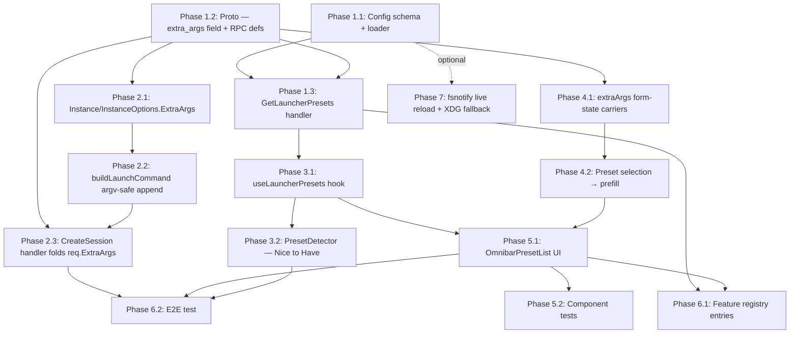

# Implementation Plan: Launcher Presets

**Feature**: Named, hand-edited `argv`-based launch shortcuts (`~/.stapler-squad/launcher-presets.json`), surfaced as a one-click, form-prefilling "Presets" section in the Omnibar creation panel.
**Date**: 2026-08-06
**Status**: Ready for implementation
**ADRs**: [ADR-001: Launcher Presets as a Separate Hand-Edited File, With a Shared `extra_args` Argv Carrier on `CreateSessionRequest`](../decisions/ADR-001-separate-preset-file-shared-argv-carrier.md)

---

## Step 0.5 — Creative Pass (recorded here per SDD process; full reasoning in ADR-001)

Three approaches were evaluated for reconciling this feature with the pre-existing
`AliasConfig` (`config/types.go:234`, doc comment: "a named session preset invoked via
`@name` in the omnibar") and `ProfileDefaults` (`config/types.go:177`) mechanisms:

1. **Extend `AliasConfig` with `Argv []string`.** Reuses `config.json` storage,
   `UpsertAlias`/`DeleteAlias` RPCs, and the `@name` detector. Rejected: requirements.md
   explicitly scopes presets as hand-edited-file-only, no UI editing — extending Aliases
   would force presets through the alias RPC/storage identity, directly contradicting that
   scope and the "shareable dotfiles artifact" social job (`research/ux.md` §5).
2. **Wholly separate system, separate everything (storage, RPC, UI, *and* launch pipeline).**
   Rejected in its "separate launch pipeline" half only: reusing `cli_flags`
   (string + naive `strings.Fields` split) would reintroduce the exact quoting-corruption bug
   this feature exists to fix; building a second, preset-specific shell-quoting routine would
   duplicate `shellQuote` for no benefit.
3. **Separate storage/RPC/UI, but a shared `extra_args []string` argv carrier on
   `CreateSessionRequest`/`Instance`, reusing the existing `shellQuote` primitive at the one
   unavoidable tmux shell-string boundary.** **Chosen.** Gets presets' required
   hand-edited-file/no-UI-editing shape right while fixing the argv-safety gap exactly once,
   generically, in a way any future caller (including a hypothetical later `AliasConfig.Argv`)
   can reuse without a second implementation.

Full rationale and rejected-alternative detail: ADR-001.

---

## Domain Glossary

| Term | Definition | Notes |
|------|-----------|-------|
| `LauncherPreset` | Go struct (new, `config/launcher_presets.go`) representing one entry in the presets file: `ID`, `Label`, `Argv []string`, `Program` (optional, display-only), `DefaultPath` (optional). | Analogous in spirit to `AliasConfig` but intentionally a separate type — see ADR-001. |
| `LauncherPresetsFile` | Go struct representing the whole JSON document: `Version int`, `Presets []LauncherPreset`. | Top-level unmarshal target for `~/.stapler-squad/launcher-presets.json`. |
| `LoadLauncherPresets` | New loader function (`config/launcher_presets.go`): reads the file, unmarshals into `LauncherPresetsFile`, validates, returns `(*LauncherPresetsFile, error)` with whole-file-reject semantics. | Modeled on `LoadConfigFromPath` (`config/config.go:847`) but does **not** copy its degrade-to-default fallback (SC4 requires loud failure). |
| `DefaultLauncherPresetsPath` | Helper resolving the primary file path via `config.GetConfigDir()` + `"launcher-presets.json"`. | Reuses the existing instance-isolation logic (`STAPLER_SQUAD_TEST_DIR`/`STAPLER_SQUAD_INSTANCE`) for free. |
| `argv` | The preset's full launch command as authored in JSON, e.g. `["ssh", "-t", "host", "cd ~/repo && exec claude"]`. `argv[0]` maps to `program`; `argv[1:]` maps to `extra_args`. Never shell-split. | Must be non-empty; validated at load time. |
| `default_path` | Optional preset field prefilling `OmnibarFormState.workingDir` (not the session's top-level `path`/repo root — requirements.md's own wording is "default *working directory*"). | See Pattern Decisions row 8 / Open Question 1 resolution. |
| `ExtraArgs` | New `[]string` field on `session.Instance` and `session.InstanceOptions` (`session/instance.go`), parallel to the existing `CLIFlags string` field. | Carries `argv[1:]` end-to-end without ever being whitespace-split. |
| `extra_args` | New `repeated string` field (28) on `CreateSessionRequest` (`proto/session/v1/session.proto`) — the wire form of `ExtraArgs`. | Purely additive; old clients omitting it get an empty repeated field (zero behavior change). |
| `LauncherPresetProto` | New protobuf message mirroring `LauncherPreset` for RPC transport. | Placed near `AliasProto` (`session.proto:1819`). |
| `GetLauncherPresets` | New read-only ConnectRPC method, alongside `GetSessionDefaults`/`ListAliases`. | Fresh-reads-and-validates the file on every call (no caching) — see Pattern Decisions row 7. |
| `load_error` | String field on `GetLauncherPresetsResponse`, populated (with `presets` left empty) when the file exists but fails validation. | Lets the frontend render a specific, diagnosable-from-the-UI error (ux.md requirement) instead of a generic RPC failure. |
| `shellQuote` | Existing helper (`session/instance_tmux.go:126`) that POSIX-single-quotes one token. Reused per-`ExtraArgs`-element — **not modified**. | The one unavoidable shell-string boundary (tmux `new-session` hands its command to `/bin/sh -c`); "argv-safe" here means "no ambiguity from naive splitting/re-parsing," not literal `exec()`. |
| `buildLaunchCommand` | Existing method (`session/instance_tmux.go:105`) assembling the tmux launch command string. Extended with one loop appending shell-quoted `ExtraArgs` elements after the existing `CLIFlags` loop. | |
| `useLauncherPresets` | New React hook (`web-app/src/lib/hooks/useLauncherPresets.ts`) fetching `GetLauncherPresets`; exposes `{ presets, loading, error, loadError, refetch }`. | Mirrors `useAliases.ts` shape, with the added `loadError` field for structured validation errors. |
| `OmnibarPresetList` | New presentational component (`web-app/src/components/sessions/OmnibarPresetList.tsx`) rendering the Presets section: `role="listbox"`/`role="option"` rows, `role="status"` empty state, `role="alert"` error state. | Structurally mirrors `AliasPalette.tsx`. |
| `PresetDetector` | Nice-to-Have `DetectorRegistry` entry (`web-app/src/lib/omnibar/detectors/PresetDetector.ts`, priority 37) matching typed `preset:<id>` shorthand. | Registered/unregistered dynamically in `OmnibarContext.tsx`, mirroring `AliasDetector`. |
| `preset-resolution-chip` | `data-testid` for the `role="status" aria-live="polite"` UI element confirming a preset's effect on the form after selection. | Mirrors `data-testid="alias-resolution-chip"`. |
| `OmnibarFormState.extraArgs` | New `string[]` field threading a selected preset's (or, in principle, any future caller's) extra argv elements to submission. | Parallel to the existing `program: string` field. |
| Fresh-per-call read | Architectural choice: `GetLauncherPresets` re-parses the file on every RPC call rather than caching it once at startup. | Chosen because it satisfies Success Criterion 1 ("without restarting... or after an explicit reload") for free — every Omnibar-open refetch *is* an explicit reload — making `fsnotify` hot-reload a pure optimization, not a correctness requirement (see Pattern Decisions row 7). |

---

## Pattern Decisions

| Component | Pattern Chosen | Source | Alternative Rejected | Reason |
|-----------|---------------|--------|---------------------|--------|
| Preset storage/lifecycle | Separate hand-edited file, read-only loader (not an ORM-style repository — a plain parse function, matching `LoadConfigFromPath`'s shape) | PoEAA Ch. 10 Data Source patterns, minimally adapted; this repo's own `config/config.go`/`config/state.go` idiom | Extend `AliasConfig` + `config.json` + `UpsertAlias`/`DeleteAlias` | Violates requirements.md's explicit "hand-edited only, no UI editing" scope (see ADR-001) |
| argv → launch decomposition | Value-object-style mechanical split: `argv[0]` → `program`, `argv[1:]` → `extra_args`, validated non-empty at load so `argv[0]` always exists | type-driven-design ("illegal states unrepresentable" — empty argv is rejected before it can reach the launch pipeline) | Reuse `cli_flags` (string + `strings.Fields`) | Reintroduces the exact naive-whitespace-split corruption this feature exists to eliminate (`research/pitfalls.md` §1) |
| `GetLauncherPresets` error surfacing | Structured `load_error` string field on a normal (200-equivalent) response | PoEAA Service Layer + explicit Result-type convention (distinguish transport failure from domain validation failure) | `connect.NewError(CodeInternal, ...)` on malformed file | ux.md requires the error be "diagnosable from the UI alone"; a transport error would surface generically via `useLauncherPresets`'s catch block the same way any network failure does, indistinguishable from "server unreachable" |
| Frontend list feature | Presentational component + dedicated hook (Humble Object split) | PoEAA Humble Object; this codebase's established `useAliases.ts` + `AliasPalette.tsx` / `useWorkflows` + palette pairing | Fold fetching directly into `OmnibarCreationPanel.tsx` | That file is already 800+ lines; every existing analogous feature (aliases, workflows) extracts hook+component pairs, keeping the panel a thin composition root |
| Preset selection semantics | Deliberate, unconditional overwrite of the fields a preset maps to (`program`, `extraArgs`, `workingDir`) | GoF Command (a discrete, idempotent action) | "Merge only empty fields," mirroring the continuous alias auto-fill guard (`Omnibar.tsx:514`) | `research/pitfalls.md` §4 explicitly recommends unconditional overwrite for a one-click, discrete list-click action — the guard exists in the alias code to prevent thrashing during continuous re-detection on every keystroke, a problem discrete clicks don't have |
| Config validation | Hand-written Go validation (`encoding/json` + explicit checks), no schema library | `research/build-vs-buy.md` verdict; matches `config/config.go`/`config/state.go` | `github.com/xeipuuv/gojsonschema` | 5-field flat schema; gojsonschema is reserved for `config/claude.go`'s large externally-defined-schema case |
| Live reload | Fresh-read-per-RPC-call (no in-memory cache); `fsnotify` watcher deferred to an optional Phase 7 | `research/architecture.md` §3 fresh-per-call vs. cache-once split | `fsnotify`-driven cache invalidation as the *primary* mechanism | SC1 is already satisfied by re-parsing on each Omnibar-open call; `fsnotify` would only additionally help an Omnibar tab left open across an edit, which requirements.md marks Nice to Have, not required |
| Session type / lifecycle | Prefill layer over the existing `directory`/`new_worktree` session types, no new enum value | `autonomous`/`profile` precedent (`.claude/rules/session-creation-registry.md`) | New `SESSION_TYPE_PRESET` enum value | Explicitly Out of Scope per requirements.md; a preset has no distinct session lifecycle |

---

## Resolution of requirements.md Open Questions

1. **Does `argv` replace `program`/args, or compose with `working_dir`/`branch`/`profile`?**
   Resolved: `argv` **fully replaces** `program` and any CLI-flags carrier (mechanical split:
   `argv[0]` → `program`, `argv[1:]` → `extra_args`; selecting a preset unconditionally
   overwrites these two fields — see Pattern Decisions). It **composes** with `working_dir`
   (via the optional `default_path`, also unconditionally overwritten when present) and
   **does not touch** `branch` or `profile` at all — those remain independently editable by
   the user, exactly as they are today for a manually-configured session.
2. **Remote-exec presets — local tmux pane running argv as-is, or a new session concept?**
   Confirmed: local tmux pane, no new `SessionType`. `argv` (via `program` + `extra_args`)
   reaches `buildLaunchCommand` exactly like any other session's launch command; the
   `ssh -t host '...'` case is handled entirely by `extra_args`' element-wise `shellQuote`ing
   (Phase 2).
3. **Live reload — Must Have or Nice to Have?** Confirmed Nice to Have, and further,
   deferred out of the v1 critical path (Phase 7, optional): the fresh-per-call RPC read
   already satisfies SC1's "without restarting the server" wording without needing
   `fsnotify` at all.

---

## Migration Plan

**No database migration** — this is a new, additive JSON config file
(`~/.stapler-squad/launcher-presets.json`), not a schema change to any existing store.

**Backward compatibility of existing config:**
- `config.json` (`AliasConfig`, `ProfileDefaults`, `DirectoryRule`, etc.) is **not modified**
  by this feature. Existing installs keep working with zero changes required to their
  `config.json`.
- The new `CreateSessionRequest.extra_args` proto field (28) is purely additive — existing
  clients (older frontend builds, any external API caller) that omit it get Go's zero value
  (`nil`/empty slice) server-side, which is a no-op in `buildLaunchCommand`'s new loop. No
  proto field renumbering or `reserved` markers are needed.
- If `~/.stapler-squad/launcher-presets.json` does not exist, `GetLauncherPresets` returns an
  empty `presets` list with no `load_error` (not a failure state) — this is the default state
  for every existing install and must be covered by a test (see Phase 1).

---

## Observability Plan

- **Backend**: `LoadLauncherPresets` failures (malformed JSON, duplicate `id`, empty `argv`,
  unsupported `version`) are logged via `log.Warn` in the `GetLauncherPresets` handler,
  including the file path and the specific validation error — mirroring the existing
  `log.Warn("fsnotify unavailable...")` structured-logging convention. Successful loads with
  `len(presets) > 0` are logged at `log.Debug` (not `Info`) to avoid log spam, since the RPC
  is called on every Omnibar open, not just at startup.
- **Frontend**: `useLauncherPresets` logs RPC transport failures via `console.error`
  (matching `useAliases.ts`'s existing pattern) and separately exposes `loadError` for
  domain-level (malformed-file) failures, which the UI renders inline rather than logging
  silently.
- **No new metrics/tracing infra** — this repo has no existing per-RPC metrics dashboard for
  comparable read-only config RPCs (`GetSessionDefaults`, `ListAliases`); adding one here
  would be disproportionate to the feature's scope.

---

## Risk Control

| Risk | Likelihood | Impact | Mitigation |
|---|---|---|---|
| A preset argv element containing shell metacharacters corrupts or escapes the launch command | Low (mitigated by design) | High | `extra_args` never passes through `strings.Fields`; each element is independently `shellQuote`'d before being joined into the tmux shell-command string (Phase 2). Covered by a dedicated unit test asserting the `ssh -t host '...'` case survives byte-for-byte as one token. |
| A preset argv is attacker- or otherwise untrusted-influenced (e.g. shared/synced dotfiles with a compromised collaborator) | Low, same trust model as today | High (arbitrary local command execution) | **Accepted risk**, explicitly documented: identical trust boundary to `AvailablePrograms`, `AliasConfig.Program`, and hand-typed `program` today — this feature does not expand what a local, trusted config file can already cause a session to run. No sandboxing is added or promised. |
| Config file edited mid-read produces a transient parse failure | Low | Low | Loud failure is the *safe* outcome here (SC4) — a mid-write read fails JSON parsing and surfaces via `load_error` rather than silently applying a half-written preset. Error copy should hint this may be a transient save-in-progress if/when Phase 7 (live reload) ships. |
| Frontend preset list goes stale after a file edit while the Omnibar is already open | Medium | Low | `useLauncherPresets` refetches on the Omnibar's `isOpen` transition to `true` (Phase 3), not just on first mount — cheapest fix identified in `research/pitfalls.md` §4, matches user expectation without needing `fsnotify`. |
| Three visually distinct "pick a saved shortcut" UI affordances (Profile dropdown, `@alias`, Presets list) confuse users | Medium | Low–Medium | **Accepted and documented**, not silently introduced — see ADR-001 Consequences. Presets' UI copy/empty-state text should describe it as "for hand-edited, shareable launch shortcuts" to differentiate from Aliases (UI-editable) without this plan needing to redesign either existing mechanism. |
| Scope creep into preset-argv validation against `AvailablePrograms` (hard rejection) | Low | Medium (would break legitimate presets referencing correctly-installed-but-undetected programs, e.g. `codex`) | Explicitly **not** implemented as a hard load-time rejection — `research/pitfalls.md` recommends, at most, a soft frontend warning (Phase 5, Story 5.1.2), never a backend validation failure. |

---

## Unresolved Questions

- **Exact empty-state / error-message copy** for `OmnibarPresetList` (e.g. "No presets yet.
  Add one in `~/.stapler-squad/launcher-presets.json`.") — left to the implementing engineer
  to word during Phase 5; non-blocking, easily adjusted post-merge.
- **Case sensitivity of preset `id`** — this plan treats `id` as case-sensitive both for
  load-time duplicate detection and for the Nice-to-Have `preset:<id>` detector lookup
  (unlike `FindAlias`'s case-insensitive `strings.EqualFold` match). Rationale: presets are
  authored once in a file the user controls, not typed conversationally as often as `@alias`
  names; case-sensitive matching is simpler and avoids a second lookup convention. Flagged
  here in case product feedback post-ship prefers case-insensitivity for `preset:<id>`
  specifically (a one-line change if so — `defaultsSvc`/`FindAlias`'s pattern is the template).
- **XDG fallback path** (`~/.config/stapler-squad/launcher-presets.json`) — scoped out of the
  Phase 1–6 critical path entirely (folded into optional Phase 7 alongside live reload) since
  requirements.md marks it Nice to Have and it has no interaction with the argv-safety work
  that is this feature's core risk.

---

## Dependency Visualization



---

## Phase 1: Backend — Config File + RPC Surface

### Epic 1.1: Preset config schema and loader

#### Story 1.1.1: Load and validate `launcher-presets.json`
**As a** user who hand-edits `~/.stapler-squad/launcher-presets.json`, **I want** the server
to reject the whole file loudly on any schema error, **so that** I never end up with a
silently incomplete or corrupted preset list.

**Acceptance Criteria**:
- A well-formed file with 2+ presets loads successfully.
  - *Given* a valid `launcher-presets.json` with `version: 1` and two presets with distinct
    `id`s and non-empty `argv`, *When* `LoadLauncherPresets` is called, *Then* it returns
    `(*LauncherPresetsFile, nil)` with both presets in file order.
- Malformed JSON is rejected as a whole, not partially applied.
  - *Given* a file with a trailing comma (invalid JSON), *When* `LoadLauncherPresets` is
    called, *Then* it returns `(nil, err)` with an error message identifying it as a JSON
    parse failure — not a partial preset list.
- Duplicate `id` is rejected with a diagnosable message.
  - *Given* two presets both with `id: "codex"`, *When* `LoadLauncherPresets` is called,
    *Then* it returns `(nil, err)` whose message names `"codex"` and both indices/positions.
- Empty `argv` is rejected.
  - *Given* a preset with `argv: []`, *When* `LoadLauncherPresets` is called, *Then* it
    returns `(nil, err)` whose message names the offending preset's `id`.
- Missing file is not an error (default empty state).
  - *Given* no file exists at the resolved path, *When* `LoadLauncherPresets` is called,
    *Then* it returns `(nil, os.ErrNotExist-wrapping-err)` distinguishable by the caller from
    a validation failure (caller treats "not exist" as "zero presets, no error to surface").

**Files**: `config/launcher_presets.go` (new), `config/launcher_presets_test.go` (new)

##### Task 1.1.1a: Define `LauncherPreset`/`LauncherPresetsFile` structs (~3 min)
- Create `config/launcher_presets.go`.
- Define `LauncherPreset{ID, Label string; Argv []string; Program, DefaultPath string}` with
  `json` tags matching requirements.md's schema (`id`, `label`, `argv`, `program,omitempty`,
  `default_path,omitempty`).
- Define `LauncherPresetsFile{Version int; Presets []LauncherPreset}` with `json:"version"`,
  `json:"presets"`.
- Files: `config/launcher_presets.go`

##### Task 1.1.1b: Implement `LoadLauncherPresets(path string) (*LauncherPresetsFile, error)` (~5 min)
- `os.ReadFile` → if `os.IsNotExist`, return `(nil, err)` unwrapped (caller checks
  `os.IsNotExist`) — do NOT default to an empty struct here (keep "not exist" vs.
  "malformed" distinguishable to the caller, per Story 1.1.1's last AC).
- `json.Unmarshal` into a local `LauncherPresetsFile` — return `(nil, fmt.Errorf("failed to
  parse launcher presets: %w", err))` on failure.
- Call a private `validateLauncherPresets(*LauncherPresetsFile) error` (next task); return its
  error wrapped if non-nil.
- On full success, return `(&cfg, nil)`.
- Files: `config/launcher_presets.go`

##### Task 1.1.1c: Implement `validateLauncherPresets` (~5 min)
- Check `Version == 1`; else `fmt.Errorf("unsupported launcher-presets version %d (expected 1)", v)`.
- Iterate `Presets`: track seen `id`s in a `map[string]int` (id → first index); on a repeat,
  error naming both indices and the `id`.
- Per preset: `ID == ""` → error naming the index; `len(Argv) == 0` → error naming the `id` (or
  index if `id` is also empty); `Label == ""` → error naming the `id` (label is required per
  the schema so the UI always has something to render).
- Files: `config/launcher_presets.go`

##### Task 1.1.1d: Implement `DefaultLauncherPresetsPath() (string, error)` (~2 min)
- `dir, err := GetConfigDir()`; return `filepath.Join(dir, "launcher-presets.json"), err`.
- Files: `config/launcher_presets.go`

##### Task 1.1.1e: Unit tests for the loader (~5 min)
- Table-driven test covering all five Story 1.1.1 ACs using `t.TempDir()` + hand-written JSON
  fixtures (no shared fixture files — inline strings per case, matching this package's
  existing test style).
- Files: `config/launcher_presets_test.go`

### Epic 1.2: Proto changes

#### Story 1.2.1: Add `extra_args` field and `GetLauncherPresets` RPC definitions
**As a** frontend developer, **I want** a typed, generated way to send preset-derived extra
argv elements and fetch the preset list, **so that** I don't hand-roll wire encoding.

**Acceptance Criteria**:
- `CreateSessionRequest` has a new `repeated string extra_args = 28`.
  - *Given* the regenerated TS bindings, *When* a frontend caller constructs a
    `CreateSessionRequest`, *Then* `extraArgs: string[]` is a valid, optional field.
- `GetLauncherPresets` RPC exists and is callable.
  - *Given* the regenerated Go/TS bindings, *When* a ConnectRPC client calls
    `getLauncherPresets({})`, *Then* it type-checks against a
    `GetLauncherPresetsResponse{ presets: LauncherPresetProto[]; loadError: string }`.

**Files**: `proto/session/v1/session.proto`

##### Task 1.2.1a: Add `extra_args` field to `CreateSessionRequest` (~2 min)
- Add, immediately after `alias_name = 27;` (session.proto:572):
  ```protobuf
  // extra_args are additional positional argv elements appended verbatim (each independently
  // shell-quoted, never whitespace-split) after any defaults-resolved cli_flags. Populated by
  // a selected launcher preset's argv[1:]; safe for elements containing spaces or shell
  // metacharacters (e.g. a remote-exec fragment like "cd ~/repo && exec claude").
  repeated string extra_args = 28;
  ```
- Files: `proto/session/v1/session.proto`

##### Task 1.2.1b: Add `LauncherPresetProto` message (~3 min)
- Add near `AliasProto` (session.proto:1819), after the alias-related message block:
  ```protobuf
  // LauncherPresetProto represents one hand-authored launcher preset loaded from
  // ~/.stapler-squad/launcher-presets.json.
  message LauncherPresetProto {
    string id = 1;
    string label = 2;
    repeated string argv = 3;
    // program is presentation-only (UI label/PATH-check hint); the backend never uses it —
    // the actual launched program is always argv[0].
    string program = 4;
    string default_path = 5;
  }
  ```
- Files: `proto/session/v1/session.proto`

##### Task 1.2.1c: Add `GetLauncherPresets` request/response messages + RPC (~3 min)
- Add messages near the `GetSessionDefaults`/`ListAliases` cluster:
  ```protobuf
  message GetLauncherPresetsRequest {}

  message GetLauncherPresetsResponse {
    repeated LauncherPresetProto presets = 1;
    // load_error is non-empty when the presets file exists but failed validation (malformed
    // JSON, duplicate id, empty argv, unsupported version). presets is empty in that case.
    // Empty load_error + empty presets means "no file / no presets configured", not an error.
    string load_error = 2;
  }
  ```
- Add `rpc GetLauncherPresets(GetLauncherPresetsRequest) returns (GetLauncherPresetsResponse) {}`
  to the service definition, next to `rpc GetSessionDefaults(...)` (session.proto:248).
- Files: `proto/session/v1/session.proto`

##### Task 1.2.1d: Regenerate and verify (~3 min)
- Run `make proto-gen`.
- `go build ./...` and confirm `web-app` TS bindings regenerate under
  `web-app/src/gen/session/v1/`.
- Files: `session/gen/session/v1/*.go` (generated), `web-app/src/gen/session/v1/*_pb.ts` (generated)

### Epic 1.3: `GetLauncherPresets` RPC handler

#### Story 1.3.1: Serve the preset list, fresh-per-call, with structured error surfacing
**As a** frontend, **I want** `GetLauncherPresets` to always return a usable response (never a
transport error for a malformed file), **so that** I can render a specific, diagnosable
message.

**Acceptance Criteria**:
- Valid file → full preset list, empty `load_error`.
  - *Given* a valid `launcher-presets.json` with one preset, *When* `GetLauncherPresets` is
    called, *Then* the response has one `LauncherPresetProto` and `load_error == ""`.
- Malformed file → empty list, populated `load_error`, no Connect error.
  - *Given* a `launcher-presets.json` with a duplicate `id`, *When* `GetLauncherPresets` is
    called, *Then* the RPC call itself succeeds (no thrown/returned `connect.Error`), the
    response has zero presets, and `load_error` contains the duplicate-id message.
- Missing file → empty list, empty `load_error`.
  - *Given* no file exists, *When* `GetLauncherPresets` is called, *Then* the response has
    zero presets and `load_error == ""`.
- Edits are visible without a restart.
  - *Given* a running server and a preset file that is edited between two calls, *When*
    `GetLauncherPresets` is called a second time, *Then* the response reflects the edited
    file's contents (fresh-per-call read, no cache).

**Files**: `server/services/launcher_presets_service.go` (new), `server/services/session_service.go`, `server/dependencies.go`

##### Task 1.3.1a: Create `LauncherPresetsService` (~5 min)
- New file `server/services/launcher_presets_service.go`.
- `type LauncherPresetsService struct{}`, `func NewLauncherPresetsService() *LauncherPresetsService { return &LauncherPresetsService{} }`.
- `func (s *LauncherPresetsService) GetLauncherPresets(ctx context.Context, req *connect.Request[sessionv1.GetLauncherPresetsRequest]) (*connect.Response[sessionv1.GetLauncherPresetsResponse], error)`:
  - Resolve path via `config.DefaultLauncherPresetsPath()`.
  - Call `config.LoadLauncherPresets(path)`.
  - On `os.IsNotExist(err)`: return an empty, error-free response.
  - On any other error: `log.Warn("failed to load launcher presets", "path", path, "err", err)`,
    return a response with empty `presets` and `LoadError: err.Error()`.
  - On success: map `[]config.LauncherPreset` → `[]*sessionv1.LauncherPresetProto`, return with
    `LoadError: ""`. Log `log.Debug("loaded launcher presets", "count", len(presets))`.
- Files: `server/services/launcher_presets_service.go`

##### Task 1.3.1b: Wire into `SessionService` and `dependencies.go` (~3 min)
- Add a `launcherPresetsSvc *LauncherPresetsService` field to `SessionService` (same shape as
  `defaultsSvc`), a delegate method `GetLauncherPresets` calling through to it, and construct
  it in `server/dependencies.go` alongside `NewDefaultsService()`.
- Files: `server/services/session_service.go`, `server/dependencies.go`

##### Task 1.3.1c: Unit tests (~5 min)
- Table-driven test using `t.Setenv("STAPLER_SQUAD_TEST_DIR", t.TempDir())` (this repo's
  existing config-isolation convention) covering all four Story 1.3.1 ACs.
- Files: `server/services/launcher_presets_service_test.go` (new)

---

## Phase 2: Backend — Argv-Safe Launch Pipeline

### Epic 2.1: Thread `ExtraArgs` through `Instance`

#### Story 2.1.1: `Instance`/`InstanceOptions` carry `ExtraArgs` end-to-end
**As a** backend maintainer, **I want** `ExtraArgs` to flow through the same construction path
as `CLIFlags`, **so that** it's available at launch time without a parallel code path.

**Acceptance Criteria**:
- `NewInstance` preserves `ExtraArgs`.
  - *Given* `InstanceOptions{ExtraArgs: []string{"-t", "host", "cd ~/repo && exec claude"}}`,
    *When* `NewInstance` is called, *Then* the returned `*Instance`'s `.ExtraArgs` equals the
    input slice exactly (order and contents preserved, no splitting/joining).

**Files**: `session/instance.go`

##### Task 2.1.1a: Add `ExtraArgs []string` to `Instance` struct (~2 min)
- Add immediately after the existing `CLIFlags string` field (session/instance.go:293):
  ```go
  // ExtraArgs are additional argv elements appended verbatim (never whitespace-split) after
  // CLIFlags at launch time. Populated by a selected launcher preset's argv[1:]; see
  // buildLaunchCommand in instance_tmux.go for the shell-quoting boundary.
  ExtraArgs []string `json:"extra_args,omitempty"`
  ```
- Files: `session/instance.go`

##### Task 2.1.1b: Add `ExtraArgs []string` to `InstanceOptions` and wire into `NewInstance` (~3 min)
- Add `ExtraArgs []string` to `InstanceOptions` immediately after its `CLIFlags string` field
  (session/instance.go:540).
- In `NewInstance`'s struct literal (session/instance.go:642, next to `CLIFlags: opts.CLIFlags`),
  add `ExtraArgs: opts.ExtraArgs,`.
- Files: `session/instance.go`

##### Task 2.1.1c: Unit test (~3 min)
- Extend the existing `NewInstance`-focused test file with a case asserting `ExtraArgs`
  round-trips unchanged.
- Files: `session/instance_test.go`

### Epic 2.2: `buildLaunchCommand` argv-safe append

#### Story 2.2.1: Extra argv elements — and the base program itself — are shell-quoted
individually, never split
**As a** user launching a remote-exec preset, **I want** `ssh -t host 'cd ~/repo && exec
claude'` to run exactly as authored, **so that** nested quoting never corrupts my command
(Success Criterion 3).

**PRE-MORTEM FIX (P1, see `implementation/pre-mortem.md` #1, verified against
`session/instance_tmux.go:105-119`):** `buildLaunchCommand`'s `plainProgram` case sets
`cmd = p.cmd` — i.e. `i.Program` verbatim — as the shell command's base token, with **no**
`shellQuote` call. Only the subsequent `CLIFlags`/`ExtraArgs` loops quote their elements. Every
preset always populates `Program` (`argv[0]`), and `Program` is now, for the first time,
attacker-shaped/hand-authored-shareable-dotfiles content rather than a value drawn only from
`AvailablePrograms`/`AliasConfig.Program`/a hardcoded default. A preset with
`argv: ["true; touch /tmp/pwned"]` would inject a second shell command. This story now also
covers `Program`, not just `ExtraArgs` — see the new first AC and Task 2.2.1a below.

**Acceptance Criteria**:
- The base program token is shell-quoted (NEW — pre-mortem P1 fix).
  - *Given* `i.Program == "true; touch /tmp/pwned"` (a `plainProgram`, e.g. from a
    maliciously- or carelessly-authored preset `argv[0]`), *When* `buildLaunchCommand` is
    called, *Then* the resulting command string's base token is the single shell-quoted unit
    `'true; touch /tmp/pwned'` — the `;` never terminates the command, and no second command
    executes.
  - *Given* `i.Program == "ssh"` (the common, metacharacter-free case), *When*
    `buildLaunchCommand` is called, *Then* the resulting command string starts with `'ssh'`
    (quoting a plain token is a no-op for shell execution — `'ssh'` and `ssh` behave
    identically as the first word of a shell command).
- A multi-word `ExtraArgs` element survives as one token.
  - *Given* `i.Program == "ssh"` and `i.ExtraArgs == []string{"-t", "host", "cd ~/repo &&
    exec claude"}`, *When* `buildLaunchCommand` is called, *Then* the resulting command string
    ends with `... 'ssh' '-t' 'host' 'cd ~/repo && exec claude'`-equivalent single-quoted
    tokens (the fourth element is one shell-quoted unit, not four).
- Empty `ExtraArgs` is a no-op for the appended-args portion (backward compatible).
  - *Given* `i.ExtraArgs == nil`, *When* `buildLaunchCommand` is called, *Then* the resulting
    command string has no trailing space or empty-quote artifact after the (now-quoted) base
    program token and any `CLIFlags`.
- `ExtraArgs` is appended after `CLIFlags`-derived flags.
  - *Given* both `i.CLIFlags == "--verbose"` and `i.ExtraArgs == []string{"--model", "gpt-5"}`,
    *When* `buildLaunchCommand` is called, *Then* the resulting order is
    `'<program>' --verbose --model gpt-5` (CLIFlags tokens first, ExtraArgs last).
- The `claudeProgram` path is unaffected.
  - *Given* `i.Program` classifies as `claudeProgram` (existing `classifyProgram` logic
    unchanged by this story), *When* `buildLaunchCommand` is called, *Then* `buildClaudeCommand`'s
    output is used as-is for `cmd`'s base — this fix only touches the `plainProgram` branch,
    since `claudeProgram`'s base is never raw preset-authored content.

**Files**: `session/instance_tmux.go`

##### Task 2.2.1a: Shell-quote the `plainProgram` base token, then extend `buildLaunchCommand` with an `ExtraArgs` loop (~4 min)
- In the `case plainProgram:` branch (instance_tmux.go:110-111), change
  `cmd = p.cmd` to `cmd = shellQuote(p.cmd)` — this is the pre-mortem P1 fix; do this *before*
  adding the `ExtraArgs` loop below so both changes land in the same reviewable diff.
- Immediately after the existing `for _, f := range strings.Fields(i.CLIFlags) { ... }` loop
  (instance_tmux.go:115-117), add:
  ```go
  for _, a := range i.ExtraArgs {
      cmd = cmd + " " + shellQuote(a)
  }
  ```
- Do not modify `shellQuote` itself — reuse as-is.
- Files: `session/instance_tmux.go`

##### Task 2.2.1b: Unit tests for all five Story 2.2.1 ACs (~6 min)
- Add cases to the existing `buildLaunchCommand`/`shellQuote` test file (locate via
  `grep -l buildLaunchCommand session/*_test.go`) covering: the metacharacter-bearing-`Program`
  injection case (pre-mortem P1 fix — assert no second command executes / the base token is
  one shell-quoted unit), the plain-`ssh`-Program no-op-quoting case, the remote-exec `ExtraArgs`
  case verbatim from requirements.md, the empty-`ExtraArgs` case, the ordering case, and a
  `claudeProgram`-path regression case.
- Files: `session/instance_tmux_test.go`

### Epic 2.3: `CreateSession` handler folds `extra_args`

#### Story 2.3.1: `req.Msg.ExtraArgs` reaches the spawned `Instance`
**As a** frontend that submitted a preset-prefilled form, **I want** the `extra_args` I sent
to actually reach the tmux launch command, **so that** the preset I picked is what runs.

**Acceptance Criteria**:
- `extra_args` on the request produces an `Instance` with matching `ExtraArgs`.
  - *Given* a `CreateSessionRequest{Program: "ssh", ExtraArgs: []string{"-t", "host", "true"}}`,
    *When* `CreateSession` is handled, *Then* the created `session.Instance.ExtraArgs` equals
    `["-t", "host", "true"]`.

**Files**: `server/services/session_service.go`

##### Task 2.3.1a: Add `ExtraArgs: req.Msg.ExtraArgs` to `instanceOpts` (~2 min)
- In the `instanceOpts := session.InstanceOptions{...}` literal (session_service.go:1483-1507,
  next to `CLIFlags: instanceCLIFlags`), add `ExtraArgs: req.Msg.ExtraArgs,`.
- No resolution-layer merging is needed — unlike `cli_flags` (which merges
  defaults-resolved + request-supplied), `extra_args` has no defaults-resolution concept; it
  is a direct passthrough, matching architecture.md's "additive, not a new branch" guidance.
- Files: `server/services/session_service.go`

##### Task 2.3.1b: Integration test (~4 min)
- Add a `CreateSession` handler test asserting the created instance's `ExtraArgs` matches the
  request's `ExtraArgs`, alongside the existing `cli_flags`-focused test in the same file (locate
  via `grep -n "CliFlags" server/services/session_service_test.go`).
- Files: `server/services/session_service_test.go`

---

## Phase 3: Frontend — Data Layer

### Epic 3.1: `useLauncherPresets` hook

#### Story 3.1.1: Fetch presets, expose structured load errors, refetch on Omnibar open
**As a** user, **I want** the Presets list to reflect my latest file edit as soon as I open the
Omnibar, **so that** I don't have to restart the app to see a new preset (Success Criterion 1).

**Acceptance Criteria**:
- Successful fetch populates `presets`.
  - *Given* a mocked `getLauncherPresets` response with two presets, *When*
    `useLauncherPresets()` resolves, *Then* `presets` has length 2 and `loading` is `false`.
- A `load_error` is exposed distinctly from a transport error.
  - *Given* a mocked response with `presets: []` and `loadError: "duplicate id \"x\""`, *When*
    `useLauncherPresets()` resolves, *Then* `loadError === "duplicate id \"x\""` and
    `error === null` (transport succeeded; only the domain-level error field is set).
  - *Given* the RPC call itself throws (network failure), *When* `useLauncherPresets()`
    settles, *Then* `error` is a non-null `Error` and `loadError === null`.
- Refetch fires when the Omnibar transitions from closed to open.
  - *Given* the Omnibar is closed then opened, *When* `OmnibarContext`'s `isOpen` becomes
    `true`, *Then* `useLauncherPresets`'s `refetch()` is invoked (verified via a spy on the
    hook's returned `refetch`, wired the same way `OmnibarContext.tsx` wires
    `aliasDetectorRef`'s effect).

**Files**: `web-app/src/lib/hooks/useLauncherPresets.ts` (new), `web-app/src/lib/contexts/OmnibarContext.tsx`

##### Task 3.1.1a: Create `useLauncherPresets.ts` (~5 min)
- Mirror `useAliases.ts`'s shape exactly (`fetchTick` + `useEffect` + `createClient` +
  `cancelled` guard), but:
  - Return type: `{ presets: LauncherPresetEntry[]; loading: boolean; error: Error | null;
    loadError: string | null; refetch: () => void }`.
  - Define `export interface LauncherPresetEntry { id: string; label: string; argv: string[];
    program: string; defaultPath: string }` mapped from `resp.presets`.
  - On success, also set `loadError` from `resp.loadError || null` (empty string → `null`).
  - On thrown error (transport failure), set `error` and leave `loadError` at its previous
    value (do not conflate the two failure kinds).
- Files: `web-app/src/lib/hooks/useLauncherPresets.ts`

##### Task 3.1.1b: Refetch on Omnibar open (~3 min)
- In `OmnibarContext.tsx`, call `useLauncherPresets()` at the provider level (alongside
  `useAliases()`), and add a `useEffect` keyed on `isOpen` that calls the hook's `refetch()`
  when `isOpen` transitions to `true` (mirror the existing `aliasDetectorRef`
  register/unregister effect's dependency-array style, but simpler — just `refetch()` on the
  `true` transition, not a register/unregister).
- Files: `web-app/src/lib/contexts/OmnibarContext.tsx`

##### Task 3.1.1c: Unit tests (~5 min)
- New test file mocking `createClient`/`getLauncherPresets` per the existing `useAliases.test.ts`
  pattern (locate via `find web-app/src/lib/hooks -iname "usealiases.test*"`), covering all
  three Story 3.1.1 ACs.
- Files: `web-app/src/lib/hooks/useLauncherPresets.test.ts` (new)

### Epic 3.2: `preset:<id>` detector (Nice to Have)

#### Story 3.2.1: Typed `preset:<id>` shorthand resolves directly to a preset
**As a** power user, **I want** to type `preset:codex` and have it resolve immediately,
**so that** I can skip opening the Presets list for shortcuts I use often.

**Acceptance Criteria**:
- Known id resolves.
  - *Given* input `"preset:codex"` and a preset with `id: "codex"` in the registered list,
    *When* `PresetDetector.detect` is called, *Then* it returns a result with
    `type: InputType.Preset` (new enum member) and `metadata.preset` set to that entry.
- Unknown id does not silently fall through to search.
  - *Given* input `"preset:doesnotexist"`, *When* `PresetDetector.detect` is called, *Then*
    it returns a distinct "not found" result (mirroring `AliasNotFound`) rather than `null`
    (so `SessionSearchDetector` never claims `preset:` input).
- Non-`preset:` input is ignored.
  - *Given* input `"hello world"`, *When* `PresetDetector.detect` is called, *Then* it returns
    `null`.

**Files**: `web-app/src/lib/omnibar/detectors/PresetDetector.ts` (new), `web-app/src/lib/omnibar/types.ts`, `web-app/src/lib/contexts/OmnibarContext.tsx`

##### Task 3.2.1a: Add `InputType.Preset` / `InputType.PresetNotFound` (~2 min)
- Add two new enum members to `web-app/src/lib/omnibar/types.ts`'s `InputType`, following the
  existing `Alias`/`AliasNotFound` pair's naming.
- Files: `web-app/src/lib/omnibar/types.ts`

##### Task 3.2.1b: Implement `PresetDetector` (~5 min)
- Priority `37` (after `AliasDetector`'s 36, before `GitHubShorthandDetector`'s 40).
- Grammar: `preset:<id>` only (no browse mode, no label/flags suffix — simpler than
  `AliasDetector` by design, per requirements.md's Nice-to-Have wording: "resolves directly to
  that preset's prefill, skipping manual selection").
- `detect(input)`: if not `input.startsWith("preset:")`, return `null`. Extract `id =
  input.slice(7).trim()`; if empty, return `null` (no browse mode for v1). Look up
  case-sensitively in the constructor-injected preset list; return `Preset` or
  `PresetNotFound` result accordingly.
- Files: `web-app/src/lib/omnibar/detectors/PresetDetector.ts`

##### Task 3.2.1c: Register/unregister dynamically in `OmnibarContext.tsx` (~3 min)
- Add a `presetDetectorRef` + `useEffect` keyed on the `presets` from `useLauncherPresets()`,
  exactly mirroring the `aliasDetectorRef` block (lines 96-109).
- Files: `web-app/src/lib/contexts/OmnibarContext.tsx`

##### Task 3.2.1d: Detector unit tests (~4 min)
- `PresetDetector_should_ResolveToPreset_When_KnownIdTyped`,
  `PresetDetector_should_ReturnNotFound_When_UnknownIdTyped`,
  `PresetDetector_should_ReturnNull_When_NoPresetPrefix`, with test IDs per
  `.claude/rules/feature-testing-registry.md`'s `T-UNIT-TS-NNN` convention.
- Files: `web-app/src/lib/omnibar/detector.test.ts` or a colocated
  `PresetDetector.test.ts` (match whichever convention `AliasDetector`'s own test file uses —
  verify via `find web-app/src/lib/omnibar -iname "*aliasdetector*test*"` before choosing)

---

## Phase 4: Frontend — Form State & Prefill

### Epic 4.1: `extraArgs` carrier fields

#### Story 4.1.1: `extraArgs` threads from form state to the RPC call body
**As a** developer, **I want** `extraArgs` to follow the exact same threading path as
`extraCliFlags`/`cliFlags` already does, **so that** the wiring is consistent and easy to
review.

**Acceptance Criteria**:
- Form state carries `extraArgs`.
  - *Given* `setFormField("extraArgs", ["--model", "gpt-5"])` is called, *When* the form is
    submitted, *Then* `OmnibarSessionData.extraArgs` equals `["--model", "gpt-5"]`.
- The RPC body includes `extraArgs`.
  - *Given* `OmnibarSessionData.extraArgs == ["--model", "gpt-5"]`, *When*
    `handleCreateSession` calls `createSession(...)`, *Then* the call is made with
    `extraArgs: ["--model", "gpt-5"]` in the request object.
- Omitted `extraArgs` defaults to an empty array end-to-end (backward compatible with every
  existing non-preset session-creation flow).
  - *Given* a session created via the normal (non-preset) flow with `extraArgs` never set,
    *When* `createSession` is called, *Then* `extraArgs: []` is sent (never `undefined`,
    matching the existing `cliFlags: request.cliFlags ?? ""` fallback idiom).

**Files**: `web-app/src/components/sessions/Omnibar.tsx`, `web-app/src/lib/contexts/OmnibarContext.tsx`, `web-app/src/lib/hooks/useSessionService.ts`

##### Task 4.1.1a: Add `extraArgs: string[]` to `OmnibarFormState` + `INITIAL_FORM_STATE` (~2 min)
- Add `extraArgs: string[];` to the `OmnibarFormState` interface (Omnibar.tsx:63-85) and
  `extraArgs: [],` to `INITIAL_FORM_STATE` (Omnibar.tsx:87-104).
- Files: `web-app/src/components/sessions/Omnibar.tsx`

##### Task 4.1.1b: Add `extraArgs?: string[]` to `OmnibarSessionData` (~2 min)
- Add next to the existing `extraCliFlags?: string;` field (Omnibar.tsx:141).
- Files: `web-app/src/components/sessions/Omnibar.tsx`

##### Task 4.1.1c: Thread `extraArgs` into the submit payload (~3 min)
- Find the `onCreateSession({ ... })` call site inside `Omnibar.tsx`'s submit handler (the
  function that builds `OmnibarSessionData` from `formState` — locate via
  `grep -n "extraCliFlags" web-app/src/components/sessions/Omnibar.tsx`) and add
  `extraArgs: formState.extraArgs,` alongside wherever `extraCliFlags` is assembled.
- Files: `web-app/src/components/sessions/Omnibar.tsx`

##### Task 4.1.1d: Thread `extraArgs` through `OmnibarContext.tsx` → `createSession` (~2 min)
- In `handleCreateSession` (OmnibarContext.tsx:199-240), add `extraArgs: data.extraArgs ??
  [],` alongside the existing `cliFlags: data.extraCliFlags ?? "",` (line 231).
- Files: `web-app/src/lib/contexts/OmnibarContext.tsx`

##### Task 4.1.1e: Thread `extraArgs` through `useSessionService.ts`'s RPC body (~2 min)
- In `createSession`'s call to `clientRef.current.createSession({...})`
  (useSessionService.ts:263-281), add `extraArgs: request.extraArgs ?? [],` alongside
  `cliFlags: request.cliFlags ?? "",` (line 280).
- Files: `web-app/src/lib/hooks/useSessionService.ts`

##### Task 4.1.1f: Unit/integration test for the full carrier path (~4 min)
- Extend or add a test asserting a form-state `extraArgs` value reaches the mocked
  `createSession` call with the exact same value, following whatever existing test already
  covers `extraCliFlags`'s equivalent path (locate via
  `grep -rl "extraCliFlags" web-app/src/**/*.test.tsx`).
- Files: matches the file found above, or a new `Omnibar.extraArgs.test.tsx` if none exists

### Epic 4.2: Preset selection → prefill

#### Story 4.2.1: Selecting a preset deliberately overwrites program/extraArgs/workingDir
**As a** user browsing the Presets list, **I want** clicking a preset to immediately show me
what it will launch, without launching it yet, **so that** I can review before committing
(Success Criterion 2).

**Acceptance Criteria**:
- Selecting a preset overwrites `program` and `extraArgs`.
  - *Given* a preset `{argv: ["codex", "--model", "gpt-5"]}` and a form where `program` was
    already `"claude"`, *When* the preset is selected, *Then* `formState.program === "codex"`
    and `formState.extraArgs === ["--model", "gpt-5"]` (unconditional overwrite, per Pattern
    Decisions row 5 — no "only if empty" guard).
- Selecting a preset with `default_path` overwrites `workingDir`.
  - *Given* a preset `{defaultPath: "packages/api"}`, *When* the preset is selected, *Then*
    `formState.workingDir === "packages/api"`.
- Selecting a preset does not submit the form.
  - *Given* the Presets list is visible, *When* a preset row is clicked, *Then* no
    `createSession` call is made and the Create Session button remains the only submission
    trigger (mirrors the alias/RadioGroup precedent — selection updates state only).
- A resolution chip confirms the applied preset.
  - *Given* a preset is selected, *When* the form re-renders, *Then* an element with
    `data-testid="preset-resolution-chip"`, `role="status"`, `aria-live="polite"` is visible
    and its text includes the preset's `label`.
- `Ctrl+Enter`/`Cmd+Enter` still submits immediately after a preset selection (power-user path).
  - *Given* a preset was just selected, *When* the user presses `Ctrl+Enter` (or `Cmd+Enter`
    on Mac), *Then* the form submits with the preset's prefilled values, exercising the
    existing global shortcut (`Omnibar.tsx:863-865`) unmodified.

**Files**: `web-app/src/components/sessions/Omnibar.tsx` or `OmnibarCreationPanel.tsx` (whichever owns the new handler — decide during 5.1's integration; a plain callback prop is sufficient either way)

##### Task 4.2.1a: Implement `handlePresetSelect(preset: LauncherPresetEntry)` (~5 min)
- Define in `Omnibar.tsx` (co-located with `setFormField`/`setBranch` helpers) since it needs
  `setFormField` closures already defined there:
  ```ts
  const handlePresetSelect = useCallback((preset: LauncherPresetEntry) => {
    const [program, ...extraArgs] = preset.argv;
    setFormField("program", program);
    setFormField("extraArgs", extraArgs);
    if (preset.defaultPath) {
      setFormField("workingDir", preset.defaultPath);
    }
    setSelectedPresetLabel(preset.label); // new local state, drives the resolution chip
  }, [setFormField]);
  ```
- Add a small `selectedPresetLabel: string | null` `useState`, cleared whenever `formState`'s
  `program`/`extraArgs` are edited directly afterward (optional refinement — acceptable to
  leave it "sticky until next preset selection or Omnibar close" for v1 simplicity, matching
  how the alias resolution chip is not un-shown on manual edits either — verify this against
  `Omnibar.tsx:1313-1345` before assuming; adjust only if the alias chip *does* clear on edit).
- Files: `web-app/src/components/sessions/Omnibar.tsx`

##### Task 4.2.1b: Render `preset-resolution-chip` (~4 min)
- Add a `role="status" aria-live="polite" data-testid="preset-resolution-chip"` element,
  rendered conditionally on `selectedPresetLabel`, near the existing
  `data-testid="alias-resolution-chip"` block (Omnibar.tsx:1335-1345) for visual/structural
  consistency. Text: `` `Preset applied: ${selectedPresetLabel}` `` at minimum; optionally
  include the resolved `program`/`workingDir` for the "verify before it runs" value ux.md
  calls out.
- Files: `web-app/src/components/sessions/Omnibar.tsx`

##### Task 4.2.1c: Wire `PresetDetector`'s typed selection through the same handler (~3 min)
- In the detection-effect block (Omnibar.tsx:508-546, the `if (result.type ===
  InputType.Alias)` block), add a parallel `else if (result.type === InputType.Preset)`
  branch calling `handlePresetSelect(result.metadata.preset)` — ensures typed (`preset:<id>`)
  and clicked selection produce identical form-state effects (single code path, per DRY).
- Files: `web-app/src/components/sessions/Omnibar.tsx`

##### Task 4.2.1c-2: Wire `InputType.PresetNotFound` to a `preset-not-found` alert (TRIAD BLOCKER FIX — ~3 min)
- **Why**: the Product Triad Review (Phase 4) flagged this as the one BLOCKER across all three
  legs — without this task, `PresetDetector`'s `PresetNotFound` result (Task 3.2.1b) is produced
  but never rendered, so `SessionSearchDetector` (priority 200) silently claims unmatched
  `preset:<id>` input as a search query, reproducing the exact confusing failure mode ux.md §5.2
  and UX Acceptance Criterion 9 (`design/ux.md`) exist to prevent.
- In the same detection-effect block as Task 4.2.1c, add a parallel
  `else if (result.type === InputType.PresetNotFound)` branch rendering an element with
  `data-testid="preset-not-found"`, `role="alert"`, `aria-live="assertive"`, text
  `` `No preset '${result.metadata.typedId}'` `` (mirrors `alias-not-found`'s shape exactly —
  locate its render site via `grep -n "alias-not-found" web-app/src/components/sessions/Omnibar.tsx`
  and copy its structure). Input remains editable in place (no forced reset), per ux.md §5.2's
  "no dead ends" requirement.
- Files: `web-app/src/components/sessions/Omnibar.tsx`

##### Task 4.2.1c-3: Component test for `preset-not-found` (~3 min)
- `Omnibar_should_ShowPresetNotFoundAlert_When_TypedIdDoesNotMatch`, asserting the typed id is
  echoed back verbatim in the alert text and the input stays editable (no reset/clear).
- Files: same file as Task 4.2.1d's tests

##### Task 4.2.1d: Component tests (~5 min)
- Cover all five Story 4.2.1 ACs via React Testing Library, following the existing alias
  selection test's structure (locate via
  `grep -rl "alias-resolution-chip" web-app/src/**/*.test.tsx`).
- Files: matches the file found above, or a new dedicated test file if alias tests are
  co-located per-component in a way that doesn't fit

---

## Phase 5: Frontend — Presets UI List

### Epic 5.1: `OmnibarPresetList` component

#### Story 5.1.1: A "Presets" section in the creation panel, matching `AliasPalette`'s a11y shape
**As a** user, **I want** to browse and pick from my configured presets without typing
anything, **so that** the feature is discoverable, not just power-user-only (Must Have —
"Omnibar surface").

**Acceptance Criteria**:
- Presets render as an accessible list.
  - *Given* two loaded presets, *When* `OmnibarPresetList` renders, *Then* there is one
    `role="listbox"` containing two `role="option"` rows, each with `aria-selected`,
    roving `tabIndex`, and a `data-testid="preset-row"`.
- Empty state is non-blocking and instructive.
  - *Given* zero presets and no `loadError`, *When* `OmnibarPresetList` renders, *Then* a
    `role="status"` element reads something like "No presets yet. Add one in
    `~/.stapler-squad/launcher-presets.json`."
- Error state is loud and specific.
  - *Given* `loadError === "duplicate id \"codex\""`, *When* `OmnibarPresetList` renders,
    *Then* a `role="alert" aria-live="assertive"` element is visible containing that exact
    message (Success Criterion 4 — "surfaced to the user").
- The section is collapsible and lives above "Advanced Options".
  - *Given* the creation panel is open, *When* the user has not interacted with the Presets
    section, *Then* it renders collapsed by default unless at least one preset is loaded (in
    which case it defaults open, since an empty/error state is cheap to show collapsed but a
    populated list is the feature's main value and shouldn't require an extra click to
    discover on first use).

**Files**: `web-app/src/components/sessions/OmnibarPresetList.tsx` (new), `web-app/src/components/sessions/OmnibarPresetList.css.ts` (new), `web-app/src/components/sessions/OmnibarCreationPanel.tsx`

##### Task 5.1.1a: Create `OmnibarPresetList.css.ts` (~4 min)
- Vanilla-extract file modeled directly on `AliasPalette.css.ts`'s class shapes (`palette`,
  `list`, `row`, `rowSelected`, `errorState`, `emptyState`, etc.) — copy the structural pattern,
  reference `vars.*` tokens from the shared theme contract per `.claude/rules/css-architecture.md`
  (no hardcoded colors/hex).
- Files: `web-app/src/components/sessions/OmnibarPresetList.css.ts`

##### Task 5.1.1b: Implement `OmnibarPresetList.tsx` — listbox + rows (~5 min)
- Props: `{ presets: LauncherPresetEntry[]; loading: boolean; loadError: string | null;
  onSelect: (preset: LauncherPresetEntry) => void }` (`loading` added — see Task 5.1.1e).
- Structure mirrors `AliasPalette.tsx`: error branch first (`role="alert" aria-live="assertive"
  data-testid="preset-config-error"`), empty branch next (`role="status"
  data-testid="preset-list-empty"`), else `role="listbox" aria-label="Launcher presets"` with
  `PresetRow` children (`role="option"`, `aria-selected`, `tabIndex={isSelected ? 0 : -1}`,
  `onKeyDown` handling Enter/Space, `data-testid="preset-row"`). Exact `data-testid` strings
  per `design/ux.md` §8's Keyboard & Accessibility Reference table — do not invent alternates.
- Row content: `label`, and a compact rendering of `argv.join(" ")` (or `program` if present,
  falling back to `argv[0]`) so the user can see what will launch without opening the form.
- Files: `web-app/src/components/sessions/OmnibarPresetList.tsx`

##### Task 5.1.1e: Loading state — Surface 9 (`design/ux.md` §2.5) (~3 min)
- Add a `loading`-branch render (before the error/empty/listbox branches) with
  `role="status" aria-live="polite" data-testid="preset-list-loading"`, text "Loading presets…".
- Only show it during the *first* fetch after the section renders — a background refetch (e.g.
  the Omnibar's `isOpen`-transition refetch, Task 3.1.1b) must keep showing the last-known list
  until the new response arrives, not flash the loading state over already-rendered rows (per
  ux.md §2.5's explicit "avoids layout jank on every open" requirement). Concretely: only render
  the loading branch when `loading && presets.length === 0 && !loadError` (first-fetch case);
  once any presets have been shown once, subsequent `loading` transitions render the existing
  list unchanged.
- `useLauncherPresets` (Task 3.1.1a) already exposes `loading` — thread it through
  `OmnibarCreationPanel.tsx` (Task 5.1.1d) alongside `presets`/`loadError`.
- Files: `web-app/src/components/sessions/OmnibarPresetList.tsx`

##### Task 5.1.1c: Implement collapsed/expanded default logic (~2 min)
- Local `useState(() => presets.length > 0)` for `expanded`, following the same
  `advancedOpen` pattern already used in `SessionTypeRadioGroup`
  (OmnibarCreationPanel.tsx:86-112) rather than inventing a new collapsible primitive.
- Files: `web-app/src/components/sessions/OmnibarPresetList.tsx`

##### Task 5.1.1d: Integrate into `OmnibarCreationPanel.tsx` (~4 min)
- Call `useLauncherPresets()` in `OmnibarCreationPanel` (alongside the existing
  `useAvailablePrograms()` call at line 250), and render `<OmnibarPresetList presets={presets}
  loading={loading} loadError={loadError} onSelect={onPresetSelect} />` as its own `collapsible`/
  `collapsibleHeader`/`collapsibleContent` block, placed immediately above the existing
  "Advanced Options" block (before line 762) so it's visible without opening Advanced Options.
- Add an `onPresetSelect: (preset: LauncherPresetEntry) => void` prop to
  `OmnibarCreationPanelProps`, supplied by `Omnibar.tsx` as `handlePresetSelect` (Task 4.2.1a).
- Files: `web-app/src/components/sessions/OmnibarCreationPanel.tsx`

#### Story 5.1.2: Soft warning when a preset's program isn't on `PATH`
**As a** user picking a preset for a program I haven't installed yet, **I want** a gentle
heads-up (not a blocked submission), **so that** I'm not confused when the session fails to
start.

**Acceptance Criteria**:
- A soft warning appears for an unrecognized program.
  - *Given* `useAvailablePrograms()` returns a list not containing `"codex"`, and the selected
    preset's `argv[0] === "codex"`, *When* the form re-renders, *Then* an inline, non-blocking
    warning near the Program field reads something like `` `codex` not found in PATH — check
    it's installed`` and the Create Session button remains enabled.
- No warning for a recognized program.
  - *Given* the selected preset's `argv[0]` is in `useAvailablePrograms()`'s list, *When* the
    form re-renders, *Then* no warning is shown.

**Files**: `web-app/src/components/sessions/OmnibarCreationPanel.tsx`

##### Task 5.1.2a: Compute and render the soft warning (~4 min)
- Near the existing Program `<select>` (OmnibarCreationPanel.tsx:770-785), compute
  `const isKnownProgram = availablePrograms.some(p => p.value === program)` and render a
  small warning `<span data-testid="preset-program-warning">` (exact testid per `design/ux.md`
  §8 — styled distinctly from a hard error — reuse whatever `pathDoesNotExist`-style
  soft-warning class already exists in `Omnibar.css`/`OmnibarCreationPanel.css`, or add a
  minimal new one) when `!isKnownProgram && program !== ""`. Gate this to only show after a
  preset selection (or always — a plain manually-typed unrecognized program arguably deserves
  the same warning; confirm no existing warning already covers this manually-typed case before
  assuming it's preset-specific).
- Files: `web-app/src/components/sessions/OmnibarCreationPanel.tsx`

### Epic 5.2: Frontend tests

#### Story 5.2.1: Component-level coverage for the Presets UI
**As a** maintainer, **I want** `OmnibarPresetList`'s three render states covered, **so that**
regressions in a11y roles or empty/error handling are caught in CI.

**Acceptance Criteria**: covered by Story 5.1.1's four ACs, each with a corresponding RTL test.

**Files**: `web-app/src/components/sessions/OmnibarPresetList.test.tsx` (new)

##### Task 5.2.1a: `OmnibarPresetList.test.tsx` — list/empty/error states (~5 min)
- Three test cases matching Story 5.1.1's first three ACs, using `@testing-library/react`
  and `getByRole`/`getByTestId` queries only (no CSS selectors), per this repo's existing
  component-test convention.
- Files: `web-app/src/components/sessions/OmnibarPresetList.test.tsx`

##### Task 5.2.1b: Keyboard navigation test (~3 min)
- Arrow-key and Enter/Space selection test, mirroring whatever `AliasPalette.test.tsx`
  already covers for its rows (locate via `find web-app/src/components/ui -iname
  "aliaspalette.test*"`).
- Files: `web-app/src/components/sessions/OmnibarPresetList.test.tsx`

---

## Phase 6: Registry + E2E

### Epic 6.1: Feature registry entries

#### Story 6.1.1: Register the new RPC and UI surfaces
**As required by** `.claude/rules/feature-registry.md`, every new RPC/UI feature needs a
per-feature JSON entry before the PR is complete.

**Acceptance Criteria**:
- `make registry-generate` produces no new entries in `docs/registry/coverage-gaps.json`
  beyond what these new per-feature files themselves declare as `tested: false` (which should
  be `true` once Phase 6.2's e2e test lands and its `testIds` are back-filled).

**Files**: `docs/registry/features/backend/launcher-presets-get.json` (new), `docs/registry/features/frontend/launcher-presets-list.json` (new), `docs/registry/features/frontend/launcher-presets-detector.json` (new)

##### Task 6.1.1a: Add `// +api: launcher_presets:get` marker and backend registry file (~3 min)
- Add the marker comment above `LauncherPresetsService.GetLauncherPresets`
  (`server/services/launcher_presets_service.go`).
- Create `docs/registry/features/backend/launcher-presets-get.json`:
  ```json
  {
    "id": "launcher_presets:get",
    "type": "backend",
    "name": "Get launcher presets",
    "markerFound": true,
    "tested": false,
    "testIds": []
  }
  ```
- Files: `server/services/launcher_presets_service.go`, `docs/registry/features/backend/launcher-presets-get.json`

##### Task 6.1.1b: Add `// +feature: launcher-presets-list` marker and frontend registry file (~3 min)
- Add the marker in the first 10 lines of `OmnibarPresetList.tsx`.
- Create `docs/registry/features/frontend/launcher-presets-list.json` per the schema (`id`,
  `type: "frontend"`, `name`, `filePath`, `tested: false`, `testIds: []`).
- Files: `web-app/src/components/sessions/OmnibarPresetList.tsx`, `docs/registry/features/frontend/launcher-presets-list.json`

##### Task 6.1.1c: Add frontend registry file for the detector (~2 min)
- Create `docs/registry/features/frontend/launcher-presets-detector.json` covering
  `PresetDetector.ts`.
- Files: `docs/registry/features/frontend/launcher-presets-detector.json`

##### Task 6.1.1d: Run `make registry-generate`, back-fill `testIds` (~4 min)
- Run after Phase 6.2's e2e test exists so `testIds`/`tested: true` can be filled in
  accurately rather than left `false` and immediately stale.
- Files: `docs/registry/backend-features.json`, `docs/registry/frontend-features.json`,
  `docs/registry/coverage-gaps.json` (all generated, do not hand-edit)

### Epic 6.2: End-to-end test

#### Story 6.2.1: A Playwright spec covering the full preset-selection-to-launch flow
**As required by** `.claude/rules/feature-registry.md` and `.claude/rules/e2e-test-conventions.md`,
every new user-facing feature needs at least one e2e test.

**Acceptance Criteria**:
- *Given* a `launcher-presets.json` fixture seeded into the isolated e2e test server's
  `STAPLER_SQUAD_TEST_DIR` (per `tests/e2e/global-setup.ts`'s existing isolation model) with
  one preset (`argv: ["true"]`, a harmless no-op program, avoiding any real `ssh`/`codex`
  dependency in CI), *When* the Omnibar creation panel is opened, *Then* the preset appears
  as a `role="option"` row (`getByTestId("preset-row")`).
- *Given* that preset row is clicked, *When* the form re-renders, *Then*
  `getByTestId("preset-resolution-chip")` is visible and the Program field's value is `"true"`.
- *Given* the form is submitted, *When* the session is created, *Then* the resulting session
  card reflects the preset's program (verified via the existing session-card program display,
  not a new UI element).

**Files**: `tests/e2e/launcher-presets.spec.ts` (new), `tests/e2e/global-setup.ts` (possibly, only if a fixture-seeding hook doesn't already exist)

##### Task 6.2.1a: Check whether `global-setup.ts` already supports seeding arbitrary files into the test dir (~3 min)
- Read `tests/e2e/global-setup.ts` and `tests/e2e/helpers/test-server.ts` to confirm whether
  writing a file into the resolved `STAPLER_SQUAD_TEST_DIR` before server start is already
  supported by an existing helper, or needs a small addition.
- Files: `tests/e2e/global-setup.ts`, `tests/e2e/helpers/test-server.ts` (read-only investigation; no edit unless a gap is found)

##### Task 6.2.1b: Write `launcher-presets.spec.ts` (~5 min)
- Feature annotation header: `// @feature launcher_presets:get, launcher-presets-list`.
- Locators: `getByTestId`/`getByRole` only, no CSS selectors.
- No `waitForTimeout` — use `expect(locator).toHaveValue(...)`/`toBeVisible()`.
- Files: `tests/e2e/launcher-presets.spec.ts`

##### Task 6.2.1c: Add a `LauncherPresetsPanel` page helper if the interaction is reused across specs (~3 min)
- Only if opening/selecting a preset is likely to be reused by other future specs — otherwise
  inline is acceptable for a single spec, per `.claude/rules/e2e-test-conventions.md`'s "new
  page helpers go in `tests/e2e/pages/`" (only when reuse is expected, not for every spec).
- Files: `tests/e2e/pages/LauncherPresetsPanel.ts` (new, only if needed)

---

## Phase 7 (Optional / Deferred — Nice to Have): Live Reload + XDG Fallback

Not required for any Success Criterion (see Pattern Decisions row 7 and Unresolved Questions).
Implement only if time remains after Phases 1-6 are shipped and verified.

### Epic 7.1: `fsnotify`-based cache invalidation for an already-open Omnibar tab

##### Task 7.1.1: Add an optional in-memory last-known-good cache + `fsnotify` watcher (~5 min)
- Model directly on `session/unfinished/watcher.go`'s try-then-fallback shape: watch the
  **parent directory** (`config.GetConfigDir()`'s result), not the file itself (rename-based
  atomic saves orphan a file-level watch — `research/pitfalls.md` §3), filter events by
  `filepath.Base(event.Name) == "launcher-presets.json"`, debounce 200ms (mirror
  `session/unfinished/gogitstore/mmapwatch.go`'s `packWatchDebounce` pattern) before
  re-validating. Purely additive — `GetLauncherPresets` still works identically if this
  watcher is never wired in.
- Files: `config/launcher_presets_watcher.go` (new, optional)

### Epic 7.2: XDG fallback path

##### Task 7.2.1: Check `~/.config/stapler-squad/launcher-presets.json` if the primary path is absent (~3 min)
- In `DefaultLauncherPresetsPath` (or a new `ResolveLauncherPresetsPath` that tries both and
  logs a warning if both exist, primary wins per `research/features.md`'s edge-case table).
- Files: `config/launcher_presets.go`
