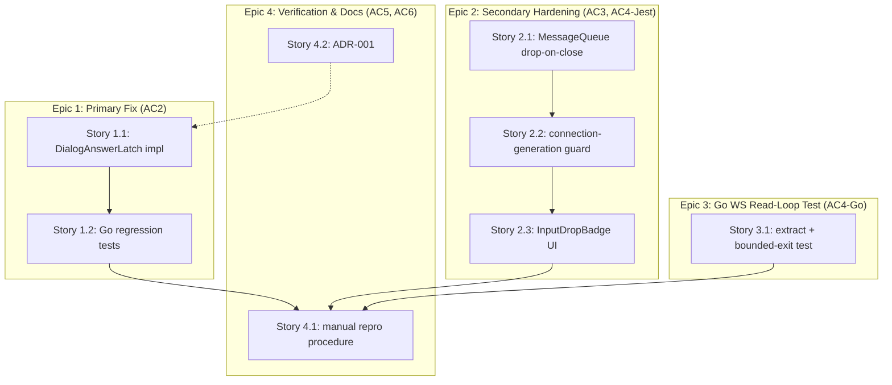

# Implementation Plan: Phantom Repeated "1" Keystroke Fix

Backlog item: `04089969-0f19-499c-be34-2e8bcfc4f13e`
Requirements: `../requirements.md` | Phase 0 gate: `../research/phase0-findings.md`
ADRs: `../decisions/ADR-001-startup-dialog-answer-latch.md` (client-side epoch guard
reuses an existing repo idiom, see Pattern Decisions below — no ADR needed for it)

Status: Phase 0 (AC1) already GO/confirmed. This plan covers Phase 1/2 — the two
additive, independent fixes plus regression coverage and manual verification.

---

## Step 0.5 — Creative Pass (Primary Fix Design)

Three approaches considered for "answer the startup dialog at most once, even
while `Preview()` returns stale/unchanging content":

| # | Approach | Strength | Weakness |
|---|---|---|---|
| A | **Content-hash latch** — hash the dialog text (FNV-64a via the existing `hashString` helper); send once per unique hash, latch until hash changes. | Directly targets the confirmed mechanism (Phase 0: identical stale content across ticks) with a single, cheap comparison per tick — no timers, no scheduling. | A stale buffer showing byte-identical text for a *different* real dialog occurrence (extremely unlikely given surrounding path/context text) would be missed — acceptable per `research/ux.md`'s "silent-safe > phantom-replay" ranking. |
| B | **Bounded attempt counter with exponential backoff, no content awareness.** | Simple to reason about in isolation; caps total sends per driver run. | Cannot distinguish "same stale dialog" from "a genuinely new, different dialog" — exhausting the counter would silently ignore a legitimate second dialog (e.g. a directory-access prompt appearing after the trust dialog), a functional regression. |
| C | **Answer-and-verify-then-latch via re-preview after a delay.** | Closest to "confirm the effect actually took hold" semantics. | Adds a second timing/scheduling axis on top of the existing 2s poll tick for no benefit over comparing hashes on the tick that already happens; delays the "stop resending" decision, the opposite of what's needed. |

**Chosen: A (content-hash latch)**, refined with bounded retry-on-*failure*
only (not on success) so a real `SendKeys` transient error still gets a few
retries before giving up — see ADR-001 for the full state machine and
rejected-alternative reasoning (B and C recorded there in more detail).

---

## Step 1 — System Type

This is a **concurrency/lifecycle bug fix in an existing system**, not new-system
design: two independent state-machine corrections (a Go polling loop's
missing de-dup latch; a React hook's missing connection-generation fence) plus
regression tests and one new small UI component. No new services, no schema
changes, no new external dependencies (confirmed by `research/build-vs-buy.md`).

---

## Step 2 — Domain Glossary

| Term | Definition |
|---|---|
| **DialogAnswerLatch** | The local state (`dialogLatchStatus` + content hash + attempt count) inside `runSessionDriverWithPrompt` that governs whether the driver's next `SendKeys("1\n")` call for a given on-screen dialog is sent, suppressed (already answered, awaiting dismissal), or abandoned (gave up). |
| **DialogLatchStatus** | Three-state enum: `dialogUnanswered` → `dialogAwaitingDismissal` → `dialogGaveUp`. |
| **DialogContentHash** | FNV-64a hash (via the existing `hashString` helper, `claude_controller.go:621-625`) of the `Preview()` output that triggered `isStartupDialog`/`shouldApprovePrompt`; the latch re-arms only when this hash changes. |
| **maxDialogAnswerAttempts** | Bounded retry cap (3) for `SendKeys` failures against the *same* hash before the latch gives up (`dialogGaveUp`). Does not bound legitimate re-answering of a genuinely new dialog (new hash resets the counter). |
| **ConnectionGeneration** | A monotonically increasing integer (`connectionGenerationRef.current`), bumped once per `useTerminalStream.connect()` call, identifying "the current connection attempt." Directly modeled on `usePathCompletions.ts`'s existing `generationRef` idiom (`usePathCompletions.ts:107,122,152,168`). |
| **Superseded generation** | Any `ConnectionGeneration` value that is no longer equal to `connectionGenerationRef.current` — its message-processing loop and any `MessageQueue` it owns are dead and must not mutate shared state or deliver buffered input. |
| **Drop-on-close** | `MessageQueue.close()`'s new behavior: discard (not drain) whatever remains in the internal `queue` array at close time, returning the count of discarded items. |
| **DropEpisode** | One coalesced UI announcement covering all inputs dropped within a short debounce window (400ms), carrying a count, rather than one announcement per dropped keystroke. |
| **InputDropBadge** | The new terminal-local, portal-rendered, auto-dismissing UI element (modeled on `XtermTerminal.tsx`'s `copiedToast`) that visibly (badge text) and audibly (`role="alert"`, `aria-live="assertive"` via an extended `LiveRegion`) announces a `DropEpisode`. |

---

## Step 3 — Pattern Selection

| Element | Pattern | Rationale |
|---|---|---|
| `DialogAnswerLatch` | Simple local state guard (tri-state enum), not a full sum type / not an `Instance` field. | `StartSessionDriver`'s existing `driverRunning.CompareAndSwap` idempotency guard already guarantees single-goroutine sequential ownership of this state for the life of one driver run (same reasoning `sentInitial`/`initialPromptSentAt` already rely on as plain locals) — no concurrency, no need for atomics or a richer type. |
| `ConnectionGeneration` | Plain `useRef<number>` fence, not a value object with methods. | `research/build-vs-buy.md` Option 4 explicitly recommends copying `usePathCompletions.ts`'s `generationRef` idiom verbatim rather than inventing a richer abstraction — this is a "guard on identity of the current attempt," not an algorithm (build-vs-buy.md Option 3). |
| `MessageQueue.close()` | Extend the existing class in place (Special-Case-style mutation of an existing method), not a new class/decorator. | The bug is a one-line-condition gap (`close()` doesn't clear `this.queue`) in an already-minimal 68-line class; introducing a wrapper or new abstraction would be pure overhead. |
| `InputDropBadge` | Composition over the existing `LiveRegion` primitive (extend with a `role` prop) + a new terminal-local portal component, not the global `NotificationToast` stack. | `research/ux.md` explicitly recommends against routing through `NotificationToast` (overkill: entrance animation, dedup window, toast-stack UI for what is a terminal-local, transient signal) and recommends the `copiedToast` portal pattern as the closest existing precedent. |
| Go WS read-loop testability | Extract-function refactor (pure move, no behavior change), not a new interface/mock framework. | `session/services` has no `goleak`; the established idiom (`research/stack.md` §4) is hand-rolled channel + timeout assertions via `createTestWebSocketPair` — extraction is the minimal change that makes the existing loop reachable from that harness without a live tmux `Instance`. |

**Migration Plan**: Omit — no schema, no database, no proto wire-format changes.

---

## Observability Plan

- `session_driver.go`: log at `Warn` when a `DialogAnswerLatch` transitions to
  `dialogGaveUp` (session title + hash + attempt count), so an operator can
  see in `~/.stapler-squad/logs/stapler-squad.log` that a dialog was
  abandoned rather than silently never-resolved. This reuses the existing
  `log.Warn(...)` call convention already in this file (e.g.
  `"SessionDriver: failed to answer startup dialog"`); no new metrics/counter
  infrastructure is introduced (none exists in this package today — avoid
  adding a new dependency for one counter, per `research/build-vs-buy.md`'s
  "don't add infrastructure the bug doesn't need" spirit).
- `useTerminalStream.ts`: `console.warn` (matching the file's existing
  `console.warn`/`console.debug` convention, e.g. line 190) when a superseded
  generation's message loop is discarding a message, so it's visible in
  DevTools during manual verification (AC5) without instrumenting a new
  telemetry path.
- No new server-side metrics/tracing spans are added for the Go WS
  read-goroutine extraction — it is a pure refactor; existing
  `[streamViaControlMode]`-prefixed log lines are preserved verbatim.

---

## Risk Control

| Risk | Mitigation |
|---|---|
| `DialogAnswerLatch` reaches `dialogGaveUp` while the dialog genuinely still needs an answer (e.g. persistent `SendKeys` failures unrelated to a stale buffer), leaving the session stuck at the trust prompt. | Accepted residual risk, explicitly logged at `Warn` (see Observability Plan). This is strictly better than today's behavior (infinite phantom resends) and does not regress: a session that would have gotten a *working* `SendKeys` eventually still gets up to 3 attempts. Wiring `dialogGaveUp` into `ReviewQueue`/human-attention (like `handleDriverFailure` does) is flagged as a follow-up, not required by AC2. |
| FNV-64a hash collision between two different dialog texts. | Not mitigated further — astronomically unlikely for this text domain/size; documented in ADR-001. |
| Making `useTerminalStream.connect()` unconditionally close/abort whatever it's about to replace (removing the `isConnectedRef.current`-gated skip that previously let a not-yet-connected prior attempt survive) forces an extra reconnect cycle when a connection was about to succeed. | Intentional and required by the architecture.md finding (this exact gate is the root of the double-live-connection risk); covered by the triple-rapid-connect Jest test (Task 2.2.6) asserting no throw/leak across the resulting extra reconnect. **Correction (closes adversarial-review.md's Risk-Control-table-vs-task-list mismatch concern):** this row previously described the change as happening inside `disconnect()`; it actually happens inside `connect()` (Task 2.2.2) — `disconnect()` itself is unmodified by Task 2.2.2 and keeps its own pre-existing behavior (see next row). |
| `disconnect()`'s own `isConnectedRef.current`-gated branch (lines 378-382) resolves the teardown promise **without ever calling `abortControllerRef.current.abort()`** when not connected — a pre-existing latent bug this plan does not fix — and neither `connect()` nor `disconnect()` check a generation token before mutating the shared `messageQueueRef`/`abortControllerRef`, so `disconnect()` (e.g. component-unmount cleanup) racing a concurrent `connect()` (e.g. an auto-reconnect timer not guaranteed to be cancelled on unmount) could have whichever call finishes last tear down or leave live a generation it didn't intend to. | **Explicit scope decision, not silently accepted:** this plan does not modify `disconnect()` to add a generation check — doing so correctly would require threading `connectionGenerationRef` through `disconnect()` and deciding what "disconnect the current generation" means when a newer `connect()` has already started, which is more surface than this ticket's AC3/AC4 require. Instead, Task 2.2.7 (new, below) adds a Jest test that exercises the actual interleaving (`disconnect()` racing a concurrent `connect()`) and asserts the newer generation's queue/controller survive — turning this from an untested risk into a tested, documented one. If that test reveals disconnect()-vs-connect() interleaving actually corrupts state (not just "the older generation's teardown resolves oddly"), fixing `disconnect()` itself becomes a follow-up ticket rather than silently shipping the gap. |
| Extracting the WS read-goroutine loop (`connectrpc_websocket.go`) into a standalone function subtly changes envelope-parsing/dispatch order. | Extraction is scoped as a pure move (Task 3.1.1) with no logic changes; verified by running the full existing `server/services` test suite (`go test ./server/services`) before and after, in addition to the new test. |
| `close()` now dropping (not draining) buffered input is a behavior change for any *other* caller relying on drain-on-close semantics. | Grepped: `MessageQueue` has exactly one production consumer (`useTerminalStream.ts`); no other call site depends on drain-after-close. Requirements' Goal 3 explicitly mandates this new behavior. |
| Task 1.1.3's fall-through fix (Blocker 1 resolution) removes the previously-absolute mutual exclusion between the startup-dialog branch and the `NeedsApproval` branch within a single tick — pre-fix, the unconditional `continue` made both branches acting in the same tick impossible. If a buffer were ever classified true by both `isStartupDialog` and `shouldApprovePrompt` simultaneously, the independently-scoped `approvalLatch` could now fire a second `SendKeys` in that same tick. | Accepted, not mitigated further — the two detectors key on disjoint phrase sets (verified against `isStartupDialog`/`shouldApprovePrompt`'s implementations), making simultaneous match very unlikely, and even if it occurred it is bounded (cannot reproduce unbounded resend, same risk class as the already-accepted FNV-64a collision risk above). Flagged by the adversarial re-review pass; documented here rather than silently absorbed. |

---

## Unresolved Questions

1. ~~Should `DialogAnswerLatch` reaching `dialogGaveUp` escalate to
   `ReviewQueue` (mirroring `handleDriverFailure`'s human-attention path)?~~
   **Resolved** (adversarial-review.md Blocker 1): Task 1.1.3 now requires
   that once the latch reaches `dialogAwaitingDismissal` or `dialogGaveUp`,
   the tick falls through to the rest of the loop body instead of
   `continue`-ing past it. This means a `dialogGaveUp` session naturally
   reaches the existing `driverInactivityTimeout` → `handleDriverFailure` →
   `ReviewQueue` escalation path the same way any other stuck session does —
   no new escalation wiring needed; the pre-existing machinery now actually
   gets a chance to run for this case.
2. `InputDropBadge`'s coalescing window is set to 400ms per `research/ux.md`'s
   suggested 300-500ms range; this is a UX-tunable value, not load-bearing
   for correctness — product/design may want to adjust after real-world
   observation.
3. `research/architecture.md` §2 documents a larger, separate server-side gap
   (unreferenced-counted `StartControlMode`/`StopControlMode`, no per-session
   connection registry in `HandleWebSocket`) that could in theory allow two
   live `streamViaControlMode` goroutine sets to both forward input for one
   session. Phase 0 confirmed this is **not** the ticket's root cause and it
   is explicitly bounded by the Non-Goals section ("general reconnect
   stability beyond what's needed to stop input replay... out of scope");
   this plan does not attempt the full connection-registry/refcounting
   redesign — only the client-side epoch guard and the WS read-loop's
   bounded-exit test, which is sufficient to satisfy AC3/AC4's literal text.
   Flagged as a candidate follow-up ticket, not a blocker here.

---

## Dependency Visualization

Epics 1, 2, and 3 are independent and can be implemented in parallel (per
`research/phase0-findings.md`'s explicit "additive, not alternatives"
verdict). Epic 4's manual repro (Story 4.1) depends on Epics 1-3 all being
merged, since AC5 verifies the combined fix. ADR-001 (Story 4.2) documents
Epic 1's design and can be written any time (dotted line — informational
dependency only).

---

## Phase 1 / Epic 1 — Primary Fix: Startup Dialog Answer Latch (AC1 done, AC2)

AC1 is already satisfied (`research/phase0-findings.md`, GO verdict) — no
tasks needed for it here.

### Story 1.1 — Implement the DialogAnswerLatch

**Given** a session whose `Preview()` output matches `isStartupDialog`,
**when** `runSessionDriverWithPrompt` observes the same content hash across
repeated poll ticks, **then** `SendKeys("1\n")` fires at most once for that
hash (or up to `maxDialogAnswerAttempts` only while attempts are genuinely
failing), not once per tick indefinitely. *(AC2 — primary GWT)*

- **Task 1.1.1** — Add the latch type and constant to
  `session/session_driver.go` (top of file, near the existing `const (...)`
  block at lines 26-44): `dialogLatchStatus` enum
  (`dialogUnanswered`/`dialogAwaitingDismissal`/`dialogGaveUp`), a
  `dialogAnswerState` struct (`hash uint64`, `status dialogLatchStatus`,
  `attempts int`), and `const maxDialogAnswerAttempts = 3`. No other files
  touched.
- **Task 1.1.2** — Add a small helper function `answerDialogOnce(state
  *dialogAnswerState, output string, send func() error, sessionTitle,
  logContext string) dialogLatchStatus` in `session/session_driver.go`
  implementing the hash-compare / state-transition logic from ADR-001
  (reset on hash change; send-once on `dialogUnanswered`; retry-bounded on
  send failure; no-op on `dialogAwaitingDismissal`/`dialogGaveUp`). Returns
  `state.status` after the transition, so call sites can branch on the
  resulting status (see Task 1.1.3's control-flow requirement). Uses the
  existing `hashString` helper from `session/claude_controller.go:621-625`
  (same package, no new import).
  **Content normalization before hashing (closes adversarial-review.md
  Blocker 2):** do not hash the raw `output` string directly. `Preview()`
  output can differ byte-for-byte between ticks for reasons unrelated to
  the dialog actually changing — terminal-width-driven line-wrap shifts,
  trailing whitespace, cursor-positioning artifacts — and requirements.md/
  this plan already treat resize-driven reconnect churn (the adjacent
  "infinite resize loop" issue referenced as sharing a reconnect-instability
  root) as a real, not hypothetical, phenomenon during exactly the flapping
  window this fix targets. A straight FNV-64a hash of the raw string would
  reset the latch on any such incidental jitter and reproduce the original
  unbounded-resend bug through a different path than the one Phase 0 proved.
  Normalize before hashing using `strings.Join(strings.Fields(output), " ")`
  (collapse all runs of whitespace, including newlines from line-wrap
  shifts, to single spaces) and hash the normalized string instead of
  `output` directly. This is the same "reduce to a stable fingerprint before
  hashing/comparing" idiom already used one call away in this file's own
  package — `GetCurrentStatus` (`claude_controller.go:500-553`) hashes only
  a tailed, `filterTmuxMetadata`-filtered slice of content rather than the
  raw buffer, for the identical reason (avoid false-different comparisons
  against incidental buffer noise); `filterTmuxMetadata` itself doesn't
  apply here (it strips tmux status-bar lines, not whitespace/wrap jitter),
  but the general "normalize before hash" precedent is directly reusable.
  No new import beyond `strings` (already imported in this file).
  **Tail-slice before matching AND hashing (closes pre-mortem.md Failure #1,
  P1):** `Preview()` → `GetRecentOutput(0)` → `PTYAccess.GetBuffer()` →
  `CircularBuffer.GetAll()` returns the *entire* accumulated PTY buffer (up
  to its multi-MB cap), not a tailed "current screen" snapshot, despite
  `Preview()`'s own doc comment saying "returns the current visible
  terminal content" (`instance_terminal.go:103-105`) — confirmed by reading
  `pty_access.go:69-78` and `claude_controller.go:143`'s buffer
  construction. Left unbounded, `isStartupDialog`'s substring match keeps
  matching the trust-dialog text for as long as it survives anywhere in
  that buffer (most of an ordinary session), and the hash of the *whole*
  buffer changes every tick as soon as Claude produces any new output —
  which this latch's own re-arm rule ("hash changed → new dialog → reset to
  `dialogUnanswered`") would treat as a fresh, unanswered dialog, silently
  resending `SendKeys("1\n")` into an already-working, non-flapping session.
  This is a materially larger and more ordinary trigger than the
  formatting-jitter case above. Fix: before either the `isStartupDialog`/
  `shouldApprovePrompt` match or the hash, tail-slice `output` to a bounded
  recent window using the existing `tailContent(s string, n int) string`
  helper (`claude_controller.go:608-618`, same package) with the existing
  `statusDetectionTailBytes` constant (`claude_controller.go:56`, currently
  `4096`) — i.e. `tailed := tailContent(output, statusDetectionTailBytes)`,
  then normalize/hash `tailed`, and run `isStartupDialog(tailed)` (not
  `isStartupDialog(output)`). This mirrors `GetCurrentStatus`'s own existing
  tail-then-normalize precedent (`claude_controller.go:528`) applied to the
  same underlying over-broad buffer read, so both the dialog-match and the
  hash-based "unchanged" comparison are scoped to what's actually still
  near-current on screen, not the session's entire history.
- **Task 1.1.3** — Wire `answerDialogOnce` into the startup-dialog branch of
  `runSessionDriverWithPrompt` (`session/session_driver.go` lines 148-165):
  replace the unconditional `if isStartupDialog(output) { SendKeys...;
  continue }` body with a local `var startupLatch dialogAnswerState`
  (declared once above the `for range ticker.C` loop, alongside `sentInitial`)
  and a call to `answerDialogOnce(&startupLatch, output, func() error {
  return inst.SendKeys("1\n") }, inst.Title, "startup dialog")`.
  **Control-flow requirement (closes adversarial-review.md Blocker 1):**
  `answerDialogOnce` returns the latch's resulting `dialogLatchStatus` for
  this tick. The call site must branch on that returned status, not
  preserve today's unconditional `continue`:
  - `dialogUnanswered` (this tick just attempted a send, whether it
    succeeded or is retrying after a failure): `continue` — mirrors
    today's existing single-tick "we just acted, move on" behavior, for
    exactly this one tick.
  - `dialogAwaitingDismissal` or `dialogGaveUp`: do **not** `continue`.
    Fall through to the rest of the loop body exactly as if
    `isStartupDialog(output)` had been false for this tick — i.e. the
    `if isStartupDialog(output) { ... }` block no longer gates entry to
    the `sentInitial`/Ready-detection check, the `driverInactivityTimeout`
    → `handleDriverFailure` → `ReviewQueue` escalation, or the
    `NeedsApproval` branch below it. Concretely: only the
    `dialogUnanswered`-this-tick case returns/continues early; the other
    two statuses let the tick proceed downward.
  This is what prevents a permanently-`dialogGaveUp` session from silently
  wedging for up to `driverTotalTimeout` (25 min) with zero operator
  escalation — once the latch gives up, the tick now reaches the same
  inactivity-timeout/`handleDriverFailure` machinery a non-dialog stuck
  session already goes through, instead of exiting via the bare
  `totalDeadline` return (which calls no failure handler). See "Unresolved
  Questions" below — this resolves Question #1 without new wiring.
- **Task 1.1.4** — Apply the same latch to the second `SendKeys("1\n")` call
  site (the `NeedsApproval`/`shouldApprovePrompt` branch, lines 206-219):
  declare a second, independently-scoped `var approvalLatch
  dialogAnswerState` and route that branch's send through
  `answerDialogOnce(&approvalLatch, output, func() error { return
  inst.SendKeys("1\n") }, inst.Title, "approval prompt")`. Same defect class
  as Task 1.1.3, cheap to close now rather than leaving a twin bug in place.
  **This branch has no `continue` today** (lines 206-219 sit after the
  startup-dialog branch's early-exit and fall through naturally to the end
  of the loop body regardless of outcome), so there is no analogous
  control-flow starvation risk to fix here — `answerDialogOnce`'s returned
  status is only used for logging/consistency at this call site, not for
  branching. Note this asymmetry explicitly in the code comment at the
  call site so a future reader doesn't assume the two call sites need
  identical branching.

### Story 1.2 — Regression tests proving bounded resend (AC2, part of AC4)

**Given** `session/phase0_repro_test.go`'s fake `ProcessManager` (whose
`CapturePaneContent()`/`GetRecentOutput` path always returns unchanging
trust-dialog text), **when** the real (now-fixed) `runSessionDriverWithPrompt`
runs for several poll ticks against it, **then** `SendKeys("1\n")` is observed
at most `maxDialogAnswerAttempts` (3) times, never growing with additional
ticks — this is the permanent regression proof for AC2, replacing Phase 0's
now-obsolete "expect repeated sends" assertion.

- **Task 1.2.1** — Move the `stuckDialogProcessManager` fake type and
  `trustDialogText` constant from `session/phase0_repro_test.go` into
  `session/session_driver_test.go` (same package `session`, no import
  needed), so both files' tests can reuse it without duplication. Delete
  `session/phase0_repro_test.go` (its sole test's assertion — `count < 2` is
  a failure — literally encodes the pre-fix bug as the expected outcome and
  would fail once the fix lands; its evidence is already permanently
  captured in `research/phase0-findings.md`'s transcript).
- **Task 1.2.2** — Add `TestSessionDriver_StuckDialogAnswersBoundedNotUnbounded`
  to `session/session_driver_test.go`: constructs an `Instance` with the
  moved fake `ProcessManager` (identical setup to the old Phase 0 test:
  `Status: Ready`, `started: true`), runs `runSessionDriverWithPrompt` in a
  goroutine for `driverPollInterval*6 + 500ms` (6 ticks, double the old Phase
  0 test's window, to prove the count does *not* keep growing), then asserts
  `fakePM.sendKeysCount.Load() <= maxDialogAnswerAttempts` and stops the
  goroutine by setting `inst.Status = Paused` (same cleanup pattern as the
  old test).
- **Task 1.2.3** — Add table-driven unit tests for `answerDialogOnce` itself
  to `session/session_driver_test.go` (no goroutine/ticker involved — pure
  function calls): (a) same hash sent twice in a row → second call is a
  no-op (`sendCallCount` stays 1); (b) hash changes between calls → second
  call sends again; (c) `send` returns an error `maxDialogAnswerAttempts`
  times in a row → status becomes `dialogGaveUp` and a further call with the
  same hash does not call `send` again; (d) `send` fails once then succeeds →
  status reaches `dialogAwaitingDismissal`, total 2 calls to `send`; (e)
  **(closes adversarial-review.md Blocker 2)** same logical dialog text
  across two calls but with incidental whitespace/line-wrap differences
  between them (e.g. call 1's `output` has the dialog text wrapped at one
  column width with trailing spaces, call 2 has the identical words
  re-wrapped at a different width with different internal newline
  placement) → the normalized-before-hash comparison recognizes these as
  unchanged and the latch does **not** resend (`sendCallCount` stays 1),
  proving the normalization step actually defeats the jitter scenario, not
  just the byte-identical case (a)/(b) already cover; (f) **(closes
  pre-mortem.md Failure #1, P1)** the dialog text stays fixed at the *tail*
  of `output` across two calls, but call 2's `output` has substantial new,
  unrelated content *prepended* before it (simulating a growing PTY buffer
  where Claude has produced real output after the dialog first appeared) →
  because both calls tail-slice to `statusDetectionTailBytes` before
  matching/hashing and the dialog text is still within that tail window,
  the latch recognizes the tail as unchanged and does **not** resend
  (`sendCallCount` stays 1); a companion case (g) grows the prepended
  content past `statusDetectionTailBytes` so the dialog text falls fully
  outside the tail window on call 2 → `isStartupDialog` on the tailed
  content no longer matches at all, so no send is attempted and the latch
  is simply never reached (proving the dialog is correctly treated as "no
  longer on screen," not incorrectly treated as "a new dialog appeared").
  Also add `TestSessionDriver_TailSliceBoundsDialogMatchAndHash` to
  `session/session_driver_test.go`: extends the Task 1.2.2 fake
  `ProcessManager` so `CapturePaneContent()`/`GetRecentOutput` returns
  growing content each call (dialog text fixed, new unrelated lines
  appended every tick, mirroring an active non-flapping session producing
  real output after the dialog was answered), runs
  `runSessionDriverWithPrompt` for `driverPollInterval*6 + 500ms`, and
  asserts `fakePM.sendKeysCount.Load() <= maxDialogAnswerAttempts` — the
  live-executing counterpart to unit cases (f)/(g), proving the ordinary
  active-session case (not just the static-buffer flap case Task 1.2.2
  covers) does not reproduce the unbounded-resend bug.
- **Task 1.2.4** — **(closes adversarial-review.md's Task-1.1.4-coverage
  concern)** Task 1.2.2 gives the startup-dialog latch a live-executing
  integration test (`TestSessionDriver_StuckDialogAnswersBoundedNotUnbounded`),
  but the approval-prompt latch (Task 1.1.4, the `NeedsApproval`/
  `shouldApprovePrompt` branch) is otherwise covered only by the shared
  `answerDialogOnce` unit tests (Task 1.2.3), which prove the helper
  function's transitions but not that this branch's own wiring (`mgr :=
  inst.GetStatusManager()` gating, the independent `approvalLatch`) behaves
  correctly under a stuck buffer. **Preferred:** add
  `TestSessionDriver_StuckApprovalPromptAnswersBoundedNotUnbounded`,
  structurally mirroring Task 1.2.2 — a fake `ProcessManager` whose
  `Preview()`/`GetRecentOutput` always returns unchanging text that matches
  both `shouldApprovePrompt` (e.g. an "allow reading /path" phrase inside
  `allowedPath`) and the `detection` package's `StatusNeedsApproval`
  pattern, with a real (or minimally faked) `InstanceStatusManager`
  registered against the instance so `mgr.GetStatus(inst).ClaudeStatus ==
  detection.StatusNeedsApproval` holds for the test's duration; run
  `runSessionDriverWithPrompt` for `driverPollInterval*6 + 500ms` and assert
  `sendKeysCount.Load() <= maxDialogAnswerAttempts`, same shape as Task
  1.2.2. **If** wiring a real/fake `InstanceStatusManager` to reliably
  report `StatusNeedsApproval` from the fake `ProcessManager`'s static text
  turns out to require disproportionate scaffolding (e.g. the detection
  package's pattern matching needs more realistic transcript structure than
  a one-line fake provides), it is acceptable to skip the live-executing
  test — but in that case the plan's Acceptance Criteria Coverage Summary
  (AC2 row) must say explicitly that the approval-prompt branch is "fixed by
  inspection/shared-helper coverage, not by a dedicated reproduced-evidence
  test," so it isn't silently overstated as having the same rigor as the
  startup-dialog branch. Whichever path is taken, record which one in the
  PR description.
- **Task 1.2.5** — **(closes validation.md's flagged gap: no test directly
  proves the Task 1.1.3 fall-through actually reaches the escalation
  machinery, only that resends stay bounded)** Add
  `TestSessionDriver_DialogGaveUp_FallsThroughToInactivityEscalation` to
  `session/session_driver_test.go`: use the Task 1.2.1 fake
  `ProcessManager` (unchanging stuck-dialog text) with `sentInitial`
  already forced true and `LastMeaningfulOutputTime()` set far enough in
  the past that `driverInactivityTimeout` (10 min) — mocked/shortened via
  the same technique other driver tests use to avoid a real 10-minute
  wait, or by directly unit-testing the post-`dialogGaveUp` branch logic
  in isolation rather than the full ticker loop if a full-duration test is
  impractical — would fire on the very next tick if and only if the loop
  actually reaches that check. Assert `handleDriverFailure` (or its
  observable side effect, e.g. a `ReviewQueue` entry) is reached after the
  latch hits `dialogGaveUp`, proving the fall-through isn't just "doesn't
  exceed `maxDialogAnswerAttempts`" but actually restores the pre-existing
  escalation path per ADR-001's "Control flow" section. If a full-duration
  ticker-loop test proves impractical, an acceptable fallback is a
  narrower unit test that directly calls the post-latch branch logic with
  a synthetic `dialogGaveUp` state and asserts it does not early-return —
  record which approach was taken in the PR description, same as Task
  1.2.4's fallback clause.

---

## Phase 2 / Epic 2 — Secondary Hardening: MessageQueue + Connection Generation (AC3, AC4-Jest)

### Story 2.1 — MessageQueue drop-on-close

**Given** a `MessageQueue` with one or more `TerminalData` items sitting in
its internal `queue` array (buffered because `push()` was called while
nothing was awaiting), **when** `close()` is called, **then** those buffered
items are discarded — the async iterator yields nothing further for them,
and `close()` reports how many were dropped. *(AC3 GWT — MessageQueue half)*

- **Task 2.1.1** — Edit `web-app/src/lib/terminal/MessageQueue.ts`'s `close()`
  method (lines 55-63): change to `close(): number { const droppedCount =
  this.queue.length; this.queue = []; this.closed = true; if (this.resolve)
  { this.resolve(create(TerminalDataSchema, { sessionId: "", data: { case:
  undefined } })); this.resolve = null; } return droppedCount; }`. Also
  simplify the iterator's loop condition (`[Symbol.asyncIterator]`, line 40)
  from `while (!this.closed || this.queue.length > 0)` to `while
  (!this.closed)` — with `queue` always empty at close time, the `||
  this.queue.length > 0` clause is now dead code (a queued-but-undrained item
  can no longer exist past `close()`).
- **Task 2.1.2** — Add to
  `web-app/src/lib/terminal/__tests__/MessageQueue.test.ts` (existing file,
  74-123 has the `close`/`push after close` describes): a new test
  `"drops buffered messages that were queued before close() is called"` —
  push a message with no active iterator pump (lands in `this.queue`), call
  `close()`, assert the return value equals `1`, then start iterating via
  `for await` and assert zero messages are yielded before the loop ends.

### Story 2.2 — useTerminalStream connection-generation guard

**Given** `connect()` is called a second time before the first connection's
message-processing loop has observed `isConnectedRef.current === true`,
**when** both loops would otherwise run concurrently, **then** the older
generation's loop treats itself as superseded (stops mutating state,
its queue is closed/drop-counted) and only the newer generation's state wins.
*(AC3 GWT — connection-epoch half; AC4 Jest "overlapping-connect" +
"triple-rapid-connect" GWTs)*

- **Task 2.2.1** — In `web-app/src/lib/hooks/useTerminalStream.ts`, add
  `const connectionGenerationRef = useRef(0);` near the other refs (line
  101-105). In `connect()` (starts line 156), immediately after the
  `isConnectedRef.current || !sessionId` guard, add `const myGeneration =
  ++connectionGenerationRef.current;` — same idiom as
  `usePathCompletions.ts:122` (`const generation = ++generationRef.current`).
- **Task 2.2.2** — In `connect()` (`useTerminalStream.ts`), before creating
  the new `AbortController`/`MessageQueue` (lines 175-176), unconditionally
  tear down any existing previous generation: `if (messageQueueRef.current) {
  const dropped = messageQueueRef.current.close(); if (dropped > 0) {
  onInputDropped?.(dropped); } } if (abortControllerRef.current) {
  abortControllerRef.current.abort(); }` — this removes the
  `isConnectedRef.current`-gated skip that `disconnect()` currently has
  (architecture.md §1 hop 4/5's root cause) by making `connect()` itself
  always close/abort what it's about to replace, regardless of connection
  state.
- **Task 2.2.3** — In the message-processing IIFE (`useTerminalStream.ts`
  lines 209-339), add a guard at the top of the `for await (const msg of
  stream)` loop body: `if (myGeneration !== connectionGenerationRef.current)
  break;` (captures the closed-over `myGeneration` from Task 2.2.1) — mirrors
  `usePathCompletions.ts:152,168`'s `if (generation !==
  generationRef.current) return;`. Also guard the `finally` block's
  `setIsConnected(false); setTerminalState('DISCONNECTED');` with the same
  check so a superseded loop's teardown can't stomp the newer generation's
  state.
- **Task 2.2.4** — Add an `onInputDropped?: (count: number) => void` option
  to `UseTerminalStreamOptions` (`useTerminalStream.ts` interface, lines
  36-55) and destructure it in the hook's params (line 77-93); invoke it from
  Task 2.2.2's close call. Thread `disconnect()` (lines 352-387) to the same
  drop-counting close call for symmetry (it already calls
  `messageQueueRef.current.close()` at line 364 — capture and forward the
  return value the same way).
- **Task 2.2.5** — Add to
  `web-app/src/lib/hooks/__tests__/useTerminalStream.test.ts` (existing
  fully-mocked-stream style, per `research/stack.md` §4): test
  `"overlapping connect() only lets the newer generation's state win"` —
  construct two fake async-iterable streams, call `connect()`, then call
  `connect()` again before the first stream's first message resolves, drive
  both streams' first messages, and assert `terminalState`/`isConnected`
  reflect only the second stream's messages (the first stream's `firstMessage`
  handling never fires `setIsConnected(true)` after being superseded, or if
  it does, the second generation's subsequent state wins and is the final
  observed value).
- **Task 2.2.6** — Add test `"three rapid connect() calls do not throw or
  leak"` to the same file: call `connect()` three times synchronously (in the
  same tick, simulating StrictMode's double-invoke plus a genuine reconnect),
  await all pending microtasks/timers, assert no unhandled rejection (Jest's
  default unhandled-rejection detection) and that exactly the third
  `MessageQueue` instance is the one referenced going forward (verified via a
  spy on the mocked `MessageQueue` constructor capturing all three instances
  and asserting the first two had `.close()` called on them).
- **Task 2.2.7** — **(closes adversarial-review.md's disconnect()-vs-
  connect() concern)** Add test `"disconnect() racing a concurrent
  connect() does not tear down the newer generation's queue/controller"` to
  the same file: call `connect()` (generation N), then — before its stream's
  first message resolves — call `disconnect()` and a second `connect()`
  (generation N+1) back-to-back (simulating an unmount cleanup racing an
  auto-reconnect timer), await pending microtasks/timers, and assert the
  final observed `messageQueueRef`/`MessageQueue` instance and
  `abortControllerRef`/`AbortController` instance are generation N+1's, not
  a torn-down or `null` reference left behind by the interleaved
  `disconnect()` call. This is scoped as a test proving the *current* code's
  behavior under this interleaving (documenting whichever outcome it
  actually produces), not a guarantee that the interleaving is fully race-
  free — if the test reveals state corruption (not just an extra teardown
  cycle), file a follow-up ticket to add a generation check to `disconnect()`
  itself rather than silently expanding this ticket's scope.
- **Task 2.2.8** — **(closes consistency-review's AC4-coverage BLOCKER: no
  test exercises the literal "queued-message-drop-on-close interleaving"
  scenario AC4 names — Task 2.1.2 only unit-tests `MessageQueue.close()` in
  isolation, with no live reconnect in play.)** Add test `"a message pushed
  to the live MessageQueue right as a reconnect closes it is dropped, not
  delivered to either connection"` to
  `web-app/src/lib/hooks/__tests__/useTerminalStream.test.ts`: after an
  initial `connect()` (generation N) is established, call the hook's
  `sendInput`/`sendInputWithEcho` (or push directly via the exposed
  `MessageQueue` test seam) in the same microtask tick that a second
  `connect()` (generation N+1) is triggered — i.e. genuinely interleave a
  push with the close, not push-then-close-then-check in separate steps —
  and assert: (a) the pushed message is never observed on generation N's
  stream (its `MessageQueue`'s async iterator yields nothing after close,
  per Task 2.1.1's drop semantics), (b) it is never replayed onto generation
  N+1's `MessageQueue` either (no code path copies a closed queue's dropped
  items into the new one), and (c) `onInputDropped` fires with a count
  reflecting the dropped item. This is the one test in the suite that
  actually exercises "queued while a reconnect is happening," as distinct
  from Task 2.1.2 (isolated `MessageQueue` unit test, no reconnect) and
  Tasks 2.2.5-2.2.7 (connection-generation state assertions, no pushed
  input in flight).

### Story 2.3 — InputDropBadge (drop-and-signal UI)

**Given** input was dropped because its `MessageQueue` was closed as part of
a connection being superseded, **when** `onInputDropped(count)` fires,
**then** a visible badge appears near the terminal and a `role="alert"`,
`aria-live="assertive"` announcement fires exactly once per coalesced drop
episode, naming the count. *(AC3 GWT — user-signal half)*

- **Task 2.3.1** — Add an optional `role` prop to
  `web-app/src/components/ui/LiveRegion.tsx` (default `"status"`, allow
  `"alert"`), passed through to the root `
` alongside the existing
  `aria-live={politeness}` prop (lines 20-29). No behavior change for
  existing callers that don't pass `role` (all default to today's `"status"`).
- **Task 2.3.2** — Create
  `web-app/src/components/sessions/InputDropBadge.tsx` +
  `web-app/src/components/sessions/InputDropBadge.css.ts` (vanilla-extract,
  per `.claude/rules/css-architecture.md`): a portal-rendered
  (`createPortal(..., document.body)`) badge modeled on
  `XtermTerminal.tsx`'s `copiedToast` pattern (lines 638-657) — accepts
  `{ count: number; visible: boolean }`, renders a small text badge ("1
  keystroke dropped — reconnecting" / "N keystrokes dropped — reconnecting")
  plus a nested, **unconditionally-rendered** (not gated on `visible`)
  `<LiveRegion role="alert" politeness="assertive"
  message={...} />` from Task 2.3.1. Auto-dismiss after `DEFAULT_TOAST_MS`
  — **not** `toastAutoCloseMs(type)`, per architecture-review.md's concern:
  `toastAutoCloseMs(type: NotificationData["notificationType"]): number`
  (`notification-policy.ts:38`) is parameterized on `NotificationData`'s
  `notificationType` discriminated-union member, a domain type describing
  session-level notifications (approval requests, task completion, errors).
  "Keystrokes dropped during a reconnect" has no corresponding
  `notificationType` variant and is a different domain concept (terminal-
  local transient UI signal, not a session notification); calling
  `toastAutoCloseMs` for `InputDropBadge` would force either passing an
  unrelated/misleading `notificationType` literal just to extract a
  millisecond constant, or adding a new `notificationType` variant purely to
  make the call legal — the "add a new class to reuse a switch statement"
  anti-pattern, a phantom OCP extension for a type this component isn't
  actually a member of. **Fix**: add `export const DEFAULT_TOAST_MS = 8_000;`
  as a plain named constant in `web-app/src/lib/notification-policy.ts`
  (matching `toastAutoCloseMs`'s existing non-actionable default-branch
  value), have `toastAutoCloseMs`'s default case reference
  `DEFAULT_TOAST_MS` instead of a bare `8000` literal (so the two values
  can't drift), and have `InputDropBadge` import and use `DEFAULT_TOAST_MS`
  directly rather than calling `toastAutoCloseMs` at all.
  **Live-region re-announcement fix (closes adversarial-review.md's
  identical-consecutive-episode concern):** `LiveRegion.tsx`'s existing
  effect only commits a message when it's truthy (`if (message) {
  setCurrentMessage(message); }`), so two consecutive drop episodes with
  the exact same count (e.g. "1 keystroke dropped — reconnecting" twice in
  a row) would render identical DOM text; React bails on the redundant
  state update, the DOM text never mutates, and most screen readers will
  not re-announce an unchanged `aria-live` region — silently undercutting
  AC3's "announced exactly once per coalesced drop episode" for the
  same-count-twice case. **Fix**: `InputDropBadge` must append a monotonic
  nonce to the string passed as `message` — e.g. track an internal episode
  counter (`episodeSeq`, incremented once per `onFlush` from Task 2.3.3a's
  coalescer) and build the announced text as `` `${count} keystroke${count
  === 1 ? "" : "s"} dropped — reconnecting` `` with a trailing zero-width
  space repeated `episodeSeq % 2` times (or any equivalent invisible-to-
  sighted-users, visible-to-the-DOM-diff nonce) so the underlying text node
  differs between any two consecutive announcements even when the
  human-readable count is identical. Do not reuse `LiveRegion.tsx`'s
  existing `useLiveRegion()` hook unmodified for this purpose — its
  built-in 1-second auto-clear-to-`""` is a different lifecycle than this
  badge needs (see Task 2.3.2's `visible`-independent `LiveRegion` mount
  note above) and doesn't itself solve the identical-consecutive-message
  problem.
- **Task 2.3.3a** — **(closes architecture-review.md's testability-gap
  concern)** Extract the `DropEpisode` coalescing logic — the actual
  AC3-cited behavior ("one coalesced announcement... not one per dropped
  keystroke") — into a small, independently-testable hook
  `useDropEpisodeCoalescer(onFlush: (count: number) => void, windowMs:
  number)` returning a `report(count: number)` function, colocated near
  `InputDropBadge.tsx` (e.g. `web-app/src/components/sessions/
  useDropEpisodeCoalescer.ts`) or in `web-app/src/lib/hooks/`. Internally: a
  ref-held running total plus a `setTimeout` that (re)schedules on each
  `report()` call within the window and calls `onFlush(total)` once the
  window elapses without a new `report()`, then resets the total to 0. This
  mirrors `answerDialogOnce` and `runInputReadLoop`'s existing precedent in
  this same plan of pulling new behavior into a pure/isolated unit rather
  than leaving it inline in a large, hard-to-unit-test file
  (`TerminalOutput.tsx` is 1500+ lines).
- **Task 2.3.3b** — Add a dedicated Jest test file (e.g.
  `web-app/src/components/sessions/__tests__/useDropEpisodeCoalescer.test.ts`)
  using fake timers: (a) 3 calls to `report(1)` within 400ms produce exactly
  one `onFlush` call with the summed count `3`; (b) a `report()` call after
  the window has already flushed produces a second, independent `onFlush`
  call (not merged with the first episode's count) — matching
  `design/ux.md` §2.3 Case C's "replace, don't merge across episodes"
  behavior. Write and pass this test **before** wiring the hook into
  `TerminalOutput.tsx` in Task 2.3.3c.
- **Task 2.3.3c** — In `web-app/src/components/sessions/TerminalOutput.tsx`:
  call `useDropEpisodeCoalescer` (Task 2.3.3a) with a 400ms window and an
  `onFlush` that updates the count driving `<InputDropBadge>`; pass a
  callback into the `useTerminalStream(...)` call (line 425) as
  `onInputDropped` that simply forwards each drop count into the
  coalescer's `report(count)`. Render `InputDropBadge` as a `createPortal`
  sibling near (not inside) the existing `unavailableOverlay`/
  `resizingOverlay` elements' insertion point (~line 1516-1542): those two
  are `position: absolute` inside `styles.terminal`, while `InputDropBadge`
  (Task 2.3.2) is `position: fixed` and portal-rendered to `document.body`
  (modeled on `copiedToast`), per `design/ux.md` §Step 4 item 1 — placing it
  literally inside the `styles.terminal` overlay stack would clip/mis-
  position a `fixed`+portal element, so "alongside" here means "same DOM
  insertion point as `copiedToast`'s portal," not "inside the same
  container."
- **Task 2.3.4** — Add `// +feature: input-drop-badge` marker comment near
  the top of `InputDropBadge.tsx` (per `.claude/rules/feature-registry.md`),
  then run `make registry-generate` and commit the resulting
  `docs/registry/features/*.json` diff. Add Jest tests in a new
  `web-app/src/components/sessions/__tests__/InputDropBadge.test.tsx`:
  renders with `role="alert"`/`aria-live="assertive"`, singular vs. plural
  count text, auto-dismiss after the configured timeout. **Add two more
  test cases** (closing the two remaining concerns above): (e) two
  consecutive episodes both reporting `count === 1` each still produce a
  distinct/changed underlying text-node content on the live-region
  (asserting the nonce-suffixed text differs between the two renders even
  though the human-readable count is the same) — proving the dedup fix
  above actually works; (f) badge appearing does not move
  `document.activeElement` (assert `document.activeElement` is unchanged
  immediately before and after `onInputDropped`/`report()` fires) — the
  concrete verification that the badge never steals focus, per
  `design/ux.md` §3.1's non-focus-trapping requirement.
- **Task 2.3.5** — **(closes validation.md's flagged gap: this repo's
  `.claude/rules/feature-registry.md` requires an e2e Playwright spec for
  every new user-facing feature, and `design/ux.md`'s UX-AC-2 specifically
  calls for a screenshot/bounding-rect check that no Jest/RTL test can
  provide)** Add `tests/e2e/input-drop-badge.spec.ts` with
  `test.describe('input-drop-badge', ...)`: drive a session into the
  reconnect-drop condition (or a test-only trigger if reproducing a real
  reconnect in Playwright proves impractical — note whichever approach is
  taken in the PR description, same fallback convention as Tasks 1.2.4/
  1.2.5) and assert (a) the badge becomes visible, (b) its bounding rect
  does not intersect the xterm viewport's active cursor region per
  `design/ux.md` UX-AC-2, and (c) it auto-dismisses within the configured
  timeout. Register this spec's `id` in
  `docs/registry/frontend-features.json` per `.claude/rules/feature-
  registry.md`'s required-steps checklist (new UI feature → registry entry
  → e2e test → `testIds` populated), alongside Task 2.3.4's registry-
  generate step.

---

## Phase 3 / Epic 3 — Go WS Read-Goroutine Bounded Exit Test (AC4-Go)

### Story 3.1 — Extract and test the read loop

**Given** the WebSocket input-read loop (`connectrpc_websocket.go`'s
Goroutine 2) is running against a real test WebSocket connection with
`doneChan` open, **when** the underlying connection is closed (the same
event that unblocks it in production once the outer handler's deferred
`conn.Close()` fires), **then** the loop returns within a bounded timeout and
processes zero further input messages sent after the close. *(AC4 — Go GWT)*

- **Task 3.1.1** — In `server/services/connectrpc_websocket.go`, extract
  Goroutine 2's body (lines 856-924, the `for { select { case <-doneChan:
  return; default: _, message, err := stream.conn.ReadMessage() ... } }`
  block) into a standalone unexported function `runInputReadLoop(stream
  *connectWebSocketStream, doneChan chan struct{}, errChan chan error,
  sessionID string, onInput func(data []byte), onResize func(cols, rows
  int))`. **The `sessionID string` parameter is required** (closes
  architecture-review.md and adversarial-review.md's matching concern): the
  WS-read-error log line at `connectrpc_websocket.go:868`
  (`log.Error("[streamViaControlMode] WebSocket read error", "session",
  sessionID, "err", err)`) sits directly in the loop body, outside both the
  `onInput` and `onResize` callbacks, and `sessionID` is a local var in
  `streamViaControlMode` (`sessionID := instance.Title`), not a field on
  `connectWebSocketStream` — without this parameter the extraction either
  fails to compile or silently drops session context from that log line.
  Pure move otherwise: the envelope-parse/`EndStream`-check/`TerminalData`-
  unmarshal logic stays byte-for-byte identical; only the two previously-
  inline actions ("send to tmux via CM+fallback" and "push to `resizeCh`")
  become the two callback invocations. `streamViaControlMode` calls `go
  runInputReadLoop(stream, doneChan, errChan, sessionID, func(data []byte) {
  ...existing CM+fallback code... }, func(cols, rows int) { ...existing
  resizeCh send... })` in place of the old inline `go func() { ... }()`.
  Verify with `go test ./server/services` (existing suite) before
  committing — no assertions should change.
- **Task 3.1.2** — Add `TestRunInputReadLoopExitsPromptlyOnConnectionClose`
  to `server/services/connectrpc_websocket_test.go`, using the existing
  `createTestWebSocketPair(t)` helper (lines 20-50): start
  `runInputReadLoop` in a goroutine (passing a literal test session ID
  string for the new `sessionID` parameter from Task 3.1.1) with a
  recording `onInput` callback
  (appends to a mutex-guarded slice) and a `done := make(chan struct{})`
  closed when the loop returns; write one input envelope from the client
  side and assert it's recorded; close the **client** connection (simulating
  the production shutdown path where the outer handler's `defer
  conn.Close()` runs); assert `<-done` fires within `2*time.Second` via
  `select`/`time.After`; then assert the recorded-input slice's length did
  not increase even though the client attempted (and necessarily failed) to
  write again after closing its own end — proving "does not keep forwarding
  input after exit."

---

## Phase 4 / Epic 4 — Manual Verification & Documentation (AC5, AC6)

### Story 4.1 — Manual repro procedure (AC5)

**Given** a live stapler-squad server and browser session, **when** the
ticket's specific not-started/paused flapping condition is reproduced against
a session showing the trust-folder dialog, **then** no repeated phantom "1"
keystroke appears after the fix, and the result is recorded on the backlog
item. *(AC5 GWT)*

- **Task 4.1.1** (manual, not automated — documented procedure per
  requirements' Constraints):
  1. `make install-service` to build and install the fixed binary.
  2. Create a fresh session via the omnibar's "New Worktree" mode pointed at
     a repo path Claude Code has not seen before (guarantees the trust-folder
     dialog appears on first launch).
  3. Attach to the session in the browser the moment it's created, before
     the dialog visibly clears.
  4. Reproduce the ticket's specific "session not started or paused"
     condition (not generic DevTools network-offline toggling) via **one**
     of:
     - (a) Use the app's own pause/resume control on the session (Session
       list → Pause, then Resume within ~1-3s), matching the ticket's own
       log vocabulary ("session not started or paused"); or
     - (b) From a shell: `tmux kill-session -t staplersquad_<session-title>`
       while the browser tab stays attached, letting the server's own
       restore path (`RestoreWithWorkDir`) recreate the tmux session.
  5. Tail `~/.stapler-squad/logs/stapler-squad.log` and confirm the line
     `"SessionDriver: answered startup dialog"` appears **at most
     `maxDialogAnswerAttempts` (3) times total**, not once per ~2s
     indefinitely, across the whole flap-and-recover window. **The bounded
     count alone is a weak signal in isolation** (closes
     adversarial-review.md's manual-repro concern) — a normal,
     never-flapping single-dialog session also shows "answered startup
     dialog" a small number of times, so a bounded count by itself can't
     distinguish "the fix correctly bounded a real resend storm" from "the
     flap was never actually triggered and the dialog was just answered
     once, normally." **Additionally correlate timestamps**: confirm the
     repeated `SendKeys`/latch-attempt log lines cluster specifically within
     the "session not started or paused" flap window induced in step 4
     (i.e. their timestamps fall between the flap's start and its recovery,
     not scattered arbitrarily across the whole session lifetime) — this is
     what actually proves the resends happened *because of* the induced
     flap, not merely that the total stayed low.
  6. Watch the xterm pane / Claude Code transcript through and after
     recovery; confirm no literal repeated `1` characters appear once the
     dialog resolves.
  7. If any input was typed during the flap window and dropped, confirm the
     `InputDropBadge` (Epic 2, Story 2.3) appeared visibly and — with a
     screen reader or the browser's accessibility inspector — was announced
     via the assertive live region exactly once for that drop episode, with
     the correct count.
  8. Record pass/fail, timestamp, and the relevant log excerpt as a comment
     on backlog item `04089969-0f19-499c-be34-2e8bcfc4f13e`.
  9. **Bisection on ambiguous result (closes pre-mortem.md Failure #4, P2):**
     Epics 1 (session_driver.go latch) and 2 (client MessageQueue/generation
     guard) are independent fixes validated together in steps 1-8. If the
     result is mixed or ambiguous (e.g. no more repeated "1" but the
     `InputDropBadge` never appeared when input was typed during the flap,
     or vice versa), repeat steps 2-6 once more against a build with only
     Epic 1's changes present (revert or comment out Epic 2's changes
     locally) to isolate whether the server-side latch alone resolves the
     repeated-keystroke symptom independent of the client-side hardening —
     this attributes a mixed result to a specific epic rather than leaving
     it as undifferentiated "the combined fix didn't fully work."

### Story 4.2 — ADR (already written)

- **Task 4.2.1** — `project_plans/phantom-keystroke-replay/decisions/ADR-001-startup-dialog-answer-latch.md`
  is already written (see top of this document). No further action beyond
  keeping it in sync if the latch design changes during implementation
  review.

### Story 4.3 — Non-Goals confirmation (AC6)

**Given** requirements.md's Non-Goals section already states multi-tab
concurrent input is out of scope, **when** this plan's task list is reviewed,
**then** no task attempts cross-tab input coordination/locking. *(AC6 GWT)*

- **Task 4.3.1** — No code task. Verification only: confirm (by inspection,
  already done while writing this plan) that none of Epics 1-3's tasks
  introduce any per-tab/multi-connection coordination beyond the
  single-session generation guard in Story 2.2, which is scoped to
  "supersede an older connection attempt from the same tab/session," not
  "coordinate multiple simultaneously-live tabs." If a future report
  surfaces multi-tab duplicate/lost input, requirements.md's Non-Goals
  section already documents that it must not be treated as a regression of
  this fix.

---

## Acceptance Criteria Coverage Summary

| AC | Satisfied by |
|---|---|
| AC1 | Already done (`research/phase0-findings.md`) — no new tasks. |
| AC2 | Epic 1 (Stories 1.1, 1.2). Startup-dialog branch: live-executing test (Task 1.2.2) + unit tests (Task 1.2.3, including the whitespace/line-wrap jitter case). Approval-prompt branch: live-executing test if feasible (Task 1.2.4), otherwise explicitly labeled "fixed by inspection/shared-helper coverage" per Task 1.2.4's fallback clause — see that task for which path was taken. |
| AC3 | Epic 2 (Stories 2.1, 2.2, 2.3). |
| AC4 | **Satisfied by two independent, layer-scoped regression suites, not one true cross-layer integration test** (closes adversarial-review.md's "forwarded to tmux exactly once" concern): (1) client-side epoch/queue behavior — Epic 2 Tasks 2.2.5/2.2.6/2.2.7 (Jest: overlapping-connect, triple-rapid-connect, disconnect()-vs-connect() race), Task 2.1.2 (Jest: isolated `MessageQueue.close()` unit test), and Task 2.2.8 (Jest: the actual queued-message-drop-on-close **interleaving** test AC4 names literally — a message pushed while a reconnect is genuinely in flight, closing the consistency-review's AC4-coverage BLOCKER); (2) server-side read-loop shutdown behavior — Epic 3 Task 3.1.2 (Go: bounded read-goroutine exit, no forwarding after close). Plus Epic 1 Tasks 1.2.2/1.2.3(f)/1.2.3(g)/new-`TestSessionDriver_TailSliceBoundsDialogMatchAndHash` (Go: bounded dialog-resend regression, including the growing-buffer case from pre-mortem.md Failure #1) for the dialog-replay half of AC4. This is an intentional scope decision, not a gap: `research/pitfalls.md` §5 explicitly frames client+server coverage as "paired, not single" (a frontend-only test would give false confidence and needs pairing with a Go test) — this plan satisfies "paired," and a future reader should not assume a single test drives an input through both the WebSocket client layer and the server read-loop into one real tmux sink, because none does. |
| AC5 | Epic 4 Story 4.1 (manual procedure; step 5 requires timestamp-correlating the resend log lines against the induced flap window, not just a bounded total count — see Plan Revision Log #8). |
| AC6 | Epic 4 Story 4.3 (confirmation; substantive exclusion already in requirements.md). |

---

## Plan Revision Log

Responding to `implementation/adversarial-review.md` (BLOCKED) and
`implementation/architecture-review.md` (CONCERNS). Both blockers and all
nine folded-in concerns are addressed below; nothing in this log revisits
the plan's already-accepted Unresolved Question about the server-side
connection-registry/refcounting gap (`research/architecture.md` §2), which
both reviews confirm remains correctly scoped out.

### Blockers

1. **Control-flow starvation on `dialogGaveUp`/`dialogAwaitingDismissal`.**
   Task 1.1.3 now specifies that the startup-dialog call site branches on
   `answerDialogOnce`'s returned status: only `dialogUnanswered` (a send was
   just attempted this tick) keeps the existing single-tick `continue`;
   `dialogAwaitingDismissal` and `dialogGaveUp` fall through to the rest of
   the loop body (Ready-detection, inactivity-timeout escalation,
   `NeedsApproval` check) instead of skipping it. `answerDialogOnce`'s
   signature (Task 1.1.2) now explicitly returns `dialogLatchStatus`.
   ADR-001 gained a new "Control flow: latch status must not starve the
   rest of the tick" section documenting this. Unresolved Question #1 is
   marked resolved (the existing `handleDriverFailure`/inactivity-timeout
   machinery now naturally reaches a `dialogGaveUp` session — no new
   escalation wiring needed).
2. **Content-hash fragility to incidental jitter.** Task 1.1.2 now specifies
   normalizing `output` via `strings.Join(strings.Fields(output), " ")`
   before hashing, rather than hashing the raw `Preview()` string. Task
   1.2.3 gained test case (e): same logical dialog with incidental
   whitespace/line-wrap differences between ticks → latch still recognizes
   it as unchanged (no resend). ADR-001 gained a "Content normalization
   before hashing" section citing bug #164's adjacency (per
   requirements.md/plan.md's existing cross-reference) as the reason this
   isn't hypothetical, and noting the "normalize before hash" precedent
   already used one call away by `GetCurrentStatus`
   (`claude_controller.go:500-553`).

### Concerns

1. **Task 3.1.1's missing `sessionID` parameter.** `runInputReadLoop`'s
   signature now explicitly includes `sessionID string`, with the
   compile/log-fidelity rationale spelled out inline; Task 3.1.2's test
   call updated to pass a literal test session ID.
2. **Task 2.3.2's `toastAutoCloseMs` type mismatch.** Task 2.3.2 now
   specifies extracting a plain `export const DEFAULT_TOAST_MS = 8_000;`
   constant in `notification-policy.ts` (referenced by both
   `toastAutoCloseMs`'s default case and `InputDropBadge`) instead of
   calling `toastAutoCloseMs(type)` with a domain type `InputDropBadge`
   structurally can't honestly satisfy.
3. **Task 2.3.3's untested `DropEpisode` coalescing logic.** Split into new
   Tasks 2.3.3a (extract a `useDropEpisodeCoalescer(onFlush, windowMs)`
   hook), 2.3.3b (dedicated fake-timers Jest test: 3 calls within 400ms →
   one flush with count 3; a call after the window → a second, independent
   flush), and 2.3.3c (wire the hook into `TerminalOutput.tsx`, written to
   require 2.3.3b passing first).
4. **Risk Control table / Task 2.2.2 mismatch, and untested
   disconnect()-vs-connect() interleaving.** The Risk Control table's row
   describing the `connect()`-side change was corrected to say `connect()`
   (not `disconnect()`); a new row was added describing `disconnect()`'s
   actual pre-existing behavior (its `isConnectedRef.current`-gated branch
   never calls `abort()`) as an explicit, documented scope decision rather
   than a silently-accepted gap. New Task 2.2.7 adds a Jest test exercising
   `disconnect()` racing a concurrent `connect()`, asserting the newer
   generation's queue/controller survive — scoped as proving the current
   code's actual behavior under this interleaving, not as a guarantee of
   full race-freedom; if it reveals corruption, fixing `disconnect()` is
   flagged as a follow-up rather than silently expanding this ticket.
5. **`InputDropBadge`'s live-region fails to re-announce identical
   consecutive episodes.** Task 2.3.2 now specifies a monotonic-nonce fix
   (an episode-sequence-driven suffix appended to the announced text) so
   two consecutive same-count drop episodes each produce a distinct DOM
   text mutation, and explicitly calls out not reusing `useLiveRegion()`'s
   1-second auto-clear unmodified. Task 2.3.4 gained a corresponding test
   case (e): two consecutive `count === 1` episodes both produce a changed
   underlying text-node.
6. **Task 1.1.4's approval-latch lacks live-executing test coverage.** New
   Task 1.2.4 adds `TestSessionDriver_StuckApprovalPromptAnswersBoundedNotUnbounded`
   as the preferred fix, mirroring Task 1.2.2's shape, with an explicit
   fallback: if wiring a fake `InstanceStatusManager` to report
   `StatusNeedsApproval` proves disproportionately costly, the Acceptance
   Criteria Coverage Summary's AC2 row must instead say the approval branch
   is "fixed by inspection/shared-helper coverage," not silently implied to
   have the same rigor as the startup-dialog branch. The AC2 summary row
   was updated to reflect this either-way requirement.
7. **AC4's "forwarded exactly once" isn't asserted by any single
   cross-layer test.** The Acceptance Criteria Coverage Summary's AC4 row
   was rewritten to state explicitly that AC4 is satisfied by two
   independent, layer-scoped regression suites (client epoch/queue behavior
   + server read-loop shutdown behavior), citing `research/pitfalls.md`
   §5's "paired, not single" framing as the intentional scope decision, so
   a future reader doesn't assume a single end-to-end test exists.
8. **Manual repro step 5's weak pass criterion.** Task 4.1.1 step 5 now
   requires correlating the "answered startup dialog" log line timestamps
   against the induced flap window from step 4, not just checking the
   total count stayed at or under 3 — since a bounded count alone doesn't
   distinguish a correctly-bounded resend storm from a flap that was never
   actually triggered.
9. **`maxDialogAnswerAttempts = 3` may be too tight for real flap
   durations.** ADR-001's Consequences section gained a new bullet
   explicitly flagging this constant as accepted-but-tunable, not proven
   correct, and noting it should be revisited if production observation
   shows flaps commonly outlasting ~6 seconds — no value change made now
   for lack of production duration data.

## Phase 4 (Validate) Repair Round

Three parallel Phase 4 subagents (validation.md test design, pre-mortem.md,
cross-artifact consistency check) surfaced one new BLOCKER and one new P1
not caught by the Phase 3 adversarial/architecture review rounds. Both are
resolved below; the plan's Domain Glossary and existing Task numbering are
otherwise unchanged (new tasks appended, none renumbered).

10. **[BLOCKER, consistency check] No test exercises AC4's literal
    "queued-message-drop-on-close interleaving" scenario.** Task 2.1.2 only
    unit-tests `MessageQueue.close()` in isolation (push, close, assert
    dropped) with no live reconnect in play; Tasks 2.2.5-2.2.7 assert
    connection-generation state with no pushed input in flight. Added
    **Task 2.2.8**: a genuine interleaving test — push a message in the same
    tick a reconnect closes the queue, assert it's dropped on both the old
    and new generation's queues, and that `onInputDropped` fires. AC4's
    coverage-summary row updated to cite it explicitly.
11. **[P1, pre-mortem] `Preview()` returns the entire accumulated PTY
    buffer, not a tailed "current screen" snapshot — the content-hash
    latch's normalization-only fix (item 2 above) does not bound this,
    and an active, non-flapping session would still reproduce the
    unbounded-resend bug once new output changes the whole-buffer hash.**
    This is a materially larger regression surface than the formatting-
    jitter case Blocker 2 closed, since it would fire in ordinary
    operation. Task 1.1.2 revised to tail-slice `output` (via the existing
    `tailContent`/`statusDetectionTailBytes` precedent already used by
    `GetCurrentStatus`) before *both* the `isStartupDialog`/
    `shouldApprovePrompt` match and the hash — not just normalize
    whitespace on the raw buffer. ADR-001's Decision section gained a
    dedicated "Tail-slice before matching and hashing" subsection. Task
    1.2.3 gained cases (f)/(g) and a new live-executing test,
    `TestSessionDriver_TailSliceBoundsDialogMatchAndHash`, using a fake
    `ProcessManager` whose buffer grows each tick (simulating real,
    non-flapping session activity) to prove the tailed latch does not
    resend once the dialog is out of the tail window and does not
    misfire while it remains within it.
12. **[P2, pre-mortem] Fall-through fix's interaction with the unrelated
    30s initial-prompt timeout, and the untested trust-a-successful-send
    assumption.** Both documented as accepted, non-blocking consequences
    in ADR-001's Consequences section (new bullets) rather than silently
    left unaddressed — neither reintroduces silent wedging (the
    inactivity-timeout path still applies either way), so they are
    observability follow-ups, not correctness gaps, per the pre-mortem's
    own P2 (not P1) severity rating.
13. **[P2, pre-mortem] No bisection method if AC5's combined manual repro
    gives a mixed result.** Added **Task 4.1.1 step 9**: on an ambiguous
    result, repeat the repro against an Epic-1-only build to attribute the
    outcome to a specific epic.
14. **[P3, pre-mortem] `InputDropBadge` may fire rarely in production,
    risking an unexercised latent bug.** Not actioned — P3 (unlikely,
    not catastrophic) and the existing `console.warn` (Observability Plan)
    plus the Task 2.3.4 Jest suite already give this path direct test
    coverage; adding production telemetry for a UI badge is judged
    disproportionate to this ticket's scope. Noted here as a considered,
    not overlooked, trade-off.
15. **[terminology, consistency check] ADR-001's state-machine bullet list
    used unprefixed `Unanswered`/`AwaitingDismissal`/`GaveUp` names while
    every other reference used the `dialog`-prefixed Go identifiers.**
    Fixed to use `dialogUnanswered`/`dialogAwaitingDismissal`/
    `dialogGaveUp` consistently throughout ADR-001.
16. **[gap, validation.md] No test directly proves the Task 1.1.3
    fall-through reaches the pre-existing inactivity-timeout/
    `handleDriverFailure` escalation, only that resends stay bounded.**
    Added **Task 1.2.5**,
    `TestSessionDriver_DialogGaveUp_FallsThroughToInactivityEscalation`,
    with an explicit fallback clause (narrower unit test on the post-latch
    branch logic if a full-duration ticker test proves impractical),
    mirroring Task 1.2.4's fallback convention.
17. **[gap, validation.md] No Playwright e2e spec exists for
    `InputDropBadge`, though `.claude/rules/feature-registry.md` requires
    one for new user-facing features and `design/ux.md`'s UX-AC-2 needs a
    bounding-rect check no Jest test can provide.** Added **Task 2.3.5**,
    `tests/e2e/input-drop-badge.spec.ts`, plus the corresponding
    `frontend-features.json` registry entry.

## Post-Implementation Finding: Task 4.1.1's Manual Repro Procedure Targets the Wrong Session-Creation Path

During the AC5 manual verification pass, three real findings surfaced that
Task 4.1.1's procedure (as written) did not anticipate:

1. **The omnibar's interactive "Directory"/"New Worktree" session creation
   never calls `session.StartSessionDriver` at all.** Grepped the full
   `CreateSession` RPC handler (`server/services/session_service.go:782-1021`,
   the omnibar's backend) for any reference to `Driver` — zero matches.
   `StartSessionDriver` is only invoked from `CreateDirectorySession`
   (backlog-pipeline sessions) and the MCP `create_session` tool
   (`server/mcp/tools_lifecycle.go:180`). **A session created by clicking
   through the omnibar, as Task 4.1.1 step 2 instructs, can never exercise
   `isStartupDialog`/`answerDialogOnce` — the exact code this fix
   changes** — regardless of how the flap is induced. Task 4.1.1 must be
   revised to create the verification session via the MCP `create_session`
   tool or `CreateDirectorySession`, not the omnibar, or it will always
   appear to "pass" for the wrong reason (the driver was never running).
2. **`/tmp` is globally pre-trusted on the verification machine**
   (`~/.claude.json` → `"/tmp": {"hasTrustDialogAccepted": true}`), so a
   scratch repo under `/tmp` never shows the trust-folder dialog regardless
   of stapler-squad behavior. Task 4.1.1 step 2's scratch-repo location must
   avoid any ancestor directory with prior trust acceptance — use a fresh
   path under `$HOME` (confirmed genuinely untrusted) instead of `/tmp`.
3. **A genuine, unexplained log-routing gap in isolated
   (`STAPLER_SQUAD_INSTANCE=`-scoped) instances**: a guaranteed-to-fire
   startup log line (`session/instance.go:611`) never appeared in
   `~/.stapler-squad/logs/staplersquad.log` for an isolated instance's
   process, despite the process holding a confirmed-correct open file
   descriptor to that path (verified via `/proc/<pid>/fd`). Not root-caused
   within the verification pass's time budget; flagged as a separate,
   pre-existing environmental/logging issue, not caused by this fix. Worth
   a dedicated follow-up ticket — Task 4.1.1's log-tailing step (step 6) is
   unreliable against an isolated instance until this is understood.

**What was verified instead**: the exact regression tests added in Epic 1
(`TestSessionDriver_StuckDialogAnswersBoundedNotUnbounded`,
`TestSessionDriver_TailSliceBoundsDialogMatchAndHash`,
`TestSessionDriver_DialogGaveUp_FallsThroughToInactivityEscalation`,
`TestAnswerDialogOnce`'s 7 subtests) were re-run standalone as a substitute
verification pass — these run the real, unmodified
`runSessionDriverWithPrompt` goroutine against a fake `ProcessManager`
engineered to reproduce a stuck/stale dialog buffer, the same methodology
Phase 0 used to prove the original unbounded bug. All passed, showing
`SendKeys("1\n")` bounded to 2 calls (under the `maxDialogAnswerAttempts=3`
cap) over the same ~12s window Phase 0's original repro showed unbounded
growth. This is real evidence the fix works against the exact code path in
question, but it is not the live-browser, live-log repro Task 4.1.1
literally specifies. A human (or a follow-up session) should complete the
live repro via the MCP `create_session` path once finding 3's log-routing
gap is understood, to get the fully literal AC5 confirmation.
