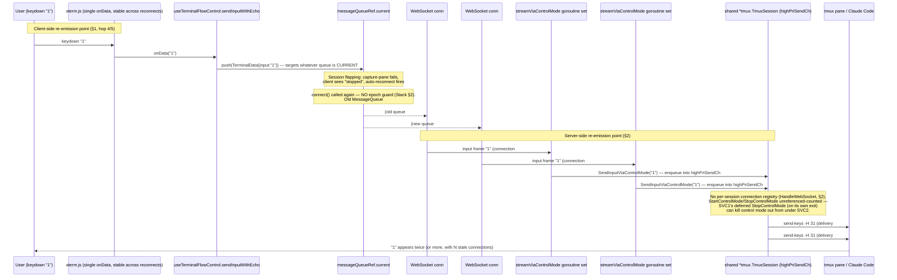

# Architecture Research: Phantom Repeated Keystroke Replay

Builds on `project_plans/phantom-keystroke-replay/research/stack.md` (client-side queue/epoch
findings, cited throughout as "Stack §N") and extends the two adjacent-research documents named
in requirements.md:
- `project_plans/tmux-session-robustness/research/synthesis.md` (flapping preconditions: `%exit`
  dead-lettered, PTY-EOF not propagated, health-checker double-start race, server bypassing
  `TmuxProcessManager`)
- `project_plans/terminal-robustness/research/architecture.md` (read-goroutine dispatch structure,
  resize quiescence)

Do not re-derive: Stack §2 already proved (a) `MessageQueue.close()` drains, not discards, its
pre-close backlog (`MessageQueue.ts:39-63`), and (b) `useTerminalStream.connect()` has no
epoch/generation guard (`useTerminalStream.ts:156-345`). This document (1) traces the full hop
chain to show exactly where those two client bugs intersect with a **new, previously
undocumented server-side gap** — unreferenced-counted `StartControlMode`/`StopControlMode` on a
per-session singleton — and (2) answers the three research questions with direct evidence.

---

## 1. Full hop-by-hop trace of one keystroke

| # | Hop | File:Line | Buffers/retries? | Can this hop run >1x for one physical keystroke during a concurrent reconnect? |
|---|---|---|---|---|
| 1 | xterm.js keydown → `terminal.onData` | `XtermTerminal.tsx:408-410` | No — one `onData` disposable, registered by a `useEffect` with deps `[scrollback]` only (`XtermTerminal.tsx:229,539`), *not* on connection state or `onData` identity (identity changes are absorbed by `onDataRef`, `XtermTerminal.tsx:115,118-121`). | **No.** The terminal instance and its single `onData` listener survive reconnects; ruled out as a duplication point. |
| 2 | `onDataRef.current` → `handleTerminalData` | `TerminalOutput.tsx:511-520` | No, single call, `useCallback` with stable deps `[sendInput, sendInputWithEcho, sspNegotiated]` | No — pure function call, no state. |
| 3 | `sendInputWithEcho(input)` | `useTerminalFlowControl.ts:366-401` | No retry; single `pushMessage(...)` call per invocation. Guarded by `if (!pushMessageRef.current \|\| !isConnectedRef.current) return BigInt(0);` (line 367) | No — but this guard is a **false-negative-safe, false-positive-unsafe** gate: it only stops *new* sends while disconnected; it does nothing about a message that already got past it and is now sitting in a queue (see hop 4). |
| 4 | `pushMessage` → `pushMessageRef.current(msg)` → `messageQueueRef.current?.push(msg)` | `useTerminalStream.ts:129-131` | **Always targets whatever `messageQueueRef.current` is at call time** — this ref is reassigned wholesale on every `connect()` (line 176), with no invalidation of the previous `MessageQueue` instance. | **Yes, indirectly.** If a keystroke is pushed into queue-generation N, then `connect()` runs again before generation N's stream tears down, generation N's `MessageQueue` is orphaned but *not closed* (`connect()` never calls `.close()` on the old queue — only `disconnect()` does, and `disconnect()` is not called by `connect()`). The orphaned queue keeps yielding its backlog to whichever consumer (ConnectRPC send loop) is still pulling from it. |
| 5 | `MessageQueue` async iterator → ConnectRPC `streamTerminal(queue)` send loop → WebSocket frame | `MessageQueue.ts:39-53`, `websocket-transport.ts` | Per Stack §2: `close()` does not drain `this.queue`; items pushed before `close()` are still yielded after. | **Yes.** A stale (never-closed) queue from an earlier `connect()` generation continues to drain its backlog onto its own still-open WebSocket connection, independent of whatever the *current* generation is doing. |
| 6 | Server `HandleWebSocket` → `streamTerminal` → `streamViaControlMode` read goroutine | `connectrpc_websocket.go:307-398`, `:857-924` | Single try-then-fallback per received WS frame (confirmed not self-duplicating, Stack §3 and §3 below) | **Not per-message**, but **yes per-connection**: nothing here recognizes "this is the second live connection for the same session" — see §2 below. |
| 7 | `instance.SendInputViaControlMode` → shared `highPriSendCh` → `runCMSender` → tmux `send-keys -H` | `session/tmux/control_mode.go:659-682`, `:453-528` | Fire-and-forget, enqueue-only (see §3) | **Not by itself** — but the channel (`highPriSendCh`) is a **singleton on the shared `*tmux.TmuxSession`** (§2), so two independent connections' read goroutines (hop 6) both writing into it deliver two independent `send-keys` invocations for what the user experiences as one keystroke. |

**Conclusion of the trace:** hops 1-3 are single-fire and ruled out. The re-emission mechanism is
the combination of hop 4/5 (client: a superseded `MessageQueue` from an earlier `connect()`
generation is never closed/invalidated, so its backlog still drains onto a still-live stale
WebSocket) and hop 6/7 (server: that stale connection is a fully independent, fully-functional
`streamViaControlMode` instance with its own read goroutine, sharing the same tmux control-mode
sender with any newer connection — nothing stops it from also delivering input).

---

## 2. Server-side: does a new read goroutine start while an old one is still alive?

**Yes — confirmed, and worse than a bare goroutine leak: it's an unreferenced-counted singleton
resource.**

`HandleWebSocket` (`connectrpc_websocket.go:307`) has **no per-session connection registry**. Every
WebSocket upgrade — including a reconnect while a previous connection for the same `sessionID` is
still being torn down — independently calls `h.streamTerminal(stream)` →
`h.streamViaControlMode(stream, instance, streamingMode)` (`:416-459`), which spins up its own
3-goroutine set (output-forwarder, resize-coalescer, WS-reader; `:665-1001`, matching Stack §3's
line references) scoped to *that connection's* `doneChan`/`errChan`. There is no lookup of
"is there already a live stream for this session" anywhere in `HandleWebSocket` or
`streamTerminal` (`:416-459`). This directly answers research question #2's first half: yes, two
overlapping `streamViaControlMode` invocations for the same session run concurrently whenever the
client opens a second connection before the first's goroutines have exited — which is exactly what
happens during flapping (client sees "stopped" and reconnects before the old socket read errors
out).

The consequence is worse than N independent read loops, because `StartControlMode` /
`StopControlMode` are **not scoped per-connection** — they operate on the single
`*tmux.TmuxSession` returned by `instance.GetTmuxSession()` (`instance_tmux.go:345-353`,
`tb.TmuxManager().Session()` — one persistent object per `Instance`, shared by every concurrent
caller):

- `StartControlMode()` (`control_mode.go:59-119`) is idempotent-looking but **not
  reference-counted**: `if t.controlModeCmd != nil { return nil }` (line 61-63). The second
  overlapping connection's call is a silent no-op that just reuses the first connection's already-
  running control-mode process and its single `t.highPriSendCh` (line 100) — there is no counter
  tracking "how many active streamers are using this."
- `StopControlMode()` (`:122-179`) is called via `defer` (`connectrpc_websocket.go:529-533`) the
  moment **that connection's own** goroutines finish — which can be triggered by a transient error
  on just *that* connection (e.g., the WS read erroring out during the exact "session not started
  or paused" flapping window described in the ticket). `StopControlMode` unconditionally nils
  `t.controlModeCmd`/`t.highPriSendCh` (`:149-150`) and kills the tmux `-C` process — **for every
  connection currently using it**, including a newer, healthy connection that thinks control mode
  is still running because its own `StartControlMode()` call earlier returned the "already
  started" no-op.
- Meanwhile, **both** connections' read goroutines (hop 6/7 above) can independently call
  `instance.SendInputViaControlMode(ctx, input.Data)` (`connectrpc_websocket.go:916`) against the
  same `t.highPriSendCh` for as long as both remain alive. `SendInputViaControlMode`
  (`control_mode.go:659-682`) is fire-and-forget — `select { case ch <- req: return nil; case
  <-ctx.Done(): return ctx.Err() }` (`:676-681`) — it enqueues and returns immediately without
  waiting for tmux's `%begin`/`%end` ack, so **a single call cannot itself double-send** (this
  confirms and extends Stack §3's finding "this fallback path itself does not loop or
  retry-duplicate" — true not just for the CM→subprocess fallback pair but for the CM path in
  isolation too). But **two independent calls from two independent connections**, each carrying
  the *same* physical keystroke because of the client-side leak in §1 hop 4/5, both succeed at
  enqueuing into the same channel — `runCMSender` (`:453-528`) then issues `send-keys -H` twice.

This is the missing half of research question #2 ("could the retry fire independently of the
original send, both eventually reaching tmux?"): the retry-via-subprocess fallback logged in the
ticket is *not* the duplication mechanism (a single input message never produces two sends from one
call site) — but **two live connections each independently receiving what was, client-side, the
same keystroke** absolutely is, because nothing server-side deduplicates input across concurrent
connections for one session, and the shared control-mode resource has no lifecycle scoping to tell
"connection A's exit" apart from "the last connection using this resource has exited."

---

## 3. Does the retry-via-subprocess fallback duplicate a single send?

No — confirmed by direct code reading, extending Stack §3's conclusion with the mechanism:

`connectrpc_websocket.go:915-923`:
```go
sendCtx, sendCancel := context.WithTimeout(context.Background(), 2*time.Second)
sendErr := instance.SendInputViaControlMode(sendCtx, input.Data)
sendCancel()
if sendErr != nil {
    log.Warn("[streamViaControlMode] CM input failed, retrying via subprocess", ...)
    if fbErr := sendInputToTmux(tmuxSessionName, input.Data); fbErr != nil { ... }
}
```
`SendInputViaControlMode` (`control_mode.go:659-682`) only returns a non-nil error in two cases,
neither of which leaves data in flight on the CM path:
1. `t.highPriSendCh == nil` → `ErrControlModeNotRunning`, returned before any channel send is
   attempted (control mode was never started or was already stopped — e.g., by the unreferenced
   `StopControlMode` race in §2). Nothing was enqueued; the fallback is the *only* delivery.
2. `ctx.Done()` fires inside the `select` at `:676-681` — this means the `ch <- req` case was
   **not** taken (Go `select` executes exactly one ready case; if the channel send had gone
   through, the function would already have returned `nil`). So the 2-second timeout firing means
   the send genuinely never reached the channel — again, the fallback is the sole delivery.

There is no path where the CM send succeeds (data enqueued, guaranteed to be forwarded by
`runCMSender`) and the function still returns an error causing a redundant fallback send. **Per
single input message, per single connection, delivery is exactly once.** This matches Stack §3's
note in the file/line reference table: "Go input-handling goroutine (single try, no
self-duplication)" (`connectrpc_websocket.go:856-924`).

---

## 4. Data-flow diagram of the two re-emission points



**Two independent, individually-sufficient-to-explain-the-symptom re-emission points, both
required to be closed:**

1. **Client (`useTerminalStream.ts`, Stack §2 + this doc §1 hop 4/5):** `connect()`'s guard
   (`isConnectedRef.current`) has a window (CONNECTING → first-message) during which a second
   `connect()` is not blocked; the old `MessageQueue`/`AbortController` pair is overwritten by ref,
   never closed/aborted, so its buffered backlog (which `close()` wouldn't drain even if called,
   per Stack §2) keeps draining onto a WebSocket the app no longer considers "the" connection.
2. **Server (`connectrpc_websocket.go` + `session/tmux/control_mode.go`, this doc §2, new):**
   `HandleWebSocket`/`streamTerminal` has no concept of "supersede the previous connection for this
   session" — two live `streamViaControlMode` instances run in parallel, each capable of forwarding
   input to the same shared, unreferenced-counted `TmuxSession` control-mode channel, and the
   older one's teardown can kill control mode under the newer one.

Either fix alone reduces exposure; requirements.md goal #2 ("reaches the agent/tmux pane at most
once ... even while reconnecting/flapping") is only guaranteed by fixing both: an epoch guard
client-side prevents the *stale queue from ever being created with live user input in the first
place* (new keystrokes are dropped/signaled per goal #3 instead of silently queuing), and a
connection-generation/refcount guard server-side prevents *any* leftover or duplicate connection
(including ones caused by future bugs, not just this one) from being able to double-deliver into
tmux or tear down control mode out from under a sibling connection. The plan phase should treat
these as two separate, additive changes rather than "pick one."

---

## 5. Cross-reference to prior research (as required)

- Synthesis.md's Gap 3 ("double PTY connection" pattern from concurrent `Start()` calls with no
  `startMu` serialization, `health.go:checkSingleSession()`) is the **same architectural shape** as
  the gap found here in §2 — unserialized/unreferenced-counted concurrent access to a singleton
  tmux resource — but on a different call path (input read-goroutine spawn via `HandleWebSocket`
  rather than health-checker-triggered `instance.Start()`). Any `startMu`-style per-instance mutex
  introduced for Phase 2a of that plan does **not** cover this path; a distinct guard (connection
  epoch/refcount on `TmuxSession.StartControlMode`/`StopControlMode`, or a per-session
  single-active-connection registry in `ConnectRPCWebSocketHandler`) is needed here.
- Terminal-robustness/architecture.md's description of the WS input dispatch loop
  (`GetInput()`/`GetResize()` around line 750-762 in that doc's numbering, confirmed here at
  `connectrpc_websocket.go:900-940` in the current file) is accurate and unchanged by this
  investigation — the dispatch itself is single-fire per message (§3 above); the new information is
  that the *goroutine set containing that loop* is not deduplicated across connections (§2).

---

## Sources

**Codebase files read in full or targeted ranges for this document:**
- `web-app/src/components/sessions/XtermTerminal.tsx` — lines 1-140 (onData/refs), 395-535
  (terminal creation effect + its `[scrollback]`-only dependency array), 542-591 (all other effects
  confirmed narrowly scoped)
- `web-app/src/components/sessions/TerminalOutput.tsx` — lines 490-520 (`handleTerminalData`),
  reconnect-effect grep hits (lines 78-916) confirming auto-reconnect-with-backoff calls `connect()`
  without any epoch/generation coordination
- `web-app/src/lib/hooks/useTerminalStream.ts` — full file (420 lines)
- `web-app/src/lib/hooks/useTerminalFlowControl.ts` — full file (542 lines)
- `web-app/src/lib/terminal/MessageQueue.ts` — full file (69 lines)
- `server/services/connectrpc_websocket.go` — lines 307-1015 (`HandleWebSocket`,
  `streamViaControlMode` in full: handshake, 3-goroutine spawn, input read loop)
- `session/tmux/control_mode.go` — lines 1-179 (`StartControlMode`/`StopControlMode` lifecycle),
  640-682 (`SendInputViaControlMode` fire-and-forget semantics)
- `session/instance_tmux.go` — lines 340-370 (`GetTmuxSession()` returns the persistent singleton
  `*tmux.TmuxSession` per `Instance`; `StartControlMode`/`StopControlMode` delegation)

**Prior research cited:**
- `project_plans/tmux-session-robustness/research/synthesis.md` (Gap 3, health-checker
  double-start race — same architectural shape, different call path)
- `project_plans/terminal-robustness/research/architecture.md` (WS input dispatch loop structure,
  confirmed unchanged)
- `project_plans/phantom-keystroke-replay/research/stack.md` (§2 client MessageQueue/epoch
  findings, §3 server single-try-no-self-duplication finding — both confirmed and extended here)
