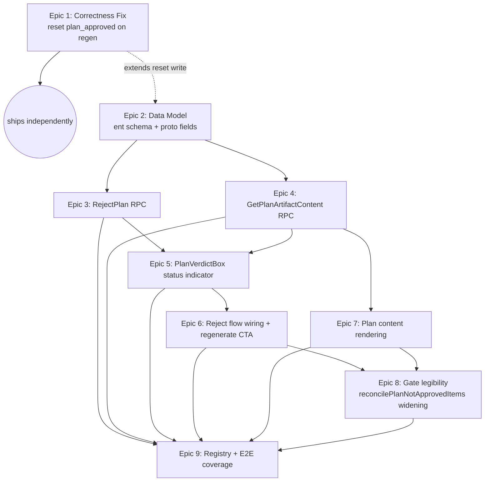

# Implementation Plan: Plan Approval UX

**Phase**: 3 — Plan | **Project**: `plan-approval-ux`
**Inputs**: `requirements.md`, `research/{stack,features,architecture,pitfalls,ux,build-vs-buy}.md`
**Related ADRs**: `decisions/ADR-001-plan-review-state-durable-fields.md`,
`decisions/ADR-002-reject-plan-manual-retrigger.md`

---

## 0. Creative Pass — Approach Selection

Three shapes were considered for this pass:

| Approach | Shape | Strength | Weakness |
|---|---|---|---|
| **A — Minimal** | Correctness fix + 4-state status chip + `RejectPlan` (persist-only). No content-view RPC — `PlanArtifactsSection` keeps showing only the path. | Smallest, lowest-risk surface; fixes the correctness bug and the "vanishing button" complaint immediately. | Fails requirements.md Must-Have #4 (in-app rendering of plan content) outright — under-delivers committed scope. |
| **B — Full** | Everything in this plan **plus** auto-retrigger inside `RejectPlan` (ADR-002's rejected alternative) **plus** heading/paragraph-anchored line-level comments (Success Criterion 5) in the same pass. | Fully satisfies every Success Criterion, including both "Should Have" items. | Bundles the highest-risk architecture decision (merging `RejectPlan` into `TriggerTriage`'s async/in-flight-guard machinery) with an entirely new anchor-comment subsystem in one review cycle — directly contradicts every research doc's convergent recommendation to cut line-comments first (ux.md §Recommendation 6, build-vs-buy.md §1, requirements.md's own "may land as a follow-up" hedge). |
| **C — Incremental (chosen)** | This plan: correctness fix + durable rejection-state fields (ADR-001) + `RejectPlan` (persist-only, ADR-002) + `GetPlanArtifactContent` + rendered plan content + 5-state status indicator + optimistic-concurrency token + registry/e2e coverage. Line-level comments explicitly deferred to a follow-up project. | Delivers all four Must-Haves and both Should-Haves (gate legibility via the `skipped` state; approval/rejection *visibility* via the durable reason field) within a bounded, independently-shippable task set. Matches every research document's own cut-line. | Solo reviewer still gives feedback as one free-text block, not anchored to a specific paragraph — acceptable per ux.md's own JTBD analysis (the emotional "confidence" job is served by visibility of state, not comment precision) and requirements.md's explicit "may land as a follow-up" allowance. |

**Chosen: Approach C.** Approaches A and B are recorded as rejected alternatives in the Pattern Decisions table below.

---

## 1. System Type

CRUD-adjacent feature with a small state machine (5-state plan-review status,
derived not stored) and one async feedback loop (`RejectPlan` → user-initiated
`TriggerTriage`). This is **Service Layer + Sum-type status**, not a heavy
Domain Model — no new aggregate root, no new bounded context. Confirmed by
architecture.md's Event-Command-Policy table: every new event
(`PlanRejected`, `ApprovalInvalidated`) is a straightforward field mutation on
the existing `BacklogItem` aggregate, not a new entity with its own lifecycle.

---

## 2. Domain Glossary

| Term | Definition | Becomes |
|---|---|---|
| `PlanReviewStatus` | The 5-state derived status: `no_plan`, `pending_review`, `approved`, `changes_requested`, `skipped`. Never persisted — computed from `planArtifactsPath`, `planApproved`, `planRejectionReason`, `skipPlanning`. | TS union type (`web-app/src/lib/backlog/planReviewStatus.ts`), mirrored as a Go type where the same derivation is needed server-side for MCP prompt injection (`session/backlog_review.go`, Task 5.3.1) |
| `derivePlanReviewStatus` | Pure function computing `PlanReviewStatus` from a `BacklogItem`-shaped input. Single source of truth — `PlanVerdictBox` and `ActionsSection` both call it rather than re-deriving. | `web-app/src/lib/backlog/planReviewStatus.ts` function |
| `PlanVerdictBox` | New React component rendering the persistent plan-review status card + reject-with-reason form + read-only historical variant, modeled 1:1 on `GateVerdictBox.tsx`. | `web-app/src/components/backlog/PlanVerdictBox.tsx` |
| `RejectPlan` | New RPC: `item_id` + `reason` (required) + optional `expected_modified_at_unix_ms`. Persists `plan_rejection_reason`/`plan_rejected_at`. Does not itself trigger regeneration (ADR-002). | `proto/session/v1/backlog.proto` message + `BacklogService.RejectPlan` |
| `GetPlanArtifactContent` | New RPC: `item_id` + `filename` (allowlisted). Reads plan artifact file content server-side, resolved against `item.PlanArtifactsPath`, never a client-supplied path. Returns `content`, `truncated`, `sizeBytes`, `modifiedAtUnixMs`. | `proto/session/v1/backlog.proto` message + `BacklogService.GetPlanArtifactContent` |
| `expected_modified_at_unix_ms` | Optimistic-concurrency token: the plan file's mtime at fetch time, echoed back on `ApprovePlan`/`RejectPlan`. `0` (unset) skips the check — backward compatible with existing callers. A mismatch returns `FailedPrecondition`. | New optional field on `ApprovePlanRequest`/`RejectPlanRequest` |
| `PlanRejectionReason` / `PlanRejectedAt` | New nullable fields on `BacklogItemData`/`BacklogItemUpdate`/ent schema. Cleared by `ApprovePlan`, by `TriggerTriage` completion, and by the existing backward-transition reset block. See ADR-001. | `session/ent/schema/backlog_item.go` fields, `session/repository.go` struct fields |
| Approval invalidation (correctness fix) | `TriggerTriage`'s async completion write must reset `plan_approved=false` when regenerating a plan — otherwise a stale approval survives content it never covered. | `server/services/backlog_service_triage.go` (~line 2081) |
| "Skipped" state | `PlanReviewStatus == "skipped"` when `item.skipPlanning === true`, checked with the highest precedence — distinct from `no_plan` (pitfalls.md §6). | Encoded in `derivePlanReviewStatus`'s precedence order |

12 glossary terms.

---

## 3. Pattern Decisions

| # | Decision | Alternative Rejected | Reason |
|---|---|---|---|
| P1 | Overall scope: Approach C (incremental — see §0) | Approach A (minimal, no content RPC); Approach B (full, incl. line-comments + auto-retrigger) | A under-delivers a Must-Have; B bundles the two highest-risk pieces (async-machinery merge, new comment subsystem) against every research doc's own recommendation to cut line-comments first. |
| P2 | Plan-review status: durable `plan_rejection_reason`/`plan_rejected_at` fields, 5-state status **derived**, not persisted as its own enum | (a) Reuse `BacklogStatusEvent` as a same-status pseudo-transition record; (b) replace `plan_approved` with a `plan_status` enum string | (a) breaks the `from_status != to_status` invariant every other status-event reader assumes and requires bypassing the transition FSM's `validTransitions` whitelist; (b) is a breaking change to `ApprovePlanRequest`'s existing bool-based gate contract at `backlog_service_triage.go:438,656`. See ADR-001. |
| P3 | `RejectPlan` persists state only; regeneration is a separate, explicit "Regenerate with This Feedback" button reusing existing `triggerTriage(id, reason)` | Auto-invoke `TriggerTriage` synchronously inside `RejectPlan` | Would duplicate or force a refactor of `TriggerTriage`'s in-flight-guard/orphan-tombstone/semaphore sequence (`backlog_service_triage.go:1864-1893`) — out of proportion to this feature; two-click flow is the accepted, documented cost. See ADR-2. |
| P4 | `GetPlanArtifactContent(item_id, filename)` as a **new** RPC, filename allowlisted server-side, resolved against `item.PlanArtifactsPath` | Extend `GetFileContentRequest` with an alternate `item_id`-based addressing mode | Keeps `GetFileContent`'s existing contract ("always a live session workspace") intact; avoids a second, mutually-exclusive addressing mode on one request message (architecture.md §4). |
| P5 | Optimistic concurrency via `expected_modified_at_unix_ms` (file mtime), optional/additive field on `ApprovePlanRequest`/`RejectPlanRequest`, default `0` = skip check | A content-hash (SHA-256) token | mtime is sufficient to detect "the file changed since you fetched it," is one `os.Stat` call (no full-content re-read needed to detect drift), and needs no new hashing dependency. A hash would only add value if two different edits could produce an identical mtime within the same millisecond — not a real risk for a solo, sequential-edit workflow. |
| P6 | Line-level/section-anchored feedback: **deferred entirely** to a follow-up project, not built even in reduced form this pass | Heading/paragraph-anchor comments (build-vs-buy.md's own "minimal" recommendation) | Requirements.md explicitly allows deferring Success Criterion 5 to a follow-up; every research doc converges on cutting this first if scope must shrink; the free-text `RejectPlan.reason` field already serves the emotional "confidence" JTBD ux.md identifies as primary. |
| P7 | Markdown rendering: reuse `react-markdown` + `remark-gfm` + `markdownBody.css`, no `rehype-raw` | Adding `rehype-raw` for richer formatting; switching to CodeMirror/Monaco for a line-gutter API | Zero new dependency, proven pattern one file away (`DescriptionSection.tsx`), and avoids reopening the XSS surface `rehype-raw` would introduce for AI-generated content that can transitively echo user input (pitfalls.md §4). |
| P8 | `reconcilePlanNotApprovedItems` scope: widen to also flag `ready`-status items with a stale unapproved plan (Should-Have gate legibility), NOT change gate enforcement itself | Leave `reconcilePlanNotApprovedItems` `queued`-only (do nothing) | Architecture.md confirms gate *enforcement* is already uniform (`backlog_service_triage.go:438,656`) — the real gap is *silence* for `ready`-status items that never queue. Widening detection (not enforcement) directly closes that gap without touching the two already-uniform gate-check call sites. |
| P9 | Preserve `plan-gate.spec.ts`'s existing button copy/testids exactly — no title-string changes on `backlog-action-spawn-session` | Update the button's `title` to mention "or reject the plan" | Any copy change breaks the existing exact-string assertion (pitfalls.md §3) for no functional gain — the new status indicator communicates rejection state elsewhere; the spawn-button tooltip's existing text ("Approve the plan or enable skip_planning to spawn a session") remains accurate as-is. |
| P10 | Backend size cap for `GetPlanArtifactContent`: reuse the existing package-private `maxFileSize`/`truncateSize` constants from `file_service.go` | Define new, separate constants | Both RPCs live in `server/services` package; the constants already encode the right policy (10MB hard cap, 1MB soft truncation) and plan docs are ordinary text files with no reason to need a different cap. |

---

## 4. Migration Plan

- **Schema**: two new nullable/optional columns on `backlog_item`
  (`plan_rejection_reason string`, `plan_rejected_at timestamp`, both
  `NULL`-able, no default required beyond ent's own zero-value handling).
  Purely additive — no backfill needed; every existing row reads as
  "no rejection recorded" (`""`/`nil`), which is correct for 100% of
  pre-existing items.
- **Codegen**: `go run -mod=mod entgo.io/ent/cmd/ent generate --feature sql/upsert ./session/ent/schema`
  (exact command from `session/ent/generate.go`) — commit all regenerated
  `session/ent/` files in the same commit as the schema edit.
  `--feature sql/upsert` omission is a **silent** break (compiles, breaks
  `UpsertRule`-shaped methods with no error) per
  `.claude/rules/ent-schema-generation.md` — non-negotiable.
- **Proto**: two new messages (`RejectPlanRequest/Response`,
  `GetPlanArtifactContentRequest/Response`), two new fields on
  `BacklogItem` (`plan_rejection_reason = 30`, `plan_rejected_at = 31`), one
  new optional field each on `ApprovePlanRequest`/new `RejectPlanRequest`
  (`expected_modified_at_unix_ms`). Run `make proto-gen` after every proto
  edit — regenerates `session/gen/session/v1/*.go` and
  `web-app/src/gen/session/v1/*_pb.ts`.
- **No data migration script needed** — SQLite/ent handles new nullable
  columns on existing tables automatically via ent's own migration path
  (`client.Schema.Create` at startup), consistent with how every prior
  additive field on this schema (`category`, `pipeline_mode`, etc.) shipped.
- **Backward compatibility checkpoint**: after Epic 2/3, run the existing
  `TestApprovePlan_*` suite unmodified — `ApprovePlanRequest{item_id}` (no
  new field set) must still succeed exactly as before, proving the additive
  field didn't change default behavior.

---

## 5. Observability Plan

- **Structured logs**: `RejectPlan` and `GetPlanArtifactContent` handlers log
  at the same level/format as `ApprovePlan` — no `log.InfoLog`/`ErrorLog`
  call sites exist in `ApprovePlan` today (it's a fast, low-risk metadata
  write), so neither new handler adds new logging by default; errors are
  surfaced as typed connect errors to the client instead (consistent with
  existing convention).
- **Existing correctness-fix telemetry**: the `TriggerTriage` async
  completion path already logs `persistFailures` via
  `notifyTriagePersistFailure` (`backlog_service_triage.go:~2100+`, not
  modified by this plan) — the new `plan_approved` reset write folds into
  the *same* `session.BacklogItemUpdate` call already wrapped by that
  failure-tracking logic, so a failure to reset approval on regeneration is
  automatically covered by the existing operator notification path with
  zero new code.
- **New signal**: the optimistic-concurrency mismatch path (`FailedPrecondition`
  on `ApprovePlan`/`RejectPlan` when `expected_modified_at_unix_ms` doesn't
  match) is a genuinely new failure mode — log it at `WarningLog` level in
  both handlers (`"[ApprovePlan] stale content token item=%s expected=%d actual=%d"`)
  so a future investigation into "why did my approve/reject fail" has a
  log line to grep for, matching the log-message convention already used by
  `reconcilePlanNotApprovedItems` (`session/backlog_lifecycle.go:2557`).
- **No new metrics/dashboards** — this feature has no throughput or latency
  characteristics that differ meaningfully from the existing `ApprovePlan`/
  `TriggerTriage` RPCs it extends; existing ConnectRPC-level request
  logging (if any middleware already captures it) covers it for free.

---

## 6. Risk Control

| Risk | Mitigation | Where addressed |
|---|---|---|
| Stale-tab approve/reject racing a background plan regeneration (pitfalls.md §1) | `expected_modified_at_unix_ms` optimistic-concurrency token, echoed from `GetPlanArtifactContent` back to `ApprovePlan`/`RejectPlan` | Epic 4 |
| `--feature sql/upsert` omitted during ent regen → silent `UpsertRule` breakage | Task 2.1.2 states the exact command verbatim; `make build && make test` run immediately after as a smoke check | Epic 2 |
| `plan-gate.spec.ts` breaks on copy changes | P9 — explicitly preserve existing button title/testid strings; new spec file is additive only | Epic 9 |
| XSS via future `rehype-raw` addition on AI-generated plan content | P7 — no `rehype-raw` added; `DescriptionSection.tsx`'s exact safe pattern reused | Epic 7 |
| Client-supplied path traversal on the new content-read RPC | Filename allowlist (`plan.md`, `requirements.md`, `validation.md`, `research/*.md`) + `resolveAndValidatePath`-style prefix check against server-resolved `item.PlanArtifactsPath`, never a client path | Epic 4 |
| Rejected-item reset fields left stale after a backward transition (idea/refining) or re-approval | Extend the existing reset block at `backlog_service_lifecycle.go:595-606` and the `TriggerTriage` completion write to also clear `plan_rejection_reason`/`plan_rejected_at` | Epic 2, Epic 3 |
| `PlanVerdictBox`/`ActionsSection` derive plan-review status independently and drift | Single `derivePlanReviewStatus` pure function, unit-tested, imported by both | Epic 5 |
| Feature registry / e2e coverage debt (`.claude/rules/feature-registry.md`) | Dedicated registry-file tasks per new RPC/component; `make registry-generate` run and `coverage-gaps.json` diff checked as the final task | Epic 9 |
| Large `plan.md` blows up render time / memory | Reuse existing `maxFileSize`/`truncateSize` caps (10MB hard / 1MB soft-truncate) already proven in `file_service.go` | Epic 4 |

---

## 7. Unresolved Questions (explicitly deferred, not overlooked)

1. **Multi-entry rejection history** (Should-Have: "approval/rejection history
   visible in the item's timeline") is served only as *most-recent-reason
   visibility* in this pass (ADR-001) — a full append-only history table
   (mirroring `BacklogProgressNote`) is deferred to a follow-up if a solo
   developer's own "why did this change three times" need (ux.md §5) proves
   to matter in practice.
2. **Line-level/section-anchored feedback** (Success Criterion 5) — deferred
   entirely to a follow-up project, per P6. Not designed in any form here
   beyond noting build-vs-buy.md's recommended shape (heading/paragraph
   anchor keys via a remark AST visitor) for whoever picks it up next.
3. **Live push-based staleness detection** ("a newer plan is available")
   uses a poll/re-fetch-on-`item.updatedAt`-change strategy in this pass, not
   a dedicated event-bus push (pitfalls.md §1 flags both as viable) — revisit
   if the poll cadence proves too slow in practice once `useWatchBacklogItems`-style
   live updates are confirmed to fire promptly enough on `plan_artifacts_path`
   changes specifically.
4. **Should `reconcilePlanNotApprovedItems`'s widening (P8) also apply
   staleness to `skip_review_gate`-bypassed items?** Out of scope — that flag
   gates a different (review) gate entirely, not the plan gate; confirmed
   not conflated per pitfalls.md §6, but worth a follow-up sanity check once
   this ships.

---

## 8. Dependency Visualization



Epic 1 has no dependency on anything else and should ship first (smallest,
highest-value, zero schema change). Epics 2→3/4→5→6/7→8→9 form the critical
path for the rest of the feature.

---

## 9. Epics, Stories, Tasks

Every task lists exact file paths and stays within 3-5 files / ~2-5 minutes
of focused work.

### Epic 1 — Correctness Fix: Reset Plan Approval on Regeneration

**Independent, ships first.** No schema change required.

#### Story 1.1 — `TriggerTriage` clears a stale approval when it regenerates a plan

**Acceptance criterion** (requirements.md's Open Question, resolved): *An
already-approved plan must not silently stay "approved" after its content
changes underneath it.*

> **Given** a backlog item with `plan_approved=true` and a completed plan at
> `plan.md`,
> **when** the user calls `TriggerTriage(item_id, feedback: "add caching")`
> and it completes successfully,
> **then** `item.planApproved` is `false` afterward, and the spawn gate
> (`!item.PlanApproved`) blocks a session spawn until the regenerated plan is
> re-reviewed.

- **Task 1.1.1** (2 min, 1 file: `server/services/backlog_service_triage.go`)
  In the async completion block (~line 2080-2086), change:
  ```go
  pap := artifactAbsPath
  update := session.BacklogItemUpdate{PlanArtifactsPath: &pap}
  ```
  to also reset approval:
  ```go
  pap := artifactAbsPath
  approvalReset := false
  update := session.BacklogItemUpdate{PlanArtifactsPath: &pap, PlanApproved: &approvalReset}
  ```
  Mirrors the existing `PlanApprovedAt`-left-stale convention already used at
  `backlog_service_lifecycle.go:595-601` (only `PlanApproved` is reset there
  too) — do not add a `PlanApprovedAt` reset here for consistency.

- **Task 1.1.2** (4 min, 1 file: `server/services/backlog_service_test.go`)
  Add `TestTriggerTriage_RefineWithFeedback_ResetsPlanApproved`: create an
  item, approve its plan (`ApprovePlan`), call `TriggerTriage` with
  non-empty feedback against a seeded prior triage result, poll until the
  async goroutine completes (reuse whatever polling helper the existing
  `TestTriggerTriage_RefineWithFeedback` test already uses), assert
  `item.PlanApproved == false`.

- **Task 1.1.3** (2 min, 1 file: `docs/registry/features/backend/backlog/trigger-triage.json`)
  Update `lastModified` to today's date and append the new test's function
  name to `testIds`, per `.claude/rules/feature-registry.md`'s "Modified RPC"
  step.

---

### Epic 2 — Data Model: Plan Rejection State

Depends on: nothing (can start immediately, in parallel with Epic 1).

#### Story 2.1 — ent schema fields

- **Task 2.1.1** (3 min, 1 file: `session/ent/schema/backlog_item.go`)
  After the `plan_artifacts_path` field (~line 67-68), add:
  ```go
  field.String("plan_rejection_reason").
      Optional().
      Comment("Free-text reason from the most recent RejectPlan call. Cleared on ApprovePlan, on the next TriggerTriage completion, and on backward transition to idea/refining. See ADR-001."),
  field.Time("plan_rejected_at").
      Optional().
      Nillable(),
  ```

- **Task 2.1.2** (3 min, codegen — no hand-edited files)
  Run the exact command from `session/ent/generate.go`:
  ```
  go run -mod=mod entgo.io/ent/cmd/ent generate --feature sql/upsert ./session/ent/schema
  ```
  then `go build ./...`. Commit every changed file under `session/ent/`
  together with Task 2.1.1's schema edit in the same commit.

#### Story 2.2 — Domain struct + partial-update struct + repository mapping

- **Task 2.2.1** (3 min, 1 file: `session/repository.go`)
  Add to `BacklogItemData` (after `PlanArtifactsPath`, ~line 394):
  ```go
  PlanRejectionReason string
  PlanRejectedAt      *time.Time
  ```
  Add to `BacklogItemUpdate` (after `PlanArtifactsPath`, ~line 522):
  ```go
  PlanRejectionReason *string
  PlanRejectedAt      *time.Time
  ```

- **Task 2.2.2** (4 min, 1 file: `session/ent_repository_backlog.go`)
  Three edits in this one file:
  1. `backlogItemToData` (read path, ~line 190): add
     `PlanRejectionReason: item.PlanRejectionReason, PlanRejectedAt: item.PlanRejectedAt,`
     after the `PlanArtifactsPath` line.
  2. `CreateBacklogItem` builder chain (~line 289): add
     `.SetNillablePlanRejectionReason(&data.PlanRejectionReason).SetNillablePlanRejectedAt(data.PlanRejectedAt)`
     after `.SetNillablePlanArtifactsPath(...)`.
  3. `UpdateBacklogItem`'s partial-update block (~line 605-607): add
     ```go
     if update.PlanRejectionReason != nil {
         u.SetPlanRejectionReason(*update.PlanRejectionReason)
     }
     if update.PlanRejectedAt != nil {
         u.SetPlanRejectedAt(*update.PlanRejectedAt)
     }
     ```

- **Task 2.2.3** (2 min, 1 file: `session/ent_repository_backlog.go`)
  Add to `updatedFieldsFromBacklogItemUpdate` (~line 708, after the
  `planArtifactsPath` block):
  ```go
  if update.PlanRejectionReason != nil {
      fields = append(fields, "planRejectionReason")
  }
  if update.PlanRejectedAt != nil {
      fields = append(fields, "planRejectedAt")
  }
  ```

#### Story 2.3 — Extend the existing backward-transition reset block

**Acceptance criterion**: *Sending an item back to Idea/Refining must not
leave a stale rejection reason behind once it's re-triaged and re-approved.*

> **Given** an item in `changes_requested` state (non-empty
> `plan_rejection_reason`),
> **when** the user clicks "↩ Return to Triage" (`send_back_idea` →
> `TransitionBacklogItemStatus(idea)`),
> **then** `plan_rejection_reason` is cleared to `""` in the same update that
> already clears `plan_approved`/`plan_artifacts_path`.

- **Task 2.3.1** (3 min, 1 file: `server/services/backlog_service_lifecycle.go`)
  Extend the reset block at lines 595-606:
  ```go
  if to == session.BacklogStatusIdea || to == session.BacklogStatusRefining {
      planApproved := false
      planArtifactsPath := ""
      rejectionReason := ""
      if upd, resetErr := s.storage.UpdateBacklogItem(ctx, req.Msg.ItemId, session.BacklogItemUpdate{
          PlanApproved:        &planApproved,
          PlanArtifactsPath:   &planArtifactsPath,
          PlanRejectionReason: &rejectionReason,
      }, nil); resetErr != nil {
  ```

- **Task 2.3.2** (4 min, 1 file: `server/services/backlog_service_test.go`)
  Add `TestTransitionBacklogItemStatus_SendBackToIdea_ClearsRejectionReason`:
  reject a plan, transition to `idea`, assert `plan_rejection_reason == ""`.

---

### Epic 3 — Backend RPC: `RejectPlan`

Depends on: Epic 2 (schema fields must exist).

#### Story 3.1 — Proto + handler

**Acceptance criterion** (requirements.md Success Criterion 3): *A user can
decline a plan and supply free-text feedback that is durably recorded.*

> **Given** a `ready`-status item with `plan_artifacts_path` set and
> `plan_approved=false`,
> **when** the user calls `RejectPlan(item_id, reason: "missing caching plan")`,
> **then** the RPC returns the updated item with
> `planRejectionReason == "missing caching plan"` and a non-nil
> `planRejectedAt`, and `PlanReviewStatus` derives to `changes_requested`.

- **Task 3.1.1** (3 min, 1 file: `proto/session/v1/backlog.proto`)
  Add after `ApprovePlanResponse` (~line 448):
  ```protobuf
  message RejectPlanRequest {
    string item_id = 1;
    // reason is required free-text feedback explaining what should change,
    // mirroring TriggerTriageRequest.feedback's refinement-input pattern.
    // RejectPlan does not itself trigger regeneration — see ADR-002.
    string reason = 2;
    // expected_modified_at_unix_ms, if non-zero, must match the plan.md
    // file's on-disk mtime at call time (echoed from
    // GetPlanArtifactContentResponse.modified_at_unix_ms) or the call fails
    // with FailedPrecondition — guards against rejecting content the user
    // never actually saw (a regeneration raced their open tab).
    int64 expected_modified_at_unix_ms = 3;
  }
  message RejectPlanResponse {
    BacklogItem item = 1;
  }
  ```
  Also add the same `expected_modified_at_unix_ms` field to
  `ApprovePlanRequest` (field 2), and register the RPC:
  `rpc RejectPlan(RejectPlanRequest) returns (RejectPlanResponse) {}`
  alongside `rpc ApprovePlan(...)`.

- **Task 3.1.2** (2 min, terminal) Run `make proto-gen`.

- **Task 3.1.3** (5 min, 1 file: `server/services/backlog_service_lifecycle.go`)
  Add `RejectPlan` handler after `ApprovePlan` (~line 657), mirroring its
  exact structure:
  ```go
  // RejectPlan records a rejection reason for the item's current plan
  // artifacts. Does not itself trigger regeneration — see ADR-002
  // (project_plans/plan-approval-ux/decisions/ADR-002-...).
  // +api: backlog:reject-plan
  func (s *BacklogService) RejectPlan(
      ctx context.Context,
      req *connect.Request[sessionv1.RejectPlanRequest],
  ) (*connect.Response[sessionv1.RejectPlanResponse], error) {
      if s.storage == nil {
          return nil, connect.NewError(connect.CodeUnavailable, fmt.Errorf("storage not available"))
      }
      reason := strings.TrimSpace(req.Msg.Reason)
      if reason == "" {
          return nil, connect.NewError(connect.CodeInvalidArgument, fmt.Errorf("reason is required"))
      }
      item, err := s.storage.GetBacklogItem(ctx, req.Msg.ItemId)
      if err != nil {
          if ent.IsNotFound(err) {
              return nil, connect.NewError(connect.CodeNotFound, fmt.Errorf("backlog item %q not found", req.Msg.ItemId))
          }
          return nil, connect.NewError(connect.CodeInternal, fmt.Errorf("failed to get backlog item: %w", err))
      }
      if item.PlanArtifactsPath == "" {
          return nil, connect.NewError(connect.CodeFailedPrecondition,
              fmt.Errorf("no plan artifacts found — run TriggerTriage first"))
      }
      if mismatchErr := checkPlanArtifactFreshness(item.PlanArtifactsPath, req.Msg.ExpectedModifiedAtUnixMs); mismatchErr != nil {
          log.WarningLog.Printf("[RejectPlan] stale content token item=%s", req.Msg.ItemId)
          return nil, mismatchErr
      }
      now := time.Now()
      update := session.BacklogItemUpdate{
          PlanRejectionReason: &reason,
          PlanRejectedAt:      &now,
      }
      updated, err := s.storage.UpdateBacklogItem(ctx, req.Msg.ItemId, update, nil)
      if err != nil {
          return nil, connect.NewError(connect.CodeInternal, fmt.Errorf("failed to reject plan: %w", err))
      }
      return connect.NewResponse(&sessionv1.RejectPlanResponse{
          Item: backlogItemToProto(updated, s.buildCostLookup()),
      }), nil
  }
  ```
  `checkPlanArtifactFreshness` is defined by this story's own Task 3.1.3b
  below (not Epic 4) — `RejectPlan`/`ApprovePlan` are its only two
  consumers, so it lives with them; Epic 4 does not need to exist first.

- **Task 3.1.3b** (3 min, 1 file: `server/services/backlog_service_lifecycle.go`)
  Add `"path/filepath"` to this file's import block (not currently imported
  — `os`/`strings`/`time`/`fmt`/`connect`/`ent`/`log` already are) and the
  shared freshness-check helper both `RejectPlan` (Task 3.1.3) and
  `ApprovePlan` (Task 3.1.4) call:
  ```go
  // checkPlanArtifactFreshness returns a FailedPrecondition connect error if
  // expectedModifiedAtUnixMs is non-zero and doesn't match plan.md's current
  // on-disk mtime. 0 means "no check requested" — always passes, preserving
  // backward compatibility with callers that don't send the token. The
  // mtime itself is produced by Epic 4's GetPlanArtifactContent RPC and
  // round-tripped through the frontend; this helper has no code dependency
  // on Epic 4, only a data dependency (the token's origin).
  func checkPlanArtifactFreshness(artifactsPath string, expectedModifiedAtUnixMs int64) error {
      if expectedModifiedAtUnixMs == 0 {
          return nil
      }
      info, statErr := os.Stat(filepath.Join(artifactsPath, "plan.md"))
      if statErr != nil {
          return nil // missing plan.md is handled by the caller's own precondition check
      }
      if info.ModTime().UnixMilli() != expectedModifiedAtUnixMs {
          return connect.NewError(connect.CodeFailedPrecondition,
              fmt.Errorf("plan changed since you loaded it — reload and try again"))
      }
      return nil
  }
  ```

- **Task 3.1.4** (3 min, 1 file: `server/services/backlog_service_lifecycle.go`)
  Extend `ApprovePlan` (the existing handler, ~line 617-657) to also clear
  `PlanRejectionReason` on success — approving a plan should end any pending
  "changes requested" state:
  ```go
  now := time.Now()
  approved := true
  clearedReason := ""
  update := session.BacklogItemUpdate{
      PlanApproved:        &approved,
      PlanApprovedAt:      &now,
      PlanRejectionReason: &clearedReason,
  }
  ```
  Also add the `expected_modified_at_unix_ms` freshness check here (same
  `checkPlanArtifactFreshness` call as `RejectPlan`).

- **Task 3.1.5** (5 min, 1 file: `server/services/backlog_service_test.go`)
  Add `TestRejectPlan_HappyPath_SetsReasonAndTimestamp`,
  `TestRejectPlan_EmptyReason_ReturnsInvalidArgument`,
  `TestRejectPlan_MissingPlanArtifactsPath_ReturnsFailedPrecondition`
  (mirrors `TestApprovePlan_*`'s existing three-test shape).

- **Task 3.1.6** (3 min, 1 file: `server/services/backlog_service_test.go`)
  Add `TestApprovePlan_ClearsExistingRejectionReason`: reject a plan, then
  approve it, assert `plan_rejection_reason == ""`.

---

### Epic 4 — Backend RPC: `GetPlanArtifactContent`

Depends on: Epic 2 (for the `expected_modified_at_unix_ms` pairing to be
meaningful on Approve/Reject, though this RPC itself has no schema
dependency — can run in parallel with Epic 3).

#### Story 4.1 — Proto + handler

**Acceptance criterion** (requirements.md Success Criterion 4): *Plan content
renders as formatted content in the UI, not just a path.*

> **Given** an item with `plan_artifacts_path` pointing at a directory
> containing `plan.md`,
> **when** the frontend calls
> `GetPlanArtifactContent(item_id, filename: "plan.md")`,
> **then** the response contains the file's markdown text, its size, and its
> on-disk mtime as `modified_at_unix_ms`.

- **Task 4.1.1** (4 min, 1 file: `proto/session/v1/backlog.proto`)
  Add after the new `RejectPlanResponse`:
  ```protobuf
  message GetPlanArtifactContentRequest {
    string item_id = 1;
    // filename relative to the item's plan-artifacts directory, e.g.
    // "plan.md", "requirements.md", "validation.md", "research/stack.md".
    // Server-validated against an allowlist — never resolved as an
    // arbitrary client-supplied path.
    string filename = 2;
  }
  message GetPlanArtifactContentResponse {
    string content = 1;
    bool truncated = 2;
    int64 size_bytes = 3;
    // modified_at_unix_ms is the artifact file's on-disk mtime at fetch
    // time — echo this back as ApprovePlanRequest/RejectPlanRequest's
    // expected_modified_at_unix_ms to guard against a stale rendered plan
    // racing a concurrent regeneration.
    int64 modified_at_unix_ms = 4;
  }
  ```
  Register `rpc GetPlanArtifactContent(GetPlanArtifactContentRequest) returns (GetPlanArtifactContentResponse) {}`.

- **Task 4.1.2** (2 min, terminal) Run `make proto-gen`.

#### Story 4.2 — Handler with path-safety + freshness-check helper

- **Task 4.2.1** (5 min, 1 file: `server/services/backlog_service_lifecycle.go`)
  Add `allowedPlanArtifactFilenames` allowlist check and the handler:
  ```go
  // isAllowedPlanArtifactFilename restricts GetPlanArtifactContent to the
  // known SDD artifact set — never an arbitrary client-supplied path, even
  // after traversal-cleaning. Mirrors the defense-in-depth pitfalls.md §5
  // calls for beyond resolveAndValidatePath's prefix check alone.
  func isAllowedPlanArtifactFilename(filename string) bool {
      switch filename {
      case "plan.md", "requirements.md", "validation.md":
          return true
      }
      return strings.HasPrefix(filename, "research/") && strings.HasSuffix(filename, ".md") &&
          !strings.Contains(filename, "..")
  }

  // +api: backlog:get-plan-artifact-content
  func (s *BacklogService) GetPlanArtifactContent(
      ctx context.Context,
      req *connect.Request[sessionv1.GetPlanArtifactContentRequest],
  ) (*connect.Response[sessionv1.GetPlanArtifactContentResponse], error) {
      if s.storage == nil {
          return nil, connect.NewError(connect.CodeUnavailable, fmt.Errorf("storage not available"))
      }
      if !isAllowedPlanArtifactFilename(req.Msg.Filename) {
          return nil, connect.NewError(connect.CodeInvalidArgument, fmt.Errorf("unsupported plan artifact filename %q", req.Msg.Filename))
      }
      item, err := s.storage.GetBacklogItem(ctx, req.Msg.ItemId)
      if err != nil {
          if ent.IsNotFound(err) {
              return nil, connect.NewError(connect.CodeNotFound, fmt.Errorf("backlog item %q not found", req.Msg.ItemId))
          }
          return nil, connect.NewError(connect.CodeInternal, fmt.Errorf("failed to get backlog item: %w", err))
      }
      if item.PlanArtifactsPath == "" {
          return nil, connect.NewError(connect.CodeFailedPrecondition, fmt.Errorf("no plan artifacts found for this item"))
      }
      fullPath, pathErr := resolveAndValidatePath(item.PlanArtifactsPath, req.Msg.Filename)
      if pathErr != nil {
          return nil, pathErr
      }
      info, statErr := os.Lstat(fullPath)
      if statErr != nil {
          if os.IsNotExist(statErr) {
              return nil, connect.NewError(connect.CodeNotFound, fmt.Errorf("plan artifact %q not found — it may have been moved or deleted", req.Msg.Filename))
          }
          return nil, connect.NewError(connect.CodeInternal, fmt.Errorf("failed to stat plan artifact: %w", statErr))
      }
      if info.IsDir() {
          return nil, connect.NewError(connect.CodeInvalidArgument, fmt.Errorf("%q is a directory", req.Msg.Filename))
      }
      if info.Size() > maxFileSize {
          return nil, connect.NewError(connect.CodeFailedPrecondition, fmt.Errorf("plan artifact too large (%d bytes)", info.Size()))
      }
      readLimit := info.Size()
      truncated := false
      if info.Size() > truncateSize {
          readLimit = truncateSize
          truncated = true
      }
      f, openErr := os.Open(fullPath)
      if openErr != nil {
          return nil, connect.NewError(connect.CodeInternal, fmt.Errorf("failed to open plan artifact: %w", openErr))
      }
      defer func() { _ = f.Close() }()
      buf := make([]byte, readLimit)
      n, readErr := readFull(f, buf)
      if readErr != nil && n == 0 {
          return nil, connect.NewError(connect.CodeInternal, fmt.Errorf("failed to read plan artifact content"))
      }
      return connect.NewResponse(&sessionv1.GetPlanArtifactContentResponse{
          Content:          string(buf[:n]),
          Truncated:        truncated,
          SizeBytes:        info.Size(),
          ModifiedAtUnixMs: info.ModTime().UnixMilli(),
      }), nil
  }
  ```
  Reuses `resolveAndValidatePath` and `readFull` — both already defined in
  `server/services/file_service.go`, same package.

- **Task 4.2.2** (5 min, 1 file: `server/services/backlog_service_test.go`)
  Add `TestGetPlanArtifactContent_HappyPath_ReturnsContentAndMtime`,
  `TestGetPlanArtifactContent_DisallowedFilename_ReturnsInvalidArgument`,
  `TestGetPlanArtifactContent_TraversalAttempt_ReturnsInvalidArgument`
  (e.g. `filename: "../../../etc/passwd"`),
  `TestGetPlanArtifactContent_MissingFile_ReturnsNotFound`.

- **Task 4.2.3** (3 min, 1 file: `server/services/backlog_service_test.go`)
  Add `TestApprovePlan_StaleContentToken_ReturnsFailedPrecondition` and
  `TestRejectPlan_StaleContentToken_ReturnsFailedPrecondition` — these
  exercise `checkPlanArtifactFreshness` (Task 3.1.3b) via both handlers now
  that `GetPlanArtifactContent`'s `modified_at_unix_ms` (this epic) is the
  value a real client would echo back.

---

### Epic 5 — Frontend: Plan Review Status Indicator (`PlanVerdictBox`)

Depends on: Epic 3 (needs `rejectPlan` RPC to exist for the write-mode
props), Epic 4 (needs `expected_modified_at_unix_ms` plumbing).

#### Story 5.1 — Status derivation

**Acceptance criterion** (requirements.md Success Criterion 1): *An
unambiguous, persistent indicator distinguishes no-plan / pending-review /
approved / changes-requested (and skipped).*

> **Given** an item with `skipPlanning=true` and no plan artifacts,
> **when** `derivePlanReviewStatus(item)` is called,
> **then** it returns `"skipped"`, not `"no_plan"` — because skip-planning
> means "no plan ever required," a different meaning than "no plan yet."

- **Task 5.1.1** (4 min, 1 file: `web-app/src/lib/backlog/planReviewStatus.ts`, new file)
  ```ts
  import type { BacklogItem } from "@/lib/hooks/useBacklogService";

  export type PlanReviewStatus =
    | "no_plan"
    | "pending_review"
    | "approved"
    | "changes_requested"
    | "skipped";

  /**
   * Single source of truth for the 5-state plan-review status — never
   * persisted server-side, always derived. See ADR-001
   * (project_plans/plan-approval-ux/decisions/).
   */
  export function derivePlanReviewStatus(
    item: Pick<BacklogItem, "skipPlanning" | "planApproved" | "planArtifactsPath" | "planRejectionReason">,
  ): PlanReviewStatus {
    if (item.skipPlanning) return "skipped";
    if (item.planRejectionReason) return "changes_requested";
    if (item.planApproved) return "approved";
    if (item.planArtifactsPath) return "pending_review";
    return "no_plan";
  }
  ```

- **Task 5.1.2** (3 min, 1 file: `web-app/src/lib/backlog/planReviewStatus.test.ts`, new file)
  Unit tests, one per branch: `skipped` wins over everything, `changes_requested`
  wins over `approved` (a stale-true `planApproved` alongside a non-empty
  reason — shouldn't happen post Task 3.1.4, but the derivation must still
  be correct defensively), `pending_review`, `no_plan`.

- **Task 5.1.3** (2 min, 1 file: `web-app/src/lib/hooks/useBacklogService.ts`)
  Add `planRejectionReason?: string;` and `planRejectedAt?: string;` to the
  `BacklogItem` interface (~line 106-107, alongside `planApproved`/
  `planArtifactsPath`), and map them in `mapBacklogItem` (~line 436-437):
  ```ts
  planRejectionReason: p.planRejectionReason || undefined,
  planRejectedAt: p.planRejectedAt ? new Date(Number(p.planRejectedAt.seconds) * 1000).toISOString() : undefined,
  ```

#### Story 5.2 — `PlanVerdictBox` component

- **Task 5.2.1** (5 min, 1 file: `web-app/src/components/backlog/PlanVerdictBox.css.ts`, new file)
  5 card-color variants reusing `vars.*` tokens, modeled 1:1 on
  `GateVerdictBox.css.ts`'s PASS/PARTIAL/FAIL/PENDING/UNVERIFIABLE pattern:
  `approved` → pass-green, `pending_review` → pending-blue,
  `changes_requested` → partial-orange, `no_plan` → unverifiable-grey, plus
  one new neutral variant for `skipped` (distinct border/icon color, not
  reused from any existing GateVerdictBox variant since "intentionally
  bypassed" is semantically distinct from all 5 existing verdict meanings).

- **Task 5.2.2** (5 min, 1 file: `web-app/src/components/backlog/PlanVerdictBox.tsx`, new file)
  Read-only card rendering (icon + text label per state, never color-only —
  `.claude` a11y convention from `BlockerChip.tsx:16-18`):
  ```tsx
  const STATUS_CONFIG: Record<PlanReviewStatus, { icon: string; label: string }> = {
    no_plan: { icon: "○", label: "No plan yet" },
    pending_review: { icon: "◌", label: "Pending review" },
    approved: { icon: "✓", label: "Plan approved" },
    changes_requested: { icon: "✎", label: "Changes requested" },
    skipped: { icon: "⊘", label: "Planning skipped" },
  };
  ```
  `role="status" aria-live="polite" aria-atomic="true"` on the section root,
  matching `GateVerdictBox.tsx:253-257`. Props interface takes `status:
  PlanReviewStatus`, `rejectionReason?: string`, `readOnly?: boolean`,
  `onReject?: (reason: string) => Promise<void>`,
  `onRegenerateWithFeedback?: () => Promise<void>`, `actionPending?: boolean`.
  No approve action here — `ActionsSection` keeps that button (avoid
  duplicating the same action in two places).

- **Task 5.2.3** (5 min, 1 file: `web-app/src/components/backlog/PlanVerdictBox.tsx`)
  Add the "Request Changes" form: a `<button>` toggling a `<textarea>`
  (mirroring `GateVerdictBox.tsx:378-414`'s reopen-form shape exactly —
  focus-on-open via `useEffect`, Cancel/Submit, `aria-disabled` + `disabled`
  on Submit while the trimmed value is empty, matching the
  `manual-review-summary` guard convention (`ActionsSection.tsx:302`)).
  `data-testid="backlog-action-reject-plan"` on the toggle button,
  `data-testid="plan-reject-reason"` on the textarea,
  `data-testid="backlog-action-reject-plan-submit"` on submit.

- **Task 5.2.4** (3 min, 1 file: `web-app/src/components/backlog/PlanVerdictBox.tsx`)
  When `status === "changes_requested"`, render the persisted reason text
  (read-only, below the card) plus the "Regenerate Plan with This Feedback"
  button (`data-testid="backlog-action-regenerate-plan"`) calling
  `onRegenerateWithFeedback` — per ADR-002, this is a visibly distinct
  second action, not a side effect of the reject submit.

- **Task 5.2.5** (5 min, 1 file: `web-app/src/components/backlog/PlanVerdictBox.test.tsx`, new file)
  RTL tests: renders correct icon+label per status (5 cases), reject
  submit disabled until non-empty text, "Regenerate" button only appears in
  `changes_requested` state, `role="status" aria-live="polite"` present.

---

### Epic 6 — Frontend: Reject Flow Wiring

Depends on: Epic 5.

#### Story 6.1 — Wire `PlanVerdictBox` into `BacklogItemDetail`

**Acceptance criterion** (requirements.md Success Criterion 1 + 3 combined):
*The status indicator and reject action are reachable without a vanishing
button.*

> **Given** a `ready`-status item with a pending-review plan,
> **when** the item detail view renders,
> **then** a persistent `PlanVerdictBox` card reading "Pending review" is
> visible above the Actions panel, and clicking "Request Changes" → typing a
> reason → Submit calls `rejectPlan(item.id, reason)` and the card updates to
> "Changes requested" with the reason visible and a "Regenerate Plan with
> This Feedback" button.

- **Task 6.1.1** (3 min, 1 file: `web-app/src/lib/hooks/useBacklogService.ts`)
  Add `rejectPlan` mirroring `approvePlan` (~after line 781):
  ```ts
  const rejectPlan = useCallback(async (id: string, reason: string, expectedModifiedAtUnixMs?: bigint): Promise<BacklogItem | null> => {
    if (!clientRef.current) return null;
    try {
      const resp = await clientRef.current.rejectPlan({ itemId: id, reason, expectedModifiedAtUnixMs: expectedModifiedAtUnixMs ?? 0n });
      return resp.item ? mapBacklogItem(resp.item) : null;
    } catch (err) {
      console.error("[useBacklogService] rejectPlan:", err);
      setLastError(err instanceof Error ? err : new Error(String(err)));
      throw err;
    }
  }, []);
  ```
  Export it from the hook's returned object alongside `approvePlan`.

- **Task 6.1.2** (4 min, 1 file: `web-app/src/components/backlog/BacklogItemDetail.tsx`)
  Add `handleRejectPlan` and `handleRegeneratePlanWithFeedback` callbacks
  near `handleGateReopen` (~line 805):
  ```ts
  const handleRejectPlan = useCallback(async (reason: string) => {
    if (!item) return;
    const toastKey = `${item.id}:reject_plan`;
    setActionLoading("reject_plan");
    try {
      await rejectPlan(item.id, reason);
      showActionToast("Changes requested.", "success", toastKey);
      await load();
    } catch (e) {
      showActionToast(e instanceof Error ? e.message : "Reject failed.", "error", toastKey);
      throw e;
    } finally {
      if (mountedRef.current) setActionLoading(null);
    }
  }, [item, rejectPlan, load, showActionToast]);

  const handleRegeneratePlanWithFeedback = useCallback(async () => {
    if (!item?.planRejectionReason) return;
    await triggerTriage(item.id, item.planRejectionReason);
    await load();
  }, [item, triggerTriage, load]);
  ```

- **Task 6.1.3** (4 min, 1 file: `web-app/src/components/backlog/BacklogItemDetail.tsx`)
  Insert `PlanVerdictBox` right before `<ActionsSection` (~line 1154),
  gated on the item having ever had a plan or being explicitly skipped
  (i.e. not shown for a bare "idea"-status item where triage hasn't run
  yet — `derivePlanReviewStatus(item) !== "no_plan" || item.status === "ready" || item.status === "queued"`):
  ```tsx
  {(item.status === "ready" || item.status === "queued" || derivePlanReviewStatus(item) !== "no_plan") && (
    <PlanVerdictBox
      status={derivePlanReviewStatus(item)}
      rejectionReason={item.planRejectionReason}
      readOnly={terminalState !== null}
      actionPending={actionLoading === "reject_plan"}
      onReject={handleRejectPlan}
      onRegenerateWithFeedback={handleRegeneratePlanWithFeedback}
    />
  )}
  ```

- **Task 6.1.4** (3 min, 1 file: `web-app/src/components/backlog/detail/ActionsSection.tsx`)
  Import and use `derivePlanReviewStatus` for `canSpawnSession` (~line
  59-61) instead of the raw `item.skipPlanning || item.planApproved` check,
  so both surfaces agree on what "gate open" means:
  ```ts
  import { derivePlanReviewStatus } from "@/lib/backlog/planReviewStatus";
  // ...
  const planStatus = derivePlanReviewStatus(item);
  const canSpawnSession = item.status === "ready" && (planStatus === "skipped" || planStatus === "approved");
  ```
  **Do not** change the button's `title`/copy (P9) — this is a pure
  internal-logic refactor, behaviorally identical to the existing check for
  every case that mattered before (adding `changes_requested` doesn't loosen
  or tighten the gate; a rejected plan was never approved, so it was already
  blocking spawn).

---

### Epic 7 — Frontend: Plan Content Rendering

Depends on: Epic 4.

#### Story 7.1 — Fetch + render `plan.md` content

**Acceptance criterion** (requirements.md Success Criterion 4): *Plan content
renders as formatted markdown, not just a path.*

> **Given** an item with `plan_artifacts_path` set,
> **when** the "Plan Artifacts" section is expanded,
> **then** `plan.md`'s content renders as formatted markdown (headings,
> tables, checklists), not the raw path string.

- **Task 7.1.1** (4 min, 1 file: `web-app/src/lib/hooks/useBacklogService.ts`)
  Add `getPlanArtifactContent` mirroring `approvePlan`'s shape:
  ```ts
  const getPlanArtifactContent = useCallback(async (id: string, filename: string) => {
    if (!clientRef.current) return null;
    try {
      const resp = await clientRef.current.getPlanArtifactContent({ itemId: id, filename });
      return { content: resp.content, truncated: resp.truncated, sizeBytes: resp.sizeBytes, modifiedAtUnixMs: resp.modifiedAtUnixMs };
    } catch (err) {
      console.error("[useBacklogService] getPlanArtifactContent:", err);
      throw err;
    }
  }, []);
  ```

- **Task 7.1.2** (5 min, 1 file: `web-app/src/components/backlog/markdownBody.css.ts`)
  Add GFM table styling (currently missing — plan/research docs use tables
  per stack.md Q1), reusing `vars.*` tokens:
  ```ts
  globalStyle(`${markdownBody} table`, {
    borderCollapse: "collapse",
    width: "100%",
    marginBottom: vars.space["3"],
  });
  globalStyle(`${markdownBody} th, ${markdownBody} td`, {
    border: `1px solid ${vars.color.borderColor}`,
    padding: `${vars.space["1"]} ${vars.space["2"]}`,
    textAlign: "left",
  });
  globalStyle(`${markdownBody} th`, {
    background: vars.color.cardBackground,
    fontWeight: 600,
  });
  ```

- **Task 7.1.3** (5 min, 1 file: `web-app/src/components/backlog/detail/PlanArtifactsSection.tsx`)
  Convert from a pure prop-display component to a content-fetching one,
  following `DescriptionSection.tsx`'s render pattern exactly:
  ```tsx
  "use client";
  import { useEffect, useState } from "react";
  import ReactMarkdown from "react-markdown";
  import remarkGfm from "remark-gfm";
  import type { BacklogItem } from "@/lib/hooks/useBacklogService";
  import { useBacklogService } from "@/lib/hooks/useBacklogService";
  import { CollapsibleSection } from "@/components/ui/Collapsible";
  import { InlineNotice } from "@/components/common/InlineNotice";
  import { InlineError } from "../InlineError";
  import * as styles from "../BacklogItemDetail.css";
  import * as markdownStyles from "../markdownBody.css";

  export interface PlanArtifactsSectionProps {
    item: BacklogItem;
    defaultExpanded: boolean;
  }

  export function PlanArtifactsSection({ item, defaultExpanded }: PlanArtifactsSectionProps) {
    const { getPlanArtifactContent } = useBacklogService();
    const [content, setContent] = useState<string | null>(null);
    const [displayedMtime, setDisplayedMtime] = useState<number | null>(null);
    const [newerAvailable, setNewerAvailable] = useState(false);
    const [error, setError] = useState<string | null>(null);

    async function fetchContent() {
      if (!item.planArtifactsPath) return;
      try {
        const res = await getPlanArtifactContent(item.id, "plan.md");
        if (!res) return;
        if (displayedMtime !== null && Number(res.modifiedAtUnixMs) !== displayedMtime) {
          setNewerAvailable(true);
          return;
        }
        setContent(res.content);
        setDisplayedMtime(Number(res.modifiedAtUnixMs));
        setError(null);
      } catch (e) {
        setError(e instanceof Error ? e.message : "Failed to load plan content.");
      }
    }

    useEffect(() => {
      void fetchContent();
      // eslint-disable-next-line react-hooks/exhaustive-deps
    }, [item.id, item.planArtifactsPath, item.updatedAt]);

    if (!item.planArtifactsPath) return null;

    return (
      <CollapsibleSection sectionKey="plan-artifacts" title="Plan Artifacts" defaultExpanded={defaultExpanded}>
        <div className={styles.section}>
          <code className={styles.artifactsPath}>{item.planArtifactsPath}</code>
          {newerAvailable && (
            <InlineNotice
              message="A newer plan is available."
              actionLabel="Reload"
              onAction={() => { setNewerAvailable(false); setDisplayedMtime(null); void fetchContent(); }}
              data-testid="plan-content-stale-notice"
            />
          )}
          {error && <InlineError type="transient" onRetry={() => void fetchContent()} onDismiss={() => setError(null)} customMessage={error} />}
          {content !== null && (
            <div className={markdownStyles.markdownBody} data-testid="backlog-plan-content-rendered">
              <ReactMarkdown remarkPlugins={[remarkGfm]}>{content}</ReactMarkdown>
            </div>
          )}
        </div>
      </CollapsibleSection>
    );
  }
  ```
  No `rehype-raw` (P7). Re-fetches on `item.updatedAt` change (already
  updates whenever `TriggerTriage`/`ApprovePlan`/`RejectPlan` complete and
  the parent reloads the item) rather than a new polling loop.

- **Task 7.1.4** (2 min, 1 file: `web-app/src/components/backlog/BacklogItemDetail.tsx`)
  Promote default-expand when a plan is pending review (UX research §1: never
  gate "Approve" behind a hidden section) — change the render condition at
  ~line 1217-1219:
  ```tsx
  {item.planArtifactsPath && (
    <PlanArtifactsSection
      item={item}
      defaultExpanded={planArtifactsExpanded || derivePlanReviewStatus(item) === "pending_review"}
    />
  )}
  ```

- **Task 7.1.5** (5 min, 1 file: `web-app/src/components/backlog/detail/PlanArtifactsSection.test.tsx`, new file)
  RTL tests: renders fetched markdown content, shows `InlineError` on fetch
  failure, shows the "newer plan available" notice when a background
  re-fetch returns a different mtime than currently displayed (content is
  NOT silently swapped), Reload action applies the newer content.

---

### Epic 8 — Gate Legibility: Widen Stuck-Item Detection (Should-Have)

Depends on: Epic 5/6/7 conceptually (ships after the status indicator exists,
so a newly-flagged stuck item has somewhere useful to point the user).

#### Story 8.1 — `reconcilePlanNotApprovedItems` also flags stale `ready`-status items

**Acceptance criterion** (requirements.md Success Criterion 2, re-scoped per
architecture.md §1's finding that enforcement is already uniform — this
closes the *detection* gap, not an enforcement gap):

> **Given** an item in `ready` status with a plan pending review for over 5
> minutes, never queued (no concurrency-cap collision),
> **when** the periodic reconciliation sweep runs,
> **then** the item is marked stuck with `StuckReasonPlanNotApproved` and a
> notification fires — matching what already happens for `queued`-status
> items in the same situation.

- **Task 8.1.1** (4 min, 1 file: `session/backlog_lifecycle.go`)
  Widen the `Statuses` filter in `reconcilePlanNotApprovedItems` (~line
  2521-2524):
  ```go
  items, err := l.storage.ListBacklogItems(ctx, BacklogItemFilter{
      Statuses: []string{string(BacklogStatusQueued), string(BacklogStatusReady)},
  })
  ```
  The staleness check already uses `item.QueuedAt` (~line 2534) — for
  `ready`-status items `QueuedAt` is nil, so add a fallback to
  `item.UpdatedAt` when `QueuedAt` is nil:
  ```go
  var since time.Time
  if item.QueuedAt != nil {
      since = *item.QueuedAt
  } else {
      since = item.UpdatedAt
  }
  if time.Since(since) <= planApprovalStaleness {
      continue
  }
  ```

- **Task 8.1.2** (3 min, 1 file: `session/backlog_lifecycle.go`)
  Update the notification message (~line 2559-2560) to be status-neutral
  (it currently says "cannot be dequeued," which is wrong for a `ready` item
  that was never queued):
  ```go
  fmt.Sprintf("%s — this item's plan has been awaiting approval for over %s. Approve the plan or update the item to unblock it.", item.Title, planApprovalStaleness)
  ```

- **Task 8.1.3** (5 min, 1 file: `session/backlog_lifecycle_test.go`)
  Add a test seeding a `ready`-status item with a stale, unapproved plan
  (`UpdatedAt` older than `planApprovalStaleness`), run
  `reconcilePlanNotApprovedItems`, assert `StuckReasonPlanNotApproved` is
  applied and a notification fires — mirroring whatever existing test
  pattern covers the `queued`-status case today.

---

### Epic 9 — Registry & E2E Coverage

Depends on: all prior epics (final integration pass).

#### Story 9.1 — Backend registry entries

- **Task 9.1.1** (2 min, 1 file: `docs/registry/features/backend/backlog/reject-plan.json`, new file)
  ```json
  {
    "id": "backlog:reject-plan",
    "type": "backend",
    "service": "BacklogService",
    "method": "RejectPlan",
    "protoFile": "proto/session/v1/backlog.proto",
    "markerFound": true,
    "handlerFile": "server/services/backlog_service_lifecycle.go",
    "tested": true,
    "testIds": [
      "TestRejectPlan_HappyPath_SetsReasonAndTimestamp",
      "TestRejectPlan_EmptyReason_ReturnsInvalidArgument",
      "TestRejectPlan_MissingPlanArtifactsPath_ReturnsFailedPrecondition",
      "TestRejectPlan_StaleContentToken_ReturnsFailedPrecondition"
    ],
    "lastModified": "2026-08-01T00:00:00Z"
  }
  ```

- **Task 9.1.2** (2 min, 1 file: `docs/registry/features/backend/backlog/get-plan-artifact-content.json`, new file)
  Same shape, `id: "backlog:get-plan-artifact-content"`, `method:
  "GetPlanArtifactContent"`, `testIds` from Task 4.2.2.

#### Story 9.2 — Frontend registry entries

- **Task 9.2.1** (2 min, 1 file: `docs/registry/features/frontend/plan-verdict-box.json`, new file)
  `id: "backlog-plan-verdict-box"`, `component: "PlanVerdictBox"`, `path:
  "web-app/src/components/backlog/PlanVerdictBox.tsx"`, `testIds` from Task
  5.2.5. Requires adding `// +feature: backlog-plan-verdict-box` in the
  component's first 10 lines (part of Task 5.2.2).

- **Task 9.2.2** (2 min, 1 file: `docs/registry/features/frontend/plan-content-viewer.json`, new file)
  `id: "backlog-plan-content-viewer"`, `component: "PlanArtifactsSection"`,
  `path: "web-app/src/components/backlog/detail/PlanArtifactsSection.tsx"`,
  `testIds` from Task 7.1.5.

#### Story 9.3 — E2E coverage

**Acceptance criterion** (existing regression guard, requirements.md
Context): *`tests/e2e/plan-gate.spec.ts` must not regress.*

> **Given** the existing `plan-gate.spec.ts` test suite,
> **when** this feature's changes are applied,
> **then** the suite passes unmodified — no button copy or testid changes
> were made to the code paths it exercises (P9).

- **Task 9.3.1** (2 min, terminal) Run
  `cd tests/e2e && npx playwright test plan-gate.spec.ts` — confirm it
  passes unmodified (regression check, no code change expected).

- **Task 9.3.2** (5 min, 1 file: `tests/e2e/plan-review.spec.ts`, new file)
  ```ts
  // @feature backlog:reject-plan, backlog:get-plan-artifact-content, backlog-plan-verdict-box
  ```
  Test: create a `ready`-status item with `plan_artifacts_path` seeded (or
  triage a real item), open detail, assert `PlanVerdictBox` shows "Pending
  review", click reject → type reason → submit, assert status updates to
  "Changes requested" and the reason text is visible, assert "Regenerate
  Plan with This Feedback" button is present. Uses `data-testid`/ARIA
  locators only, no `waitForTimeout` (per `.claude/rules/e2e-test-conventions.md`).

- **Task 9.3.3** (4 min, 1 file: `tests/e2e/plan-review.spec.ts`)
  Second test in the same file: assert `plan.md` content renders as
  formatted markdown (`data-testid="backlog-plan-content-rendered"`
  contains rendered HTML, not the raw path string) when the Plan Artifacts
  section is expanded.

#### Story 9.4 — Final registry generation

- **Task 9.4.1** (3 min, terminal) Run `make registry-generate`, diff
  `docs/registry/coverage-gaps.json` against its pre-change state, confirm
  no net increase in untested features. If any new entry from this feature
  appears in the gap list, add the missing test before considering this
  epic done.

- **Task 9.4.2** (5 min, terminal) Run `make build && make test && make lint`
  (full validation) as the final gate before this plan is considered
  implementation-ready to hand to `/sdd:4-validate`.

---

## 10. Summary

- **9 epics**, **16 stories**, **51 tasks**, each scoped to 3-5 files and
  2-5 minutes of focused work.
- **12 domain glossary terms**.
- **2 ADRs**: plan-review state data model (durable fields, not a
  status-event or enum), and `RejectPlan`/`TriggerTriage` decoupling
  (persist-only, manual one-click regenerate).
- **10 pattern decisions**, each with a rejected alternative and reason.
- Line-level/section-anchored feedback (Success Criterion 5) is **explicitly
  deferred** to a follow-up project — not designed in reduced form here,
  per the convergent recommendation across ux.md, build-vs-buy.md, and
  requirements.md's own scope hedge.
