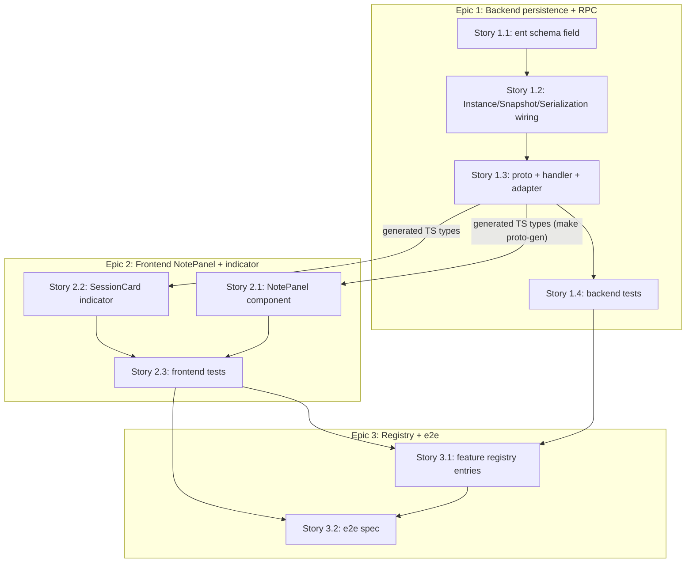

# Implementation Plan: Session Notes

Source: `project_plans/session-notes/requirements.md` + `research/{stack,features,architecture,pitfalls,ux,build-vs-buy}.md`.

## System type

CRUD extension to an existing entity (`Session`): one new optional scalar field (`note`),
threaded through an already-ent-backed persistence layer, an already-existing update RPC,
and two new/extended React UI surfaces (an edit/render panel, a card indicator). No new
service, no new entity relationship, no new async job. This is **not** a system that
warrants a Domain Model — it's Transaction Script territory (see Pattern Decision 9).

---

## Step 0.5 — Creative pass: alternatives considered

### A. Field placement + RPC shape

1. **Chosen: extend the existing `Session` ent schema with `field.Text("note")` + extend
   `UpdateSessionRequest` with `optional string note`.** Strength: matches the exact shape
   of every other user-editable scalar on `Session` (`category`, `working_dir`, `pause_reason`)
   — same RPC, same event-publish wiring, zero new plumbing. Weakness: `Session` already has
   79+ fields between the ent schema, `InstanceSnapshot`, and the proto message, so this adds
   one more entry to an already-long list of places a field must be threaded.
2. **Rejected: `SessionNote` sibling ent table** (mirrors `SessionGoal`'s `session_uuid`-keyed
   1:1 table). Strength: isolates note storage/schema from the already-large `Session` entity;
   matches the closest existing "1:1 freeform data per session" precedent. Weakness: `SessionGoal`'s
   shape exists specifically because goal state is agent-written, multi-writer, and structured
   (status enum + task tree) — none of which apply to a single user-authored scalar. Adopting it
   would require re-deriving `SessionGoal`'s load-time merge wiring (`session/storage.go`'s
   `SessionGoal.Query()` pattern) for a field with none of the complexity that wiring exists to serve.
3. **Rejected: dedicated `UpdateSessionNote` RPC** (mirrors `RenameSession`). Strength: smaller,
   single-purpose request/response messages. Weakness: `RenameSession` is dedicated only because
   renaming carries an extra invariant (title-uniqueness check) that changes control flow — note
   has no such invariant, so a dedicated RPC would duplicate `UpdateSession`'s event-publish
   (`events.NewSessionUpdatedEvent`) block for zero behavioral gain.

### B. Frontend component structure

1. **Chosen: standalone `NotePanel.tsx`** (mirrors `GoalPanel.tsx`'s shape: self-contained,
   own `.css.ts`, mounted in the Info tab next to `GoalPanel`). Strength: `SessionDetailView.tsx`
   is already very large (references past line 1250); Goal — the closest analogous "extra
   per-session context panel" — was already extracted to its own file rather than inlined, so
   this follows established precedent for this exact kind of panel. Weakness: one more file and
   a prop-drilling boundary (`session`, `onSave`) versus fully inline state.
2. **Rejected: inline in `SessionDetailView.tsx`** using the `isEditingX`/`makeStringFieldEditor`
   pattern verbatim (like `category`/`workingDir`). Strength: zero new files, most literal reuse
   of the existing convention. Weakness: none of the existing `isEditingX` fields render
   markdown — bolting `ReactMarkdown` + heading-remap + a textarea-vs-render toggle into the
   same already-dense file as a dozen other inline editors is a worse fit than the Goal panel's
   own precedent of extraction.
3. **Rejected: generalize backlog's `NotesSection.tsx` + `DescriptionSection.tsx` into a shared
   `MarkdownEditableField` primitive** used by both backlog and session notes. Strength:
   maximal reuse; would remove duplication between two structurally similar patterns. Weakness:
   `NotesSection.tsx`/`DescriptionSection.tsx` are tightly coupled to `BacklogItem`'s type and
   `BacklogItemDetail.css`; extracting a shared primitive is a larger, riskier refactor (touches
   a working backlog code path unrelated to this feature) than this feature's "simple start"
   non-goal justifies.

**Chosen overall**: A1 (field on `Session` + extend `UpdateSessionRequest`) + B1 (standalone
`NotePanel.tsx`). Both rejected alternatives are recorded in the Pattern Decisions table below.

---

## Domain Glossary

| Term | Definition |
|---|---|
| **Session note** | The single free-form markdown string a user attaches to one `Session`, stored in the `note` column/field/proto field of the same name end-to-end. |
| **`Session.note`** (ent) | The `field.Text("note")` column on the `session` schema/table (`session/ent/schema/session.go`), capped at `NOTE_MAX_LENGTH` (10,000 chars) via `.MaxLen(...)`. |
| **`Instance.Note`** (Go) | The in-memory mutable field on `session.Instance` (`session/instance.go`) mirroring `Instance.Category`; mutated only via `SetNote`. |
| **`SetNote`** | The actor setter (`session/instance_actor_setters.go`) that mutates `Instance.Note` under the instance's actor mailbox and republishes the snapshot, mirroring `SetCategory`. |
| **`InstanceSnapshot.Note`** | The point-in-time, lock-free-readable copy of `Instance.Note` inside `InstanceSnapshot` (`session/instance_snapshot.go`), populated by `buildSnapshot`. |
| **`InstanceData.Note`** | The JSON-tagged persistence DTO field (`session/storage.go`) that round-trips `Instance.Note` through `ToInstanceData`/`FromInstanceData` and the ent repository. |
| **`UpdateSessionRequest.note`** | The new `optional string note` proto field (`proto/session/v1/session.proto`) a client sets to edit the note via the existing `UpdateSession` RPC. |
| **`Session.note`** (proto, `types.proto`) | The read-path proto field (`string note = 72`) that surfaces the current note value on every `GetSession`/`ListSessions`/`WatchSessions` response. |
| **`NOTE_MAX_LENGTH`** | The 10,000-character cap enforced by the ent `.MaxLen(10000)` validator (schema-side) and the frontend `<textarea maxLength={10000}>` (UI-side); see Pattern Decision 7. |
| **`NotePanel`** | The new React component (`web-app/src/components/sessions/NotePanel.tsx`) rendering the note's edit/read-mode toggle in the session detail Info tab. |
| **Note indicator** | The small icon badge rendered in `SessionCard`'s `badges` row (`data-testid="badge-has-note"`) when `session.note.trim()` is non-empty. |
| **`markdownBody`** | The existing shared vanilla-extract style class (`web-app/src/components/backlog/markdownBody.css.ts`) reused, not copied, for the note's rendered-markdown display. |
| **`session:update`** | The existing backend feature-registry id (`docs/registry/features/backend/session/update.json`) this change reuses (extends), rather than minting a new backend registry id, since no new RPC is added. |

---

## Pattern Decisions

| # | Component | Pattern chosen | Alternative rejected | Reason |
|---|---|---|---|---|
| 1 | Field placement | Scalar field on existing `Session` ent entity, threaded through `UpdateSessionRequest` | `SessionNote` sibling ent table (SessionGoal shape) | Single-owner, single scalar, no side effects/uniqueness — matches `category`/`working_dir` exactly; a sibling table would need the load-time merge wiring `SessionGoal` needs for none of the reasons `SessionGoal` needs it (agent-written, multi-writer, structured). See Creative pass A2. Formalized in `ADR-001-note-field-on-session-not-sibling-table.md`. |
| 2 | RPC shape | Extend existing `UpdateSession` RPC | Dedicated `UpdateSessionNote` RPC (RenameSession shape) | `RenameSession` is dedicated only because of its uniqueness-check invariant; note has no invariant, so a dedicated RPC would duplicate `UpdateSession`'s event-publish block for no gain. See Creative pass A3. |
| 3 | Frontend structure | Standalone `NotePanel.tsx`, mirrors `GoalPanel.tsx` | Inline in `SessionDetailView.tsx` via `isEditingX`/`makeStringFieldEditor`; or a shared backlog+session `MarkdownEditableField` primitive | Matches the extraction precedent Goal already set for "extra per-session context panel"; avoids growing an already-dense `SessionDetailView.tsx` with markdown-specific state, and avoids a riskier cross-cutting refactor of working backlog code. See Creative pass B1–B3. |
| 4 | Markdown editor | Plain `<textarea>` + `ReactMarkdown`/`remark-gfm` toggle | Rich markdown editor library (`@uiw/react-md-editor` et al.) | No new dependency; native mobile keyboard handling; matches `NotesSection.tsx`/`DescriptionSection.tsx`'s established split. Over-scoped per requirements' non-goals (single reminder field, no attachments/titles). Already settled in `research/build-vs-buy.md`. |
| 5 | Save UX | Explicit Save/Cancel | Autosave-on-blur (Linear-style) | No autosave/save-on-blur convention exists anywhere in this codebase (`research/pitfalls.md` §2); autosave would need new lost-edit-on-navigation and stale-response-race handling for a field where explicit save already fully satisfies the "external memory" job. |
| 6 | SessionCard indicator | Icon badge in the `badges` row, `Tooltip`-wrapped, plain-text-truncated (~120 chars) label | Inline truncated-text row in the card `body`/`info` block (mirrors `session.goal?.goalText`) | AC3 asks for a "lightweight visual indicator," not a text preview; mimicking Goal's full-text treatment risks the Notes-vs-Goal confusion `research/ux.md` §2 explicitly flags. An icon-only badge signals presence without competing with Goal's own display. |
| 7 | Length cap | 10,000 chars, enforced via ent `.MaxLen(10000)` + `<textarea maxLength={10000}>` | Unbounded, matching `BacklogItem.notes` | `research/pitfalls.md` §1 flags `BacklogItem.notes`'s unbounded field as "a mistake to avoid repeating," specifically because `Session` (unlike a backlog item) is fetched on every `ListSessions`/`WatchSessions` poll — an unbounded note multiplies payload size by session count on every poll. 10k chars is generous for the "quick reminder" JTBD while bounding worst case. |
| 8 | Markdown heading levels | Remap `h1`–`h6` down (e.g. max `h5`) via `ReactMarkdown`'s `components` prop inside `NotePanel` | Leave default heading mapping (as `DescriptionSection.tsx` does) | `DescriptionSection.tsx` lives on a full page with its own separate heading hierarchy; `NotePanel` sits inside `SessionDetailView`'s dense Info tab, where a stray user-typed `<h1>` risks an axe/Lighthouse heading-order violation this repo's UX CI blocks on (`research/ux.md` §3). Cheap to fix at render time. |
| 9 | PoEAA pattern for the backend handler | Transaction Script (the existing procedural `if req.Msg.Note != nil { ... }` block inside `UpdateSession`) | Domain Model (a `Session` aggregate with a `SetNote` business-rule method distinct from the actor setter) | The only business rule is a max-length check — not enough behavior to justify a domain-model layer distinct from the procedural handler every other `UpdateSessionRequest` field already uses. Don't use Domain Model for simple CRUD. |
| 10 | GoF pattern | None added | — (no GoF pattern applies) | No creational/structural/behavioral problem recurs here — a single scalar field with one read path and one write path doesn't call for Strategy/Decorator/Factory/Observer. Consistent with "only add a pattern when the problem recurs." |
| 11 | Type-driven design | Plain `string` for `Note` throughout (`Instance.Note`, `InstanceSnapshot.Note`, proto `string note`) | A `SessionNote` newtype/value-object wrapping validation | Every sibling scalar field on the same structs (`Category`, `Prompt`, `WorkingDir`, `PauseReason`) is a plain `string`; introducing a wrapper type for `Note` alone would be inconsistent and the only validation (max length) doesn't carry enough business logic to justify it — see `.claude/rules/interface-pollution-checklist.md`'s "unjustified generic/wrapper" smell, applied to primitives. |

---

## Migration Plan

- **No manual migration file.** This repo uses ent's auto-migration (`client.Schema.Create(ctx)`,
  called at startup in `session/ent_repository.go:93`) — adding `field.Text("note").Optional().Default("").MaxLen(10000)`
  to `session/ent/schema/session.go` is sufficient; the next server startup issues
  `ALTER TABLE sessions ADD COLUMN note text DEFAULT ''` automatically.
- **Backward compatible on read**: existing rows get `note = ''` (the `Default("")`), so
  `sessionToInstanceData` reads back an empty string, not null — no nil-handling needed
  anywhere downstream (matches `session_artifacts`'s existing `Default("")` convention).
- **Proto wire compatibility**: `note` is a new field on both `Session` (read, field 72) and
  `UpdateSessionRequest` (write, field 12, `optional`) — proto3 additive fields are
  forward/backward compatible; old clients simply never populate/see it, no version gate needed.
- **Rollback**: reverting the ent schema field (if ever needed) would leave an orphaned `note`
  column in SQLite until manually dropped — ent's auto-migration only adds columns, it does not
  drop them on schema revert. Acceptable given this repo's existing convention (no other field
  in this schema has ever needed rollback); noted here only for completeness, not a blocking
  concern.

## Observability Plan

- **No new metrics or structured log lines required.** This is a low-risk scalar-field addition
  with no async job, no external call, and no new failure mode beyond what `UpdateSession`'s
  existing error handling (`connect.CodeInternal` on `SaveInstances` failure) already covers.
- **Existing event-bus propagation is sufficient for observability of the "did it save" question**:
  `updatedFields` already includes `"note"` once set, which flows into
  `events.NewSessionUpdatedEvent`/`NewSessionUpdatedEventWithDetection` — any tooling already
  watching that event stream (e.g. `WatchSessions` consumers) sees note updates for free, no new
  instrumentation needed.
- **Frontend**: `NotePanel`'s save failure path shows an inline `aria-live="assertive"` error
  (UX requirement, not a new logging/metrics surface) — see Story 2.1.

## Risk Control

| Risk | Mitigation |
|---|---|
| Missing one of the 8 Go round-trip touchpoints (`Instance` → `InstanceSnapshot`/`buildSnapshot` → `ToInstanceData`/`FromInstanceData` → `InstanceData` → `EntRepository` Create/Update/read-back → `instance_adapter.go`) silently drops the note on reload or omits it from `GetSession`. | `session/instance_snapshot.go`'s own doc comment is the authoritative checklist ("Whenever a field is added to Instance, add it here too"). Task 1.4.2 adds an explicit round-trip test (`Instance.Note` → `ToInstanceData` → `FromInstanceData` → `Instance.Note` equality) that fails loudly if any hop is skipped. |
| Unbounded note length bloats `ListSessions`/`WatchSessions` payloads across many sessions. | Pattern Decision 7 (10k cap, enforced both ends). |
| A stream-driven note update (from another tab's edit) clobbers an in-progress local edit. | `NotePanel` only re-syncs its local `note` state from `session.note` when **not** editing — mirrors the existing guard at `SessionDetailView.tsx:206-207` for `category`/`workingDir`. |
| Save failure silently discards the user's typed note (violates the "external memory" JTBD — losing a note the user believed was saved is worse than no notes feature). | `NotePanel` keeps the textarea populated and switches to an inline `aria-live="assertive"` error on failure; does not auto-revert to read mode. |
| Unremapped markdown headings in a user note break the page's heading hierarchy, failing this repo's axe/Lighthouse CI gate. | Pattern Decision 8 (heading remap via `components` prop). |
| `NOTE_MAX_LENGTH` (10,000) turns out to be the wrong number for real usage. | Flagged explicitly under Unresolved Questions — cheap to change later (one ent `.MaxLen` edit + one frontend constant), not a blocking risk now. |

## Unresolved Questions

1. **Is 10,000 characters the right cap?** Not specified in requirements; `research/pitfalls.md`
   only says "pick a cap," not what it should be. Chosen as a judgment call (Pattern Decision 7).
   Revisit if real usage shows it's too tight or too generous — cheap to change (one ent
   `.MaxLen` value + one frontend constant).
2. **Should note text be searchable via `SessionSearchDetector`** (omnibar priority-200 fallback
   search)? `research/ux.md` explicitly flags this as an open question and out of scope for v1.
   This plan does not implement it — confirmed non-goal for this iteration, not a decision this
   plan is making permanently.
3. **Should forking a session from a checkpoint carry over the parent's note?**
   `session/instance_checkpoint.go:196-205`'s `ForkFromCheckpoint` copies `Category`/`Tags` into
   the new `InstanceOptions` but this plan does **not** add `Note` to that copy — the forked
   session starts with an empty note. `Note` is added to the `InstanceOptions` struct (Task
   1.2.1) for general construction, but the checkpoint-fork call site intentionally omits it.
   Flag as a possible fast-follow if users expect notes to survive forking; not required by any
   stated acceptance criterion.
4. **Should the note appear in `ReviewItem`** (review-queue display, `session/review_queue_poller.go`,
   `session/startup_scanner.go`) or the domain/context builder (`session/session.go:290-296`)?
   Scoped out — the stated JTBD (`research/ux.md` §5) is browsing `SessionCard`/detail view, not
   the review-queue triage flow. Not implemented.
5. **Orphan cleanup on `DeleteSession`**: **N/A, not a gap.** Unlike `SessionGoal` (a separate
   table keyed by `session_uuid`, currently leaked on `DeleteSession` per `research/features.md`
   edge case 5), `note` is a column on the `Session` row itself. `DeleteSession`'s existing
   `s.storage.DeleteInstance(...)` call removes the whole row, `note` included, automatically —
   no new cleanup code needed. Documented here explicitly so an adversarial reviewer doesn't
   re-flag the `SessionGoal` gap as applying to this feature too.

## Dependency Visualization



Epic 2's two stories (`NotePanel`, `SessionCard` indicator) are independent of each other and
can be worked in parallel once Epic 1 Story 1.3 lands (both need the regenerated
`web-app/src/gen/session/v1/*_pb.ts` with `note` on `Session`/`UpdateSessionRequest`). Epic 3
depends on both epics being substantially complete since its registry entries reference test IDs
from Stories 1.4/2.3, and its e2e spec exercises the full stack.

---

# Phase 1: Backend

## Epic 1: Session note persistence + RPC

### Story 1.1: Add `note` to the ent schema

**Acceptance criteria:**
- AC: The ent schema defines `note` as an optional, empty-default, length-capped text field.
  - **Given** `session/ent/schema/session.go`'s `Session.Fields()` before this change (no `note` field).
  - **When** `field.Text("note").Optional().Default("").MaxLen(10000).Comment("User-authored free-form markdown note attached to this session.")` is added near `session_artifacts` (line 128).
  - **Then** `go run -mod=mod entgo.io/ent/cmd/ent generate --feature sql/upsert ./session/ent/schema` regenerates `session/ent/session/session.go` etc. with a `Note` field and `session.FieldNote` constant, and `go build ./...` succeeds.

**Tasks:**

1. **Edit `session/ent/schema/session.go`**: add `field.Text("note").Optional().Default("").MaxLen(10000).Comment("User-authored free-form markdown note attached to this session. Capped at 10,000 chars — see NOTE_MAX_LENGTH cross-reference in server/services/session_service.go.")` immediately after the `session_artifacts` field (current line 128-131). *1 file.*
2. **Regenerate + verify**: run `go run -mod=mod entgo.io/ent/cmd/ent generate --feature sql/upsert ./session/ent/schema` (per `.claude/rules/ent-schema-generation.md` — the `--feature sql/upsert` flag is mandatory), then `go build ./session/...` to confirm the generated code compiles. Commit all changed files under `session/ent/` together with the schema edit (per repo convention). *Generated files only, no manual edits.*

---

### Story 1.2: Thread `Note` through `Instance`, snapshot, and serialization

**Acceptance criteria:**
- AC: `Instance.Note` round-trips through `InstanceSnapshot` and `InstanceData` without loss.
  - **Given** an `Instance` with `Note` set to `"left this waiting on CI"` via `SetNote`.
  - **When** `ToInstanceData()` is called, producing `InstanceData{Note: "left this waiting on CI", ...}`, and `FromInstanceData(data)` reconstructs a new `Instance`.
  - **Then** the reconstructed `Instance.Note == "left this waiting on CI"`.

**Tasks:**

1. **`session/instance.go`**: add `// Note is a user-authored free-form markdown note attached to this session.` + `Note string` to the `Instance` struct (near `Category string` at line 143-144) and to the `InstanceOptions` struct (near `Category string` at line 477-478); add `Note: opts.Note,` to the `NewInstance` construction (near `Category: opts.Category,` at line 608). *1 file, 3 edit points.*
2. **`session/instance_snapshot.go`**: add `Note string` to `InstanceSnapshot` (near `Category string` at line 96) and `Note: i.Note,` to `buildSnapshot` (near `Category: i.Category,` at line 162). *1 file.*
3. **`session/instance_actor_setters.go`**: add a `---- Note ----` section mirroring `---- Category ----` (lines 356-372): `setNoteLocked(s *instanceState, note string)` + `func (i *Instance) SetNote(note string)`, following the exact `setCategoryLocked`/`SetCategory` shape. *1 file.*
4. **`session/instance_serialization.go`**: add `Note: snap.Note,` to `ToInstanceData()`'s `InstanceData{...}` literal (near `Category: snap.Category,` at line 65) and add `Note: data.Note,` to `FromInstanceData`'s `Instance{...}` literal (near `Category: data.Category,` at line 229). *1 file.*
5. **`session/storage.go`**: add `Note string \`json:"note,omitempty"\`` to the `InstanceData` struct, grouped near `Category string \`json:"category,omitempty"\`` (line 40). *1 file.*
6. **`session/ent_repository.go`**: three edits in one file — (a) in the `Create` path, add `if data.Note != "" { sessionCreate.SetNote(data.Note) }` near the `Category` block (~line 179-181); (b) in the `Update` path, add the equivalent `sessionUpdate.SetNote(data.Note)` guard near ~line 391-393; (c) in `sessionToInstanceData`, add `Note: sess.Note,` to the `InstanceData{...}` literal near `Category: sess.Category,` (~line 1053). *1 file, 3 edit points.*

---

### Story 1.3: Proto fields, `UpdateSession` handler, and proto→Go adapter

**Acceptance criteria:**
- AC: A client can set a session's note via `UpdateSession` and read it back via `GetSession`.
  - **Given** a running `Session` titled `"fix-flaky-test"` with no note set.
  - **When** a client calls `UpdateSession(UpdateSessionRequest{id: "fix-flaky-test", note: "left this waiting on CI — don't touch"})`.
  - **Then** the response's `session.note == "left this waiting on CI — don't touch"`, `updatedFields` included `"note"` when the event was published, and a subsequent `GetSession("fix-flaky-test")` also returns `note == "left this waiting on CI — don't touch"`.
- AC: A note longer than `NOTE_MAX_LENGTH` is rejected with `InvalidArgument`, not silently truncated or persisted.
  - **Given** a request with `note` set to a 10,001-character string.
  - **When** `UpdateSession` is called.
  - **Then** it returns `connect.CodeInvalidArgument` and the session's stored note is unchanged (no partial write).

**Tasks:**

1. **`proto/session/v1/types.proto`**: add `string note = 72;` to the `Session` message (72 is the next free field number after `workspace_key = 71`; verified no other field uses 72 in this file). Add a one-line comment: `// User-authored free-form markdown note attached to this session.` *1 file.*
2. **`proto/session/v1/session.proto`**: add `optional string note = 12;` to `UpdateSessionRequest`, immediately after `optional string steer_message = 11;` (12 is the next free field number in this message). Comment: `// Update the session's free-form note. Capped at 10,000 characters.` *1 file.*
3. **Regenerate**: run `make proto-gen`; verify `session/gen/session/v1/*.go` and `web-app/src/gen/session/v1/*_pb.ts` now expose `note`/`Note` on both messages. *Generated files only.*
4. **`server/services/session_service.go`**: in `UpdateSession` (immediately after the `Category` block at lines 1754-1758, before the `Tags` block at line 1760), add:
   ```go
   // Handle note update.
   if req.Msg.Note != nil {
       if len(*req.Msg.Note) > session.MaxNoteLength {
           return nil, connect.NewError(connect.CodeInvalidArgument,
               fmt.Errorf("note exceeds maximum length of %d characters", session.MaxNoteLength))
       }
       instance.SetNote(*req.Msg.Note)
       updatedFields = append(updatedFields, "note")
   }
   ```
   Also define `const MaxNoteLength = 10000` in `session/instance.go` near the `Instance`/`InstanceOptions` struct definitions (with a comment cross-referencing the ent schema's `.MaxLen(10000)`, since the `schema` package cannot import the `session` package — avoiding an import cycle — so the two 10000s must be kept in sync by comment, not by shared constant). *2 files: `server/services/session_service.go`, `session/instance.go`.*
5. **`server/adapters/instance_adapter.go`**: add `Note: snap.Note,` to `InstanceToProto`'s `protoSession := &sessionv1.Session{...}` literal, near `Category: snap.Category,` (line 45). *1 file.*

---

### Story 1.4: Backend tests

**Acceptance criteria:**
- AC: `UpdateSession` note round-trip and max-length rejection are covered by Go tests.
  - **Given** the existing `TestUpdateSession_TagsUpdate` fixture pattern (`setupForkTestFixture` + `addPausedSession`).
  - **When** `TestUpdateSession_NoteUpdate` calls `UpdateSession` with a `note`, then reloads via `fix.storage.LoadInstances()`.
  - **Then** the reloaded instance's `Note` field matches what was sent, proving persistence through the full ent round trip, not just the in-memory response.

**Tasks:**

1. **`server/services/session_service_test.go`**: add `TestUpdateSession_NoteUpdate` (mirrors `TestUpdateSession_TagsUpdate`, lines 505-536: seed a paused session, call `UpdateSession` with `Note: proto.String("left this waiting on CI")`, assert the response and the storage-reloaded instance both carry it) and `TestUpdateSession_NoteExceedsMaxLength_ReturnsInvalidArgument` (send a 10,001-char note, assert `connect.CodeInvalidArgument` and that storage is unchanged). *1 file.*
2. **`session/instance_test.go`** (or the closest existing setter-test file, e.g. wherever `SetCategory` is tested — confirm at implementation time, none was found via grep so this may be a new small test block): add a round-trip test asserting `Instance.Note` → `SetNote` → `ToInstanceData()` → `FromInstanceData()` → `Instance.Note` equality, directly exercising the Risk Control mitigation for the "missing touchpoint" risk. *1 file.*

---

# Phase 2: Frontend

## Epic 2: `NotePanel` + `SessionCard` indicator

### Story 2.1: `NotePanel` component

**Acceptance criteria:**
- AC1 (requirements AC1): a user can attach a markdown note from the session detail view.
  - **Given** `NotePanel` mounted with `session.note === ""`, showing its empty state ("No notes yet — leave yourself a reminder about this session" + an "Add note" button).
  - **When** the user clicks "Add note", types `"spike — don't merge"` into the `data-testid="session-note-textarea"` textarea, and clicks the `data-testid="session-note-save-button"` Save button.
  - **Then** `onSave("spike — don't merge")` is called (wired to `actions.update({ note: v })` in Story 2.1's wiring task), and on success `NotePanel` switches back to read mode showing the rendered text.
- AC2 (requirements AC2): the note renders as formatted markdown in read mode.
  - **Given** `session.note === "**Blocked** — see [PR #482](https://x)"`.
  - **When** `NotePanel` is not in edit mode.
  - **Then** `data-testid="session-note-rendered"` contains a `<strong>Blocked</strong>` and an `<a href="https://x">` — rendered via `ReactMarkdown remarkPlugins={[remarkGfm]}` wrapped in `markdownBody`, with headings remapped (Pattern Decision 8).
- AC: an in-progress edit is not clobbered by a stream-driven prop update from another tab.
  - **Given** `NotePanel` is in edit mode with local (unsaved) textarea text `"draft..."`, while `session.note` (from props) is still `""`.
  - **When** a `WatchSessions` event updates `session.note` to `"someone else's note"` in another tab and the prop flows down.
  - **Then** the textarea still shows `"draft..."` — the sync-from-props effect is guarded by `!isEditing`, mirroring `SessionDetailView.tsx:206-207`.
- AC: save failure preserves the user's typed text and surfaces an accessible error.
  - **Given** the user has typed `"my note"` and clicks Save, and the underlying `updateSession` call rejects.
  - **When** the promise rejects.
  - **Then** `NotePanel` remains in edit mode with the textarea still showing `"my note"`, and an `aria-live="assertive"` error element appears (not just a toast).

**Tasks:**

1. **`web-app/src/components/sessions/NotePanel.css.ts`** (new): vanilla-extract styles for the panel container, `<details>`/`<summary>` header (mirrors `GoalPanel.css.ts`'s `panelContainer`/`summary`), edit-mode textarea, Save/Cancel buttons (reuse existing button token patterns, not new colors), empty-state text, and the `aria-live` status region. Compose `markdownBody` for the read-mode wrapper rather than duplicating its rules. *1 file.*
2. **`web-app/src/components/sessions/NotePanel.tsx`** (new): `// +feature: session-notes-panel` marker in the first 10 lines; props `{ note: string; onSave: (note: string) => Promise<unknown> }`; local `isEditing`/`draftValue`/`saveError`/`saving` state; textarea with `maxLength={10000}` and an `aria-label="Session note (markdown)"` + `aria-describedby` hint ("Markdown supported"); Save/Cancel buttons (Cancel reverts to `note` prop and exits edit mode); read mode renders `ReactMarkdown` with `components={{h1: "h5", h2: "h6", h3: "h6", ...}}`-style remap inside `markdownBody`; empty state with "Add note" CTA button; focus moves into the textarea on entering edit mode (`useEffect` + `ref.current?.focus()` — explicitly fixing the pre-existing focus-management gap noted in `research/ux.md` §3, scoped to this new component only, not retrofitted onto other `isEditingX` fields). *1 file.*
3. **Wire into `SessionDetailView.tsx`**: mount `<NotePanel note={session.note ?? ""} onSave={(v) => actions.update({ note: v })} />` in the Info tab, immediately after `<GoalPanel goal={session.goal} />` and before `<WorkspacePeersPanel session={session} />` (~line 1246-1251). Add the import `import { NotePanel } from "./NotePanel";` near the existing `import { GoalPanel } from "./GoalPanel";` (line 27). *1 file.*
4. **`web-app/src/lib/hooks/useSessionService.ts`**: add `note: updates.note,` to the `clientRef.current.updateSession({...})` call body inside `updateSession` (~line 311-322, alongside `category: updates.category,`), so the whitelist-style request construction doesn't silently drop the field like an unlisted `Partial<UpdateSessionRequest>` key would. *1 file.*

---

### Story 2.2: `SessionCard` note indicator

**Acceptance criteria:**
- AC3 (requirements AC3): `SessionCard` shows a visual indicator when its session has a non-empty note.
  - **Given** two `Session`s: session A with `note = "waiting on CI"`, session B with `note = "   \n"` (whitespace-only).
  - **When** both render as `SessionCard`s.
  - **Then** session A's badge row contains an element with `data-testid="badge-has-note"`; session B's does not — gated on `session.note?.trim().length > 0`, not on raw truthiness.
- AC: the indicator's tooltip shows a plain-text-truncated excerpt, not rendered markdown.
  - **Given** session A's note is `"# Heading\n\nSome **bold** text that is much longer than one hundred and twenty characters so it must be truncated for the tooltip display"` (>120 chars).
  - **When** the user hovers the note badge.
  - **Then** the `Tooltip`'s `label` (a plain string, per `Tooltip.tsx:13`'s `string`-only prop type) shows the first ~120 characters of the raw note text followed by `"…"` — markdown syntax characters (`#`, `**`) may appear literally, matching the precedent `GoalPanel.tsx`'s `MAX_GOAL_DISPLAY_LENGTH = 120` sets for its own plain-text truncation.

**Tasks:**

1. **`web-app/src/components/sessions/SessionCard.css.ts`**: add a `noteBadge` style, following the existing `autonomousBadge`/`workflowBadge` visual convention (same badge sizing/border-radius/font-size tokens — read the existing `autonomousBadge` rule first and reuse its base shape, varying only color/icon). *1 file.*
2. **`web-app/src/components/sessions/SessionCard.tsx`**: add, in the `badges` row (after the `pendingProgramChange` badge block, lines 627-636, and before the row's closing `</div>` at line 637), a conditional badge:
   ```tsx
   {session.note?.trim() && (
     <Tooltip label={truncateGoal(session.note.trim(), 120)} side="top">
       <span className={noteBadge} role="img" aria-label="Has a note" data-testid="badge-has-note">
         📝
       </span>
     </Tooltip>
   )}
   ```
   Reuse the existing `truncateGoal` helper (`@/lib/utils/string`, already imported at line 92) for the tooltip excerpt rather than writing a new truncation function — it already does exactly this ("truncate at N chars + ellipsis"). Import `noteBadge` from `./SessionCard.css`. *1 file (same file as import list edit).*

---

### Story 2.3: Frontend tests

**Acceptance criteria:**
- AC: `NotePanel` and the `SessionCard` indicator are covered by Jest/RTL tests mirroring `GoalPanel.test.tsx`'s structure.

**Tasks:**

1. **`web-app/src/components/sessions/NotePanel.test.tsx`** (new): tests for — renders empty state when `note === ""`; clicking "Add note" enters edit mode and focuses the textarea; Save calls `onSave` with the typed value and returns to read mode; Cancel discards the draft and reverts to the original `note`; save failure keeps the textarea populated and shows the `aria-live="assertive"` error; rendered markdown contains expected `<strong>`/`<a>` elements for a sample note. Follow `GoalPanel.test.tsx`'s `render`/`screen`/`fireEvent` style exactly. *1 file.*
2. **`web-app/src/components/sessions/SessionCard.test.tsx`**: add cases — badge renders for `note: "waiting on CI"`; badge does NOT render for `note: "   \n"` (whitespace-only) or `note: ""`; badge's `Tooltip` label is truncated to ~120 chars for a long note. (Create this file if it doesn't already exist — confirmed via search it does not.) *1 file.*

---

# Phase 3: Registry + e2e

## Epic 3: Feature registry + Playwright coverage

### Story 3.1: Feature registry entries

**Acceptance criteria:**
- AC: the extended backend RPC and the two new frontend surfaces are registered per `.claude/rules/feature-registry.md`, and `make registry-generate` shows no net-new coverage gap.
  - **Given** `docs/registry/features/backend/session/update.json` currently has `"tested": false, "testIds": []`.
  - **When** Task 3.1.1 runs after Story 1.4's tests land.
  - **Then** the file has `"tested": true` and `"testIds"` includes `"TestUpdateSession_NoteUpdate"` and `"TestUpdateSession_NoteExceedsMaxLength_ReturnsInvalidArgument"`, and `"lastModified"` is bumped.

**Tasks:**

1. **`docs/registry/features/backend/session/update.json`**: update in place (existing RPC, not a new one, per the registry rule's "existing RPC method" branch) — set `"tested": true`, add `"TestUpdateSession_NoteUpdate"` and `"TestUpdateSession_NoteExceedsMaxLength_ReturnsInvalidArgument"` to `"testIds"`, bump `"lastModified"` to the current ISO timestamp. *1 file.*
2. **`docs/registry/features/frontend/session-notes-panel.json`** (new): `{"id": "session-notes-panel", "type": "frontend", "component": "NotePanel", "path": "web-app/src/components/sessions/NotePanel.tsx", "markerLine": <line of the +feature comment>, "tested": true, "testIds": [<NotePanel.test.tsx describe/it names>], "lastModified": <today>}` — shape matches `docs/registry/features/frontend/session-summary-tab.json`. *1 file.*
3. **`docs/registry/features/frontend/session-notes-card-indicator.json`** (new): same shape, `"component": "SessionCard"`, `"path": "web-app/src/components/sessions/SessionCard.tsx"`, `"testIds"` referencing the new `SessionCard.test.tsx` note-badge cases. *1 file.*
4. **Run `make registry-generate`**: verify `docs/registry/coverage-gaps.json`'s count does not grow net-new (both new frontend entries and the updated backend entry ship `tested: true` with populated `testIds`, so they shouldn't add gaps). Commit the regenerated aggregate files alongside the per-feature source files. *Generated files.*

---

### Story 3.2: Playwright e2e coverage

**Acceptance criteria:**
- AC: an e2e spec exercises attach → render → indicator → reload-persists, per `.claude/rules/e2e-test-conventions.md`.
  - **Given** a fresh session created via the test harness.
  - **When** the spec opens the session detail view, adds a note via `NotePanel`, reloads the page, and checks the session list.
  - **Then** the note text renders as markdown in the detail view, and the `SessionCard`'s `badge-has-note` testid is visible in the list view — all via `data-testid`/ARIA locators, no `waitForTimeout`.
  - **Note on AC4 (persist across server restart)**: a true server-restart e2e test is impractical within the existing Playwright harness (which spins up one isolated server per run, see `tests/e2e/global-setup.ts`). This spec instead verifies persistence via **page reload** (`page.reload()`), which round-trips through the same `GetSession`/`ListSessions` read path a real restart would exercise (the in-memory `Instance` is discarded and rebuilt from the same ent/SQLite-backed `LoadInstances()` call either way) — a reasonable proxy given the harness's constraints, not a literal restart test. AC4's true restart guarantee is additionally covered by Story 1.4's Go-level round-trip test, which does exercise the actual persistence layer.

**Tasks:**

1. **`tests/e2e/pages/SessionDetailPage.ts`**: add locator helpers — `getNotePanel()` (`getByTestId("session-note-panel")` — add this wrapping testid to `NotePanel.tsx`'s root `<details>`), `getNoteTextarea()` (`getByTestId("session-note-textarea")`), `getNoteSaveButton()` (`getByTestId("session-note-save-button")`), `getNoteRenderedBody()` (`getByTestId("session-note-rendered")`), `getNoteAddButton()` (`getByRole("button", { name: "Add note" })`). Follow the existing "Summary tab" section's grouping-comment style (lines 77-103). *1 file.*
2. **`tests/e2e/session-notes.spec.ts`** (new): header `// @feature session:update, session-notes-panel, session-notes-card-indicator`; test flow — create/open a session, verify `NotePanel` empty state, click "Add note", type a markdown note, save, assert rendered `<strong>`/list output via `getNoteRenderedBody()`, navigate to the session list and assert `SessionsPage`'s card shows `badge-has-note` for that session, reload the page and re-assert both the rendered note and the card badge survive (proxy for AC4 per the note above). No `waitForTimeout`; only `data-testid`/ARIA locators. *1 file.*
