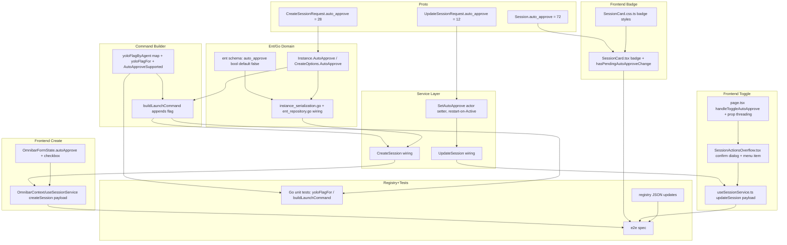

# Implementation Plan: Surface Yolo/Auto-Approve Mode as a Per-Session Setting

**Project**: `session-yolo-mode` | **Phase**: 3 — Plan | **Created**: 2026-08-06
**Source**: `project_plans/session-yolo-mode/requirements.md`

## Step 0.5 — Alternatives Considered

| # | Approach | Strength | Weakness |
|---|---|---|---|
| (a) | Rename/absorb `auto_yes` into `auto_approve`: promote the existing field, extend its command injection to Aider, keep `auto_yes` only for the TapEnter/daemon keystroke mechanism | No new proto/ent field; single source of truth for "this session is unguarded" | `auto_yes` is *not* just a create-time checkbox — it is threaded through `Profiles`, `Aliases`, and `DirectoryRules` as a saved-preset default (`ProfilesManager.tsx`, `AliasesManager.tsx`, `DirectoryRulesManager.tsx`, `useAliases.ts`, `useSessionDefaults.ts`, `sessionSchema.ts`, `SessionWizard.tsx`, `SessionDetailView.tsx` — 12+ frontend files). A rename would force touching every one of those, a far larger and riskier diff than this feature warrants. |
| (b) | Add a fully parallel `auto_approve` field that coexists with `auto_yes`, wired the same way (both drive Claude's `--permission-mode bypassPermissions`) | Simplest mental model if you ignore history | Directly revives/compounds the existing latent double-flag bug (`session/instance_tmux.go:151-156` can already emit `--permission-mode` twice when `PermissionMode` and `AutoYes` are both set) — adding a third overlapping mechanism makes it worse, not better. |
| (c) | Keep `auto_yes` completely untouched (still drives Claude's `--permission-mode bypassPermissions` + `TapEnter` keystroke fallback + daemon auto-respond) and add `auto_approve` as a **narrow, independent, purely flag-injection field**, appended in `buildLaunchCommand` (not inside `buildClaudeCommand`'s existing `PermissionMode`/`AutoYes` block), with its own map-driven per-agent flag lookup covering both Claude and Aider | Zero risk to existing `auto_yes` code paths or its 12+ frontend consumers; new field is additive only; satisfies every literal requirement (own field name, Aider support, badge, post-creation toggle, correct `--dangerously-skip-permissions` literal) | Two conceptually-adjacent booleans exist in the same struct; if a user has an old alias/profile with `auto_yes=true` AND also enables the new toggle, both `--permission-mode bypassPermissions` and `--dangerously-skip-permissions` are passed to Claude on the same line (harmless — both bypass in the same direction — but worth documenting). |

**Chosen: (c).** This diverges from `research/*.md`'s lean toward (a), because that research did not have visibility into `auto_yes`'s frontend blast radius (Profiles/Aliases/DirectoryRules preset system). Discovering that during planning tips the balance decisively toward (c): it delivers everything requirements.md asks for with an additive, low-risk diff, and doesn't touch a single line of the preset system. See `decisions/ADR-001-auto-approve-as-independent-field.md` for the full write-up.

---

## Domain Glossary

| Term | Definition | Where it lives |
|---|---|---|
| `AutoApprove` | New, independent Go/proto boolean. When true, the session's launch command gets the CLI flag that skips that agent's tool/permission-approval prompts entirely. Distinct from `AutoYes` (see below) — never renamed, never merged. | `session/instance.go`, `proto/session/v1/{session,types}.proto` |
| `auto_approve` | Proto/JSON/wire name for `AutoApprove`. camelCase `autoApprove` in generated TypeScript. | proto + `web-app/src/gen` |
| `AutoYes` | **Pre-existing, untouched.** Drives Claude's `--permission-mode bypassPermissions` injection (existing `instance_tmux.go:154-156`) plus the `TapEnter()` keystroke-level prompt fallback and daemon auto-respond polling. Also the field name used by Profiles/Aliases/DirectoryRules presets. Out of scope for this feature. | `session/instance.go:129`, `session/instance_tmux.go:346-354` |
| `yoloFlagByAgent` | `map[string]string` from an agent's basename (`claude`, `aider`) to the CLI flag that bypasses its permission prompts. | `session/instance_tmux.go` (new, colocated with `classifyProgram`/`isClaude`) |
| `yoloFlagFor(program string) string` | Looks up the flag for the agent detected in `program`'s whitespace-delimited tokens (basename match, same style as `isClaude`). Returns `""` if unsupported. | `session/instance_tmux.go` (new) |
| `AutoApproveSupported(program string) bool` | `yoloFlagFor(program) != ""` — used by the UI to disable the toggle for an unrecognized agent rather than silently no-op. | `session/instance_tmux.go` (new) |
| `hasPendingAutoApproveChange` | Frontend predicate: session is Paused/Stopped, and `session.autoApprove` disagrees with whether a known yolo flag literal is present in `session.launchCommand`. Mirrors the existing `hasPendingProgramChange` shape. | `web-app/src/components/sessions/SessionCard.tsx` (new) |
| `SetAutoApprove(v bool)` | Actor setter on `Instance`. Unlike `SetAutoYes`/`SetAutonomousMode` (bare in-memory flip, checked live), this follows `SwitchProgram`'s restart-on-change pattern: it persists the new value and, if the session is `Active`, calls `Restart(true)` — because the flag is baked into the launch command at spawn time, not re-checked mid-run. | `session/instance_actor_setters.go` (new) |
| `badge-auto-approve` | `data-testid` for the session-card badge (steady-state, "active now"). | `SessionCard.tsx` |
| `badge-pending-auto-approve` | `data-testid` for the "takes effect on restart" variant. | `SessionCard.tsx` |
| `autoApproveBadge` / `autoApprovePendingBadge` | vanilla-extract style classes, colocated with `autonomousBadge`/`workflowBadge`. | `SessionCard.css.ts` |

---

## Pattern Decisions

| Concern | Pattern chosen | Alternative Rejected | Reason |
|---|---|---|---|
| Service-layer create/update wiring | Transaction Script (mirror the existing `AutonomousMode`/`Program` field wiring in `session_service.go`) | Domain Model / rich `Session` aggregate | This is CRUD-shaped field plumbing through an already-Transaction-Script-organized handler; introducing a domain model here would be pure ceremony for one bool. |
| Per-agent flag lookup | Concrete `map[string]string` + a plain lookup function (`yoloFlagFor`), colocated with `classifyProgram`/`isClaude` | `FlagProvider` interface with `ClaudeFlagProvider`/`AiderFlagProvider` implementations | Speculative-interface smell per `.claude/rules/interface-pollution-checklist.md` — exactly two data points, no near-term third, no divergent behavior beyond "which string." A map is simpler, is 10 lines, and needs no mocking in tests. |
| Command construction integration point | Append the yolo flag once, uniformly, in `buildLaunchCommand` *after* the `claudeProgram`/`plainProgram` switch, not inside `buildClaudeCommand`'s existing `PermissionMode`/`AutoYes` block | Extend `programKind`'s sealed sum type with a third `aiderProgram{}` case | Aider's command has no other Claude-style divergent flag logic (no `--resume`, `--mcp-config`, etc.) — the only thing that differs per-agent is the flag string, which a post-switch map lookup already expresses. Growing the sum type for one field would require touching every existing `switch p := classifyProgram(...).(type)` call site for no behavioral gain. |
| `auto_approve` vs `auto_yes` relationship | Independent field, additive only (Option (c), see Step 0.5 / ADR-001) | Rename/absorb `auto_yes` (Option (a)) | `auto_yes` is load-bearing in Profiles/Aliases/DirectoryRules preset UI — out of proportion to touch for this feature. |
| | | Fully coexisting field wired through the *same* `--permission-mode` mechanism (Option (b)) | Revives/compounds the existing double-`--permission-mode`-flag latent bug. |
| Post-creation toggle mutation semantics | Model `SetAutoApprove` after `Instance.SwitchProgram` (restart-on-Active-change) | Model after `SetAutonomousMode`/`SetRateLimitEnabled` (bare in-memory flip, no restart) | The flag is baked into the launch command string at spawn time (like `Program`), not polled/checked live at runtime (like autonomous mode or rate-limiting). A bare flip would make the badge lie about being "active" until the next unrelated restart. |
| Post-creation UX friction | Reuse `isAutonomousConfirmOpen`'s asymmetric-friction dialog pattern verbatim: confirm-to-enable, no-confirm-to-disable | Symmetric confirm-both-ways, or no confirm at all | Matches the one existing precedent in this codebase for a dangerous per-session toggle (`SessionActionsOverflow.tsx:402-430`); a genuinely dangerous flag (data loss risk per Anthropic's own docs) warrants at least the same friction as autonomous mode, which is comparatively lower-risk. |
| Badge component | Bespoke `.css.ts` style colocated with `autonomousBadge`/`workflowBadge` in `SessionCard.css.ts` | Route through the generic `web-app/src/components/ui/Badge.tsx` | Every existing session-card badge (`StatusBadge`, `SourceBadge`, `CIStatusBadge`, `workflowBadge`, `autonomousBadge`) bypasses the generic component by established local convention; using it here would be the one inconsistent badge in the file. |

---

## Migration Plan

- New ent column: `session/ent/schema/session.go` — `field.Bool("auto_approve").Default(false).Comment("Independent of auto_yes: injects a per-agent CLI flag (--dangerously-skip-permissions for Claude, --yes-always for Aider) that skips permission prompts entirely. See auto_yes for the separate TapEnter/daemon keystroke mechanism.")`.
- SQLite backend (`session/ent_repository.go:76`, `dialect.SQLite`); ent's auto-migration (`Schema.Create`, already invoked at startup) adds the column via `ALTER TABLE sessions ADD COLUMN auto_approve bool DEFAULT false` — no manual migration file, no backfill needed since every existing row gets `false` from the explicit default (nullable-safe: the Go zero value and the SQL default agree).
- Regenerate with the required flag: `go run -mod=mod entgo.io/ent/cmd/ent generate --feature sql/upsert ./session/ent/schema` (per `.claude/rules/ent-schema-generation.md` — omitting `--feature sql/upsert` silently breaks `UpsertRule`-style methods with no compile error).
- Proto regeneration: `make proto-gen` after every proto edit (regenerates `session/gen/session/v1/*.go` and `web-app/src/gen/session/v1/*_pb.ts`).
- Rollback: standard PR revert. The ent column is additive-only and defaults to `false`, so reverting the Go/proto code leaves an unused, harmless column behind (consistent with how this repo has always handled ent additions — no down-migration tooling exists or is expected).

## Observability Plan

- No new metric — this is a single opt-in bool with no meaningful rate/latency dimension.
- Add one `Debug`-level log line at the flag-injection point in `buildLaunchCommand` (`session/instance_tmux.go`) when `AutoApprove` is true and a flag was actually appended: `log.ForSession(i.Title).Debug("auto-approve flag injected", "program", i.Program, "flag", flag)`. `Debug`, not `Info`, to avoid steady-state log noise — this is a per-restart, not per-request, event, and its only consumer is a developer debugging "why didn't the flag apply" (the exact silent-no-op failure mode already observed in production for Aider+`auto_yes`).
- No log line needed when `AutoApprove` is true but the agent is unsupported (`yoloFlagFor` returns `""`) — that state is surfaced to the user directly via the disabled UI checkbox + hint text (Epic 4), not via server logs.

## Risk Control

- **Feature flag**: not needed. The field defaults to `false` at the ent/proto/Go level and is never set implicitly — satisfies requirements.md's "never a silent default" constraint without extra gating infrastructure.
- **Known, accepted edge case**: a session created via a Profile/Alias/DirectoryRules preset that sets `auto_yes=true`, combined with also enabling the new `auto_approve` toggle, will pass both `--permission-mode bypassPermissions` and `--dangerously-skip-permissions` to Claude on the same command line. Both point the same direction (bypass), so this is not a correctness hazard, only a minor redundancy — not worth engineering around for a single-user tool. Documented here and in the ent schema comment so it isn't rediscovered as a "bug."
- **Rollback**: standard PR revert (see Migration Plan). No data loss risk since the column defaults false.
- **Blast-radius containment**: this plan deliberately does not touch `SessionWizard.tsx`, `ProfilesManager.tsx`, `AliasesManager.tsx`, `DirectoryRulesManager.tsx`, `useAliases.ts`, `useSessionDefaults.ts`, or `sessionSchema.ts` — all `auto_yes`-only, out of scope per the Step 0.5 decision.
- **Out of scope, explicitly named (not silently missed)**: backlog automation's headless review sessions (`session/backlog_review.go:418-419`) already pass `PermissionMode: PermissionModeBypassPermissions` directly, bypassing both `auto_yes` and the new `auto_approve` entirely. The badge will not flag those sessions as unguarded even though they functionally are. Fixing that is a separate, future change.

## Unresolved Questions

1. Should the MCP `create_session`/batch-create tool surface `auto_approve`? Requirements.md scopes this to the Omnibar UI only; the proto field will exist and be settable via any RPC client, but no MCP tool schema change is planned here. Flag for a follow-up if the backlog-automation MCP flow wants it.
2. Should disabling `auto_approve` via the post-creation toggle also force `auto_yes` off if it happens to be set? Decided **no** — see Risk Control; the two fields are intentionally independent and `auto_yes`'s owner (the preset system) is out of scope.
3. Backlog review's direct `PermissionMode: PermissionModeBypassPermissions` sessions not being badge-visible (Risk Control, last bullet) — named but not fixed here.

## Dependency Visualization



---

## Phase 1: Backend Plumbing

### Epic 1: Proto, Ent Schema, and Go Domain Fields

#### Story 1.1: Proto field additions

**Task 1.1.1** — Add `auto_approve` to all three proto messages
Files: `proto/session/v1/session.proto`, `proto/session/v1/types.proto`
- In `CreateSessionRequest` (session.proto), after `string alias_name = 27;`, add:
  ```protobuf
  // auto_approve injects a per-agent CLI flag that skips permission/approval
  // prompts entirely (e.g. --dangerously-skip-permissions for Claude Code).
  // Independent of auto_yes — see auto_yes's own comment for the distinction.
  bool auto_approve = 28;
  ```
- In `UpdateSessionRequest` (session.proto), after `optional string steer_message = 11;`, add:
  ```protobuf
  optional bool auto_approve = 12;
  ```
- In `Session` (types.proto), after `string workspace_key = 71;`, add:
  ```protobuf
  bool auto_approve = 72;
  ```
- Run `make proto-gen`.

**Acceptance criteria**
- Given the edited proto files, when `make proto-gen` runs, then `session/gen/session/v1/session.pb.go` contains an `AutoApprove` field on `CreateSessionRequest` and `*bool` on `UpdateSessionRequest`, and `web-app/src/gen/session/v1/types_pb.ts` contains `autoApprove: boolean` on `Session`.

#### Story 1.2: Ent schema and Go domain structs

**Task 1.2.1** — Ent schema field
File: `session/ent/schema/session.go`
- After the `field.Bool("auto_yes").Default(false),` block (line 46-47), add:
  ```go
  field.Bool("auto_approve").
      Default(false).
      Comment("Independent of auto_yes: injects a per-agent CLI flag (--dangerously-skip-permissions for Claude, --yes-always for Aider) that skips permission prompts. See auto_yes for the separate TapEnter/daemon keystroke mechanism."),
  ```

**Task 1.2.2** — Regenerate ent
- Run `go run -mod=mod entgo.io/ent/cmd/ent generate --feature sql/upsert ./session/ent/schema` (per `.claude/rules/ent-schema-generation.md`).
- `go build ./...` to confirm the generated code compiles.

**Acceptance criteria**
- Given `session/ent/schema/session.go` has the new field, when ent generate runs with `--feature sql/upsert`, then `session/ent/session/session.go` exposes `FieldAutoApprove` and `session.Session.AutoApprove` compiles.

**Task 1.2.3** — `Instance` and `CreateOptions` Go struct fields
File: `session/instance.go`
- After `AutoYes bool` on the `Instance` struct (line 129), add:
  ```go
  // AutoApprove is true if the launch command should get a per-agent CLI flag
  // that skips permission/approval prompts entirely. Independent of AutoYes
  // (see AutoYes's own comment) — resolved via yoloFlagFor in instance_tmux.go.
  AutoApprove bool
  ```
- After `PermissionMode string` on `InstanceOptions` (line 523), add:
  ```go
  // AutoApprove mirrors Instance.AutoApprove — see its doc comment.
  AutoApprove bool
  ```
- In the `Instance{...}` struct literal inside `NewInstance` (around line 604, alongside `AutoYes: opts.AutoYes,`), add `AutoApprove: opts.AutoApprove,`.

**Acceptance criteria**
- Given `CreateOptions{AutoApprove: true, Program: "claude"}`, when `NewInstance` builds the `Instance`, then `instance.AutoApprove == true`.

**Task 1.2.4** — Serialization + ent repository round-trip
Files: `session/instance_serialization.go`, `session/ent_repository.go`
- `instance_serialization.go` (~line 62, alongside `AutoYes: snap.AutoYes,`): add `AutoApprove: snap.AutoApprove,` to the `InstanceData{...}` literal.
- `session/ent_repository.go`:
  - `sessionCreate` builder (~line 155, alongside `.SetAutoYes(data.AutoYes).`): add `.SetAutoApprove(data.AutoApprove).`
  - `sessionUpdate` builder (~line 367, same pattern): add `.SetAutoApprove(data.AutoApprove).`
  - Read-back struct literal (~line 1047, alongside `AutoYes: sess.AutoYes,`): add `AutoApprove: sess.AutoApprove,`

**Acceptance criteria**
- Given a session created with `AutoApprove: true`, when the process restarts and `LoadInstances` reads it back from SQLite, then the reloaded `Instance.AutoApprove == true` (round-trips through `SaveInstances` → ent → `LoadInstances`, not lost on restart).

---

### Epic 2: Per-Agent Flag Lookup + Command Injection

#### Story 2.1: Flag lookup table

**Task 2.1.1** — `yoloFlagByAgent`, `yoloFlagFor`, `AutoApproveSupported`
File: `session/instance_tmux.go`
- Colocated with `classifyProgram`/`isClaude` (after line 81), add:
  ```go
  // yoloFlagByAgent maps a supported agent's basename to the CLI flag that
  // bypasses its tool/permission-approval prompts entirely. This is a
  // separate mechanism from AutoYes's --permission-mode injection (see
  // buildClaudeCommand) — see Instance.AutoApprove's doc comment.
  var yoloFlagByAgent = map[string]string{
      "claude": "--dangerously-skip-permissions",
      "aider":  "--yes-always", // NOT "--yes" -- renamed in a past Aider release; --yes still
                                  // works only as a fragile abbreviation. Verified against
                                  // aider.chat/docs as the current stable flag name.
  }

  // yoloFlagFor returns the yolo/auto-approve flag for the agent detected in
  // program's whitespace-delimited tokens (basename match, mirroring isClaude),
  // or "" if the agent has no known flag.
  func yoloFlagFor(program string) string {
      for _, token := range strings.Fields(program) {
          if flag, ok := yoloFlagByAgent[filepath.Base(token)]; ok {
              return flag
          }
      }
      return ""
  }

  // AutoApproveSupported reports whether program is a recognized agent that
  // AutoApprove can inject a bypass flag for.
  func AutoApproveSupported(program string) bool {
      return yoloFlagFor(program) != ""
  }
  ```

**Acceptance criteria**
- Given `program = "claude"`, when `yoloFlagFor(program)` is called, then it returns `"--dangerously-skip-permissions"`.
- Given `program = "aider --model ollama_chat/gemma3:1b"`, when `yoloFlagFor(program)` is called, then it returns `"--yes-always"`.
- Given `program = "codex"`, when `AutoApproveSupported(program)` is called, then it returns `false`.

#### Story 2.2: Wire into the launch command

**Task 2.2.1** — Append the flag in `buildLaunchCommand`
File: `session/instance_tmux.go`
- In `buildLaunchCommand` (line 105-119), after the `switch p := classifyProgram(...)` block and before the `CLIFlags` loop, add:
  ```go
  if i.AutoApprove {
      if flag := yoloFlagFor(i.Program); flag != "" {
          cmd = cmd + " " + flag
          log.ForSession(i.Title).Debug("auto-approve flag injected", "program", i.Program, "flag", flag)
      }
  }
  ```
- Deliberately does **not** touch the existing `PermissionMode`/`AutoYes` block inside `buildClaudeCommand` (lines 151-156) — zero regression risk to existing behavior.

**Acceptance criteria**
- Given a session with `program: "claude"`, `auto_approve: true`, `auto_yes: false`, `permission_mode: ""`, when `buildLaunchCommand` runs, then the resulting command contains `--dangerously-skip-permissions` exactly once.
- Given a session with `program: "aider"`, `auto_approve: true`, when `buildLaunchCommand` runs, then the resulting command ends with `... --yes-always`.
- Given a session with `program: "codex"`, `auto_approve: true` (unsupported agent), when `buildLaunchCommand` runs, then the resulting command is unchanged (no flag appended, no panic).

#### Story 2.3: Go unit tests

**Task 2.3.1** — Tests for the new functions
File: `session/instance_tmux_test.go` (existing file — add test functions, do not create a new file)
- `TestYoloFlagFor_should_ReturnDangerouslySkipPermissions_When_ProgramIsClaude`
- `TestYoloFlagFor_should_ReturnYesAlways_When_ProgramIsAider`
- `TestYoloFlagFor_should_ReturnEmpty_When_ProgramUnsupported`
- `TestBuildLaunchCommand_should_AppendYoloFlag_When_AutoApproveTrueAndAgentSupported`
- `TestBuildLaunchCommand_should_NotAppendFlag_When_AutoApproveTrueButAgentUnsupported`
- `TestBuildLaunchCommand_should_NotDoubleAppendFlag_When_AutoApproveAndAutoYesBothTrue` (documents the accepted-edge-case from Risk Control: both flags present, neither duplicated within itself)

**Acceptance criteria**
- Given the five test cases above, when `go test ./session/... -run TestYoloFlagFor` and `-run TestBuildLaunchCommand` run, then all pass.

---

## Phase 2: Service Layer

### Epic 3: Create + Update Wiring, Actor Setter

#### Story 3.1: Create-path wiring

**Task 3.1.1** — Thread `AutoApprove` through `CreateSession`
File: `server/services/session_service.go`
- In the `instanceOpts := session.InstanceOptions{...}` literal (~line 1489, alongside `AutoYes: autoYes,`), add `AutoApprove: req.Msg.AutoApprove,`.

**Acceptance criteria**
- Given a `CreateSessionRequest{Program: "claude", AutoApprove: true}`, when `CreateSession` runs, then the created `Instance.AutoApprove == true` and the persisted ent row has `auto_approve = true`.

#### Story 3.2: Actor setter with restart-on-change

**Task 3.2.1** — `SetAutoApprove`
File: `session/instance_actor_setters.go`
- Mirror `SetAutoYes` (lines 317-334) for the locked-write half, but follow `SwitchProgram`'s restart trigger (`session/instance_program.go:75-79`) for the "takes effect" half:
  ```go
  // ---- AutoApprove -----------------------------------------------------------------

  func setAutoApproveLocked(s *instanceState, v bool) {
      s.inst.mu.Lock()
      s.inst.AutoApprove = v
      snap := buildSnapshot(s.inst)
      s.inst.mu.Unlock()
      s.inst.snapshot.Store(snap)
  }

  // SetAutoApprove sets the AutoApprove flag and, if the session is currently
  // Active, restarts it so the flag takes effect immediately (the flag is baked
  // into the launch command at spawn time, like Program -- not re-checked live,
  // unlike AutonomousMode/RateLimitEnabled). persist is called before the
  // restart so a crash between setting and restarting doesn't lose the change.
  func (i *Instance) SetAutoApprove(v bool, persist func() error) error {
      if err := i.sendSyncErr(func(s *instanceState) error {
          setAutoApproveLocked(s, v)
          return nil
      }); err != nil {
          return err
      }
      if persist != nil {
          if err := persist(); err != nil {
              return err
          }
      }
      if i.Status == Active {
          return i.Restart(true)
      }
      return nil
  }
  ```

**Acceptance criteria**
- Given an `Active` session with `AutoApprove: false`, when `SetAutoApprove(true, persistFn)` is called, then `Instance.AutoApprove == true`, `persistFn` was called, and `Restart(true)` was triggered (verified via a fake `ProcessManager` recording `KillSession`/`new-session` calls in the test).
- Given a `Paused` session, when `SetAutoApprove(true, persistFn)` is called, then `Instance.AutoApprove == true`, `persistFn` was called, and no restart occurs (matches `SwitchProgram`'s "next resume picks it up" behavior).

#### Story 3.3: Update-path wiring

**Task 3.3.1** — `UpdateSession` handler
File: `server/services/session_service.go`
- After the `AutonomousMode` block (~lines 1802-1816), add:
  ```go
  // Handle auto-approve toggle. Restart-on-change is handled inside SetAutoApprove.
  if req.Msg.AutoApprove != nil && *req.Msg.AutoApprove != instance.AutoApprove {
      if err := instance.SetAutoApprove(*req.Msg.AutoApprove, func() error {
          instances[instanceIndex] = instance
          return s.storage.SaveInstances(instances)
      }); err != nil {
          log.Error("[UpdateSession] failed to restart session after auto-approve change", "session", instance.Title, "err", err)
          return nil, connect.NewError(connect.CodeInternal, fmt.Errorf("failed to restart session after auto-approve change: %w", err))
      }
      updatedFields = append(updatedFields, "auto_approve")
  }
  ```

**Acceptance criteria**
- Given a session with `id: "sess-1"`, `program: "claude"`, `status: ACTIVE`, `auto_approve: false`, when `UpdateSession({id: "sess-1", auto_approve: true})` is called, then the response's `session.auto_approve == true`, `updatedFields` contains `"auto_approve"`, and the session's tmux pane was restarted with `--dangerously-skip-permissions` in its new launch command.

---

## Phase 3: Frontend — Creation-Time Toggle

### Epic 4: Omnibar Checkbox

#### Story 4.1: Form state and submit payload

**Task 4.1.1** — `OmnibarFormState` / `OmnibarSessionData` fields
File: `web-app/src/components/sessions/Omnibar.tsx`
- Add `autoApprove: boolean;` to the `OmnibarFormState` type (alongside `autonomousMode: boolean;`, line 84) and its default object (alongside `autonomousMode: false,`, line 103): `autoApprove: false,`.
- Add `autoApprove?: boolean;` to `OmnibarSessionData` (alongside `autonomousMode?: boolean;`, line 137).
- In the submit-payload construction (the three `autoYes,`/similar spread sites around lines 1052, 1100, 1118), add `autoApprove: formState.autoApprove,` alongside each.

**Task 4.1.2** — New checkbox in `OmnibarCreationPanel.tsx`
File: `web-app/src/components/sessions/OmnibarCreationPanel.tsx`
- Add `autoApprove` and `setFormField("autoApprove", ...)` to the destructured props (alongside `autonomousMode` at line 176).
- Immediately after the existing "Auto-Yes" checkbox block (lines 802-810), add a new, visually distinct checkbox:
  ```tsx
  {/* Auto-Approve (yolo mode) — independent of Auto-Yes above; see
      session/instance.go's AutoApprove doc comment for why they're separate. */}
  <label className={checkboxClass}>
    <input
      type="checkbox"
      checked={autoApprove}
      disabled={!isAutoApproveSupported(program)}
      onChange={(e) => setFormField("autoApprove", e.target.checked)}
    />
    <span>⚡ Auto-approve (skip permission prompts)</span>
  </label>
  <span className={hint}>
    {isAutoApproveSupported(program)
      ? "Skips ALL permission/approval prompts for this agent. Risk of unintended file changes — use only in disposable/sandboxed workspaces."
      : `Not supported for "${program || "this agent"}" yet.`}
  </span>
  ```
- Add a small local helper near the top of the file (mirrors backend's `yoloFlagByAgent` basenames; keep in sync manually — small enough surface that a shared RPC isn't warranted):
  ```ts
  const AUTO_APPROVE_SUPPORTED_AGENTS = ["claude", "aider"];
  function isAutoApproveSupported(program: string): boolean {
      const base = program.trim().split(/\s+/)[0]?.split("/").pop() ?? "";
      return AUTO_APPROVE_SUPPORTED_AGENTS.includes(base);
  }
  ```

**Task 4.1.3** — RPC passthrough
Files: `web-app/src/lib/contexts/OmnibarContext.tsx`, `web-app/src/lib/hooks/useSessionService.ts`
- `OmnibarContext.tsx` (~line 228, alongside `autonomousMode: data.autonomousMode ?? false,`): add `autoApprove: data.autoApprove ?? false,`.
- `useSessionService.ts`'s `createSession` (~line 277, alongside `autonomousMode: request.autonomousMode ?? false,`): add `autoApprove: request.autoApprove ?? false,`.

**Acceptance criteria**
- Given a user opens the Omnibar with `program: "claude"`, when they check the new "⚡ Auto-approve" checkbox and submit with title "test-session", then `createSession` is called with `{ program: "claude", autoApprove: true, ... }`.
- Given a user selects `program: "codex"` (unsupported), when the Omnibar renders, then the Auto-approve checkbox is `disabled` and the hint reads `Not supported for "codex" yet.`.

---

## Phase 4: Frontend — Badge

### Epic 5: Session Card Badge

#### Story 5.1: Badge styles

**Task 5.1.1** — vanilla-extract badge classes
File: `web-app/src/components/sessions/SessionCard.css.ts`
- After `workflowBadge` (line 817-832), add:
  ```ts
  export const autoApproveBadge = style({
    display: "inline-flex",
    alignItems: "center",
    gap: vars.space["1"],
    padding: `${vars.space["1"]} 8px`,
    background: vars.color.warningBg,
    color: vars.color.warningText,
    borderRadius: vars.radii.full,
    fontSize: vars.fontSize.xs,
    fontWeight: 600,
    border: `1px solid ${vars.color.warning}`,
  });

  export const autoApprovePendingBadge = style({
    display: "inline-flex",
    alignItems: "center",
    gap: vars.space["1"],
    padding: `${vars.space["1"]} ${vars.space["2"]}`,
    borderRadius: vars.radii.sm,
    background: vars.color.accentBg,
    color: vars.color.textSecondary,
    border: `1px solid ${vars.color.borderColor}`,
    fontSize: vars.fontSize.xs,
    fontWeight: 500,
  });
  ```
  (Verify `vars.color.warningBg`/`warningText`/`warning` exist in `web-app/src/styles/theme.css.ts` before writing — the research doc claims they're already defined; confirm during implementation, not assumed.)

**Acceptance criteria**
- Given the new styles compile, when `cd web-app && npx tsc --noEmit` runs, then there are no type errors from `SessionCard.css.ts`.

#### Story 5.2: Badge render logic

**Task 5.2.1** — `hasPendingAutoApproveChange` + badge JSX
File: `web-app/src/components/sessions/SessionCard.tsx`
- After `hasPendingProgramChange` (lines 22-30), add:
  ```tsx
  const AUTO_APPROVE_FLAG_LITERALS = ["--dangerously-skip-permissions", "--yes-always"];

  // Mirrors hasPendingProgramChange's shape: true when the persisted autoApprove
  // value disagrees with whether a known yolo flag is actually present in the
  // last-launched command (i.e. the toggle changed but the process hasn't
  // restarted with it yet).
  export function hasPendingAutoApproveChange(session: Pick<Session, "status" | "autoApprove" | "launchCommand">): boolean {
    const isPausedOrStopped = session.status === SessionStatus.PAUSED || session.status === SessionStatus.STOPPED;
    if (!isPausedOrStopped || !session.launchCommand) return false;
    const flagPresent = AUTO_APPROVE_FLAG_LITERALS.some((f) => session.launchCommand.includes(f));
    return session.autoApprove !== flagPresent;
  }
  ```
- Compute `const pendingAutoApproveChange = hasPendingAutoApproveChange(session);` alongside `pendingProgramChange` (line 176).
- After the `autonomousBadge` block (before `workflowBadge`, i.e. around line 592), add the steady-state badge:
  ```tsx
  {session.autoApprove && !pendingAutoApproveChange && (
    onToggleAutoApprove ? (
      <button
        className={autoApproveBadge}
        title="Skipping all permission prompts — click to disable"
        aria-label="Auto-approve enabled — this session skips permission prompts; click to disable"
        data-testid="badge-auto-approve"
        onClick={(e) => { e.stopPropagation(); onToggleAutoApprove(session.id, false); }}
      >
        ⚡ Auto
      </button>
    ) : (
      <span
        className={autoApproveBadge}
        role="img"
        title="Skipping all permission prompts"
        aria-label="Auto-approve enabled: this session skips permission prompts"
        data-testid="badge-auto-approve"
      >
        ⚡ Auto
      </span>
    )
  )}
  ```
- Near the existing `pendingProgramChange` badge (line 627-637), add the pending variant:
  ```tsx
  {pendingAutoApproveChange && (
    <span
      className={autoApprovePendingBadge}
      role="img"
      data-testid="badge-pending-auto-approve"
      title="Auto-approve setting changed since this session last launched — takes effect on resume/restart"
      aria-label="Auto-approve change pending: takes effect on resume or restart"
    >
      <span aria-hidden="true">⏳</span> Auto-approve pending
    </span>
  )}
  ```
- Add `onToggleAutoApprove?: (sessionId: string, enabled: boolean) => void;` to `SessionCard`'s props type (alongside `onToggleAutonomousMode?`, line 115) and destructure it (alongside line 146).

**Acceptance criteria**
- Given a session with `status: ACTIVE`, `program: "claude"`, `autoApprove: true`, `launchCommand: "claude --dangerously-skip-permissions"`, when `SessionCard` renders, then a `data-testid="badge-auto-approve"` element with text "⚡ Auto" is visible and `data-testid="badge-pending-auto-approve"` is absent.
- Given a session with `status: PAUSED`, `autoApprove: true`, `launchCommand: "claude"` (flag not yet present — toggled on since last launch), when `hasPendingAutoApproveChange(session)` is called, then it returns `true`, and `SessionCard` renders `data-testid="badge-pending-auto-approve"` instead of the steady-state badge.

---

## Phase 5: Frontend — Post-Creation Toggle

### Epic 6: Toggle Action, Confirm Dialog, Prop Threading

#### Story 6.1: Prop threading (mirrors `onToggleAutonomousMode`'s existing chain exactly)

**Task 6.1.1** — `page.tsx` handler + first three consumers
Files: `web-app/src/app/page.tsx`, `web-app/src/components/sessions/SessionList.tsx`, `web-app/src/components/sessions/SessionRow.tsx`
- `page.tsx` (after `handleToggleAutonomousMode`, line 280-287):
  ```tsx
  const handleToggleAutoApprove = useCallback(async (sessionId: string, enabled: boolean): Promise<void> => {
    track({ name: "session_auto_approve_updated", category: "user_action" });
    try {
      await updateSession(sessionId, { autoApprove: enabled });
    } catch (err) {
      console.error("[page] toggleAutoApprove failed:", err);
    }
  }, [updateSession, track]);
  ```
- Add `onToggleAutoApprove: handleToggleAutoApprove,` to the props object passed down (alongside `onToggleAutonomousMode: handleToggleAutonomousMode,`, line 432) and to the `useCallback` dependency array (line 441).
- `SessionList.tsx` / `SessionRow.tsx`: add `onToggleAutoApprove?: (sessionId: string, enabled: boolean) => void;` to each component's props type and pass it straight through to the next component down the chain, exactly matching each file's existing `onToggleAutonomousMode` line.

**Task 6.1.2** — Remaining consumers
Files: `web-app/src/components/pane/PaneHeader.tsx`, `web-app/src/components/pane/PaneSplitRenderer.tsx`, `web-app/src/lib/contexts/CockpitActionsContext.ts`
- Same mechanical prop-threading as Task 6.1.1, matching each file's existing `onToggleAutonomousMode` reference.

**Acceptance criteria**
- Given `page.tsx` renders the session tree, when a click on the SessionCard's `⚡ Auto` badge propagates through `SessionRow` → `SessionList` → `page.tsx`, then `handleToggleAutoApprove(session.id, false)` is invoked and `updateSession` is called with `{ autoApprove: false }`.

#### Story 6.2: Confirm dialog + menu item

**Task 6.2.1** — `SessionActionsOverflow.tsx`
File: `web-app/src/components/sessions/SessionActionsOverflow.tsx`
- Add `onToggleAutoApprove?: (sessionId: string, enabled: boolean) => void;` prop (alongside `onToggleAutonomousMode?`, line 57) and destructure (line 89).
- Add `const [isAutoApproveConfirmOpen, setIsAutoApproveConfirmOpen] = useState(false);` (alongside line 119) and a matching `useFocusTrap` ref (alongside line 157).
- After the autonomous-mode confirm dialog (lines 402-430), add a parallel dialog:
  ```tsx
  {isAutoApproveConfirmOpen && createPortal(
    <div className={confirmDialog} onClick={(e) => { e.stopPropagation(); setIsAutoApproveConfirmOpen(false); }}>
      <div
        ref={autoApproveConfirmDialogRef}
        role="dialog"
        aria-modal="true"
        aria-labelledby="autoApproveDialogTitle"
        className={dialogContent}
        onClick={(e) => e.stopPropagation()}
        onKeyDown={(e) => { if (e.key === "Escape") setIsAutoApproveConfirmOpen(false); }}
      >
        <h3 id="autoApproveDialogTitle">Enable Auto-Approve</h3>
        <p>&quot;{session.title}&quot; will skip ALL permission/approval prompts for its agent (e.g. file edits, shell commands).</p>
        <p className={warningText}>This is genuinely unsafe outside a disposable/sandboxed workspace — unintended file modifications or data loss are possible. You can disable it at any time from this menu.</p>
        <div className={dialogActions}>
          <button
            onClick={(e) => { e.stopPropagation(); onToggleAutoApprove?.(session.id, true); setIsAutoApproveConfirmOpen(false); }}
            className={submitButton}
          >
            Enable Auto-Approve
          </button>
          <button onClick={(e) => { e.stopPropagation(); setIsAutoApproveConfirmOpen(false); }} className={cancelButton}>
            Cancel
          </button>
        </div>
      </div>
    </div>,
    document.body
  )}
  ```
- After the `onToggleAutonomousMode` menu item (lines 701-720), add a parallel one:
  ```tsx
  {onToggleAutoApprove && (
    <button
      role="menuitemcheckbox"
      aria-checked={session.autoApprove}
      className={overflowMenuItem}
      title="Skip all permission/approval prompts for this agent."
      aria-label={session.autoApprove ? `Disable auto-approve for ${session.title}` : `Enable auto-approve for ${session.title}`}
      onClick={(e) => {
        e.stopPropagation();
        close();
        if (!session.autoApprove) {
          setIsAutoApproveConfirmOpen(true);
        } else {
          onToggleAutoApprove(session.id, false);
        }
      }}
    >
      <span aria-hidden="true">{session.autoApprove ? "⏹" : "⚡"}</span>{" "}
      {session.autoApprove ? "Disable auto-approve" : "Enable auto-approve"}
    </button>
  )}
  ```

**Acceptance criteria**
- Given a session with `autoApprove: false`, when the user clicks "Enable auto-approve" in the overflow menu, then a confirm dialog appears (no `updateSession` call yet); when they then click "Enable Auto-Approve" in the dialog, then `onToggleAutoApprove(session.id, true)` fires.
- Given a session with `autoApprove: true`, when the user clicks "Disable auto-approve", then `onToggleAutoApprove(session.id, false)` fires immediately with no confirm dialog (asymmetric friction).

#### Story 6.3: Update-session RPC payload

**Task 6.3.1** — `useSessionService.ts`
File: `web-app/src/lib/hooks/useSessionService.ts`
- In `updateSession`'s request body (~line 320, alongside `autonomousMode: updates.autonomousMode,`), add `autoApprove: updates.autoApprove,`.

**Acceptance criteria**
- Given `updateSession("sess-1", { autoApprove: true })` is called, when the ConnectRPC request is built, then its body includes `autoApprove: true`.

---

## Phase 6: Registry + E2E

### Epic 7: Registry Updates and End-to-End Test

#### Story 7.1: Registry entries

**Task 7.1.1** — Update backend entries, add frontend entry
Files: `docs/registry/features/backend/session/create.json`, `docs/registry/features/backend/session/update.json`, `docs/registry/features/frontend/ui/session-create-auto-approve.json` (new)
- Bump `lastModified` on the two existing backend files to the change date; leave `id`/`service`/`method` untouched (they already cover `CreateSession`/`UpdateSession` generically — no new RPC method was added, just a field).
- Create the new frontend entry, following `session-create-one-off.json`'s exact shape:
  ```json
  {
    "id": "session-create-auto-approve",
    "type": "frontend",
    "component": "OmnibarCreationPanel",
    "path": "web-app/src/components/sessions/OmnibarCreationPanel.tsx",
    "tested": true,
    "testIds": [
      "auto-approve session creation > disables checkbox for unsupported agent",
      "auto-approve session creation > creates session with auto_approve flag",
      "auto-approve session creation > shows badge on created session"
    ],
    "lastModified": "2026-08-06T00:00:00Z"
  }
  ```

**Task 7.1.2** — Regenerate aggregates
- Run `make registry-generate`; run `make registry-diff` first to confirm the diff is limited to the files above plus the generated aggregates.

**Acceptance criteria**
- Given the per-feature files above, when `make registry-generate` runs, then `docs/registry/coverage-gaps.json`'s count does not increase (the new frontend feature ships `tested: true` from day one).

#### Story 7.2: E2E test

**Task 7.2.1** — Playwright spec
File: `tests/e2e/session-auto-approve.spec.ts` (new)
- Header: `// @feature session:create, session:update`
- `test.describe('auto-approve session creation', ...)` with the three tests named in `testIds` above:
  1. Select an unsupported program (e.g. a program string that doesn't match `claude`/`aider`) → assert `getByRole('checkbox', { name: /auto-approve/i })` is disabled.
  2. Select `claude`, check the box, submit → assert the created session's card shows `getByTestId('badge-auto-approve')`.
  3. Toggle it off via the overflow menu (confirm dialog for enable, direct for disable) → assert the badge disappears (or `badge-pending-auto-approve` appears if the session is Active and not yet restarted, per Task 5.2.1's semantics — assert against whichever the test server's real restart timing produces).
- Locators: `data-testid` or ARIA roles only, per `.claude/rules/e2e-test-conventions.md`; no `waitForTimeout` — use `expect(locator).toBeVisible()`/`toHaveAttribute('disabled', ...)`.

**Acceptance criteria**
- Given `cd tests/e2e && npx playwright test session-auto-approve.spec.ts`, when the suite runs against the isolated test server, then all three tests pass.

---

## Summary of Touchpoints (for reviewer cross-check)

| Layer | Files |
|---|---|
| Proto | `proto/session/v1/session.proto`, `proto/session/v1/types.proto` |
| Ent | `session/ent/schema/session.go` |
| Go domain | `session/instance.go`, `session/instance_tmux.go`, `session/instance_actor_setters.go`, `session/instance_serialization.go`, `session/ent_repository.go` |
| Go service | `server/services/session_service.go` |
| Go tests | `session/instance_tmux_test.go` |
| Frontend create | `web-app/src/components/sessions/Omnibar.tsx`, `OmnibarCreationPanel.tsx`, `web-app/src/lib/contexts/OmnibarContext.tsx`, `web-app/src/lib/hooks/useSessionService.ts` |
| Frontend badge | `web-app/src/components/sessions/SessionCard.tsx`, `SessionCard.css.ts` |
| Frontend toggle | `web-app/src/app/page.tsx`, `SessionList.tsx`, `SessionRow.tsx`, `SessionActionsOverflow.tsx`, `web-app/src/components/pane/PaneHeader.tsx`, `PaneSplitRenderer.tsx`, `web-app/src/lib/contexts/CockpitActionsContext.ts` |
| Registry | `docs/registry/features/backend/session/{create,update}.json`, `docs/registry/features/frontend/ui/session-create-auto-approve.json` (new) |
| E2E | `tests/e2e/session-auto-approve.spec.ts` (new) |

**Explicitly not touched** (out of scope per Step 0.5 decision): `SessionWizard.tsx`, `SessionDetailView.tsx`, `ProfilesManager.tsx`, `AliasesManager.tsx`, `DirectoryRulesManager.tsx`, `useAliases.ts`, `useSessionDefaults.ts`, `sessionSchema.ts`, `session/backlog_review.go`.
