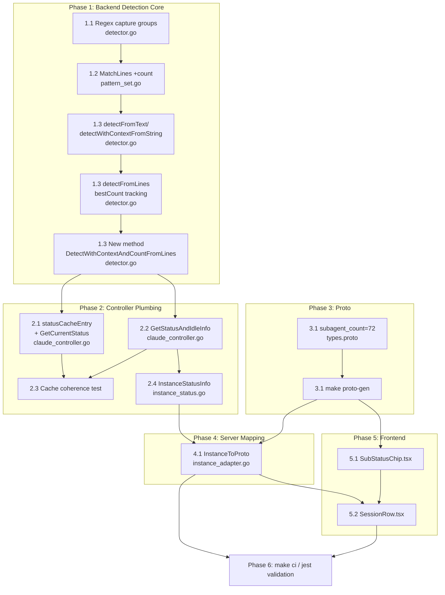

# Implementation Plan: subagent-spawn-tracking

Source: `project_plans/subagent-spawn-tracking/requirements.md`, `research/build-vs-buy.md`,
`research/features.md`, `research/stack.md`. All file paths and line numbers below were
re-verified directly against the repo during planning (2026-08-01) — several details in the
research docs were stale (notably the proto field number) and are corrected here.

## Step 0.5 — Creative pass: how does the count flow from regex match to proto field?

Three approaches considered:

**A. Thread the count as an additional positional return value** through the existing
`MatchLines → detectFromText → detectWithContextFromString → detectFromLines` call chain,
the same way `patternName`/`description` already travel together today.
*Strength:* the count is captured at the exact regex match that decided the status, so it can
never disagree with the status it's attached to. *Weakness:* touches ~6 function bodies across
2 files — the widest diff of the three options.

**B. Replace the tuple returns with a new `MatchResult` struct** (`Status`, `PatternName`,
`Description`, `SubagentCount`) threaded through the same chain.
*Strength:* extensible if a 5th field is ever needed. *Weakness:* bigger refactor than A for
no present benefit (still touches every call site, plus every tuple-unpacking caller), and
introduces a new exported type for one int — the "unjustified generic" smell this repo's own
`.claude/rules/interface-pollution-checklist.md` calls out.

**C. A second, independent regex pass** computed separately from status/desc (e.g. a standalone
`ExtractSubagentCount(lines []string) int` called by `ClaudeController` alongside, not inside,
the existing detection call).
*Strength:* zero signature changes anywhere in the existing detection chain — smallest visible
diff. *Weakness:* re-derives "which line/pattern won" independently of the status decision,
so it can silently disagree with it (e.g. status says `shells_still_running` matched, but the
independent pass's count comes from a `monitors_still_running` line elsewhere in the tail) —
this is exactly the multi-pattern-collision edge case research flagged, and duplicates the
three regexes into two places that must be kept in sync by hand.

**Chosen: A**, with one refinement discovered during file verification (not visible from the
research docs alone): the public method `DetectWithContextFromLines` is pinned by the
`TerminalDetector` interface (`session/detection/terminal_detector.go:10`) and used by
`review_queue_determiner.go` plus four test files. Changing its signature would ripple into
all of them for a feature only one caller (`ClaudeController`) needs. So instead of changing
`DetectWithContextFromLines` in place, a **new** sibling method
`DetectWithContextAndCountFromLines` is added; the old method is untouched and keeps its
2-value signature. See the Pattern Decisions table for the full rationale and rejected
alternatives (recorded there per instructions, not left blank).

## Step 1 — System type

Extension of an existing internal detection pipeline (Go) + one new proto scalar field +
one existing React component. **Not** a new service, not a new detection source (no JSONL,
no file-watching). Confirmed against `session/detection/*.go`, `proto/session/v1/types.proto`,
`web-app/src/components/sessions/SubStatusChip.tsx`.

## Step 2 — Domain Glossary

Every name below is what the implementation subagent must use verbatim.

| Term | Definition |
|---|---|
| `SubagentCount` | The parsed integer count of background agents / dynamic workflows / shells / monitors captured from the winning `WaitingForAgent` regex match on one detection pass. `0` whenever the winning status is not `StatusWaitingForAgent`, or the matched pattern's digit group failed to parse. |
| `WaitingForAgent` pattern group | The three existing `StatusPattern` entries in `getDefaultPatterns()` (`session/detection/detector.go`): `waiting_for_background_agent`, `shells_still_running`, `monitors_still_running`. Each gets a capturing group `(\d+)` added around its digit match. |
| `MatchLines` | Existing method `func (ps *PatternSet) MatchLines(text string, rawPTY []byte) (DetectedStatus, string, string)` in `session/detection/pattern_set.go`. Gains a 4th return value, `SubagentCount int`. |
| `detectFromText` | Existing private method on `*StatusDetector` (`session/detection/detector.go:249`) wrapping `MatchLines`. Gains a 4th return value, relayed straight through. |
| `detectWithContextFromString` | Existing private single-line method on `*StatusDetector` (`session/detection/detector.go:292`), used inside the multi-line scan loop. Gains a 3rd return value (count). |
| `detectFromLines` | Existing private multi-line reverse-scan method on `*StatusDetector` (`session/detection/detector.go:768`), shared implementation behind `DetectFromLines`/`DetectWithContextFromLines`. Gains a 3rd return value, `bestCount int`, tracked in lockstep with the existing `bestDesc` variable through every priority branch. |
| `DetectWithContextAndCountFromLines` | **New** exported method on `*StatusDetector`: `(lines []string) (DetectedStatus, string, int)`. The count-aware sibling of the untouched `DetectWithContextFromLines`. This is what `ClaudeController` switches to calling. |
| `statusCacheEntry.subagentCount` | New `int` field added to the existing tail-hash cache struct `statusCacheEntry` in `session/claude_controller.go:40`. Written by **both** `GetCurrentStatus` and `GetStatusAndIdleInfo` on every cache-miss `Store()` call — see cache-coherence note in Pattern Decisions / ADR-001. |
| `GetStatusAndIdleInfo` | Existing method on `*ClaudeController` (`session/claude_controller.go:955`). Return signature extended from `(detection.DetectedStatus, string, detection.IdleStateInfo)` to `(detection.DetectedStatus, string, detection.IdleStateInfo, int)` — count appended last. |
| `InstanceStatusInfo.SubagentCount` | New `int` field on the existing `InstanceStatusInfo` struct (`session/instance_status.go:12`), populated in `GetStatus()` from `GetStatusAndIdleInfo`'s new 4th return value. |
| `Session.subagent_count` | New `int32` field, number **72**, on the `Session` message in `proto/session/v1/types.proto`. Generates Go `Session.SubagentCount int32` and (after `make proto-gen`) TypeScript `Session.subagentCount: number`. |
| `SubStatusChipProps.subagentCount` | New optional `number` prop on the React `SubStatusChip` component (`web-app/src/components/sessions/SubStatusChip.tsx`). When present, `> 0`, and `subStatus === SubStatus.WAITING_FOR_AGENT`, interpolated into the existing chip's label text; otherwise the chip renders exactly as it does today. |

## Step 3 — Pattern selection & tech validation

Most of this feature is "no pattern needed, direct field/function" — stated explicitly per
component below, not forced into a GoF/PoEAA shape it doesn't need.

| Component | Pattern | Notes |
|---|---|---|
| Regex capture | Positional `FindStringSubmatch` + guarded `strconv.Atoi` | Direct code, no pattern. Matches the one precedent in-package (`approval.go`'s `extractCaptureGroups`) and the int-parse idiom at `session/git/worktree_git.go:372-375`: `if m := re.FindStringSubmatch(s); m != nil { if n, convErr := strconv.Atoi(m[1]); convErr == nil && n > 0 { ... } }`. |
| Count propagation through detection chain | Direct additional return value (no struct, no interface) | See Step 0.5. Rejected: result struct (speculative generic), independent second pass (correctness risk). |
| Cache | Existing `atomic.Pointer[statusCacheEntry]` copy-on-write cache, extended with one more field | No new caching mechanism. `xsync.Map` explicitly NOT used here — it's reserved for the controller *registry* in `instance_status.go`, a different concern (confirmed by reading both files). |
| Proto field | Plain scalar `int32`, unconditional set | No wrapper message, no `oneof`. Direct analog to `github_approved_count`/`github_changes_req_count` (`types.proto:36`/`39` per generated field, both plain `int32`). |
| Frontend | Extend existing `SubStatusChip` case, no new component | Matches the repo-wide `ComponentName.tsx` + `ComponentName.css.ts` colocation convention already used for `GitHubBadge`, `SourceBadge`, etc. — but reused in-place rather than duplicated, since the status enum (`WAITING_FOR_AGENT`) this count decorates already has a chip. |

**Non-standard / worth flagging explicitly:**
- Adding a *new* method (`DetectWithContextAndCountFromLines`) instead of changing an existing
  one in place is slightly unusual for a "just add a field" feature, but is required to avoid
  breaking the `TerminalDetector` interface contract (`terminal_detector.go:10`) and its five
  dependent files. This is the single most important non-obvious decision in this plan.
- `GetCurrentStatus` (`claude_controller.go:631`) must also be touched even though **nothing
  downstream of it currently needs the count** (its only caller, `claude_controller.go:1151`,
  already discards its `desc` return value) — purely for cache coherence with
  `GetStatusAndIdleInfo`, which shares the same `statusCache` pointer keyed by tail hash. See
  ADR-001.

An ADR is warranted for exactly one decision — the cache-coherence requirement is genuinely
non-obvious (found only by reading both cache-writing methods side by side) and would silently
under-report counts if skipped. See `decisions/ADR-001-subagent-count-cache-coherence.md`.

## Pattern Decisions (full table, alternatives recorded)

| Decision | Chosen | Alternative Rejected | Reason |
|---|---|---|---|
| Count extraction mechanism | 4th positional return threaded through `MatchLines → detectFromText → detectWithContextFromString → detectFromLines` | New `MatchResult` struct replacing all tuple returns | Codebase idiom throughout `session/detection` is multi-value tuple returns; a struct used at one call chain for a single new int is the "unjustified generic" smell (`interface-pollution-checklist.md` item 5). |
| | | Independent second regex pass, decoupled from status/desc | The winning status and its count must come from the *same* regex match (research's multi-pattern-collision edge case). A decoupled pass risks returning a count from a *different* line/pattern than the one that decided `StatusWaitingForAgent`. |
| Public API for count-aware callers | New method `DetectWithContextAndCountFromLines`, `DetectWithContextFromLines` left untouched | Change `DetectWithContextFromLines`'s signature in place | It's pinned by the `TerminalDetector` interface (`terminal_detector.go:10`) and consumed by `review_queue_determiner.go` + 4 test files; a signature change ripples into all of them for one caller that needs the count. `ClaudeController.statusDetector` is `atomic.Pointer[detection.StatusDetector]` (concrete type), so the new method is directly callable with zero interface change. |
| Multi-pattern collision (background-agent vs. shells vs. monitors) | "Winning line wins" — count comes from whichever line's match produced the returned `StatusWaitingForAgent`, per `detectFromLines`'s existing reverse-scan/priority logic (unchanged) | Sum all three counts across matched lines | Research's explicit recommendation: the three counters are semantically different (real subagents vs. background shells vs. monitors); summing would misrepresent "3 tasks" as one homogeneous pool. Matches existing regex-priority semantics — no new aggregation logic invented. |
| Reset-to-0 on status transition | No dedicated reset code. Count is computed fresh every detection pass and always written into `statusCacheEntry`/`InstanceStatusInfo`/proto; it's Go zero-value `0` whenever the winning status isn't `StatusWaitingForAgent`. | Explicit "clear count" step fired on a status-change event | Requirements: "mirror however the codebase already resets other transient per-turn state, don't invent a new mechanism." `desc`/`patternName` already reset this way (empty string on no match); count follows the identical convention. |
| Cache coherence between `GetCurrentStatus` and `GetStatusAndIdleInfo` | Both methods write `subagentCount` into every `statusCacheEntry{...}` they `Store()` | Only update `GetStatusAndIdleInfo`; leave `GetCurrentStatus` writing the zero value | Both share the same `atomic.Pointer[statusCacheEntry]` keyed by tail hash. If `GetCurrentStatus` runs first on a tail and stores a stale/zero count, a later `GetStatusAndIdleInfo` cache-*hit* on that same hash would silently under-report the count until the next miss. See ADR-001. |
| Proto field gating | `subagent_count` set unconditionally in `InstanceToProto` (no `IsControllerActive`/`ClaudeStatus != Unknown` guard) | Gate it behind the same guard as `DetectedStatus`/`DetectedContext` | `InstanceStatusInfo.SubagentCount` is already `0` by construction when the controller is inactive (per the reset-to-0 decision above); proto3 scalars don't distinguish unset from zero, so a guard branch would be a no-op that only adds a conditional for readers to double-check. |
| Frontend badge rendering | Extend the existing `WAITING_FOR_AGENT` case's chip text in place (`⏳ Waiting for {N} Agents` when `subagentCount > 0`, unchanged `⏳ Waiting for Agents` otherwise) | New standalone `SubagentCountBadge` component matching requirements' illustrative "⊕ N tasks" copy literally | `stack.md` confirms `SubStatusChip`/`SubStatusChip.css.ts` is the established pattern for this exact status; "⊕ N tasks" is illustrative product copy in the requirements doc, not a literal spec. A second component for the same status would duplicate `chipWaitingForAgent` styling for no behavioral gain. |
| Debounce for count flicker | None added | Minimum-count-hold, only-decrease-after-N-reads smoothing, or reusing `IdleDetectorConfig.DebounceDelay`'s pattern | Correction (pre-mortem.md top P1): an earlier draft of this row claimed no debounce precedent exists anywhere in this pipeline — that's false. `session/detection/idle.go`'s `IdleDetector` already has a `DebounceDelay` (500ms, `id.timeNow().Sub(id.lastStateChange) >= id.config.DebounceDelay`) that smooths `IdleState` transitions, and `IdleStateInfo` is returned in the *same tuple* as this feature's new count by `GetStatusAndIdleInfo`. The real distinction is narrower than "no precedent exists": `IdleDetector`'s debounce smooths its own `IdleState` field only — nothing in the codebase debounces `StatusDetector`'s `DetectedStatus`/count output, and `IdleDetector` is a structurally separate detector with its own state/config, not a shared mechanism `StatusDetector` could call into without new plumbing. Given the count is cosmetic-only (matches this feature's own accepted risk rating — see requirements.md Risk section), V1 still ships without debounce, but the decision is now stated honestly as "no *StatusDetector*-level precedent, despite one existing one level up in the same tuple" rather than "no precedent at all" — revisit with `IdleDetector`'s `DebounceDelay` as the concrete implementation template if flicker proves annoying in practice (Unresolved Question #4, updated). |
| Proto field number | `72` (verified: highest existing field on `Session` message is `71` / `workspace_key`, field `61` and `72+` are the only gaps/free slots — `61` skipped historically, so `72` is the first genuinely free number after the highest in-use field) | `57` (as research doc guessed) | Research was stale — `estimated_savings_mb=56`/`hidden=57` already existed at research time and the message has grown since to field `71` (`workspace_key`). Verified directly via `grep -noE "= [0-9]+;" proto/session/v1/types.proto` scoped to the `Session` message before writing this plan. |

*(Migration Plan section intentionally omitted — no database/ent schema changes in this feature.)*

## Observability Plan

- Extend the two existing conditional debug logs in `claude_controller.go` —
  `log.Debug("GetCurrentStatus: non-active result", ...)` (line ~698) and
  `log.Debug("GetStatusAndIdleInfo: non-active result", ...)` (line ~1036) — with one more
  structured field, `"subagent_count", count`, so a triage session doesn't have to re-derive
  the count by eye from the already-logged `tail_snippet`. No new unconditional logging added
  (these logs already only fire on ambiguous/non-active results).
- `DetectionEventSink`/`DetectionEvent` ring buffer (`session/detection/event_sink.go`) is left
  unchanged — `RecentEvents(n)` already records `status`/`patternName`/`cleanedText` per pass,
  and the count is reconstructable from `cleanedText` (the matched line) if ever needed. Adding
  a `SubagentCount` field to the ring-buffer schema is unnecessary scope for a display-only
  cosmetic feature (per requirements' own risk framing) and is not built here.
- No new metrics/counters. This is explicitly cosmetic per the requirements doc's own risk
  rating ("Miscounting is cosmetic, not functionally harmful").

## Risk Control

1. **Cache incoherence** (`GetCurrentStatus` vs. `GetStatusAndIdleInfo` sharing `statusCache`)
   — mitigated by the paired-write pattern decision above (both methods always populate
   `subagentCount`) plus a dedicated unit test (Task 2.3.1) asserting a `GetCurrentStatus()`
   call followed by `GetStatusAndIdleInfo()` on the *same* unchanged tail returns matching
   counts via the cache-hit path.
2. **`detectFromLines` refactor correctness** — this is the highest-line-count, most
   bug-prone task in the plan (threading `bestCount` through ~8 existing priority branches
   without disturbing the existing status/desc logic). Mitigated by: (a) splitting it into two
   small tasks (2.5–3 min each) that each touch a bounded line range, (b) the existing tests
   `TestStatusDetector_DetectFromLines_WaitingForAgent` and
   `TestStatusDetector_DetectFromLines_MonitorsStillRunning`
   (`session/detection/detector_test.go:145,158`) must keep passing **unmodified** as a
   regression gate before any new count-specific test is added.
3. **Known, accepted V1 limitations** (from research, explicitly not solved by this plan):
   scrollback truncation/clearing can cause a false reset to 0 while subagents are still
   running; reconnect/resume can show a stale/absent count if the replay window is smaller
   than the time since the last status line; the count can flicker in lockstep with poll
   cadence (no `StatusDetector`-level debounce exists to smooth it — see the corrected Pattern
   Decisions row above; `IdleDetector` has one but it doesn't cover this field). None of these are
   regressions introduced by this feature — they're pre-existing characteristics of the
   regex-over-scrollback detection model this feature reuses as-is.

## Unresolved Questions (explicitly deferred, not built)

1. JSONL-based per-subagent descriptions / tooltip — separate, materially larger backlog item
   (new file-watching + schema-parsing subsystem).
2. Aggregate `WORKING` state across parent + all subagents — depends on #1.
3. Distinguishing real Task-tool subagents from background shells/monitors — all three
   patterns intentionally collapse into one `subagent_count`; the badge shows one combined
   number in V1, per requirements' explicit scope decision.
4. Debounce/flicker smoothing — revisit only if flicker proves annoying in real usage. A
   precedent *does* exist one level up in the same status tuple (`IdleDetector.DebounceDelay`
   in `session/detection/idle.go`, smoothing `IdleState` transitions) — corrected from an
   earlier draft that claimed no precedent existed at all (see Pattern Decisions and
   pre-mortem.md P1). If revisited, `IdleDetectorConfig.DebounceDelay`'s 500ms
   last-state-change-timestamp pattern is the concrete template to copy for a `StatusDetector`-
   level equivalent — it does not exist there today and would be new plumbing, not a reuse.
5. Gating session-close/pause confirmation on a non-zero subagent count ("is it safe to end
   this session?") — noted by research as a real unstated need, out of scope for this feature.
6. Exact badge copy: this plan resolves it as "extend the existing chip text" (see Pattern
   Decisions), but the requirements doc's illustrative "⊕ N tasks" glyph was not used verbatim
   — flag for product feedback if a visually distinct glyph is wanted later.

## Dependency Visualization



---

# Phase/Epic/Story/Task Breakdown

Each task is 2–5 minutes, touches ≤3 files. File paths are exact and verified against the
repo as of this planning pass.

## Phase 1 — Backend Detection Core

### Epic 1.1 — Capture the count in the existing regex patterns

**Story 1.1.1 — Add capturing groups to the three `WaitingForAgent` patterns**

- **AC covered:** Requirement AC #1.
- **Given/When/Then:**
  - Given the `waiting_for_background_agent` `StatusPattern` in `getDefaultPatterns()`
  - When its `Pattern` field changes from `` [✻◉✦]\s+Waiting for \d+ (?:background agent|dynamic workflow) `` to `` [✻◉✦]\s+Waiting for (\d+) (?:background agent|dynamic workflow) ``
  - Then `regexp.MustCompile(pattern).FindStringSubmatch("✻ Waiting for 2 background agents to finish")` returns `["✻ Waiting for 2 background agent", "2"]` (match[1] == "2").

- **Task 1.1.1.1** (`session/detection/detector.go`, ~line 581): Change
  `Pattern: `[✻◉✦]\s+Waiting for \d+ (?:background agent|dynamic workflow)`` to
  `Pattern: `[✻◉✦]\s+Waiting for (\d+) (?:background agent|dynamic workflow)``. 1 file, ~2 min.
- **Task 1.1.1.2** (`session/detection/detector.go`, ~line 593): Change
  `Pattern: `\d+\s+shells?\s+(?:still\s+)?running`` to
  `Pattern: `(\d+)\s+shells?\s+(?:still\s+)?running``. 1 file, ~2 min.
- **Task 1.1.1.3** (`session/detection/detector.go`, ~line 603): Change
  `Pattern: `\d+\s+monitors?\s+still\s+running`` to
  `Pattern: `(\d+)\s+monitors?\s+still\s+running``. 1 file, ~2 min.

### Epic 1.2 — `MatchLines` returns the captured count

**Story 1.2.1 — Extend `MatchLines`'s signature and the `WaitingForAgent` branch**

- **AC covered:** Requirement AC #1, AC #5 (0/1/N/no-match test coverage).
- **Given/When/Then:**
  - Given `PatternSet.MatchLines(text string, rawPTY []byte) (DetectedStatus, string, string, int)` (new signature)
  - When called with `text = "✻ Waiting for 2 background agents to finish"`
  - Then it returns `(StatusWaitingForAgent, "waiting_for_background_agent", "Claude is waiting for one or more background agents or dynamic workflows to finish", 2)`.
  - Given the same call with `text = "Thinking..."` (no `WaitingForAgent` pattern matches)
  - Then the 4th return value (`SubagentCount`) is `0`.

- **Task 1.2.1.1** (`session/detection/pattern_set.go`): Change `MatchLines`'s signature to
  `(DetectedStatus, string, string, int)`. Add `"strconv"` import. In the `waitingForAgentRegexes`
  loop (currently `for i, regex := range ps.waitingForAgentRegexes { if regex.MatchString(text) { return StatusWaitingForAgent, ps.patterns.WaitingForAgent[i].Name, ps.patterns.WaitingForAgent[i].Description } }`),
  switch to `FindStringSubmatch`, and on match extract `SubagentCount` via
  `if m := regex.FindStringSubmatch(text); m != nil { count := 0; if len(m) > 1 { if n, convErr := strconv.Atoi(m[1]); convErr == nil && n > 0 { count = n } }; return StatusWaitingForAgent, ps.patterns.WaitingForAgent[i].Name, ps.patterns.WaitingForAgent[i].Description, count }`
  — the `len(m) > 1` guard (flagged in adversarial-review.md) is defensive insurance against a
  future pattern edit dropping/reordering the capture group; today's 3 patterns always produce
  `len(m) == 2` on match, so this guard is currently a no-op, not a behavior change
  (idiom from `session/git/worktree_git.go:372-375`). All other `return` statements in the
  function gain a trailing `, 0`. 1 file, ~5 min.
- **Task 1.2.1.2** (`session/detection/pattern_set_test.go`): Update the 3 existing calls
  (`ps.MatchLines(...)` at lines 23, 39, 56) to unpack 4 values (discard the 4th with `_`
  where not asserted). Add 3 new test functions:
  `TestPatternSet_MatchLines_should_returnCount_When_waitingForBackgroundAgentMatches` (assert
  count `2` for `"✻ Waiting for 2 background agents to finish"`),
  `TestPatternSet_MatchLines_should_returnCount_When_shellsStillRunningMatches` (assert count
  `1` for `"1 shell still running"`),
  `TestPatternSet_MatchLines_should_returnZero_When_noWaitingForAgentPatternMatches` (assert
  count `0` for `"Thinking..."`). 1 file, ~5 min.

### Epic 1.3 — Thread the count through `StatusDetector`'s single-line and multi-line chain

**Story 1.3.1 — Single-line wrappers (`detectFromText`, `detectWithContextFromString`)**

- **AC covered:** AC #1 (propagation, not yet the public API).
- **Given/When/Then:**
  - Given `detectFromText(text, rawPTY) (DetectedStatus, string, string, int)` (new signature)
  - When called with text containing `"◉ Waiting for 3 background agents to finish"`
  - Then its 4th return value is `3`, matching `ps.MatchLines`'s 4th return exactly (pure relay, no transformation).

- **Task 1.3.1.1** (`session/detection/detector.go:249`): Change `detectFromText`'s signature
  to `(DetectedStatus, string, string, int)`; body becomes `ps := sd.patternSet.Load(); return ps.MatchLines(text, rawPTY)` (unchanged — Go allows direct multi-value passthrough). 1 file, ~2 min.
- **Task 1.3.1.2** (`session/detection/detector.go:292`): Change
  `detectWithContextFromString(line string) (DetectedStatus, string)` to
  `(DetectedStatus, string, int)`. Body: `status, patternName, context, count := sd.detectFromText(text, rawPTY); sd.appendDetectionEvent(status, patternName, text); return status, context, count`. 1 file, ~3 min.
- **Task 1.3.1.3** (`session/detection/detector.go`): Update the *other* 3 call sites of
  `detectFromText` that don't yet need the count — `Detect` (line 275), `DetectWithContext`
  (line 284), and `DetectForProgram`'s fallback (`bsd.detectFromText`, line 756) — to unpack the
  new 4th value with `_`. (Correction from an earlier draft: the line-298 call site is inside
  `detectWithContextFromString` itself, already handled by Task 1.3.1.2 above — it is not a
  separate 4th call site and must NOT be touched again here.) These 3 public methods keep their
  existing 2/1-value signatures; count is intentionally NOT threaded further here, since none of
  them feed the live count pipeline — see Pattern Decisions. 1 file, ~3 min.

**Story 1.3.2 — Multi-line reverse scan (`detectFromLines`) — the delicate one**

- **AC covered:** AC #1 (multi-line/collision case), the "last-match-wins" Pattern Decision.
- **Given/When/Then:**
  - Given `detectFromLines(lines []string) (DetectedStatus, string, int)` (new signature)
  - When called with `lines = []string{"✻ Baked for 3s", "✻ Waiting for 1 background agent to finish"}` (the exact fixture from `TestStatusDetector_DetectFromLines_WaitingForAgent`, `detector_test.go:148-151`)
  - Then it returns `(StatusWaitingForAgent, "Claude is waiting for one or more background agents or dynamic workflows to finish", 1)`.
  - Given the multi-pattern-collision fixture `lines = []string{"✻ Waiting for 2 background agents to finish", "1 shell still running"}` (both real, both WaitingForAgent-classified, on different lines)
  - Then per the "winning line wins" decision, the returned count is whichever line's pattern produced the returned status under the existing reverse-scan priority (the last/most-recent line scanned that matches — line index 1, `"1 shell still running"` scanned first in reverse order — so count `1`, NOT the summed `3`).

- **Task 1.3.2.1** (`session/detection/detector.go:768-806`, first half of `detectFromLines`):
  Change signature to `(DetectedStatus, string, int)`. Add `bestCount := 0` alongside the
  existing `bestStatus, bestDesc := StatusUnknown, ""` declaration. In the CR-segment inner
  loop (lines ~780-806), change `s, desc := ...` calls to also capture count from
  `detectWithContextFromString`, and every `return s, desc` in this block becomes
  `return s, desc, count`; every `bestStatus, bestDesc = s, desc` becomes
  `bestStatus, bestDesc, bestCount = s, desc, count`. 1 file, ~5 min.
- **Task 1.3.2.2** (`session/detection/detector.go:807-843`, second half of `detectFromLines`):
  Same paired-edit treatment for the remaining branches — the `StatusReady`/`StatusExecuting`
  candidate-tracking block and the final `bestStatus == StatusExecuting` switch. Update the
  function's final `return bestStatus, bestDesc` to `return bestStatus, bestDesc, bestCount`.
  1 file, ~5 min.
- **Task 1.3.2.3** (`session/detection/detector.go:854-869`): Update `DetectFromLines`
  (public, status-only) to unpack 3 values and discard 2: `s, _, _ := sd.detectFromLines(lines); return s`.
  Update `DetectWithContextFromLines` (public, interface-pinned, **signature unchanged**) to
  unpack 3 and discard 1: `s, desc, _ := sd.detectFromLines(lines); return s, desc`. Add the
  **new** method directly below it:
  `func (sd *StatusDetector) DetectWithContextAndCountFromLines(lines []string) (DetectedStatus, string, int) { return sd.detectFromLines(lines) }`.
  1 file, ~3 min.

**Story 1.3.3 — Detector-level tests**

- **AC covered:** AC #5 (0/1/N/no-match coverage; existing tests continue to pass).
- **Given/When/Then:**
  - Given `sd := NewStatusDetector()` and the new `DetectWithContextAndCountFromLines` method
  - When called with `lines = []string{"✻ Cogitated for 18m 41s · 1 monitor still running"}` (real string from `detector_test.go:178`)
  - Then it returns `(StatusWaitingForAgent, "Background monitors still running — session not yet idle", 1)`.

- **Task 1.3.3.1** (`session/detection/detector_test.go`): Add
  `TestStatusDetector_DetectWithContextAndCountFromLines_should_returnCount_When_singleWaitingLine`
  using the fixture above, plus
  `..._should_returnZeroCount_When_statusIsNotWaitingForAgent` (fixture `["✻ Baked for 3s"]` →
  `StatusSuccess` or similar, count `0`). Do **not** modify the existing
  `TestStatusDetector_DetectFromLines_WaitingForAgent` /
  `TestStatusDetector_DetectFromLines_MonitorsStillRunning` (lines 145-171) — they call
  `DetectFromLines` (unchanged signature) and must keep passing byte-for-byte as the
  regression gate. 1 file, ~5 min.
- **Task 1.3.3.2** (`session/detection/detector_test.go`): Add
  `TestStatusDetector_DetectWithContextAndCountFromLines_should_notSumAcrossLines_When_multiplePatternsMatchDifferentLines`
  using the collision fixture
  `["✻ Waiting for 2 background agents to finish", "1 shell still running"]`, asserting the
  returned count is the winning line's count (per the "winning line wins" decision), not `3`.
  1 file, ~4 min.
- **Task 1.3.3.3** (`session/detection/detector_test.go`) — added per architecture-review.md
  CONCERN #2 (Task 1.3.2.1/1.3.2.2's two edited branches — the CR-segment (`\r`-split) inner
  loop and the `bestStatus == StatusExecuting` override switch — had no count-specific
  coverage; the reused status/desc-only regression tests can't catch a threading bug isolated
  to `bestCount`). Add
  `TestStatusDetector_DetectWithContextAndCountFromLines_should_carryCount_When_lineContainsCRSegments`,
  feeding a single line with an embedded `\r` where the segment *after* the final `\r` is the
  one containing `"✻ Waiting for 2 background agents to finish"` (mirrors the CR-collapsing
  fixture style already used in `detector_test.go`'s screen-overwrite tests), asserting count
  `2` survives the CR-segment loop. Add
  `TestStatusDetector_DetectWithContextAndCountFromLines_should_dropCount_When_laterStatusExecutingOverridesWaitingForAgent`,
  feeding `lines = []string{"✻ Waiting for 3 background agents to finish", "> "}` (a later
  `StatusReady`/`StatusExecuting`-candidate line overriding the earlier WaitingForAgent match
  per the existing override switch), asserting `bestCount` resets to `0` alongside the status
  override rather than leaking the stale `3`. 1 file, ~5 min.

## Phase 2 — Controller & Status Manager Plumbing

### Epic 2.1 — `statusCacheEntry` + `GetCurrentStatus`

**Story 2.1.1 — Cache struct and its first writer**

- **AC covered:** AC #4 (reset semantics rely on this cache never holding a stale count).
- **Given/When/Then:**
  - Given `statusCacheEntry{tailHash: h, status: StatusWaitingForAgent, desc: "...", subagentCount: 2}`
  - When `GetCurrentStatus()` is called again with an unchanged tail (same `tailHash`)
  - Then the cache-hit branch (`if sc := cc.statusCache.Load(); sc != nil && sc.tailHash == h`) returns without a fresh detection pass — the count `2` is implicitly preserved by the cache, not recomputed.

- **Task 2.1.1.1** (`session/claude_controller.go:40-44`): Add `subagentCount int` field to
  `statusCacheEntry` struct. 1 file, ~2 min.
- **Task 2.1.1.2** (`session/claude_controller.go:631-711`, `GetCurrentStatus`): Change line
  668's `status, desc := sd.DetectWithContextFromLines(lines)` to
  `status, desc, count := sd.DetectWithContextAndCountFromLines(lines)`. Change line 709's
  `cc.statusCache.Store(&statusCacheEntry{tailHash: h, status: status, desc: desc})` to
  `cc.statusCache.Store(&statusCacheEntry{tailHash: h, status: status, desc: desc, subagentCount: count})`.
  `GetCurrentStatus`'s own return signature stays `(detection.DetectedStatus, string)` — `count`
  is captured locally purely to populate the cache (see ADR-001), not returned. 1 file, ~4 min.

### Epic 2.2 — `GetStatusAndIdleInfo`

**Story 2.2.1 — Extend the combined status+idle accessor**

- **AC covered:** AC #1 (this is the sole feed into `InstanceStatusInfo`), AC #4.
- **Given/When/Then:**
  - Given a fresh (cache-miss) call to `GetStatusAndIdleInfo()` on a `ClaudeController` whose
    tail is `"✻ Waiting for 2 background agents to finish"`
  - When `GetStatusAndIdleInfo()` executes
  - Then it returns `(StatusWaitingForAgent, "<description>", <IdleStateInfo>, 2)` — the new
    4th value is `2`.
  - Given a *cache-hit* call immediately after (same tail, same `tailHash`)
  - Then the 4th return value is still `2`, read from `sc.subagentCount` on the cached entry
    (not recomputed), proving cache coherence with `GetCurrentStatus`'s writes from Epic 2.1.

- **Task 2.2.1.1** (`session/claude_controller.go:955-999`): Change `GetStatusAndIdleInfo`'s
  signature to `(detection.DetectedStatus, string, detection.IdleStateInfo, int)`. Add
  `var cachedCount int` alongside `cachedStatus`/`cachedDesc`; in the `statusHit` branch
  (line 988-992), also read `cachedCount = sc.subagentCount`. In the `if statusHit && idleHit`
  early return (line 997-999), append `cachedCount` to the returned tuple. 1 file, ~4 min.
- **Task 2.2.1.2** (`session/claude_controller.go:1000-1060`): In the cache-miss branch, add
  `var count int` alongside `status`/`desc`/`idleState` (line 1012-1014). In the `if statusHit`
  branch (line 1016-1017), set `count = cachedCount`; in the `else` branch (line 1018-1030),
  after `status, desc = sd.DetectWithContextFromLines(lines)` — change this call to
  `status, desc, count = sd.DetectWithContextAndCountFromLines(lines)`. In the `if !statusHit`
  cache-store block (line 1053-1055), add `subagentCount: count` to the `statusCacheEntry{}`
  literal. Update the function's final `return status, desc, buildIdleInfo(idleState)` (line
  1059) to `return status, desc, buildIdleInfo(idleState), count`. 1 file, ~5 min.

### Epic 2.3 — Controller-level tests

**Story 2.3.1 — Cache coherence and count correctness**

- **AC covered:** AC #4, AC #5, Risk Control item 1.
- **Given/When/Then:**
  - Given a `ClaudeController` with a fake PTY buffer containing
    `"✻ Waiting for 2 background agents to finish"`
  - When `GetCurrentStatus()` is called first, then `GetStatusAndIdleInfo()` is called
    immediately after (same unchanged buffer content)
  - Then `cc.statusCache.Load().subagentCount == 2` after both calls, and
    `GetStatusAndIdleInfo()`'s 4th return value is also `2` — the two methods never disagree.

- **Task 2.3.1.1** (`session/claude_controller_test.go`, near the existing
  `TestGetCurrentStatus_CacheHit` at line 704): Add
  `TestGetCurrentStatus_ThenGetStatusAndIdleInfo_should_shareSubagentCount_When_sameTailHash`
  following the existing test's setup pattern, asserting cache coherence per the GWT above.
  1 file, ~5 min.
- **Task 2.3.1.2** (`session/claude_controller_test.go`): Add
  `TestGetStatusAndIdleInfo_should_returnZeroCount_When_statusIsNotWaitingForAgent` (buffer
  content e.g. `"✻ Baked for 3s"`, asserting the 4th return value is `0`), demonstrating AC #4's
  reset-to-0 behavior end to end. 1 file, ~4 min.

### Epic 2.4 — `InstanceStatusInfo`

**Story 2.4.1 — Surface the count on the status-manager-level struct**

- **AC covered:** AC #1 (final backend hop before the proto adapter).
- **Given/When/Then:**
  - Given `InstanceStatusManager.GetStatus(instance)` where `instance`'s controller is active
    and its tail matches `"2 shells still running"`
  - When `GetStatus` executes
  - Then the returned `InstanceStatusInfo.SubagentCount == 2`.

- **Task 2.4.1.1** (`session/instance_status.go:12-21`): Add `SubagentCount int` field to the
  `InstanceStatusInfo` struct (with a one-line doc comment matching the style of the other
  fields, e.g. `// Count of background agents/shells/monitors from the WaitingForAgent
  detector; 0 unless ClaudeStatus == StatusWaitingForAgent.`). 1 file, ~2 min.
- **Task 2.4.1.2** (`session/instance_status.go:63-90`, `GetStatus`): Change line 76's
  `claudeStatus, statusContext, idleInfo := controller.GetStatusAndIdleInfo()` to
  `claudeStatus, statusContext, idleInfo, subagentCount := controller.GetStatusAndIdleInfo()`
  and add `info.SubagentCount = subagentCount` alongside the existing `info.ClaudeStatus = ...`/
  `info.StatusContext = ...` assignments (lines 77-79). 1 file, ~3 min.

## Phase 3 — Proto + Codegen

### Epic 3.1 — Add the field and regenerate

**Story 3.1.1 — `subagent_count` field**

- **AC covered:** AC #2, AC #6 (no new dependency — regeneration uses the existing toolchain only).
- **Given/When/Then:**
  - Given `proto/session/v1/types.proto`'s `Session` message with `workspace_key = 71` as its
    highest currently-used field
  - When `int32 subagent_count = 72;` is added and `make proto-gen` runs
  - Then `gen/proto/go/session/v1/types.pb.go` contains `SubagentCount int32` and
    `web-app/src/gen/session/v1/types_pb.ts` contains `subagentCount: number`, matching the
    exact camelCase convention already used for `github_approved_count` →
    `githubApprovedCount` (`types_pb.ts:275`).

- **Task 3.1.1.1** (`proto/session/v1/types.proto`, after line 239 / `workspace_key = 71;`):
  Before editing, re-run `grep -oE '= [0-9]+;' proto/session/v1/types.proto | ... ` (or open the
  `Session` message and scan its field numbers directly) to reconfirm `71`/`workspace_key` is
  still the highest-used field number at implementation time — the plan's own research draft
  guessed `57` and was later found stale during planning (drifted to `71`/`72` by the time this
  plan was written), so it can drift again between planning and implementation if other stories
  land first (per adversarial-review.md CONCERN #2). If the highest field number has changed,
  use the next free one instead of `72` and update this task's line/value accordingly. Then add
  ```protobuf
  // Count of active background agents/shells/monitors from the WaitingForAgent detector.
  // Only meaningful when detected_status == DETECTED_STATUS_WAITING_FOR_AGENT; 0 otherwise.
  int32 subagent_count = 72;
  ```
  1 file, ~2 min.
- **Task 3.1.1.2** (no source file — command): Run `make proto-gen` from the repo root. Verify
  via `git status`/`git diff --stat` that exactly two generated files changed:
  `gen/proto/go/session/v1/types.pb.go` and `web-app/src/gen/session/v1/types_pb.ts` (plus
  any connect stub files buf regenerates as a byproduct of the stamp check — verify no
  unrelated `.proto` drift). ~3 min.

## Phase 4 — Server Proto Mapping

### Epic 4.1 — `InstanceToProto`

**Story 4.1.1 — Copy the count onto the wire `Session` message**

- **AC covered:** AC #2 (count reaches the frontend), confirmed to ride the existing
  `WatchSessions` push per `research/features.md` §4 — no new streaming plumbing needed, since
  `convertEventToProto` (`server/services/event_converter.go:24,30`) already calls
  `adapters.InstanceToProto(event.Session, nil)` for both `EventSessionCreated` and
  `EventSessionUpdated`. The deprecated top-level `SessionUpdatedEvent.detected_status`/
  `detected_context` override fields (`proto/session/v1/events.proto:49,52`, explicitly marked
  "Deprecated once StatusBadge reads from session.detected_status directly (Epic 5)") are
  **not** replicated for `subagent_count` — confirmed unnecessary since the frontend reads the
  nested `session.detectedStatus`/`session.subStatus` fields, not the deprecated event-level
  shortcut, and this feature should not extend a pattern already being phased out.
- **Given/When/Then:**
  - Given `statusInfo.SubagentCount == 3` inside `InstanceToProto`
  - When `protoSession.SubagentCount = int32(statusInfo.SubagentCount)` executes
  - Then a `WatchSessions` client receives a `SessionUpdatedEvent.Session.subagent_count == 3`
    on the next push, with zero changes to `event_converter.go` or the event-level deprecated
    fields.

- **Task 4.1.1.1** (`server/adapters/instance_adapter.go:157-173`): Immediately after the
  existing `if statusInfo.IsControllerActive && statusInfo.ClaudeStatus != detection.StatusUnknown { protoSession.DetectedStatus = ...; protoSession.DetectedContext = ... }`
  block, add (unconditionally, per the proto-field-gating Pattern Decision):
  `protoSession.SubagentCount = int32(statusInfo.SubagentCount)`. 1 file, ~2 min.

## Phase 5 — Frontend

### Epic 5.1 — `SubStatusChip`

**Story 5.1.1 — Render the count in the existing `WAITING_FOR_AGENT` chip**

- **AC covered:** AC #3.
- **Given/When/Then:**
  - Given `<SubStatusChip subStatus={SubStatus.WAITING_FOR_AGENT} subagentCount={2} />`
  - When it renders
  - Then `screen.getByText(/2 Agents/)` is present, the chip's `aria-label` remains
    `"Waiting for agents"` (unchanged — no `aria-live` announcement spam on count-only churn,
    per design/ux.md AC-4's own reasoning), and its `title` attribute becomes
    `"Claude is waiting for 2 background agents to finish"` (changed from the static string —
    corrects a plan/UX contradiction flagged by cross-artifact consistency review: design/ux.md
    AC-4 requires `title` to carry the count for hover-only sighted users, since `aria-label`
    intentionally does not).
  - Given `<SubStatusChip subStatus={SubStatus.WAITING_FOR_AGENT} />` (no `subagentCount` prop,
    matching the existing `SubStatusChip.test.tsx` fixture at line 19)
  - When it renders
  - Then `screen.getByText(/Waiting for Agents/)` is present exactly as before, and `title`
    remains the original static `"Claude is waiting for background agents to finish"` — the
    existing assertion at `SubStatusChip.test.tsx:26` continues to pass unmodified.
  - Given `<SubStatusChip subStatus={SubStatus.WAITING_FOR_AGENT} subagentCount={-1} />` (or
    `NaN`, per design/ux.md AC-3 — an out-of-band value from a hypothetical future upstream
    parsing bug, not reachable via this plan's own `strconv.Atoi` guard which never produces
    negative/NaN, but tested here defensively since the chip is the last line of defense)
  - When it renders
  - Then it degrades to the plain `"Waiting for Agents"` / unchanged-`title` chip, identical to
    the no-prop case — never rendering `"-1 Agents"` or `"NaN Agents"`.

- **Task 5.1.1.1** (`web-app/src/components/sessions/SubStatusChip.tsx:18-20`): Add
  `subagentCount?: number;` to `SubStatusChipProps`. 1 file, ~2 min.
- **Task 5.1.1.2** (`web-app/src/components/sessions/SubStatusChip.tsx:30,34-44`): Update the
  function signature to `({ subStatus, subagentCount }: SubStatusChipProps)`. In the
  `SubStatus.WAITING_FOR_AGENT` case, compute
  `const hasCount = typeof subagentCount === "number" && Number.isFinite(subagentCount) && subagentCount > 0;`
  once, then use it for both the label and the title (guarding `NaN`/negative/non-finite per
  design/ux.md AC-3 — `Number.isFinite` rejects `NaN`, `subagentCount > 0` rejects negatives and
  `0`): change the label from the literal `⏳ Waiting for Agents` to
  `⏳ Waiting for {hasCount ? `${subagentCount} ${subagentCount === 1 ? "Agent" : "Agents"}` : "Agents"}`,
  and change `title="Claude is waiting for background agents to finish"` to
  `title={hasCount ? `Claude is waiting for ${subagentCount} background agent${subagentCount === 1 ? "" : "s"} to finish` : "Claude is waiting for background agents to finish"}`.
  Leave `className`, `role`, `aria-label` unchanged (this is the corrected version of this task —
  an earlier draft said "leave title unchanged," which cross-artifact consistency review
  flagged as contradicting design/ux.md AC-4; that contradiction is resolved here). 1 file,
  ~4 min.
- **Task 5.1.1.3** (`web-app/src/components/sessions/__tests__/SubStatusChip.test.tsx`): Update
  `renderChip` helper to accept an optional `subagentCount` param, or add a second helper.
  Add tests: `"renders count in Waiting for Agents chip when subagentCount > 0"` (assert
  `screen.getByText(/2 Agents/)` and `title` contains `"2 background agents"`), `"renders
  singular Agent for subagentCount === 1"` (assert `screen.getByText(/1 Agent\b/)`, not
  `/Agents/`, and `title` contains `"1 background agent to"`, not `"agents"`), `"omits count
  when subagentCount is 0"` (assert plain `screen.getByText(/Waiting for Agents/)` and the
  original static `title`, matching the existing test's behavior), `"omits count when
  subagentCount is negative"` (`subagentCount={-1}`, same plain-chip assertion — design/ux.md
  AC-3), `"omits count when subagentCount is NaN"` (`subagentCount={NaN}`, same plain-chip
  assertion — design/ux.md AC-3), `"renders large counts verbatim without clamping"`
  (`subagentCount={847}`, assert `screen.getByText(/847 Agents/)` — design/ux.md AC-6, added per
  cross-artifact consistency review NITPICK #4). Do not modify the existing test at line 23-27.
  1 file, ~7 min.

### Epic 5.2 — `SessionRow`

**Story 5.2.1 — Pass the count through to the chip**

- **AC covered:** AC #3 (end-to-end from `Session` proto to rendered badge).
- **Given/When/Then:**
  - Given a `session` prop with `session.subStatus === SubStatus.WAITING_FOR_AGENT` and
    `session.subagentCount === 3`
  - When `SessionRow` renders
  - Then `<SubStatusChip subStatus={session.subStatus} subagentCount={session.subagentCount} />`
    is invoked with both props, and the rendered chip text includes `"3 Agents"`.

- **Task 5.2.1.1** (`web-app/src/components/sessions/SessionRow.tsx:258`): Change
  `<SubStatusChip subStatus={session.subStatus} />` to
  `<SubStatusChip subStatus={session.subStatus} subagentCount={session.subagentCount} />`.
  1 file, ~2 min.

## Phase 6 — End-to-end validation

**Story 6.1 — Full regression pass (no code changes, verification only)**

- **AC covered:** AC #5, AC #6.
- **Given/When/Then:**
  - Given all Phase 1–5 tasks complete
  - When `make build && make test` runs from the repo root
  - Then it passes with zero failures, including unmodified
    `session/detection/detector_test.go`, `pattern_set_test.go`, `proto_mapping_test.go`,
    `session/detection/snapshot_test.go`, and the new tests added above.
  - Given the frontend changes
  - When `cd web-app && npx jest --no-coverage --testPathPatterns="SubStatusChip"` runs
  - Then all `SubStatusChip.test.tsx` cases pass, including the untouched pre-existing ones.
  - Given the full diff
  - When `git diff go.mod go.sum web-app/package.json` is inspected
  - Then it shows no changes — confirming AC #6 (no new external dependency).

- **Task 6.1.1**: Run `make build && make test`. Fix any compile/test failures found by
  re-checking the paired-edit sites in Story 1.3.2 first (most likely source of a missed
  `bestCount`/`count` thread). ~5 min (verification, not new code).
- **Task 6.1.2**: Run `cd web-app && npx jest --no-coverage --testPathPatterns="SubStatusChip"`.
  ~2 min.
- **Task 6.1.3**: Run `make lint`. Confirm no new lint findings (in particular: unused
  variable warnings if any `_` discard was missed in the tuple-unpacking edits from Epic 1.3).
  ~3 min.
