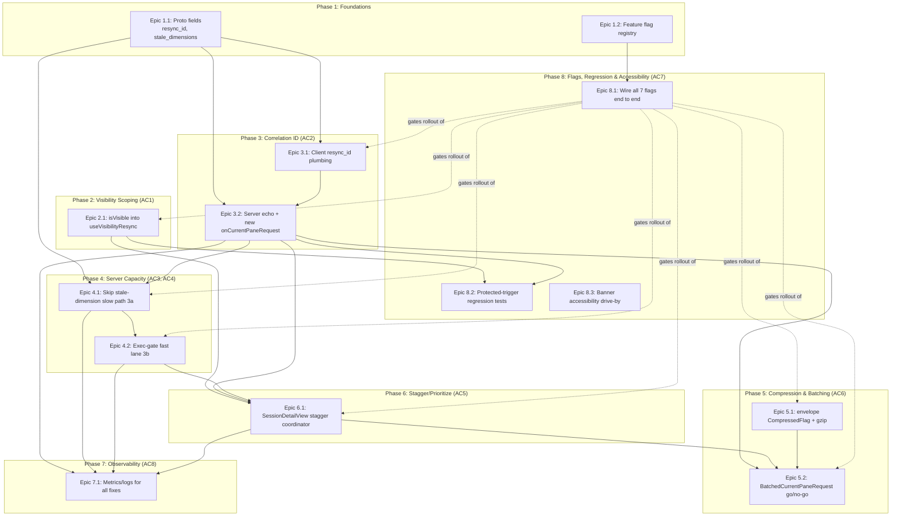

# Implementation Plan: Terminal Resync Reliability

**Project:** `terminal-resync-reliability`
**Source requirements:** `project_plans/terminal-resync-reliability/requirements.md`
**Research:** `project_plans/terminal-resync-reliability/research/{architecture,build-vs-buy,features,pitfalls,stack,ux}.md`
**Appetite:** Large (3-6 weeks) · **Complexity:** 4 (high-stakes/cross-cutting)

## Reach, Baseline & Phasing (Product Triad Review follow-ups)

**Reach estimate**: stapler-squad is a self-hosted, single-user-per-instance tool — `~/.stapler-squad/` state is per-instance, not multi-tenant, so there is no "N users" multiplier to justify effort against. The relevant scale question is concurrency per user: per `requirements.md`'s Users/Consumers, a typical user runs several concurrent Claude Code/Aider sessions, each session's `SessionDetailView` keeping multiple terminal instances mounted for keep-alive — so a single tab-focus event commonly bursts 4-10+ simultaneous resync requests today, well within reach of ordinary personal usage, not an edge case gated by scale. The Large appetite is justified against that: this is a correctness/reliability regression (disconnect/reconnect cycles, latent buffer-corruption risk) on the product's primary interaction surface, reproducible on ordinary use, not a rare-scale cosmetic issue.

**Baseline instrumentation before rollout**: `requirements.md`'s Success Metrics target stall-watchdog fires dropping to "near-zero," but no numeric baseline exists today — the only signal is a client console warning (Baseline section) with no capture mechanism. The Observability Plan's Task 7.1.1.5 (`resync_stall_watchdog_fired` analytics event, tagged by `visibility_state`) is the mechanism to produce one. Recommended sequencing: ship Task 7.1.1.5 alone first (it requires none of the other fixes) and let it run for at least one week against today's unmitigated behavior, so "near-zero" in the Success Metrics is measured against a real captured fire-rate number rather than an assumed one.

**Phasing rationale**: all 5 fix categories are planned as one Large-appetite effort rather than phased by confidence (e.g. shipping only visibility-scoping + correlation-ID first) because they share one flag-per-fix rollout mechanism (Epic 1.2) and one Observability Plan wired up front (Phase 7) — splitting into separate smaller efforts would mean re-deriving that shared infrastructure per slice for little added isolation, since every fix is already independently toggleable and independently reversible via its own flag. In practice, the Migration Plan's numbered rollout order below already provides the incremental de-risking a phased approach would: the two highest-confidence fixes (visibility-scoping, correlation-ID) ship and can be validated in production first, with the remaining fixes flipped on independently, later, and only after earlier ones are confirmed safe — so bundled *scope* does not mean bundled *rollout*.

## Step 0.5 — Creative Pass

| Decision area | Option A | Option B | Option C | Chosen |
|---|---|---|---|---|
| Mid-stream resync-answer transport | Extend `TerminalOutput` with a `resync_id` field — reuses the message with 10+ existing construction sites, zero new consumption code needed client-side. | Revive `CurrentPaneResponse` — purpose-built name, but confirmed dead code (zero construction/consumption sites today); reviving it means building both ends from scratch for no benefit over A. | New dedicated `ResyncCompleteAck` message — cleanest semantics but adds a third response shape to `TerminalData`'s oneof and a new client dispatch branch for no behavioral gain over A. | **A** — see ADR-002 |
| Correlating a resync reply on the control-mode streaming path | Add a new `onCurrentPaneRequest` callback to `runInputReadLoop`, mirroring the existing `onInput`/`onResize`/`onScrollbackRequest` pattern. | Duplicate `streamViaTmuxCapturePane`'s ~120-line mid-stream `CurrentPaneRequest` handler inline inside `streamViaControlMode` — duplicates logic that must stay behaviorally identical across two loops. | Route control-mode sessions through the capture-pane polling path for resync only — mixes two streaming strategies per-session, adds its own coordination bugs. | **A** — see ADR-005 |
| Exec-gate fast lane for resync-triggered capture/refresh calls | Dedicated gate key (e.g. `serverSocket + "#resync"`) with its own configurable slot count via `gateDir`. | Raise `defaultTmuxExecGateSlots` globally — simplest, but blast radius across *all* tmux operations, exactly the failure mode `requirements.md`'s Rabbit Holes warns about. | An in-process `rate.Limiter` — doesn't coordinate across the multiple OS processes that already share the flock-based gate for the same tmux server socket. | **A** — see ADR-003 |
| Client-side stagger mechanism for a burst of newly-visible terminals | Lift a small stagger coordinator into `SessionDetailView.tsx` (the one place that already mounts N `TerminalOutput` instances), issuing jittered/delayed resync triggers per-instance with priority for the just-focused one. | Per-instance random jitter inside `useVisibilityResync` itself — no shared knowledge of sibling count or which instance just became visible, so it can't implement "newly-focused preempts queued" from `research/ux.md`. | A shared module-level singleton queue — works but couples unrelated component trees through hidden module state, harder to test in isolation. | **A** |
| Stale-dimension disambiguation (Item 3a) | New client-asserted `stale_dimensions` boolean on `CurrentPaneRequest`, set from `document.visibilityState` at request-build time. | Server-side timing heuristic inferring staleness from time-since-last-output — `requirements.md`'s own Rabbit Holes note there is no reliable server-side signal for this. | Skip the slow path unconditionally whenever *any* `resync_id` is present — too broad, would also skip it for a genuinely-stale-dimension resync triggered by something other than backgrounding. | **A** — see ADR-005 |
| Compression mechanism (Item 5) | Transport-level `gorilla/websocket` permessage-deflate (`Upgrader.EnableCompression`) — negotiated natively by the browser, zero client code changes, but compresses the **whole connection**, not just resync traffic, which exceeds `requirements.md`'s Out-of-Scope boundary limiting Item 5 to resync payload compression. | Wire up the existing envelope-level `CompressedFlag` bit (`envelope.go:19`), scoped to `CurrentPaneRequest`/`TerminalOutput` payloads above a size threshold — requires first fixing the client's hard `ConnectError(Code.Internal)` throw on any compressed frame (`websocket-transport.ts:173-178`), but that fix is itself small and in scope (one `parseResponseBody` branch). | Application-level payload compression (e.g. gzip the `TerminalOutput.data` bytes before marshaling) without using the envelope's existing `CompressedFlag` bit — reinvents wire-framing signaling the envelope already has a bit reserved for. | **B** — see ADR-004 (revised) |
| Batching scope (Item 5) | New `BatchedCurrentPaneRequest` message coalescing multiple same-session/same-connection requests that Epic 5's staggering already delayed into one wire message; shipped as its own go/no-go-gated epic. | A general streaming-protocol rewrite (MOSH-style delta state sync) — explicitly named as Out of Scope / a Rabbit Hole in `requirements.md`. | Coalesce at the HTTP/WebSocket framing layer instead of the proto layer — would affect every message type, not just resync, expanding blast radius past what Item 5 asks for. | **A** |
| Feature-flag granularity | Seven per-fix flags (one per fix category, 3a/3b split), following the `TmuxExecGateConfig` config-driven pattern via `knownFeatureFlags`. | One umbrella `terminal:resync-fixes` flag — simpler to toggle, but a regression in one fix (e.g. batching) would force disabling five/six other independently-safe fixes; `requirements.md`'s Open Question #1 explicitly leans per-fix. | Two flags (client-side bundle, server-side bundle) — splits along the wrong axis; a single server-side regression (e.g. exec-gate fast lane) would still force disabling correlation-ID and stale-dimension-skip together. | **A** — see ADR-001 |
| Correlation-ID / pending-resync state-machine integration | Thread `resync_id` through `useTerminalFlowControl`'s and `useVisibilityResync`'s existing, separate pending-resync `Ref`s as-is; each hook independently gains ID-awareness. | Collapse the two hooks' pending-resync state machines into one shared state — explicitly named out of scope in `requirements.md`'s Constraints/Rabbit Holes unless it "falls out naturally"; it doesn't here since both hooks can gain ID-awareness without merging. | Move all pending-resync tracking server-side (server tracks "last resync_id per session," client just polls) — adds a new server-side state store for no benefit; the client already needs to know when *its own* resync completed to dismiss its own banner. | **A** |

## Step 1 — System Type

**Real-time bidirectional streaming system with a stateful client-side reconnection/resync protocol layered on a custom binary framing over WebSocket.** This is not a CRUD/request-response system: the core unit of work is a long-lived `TerminalData` stream per terminal instance, and this project's fixes are entirely about the *coordination* of that stream's resync sub-protocol (visibility scoping, correlation, server capacity, client-side pacing, and wire efficiency) — not about data modeling or storage.

## Step 2 — Domain Glossary

| Term | Definition |
|---|---|
| `TerminalData` | Outer proto message with a `oneof data` routing every client↔server terminal wire message (`proto/session/v1/events.proto:63-84`). |
| `TerminalOutput` | Proto message carrying raw terminal byte output to the client (`events.proto:124-126`); gains a new `resync_id` field (2) in this project. |
| `CurrentPaneRequest` | Proto message requesting a fresh full-pane capture — the resync request itself (`events.proto:195-214`); gains `resync_id` (field 6) and `stale_dimensions` (field 7) in this project. |
| `CurrentPaneResponse` | Proto message intended as `CurrentPaneRequest`'s dedicated answer; confirmed dead code (zero construction/consumption sites) and deliberately **not** extended by this project. |
| `resync_id` | New correlation-ID string threaded from a client `CurrentPaneRequest` through to the server's `TerminalOutput` reply, letting the client match a specific resync's completion instead of clearing on any ambient output. |
| `stale_dimensions` | New client-asserted boolean on `CurrentPaneRequest` signaling "these reported dimensions may be stale because this tab was backgrounded," letting the server skip its expensive resize-verify slow path. |
| `streamViaControlMode` | Server handler for the tmux-control-mode streaming path (`server/services/connectrpc_websocket.go:579`); today has no mid-stream `CurrentPaneRequest` handling at all. |
| `streamShellViaControlMode` | Control-mode streaming handler for shell-tab PTYs (`connectrpc_websocket.go:1083`), structurally parallel to `streamViaControlMode`. |
| `streamViaTmuxCapturePane` | Server handler for the capture-pane polling streaming path (`connectrpc_websocket.go:1634`); already has mid-stream `CurrentPaneRequest` handling, including the slow path this project optimizes. |
| `runInputReadLoop` | Shared WebSocket-read loop used by both control-mode handlers (`connectrpc_websocket.go:1488`), dispatching via `onInput`/`onResize`/`onScrollbackRequest` callbacks; gains a new `onCurrentPaneRequest` callback in this project. |
| `panePTY` | Interface abstracting pane capture/resize/refresh so `streamViaTmuxCapturePane` can target either an `*session.Instance` or a shell's sibling `*tmux.TmuxSession` (`connectrpc_websocket.go:1443-1450`); gains `CapturePaneContentPriority`/`RefreshTmuxClientPriority` methods in this project. |
| `ProcessManager` | Interface `session/process_manager.go:10`+, implemented by `*TmuxBackend`/`NativeProcessManager` (not `*tmux.TmuxSession` directly) and asserted directly by several test doubles (e.g. `stuckDialogProcessManager` in `session/session_driver_test.go`); `Instance.pm()` returns it. **Left unmodified in this project** — widening it to add priority methods would force every `ProcessManager`-satisfying type (including `NativeProcessManager`, which has no tmux server to prioritize against) and every test double asserting direct interface satisfaction to grow two new methods, breaking `go build ./...`. See `TmuxManager` below for where the priority methods actually land. |
| `TmuxManager` | Interface `session/tmux_process_manager.go`, implemented only by `*TmuxProcessManager` (its one test double, `mockTmuxManager`, embeds the interface rather than asserting direct satisfaction, so widening it is safe); gains `CapturePaneContentPriority()`/`RefreshClientPriority()` in this project, reached from `Instance` via a `i.processManager.(*TmuxBackend)` type assertion, not through `ProcessManager`. |
| `useVisibilityResync` | Client hook firing a full resync on `visibilitychange`/focus (`web-app/src/components/sessions/useVisibilityResync.ts`); gains visibility-gating and `resync_id`-awareness in this project. |
| `handleVisibilityOrFocusResyncInner` | `useVisibilityResync`'s debounced core handler (`useVisibilityResync.ts:108-168`); today fires unconditionally for every mounted terminal instance regardless of foreground/background state. |
| `pendingResyncCompletionRef` | Ref tracking whether a resync is in flight for the current session (`useVisibilityResync.ts:52`); becomes correlation-ID-aware in this project. |
| `notifyResyncOutputReceived` | Callback clearing a pending resync on any output (`useVisibilityResync.ts:200-219`); becomes `resync_id`-aware (clears only its own resync) in this project. |
| `bannerShownRef` | Ref tracking whether the 2s reconnecting-banner was actually shown for the current pending resync (`useVisibilityResync.ts:59`). |
| `useTerminalFlowControl` | Client hook owning resize/resync/input dispatch to the server (`web-app/src/lib/hooks/useTerminalFlowControl.ts`). |
| `requestFullResync` | `useTerminalFlowControl`'s function building/sending a `CurrentPaneRequest` (`useTerminalFlowControl.ts:80-135`); gains `resync_id` generation in this project. |
| `isResyncingRef` / `waitingForPaneResponseRef` | `useTerminalFlowControl`'s own pending-resync state (`useTerminalFlowControl.ts:42-43`) — deliberately left as a second, un-merged state machine per Rabbit Holes. |
| `resize` | `useTerminalFlowControl`'s throttled resize function (`useTerminalFlowControl.ts:197-291`); its post-resize `CurrentPaneRequest` follow-up (`:250-272`) also gains `resync_id`/`stale_dimensions=false` in this project. |
| `isVisible` / `foreground` | `TerminalOutput.tsx`'s existing prop (`:68`), already wired into `useTerminalStream`'s `foreground` option (`:535`) but — before this project — not into `useVisibilityResync` (`:538-549`). |
| `AcquireExecSlot` / `TryAcquireExecSlot` | `session/tmux/exec_gate.go`'s public API for acquiring one of N flock-backed execution slots gating concurrent tmux subprocess calls per server socket (`:41-52`, `:57-66`). |
| `runGated` / `runGatedErr` | `exec_gate.go`'s generic helpers (`:77-95`) wrapping a tmux subprocess call in an `AcquireExecSlot`; called from ~20 sites in `session/tmux/tmux.go` keyed on `t.serverSocket`. |
| `gateDir` | `exec_gate.go`'s function resolving the lock-file directory for a given gate key (`:101-115`); this project reuses it unmodified by passing a suffixed key string, not by changing its signature. |
| `AcquireResyncExecSlot` (new) | New function in `exec_gate.go` mirroring `AcquireExecSlot` but keyed on `serverSocket + "#resync"` and sized by `ResyncFastLaneSlots`, giving resync traffic an isolated slot pool. |
| `TmuxExecGateConfig` / `SlotsOrDefault` | `config/types.go:84-103`'s flag-controlled slot-count config (`defaultTmuxExecGateSlots=8`) — the established pattern this project's `ResyncFastLaneSlots` field follows. |
| `CapturePaneContentPriority` / `RefreshTmuxClientPriority` (new) | New methods threaded through `TmuxSession` → `TmuxManager` (not `ProcessManager` — see the `ProcessManager` row above for why) → `Instance` (reached via an `i.processManager.(*TmuxBackend)` type assertion, falling back to the plain non-priority calls for non-tmux-backed instances) → `panePTY`/`shellPanePTY`, using `AcquireResyncExecSlot` instead of the default gate. |
| `knownFeatureFlags` | `server/services/feature_flag_service.go:45-77`'s authoritative flag registry exposed via `GetFeatureFlags`/`UpdateFeatureFlag` RPCs; gains 7 new entries in this project. |
| `useFeatureFlag` | Client hook (`FeatureFlagsContext.tsx`) returning a named flag's boolean state from a one-time mount-time fetch — the mechanism every client-side epic here uses to check its flag. |
| `CompressedFlag` / `EndStreamFlag` | `server/protocol/envelope.go:19-20`'s envelope flag bits; `CompressedFlag` is defined but the client's `parseResponseBody` (`websocket-transport.ts:173-178`) currently throws a hard `ConnectError` if it's ever set. This project fixes that hard-throw first (Task 5.1.1.0), then sets `CompressedFlag` on gzip-compressed `CurrentPaneRequest`/`TerminalOutput` payloads above a size threshold (Task 5.1.1.1) — see ADR-004 (revised) for why whole-connection permessage-deflate was rejected in favor of this envelope-scoped approach. |
| `wsUpgrader` | `connectrpc_websocket.go:70-74`'s package-level `gorilla/websocket.Upgrader`. **Left unmodified in this project** — compression is scoped to the envelope-level `CompressedFlag` bit (see that row) instead of `EnableCompression` here, since whole-connection compression exceeded `requirements.md`'s Out-of-Scope boundary (ADR-004, revised). |
| `BatchedCurrentPaneRequest` (new) | New proto message coalescing multiple terminals' `CurrentPaneRequest`s bound for the same session/connection into one wire message; scope explicitly limited to same-session/same-connection batching. |
| `AC1`–`AC8` | This plan's acceptance criteria, defined in the Acceptance Criteria Coverage Summary below. |

## Step 3 — Pattern Selection

| Component | Pattern chosen | Alternative rejected |
|---|---|---|
| Resync-answer transport | Extend existing `TerminalOutput` message (Value Object extension) | Revive `CurrentPaneResponse` (dead code, zero benefit) |
| Control-mode mid-stream resync handling | New callback parameter on `runInputReadLoop`, mirroring `onInput`/`onResize` (Strategy-via-function-value, already this codebase's idiom — no new interface introduced) | Duplicate the capture-pane path's handler inline |
| Exec-gate fast lane | Dedicated gate key + dedicated config field, following `TmuxExecGateConfig`'s existing shape (Object Pool per priority class) | Raise shared slot count globally |
| Priority-aware pane capture | New concrete methods (`CapturePaneContentPriority`, `RefreshClientPriority`) threaded through the existing `TmuxManager`/`panePTY` interfaces (**not** `ProcessManager` — widening it would break every non-tmux `ProcessManager` implementer and every test double asserting it directly; reached from `Instance` via an `i.processManager.(*TmuxBackend)` type assertion instead) — no new interface, just two more methods on interfaces that already exist and already have exactly the implementations this project needs to touch | (1) Widening the shared `ProcessManager` interface directly — rejected, breaks `go build ./...` (see Domain Glossary `ProcessManager` row); (2) A generic `Capture[Priority](p Priority)` — rejected per this repo's own `interface-pollution-checklist.md` (#5, unjustified generic) and `primitive-obsession-checklist.md` (a `bool priority` parameter on the existing methods would be a same-typed-parameter smell; a distinct method name avoids it) |
| Client-side resync correlation | Value Object (`resync_id` as an opaque string token) generated once per resync attempt and threaded through both hooks' existing refs | A dedicated `ResyncCorrelationTracker` class — rejected per `interface-pollution-checklist.md` #4 (forwarding-only wrapper with no added behavior beyond what a string ref already gives) |
| Client-side stagger coordinator | A small scheduler co-located in `SessionDetailView.tsx` (the existing multi-instance mount point), holding a queue of pending resync callbacks with jittered delays | A module-level singleton queue (global mutable state, harder to test) |
| Feature flags | Per-fix boolean flags via `knownFeatureFlags` + `config.GetFeatureFlag`/`useFeatureFlag`, following `TmuxExecGateConfig`'s config-driven precedent | Single umbrella flag |
| Compression | Envelope-level `CompressedFlag` + gzip, scoped to resync payloads (client's hard-throw bug fixed first, Task 5.1.1.0) | Transport-level `gorilla/websocket` permessage-deflate — rejected, compresses the whole connection and exceeds `requirements.md`'s Out-of-Scope boundary (ADR-004, revised) |
| Batching | New `BatchedCurrentPaneRequest` proto message, same-session/same-connection scope only, own go/no-go flag | General streaming-protocol rewrite (Rabbit Hole) |

**Migration Plan**: No data migration — this project only adds new optional/defaulted proto fields (proto3 default-empty-string/default-false semantics mean old and new clients/servers stay wire-compatible with no version gate needed) and new default-off feature flags. Recommended rollout order, each step independently reversible via its own flag: (1) `terminal:resync-visibility-scope` → (2) `terminal:resync-correlation-id` → (3) `terminal:resync-skip-stale-dimension-slowpath` → (4) `terminal:resync-exec-gate-fast-lane` → (5) `terminal:resync-stagger` → (6) `terminal:resync-compression` → (7) `terminal:resync-batching`, decided last via its own go/no-go per Rabbit Holes. **Accepted trade-off**: `FeatureFlagsContext.tsx` fetches flags once on mount with no polling, so flipping a flag server-side does not affect already-open browser tabs until reload — acceptable because these are operator-controlled rollout flags, not user-facing settings, and each flag's `knownFeatureFlags` description will say so explicitly (Task 1.2.1).

## Observability Plan

Per `requirements.md`'s 5 Observability Requirements bullets, each maps to a concrete emission point:

1. **Resync burst size/frequency** — `SessionDetailView.tsx`'s new stagger coordinator (Epic 6) logs/counts how many sibling terminals requested a resync within the same visibility-change window.
2. **Stall/slow-path incidence** — `connectrpc_websocket.go`'s existing dimension-check-through-verify block (`:1971-2025`: dimension mismatch check, `ResizePTY`, SIGWINCH loop, verify) gets a log line (and, if `terminal:resync-skip-stale-dimension-slowpath` is on, a counter for how often the skip actually fires) — Epic 4 Task.
3. **Exec-gate wait time** — `AcquireResyncExecSlot` (new, Epic 4) logs slot-acquisition wait duration, mirroring `acquireSlot`'s existing debug logging shape in `exec_gate.go:120-151`. **Baseline (Task 4.2.1.0, Engineering triad follow-up)**: the pre-existing default `AcquireExecSlot` gate has never had its own queue-depth/wait-time baseline captured — Task 4.2.1.0 captures it against today's pre-fix load before the fast lane ships, so this metric's post-fix numbers have something real to compare against.
4. **Correlation-ID mismatch/drop** — when a `TerminalOutput.resync_id` arrives that does not match either hook's currently-pending ID, log at debug level instead of silently ignoring, so correlation bugs are visible during rollout (Epic 3 Task).
5. **Client-visible resync duration** — the existing `[resync] ... stall watchdog fired after 4000ms` console warning (baseline) is joined by a normal-path console debug logging total resync duration on success, so the metric exists in both the failure and success case (Epic 2 Task).

## Risk Control

| Risk | Mitigation |
|---|---|
| Flag flip is stale on already-mounted clients (`useFeatureFlag`'s one-time fetch) | Documented as an accepted trade-off (Migration Plan); flag descriptions in `knownFeatureFlags` state it explicitly. |
| Exec-gate fast lane starves the shared `"default"` pool if resync traffic dominates a socket | Fast lane gets its **own** bounded slot count (`ResyncFastLaneSlots`, default 4) via a separate gate key — never subtracted from the default pool's 8. |
| gzip CPU/latency cost on resync payloads above the size threshold is unmeasured | Ships default-off; Epic 5 (Task 5.1.1.3) includes a benchmark task before recommending default-on. |
| `resync_id` missing/empty on a client not yet upgraded mid-rollout | Server treats empty `resync_id` as "no correlation available," falling back to today's any-output-clears-pending heuristic — pure backward-compatible default, no version gate needed. |
| Batching/compression scope creep into a streaming-protocol rewrite | Batching is its own flag-gated epic with an explicit go/no-go decision point (Epic 8.2); a general rewrite is out of scope per `requirements.md` Rabbit Holes and this plan does not schedule one. |
| Accidentally modifying one of the 3 protected full-resync triggers (mount-time fit, manual Reconnect button, ResizeObserver-driven fit) while editing `useVisibilityResync.ts`/`TerminalOutput.tsx` | Every task touching those files calls out the protected trigger by name and line range as "do not modify"; Epic 9 adds a regression test asserting each trigger's call site is byte-for-byte unchanged. |
| New `onCurrentPaneRequest` control-mode handler diverges in behavior from the capture-pane path's handler over time | Shared logic (dimension-check, stale-dimension skip, response construction) is factored into one helper function called from both paths (Epic 3 Task), not copy-pasted. |

## Unresolved Questions

1. Final go/no-go for batching (Epic 8.2) is deferred until compression's (Epic 8.1) measured wire-size reduction is assessed against `requirements.md`'s Success Metrics — recorded as an explicit decision point inside Epic 8.2's story, not resolved in this plan.
2. `ResyncFastLaneSlots`' exact default (this plan picks 4, conservatively half of `defaultTmuxExecGateSlots`'s 8) is a placeholder pending real burst-size telemetry from Epic 7 — it is a runtime config value, re-tunable without a redeploy.
3. Whether gzip's CPU/latency cost is acceptable at production concurrency for resync-payload compression is unmeasured before this plan ships; Epic 5 (Task 5.1.1.3) includes a benchmark task gating the default-on recommendation.

## Dependency Visualization

---

## Phase 1 — Foundations (enables AC2, AC3, AC4, AC7)

### Epic 1.1 — Proto field additions

#### Story 1.1.1
*Given* the `CurrentPaneRequest` message at `proto/session/v1/events.proto:195-214`, *when* a client needs to correlate a resync reply and signal potentially-stale dimensions, *then* the message gains `string resync_id = 6;` and `bool stale_dimensions = 7;` after the existing `reserved 5;` line. *(AC2, AC3 GWT)*

- **Task 1.1.1.1**: In `proto/session/v1/events.proto`, add `string resync_id = 6;` and `bool stale_dimensions = 7;` to `CurrentPaneRequest` (after line 214's `reserved` block). 1 file.
- **Task 1.1.1.2**: In the same file, add `string resync_id = 2;` to `TerminalOutput` (`events.proto:124-126`). 1 file.
- **Task 1.1.1.3**: Run `make proto-gen` and commit the regenerated Go/TS bindings alongside the `.proto` change. 1 file (proto) + generated output.

### Epic 1.2 — Feature flag registration

#### Story 1.2.1
*Given* `server/services/feature_flag_service.go:45-77`'s `knownFeatureFlags` registry, *when* this project's 7 fixes each need an independent, operator-visible toggle, *then* 7 new `{name, description}` entries are appended, one per fix, each description noting the "not live-updated on already-open tabs" caveat where relevant. *(AC7 GWT: Given `knownFeatureFlags`, When `GetFeatureFlags` RPC is called, Then the response includes `terminal:resync-visibility-scope` through `terminal:resync-batching`, all defaulting to `false`.)*

- **Task 1.2.1.1**: Add `terminal:resync-visibility-scope` and `terminal:resync-correlation-id` entries to `knownFeatureFlags` (`feature_flag_service.go:45-77`). 1 file.
- **Task 1.2.1.2**: Add `terminal:resync-skip-stale-dimension-slowpath` and `terminal:resync-exec-gate-fast-lane` entries. 1 file.
- **Task 1.2.1.3**: Add `terminal:resync-stagger`, `terminal:resync-compression`, and `terminal:resync-batching` entries. 1 file.
- **Task 1.2.1.4**: Add a `ResyncFastLaneSlots int` field and `ResyncFastLaneSlotsOrDefault() int` method (default 4) to `TmuxExecGateConfig` in `config/types.go`, next to `defaultTmuxExecGateSlots`/`SlotsOrDefault` (`:84-103`). 1 file.
- **Task 1.2.1.5**: Add `FEATURE_META` label entries (`web-app/src/app/settings/features/page.tsx`'s `FEATURE_META: Record<string, {label: string}>`) for all 7 new flags added in Tasks 1.2.1.1-1.2.1.3, mirroring existing entries' shape (e.g. `{label: "Terminal: visibility-scoped resync"}` for `terminal:resync-visibility-scope`) — one label each for `terminal:resync-visibility-scope`, `terminal:resync-correlation-id`, `terminal:resync-skip-stale-dimension-slowpath`, `terminal:resync-exec-gate-fast-lane`, `terminal:resync-stagger`, `terminal:resync-compression`, `terminal:resync-batching`. Without this, the admin UI's `meta?.label ?? name` fallback displays the raw flag string instead of a human-readable label. 1 file.

---

## Phase 2 — Visibility-Scoped Resync (AC1)

### Epic 2.1 — Wire `isVisible` into `useVisibilityResync`

#### Story 2.1.1
*Given* `TerminalOutput.tsx`'s `isVisible` prop (already destructured at `:91` and passed as `foreground` to `useTerminalStream` at `:535`) but not passed to `useVisibilityResync` (`:538-549`), *when* a backgrounded terminal instance's tab becomes visible again while a *different* terminal instance is the one actually in the foreground, *then* only the foreground instance's `useVisibilityResync` fires a resync. *(AC1 GWT: Given a `SessionDetailView` with 3 mounted `TerminalOutput` instances where only session `"sess-2"` has `isVisible=true`, When `document.visibilitychange` fires, Then only `sess-2`'s `useVisibilityResync` calls `requestFullResync`, and sessions `"sess-1"`/`"sess-3"` do not.)*

- **Task 2.1.1.1**: In `web-app/src/components/sessions/useVisibilityResync.ts`, add an `isVisible: boolean` field to `UseVisibilityResyncParams` (`:12-27`, currently has no such field). 1 file.
- **Task 2.1.1.2**: In `handleVisibilityOrFocusResyncInner` (`:108-168`), add an early return when `!isVisible`, gated behind `terminal:resync-visibility-scope` (flag off ⇒ unchanged behavior). 1 file.
- **Task 2.1.1.3**: In `TerminalOutput.tsx`, pass `isVisible` into the `useVisibilityResync({...})` call site (`:538-549`) — do **not** touch the mount-time-fit, manual-Reconnect-button, or ResizeObserver-driven-fit call sites elsewhere in this file (protected triggers per `requirements.md` Constraints). 1 file.
- **Task 2.1.1.4**: Add a client test asserting a backgrounded (`isVisible=false`) instance's `handleVisibilityOrFocusResyncInner` is a no-op when the flag is on, and fires normally when the flag is off (regression guard for the flag's default-off safety). 1 file.

---

## Phase 3 — Correlation ID (AC2)

### Epic 3.1 — Client: generate and track `resync_id`

#### Story 3.1.1
*Given* `useTerminalFlowControl.ts`'s `requestFullResync` (`:80-135`), which today builds a `CurrentPaneRequest` object literal (`:116-121`) with no ID field, *when* a resync is requested, *then* a new opaque `resync_id` (e.g. `crypto.randomUUID()`) is generated, stored in `isResyncingRef`/`waitingForPaneResponseRef`'s existing pending-state alongside the boolean, and sent on the request. *(AC2 GWT: Given `useTerminalFlowControl` with `terminal:resync-correlation-id` on, When `requestFullResync()` is called, Then the outgoing `CurrentPaneRequest.resync_id` is a non-empty UUID string and `waitingForPaneResponseRef.current` records that same UUID.)*

- **Task 3.1.1.1**: Extract `paneUtils.ts`'s `generatePaneId` (`:8-13`) safe-ID-generation guard (`typeof crypto !== "undefined" && crypto.randomUUID`, falling back to `Math.random().toString(36).slice(2, 10)` outside a secure context — a bare `crypto.randomUUID()` call throws outside one) into a shared util, e.g. `generateSecureId()`, without the pane-ID-specific `.slice(0, 8)` truncation; optionally refactor `generatePaneId` itself to call it (optional — skip if it adds risk of touching unrelated pane-ID code). In `useTerminalFlowControl.ts`, generate a `resync_id` via this new `generateSecureId()` in `requestFullResync` (`:80-135`) and add it to the `CurrentPaneRequest` literal at `:116-121`, gated by `terminal:resync-correlation-id`. 1-2 files.
- **Task 3.1.1.2**: Extend `isResyncingRef`/`waitingForPaneResponseRef`'s stored value (`:42-43`) to carry the pending `resync_id`, not just a boolean. 1 file.
- **Task 3.1.1.3**: In the `resize` function's post-resize `CurrentPaneRequest` follow-up (`:250-272`, inside `doSend` at `:233-276`), set the same new `resync_id` generation and explicit `stale_dimensions: false` (resize-triggered resyncs are never stale-dimension resyncs). 1 file.
- **Task 3.1.1.4a**: `useVisibilityResync.ts` does not build its own `CurrentPaneRequest` — it triggers a resync via `requestFullResyncRef.current(true)`, which calls into `useTerminalFlowControl.ts`'s `requestFullResync`. **`stale_dimensions` must reflect "dimensions plausibly unchanged since backgrounding," not "this resync happened to be visibility-triggered"** (pre-mortem P1: setting it unconditionally on every visibility-triggered resync causes Epic 4.1 to skip `ResizePTY` even when a genuine resize occurred while the tab was hidden — e.g. OS window resize while minimized, monitor/DPI change, browser zoom — reintroducing the backgrounded-tab buffer-divergence/corruption bug this project exists to prevent). Add a ref tracking the last dimensions the client successfully synced (e.g. `lastSyncedDimensionsRef: {cols, rows}`), updated whenever a resync response is applied, alongside `isResyncingRef`/`waitingForPaneResponseRef`. 1 file, ~1h.
- **Task 3.1.1.4b**: In `requestFullResync` (`:80-135`), add a boolean parameter (e.g. `isVisibilityTriggered`) so the `CurrentPaneRequest` literal (`:116-121`) sets `stale_dimensions: isVisibilityTriggered && target_cols === lastSyncedDimensionsRef.current.cols && target_rows === lastSyncedDimensionsRef.current.rows` — i.e. `true` only when visibility-triggered **and** the client's current target dimensions match what it last successfully synced (no plausible resize since backgrounding); `false` when resize-triggered (mirroring Task 3.1.1.3) or when the visibility-triggered resync's target dimensions have diverged from the last synced values. Set `stale_dimensions` **unconditionally relative to `terminal:resync-correlation-id`** — it is metadata consumed by Epic 4.1's skip-logic and must NOT be gated behind `terminal:resync-correlation-id` (that flag only gates `resync_id` generation, a separate concern; gating `stale_dimensions` the same way would leave Epic 4.1's `terminal:resync-skip-stale-dimension-slowpath` check reading a field that was never set whenever only the correlation-ID flag happened to be off). Depends on Task 3.1.1.4a. 1 file, ~2h.
- **Task 3.1.1.4c**: Change `requestFullResync`'s return type from `void` to return the generated `resync_id` (or `undefined` when `terminal:resync-correlation-id` is off), and update `useVisibilityResync.ts`'s `handleVisibilityOrFocusResyncInner` (`:108-168`) to capture that return value and store it in `pendingResyncCompletionRef` (`:52`) — this is the only way `useVisibilityResync.ts` can learn the ID, since it does not build the request itself. Depends on Task 3.1.1.4b. 1 file, ~1-2h.
- **Task 3.1.1.4d**: Add a regression test that resizes a backgrounded pane's dimensions server-side, then triggers a visibility-driven resync, and asserts `stale_dimensions` is sent as `false` (so Epic 4.1 does not skip `ResizePTY`) and the client ends up with correctly-fitted, non-corrupted content — Task 4.1.1.3's existing test only covers "dimensions unchanged," never "dimensions genuinely changed while backgrounded." Depends on Tasks 3.1.1.4a-c. 1 file, ~1-2h.
- **Task 3.1.1.5**: In `useTerminalStream.ts`, change the `onOutput` prop type (`:47`) from `(output: string) => void` to `(output: string, resyncId?: string) => void`, and update its one call site (`:397-398`) to pass the parsed ID: `onOutput(text, msg.data.value.resyncId)` (`msg.data.value` is the parsed `TerminalOutput` proto, which gains `resync_id` per Task 1.1.1.2). In `TerminalOutput.tsx`, update `handleOutput` (`:458-466`) to accept `resyncId` as a second parameter and forward it — `notifyResyncOutputReceivedRef.current(resyncId)` instead of today's zero-argument call. Without this, Task 3.1.1.6 below would have no `resync_id` to match against. 2 files.
- **Task 3.1.1.6**: In `useVisibilityResync.ts`, change `notifyResyncOutputReceived`'s signature (`:200-219`) to accept an optional `resyncId: string` parameter (fed by Task 3.1.1.5's forwarding), and only clear `pendingResyncCompletionRef` when the received `resyncId` matches the stored one (fallback to today's any-output-clears behavior when `resyncId` is empty/undefined, per Risk Control — covers pre-rollout clients and the `terminal:resync-correlation-id`-off case). This narrows only `pendingResyncCompletionRef`'s own completion bookkeeping (banner-hiding, duration logging) to an exact ID match — clearing the stall-watchdog timer for a concurrently-outstanding, *different* `resync_id` is a separate concern, handled by Story 3.1.2 below. 1 file.

### Story 3.1.2 — Cross-hook stall-watchdog reconciliation
*Given* Task 3.1.1.6 narrows `notifyResyncOutputReceived`'s own completion bookkeeping (banner-hiding, duration logging) to an exact `resync_id` match, *when* two independently-tracked resyncs are outstanding at once — e.g. a visibility-triggered resync (`resync_id=V1`, tracked by `useVisibilityResync.ts`'s `pendingResyncCompletionRef`) and an independently-outstanding resize-triggered resync (`resync_id=R1`, tracked by `useTerminalFlowControl.ts`'s `waitingForPaneResponseRef`) — *then* R1's response arriving first must still clear/reset V1's stall-watchdog timer (proving the connection is alive), even though V1's own completion bookkeeping (banner, duration) correctly stays pending until V1's own response arrives. *(New GWT: Given a visibility resync `V1` and a resize resync `R1` both outstanding, with V1's 4000ms stall watchdog running, When `R1`'s `TerminalOutput{resync_id: "R1"}` response arrives at t=3000ms — before V1's own response — Then V1's stall watchdog is reset/cleared at t=3000ms [any known-outstanding ID counts as proof-of-life], but V1's banner is NOT hidden and its own duration log does NOT fire until V1's own `TerminalOutput{resync_id: "V1"}` response separately arrives.)*

- **Task 3.1.2.1**: In `TerminalOutput.tsx`, add a shared `outstandingResyncIdsRef` (e.g. `useRef<Set<string>>(new Set())`), populated by both hooks whenever either sends a resync request (add the ID in `useTerminalFlowControl.ts`'s `requestFullResync`/`resize`-follow-up and in `useVisibilityResync.ts`'s visibility/focus-triggered call; remove it once any output matching that ID is received). 3 files (the ref plus small add/remove hook-return additions in the two hook files).
- **Task 3.1.2.2**: In `handleOutput` (`TerminalOutput.tsx:458-466`), when a received `resyncId` is a member of `outstandingResyncIdsRef` (regardless of which hook's own pending ref it matches), call a new `resetStallWatchdog()` function exposed from `useVisibilityResync`'s return value — independent of Task 3.1.1.6's exact-ID-match completion logic, which still runs separately and may or may not fire for this same output event. 2 files.
- **Task 3.1.2.3**: Add a test for the GWT above: two outstanding `resync_id`s, the non-matching one's output arrives first, assert the stall watchdog is cleared/reset but the banner/duration-log for the still-pending one do not fire until its own matching output arrives. 1 file.
- **Task 3.1.2.4a** (Engineering triad follow-up — cross-ref `pre-mortem.md` P2 #5): the reconciliation above correctly avoids false stalls, but it also means a `resync_id` whose *own* server-side handling silently hangs/fails is masked forever if any *other* outstanding ID's output keeps resetting its watchdog. Add per-`resync_id` lifetime tracking to `outstandingResyncIdsRef`: record when each ID was added (e.g. switch the `Set<string>` to a `Map<string, number>` of ID → start timestamp) so a specific ID's elapsed outstanding time can be checked independent of the shared watchdog reset. 1 file, ~1h.
- **Task 3.1.2.4b**: Using Task 3.1.2.4a's per-ID timestamps, add escalation logic: if a specific ID exceeds a hard ceiling (e.g. 2x `RESYNC_STALL_TIMEOUT_MS`) despite repeated resets from sibling traffic, escalate (retry, or surface the banner) instead of waiting indefinitely. Depends on Task 3.1.2.4a. 1 file, ~1-2h.
- **Task 3.1.2.4c**: Extend Task 3.1.2.3's test: after a non-matching ID resets the watchdog, if the still-pending ID's own response never arrives, assert escalation eventually fires past the 2x ceiling. Depends on Task 3.1.2.4b. 1 file, ~1h.

### Epic 3.2 — Server: echo `resync_id`, add control-mode handling

#### Story 3.2.1
*Given* `streamViaTmuxCapturePane`'s existing mid-stream `CurrentPaneRequest` handler (`connectrpc_websocket.go:1930-2094`), *when* an incoming request carries a `resync_id`, *then* the constructed `TerminalOutput` response (`:2061-2068`) echoes it back on the new field 2. *(AC2 GWT: Given a `CurrentPaneRequest{resync_id: "abc-123"}` received mid-stream, When `streamViaTmuxCapturePane` responds, Then the resulting `TerminalOutput.resync_id == "abc-123"`.)*

- **Task 3.2.1.1**: In `connectrpc_websocket.go`, thread the incoming request's `resync_id` through to the `TerminalOutput` construction at `:2061-2068`, gated by `terminal:resync-correlation-id`. 1 file.
- **Task 3.2.1.2**: Factor the dimension-check + response-construction logic (`:1973-1991`, `:2028-2068`) into a shared helper function (e.g. `handleCurrentPaneRequest(target panePTY, req *sessionv1.CurrentPaneRequest, opts ResyncOptions) (*sessionv1.TerminalOutput, error)`) so Story 3.2.2's control-mode path calls the identical logic instead of a copy (Risk Control: divergence risk). **Primitive-obsession note (Engineering triad follow-up, per `.claude/rules/primitive-obsession-checklist.md`)**: Task 4.1.1.1 (`stale_dimensions` skip) and Task 4.2.1.7 (fast-lane priority calls) each add another same-typed `bool` parameter to this helper across the three epics that touch it — bundle them into a named `ResyncOptions{SkipStaleDimensionSlowPath, UseFastLane bool}` struct from the start instead of letting positional bools accrete one epic at a time. 1-2 files.
- **Task 3.2.1.3**: Update the post-resize snapshot `TerminalOutput` construction in `streamViaControlMode` (`:990-1018`) to also set `resync_id` when the triggering request had one (resize-follow-up resyncs go through this path too). 1 file.

#### Story 3.2.2
*Given* `runInputReadLoop`'s signature (`:1488-1497`) with `onInput`/`onResize`/`onScrollbackRequest` but no `onCurrentPaneRequest`, *when* a mid-stream `CurrentPaneRequest` arrives on the control-mode path, *then* a new `onCurrentPaneRequest func(req *sessionv1.CurrentPaneRequest) (*sessionv1.TerminalOutput, error)` callback (calling Task 3.2.1.2's shared helper) is dispatched, mirroring how `onScrollbackRequest` is already dispatched for `ScrollbackRequest`. *(AC2 GWT: Given `streamViaControlMode`'s WebSocket receives a `TerminalData{current_pane_request: {resync_id: "xyz"}}` frame mid-stream, When `runInputReadLoop` parses it, Then `onCurrentPaneRequest` is invoked and its returned `TerminalOutput{resync_id: "xyz"}` is written back on the stream.)*

- **Task 3.2.2.1**: Add the `onCurrentPaneRequest` parameter to `runInputReadLoop`'s signature (`:1488-1497`) and dispatch it inside the read loop's message-type switch, mirroring the existing `ScrollbackRequest` branch's marshal/write pattern. 1 file.
- **Task 3.2.2.2**: Pass a real `onCurrentPaneRequest` callback (using Task 3.2.1.2's shared helper against the `panePTY`-satisfying `instance`/`shellPanePTY`) at both call sites: `streamViaControlMode` (`:1020-1029` area) and `streamShellViaControlMode` (`:1083`+). 1 file.
- **Task 3.2.2.3**: Add a test exercising `runInputReadLoop` with a fake `onCurrentPaneRequest`, asserting it is invoked exactly once per `CurrentPaneRequest` frame and not for `ScrollbackRequest`/input/resize frames (guards against callback dispatch bugs, mirroring the existing `TestRunInputReadLoopExitsPromptlyOnConnectionClose`-style test file). 1 file.

---

## Phase 4 — Server Capacity Fixes (AC3, AC4)

### Epic 4.1 — Skip stale-dimension slow path (3a)

#### Story 4.1.1
*Given* the full dimension-check-and-verify block in `streamViaTmuxCapturePane` (`connectrpc_websocket.go:1971-2025`: the dimension-mismatch check, the `ResizePTY(targetCols, targetRows)` call, the 3x `RefreshTmuxClient()` SIGWINCH workaround + 100ms sleeps, a final 250ms sleep, and a verify `GetPaneDimensions()` call), *when* the incoming `CurrentPaneRequest.stale_dimensions` is `true` and `terminal:resync-skip-stale-dimension-slowpath` is on, *then* the **entire** block is skipped — including the `ResizePTY` call itself, not just the SIGWINCH/verify portion — and the handler captures at the pane's current server-side dimensions instead of the client's asserted target dimensions. This is deliberate, not just a speed optimization: `stale_dimensions=true` means the client's own `target_cols`/`target_rows` may themselves be stale (computed while backgrounded), so resizing the server-side pane to match them would apply a dimension the client itself doesn't trust. *(AC3 GWT: Given `CurrentPaneRequest{stale_dimensions: true, target_cols: 80, target_rows: 24}` where the pane's actual current dimensions differ from 80x24, and the flag on, When the mid-stream handler processes it, Then `ResizePTY()` and `RefreshTmuxClient()` are each called 0 times, `CapturePaneContent()` captures at the pane's existing [unresized] dimensions, and the response is returned in under 50ms of gate-wait time instead of 450ms+.)*

- **Task 4.1.1.1**: In `connectrpc_websocket.go`'s `Task 3.2.1.2` shared helper, add an early-skip branch wrapping the entire dimension-check-through-verify block (`:1971-2025` — this includes the `ResizePTY` call at `:1989`, not only the SIGWINCH loop at `:1993-2011`) when `req.StaleDimensions && featureFlagOn`, falling straight through to the existing `CapturePaneContent()` call at `:2028` with no resize attempted. 1 file.
- **Task 4.1.1.2**: Add a log line at the skip point (Observability Plan #2) noting the skip occurred, including `sessionID` and elapsed-time-saved estimate. 1 file.
- **Task 4.1.1.3**: Add a test asserting that when `stale_dimensions=true` + flag on: `ResizePTY()` is called 0 times (not just `RefreshTmuxClient()`), and the response captures at the pane's pre-existing dimensions even when they differ from the request's `target_cols`/`target_rows`; and that behavior is unchanged (`ResizePTY()` + 3x `RefreshTmuxClient()` calls still occur) when the flag is off or `stale_dimensions=false`. 1 file.

### Epic 4.2 — Exec-gate fast lane (3b)

#### Story 4.2.1
*Given* `session/tmux/exec_gate.go`'s `AcquireExecSlot` (`:41-52`) keyed only on `serverSocket`, *when* resync-triggered `CapturePaneContent`/`RefreshTmuxClient` calls need isolation from ordinary tmux traffic on the same socket, *then* a new `AcquireResyncExecSlot(ctx, serverSocket string) (release func(), err error)` acquires a slot from a **separate** pool keyed on `serverSocket + "#resync"` (via the existing, unmodified `gateDir`), sized by `ResyncFastLaneSlotsOrDefault()`. *(AC4 GWT: Given a tmux server socket already saturating its default 8-slot pool, When a resync-triggered capture calls `AcquireResyncExecSlot`, Then it acquires a slot from the separate 4-slot `"<socket>#resync"` pool without waiting on the default pool.)*

- **Task 4.2.1.0** (prerequisite, PM/Engineering triad follow-up): Before adding the fast-lane pool, capture a baseline queue-depth/wait-time metric on the pre-existing default `AcquireExecSlot` gate (`exec_gate.go:41-52`) under today's (pre-fix) resync load, using the same debug-log shape `acquireSlot` already emits (`:120-151`) — so Task 4.2.1.10's benchmark and Observability Plan #3's post-fix wait-time metric have a real pre-fix number to compare against, not just each other. 1 file.
- **Task 4.2.1.1**: In `exec_gate.go`, add `AcquireResyncExecSlot` and a `runGatedFastLane[T any]` helper mirroring `AcquireExecSlot`/`runGated` (`:41-95`), using `gateDir(serverSocket + "#resync")` and `ResyncFastLaneSlotsOrDefault()`. **Timeout decision (Engineering triad follow-up, resolving the open either/or)**: `runGated`'s existing `execGateAcquireTimeout` is 5s (`exec_gate.go:70`), which *exceeds* the client's 4s stall watchdog (`RESYNC_STALL_TIMEOUT_MS`) — under saturation, a slot acquisition that succeeds at, say, 4.5s still loses the race against the client's own timeout and the fix buys nothing. **Decision**: `runGatedFastLane` gets its own acquire timeout of **3s**, hardcoded as a package-level constant (e.g. `resyncFastLaneAcquireTimeout = 3 * time.Second`) rather than inheriting `execGateAcquireTimeout` unchanged. Rationale: 3s leaves a full 1s of margin under the 4s client-side `RESYNC_STALL_TIMEOUT_MS` ceiling for network/marshal/dispatch latency after the slot is acquired, so a fast-lane acquisition that succeeds right at the timeout boundary still has a realistic chance of completing the round-trip before the client gives up — a longer server-side timeout paired with "the fast lane rarely queues" was rejected because Task 4.2.1.10's own load-characterization benchmark exists precisely because queuing under saturation is the scenario being validated, not assumed away. If the benchmark later shows 3s is itself too tight (frequent fast-lane timeouts under realistic load), the constant can be tuned down further (never up past the 4s ceiling) as a follow-up informed by that data — this is a scoped tuning task, not a re-opening of the either/or. **Duplication note**: don't hand-copy `runGated`'s 11 lines (`:77-87`) into a new `runGatedFastLane[T any]` — factor a shared `runGatedWith[T any](ctx, serverSocket, timeout time.Duration, fn func() (T, error))` that both `runGated` (called with `execGateAcquireTimeout`) and the new fast-lane path (called with its own, shorter timeout) delegate to. 1 file.
- **Task 4.2.1.2**: In `session/tmux/tmux.go`, add `CapturePaneContentPriority() (string, error)` mirroring `CapturePaneContent` (`:2261-2292`) but calling `runGatedFastLane` instead of `runGated` at `:2274`. 1 file.
- **Task 4.2.1.3**: In `tmux.go`, add `RefreshClientPriority() error` mirroring `RefreshClient`'s Method 1 subprocess path (`:2211-2216`) but via `runGatedFastLane`. 1 file.
- **Task 4.2.1.4**: In `session/tmux_process_manager.go`, add `CapturePaneContentPriority() (string, error)` and `RefreshClientPriority() error` to the **`TmuxManager`** interface — **not** `ProcessManager`. `ProcessManager` is implemented by `NativeProcessManager` (no tmux server to prioritize against) and asserted directly by test doubles such as `stuckDialogProcessManager` (`session/session_driver_test.go`); widening it would break `go build ./...` for every non-tmux implementer and every such test double. `TmuxManager`'s only real implementer is `*TmuxProcessManager`, and its only test double, `mockTmuxManager`, embeds the interface rather than asserting direct satisfaction, so widening `TmuxManager` is safe. Implement both methods on `*TmuxProcessManager`, forwarding to Tasks 4.2.1.2/4.2.1.3's new `*tmux.TmuxSession` methods. 1 file.
- **Task 4.2.1.5**: In `session/instance_tmux.go`, add `Instance.CapturePaneContentPriority()`/`Instance.RefreshTmuxClientPriority()` using the type-assertion idiom to reach `TmuxManager` only for tmux-backed instances: `if tb, ok := i.processManager.(*TmuxBackend); ok { return tb.TmuxManager().CapturePaneContentPriority() }`, falling back to the plain `i.pm().CapturePaneContent()`/`i.pm().RefreshClient()` for non-tmux-backed instances (where there is no fast lane to reach, and the plain call is a correct, if unoptimized, behavior). Do **not** add these methods to the `ProcessManager` interface itself — see Task 4.2.1.4. **Cross-ref `pre-mortem.md` P2 #4** (silent fallback masks a broken assertion, not just a deliberate flag-off no-op): add a debug-level log/counter on the assertion's failure branch specifically when `terminal:resync-exec-gate-fast-lane` is on, distinguishing "flag on but this instance couldn't use the fast lane" from the flag-off case, so a silent-fallback rate is directly measurable instead of inferred from an unmoved top-line metric. 1 file.
- **Task 4.2.1.6**: In `connectrpc_websocket.go`, add `CapturePaneContentPriority()`/`RefreshTmuxClientPriority()` to the `panePTY` interface (`:1443-1450`) and implement both on `shellPanePTY` (`:1454-1467`). 1 file.
- **Task 4.2.1.7**: In the Task 3.2.1.2 shared helper, call the `...Priority()` variants instead of the plain ones when `terminal:resync-exec-gate-fast-lane` is on. 1 file.
- **Task 4.2.1.8**: Add a test asserting `AcquireResyncExecSlot` and `AcquireExecSlot` for the same `serverSocket` draw from independent slot pools (acquiring all of one's slots does not block the other). 1 file.
- **Task 4.2.1.9** (Engineering triad follow-up — implementer compile-safety): Tasks 4.2.1.2-4.2.1.6 widen `TmuxManager` and `panePTY`, interfaces with more than one implementer/test-double. Before merging, run `go build ./...` and explicitly verify every known implementer compiles against the new methods: `TmuxManager` — real impl `*TmuxProcessManager` (`session/tmux_process_manager.go:502`), test double `mockTmuxManager` (`session/tmux_backend_test.go:22`, embeds the interface so it's unaffected) and `deadPaneMock` (`session/health_test.go:138`); `panePTY` — real impls `*session.Instance` and `shellPanePTY` (`connectrpc_websocket.go:1454`), no test doubles found. 1 file (no code change, a checklist/CI step).
- **Task 4.2.1.10a** (Engineering triad follow-up — mandatory per `requirements.md`'s load-characterization requirement; also addresses `pre-mortem.md` P2 #2): Build the concurrent-saturation benchmark harness: exercise the shared 8-slot default pool and the 4-slot fast-lane pool concurrently saturated on one `serverSocket` (default 8 + fast lane 4 = 12 simultaneous tmux subprocess calls), measuring resync latency and gate-wait time under combined saturation. 1 file, ~2-3h.
- **Task 4.2.1.10b**: Extend Task 4.2.1.10a's harness with non-resync-traffic corruption assertions: while the fast lane is saturated, assert no tmux-server-level errors/garbled output on the *non-resync* traffic sharing that socket — not just resync latency. See `pre-mortem.md` P2 #2 for why the combined 12-slot ceiling was never validated as safe against tmux's single-threaded server. Depends on Task 4.2.1.10a. 1 file, ~2h.
- **Task 4.2.1.10c**: Wire the must-pass gate into the rollout checklist: this benchmark **must run and pass before `terminal:resync-exec-gate-fast-lane` is enabled by default** — add it as an explicit precondition in the flag's rollout/CI documentation (e.g. alongside Epic 7's flag-rollout tasks) so enabling the flag by default without a green run of Tasks 4.2.1.10a/b is a documented process violation, not just an implicit expectation. Depends on Task 4.2.1.10b. 1 file, ~1h.

---

## Phase 5 — Compression & Batching (AC6)

### Epic 5.1 — Resync-scoped envelope compression

#### Story 5.1.1
*Given* the envelope-level `CompressedFlag` bit (`server/protocol/envelope.go:19`) which the server never sets and which the client's `parseResponseBody` (`websocket-transport.ts:173-178`) currently hard-throws `ConnectError(Code.Internal)` on if it's ever set, *when* `terminal:resync-compression` is on and a `CurrentPaneRequest`/`TerminalOutput` payload's size exceeds a threshold (e.g. 1KB), *then* the payload is gzip-compressed, `CompressedFlag` is set on its envelope, and the client transparently decompresses it before parsing — scoped to resync traffic only, not the whole connection (whole-connection `permessage-deflate` was rejected as exceeding `requirements.md`'s Out-of-Scope boundary; see ADR-004, revised). *(AC6 GWT: Given the flag on and a `TerminalOutput` payload above the size threshold, When the server sends it, Then the envelope's `CompressedFlag` bit is set and the payload bytes are gzip-compressed; When the client receives it, Then it decompresses the payload before proto-unmarshaling, with no user-visible difference from an uncompressed frame.)*

- **Task 5.1.1.0** (prerequisite): Fix the client's hard-throw-on-compressed-frame bug in `parseResponseBody` (`websocket-transport.ts:173-178`) — replace the `throw new ConnectError(...)` branch with an actual decompression path (e.g. `DecompressionStream('gzip')`, available in all browsers this app targets) before proto-unmarshaling the payload. Without this fix, setting `CompressedFlag` from the server would break every connected client. 1 file.
- **Task 5.1.1.1**: In the Task 3.2.1.2 shared helper (and its control-mode counterparts), when `terminal:resync-compression` is on and the constructed `TerminalOutput`'s marshaled size exceeds a size threshold (e.g. 1024 bytes), gzip-compress the envelope payload and set `CompressedFlag` (`envelope.go:19`) — following `server/middleware/gzip.go`'s pooled-writer pattern (a new pool instance, not the literal shared HTTP-response pool, since that pool is scoped to HTTP responses). 1-2 files.
- **Task 5.1.1.2**: Verify/extend the client's `parseResponseBody` decompression path (Task 5.1.1.0) to correctly handle `CurrentPaneRequest`-triggered `TerminalOutput` frames specifically (the resync response path), since that's the only message type this project sets `CompressedFlag` on. 1 file.
- **Task 5.1.1.3**: Add a benchmark task/script measuring CPU/latency overhead of gzip-compressing resync payloads under concurrent resync bursts, per Risk Control/Unresolved Question #3, before recommending default-on. 1 file.
- **Task 5.1.1.4**: Add a round-trip test: server sets `CompressedFlag` + gzips a `TerminalOutput` above the threshold, client decompresses and proto-unmarshals it, and the resulting `TerminalOutput.resync_id`/`data` match the pre-compression values exactly. 1 file.
- **Task 5.1.1.5** (Engineering triad follow-up): `requirements.md` Success Metric #4 (wire-size/byte-count reduction) is unprovable without a before/after measurement — add a log/counter at the Task 5.1.1.1 compression point recording pre- and post-compression payload byte counts (and, once Epic 5.2 batching lands, the pre-batch request count), so the metric can be computed from real emitted data instead of asserted by construction. 1 file.

### Epic 5.2 — Batching go/no-go

#### Story 5.2.1
*Given* `requirements.md`'s Rabbit Holes instruction to treat batching as "its own epic with an explicit go/no-go," *when* Epic 6's stagger coordinator (Phase 6) already delays multiple same-session resync requests, *then* a new `BatchedCurrentPaneRequest` message (coalescing N `CurrentPaneRequest`s bound for the same connection) is built and flag-gated, but the go/no-go decision to enable it by default is deferred until Epic 5.1's compression numbers are in (Unresolved Question #1). *(AC6 GWT: Given `terminal:resync-batching` off [default], When the stagger coordinator delays 3 sibling resyncs, Then they are still sent as 3 separate `CurrentPaneRequest`s, unchanged from today.)*

- **Task 5.2.1.1**: Add `BatchedCurrentPaneRequest { repeated CurrentPaneRequest requests = 1; }` to `events.proto`, added to `TerminalData`'s oneof at the next free field number (verify against `:63-84`'s reserved ranges before assigning). 1 file.
- **Task 5.2.1.2**: Add server-side handling unpacking a `BatchedCurrentPaneRequest` into N calls to the Task 3.2.1.2 shared helper, responding with N individually-`resync_id`-tagged `TerminalOutput`s (batching must not break per-request correlation). 1-2 files.
- **Task 5.2.1.3**: Add client-side batching in the Phase 6 stagger coordinator: when `terminal:resync-batching` is on, coalesce same-tick resync requests into one `BatchedCurrentPaneRequest` instead of N separate sends. 1 file.
- **Task 5.2.1.4**: Document the go/no-go decision point explicitly in this story (not resolved by this plan) and record the eventual decision + supporting numbers as a follow-up ADR once Epic 5.1's benchmark lands.

---

## Phase 6 — Stagger / Prioritize Resync Bursts (AC5)

### Epic 6.1 — `SessionDetailView.tsx` stagger coordinator

#### Story 6.1.1
*Given* `SessionDetailView.tsx`'s 4 `isVisible` wiring sites (`:741`, `:760`, `:846`, `:868`) already tracking which mounted `TerminalOutput` instance is foreground, *when* multiple sibling instances become visible in the same burst (e.g. a browser tab regaining focus with several session tabs open), *then* a new small coordinator jitters/delays each instance's resync trigger and lets a just-focused instance's resync preempt any still-queued ones. *(AC5 GWT: Given 3 sibling `TerminalOutput` instances all becoming visible within 50ms of each other, When the stagger coordinator processes the burst, Then their `requestFullResync` calls are spread across a jittered window [e.g. 0-300ms] rather than firing within the same tick, and if the user then clicks a 4th, not-yet-queued instance, its resync fires immediately ahead of the still-queued 3.)*

- **Task 6.1.1.1**: In `SessionDetailView.tsx`, add a small stagger-queue module (co-located, not a new file, per Interface Pollution checklist #4 — a forwarding wrapper here would add no behavior) holding pending resync callbacks with jittered `setTimeout` delays, gated by `terminal:resync-stagger`. 1 file.
- **Task 6.1.1.2**: Wire the 4 `isVisible` sites (`:741`, `:760`, `:846`, `:868`) to enqueue into the stagger queue instead of firing `useVisibilityResync`'s resync immediately, when the flag is on. 1 file.
- **Task 6.1.1.3**: Implement the "newly-focused preempts queued" behavior: when an instance's `isVisible` flips `true` while others are still queued, move it to the front / fire it immediately. 1 file.
- **Task 6.1.1.4**: Add a client test simulating a 3-instance visibility burst and asserting resync calls are spread across the jitter window, plus a preemption test for the 4th-instance case. 1 file.
- **Task 6.1.1.5** (Engineering triad follow-up — cross-ref `pre-mortem.md` P2 #3; round-2 Engineering review: resolved, not left as an unreconciled open question): the stagger coordinator above is scoped per-`SessionDetailView` (per session), but `requirements.md`'s Users/Consumers names multiple concurrent sessions per user as the dominant pattern — a single tab-focus event fires for every mounted `SessionDetailView` at once, so N sessions' independently-staggered coordinators can still recreate a synchronized burst at the session level, and (if sessions share a tmux socket) still saturate the shared 4-slot fast lane. **Decision (option (b) — amend the Success Metric's scope, not build a cross-session coordinator)**: `requirements.md`'s Success Metrics section is amended with an explicit scope note: the "stall-watchdog fires drop to near-zero" and "no N simultaneous full-resync requests" metrics are measured **per session** (i.e., across the terminals mounted within one `SessionDetailView`), not across a user's full set of concurrently open sessions. Rationale for accepting this initial scope: (1) the primary, most-reported failure mode per the Problem Statement/Baseline is a single session's own multiple terminal instances resyncing together — that's what this Large-appetite effort targets and what Epic 6.1's fixes measurably eliminate; (2) a synchronized burst *across* several simultaneously-open sessions is a narrower, compounding condition (requires multiple sessions open **and** sharing a tmux socket **and** the same tab-focus instant) — smaller and rarer than the primary single-session burst; (3) building a cross-session, page-wide coordinator (a module-level/`AnalyticsContext`-sibling scheduler spanning every mounted `SessionDetailView`) is a materially different architecture (global mutable scheduling state instead of a component-local queue) that would expand this project's blast radius rather than extend it. This cross-session gap is **not silently deferred**: it is tracked as its own explicit follow-up item (file as a `sdd:fix-bug`-tracked backlog item once this project ships, referencing this task and `pre-mortem.md` P2 #3), separate from and in addition to the regression test below. Add an explicit test with 2+ `SessionDetailView`s mounted simultaneously asserting today's known limitation (combined cross-session fan-out is *not* staggered), so the gap is documented by a test rather than silently unverified, in addition to the tracked follow-up item.
- **Task 6.1.1.6** (Engineering triad follow-up): the stagger queue's pending `setTimeout` callbacks (Task 6.1.1.1) have no unmount-cleanup task — if a `SessionDetailView` (or one of its terminal instances) unmounts while a resync is still queued/jittered, the pending callback can fire against stale refs/a stale closure after unmount. Add a cleanup (`clearTimeout` on unmount, e.g. via a `useEffect` cleanup function) for every pending stagger timeout, plus a test asserting no callback fires after unmount. 1 file.
- **Task 6.1.1.7** (UX triad follow-up — `design/ux.md` §3 "Manual QA checklist"): the 2s/4s banner thresholds and the 0-300ms stagger jitter window were chosen by design reasoning, not user testing. Before `terminal:resync-stagger` ships default-on, manually walk the checklist in `design/ux.md` §3 on real hardware (perceived banner delay under staggering, jitter perceptibility, whether staggering pushes the focused terminal's own resync past the banner threshold) — a pre-ship sanity check, not a new epic or formal usability study. **Decision rule for a "no" answer**: if any checklist item's manual answer is "no" (e.g. the reconnecting banner is perceptibly delayed on the focused terminal, or jitter is perceptible/annoying at the current window), that specific finding **blocks flipping `terminal:resync-stagger` to default-on** — it does not block merging the underlying code, since the flag ships default-off regardless. The response is to retune the specific threshold that failed (the 2s/4s banner delay or the 0-300ms jitter window, whichever the checklist item concerns) and re-walk only that item, not the whole checklist, before re-attempting default-on; a threshold change here does not require re-opening the ADR/design decision, since the values were always documented as design-reasoning estimates pending this walkthrough, not fixed decisions. Only if a "no" indicates a structural problem beyond a threshold tweak (e.g. staggering itself is perceptible in a way no jitter-window value fixes) does it get filed as a tracked follow-up bug instead of a threshold retune.

---

## Phase 7 — Observability (AC8)

### Epic 7.1 — Metrics/logs for all fixes

#### Story 7.1.1
*Given* the 5 Observability Requirements bullets in `requirements.md` and the Observability Plan above, *when* each of Epics 2-6's fixes is active, *then* its corresponding log/metric emission point (already assigned per-fix in the Observability Plan) exists and is exercised by at least one test. *(AC8 GWT: Given `terminal:resync-skip-stale-dimension-slowpath` on and a stale-dimension resync processed, When the skip fires, Then a log line with `session_id` and `skipped_slow_path=true` is emitted.)*

- **Task 7.1.1.1**: Add the resync-burst-size log/counter in the Phase 6 stagger coordinator (Observability Plan #1). 1 file.
- **Task 7.1.1.2**: Add the exec-gate-wait-time log in `AcquireResyncExecSlot` (Observability Plan #3), mirroring `acquireSlot`'s existing debug-log shape (`exec_gate.go:120-151`). 1 file.
- **Task 7.1.1.3**: Add the correlation-ID-mismatch debug log in `notifyResyncOutputReceived` (client, Observability Plan #4) and its server-side equivalent in the Task 3.2.1.2 helper. 2 files.
- **Task 7.1.1.4**: Add the success-path resync-duration console debug log alongside the existing stall-watchdog warning (Observability Plan #5), in `useTerminalFlowControl.ts`/`useVisibilityResync.ts`. 1-2 files.
- **Task 7.1.1.5**: `requirements.md` names stall-watchdog fires tagged by visibility state as the primary success-metric signal (Observability Requirements), but no task above emits it as a structured, queryable event — today the watchdog (`useVisibilityResync.ts`, stall-fire point per Observability Plan #5) only does a `console.warn`. Add a `useAnalytics().track()` call (`web-app/src/lib/contexts/AnalyticsContext.tsx` / `lib/analytics/types.ts`'s `AnalyticsEvent`) at the watchdog's fire point, in addition to (not instead of) the existing `console.warn`: `track({ name: "resync_stall_watchdog_fired", category: "performance", durationMs: 4000, labels: { resync_id: <the stalled ID>, visibility_state: document.visibilityState } })`. *(New GWT: Given a resync's stall watchdog fires while `document.visibilityState === "hidden"`, When the watchdog callback runs, Then `useAnalytics().track()` is called with `category: "performance"` and `labels.visibility_state === "hidden"`, so fire rate can be queried/alerted on by visibility state — not just grepped from console output.)* 1 file.

---

## Phase 8 — Flags, Regression, and Accessibility (AC7)

### Epic 8.1 — End-to-end flag wiring verification

#### Story 8.1.1
*Given* all 7 flags registered in Phase 1 but each fix's code path individually gated in Phases 2-6, *when* an operator toggles any single flag via the existing `web-app/src/app/settings/features/page.tsx` admin UI, *then* only that one fix's behavior changes — verified by a test matrix. *(AC7 GWT: Given all 7 flags off [default], When the full resync flow runs end-to-end, Then behavior is byte-for-byte identical to pre-project behavior.)*

- **Task 8.1.1.1**: Add an integration test running the full mid-stream `CurrentPaneRequest` → `TerminalOutput` round trip with all 7 flags off, asserting output matches the pre-project baseline (no `resync_id` echoed, slow path always runs, default gate always used). 1 file.
- **Task 8.1.1.2**: Add the same round trip with all 7 flags on, asserting every fix's behavior is simultaneously observable (this is the "kitchen sink" integration test). 1 file.
- **Task 8.1.1.3**: Spot-check 2-3 single-flag-on combinations (e.g. only `terminal:resync-exec-gate-fast-lane`) to catch cross-flag coupling bugs. 1 file.

### Epic 8.2 — Protected-trigger regression tests

#### Story 8.2.1
*Given* `requirements.md`'s Constraints naming 3 pre-existing full-resync triggers as off-limits (mount-time fit, manual Reconnect button, ResizeObserver-driven fit), *when* this project's changes to `useVisibilityResync.ts`/`TerminalOutput.tsx` land, *then* each of the 3 triggers' call sites remain byte-for-byte unmodified. *(AC7 GWT: Given `TerminalOutput.tsx`'s manual Reconnect button handler, When this project's diff is applied, Then a `git diff` of that handler's exact line range is empty.)*

- **Task 8.2.1.1**: Locate and pin the exact line ranges of the 3 protected triggers in `TerminalOutput.tsx` (mount-time fit call, manual Reconnect button handler, ResizeObserver-driven fit callback) before Phase 2/6 edits land, recording them in this story for reviewers to diff against.
- **Task 8.2.1.2**: Add a lightweight test (or a code comment + CI grep check) asserting those 3 call sites still exist unchanged, as a tripwire against accidental edits during Phases 2 and 6. 1 file.

### Epic 8.3 — Banner accessibility drive-by

#### Story 8.3.1
*Given* the resizing-overlay's accessibility template (`TerminalOutput.tsx:1747-1755`, `role="status" aria-label="Terminal resizing"`) and the reconnecting/hard-failed banners (`:1719-1728`) which have neither `role` nor `aria-label` today, *when* a resync-related banner is shown, *then* each gets role semantics matching its urgency (`design/ux.md` §2 Accessibility — resolved decision). *(AC1 GWT, incidental: Given the reconnecting banner is shown during a scoped resync, When a screen reader is active, Then it announces the banner's text via `role="status"`; given the hard-failed banner is shown, Then it announces via `role="alert"`.)*

- **Task 8.3.1.1**: Add `role="status" aria-live="polite" aria-label="Reconnecting"` to `reconnectingBanner`, and `role="alert"` (no separate `aria-live` needed — implicit assertive) to `hardFailedBanner`, at `TerminalOutput.tsx:1719-1728` — **not** the same `role="status"` for both, per `design/ux.md`'s resolved decision (hard-failed is an unprompted interruption warranting assertive announcement; reconnecting is a transient/self-clearing state warranting polite queuing). Mirrors the resizing overlay's existing pattern at `:1747-1755` for the `reconnectingBanner` half. 1 file.
- **Task 8.3.1.2** (Engineering/UX triad follow-up — `design/ux.md` §2 color-contrast finding, resolved decision): `design/ux.md` computed `hardFailedBanner`'s `textInverse`-on-`error` contrast at ~3.76:1 in light theme (fails WCAG AA's 4.5:1 normal-text threshold; clears only the 3:1 large-text/UI-component threshold) and flagged `reconnectingBanner`'s `textMuted`-on-`rgba(0,0,0,0.7)` as likely-failing in light theme too (~1.6-3.9:1 estimated). Neither banner's text qualifies for the WCAG 1.4.3 large-text exception (both render at `0.8125rem`/13px regular, well under the 18pt/24px-regular or 14pt/18.66px-bold threshold), so a large-text justification is not available and is not being claimed. **Decision**: token swap in both cases, following patterns already established elsewhere in this codebase — not an open either/or:
  - `hardFailedBanner` (`TerminalOutput.css.ts`): swap `background: vars.color.error` → `vars.color.errorDark` (`theme.css.ts:106`), keep `color: vars.color.textInverse` unchanged. `errorDark` + `textInverse` is an established pairing already used by `AliasesManager.css.ts`'s `confirmDeleteBtn`. Computed: white on `errorDark` (`#b91c1c`) is **~6.47:1 in light theme** (passes AA normal-text 4.5:1 with margin); dark theme's `errorDark` already equals `error` (`#ef4444`), so its existing ~5.26:1 is unchanged.
  - `reconnectingBanner` (`TerminalOutput.css.ts`): swap `background: "rgba(0, 0, 0, 0.7)"` → `vars.color.modalBackground` and `color: vars.color.textMuted` → `vars.color.textPrimary` — the same surface/text pairing `Modal.css.ts` already uses everywhere else in the app, so it inherits that pairing's already-verified per-theme contrast instead of a hardcoded, theme-blind rgba backdrop (loses the previous translucency, which is an accepted trade-off for a pairing that holds in both themes — `textInverse` was considered and rejected because it inverts *with* the theme and would fail against a fixed dark backdrop in dark theme).
  - Still requires a browser contrast-checker spot-check against the real rendered pill before ship (analytical computation isn't a substitute for verifying the actual composited pixels), but the token choice itself is decided, not open.
  - **Automated backstop**: this is a `web-app/src/` change, so it runs through this repo's existing PR-triggered Axe-Core CI gate (`CLAUDE.md`'s "UX analysis CI" section) automatically — a regression in either banner's contrast (or the same mistake recurring in a different banner) is caught even if the manual spot-check is skipped or mis-measured; the manual check is a pre-merge sanity check, Axe-Core is the enforced gate. 1 file (styles) + verification step.
- **Task 8.3.1.3** (UX triad follow-up — `design/ux.md` §2 Accessibility "Keyboard" bullet; depends on/follows Task 8.3.1.2): an owned, scheduled check — not left implicit — that the hard-fail banner's `Retry` button is reachable via normal tab order and activatable with Enter/Space. Render `TerminalOutput` with `hardFailedBanner` shown, tab through the terminal container, and assert keyboard focus reaches the `Retry` button via normal tab order with no intervening `tabIndex={-1}` skip; assert Enter and Space both activate it (triggering the same handler a click would). Covered by an explicit assertion in `TerminalOutput.test.tsx`, not a manual spot-check. ~1h.

---

## Acceptance Criteria Coverage Summary

| AC | Description | Covered by |
|---|---|---|
| AC1 | Visibility-scoped resync — only the foreground terminal instance resyncs on visibility/focus | Phase 2 (Epic 2.1), Phase 8 (Epic 8.2, 8.3) |
| AC2 | Correlation ID — client/server match a specific resync via `resync_id` | Phase 1 (Epic 1.1), Phase 3 (Epics 3.1, 3.2) |
| AC3 | Skip stale-dimension slow path (3a) | Phase 1 (Epic 1.1), Phase 4 (Epic 4.1) |
| AC4 | Exec-gate fast lane (3b) | Phase 1 (Epic 1.2), Phase 4 (Epic 4.2) |
| AC5 | Stagger/prioritize resync bursts | Phase 6 (Epic 6.1) |
| AC6 | Batch/compress resync wire traffic, with explicit go/no-go on batching | Phase 5 (Epics 5.1, 5.2) |
| AC7 | Per-fix feature flags, independently toggleable | Phase 1 (Epic 1.2), Phase 8 (Epic 8.1) |
| AC8 | Observability across all fixes | Phase 7 (Epic 7.1) |

**Totals**: 8 phases · 14 epics · 15 stories · 71 tasks · 8 acceptance criteria · 35 domain glossary terms.
