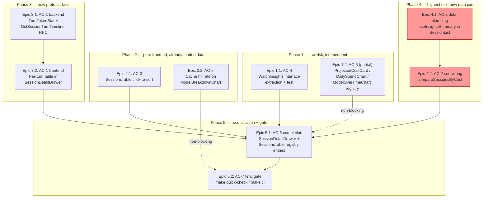

# Implementation Plan — Token Cost Tracking Gap Closure

Gap-closing project against an already-shipped feature. Scope is exactly the 6 confirmed
gaps in `requirements.md` (AC-1..AC-6) plus the AC-7 quality gate. No new dependencies, no
DB/ent schema changes, no session-creation-registry touchpoints (confirmed in
`research/architecture.md`). **No Migration Plan section** — nothing here touches storage.

Every file path below was verified against the current tree on 2026-08-01 (not copied
blind from research) — line numbers cited are exact as of that read and may drift by the
time implementation starts; treat them as "look here first," not gospel.

## ADRs

None. Every non-trivial choice below (new RPC vs. bolt-on field, interface-extraction for
the streaming test, client-side vs. server-side derivation) is either already precedented
elsewhere in this codebase (`GetProviderLimits` for single-session on-demand RPCs,
`backlogItemEventSender`/`watchBacklogItems` for streaming-test seams) or is a reversible,
low-blast-radius frontend decision. Nothing here rises to "future readers need the
reasoning preserved outside the code" — see Pattern Decisions below for the reasoning
inline instead.

---

## Domain Glossary

| Term | Definition |
|---|---|
| `TurnTokenStat` | **New** proto message (`proto/session/v1/insights.proto`) — 1:1 wire mirror of the existing Go `tokens.TurnStats` struct (`session/tokens/types.go:29-37`): timestamp, model, input/output/cache-creation/cache-read tokens, tool names. Exists only on the new `GetSessionTurnTimelineResponse`, never on `SessionTokenSummary` (kept off the list-view payload deliberately — see Pattern Decisions AC-1). |
| `GetSessionTurnTimeline` | **New** unary RPC on `InsightsService`. Request: `conversation_id` (the JSONL transcript UUID). Response: `repeated TurnTokenStat turns`. Fetched lazily only when `SessionDetailDrawer` opens for a session — never eagerly batched with the list RPCs. |
| `conversation_id` (wire) / `SessionUUID` (Go) | Same value, two names: `SessionTokenSummary.conversation_id` on the wire is `ParseResult.SessionUUID` in Go, and is the key `TokenStore.GetByUUID` indexes on (`session/tokens/store.go:124-128`). Distinct from `session_id`, which is stapler-squad's own session identity (may be empty for orphans). `GetSessionTurnTimeline` keys on `conversation_id`, not `session_id`, because orphan sessions (no stapler-squad session match) still have turn data worth showing. |
| `insightsEventSender` | **New**, narrow Go interface (`Send(*sessionv1.InsightsEvent) error`) in `server/services/insights_service.go`, extracted so `WatchInsights`'s core logic is unit-testable without a live ConnectRPC stream. Directly mirrors the already-shipped `backlogItemEventSender` (`server/services/backlog_service_events.go:35-41`) — same problem (`*connect.ServerStream[T]` has no exported constructor), same fix. |
| `watchInsights` (lowercase) | **New** unexported core-logic method holding `WatchInsights`'s actual behavior, parameterized over `insightsEventSender` instead of the concrete stream. The exported `WatchInsights` RPC method becomes a 2-line wrapper, mirroring `WatchBacklogItems`/`watchBacklogItems` exactly. |
| `SortField` (existing) | Pre-existing string union in `web-app/src/components/sessions/SessionList.tsx:97` (`'lastActivity' | 'name' | 'createdAt' | 'updatedAt'`) driving the main session list's `<select>` sort dropdown. **AC-2 appends `'tokenCost'` to this existing union** — it is not renamed or replaced. |
| `SortColumn` (new, SessionsTable) | **New** string union in `web-app/src/app/insights/SessionsTable.tsx` (`"input" | "output" | "cache" | "cost"`), intentionally named `SortColumn` (not `SortField`) to match the naming already used by the *other* click-to-sort implementation in this codebase, `app/backlog/page.tsx:40`'s `SortColumn`, since AC-3 is explicitly modeled on that file's pattern (not `SessionList.tsx`'s dropdown pattern, which is a different UI affordance — `<select>` vs. clickable `<th>`). The two types (`SortField` in `SessionList.tsx`, `SortColumn` in `SessionsTable.tsx`) are deliberately separate, unshared types — `build-vs-buy.md` explicitly rejects a shared `useSortableTable` hook as YAGNI for 2 sort surfaces. |
| `costById` | New `Map<string, number>` built in `SessionList.tsx` from `useInsightsSummary()`'s `GetInsightsSummaryResponse.sessions`, keyed by `SessionTokenSummary.sessionId` (matches `Session.id` from `types_pb`). The join table AC-2 requires. |
| `compareSessionsByCost` | **New**, exported pure comparator function (new file `web-app/src/components/sessions/sessionCostSort.ts`) implementing AC-2's "unpriced/unloaded sorts last regardless of direction" rule. Exported specifically so it is unit-testable without mocking ConnectRPC — mirrors the existing precedent of `hasPendingProgramChange` being pulled out of `SessionCard.tsx` "so it's unit-testable without rendering the full card" (`SessionCard.tsx:22`). |
| `turnTimelineUtils` | **New** module (`web-app/src/app/insights/turnTimelineUtils.ts`) holding AC-1's pure sort/outlier-detection functions, split out from the ConnectRPC-consuming hook for the same testability reason — this codebase's own convention (`useInsightsService.test.ts`'s header comment: "`useInsightsSummary` depends on ConnectRPC which requires a live transport, so we test the pure utility function... which has no side-effects") already establishes this split; AC-1 and AC-2 both follow it. |
| `TokenStoreReader` (existing) | `session/tokens/types.go:57-63`. Already the correct "interface defined at the consumer" pattern (InsightsService's package, not TokenStore's). Reused as-is by AC-4's test (via a real `*tokens.TokenStore`, not the existing inert `fakeTokenStore`) — not modified. |
| `unpricedModels` / `pricing_unavailable` (existing) | PR #280 signal, already on `SessionTokenSummary`/`ModelBreakdown`. Reused (not reintroduced) by AC-2's and AC-3's "sorts last" comparators — the visual "unpriced" badge already on screen and the "sorts last" sort behavior stay semantically linked, per `research/ux.md` §4. |

---

## Pattern Decisions

| Decision point | Options considered | Choice | Why |
|---|---|---|---|
| **AC-1: how to expose per-turn data over the wire** | (1) New `TurnTokenStat` message + new unary `GetSessionTurnTimeline` RPC. (2) Bolt a `repeated TurnEntry turn_timeline` field directly onto `SessionTokenSummary`. (3) Bolt it onto `ListSessionTokensRequest` via an `include_turn_timeline` flag, returned inline on `ListSessionTokensResponse`. | **(1) New RPC.** | (2) rejected: `SessionTokenSummary` is returned N-at-a-time by `ListSessionTokens`/`GetInsightsSummary` for the whole dashboard/list — every session would carry a turn array most callers (list views) never render, bloating every list response for a value only needed when one drawer is open (`research/architecture.md`, `research/ux.md` §1). (3) rejected for the same payload-bloat reason plus an added request-shape wart (a boolean flag that silently changes response size); it also couples turn-timeline fetching to the pagination RPC's cache/sort semantics for no benefit. (1) matches the existing single-session, on-demand precedent already in this proto family — `GetProviderLimits` (`session.proto`) — and keeps `ListSessionTokens`'s response shape stable. |
| **AC-4: how to make `WatchInsights` unit-testable** | (1) Extract `insightsEventSender` interface + unexported `watchInsights` core method (mirrors `backlogItemEventSender`/`watchBacklogItems`). (2) Stand up a full HTTP/h2c test server and drive the real RPC end-to-end (`headless_service_test.go`'s pattern, but for a streaming RPC). (3) Leave `WatchInsights` untested and only test `TokenStore.Subscribe()`/`notify()` in isolation (already covered by `session/tokens/store_test.go`). | **(1) Interface extraction.** | (2) rejected: adds real-network timing sensitivity for no benefit — `backlog_service_events.go`'s own doc comment already establishes that `*connect.ServerStream[T]` cannot be faked directly, and the interface-extraction fix is the only precedent in this codebase for a server-stream RPC (`research/pitfalls.md` §5). (3) rejected: it would leave the actual RPC handler — the initial-event branch, the `ctx.Done()` shutdown branch, the `stream.Send` error-wrapping — with zero coverage; `TokenStore`'s own tests don't exercise any of that. |
| **AC-6: proto field vs. client-side derivation for cache hit rate** | (1) Add `double cache_hit_rate = 8` to `ModelBreakdown`, computed server-side by reusing `computeCacheHitRate()`. (2) Derive it client-side in `ModelBreakdownChart.tsx` from the already-present `cache_read_tokens`/`total_input_tokens` fields. | **(2) Client-side derivation.** | `ModelBreakdown` already carries both raw inputs on the wire; adding a server field for a value the client can already compute is the "no-op forwarding that adds no new information" smell `.claude/rules/interface-pollution-checklist.md` flags (no-op getter/setter analog, applied to a proto field instead of a Go method). Reserve the proto field only if the ratio ever needs server-side sort/filter — not a requirement today (`research/architecture.md` §AC-6). |
| **AC-2: unloaded/unpriced sort-order guarantee** | (1) Sentinel value (e.g. `costUsd ?? -1`) fed into the existing generic `sortDir === 'asc' ? cmp : -cmp` flip. (2) Early-return branch, computed *before* the generic direction flip, that forces missing-cost rows last in both directions. | **(2) Early-return branch.** | (1) is broken by construction for this requirement: any single sentinel value gets its relative position *inverted* when `sortDir` flips (a `-1` sentinel sorts first on `asc`, last on `desc` — the opposite of "always last"). `research/ux.md` §4 and `research/pitfalls.md` §3 both call this out for `SessionsTable`'s existing unpriced badge; the same physics apply to `SessionList`'s new cost sort. (2) is the shape already proposed in `research/ux.md`'s own comparator example and is what this plan uses for both AC-2 (`SessionList.tsx`) and AC-3 (`SessionsTable.tsx`, for its "unpriced" case). |
| **AC-3: shared sort hook vs. per-component state** | (1) Extract a shared `useSortableTable<T>()` hook, used by both `SessionsTable.tsx` and (retrofitted) `SessionList.tsx`. (2) Hand-roll `useState`+`useMemo` sort state locally in `SessionsTable.tsx`, following `app/backlog/page.tsx`'s pattern. | **(2) Local hand-rolled state.** | `build-vs-buy.md`: this is the *third* occurrence of the identical ~15-line pattern (after `backlog/page.tsx` and `ApprovalRulesPanel.tsx`), which is a reasonable trigger for extraction *eventually*, but AC-3's acceptance criterion only asks for `SessionsTable.tsx` sortability — extracting a generic hook now is scope creep relative to what's blocking, and would touch `SessionList.tsx` (AC-2, a separate epic) for no requirement-driven reason. Left as an explicit non-blocking follow-up in Unresolved Questions. |
| **AC-5: registry file field shape** | (1) `.claude/rules/feature-registry.md`'s example (`filePath`, `name`, no `component`/`markerLine`). (2) `docs/registry/schema.json`'s `Feature` type (backend-only, no frontend shape at all). (3) Copy the shape of an existing **committed** frontend file (`backlog-pipeline-mode-selector.json`). | **(3) Copy an existing real file.** | (1) and (2) are both confirmed stale/incomplete against what the generator/validator actually enforce (`research/pitfalls.md` §4) — using either would produce files the validator doesn't recognize (missing `component`/`path`/`markerLine`). (3) is mechanically verified against the same-shaped `insights-pricing-unavailable-indicator.json`/`ui/insights-dashboard.json` entries already in the tree. |

---

## Observability Plan

This is a read-path/UI gap-closing project — no new production metrics, alerts, or
dashboards are warranted. What matters is *not regressing* existing signal:

- **`log.Warn("insights: unpriced model family observed", ...)`** (`insights_service.go:62`,
  `warnNewUnpricedFamilies`) must keep firing exactly as today after the AC-4 refactor —
  the refactor only changes how `WatchInsights` sends, not `GetInsightsSummary`/
  `ListSessionTokens`'s existing warning path. No task here touches
  `warnNewUnpricedFamilies` or its call sites; verified by the existing
  `TestGetInsightsSummary_WhenCalledTwiceWithSameUnpricedFamily_ExpectLoggedOnce` test
  continuing to pass unmodified.
- **`console.error("[WatchInsights] stream error, reconnecting:", err)`**
  (`useInsightsService.ts:140`) is the only client-side failure signal for the live-update
  path. AC-2 adds a *second* consumer of `useInsightsSummary` (in `SessionList.tsx`,
  alongside the existing `/insights` dashboard usage) — both will now log independently on
  a stream error. This is acceptable (no new failure mode, just a second call site), but
  flagged under Risk Control below as a perf/redundancy consideration, not a correctness
  one.
- **`make quick-check`/`make ci` (AC-7)** is this project's actual observability gate —
  build + test + lint passing is the definition of "not regressed" for every AC. No task
  list item is complete without it; the final task in Phase 5 runs it explicitly.
- No new structured log lines are added for the frontend-only ACs (2, 3, 6) — they're pure
  rendering/sort logic with no failure mode beyond "wrong order," which is covered by unit
  tests, not runtime logging.

---

## Risk Control

| Risk | Source | Mitigation (where it's implemented) |
|---|---|---|
| "Jumping list" — `SessionList.tsx` re-sorts visibly as cost data streams in after initial paint, because `Session[]` (fast) and `SessionTokenSummary[]` (slower, separate RPC) resolve at different times. | `research/pitfalls.md` §3, `research/ux.md` §4 | `compareSessionsByCost`'s early-return-before-direction-flip design (Epic 4.2) resolves "not yet loaded" to the same "always last" bucket as "genuinely unpriced" — a row's *relative* position among the loaded set never changes as more costs stream in; only newly-loaded rows move out of the trailing "unloaded" bucket into their earned position, once, not repeatedly. |
| Silent-wrong-data class (PR #280's root-cause pattern: new data hits an aggregation lookup with no entry, renders a plausible-looking `$0.00`). | `research/pitfalls.md` §1 | Confirmed not applicable to any of AC-1/2/3/6: none introduce a new lookup table or aggregation path. AC-1 reads `TurnTimeline`, which the parser already filters (`<synthetic>` turns excluded at `session/tokens/parser.go:183,188`, confirmed by `parser_test.go:153-155`) — no new filtering needed in the RPC handler or UI. AC-6 reuses the *exact* existing `computeCacheHitRate` formula, ported to TS, against fields already correctly populated server-side. |
| `TokenStore.notify()`'s non-blocking, best-effort fan-out (`subChanSize = 64`) can drop notifications under rapid-fire triggers. | `research/pitfalls.md` §2 | AC-4's test (Task 1.1.2b) triggers exactly one `OnHistoryFileChanged` call per assertion window and drains (`require.Eventually`) before triggering again — never asserts an exact notification count beyond "at least N," per the pitfalls doc's explicit guidance. |
| **Superseded finding, corrected during `/sdd:4-validate`'s pre-mortem pass**: `coverage-gaps.json` is not just ordering-sensitive, it never reads `docs/registry/features/frontend/` at all — it's computed purely from live `// +feature:` marker scans of `.tsx` source (`tools/scanner/frontend/src/{component-scanner,gap-reporter}.ts`). All 5 AC-5 target files already carry `// +feature: insights-dashboard`, and `insights` is already a matched backend domain, so `unmatchedFrontend` is 0 both before and after this project's per-feature JSON files are added, regardless of their correctness. A before/after diff of this file is not a valid completion proof for AC-5 (pre-mortem.md finding #3, P1). | Corrected this pass, superseding an earlier (still-true but insufficient) ordering-only finding | Tasks 1.2.1d and 5.1.1c now verify AC-5 by grepping the new ids directly out of `docs/registry/frontend-features.json` (the `registry-aggregate` output, which *does* read the per-feature directory) instead of diffing `coverage-gaps.json`. |
| Adding a second `useInsightsSummary()` call site (`SessionList.tsx`, alongside the existing `/insights` dashboard) means a second concurrent `GetInsightsSummary` fetch + `WatchInsights` stream subscription per browser tab that has the session list open — which may be the default/most-frequently-open view. | This planning pass, extending `research/pitfalls.md` §2's reasoning | Accepted as in-scope for AC-2's literal wording ("fetches per-session cost data"); `GetInsightsSummary` is an in-memory `TokenStore.GetAll()` iteration (not disk/DB), so the marginal cost per extra caller is small. Flagged in Unresolved Questions as a candidate for a future lazy-fetch-on-first-cost-sort optimization if it proves to matter in practice — not implemented here since it's not requirement-driven. |
| Backend registry scanner (`tools/scanner/backend/cmd/main.go`) could silently overwrite hand-edited `tested`/`testIds` on `WatchInsights.json` when `make registry-generate` re-runs. | Verified directly against scanner source this pass | Confirmed **not** a risk: the scanner only overwrites `testIds`/`tested` when the existing committed file's `testIds` array is *empty* (`main.go:114-118`, `len(existingIDs) > 0` guard) — Task 1.1.3a's hand-edit (non-empty `testIds`) survives every subsequent `registry-generate-backend` run. |

---

## Unresolved Questions

1. **Does AC-2 require rendering `TokenBadge` on `SessionCard`/`SessionRow`, or only fetching data + adding the sort option?** The acceptance-criterion text ("fetches per-session cost data... and its sort dropdown gains a 'Sort: Cost' option") only literally requires the fetch + sort. This plan implements exactly that (Phase 4) and does **not** wire `TokenBadge` into `SessionCard.tsx`/`SessionRow.tsx` — doing so would touch 2 more files for a UX nicety not in the AC text, contrary to "do what's asked, nothing more." `research/ux.md`'s framing (TokenBadge's entire reason for existing) suggests this is a natural, low-effort follow-up. **Needs a call before/during implementation**: if the reviewer wants the badge visible wherever the new sort applies, add it as a small additional epic; the sort/fetch plumbing in Phase 4 doesn't need to change either way.
2. **Should the `useInsightsSummary()` fetch in `SessionList.tsx` be gated behind "user has selected Sort: Cost at least once" instead of always-on?** Deferred per Risk Control above — not requirement-driven, and the underlying RPC is cheap. Flag for a follow-up perf pass if `SessionList.tsx`'s mount cost becomes a measured problem.
3. **AC-1 has no new Playwright e2e spec.** `.claude/rules/feature-registry.md`'s general convention wants an e2e test per new UI feature, but AC-1's literal criterion is "renders a...table" and AC-7's gate is `make quick-check` (build+test+lint), not e2e. This plan covers AC-1 with unit tests only (`turnTimelineUtils.test.ts`, plus the new Go RPC tests). Flag if e2e coverage is wanted before ship.
4. **`useSortableTable<T>()` extraction** (Pattern Decisions, AC-3 row) is explicitly deferred — third occurrence of the sort-state pattern after this project ships (`backlog/page.tsx`, `ApprovalRulesPanel.tsx`, now `SessionsTable.tsx`) is a reasonable trigger for a future refactor pass, not part of this plan.

---

## Dependency Visualization



Phases 1–4 have no cross-phase code dependencies (each touches a disjoint file set except
where noted) and can be implemented/reviewed in parallel if desired; the ordering below is
by **risk**, not by hard dependency — Phase 5 is the only phase that must run last, because
it needs Phase 3's and Phase 4's newly-added tests to exist before their registry entries
can be written honestly.

---

## Phase 1 — AC-4 (WatchInsights test) + AC-5 (partial: stable targets)

### Epic 1.1 — AC-4: `WatchInsights` streaming test coverage

**Given** `WatchInsights` currently sends directly through a concrete
`*connect.ServerStream[sessionv1.InsightsEvent]` with no test seam,
**when** its core logic is extracted behind a narrow `insightsEventSender` interface,
**then** a test can drive at least one full streaming update cycle (initial event + live
"update" event) without a real network round-trip, and
`docs/registry/features/backend/WatchInsights.json` reflects `tested: true`.

#### Story 1.1.1 — Extract the testable seam

- **Task 1.1.1a** (`server/services/insights_service.go`): Add the `insightsEventSender`
  interface (`Send(*sessionv1.InsightsEvent) error`) directly above the existing
  `WatchInsights` method (currently lines 488-531). Rename the current method body into a
  new unexported `func (s *InsightsService) watchInsights(ctx context.Context, sender
  insightsEventSender) error`, replacing every `stream.Send(...)` call with
  `sender.Send(...)`. Make the exported `WatchInsights` method a thin wrapper:
  ```go
  // +api: insights:watch
  func (s *InsightsService) WatchInsights(
      ctx context.Context,
      _ *connect.Request[sessionv1.WatchInsightsRequest],
      stream *connect.ServerStream[sessionv1.InsightsEvent],
  ) error {
      return s.watchInsights(ctx, stream)
  }
  ```
  Add a doc comment on `insightsEventSender` citing `backlogItemEventSender` as the
  precedent (mirrors `backlog_service_events.go:35-41`'s comment). 1 file.

#### Story 1.1.2 — Tests

- **Task 1.1.2a** (`server/services/insights_service_test.go`): Add `fakeInsightsEventSender`
  — a mutex-guarded slice type with `Send(*sessionv1.InsightsEvent) error` (append + return
  nil) and `Sent() []*sessionv1.InsightsEvent` (mutex-guarded snapshot copy), modeled
  directly on `fakeBacklogItemEventSender` (`backlog_service_events_test.go:72-97`). Add a
  compile-time assertion `var _ insightsEventSender = (*fakeInsightsEventSender)(nil)`.
  1 file.
- **Task 1.1.2b** (same file): Add
  `TestWatchInsights_should_forwardUpdateEvent_When_TokenStoreNotifies`:
  ```go
  store := tokens.NewTokenStore("")
  ctx, cancel := context.WithCancel(context.Background())
  t.Cleanup(cancel)
  store.Start(ctx)
  svc := NewInsightsService(store, tokens.DefaultPricingTable(), nil)

  sender := &fakeInsightsEventSender{}
  runCtx, runCancel := context.WithCancel(context.Background())
  done := make(chan error, 1)
  go func() { done <- svc.watchInsights(runCtx, sender) }()

  require.Eventually(t, func() bool { return len(sender.Sent()) >= 1 }, 2*time.Second, 10*time.Millisecond) // initial event

  store.OnHistoryFileChanged("../../session/tokens/testdata/valid_session.jsonl")

  require.Eventually(t, func() bool { return len(sender.Sent()) >= 2 }, 2*time.Second, 10*time.Millisecond)
  assert.Equal(t, "update", sender.Sent()[1].EventType)

  runCancel()
  select {
  case err := <-done:
      require.NoError(t, err)
  case <-time.After(2 * time.Second):
      t.Fatal("watchInsights did not return after context cancellation")
  }
  ```
  Uses a **real** `tokens.TokenStore` (not `fakeTokenStore`, whose `Subscribe()` is a
  dead-end channel per `research/architecture.md` §AC-4) so `Subscribe()`/`notify()`
  actually fires. `OnHistoryFileChanged` (exported) is used instead of the unexported
  `enqueue` since this test lives in package `services`, not package `tokens`. 1 file.
- **Task 1.1.2c** (same file): Add
  `TestWatchInsights_should_unsubscribeAndReturn_When_ContextIsCanceled` — same setup,
  skips the `OnHistoryFileChanged` trigger, cancels `runCtx` immediately after the initial
  event, and asserts `done` receives `nil` within 2s (mirrors `requireCleanReturn`'s
  bounded-wait pattern from `backlog_service_events_test.go:125-137`). 1 file.

#### Story 1.1.3 — Registry flip

- **Task 1.1.3a** (`docs/registry/features/backend/WatchInsights.json`): Set `"tested":
  true`, `"testIds": ["TestWatchInsights_should_forwardUpdateEvent_When_TokenStoreNotifies",
  "TestWatchInsights_should_unsubscribeAndReturn_When_ContextIsCanceled"]`,
  `"markerFound": true` (now accurate given Task 1.1.1a's `// +api:` marker), bump
  `"lastModified"` to the implementation date. Per the scanner's `len(existingIDs) > 0`
  preserve-on-regenerate guard (`tools/scanner/backend/cmd/main.go:114-118`), this survives
  subsequent `make registry-generate-backend` runs unmodified. 1 file.

---

### Epic 1.2 — AC-5 (partial): registry entries for the 3 already-stable targets

Scoped to `ProjectedCostCard`, `DailySpendChart`, `ModelOverTimeChart` only —
`SessionDetailDrawer` and `SessionsTable` are deferred to Phase 5 because their test
surface changes in Phase 2/3.

**Given** these 3 components already have passing `.test.tsx` files and share the
`insights-dashboard` marker with no dedicated registry entry,
**when** a per-feature JSON file is hand-authored for each using the real (not
`schema.json`/rule-doc) field shape,
**then** `make registry-generate`'s `registry-aggregate` step folds all 3 new entries
into `docs/registry/frontend-features.json`, verified by grepping that file directly —
**not** by diffing `coverage-gaps.json`, which (per pre-mortem.md finding #3, P1) is
computed purely from live `// +feature:` marker scans of `.tsx` source
(`tools/scanner/frontend/src/{component-scanner,gap-reporter}.ts`) and never reads
`docs/registry/features/frontend/`. Confirmed empirically (2026-08-02): all 3 target
files already carry `// +feature: insights-dashboard` on line 1, and `insights` is
already a matched backend domain (from `GetInsightsSummary`/`ListSessionTokens`/
`WatchInsights`), so `coverage-gaps.json`'s `unmatchedFrontend` count is 0 both before
and after this epic regardless of what the per-feature JSON files contain — a diff
against it would pass identically whether these 3 files were correct, malformed, or
never created. It is not a meaningful proof for this task and is dropped as one.

- **Task 1.2.1a**: Create `docs/registry/features/frontend/insights-projected-cost-card.json`:
  ```json
  {
    "id": "insights-projected-cost-card",
    "type": "frontend",
    "name": "Projected monthly cost card",
    "component": "ProjectedCostCard",
    "path": "web-app/src/app/insights/ProjectedCostCard.tsx",
    "filePath": "web-app/src/app/insights/ProjectedCostCard.tsx",
    "markerLine": 1,
    "tested": true,
    "testIds": [
      "ProjectedCostCard > ProjectedCostCard_should_showUnpricedCaveat_When_hasUnpricedUsageTrue",
      "ProjectedCostCard > ProjectedCostCard_should_omitCaveat_When_hasUnpricedUsageFalse"
    ],
    "lastModified": "2026-08-01T00:00:00Z"
  }
  ```
  1 file (id uses the `insights-` domain prefix per `research/pitfalls.md` §4's coverage-gap
  matching note).
- **Task 1.2.1b**: Create `docs/registry/features/frontend/insights-daily-spend-chart.json`
  — same shape, `component: "DailySpendChart"`, `path`/`filePath`:
  `web-app/src/app/insights/DailySpendChart.tsx`, `testIds` from `DailySpendChart.test.tsx`
  (3 tests: `DailySpendChart_should_showUnpricedFootnote_When_anyDayHasUnpricedModels`,
  `DailySpendChart_should_omitFootnote_When_noDayHasUnpricedModels`,
  `DailySpendChart_should_pluralizeFootnote_When_multipleDaysHaveUnpricedModels`, each
  prefixed `"DailySpendChart > "`). 1 file.
- **Task 1.2.1c**: Create `docs/registry/features/frontend/insights-model-over-time-chart.json`
  — `component: "ModelOverTimeChart"`, `path`/`filePath`:
  `web-app/src/app/insights/ModelOverTimeChart.tsx`, `testIds` from
  `ModelOverTimeChart.test.tsx` (2 tests, prefixed `"ModelOverTimeChart > "`). 1 file.
- **Task 1.2.1d** (verification, no source files): Run `make registry-generate` once, then
  `grep -c '"id": "insights-projected-cost-card"\|"id": "insights-daily-spend-chart"\|"id":
  "insights-model-over-time-chart"' docs/registry/frontend-features.json` and confirm all 3
  ids are present (proves `registry-aggregate` actually folded the 3 new per-feature files
  into the monolithic output — the real signal for this task, per the corrected Given/when/
  then above). Also run `make registry-diff` (backend-only; `validate-registry.sh` has no
  frontend comparison logic, confirmed by inspection — record this as informational, not as
  proof of the frontend work). Record the `coverage-gaps.json` `unmatchedFrontend`/
  `unmatchedBackend` counts in the completion note for continuity with Task 5.1.1c's later
  comparison, but do not treat a lack of change in that file as a pass/fail signal.

---

## Phase 2 — AC-3 (SessionsTable sort) + AC-6 (cache hit rate)

### Epic 2.1 — AC-3: click-to-sort `SessionsTable`

**Given** `SessionsTable.tsx`'s `displayed` `useMemo` hardcodes a `lastMessageAt desc` sort,
**when** the Input/Output/Cache/Cost `<th>` headers become clickable with keyboard support,
**then** clicking a header sorts by that column (toggling direction on re-click), unpriced
sessions always sort last for the Cost column regardless of direction, and the default
(no header clicked yet) behavior is unchanged.

#### Story 2.1.1 — Sort state + comparator

- **Task 2.1.1a** (`web-app/src/app/insights/SessionsTable.tsx`): Add
  `type SortColumn = "input" | "output" | "cache" | "cost"`,
  `const [sortCol, setSortCol] = useState<SortColumn | null>(null)`,
  `const [sortAsc, setSortAsc] = useState(false)`. Replace the hardcoded `.sort()` at the
  end of the `displayed` `useMemo` (current lines 97-101) with: if `sortCol === null`, keep
  today's `lastMessageAt desc` fallback (zero behavior change for anyone who never clicks a
  header); else branch on `sortCol`, computing `cmp` from
  `totalInputTokens`/`totalOutputTokens`/`cacheHitRate`/`estimatedCostUsd` respectively, with
  a `sortCol === "cost"` special case that early-returns
  `(a.unpricedModels.length > 0) !== (b.unpricedModels.length > 0) ? (aUnpriced ? 1 : -1) :
  ...` **before** applying `sortAsc ? cmp : -cmp` (same early-return-before-flip shape as
  AC-2's `compareSessionsByCost`, per Pattern Decisions). 1 file.
- **Task 2.1.1b** (same file): Add `handleSortClick(col: SortColumn)` — toggles `sortAsc`
  if `sortCol === col`, else sets `sortCol = col` and `sortAsc = false` (mirrors
  `app/backlog/page.tsx:510-515`). Add `sortIndicator(col: SortColumn)` returning `" ↑"`/`"
  ↓"` when active, `" ↕"` when inactive (borrowing `ApprovalRulesPanel.tsx`'s neutral-state
  icon per `research/ux.md` §1's explicit recommendation over `backlog/page.tsx`'s blank
  inactive state).

#### Story 2.1.2 — Wire clickable, keyboard-accessible headers

- **Task 2.1.2a** (same file): Update `headerContent()` (current lines 118-128): for the
  `Input`/`Output`/`Cache`/`Cost` `<th>` cells only (not `Session`/`Model`/`Path`), keep
  `<th aria-sort={sortCol === "input" ? (sortAsc ? "ascending" : "descending") : "none"}>`
  with its native `columnheader` role intact (**no `role` override on the `<th>` itself** —
  **corrected during triad review's UX pass**: putting `role="button"` directly on a `<th>`
  overrides its native columnheader semantics for screen readers, an axe-core-invisible
  regression). Instead nest the click/keyboard affordance on an inner element:
  `<th aria-sort={...}><span role="button" tabIndex={0} onClick={() =>
  handleSortClick("input")} onKeyDown={(e) => { if (e.key === "Enter" || e.key === " ") {
  e.preventDefault(); handleSortClick("input"); } }}>{label}{sortIndicator("input")}</span>
  </th>` (repeated per column) — reusing the exact Enter/Space pattern already proven at
  `handleRowKeyDown` (lines 111-116), closing the keyboard-access gap both existing reference
  implementations (`backlog/page.tsx`, `ApprovalRulesPanel.tsx`) have, per `research/ux.md`
  §3, while preserving native table semantics per the WAI-ARIA APG sortable-table pattern
  (interactive control nested inside `<th>`, not replacing its role). 1 file.
- **Task 2.1.2b** (`web-app/src/app/insights/SessionsTable.css.ts`): Add
  `sortableTh = style([th, { cursor: "pointer" }])` and
  `sortableThRight = style([thRight, { cursor: "pointer" }])`, composed from the existing
  `th`/`thRight` per vanilla-extract's array-composition form — **not** an inline
  `style={{cursor: "pointer"}}`, per `.claude/rules/css-architecture.md`'s ban on inline
  layout styles (the exact anti-pattern `backlog/page.tsx:743` uses, called out as a flaw
  not to copy forward in `research/ux.md` §3). Apply `sortableTh`/`sortableThRight` to the
  inner `<span role="button">` from Task 2.1.2a (not the `<th>` itself, which keeps its
  plain `th`/`thRight` class). Also add `sortableThFocus = style({ selectors: { "&:focus-
  visible": { outline: \`2px solid ${vars.color.actionPrimary}\`, outlineOffset: "2px" } }
  })` on the same inner span — **corrected during triad review's UX pass** (WCAG 2.4.7 gap:
  the original plan gave the new `tabIndex={0}` element a pointer cursor but no visible
  focus indicator). 1 file.

#### Story 2.1.3 — Tests

- **Task 2.1.3a** (`web-app/src/app/insights/SessionsTable.test.tsx`): Add 3 tests inside a
  new `describe("SessionsTable_should_supportClickToSort_When_headerClicked", ...)` block:
  `sorts by cost descending on first click`, `toggles to ascending on second click of the
  same header`, `sorts unpriced sessions last for cost regardless of direction`. Uses the
  existing `render`/fixture helpers already in this file (check the top of the file for the
  established `makeSession`-style fixture before writing new ones). 1 file.

---

### Epic 2.2 — AC-6: cache hit rate at the model-breakdown level

**Given** `ModelBreakdown` already carries `cache_read_tokens`/`total_input_tokens` per
model family but `ModelBreakdownChart.tsx` doesn't plot or label it,
**when** a per-model cache hit rate is derived client-side (`cacheRead / (input +
cacheRead)`) and shown in the existing legend row,
**then** the aggregate cache hit rate is visible without a session drilldown.

- **Task 2.2.1a** (`web-app/src/app/insights/ModelBreakdownChart.tsx`): Extend the
  `DataPoint` interface with `cacheHitRate: number` and `toDataPoints` to compute it —
  `m.cacheReadTokens / (m.totalInputTokens + m.cacheReadTokens) || 0` (guards the
  divide-by-zero case the existing Go `computeCacheHitRate` also guards,
  `insights_service.go:552-557`). Import `fmtPct` from `./insightsFormatters` (already used
  by `SessionDetailDrawer.tsx`/`SessionsTable.tsx` — same formatter, new consumer). 1 file.
- **Task 2.2.1b** (same file): In the legend row (current lines 110-119), append
  `{fmtPct(d.cacheHitRate)} cache hit` after the existing `pricingUnavailable` conditional,
  using a new `cacheHitLabel` class (Task 2.2.1c). Follow-on edit to the same file/task.
- **Task 2.2.1c** (`web-app/src/app/insights/ModelBreakdownChart.css.ts`): Add
  `cacheHitLabel = style({ color: vars.color.textMuted, fontStyle: "italic" })`, mirroring
  the existing `unpricedLabel` style shape (lines 55-58) but using a neutral/muted color
  (not warning — a low hit rate isn't necessarily bad, unlike "pricing unavailable"). 1 file.
- **Task 2.2.1d** (`web-app/src/app/insights/ModelBreakdownChart.test.tsx`): Add
  `ModelBreakdownChart_should_showCacheHitRate_When_modelHasCacheReads` — feed a fixture
  `ModelBreakdown` with nonzero `cacheReadTokens`/`totalInputTokens`, assert the computed
  percentage text renders in the legend. 1 file.

---

## Phase 3 — AC-1: per-turn breakdown (new proto surface)

### Epic 3.1 — Proto + backend

**Given** `TurnStats`/`ParseResult.TurnTimeline` is already computed by the parser but never
serialized over ConnectRPC,
**when** a new `TurnTokenStat` message and `GetSessionTurnTimeline` RPC are added,
**then** the frontend can fetch per-turn data for exactly one session, on demand.

#### Story 3.1.1 — Proto

- **Task 3.1.1a** (`proto/session/v1/insights.proto`): Add, after the existing `TopEntry`
  message (current line 86):
  ```protobuf
  // TurnTokenStat is one assistant turn's token usage (per-turn breakdown tables).
  message TurnTokenStat {
    google.protobuf.Timestamp timestamp = 1; // unset if the turn has no timestamp
    string model                        = 2;
    int64  input_tokens                 = 3;
    int64  output_tokens                = 4;
    int64  cache_creation_tokens        = 5;
    int64  cache_read_tokens            = 6;
    repeated string tool_names          = 7;
  }

  // GetSessionTurnTimelineRequest looks up per-turn stats for a single session,
  // fetched on-demand when the session detail drawer opens.
  message GetSessionTurnTimelineRequest {
    string conversation_id = 1; // JSONL conversation UUID (SessionTokenSummary.conversation_id)
  }

  // GetSessionTurnTimelineResponse returns the per-turn breakdown for one session.
  message GetSessionTurnTimelineResponse {
    repeated TurnTokenStat turns = 1;
  }
  ```
  Add the RPC to the `InsightsService` service block (current lines 8-20):
  ```protobuf
  // GetSessionTurnTimeline returns per-turn token stats for one session, fetched
  // on-demand when the session detail drawer opens (not embedded in list responses).
  rpc GetSessionTurnTimeline(GetSessionTurnTimelineRequest)
      returns (GetSessionTurnTimelineResponse) {}
  ```
  1 file.
- **Task 3.1.1b** (verification, generated files): Run `make proto-gen`. Confirm the
  generated Go (`session/gen/proto/go/session/v1/insights.pb.go` and
  `.../sessionv1connect/insights.connect.go`) and TS
  (`web-app/src/gen/session/v1/insights_pb.ts`) files contain `TurnTokenStat`,
  `GetSessionTurnTimelineRequest`/`Response`/`Schema`, and that
  `sessionv1connect.InsightsServiceHandler` now requires a `GetSessionTurnTimeline` method
  (compile will fail on `InsightsService` until Task 3.1.2a lands — expected, sequence the
  commit together). Commit the regenerated files alongside 3.1.1a.

#### Story 3.1.2 — Handler

- **Task 3.1.2a** (`server/services/insights_service.go`): Add:
  ```go
  // GetSessionTurnTimeline returns per-turn token stats for one session, fetched
  // on-demand when the session detail drawer opens.
  // +api: insights:turn-timeline
  func (s *InsightsService) GetSessionTurnTimeline(
      _ context.Context,
      req *connect.Request[sessionv1.GetSessionTurnTimelineRequest],
  ) (*connect.Response[sessionv1.GetSessionTurnTimelineResponse], error) {
      r := s.store.GetByUUID(req.Msg.ConversationId)
      if r == nil {
          return connect.NewResponse(&sessionv1.GetSessionTurnTimelineResponse{}), nil
      }
      turns := make([]*sessionv1.TurnTokenStat, 0, len(r.TurnTimeline))
      for _, t := range r.TurnTimeline {
          stat := &sessionv1.TurnTokenStat{
              Model:               t.Model,
              InputTokens:         t.Input,
              OutputTokens:        t.Output,
              CacheCreationTokens: t.CacheCreation,
              CacheReadTokens:     t.CacheRead,
              ToolNames:           t.ToolNames,
          }
          if !t.Timestamp.IsZero() {
              stat.Timestamp = timestamppb.New(t.Timestamp)
          }
          turns = append(turns, stat)
      }
      return connect.NewResponse(&sessionv1.GetSessionTurnTimelineResponse{Turns: turns}), nil
  }
  ```
  Uses `TokenStoreReader.GetByUUID` (already in the interface, `types.go:59`) — no interface
  change needed. 1 file.

#### Story 3.1.3 — Backend tests

- **Task 3.1.3a** (`server/services/insights_service_test.go`): Add
  `TestGetSessionTurnTimeline_should_returnTurns_When_ConversationIdMatches` (reuse
  `newInsightsFixture`/`newResult` helpers already in this file — `newResult` already
  populates `TurnTimeline` with one synthetic entry per session, lines 66-74) and
  `TestGetSessionTurnTimeline_should_returnEmptyTurns_When_ConversationIdUnknown` (query an
  unmatched UUID, assert `resp.Msg.Turns` is empty, not an error). 1 file.

---

### Epic 3.2 — Frontend: per-turn table in `SessionDetailDrawer`

**Given** the drawer currently shows only session-level rollups,
**when** it lazy-fetches `GetSessionTurnTimeline` on open and renders a sorted, outlier-
flagged table,
**then** AC-1 is satisfied: timestamp/model/input/output/cache columns, sourced from
`ParseResult.TurnTimeline`, for sessions where turn data is available.

#### Story 3.2.1 — Data hook

- **Task 3.2.1a** (`web-app/src/lib/hooks/useInsightsService.ts`): Add
  `useSessionTurnTimeline(conversationId: string | undefined)`: `useState` for
  `turns`/`loading`/`error`, `useEffect` keyed on `conversationId` that no-ops (empty
  `turns`, `loading: false`) when `conversationId` is falsy, else calls
  `client.getSessionTurnTimeline(create(GetSessionTurnTimelineRequestSchema, {
  conversationId }))` using the same `createClient(InsightsService, transport)` pattern
  already established in this file (lines 49-54). Returns `{ turns, loading, error }`. Not
  unit-tested directly, per this file's own established convention (`ConnectRPC... requires
  a live transport`) — the sort/outlier logic it feeds is tested separately (Story 3.2.2).
  1 file.

#### Story 3.2.2 — Pure sort/outlier helpers

- **Task 3.2.2a** (new file `web-app/src/app/insights/turnTimelineUtils.ts`): Export
  `sortTurnsByTokensDesc(turns: TurnTokenStat[]): TurnTokenStat[]` (sorts by
  `inputTokens + outputTokens` descending, per `research/ux.md` §5's "spot the spike, not
  read the timeline" job-to-be-done), `computeOutlierThreshold(turns): number` (mean total
  tokens per turn × 2), and `isOutlierTurn(turn: TurnTokenStat, threshold: number): boolean`.
  1 file.
- **Task 3.2.2b** (new file `web-app/src/app/insights/turnTimelineUtils.test.ts`): Cover:
  sort order for a mixed-size turn list, outlier flagging above/below/exactly-at the 2x-mean
  threshold, empty-array edge case (both functions must not throw on `[]`). 1 file.

#### Story 3.2.3 — UI

- **Task 3.2.3a** (`web-app/src/app/insights/SessionDetailDrawer.tsx`): Call
  `const { turns, loading } = useSessionTurnTimeline(session?.conversationId);` Add a new
  section **above** "Tools Breakdown" (before current line 136): `<h3
  className={sectionTitle}>Per-Turn Breakdown</h3>`, empty state `"No per-turn data
  available for this session."` (reusing `emptyState` class) when `turns.length === 0` and
  not loading, else a `<table className={toolsTable}>` with columns Timestamp / Model /
  Input / Output / Cache / Tools, rows from `sortTurnsByTokensDesc(turns)`. Format timestamp
  via the existing `fmtDate` helper (already renders `"—"` for `undefined`, which is exactly
  what an unset `TurnTokenStat.timestamp` deserializes to — no extra zero-timestamp handling
  needed, confirmed against Task 3.1.2a's `if !t.Timestamp.IsZero()` guard). Reuses
  `toolsTh`/`toolsThRight`/`toolsTd`/`toolsTdRight` — no new table CSS needed. 1 file.
- **Task 3.2.3b** (same file): Compute
  `const threshold = computeOutlierThreshold(turns);` once per render; for each row where
  `isOutlierTurn(turn, threshold)`, wrap the Input/Output cell values in `<span
  className={[badge, badgeVariant.warning].join(" ")}>...</span>`, importing **both**
  `badge` and `badgeVariant` from `@/components/shared/TokenBadge.css` (existing
  warning/alert palette, per `research/ux.md` §5's explicit "reuse `TokenBadge.css.ts`'s
  variant colors" guidance — no new colors invented). **Corrected during `/sdd:4-validate`**
  (pre-mortem.md finding #2, P2): `badgeVariant.warning` alone omits the shared `badge` base
  class that supplies padding/pill-shape/inline-flex/border-radius — confirmed against
  `TokenBadge.tsx:47`'s own composition, `[badge, badgeVariant[variant], className].filter(
  Boolean).join(" ")`. Applying `badgeVariant.warning` alone would render unstyled colored
  text with no padding, not a pill. Follow-on edit, same file/task group.

No new registry file for `SessionDetailDrawer` yet — deferred to Phase 5 (Epic 5.1), once
this story's test surface (turnTimelineUtils.test.ts) exists to cite.

---

## Phase 4 — AC-2: `SessionList` sort by cost (highest risk: new data join)

### Epic 4.1 — Data plumbing

**Given** `Session[]` (the type `SessionList.tsx` renders) carries no cost/token fields at
all,
**when** `SessionList.tsx` fetches `GetInsightsSummary` via the existing
`useInsightsSummary` hook and joins by `session_id`,
**then** a `costById` map is available to the sort comparator.

- **Task 4.1.1a** (`web-app/src/components/sessions/SessionList.tsx`): Import
  `useInsightsSummary` from `@/lib/hooks/useInsightsService`. Near the existing hook calls
  (~line 300), add:
  ```ts
  const { summary } = useInsightsSummary({ includeOrphans: true });
  const costById = useMemo(() => {
    const m = new Map<string, number>();
    for (const s of summary?.sessions ?? []) {
      if (s.sessionId) m.set(s.sessionId, s.estimatedCostUsd);
    }
    return m;
  }, [summary]);
  ```
  Reuses the already-shipped `useInsightsSummary` hook (`useInsightsService.ts:37-168`,
  already wired for both the initial `GetInsightsSummary` fetch and live `WatchInsights`
  updates) rather than writing new fetch logic — this hook already does exactly the
  session_id-keyed data AC-2 needs; no new ConnectRPC plumbing required. 1 file.

### Epic 4.2 — Sort wiring (jumping-list guard)

- **Task 4.2.1a** (new file `web-app/src/components/sessions/sessionCostSort.ts`): Export
  `compareSessionsByCost(a: Session, b: Session, costById: Map<string, number>, sortDir:
  'asc' | 'desc'): number`:
  ```ts
  export function compareSessionsByCost(
    a: Session,
    b: Session,
    costById: Map<string, number>,
    sortDir: 'asc' | 'desc'
  ): number {
    const aCost = costById.get(a.id);
    const bCost = costById.get(b.id);
    const aMissing = aCost === undefined;
    const bMissing = bCost === undefined;
    if (aMissing !== bMissing) return aMissing ? 1 : -1; // unloaded/unpriced always last, both directions
    if (aMissing && bMissing) return 0;
    const cmp = aCost! - bCost!;
    return sortDir === 'asc' ? cmp : -cmp;
  }
  ```
  Exported as a standalone pure function (not inlined in the `useMemo`) specifically so it's
  unit-testable without a ConnectRPC mock — mirrors `SessionCard.tsx`'s
  `hasPendingProgramChange` precedent. Early-return happens **before** the `sortDir` flip,
  per Pattern Decisions' AC-2 row — this is the one line that makes "always last" actually
  true in both directions. 1 file.
- **Task 4.2.1b** (`web-app/src/components/sessions/SessionList.tsx`): Add `'tokenCost'` to
  the `SortField` union (current line 97: `type SortField = 'lastActivity' | 'name' |
  'createdAt' | 'updatedAt' | 'tokenCost';`). In the `sortedSessions` `useMemo` (current
  lines 586-612), add a case to the existing `switch (sortField)` block:
  ```ts
  case 'tokenCost':
    // compareSessionsByCost already applies sortDir internally (to keep
    // unloaded/unpriced rows last in BOTH directions) and returns a finished
    // comparison value — `return` here exits the whole comparator function
    // immediately, skipping the shared `return sortDir === 'asc' ? cmp : -cmp;`
    // line below (which must NOT run again on top of an already-directional
    // result). This mirrors the same early-return-inside-a-switch-case shape
    // used by the AC-3 comparator in Epic 2.1.
    return compareSessionsByCost(a, b, costById, sortDir);
  ```
  1 file (same file as 4.1.1a — sequenced as a separate task since it's a distinct logical
  change).
- **Task 4.2.1c** (same file): Add `<option value="tokenCost">Sort: Cost</option>` to the
  sort dropdown (current lines 1121-1124), labeled **"Sort: Cost"** not "Sort: Tokens" —
  matches what `TokenBadge` displays (cost, not a raw token count) per `research/ux.md` §2's
  explicit finding that this codebase never conflates "tokens" and "cost" as one label.

### Epic 4.3 — Tests

- **Task 4.3.1a** (new file
  `web-app/src/components/sessions/__tests__/sessionCostSort.test.ts`): Cover
  `compareSessionsByCost` directly (no component render, no ConnectRPC mock needed):
  higher-cost-first on `'desc'`, lower-cost-first on `'asc'`, a session missing from
  `costById` sorts last on `'desc'`, **and** sorts last on `'asc'` too (the specific bug
  Pattern Decisions' AC-2 row rules out), two missing-cost sessions compare as equal (stable
  relative order). 1 file.

---

## Phase 5 — AC-5 completion + AC-7 final gate

### Epic 5.1 — AC-5: remaining registry entries

**Given** Phase 3 added `turnTimelineUtils.test.ts` (feeding `SessionDetailDrawer`'s
per-turn feature) and Phase 2 added click-to-sort tests to `SessionsTable.test.tsx`,
**when** their registry entries are authored/updated with the now-complete test lists,
**then** all 5 AC-5 target components have accurate, honest registry entries.

- **Task 5.1.1a**: Create `docs/registry/features/frontend/insights-session-detail-drawer.json`
  — `component: "SessionDetailDrawer"`, `path`/`filePath`:
  `web-app/src/app/insights/SessionDetailDrawer.tsx`, `tested: true`, `testIds` citing the
  `turnTimelineUtils.test.ts` describe/it names from Task 3.2.2b (the logic under test is
  this component's own per-turn sort/outlier behavior, split out for testability — same
  attribution logic as citing a hook's pure-function test for the component that consumes
  it). 1 file.
- **Task 5.1.1b**: Update `docs/registry/features/frontend/` — create
  `insights-sessions-table.json` (component: `SessionsTable`, path/filePath:
  `web-app/src/app/insights/SessionsTable.tsx`, `tested: true`, `testIds` combining the
  pre-existing 3 unpriced-badge tests (`research` findings) **plus** the 3 new sort tests
  from Task 2.1.3a). 1 file.
- **Task 5.1.1c** (verification, no source files): Run `make registry-generate` once, then
  `grep -c '"id": "insights-session-detail-drawer"\|"id": "insights-sessions-table"'
  docs/registry/frontend-features.json` and confirm both new ids are present, alongside the
  3 from Task 1.2.1d (5/5 total) — this, not a `coverage-gaps.json` diff, is AC-5's actual
  completion proof (see the corrected Epic 1.2 Given/when/then and pre-mortem.md finding #3:
  `coverage-gaps.json` is marker-scan-derived and provably insensitive to this directory's
  contents — all 5 target files already carry `// +feature: insights-dashboard`, domain
  `insights` already matches on the backend side, so its `unmatchedFrontend` count is 0
  before and after this entire epic regardless of these files' correctness). Also run `make
  registry-diff` and confirm it still passes (backend-only signal, unrelated to this task but
  cheap to check for regressions).

### Epic 5.2 — AC-7: final quality gate

- **Task 5.2.1a** (verification, no source files): Run `make quick-check` (build + test +
  lint) from repo root. Fix any failures before proceeding — do not mark any AC complete
  until this passes.
- **Task 5.2.1b** (verification, no source files): Run `cd web-app && npx jest --no-coverage`
  to confirm every new frontend test (`turnTimelineUtils.test.ts`, `sessionCostSort.test.ts`,
  the `SessionsTable.test.tsx`/`ModelBreakdownChart.test.tsx` additions) passes in isolation,
  not just as part of `quick-check`'s aggregate run.
- **Task 5.2.1c** (verification, no source files): Run `make ci` (the definitive pre-push
  check, per this repo's `CLAUDE.md`) as the final gate before considering the project ready
  to ship.
